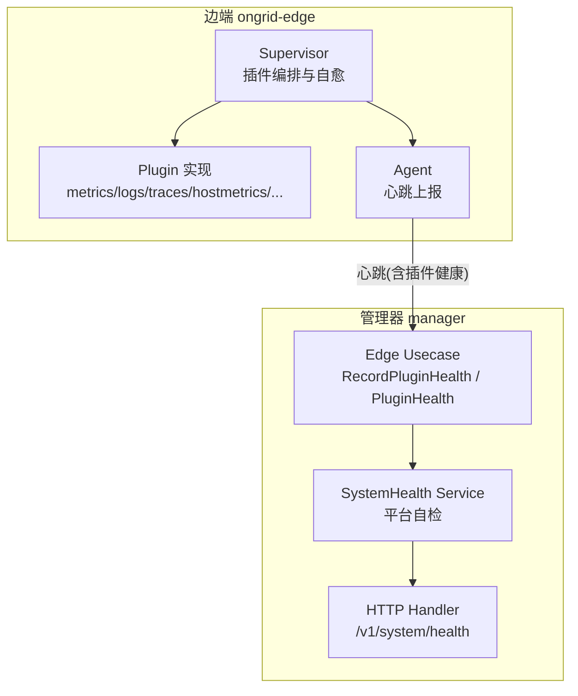
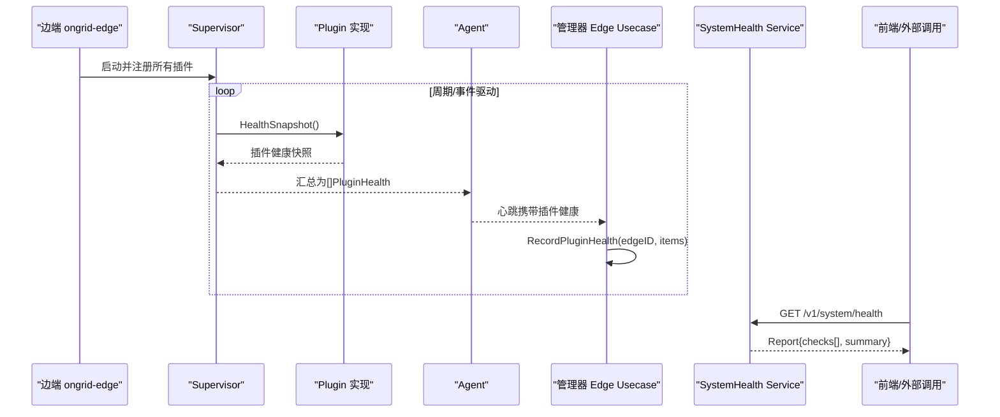
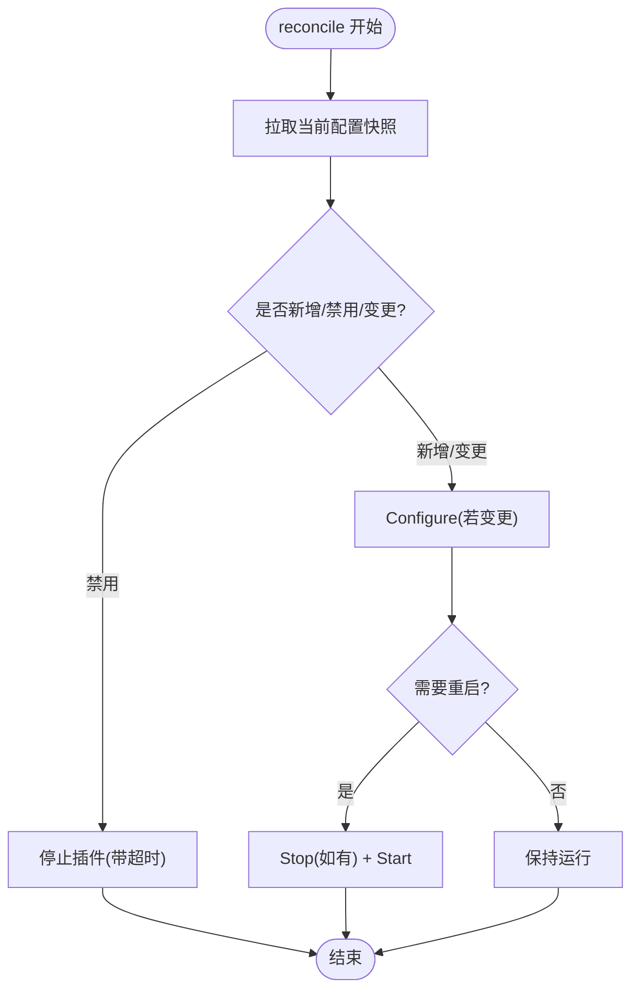
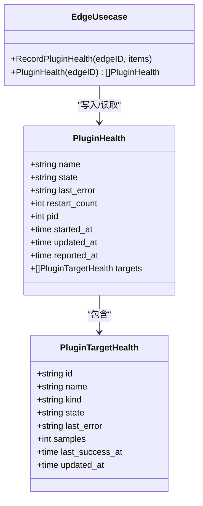
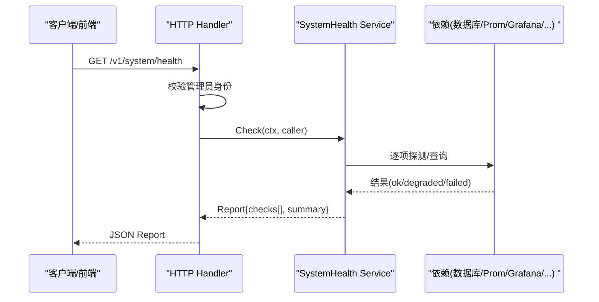
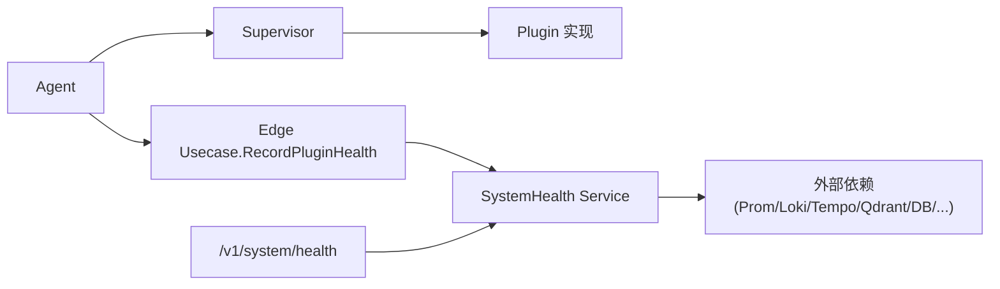

# 健康监控机制

<cite>
**本文引用的文件**   
- [supervisor.go](file://internal/edgeagent/plugins/supervisor.go)
- [plugin.go](file://internal/edgeagent/plugins/plugin.go)
- [main.go](file://cmd/ongrid-edge/main.go)
- [plugin_health.go](file://internal/manager/biz/edge/plugin_health.go)
- [service.go](file://internal/manager/service/systemhealth/service.go)
- [http.go](file://internal/manager/server/systemhealth/http.go)
- [analyze_database_status.go](file://internal/manager/biz/aiops/tools/analyze_database_status.go)
</cite>

## 目录
1. [简介](#简介)
2. [项目结构](#项目结构)
3. [核心组件](#核心组件)
4. [架构总览](#架构总览)
5. [详细组件分析](#详细组件分析)
6. [依赖关系分析](#依赖关系分析)
7. [性能与可靠性考量](#性能与可靠性考量)
8. [故障排查指南](#故障排查指南)
9. [结论](#结论)
10. [附录](#附录)

## 简介
本文件系统化阐述 OnGrid 插件健康监控机制，覆盖从边端插件运行态采集、心跳上报、管理器内存快照存储，到前端展示与系统健康检查的完整链路。重点说明 HealthSnapshot 数据结构、指标与性能统计字段、崩溃检测与自动重启策略、降级与告警触发条件、健康状态查询接口及仪表板集成方式，并给出持久化与历史趋势分析的扩展建议。

## 项目结构
健康监控涉及“边端插件运行时”和“管理器侧健康服务”两大模块：
- 边端（ongrid-edge）：Supervisor 负责插件生命周期管理、崩溃恢复、健康快照收集；Agent 在心跳中携带健康数据上报。
- 管理器（manager）：接收心跳中的插件健康快照，维护内存级缓存；提供系统健康检查 API，聚合平台自检项（数据库、Prometheus、Grafana、Loki、Tempo、Qdrant、Frontier、边缘代理、LLM/Embedding）。

图表来源
- [supervisor.go:93-110](file://internal/edgeagent/plugins/supervisor.go#L93-L110)
- [plugin.go:18-52](file://internal/edgeagent/plugins/plugin.go#L18-L52)
- [main.go:258-297](file://cmd/ongrid-edge/main.go#L258-L297)
- [plugin_health.go:36-70](file://internal/manager/biz/edge/plugin_health.go#L36-L70)
- [service.go:132-154](file://internal/manager/service/systemhealth/service.go#L132-L154)
- [http.go:30-50](file://internal/manager/server/systemhealth/http.go#L30-L50)

章节来源
- [supervisor.go:1-110](file://internal/edgeagent/plugins/supervisor.go#L1-L110)
- [plugin.go:1-119](file://internal/edgeagent/plugins/plugin.go#L1-L119)
- [main.go:199-305](file://cmd/ongrid-edge/main.go#L199-L305)
- [plugin_health.go:1-70](file://internal/manager/biz/edge/plugin_health.go#L1-L70)
- [service.go:1-164](file://internal/manager/service/systemhealth/service.go#L1-L164)
- [http.go:1-96](file://internal/manager/server/systemhealth/http.go#L1-L96)

## 核心组件
- 边端插件接口与状态
  - Plugin 接口定义 Configure/Start/Stop/HealthSnapshot 生命周期方法，以及统一的状态枚举 stopped/starting/running/crashed。
  - Supervisor 负责按配置启用/停止插件、变更重配、崩溃后重启、周期性收集健康快照。
- 边端心跳上报
  - Agent 通过 SetPluginHealthFn 将 Supervisor 的健康快照序列化为心跳载荷，随主机信息一起上报。
- 管理器健康快照存储
  - Edge Usecase 提供 RecordPluginHealth/PluginHealth，以内存 map 保存最近一次每个 edge 的插件健康快照，带 ReportedAt 时间戳用于显示“多久未更新”。
- 系统健康检查服务
  - SystemHealth Service 聚合多项平台自检（DB、Prom、Grafana、Loki、Tempo、Qdrant、Frontier、Alerts、Edges、LLM/Embedding），输出结构化报告。
- HTTP 暴露
  - 提供 GET/POST /v1/system/health 接口，仅管理员可访问，返回 Report 包含各 Check 的状态、消息与详情。

章节来源
- [plugin.go:18-106](file://internal/edgeagent/plugins/plugin.go#L18-L106)
- [supervisor.go:93-110](file://internal/edgeagent/plugins/supervisor.go#L93-L110)
- [main.go:258-297](file://cmd/ongrid-edge/main.go#L258-L297)
- [plugin_health.go:36-70](file://internal/manager/biz/edge/plugin_health.go#L36-L70)
- [service.go:132-154](file://internal/manager/service/systemhealth/service.go#L132-L154)
- [http.go:30-50](file://internal/manager/server/systemhealth/http.go#L30-L50)

## 架构总览
下图展示了健康数据的端到端流转：边端插件状态 → Supervisor 汇总 → Agent 心跳 → 管理器内存快照 → 系统健康检查与前端展示。

图表来源
- [supervisor.go:93-110](file://internal/edgeagent/plugins/supervisor.go#L93-L110)
- [plugin.go:47-52](file://internal/edgeagent/plugins/plugin.go#L47-L52)
- [main.go:258-297](file://cmd/ongrid-edge/main.go#L258-L297)
- [plugin_health.go:36-70](file://internal/manager/biz/edge/plugin_health.go#L36-L70)
- [service.go:132-154](file://internal/manager/service/systemhealth/service.go#L132-L154)
- [http.go:30-50](file://internal/manager/server/systemhealth/http.go#L30-L50)

## 详细组件分析

### 边端插件健康快照与自愈
- 健康快照结构
  - 插件级：名称、状态、最后错误、重启次数、PID、启动时间、更新时间、目标列表等。
  - 目标级（多源采集）：ID、名称、类型、状态、最后错误、样本数、最近成功时间、更新时间。
- 自愈与重启
  - Supervisor 在 reconcile 循环中对比期望配置与实际运行状态，必要时 Stop+Start；对子进程插件支持优雅停止与超时控制。
  - 崩溃检测由插件自身或 SubprocessPlugin 包装实现，状态置为 crashed 并在下次心跳上报。
- 健康上报
  - Agent 通过回调函数获取 Supervisor 的快照集合，序列化后随心跳发送。

图表来源
- [supervisor.go:135-230](file://internal/edgeagent/plugins/supervisor.go#L135-L230)
- [plugin.go:71-93](file://internal/edgeagent/plugins/plugin.go#L71-L93)
- [main.go:258-297](file://cmd/ongrid-edge/main.go#L258-L297)

章节来源
- [supervisor.go:1-276](file://internal/edgeagent/plugins/supervisor.go#L1-L276)
- [plugin.go:1-119](file://internal/edgeagent/plugins/plugin.go#L1-L119)
- [main.go:199-305](file://cmd/ongrid-edge/main.go#L199-L305)

### 管理器健康快照存储与读取
- 存储模型
  - PluginHealth/PluginTargetHealth 为轻量结构，仅保留最近一次快照，重启即清空，心跳间隔内重新填充。
- 写入与读取
  - RecordPluginHealth 在收到心跳时覆写该 edge 的快照，并打上 ReportedAt（管理器时钟）。
  - PluginHealth 返回深拷贝快照供上层使用。
- 用途
  - 面向操作员的可见性：将“日志插件静默无数据”转化为“logs: crashed — 子进程二进制缺失”，并附带重启次数与错误原因。

图表来源
- [plugin_health.go:11-34](file://internal/manager/biz/edge/plugin_health.go#L11-L34)
- [plugin_health.go:36-70](file://internal/manager/biz/edge/plugin_health.go#L36-L70)

章节来源
- [plugin_health.go:1-70](file://internal/manager/biz/edge/plugin_health.go#L1-L70)

### 系统健康检查与对外接口
- 检查项
  - Manager API、Database、Prometheus、Grafana、Loki、Tempo、Qdrant、Frontier、Alert engine、Edge agents、LLM provider、Embedding provider。
- 判定逻辑
  - 每项返回 ok/degraded/failed/unknown，整体状态遵循 failed > degraded > unknown > ok 优先级。
- 接口
  - GET/POST /v1/system/health，需管理员权限，返回 Report 包含 checks[] 与 summary。

图表来源
- [http.go:30-50](file://internal/manager/server/systemhealth/http.go#L30-L50)
- [service.go:132-154](file://internal/manager/service/systemhealth/service.go#L132-L154)
- [service.go:388-443](file://internal/manager/service/systemhealth/service.go#L388-L443)

章节来源
- [service.go:1-443](file://internal/manager/service/systemhealth/service.go#L1-L443)
- [http.go:1-96](file://internal/manager/server/systemhealth/http.go#L1-L96)

### 健康数据在业务工具中的融合
- 数据库诊断工具在生成数据库状态时，会关联对应 edge 的插件健康快照，补充 health_state、last_error、samples 等，并基于状态生成发现项（如“采集源未运行”、“正在启动”等）。

章节来源
- [analyze_database_status.go:839-896](file://internal/manager/biz/aiops/tools/analyze_database_status.go#L839-L896)

## 依赖关系分析
- 边端
  - Supervisor 依赖 ConfigFetcher 获取插件配置；依赖具体 Plugin 实现进行生命周期管理与健康快照。
  - Agent 依赖 Supervisor 提供的 HealthSnapshots 回调，将其纳入心跳。
- 管理器
  - Edge Usecase 依赖心跳通道接收插件健康；SystemHealth Service 依赖多个外部能力（DB、Prom、Grafana、Loki、Tempo、Qdrant、Alert、Edges、LLM/Embedding）。
  - HTTP Handler 依赖租户上下文与鉴权中间件，确保仅管理员可访问健康接口。

图表来源
- [supervisor.go:93-110](file://internal/edgeagent/plugins/supervisor.go#L93-L110)
- [main.go:258-297](file://cmd/ongrid-edge/main.go#L258-L297)
- [plugin_health.go:36-70](file://internal/manager/biz/edge/plugin_health.go#L36-L70)
- [service.go:132-154](file://internal/manager/service/systemhealth/service.go#L132-L154)
- [http.go:30-50](file://internal/manager/server/systemhealth/http.go#L30-L50)

章节来源
- [supervisor.go:1-276](file://internal/edgeagent/plugins/supervisor.go#L1-L276)
- [plugin.go:1-119](file://internal/edgeagent/plugins/plugin.go#L1-L119)
- [main.go:199-305](file://cmd/ongrid-edge/main.go#L199-L305)
- [plugin_health.go:1-70](file://internal/manager/biz/edge/plugin_health.go#L1-L70)
- [service.go:1-443](file://internal/manager/service/systemhealth/service.go#L1-L443)
- [http.go:1-96](file://internal/manager/server/systemhealth/http.go#L1-L96)

## 性能与可靠性考量
- 心跳频率与时效性
  - 管理器记录 ReportedAt 以便 UI 显示“多久未更新”，避免边端时钟偏差影响判断。
- 并发安全
  - 管理器侧读写快照使用互斥锁保护；Supervisor 内部对插件集合与运行态也加锁。
- 资源占用
  - 健康快照为轻量结构，仅在内存中保留最近一次；Supervisor 的 reconcile 周期默认 60s，避免频繁拉取配置。
- 崩溃恢复
  - 子进程插件具备优雅停止与超时控制；配置变更后按需重启，减少不必要的抖动。

[本节为通用指导，不直接分析具体文件]

## 故障排查指南
- 插件状态异常
  - 查看插件的 State 与 LastError，确认是否为 crashed/starting/stopped；结合 RestartCount 判断是否频繁重启。
  - 对于多目标采集插件，关注 Targets 的 Samples 与 LastSuccessAt，定位具体采集源问题。
- 系统健康检查失败
  - 通过 /v1/system/health 获取各项 Check 的 message 与 details，快速定位 DB/Prom/Grafana/Loki/Tempo/Qdrant/Frontier/Alerts/Edges/LLM/Embedding 的具体问题。
- 前端展示
  - 设置页健康面板会展开异常项的详细信息，包括耗时与键值细节，便于快速诊断。

章节来源
- [plugin_health.go:11-34](file://internal/manager/biz/edge/plugin_health.go#L11-L34)
- [service.go:388-443](file://internal/manager/service/systemhealth/service.go#L388-L443)

## 结论
OnGrid 插件健康监控以“边端采集 + 心跳上报 + 管理器内存快照 + 系统健康检查”为核心路径，实现了从插件运行态到平台级健康可视化的闭环。当前设计强调轻量与实时，适合运维人员快速定位问题；后续可在持久化与趋势分析方面进一步增强，以满足更长期的容量规划与根因回溯需求。

[本节为总结性内容，不直接分析具体文件]

## 附录

### 数据结构要点
- 插件健康（边端/管理器共享语义）
  - 名称、状态、最后错误、重启次数、PID、启动时间、更新时间、目标列表。
- 目标健康（多源采集）
  - ID、名称、类型、状态、最后错误、样本数、最近成功时间、更新时间。
- 系统健康报告
  - 总体状态、检查时间、摘要计数、检查项列表（ID/分组/标签/状态/消息/详情/耗时）。

章节来源
- [plugin.go:71-106](file://internal/edgeagent/plugins/plugin.go#L71-L106)
- [plugin_health.go:11-34](file://internal/manager/biz/edge/plugin_health.go#L11-L34)
- [service.go:28-50](file://internal/manager/service/systemhealth/service.go#L28-L50)

### 健康检查规则、阈值与告警触发
- 系统健康检查
  - 采用 ok/degraded/failed/unknown 四级状态，整体遵循“有失败则失败，否则有降级则降级，否则未知，否则正常”的优先级。
- 插件健康
  - 当前未见内置阈值与自动告警逻辑；可通过 Prometheus 规则或 Alert 引擎对上报指标（如 last_scrape_samples、restart_count）设定阈值触发告警。
- 示例参考
  - 数据库诊断工具根据插件健康状态生成发现项（如“采集源未运行”、“正在启动”），可作为告警条件的输入。

章节来源
- [service.go:414-443](file://internal/manager/service/systemhealth/service.go#L414-L443)
- [analyze_database_status.go:839-896](file://internal/manager/biz/aiops/tools/analyze_database_status.go#L839-L896)

### 健康状态查询接口与仪表板集成
- 接口
  - GET/POST /v1/system/health，管理员权限，返回 Report。
- 仪表板
  - 前端设置页健康面板可直接消费该接口，展示各项状态与详情；也可对接 Grafana 自定义面板，将关键指标（如插件重启次数、目标样本数）作为可视化维度。

章节来源
- [http.go:30-50](file://internal/manager/server/systemhealth/http.go#L30-L50)
- [service.go:132-154](file://internal/manager/service/systemhealth/service.go#L132-L154)

### 健康数据持久化与历史趋势分析（扩展建议）
- 现状
  - 插件健康快照为内存级、易失性存储，重启后丢失；系统健康检查为即时探测，不持久化。
- 建议方案
  - 将每次心跳中的插件健康快照落盘（例如写入时序库或对象存储），保留 ReportedAt/UpdatedAt 用于计算新鲜度与趋势。
  - 对关键指标（restart_count、last_scrape_samples、last_error 出现频次）建立时序指标，配合 PromQL 做趋势分析与容量规划。
  - 系统健康检查可定期执行并归档，形成平台健康基线，辅助变更回滚与发布验证。

[本节为概念性扩展建议，不直接分析具体文件]