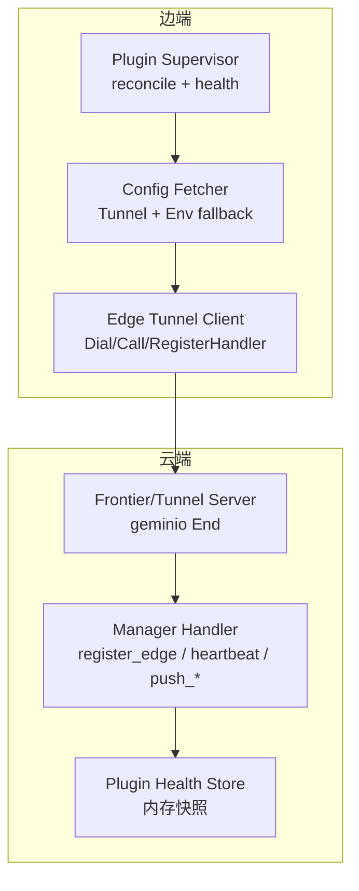
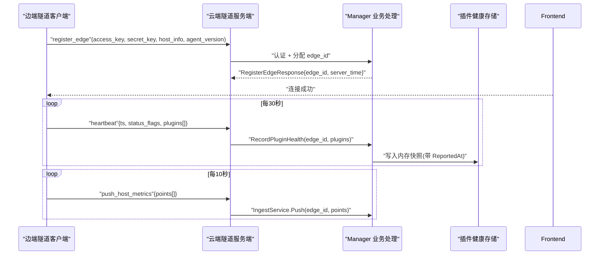
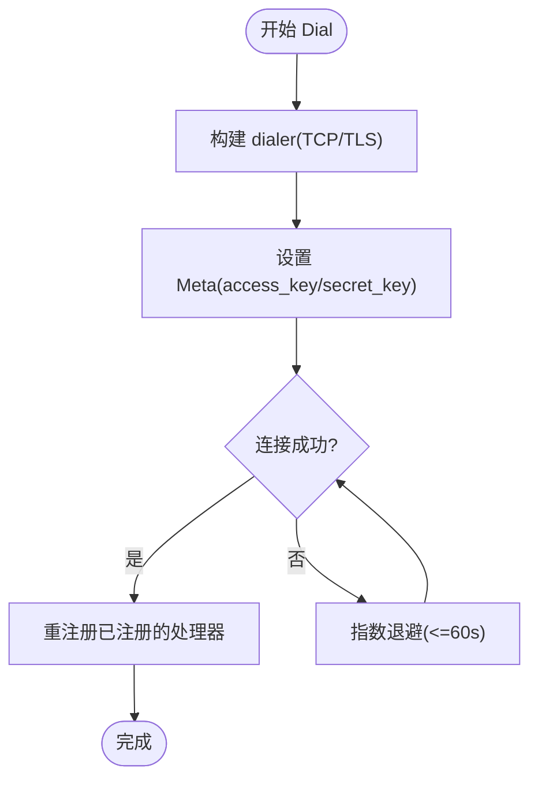
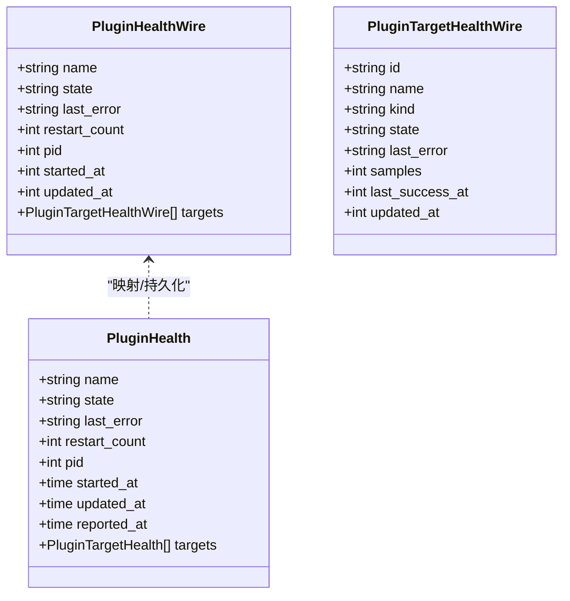
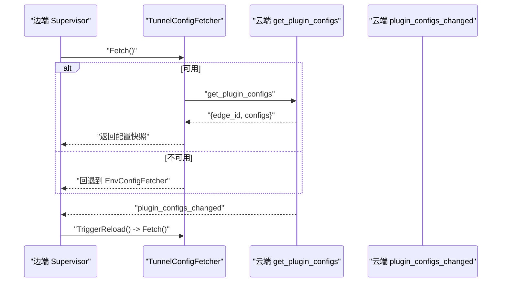
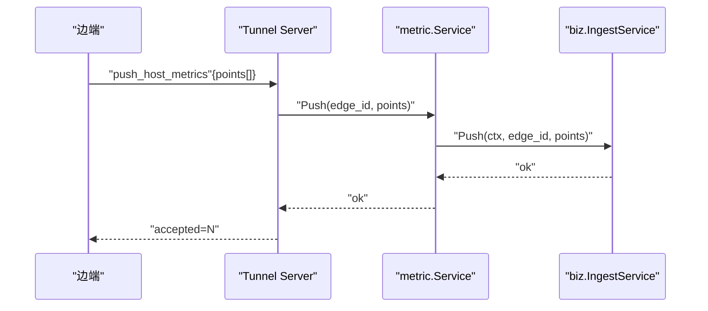
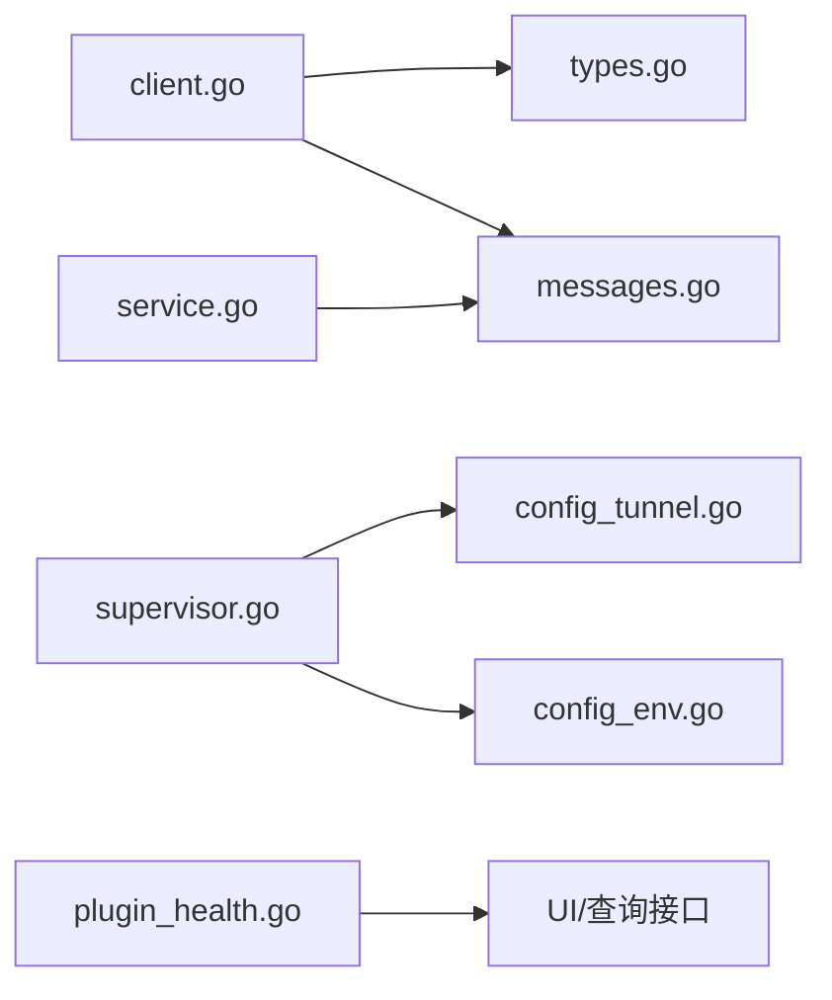

# 插件通信协议

<cite>
**本文引用的文件**   
- [tunnel.proto](file://api/tunnel/v1/tunnel.proto)
- [messages.go](file://internal/pkg/tunnel/messages.go)
- [types.go](file://internal/pkg/tunnel/types.go)
- [client.go](file://internal/pkg/tunnel/client.go)
- [host_files.go](file://internal/pkg/tunnel/host_files.go)
- [bash.go](file://internal/pkg/tunnel/bash.go)
- [config_tunnel.go](file://internal/edgeagent/plugins/config_tunnel.go)
- [config_env.go](file://internal/edgeagent/plugins/config_env.go)
- [supervisor.go](file://internal/edgeagent/plugins/supervisor.go)
- [plugin_health.go](file://internal/manager/biz/edge/plugin_health.go)
- [service.go](file://internal/manager/service/metric/service.go)
- [main.go](file://cmd/ongrid/main.go)
</cite>

## 目录
1. [简介](#简介)
2. [项目结构](#项目结构)
3. [核心组件](#核心组件)
4. [架构总览](#架构总览)
5. [详细组件分析](#详细组件分析)
6. [依赖关系分析](#依赖关系分析)
7. [性能与可靠性](#性能与可靠性)
8. [故障排查指南](#故障排查指南)
9. [结论](#结论)
10. [附录：消息规范与示例](#附录消息规范与示例)

## 简介
本文件系统化阐述 OnGrid 插件通信协议，覆盖插件与云端管理器之间的连接建立、认证授权、数据加密、心跳与健康检查、配置拉取与推送、指标上报、日志与事件通知等。文档同时给出关键消息的序列化/反序列化约定、网络配置项、超时与重试策略，以及可观测性（日志、指标、事件）机制说明。

## 项目结构
与插件通信协议直接相关的代码主要分布在以下位置：
- API 定义：api/tunnel/v1/tunnel.proto（JSON wire 格式，MVP 阶段）
- 客户端与服务端通用类型与方法名：internal/pkg/tunnel/messages.go、types.go
- 边端隧道客户端实现（重连、TLS、Call/RegisterHandler/AcceptStream）：internal/pkg/tunnel/client.go
- 扩展 RPC 方法（主机文件、Bash 执行、WebSSH 等）：internal/pkg/tunnel/host_files.go、bash.go
- 插件侧配置获取（TunnelConfigFetcher + EnvConfigFetcher 回退）：internal/edgeagent/plugins/config_tunnel.go、config_env.go
- 插件生命周期与健康快照：internal/edgeagent/plugins/supervisor.go
- 云端插件健康记录：internal/manager/biz/edge/plugin_health.go
- 云端指标服务层（tunnel → biz）：internal/manager/service/metric/service.go
- 启动装配与管线评估器（含边缘可见性指标更新）：cmd/ongrid/main.go

图表来源
- [client.go:62-141](file://internal/pkg/tunnel/client.go#L62-L141)
- [messages.go:17-80](file://internal/pkg/tunnel/messages.go#L17-L80)
- [supervisor.go:112-133](file://internal/edgeagent/plugins/supervisor.go#L112-L133)
- [config_tunnel.go:12-34](file://internal/edgeagent/plugins/config_tunnel.go#L12-L34)
- [plugin_health.go:36-70](file://internal/manager/biz/edge/plugin_health.go#L36-L70)

章节来源
- [tunnel.proto:1-166](file://api/tunnel/v1/tunnel.proto#L1-L166)
- [messages.go:1-514](file://internal/pkg/tunnel/messages.go#L1-L514)
- [types.go:1-120](file://internal/pkg/tunnel/types.go#L1-L120)
- [client.go:1-379](file://internal/pkg/tunnel/client.go#L1-L379)
- [host_files.go:1-222](file://internal/pkg/tunnel/host_files.go#L1-L222)
- [bash.go:1-72](file://internal/pkg/tunnel/bash.go#L1-L72)
- [config_tunnel.go:1-34](file://internal/edgeagent/plugins/config_tunnel.go#L1-L34)
- [config_env.go:1-101](file://internal/edgeagent/plugins/config_env.go#L1-L101)
- [supervisor.go:1-276](file://internal/edgeagent/plugins/supervisor.go#L1-L276)
- [plugin_health.go:1-71](file://internal/manager/biz/edge/plugin_health.go#L1-L71)
- [service.go:1-48](file://internal/manager/service/metric/service.go#L1-L48)
- [main.go:1052-1065](file://cmd/ongrid/main.go#L1052-L1065)

## 核心组件
- 隧道客户端（Edge）
  - Dial：指数退避重连，携带 Meta(access_key/secret_key)，支持 TLS CA 校验
  - RegisterHandler：注册云→边的 RPC 处理器
  - Call：调用云→边或边→云的 JSON-RPC 风格方法
  - AcceptStream：接受双向流（如 WebSSH）
  - OnReconnect：重连后回调（用于重新 register_edge）
- 云端隧道服务端（Frontier/Manager）
  - 基于 geminio End 接收请求，按 method 分发到对应 handler
  - 认证：从 Meta 解析 access_key/secret_key，验证并绑定 Session(edge_id)
- 插件配置获取
  - TunnelConfigFetcher：通过 get_plugin_configs 拉取全量配置
  - EnvConfigFetcher：环境变量驱动的配置快照（冷启动/不可达时的回退）
- 插件生命周期与健康
  - Supervisor：周期性 reconcile，按需 start/stop/reconfigure
  - Heartbeat：边→云上报插件健康快照（state、last_error、targets）
- 指标上报
  - push_host_metrics：批量主机指标点
  - push_prom_samples：开放集 Prometheus 样本（新边直写 Prom）

章节来源
- [types.go:33-106](file://internal/pkg/tunnel/types.go#L33-L106)
- [client.go:62-141](file://internal/pkg/tunnel/client.go#L62-L141)
- [client.go:218-243](file://internal/pkg/tunnel/client.go#L218-L243)
- [messages.go:258-270](file://internal/pkg/tunnel/messages.go#L258-L270)
- [messages.go:280-320](file://internal/pkg/tunnel/messages.go#L280-L320)
- [messages.go:326-349](file://internal/pkg/tunnel/messages.go#L326-L349)
- [messages.go:365-377](file://internal/pkg/tunnel/messages.go#L365-L377)
- [config_tunnel.go:12-34](file://internal/edgeagent/plugins/config_tunnel.go#L12-L34)
- [config_env.go:10-71](file://internal/edgeagent/plugins/config_env.go#L10-L71)
- [supervisor.go:112-133](file://internal/edgeagent/plugins/supervisor.go#L112-L133)
- [plugin_health.go:36-70](file://internal/manager/biz/edge/plugin_health.go#L36-L70)
- [service.go:37-48](file://internal/manager/service/metric/service.go#L37-L48)

## 架构总览
OnGrid 使用 geminio 作为传输层，MVP 阶段以 JSON 为线格式，method 命名式路由。边端在首次连接时发送 register_edge，随后每 30s 发送 heartbeat，附带插件健康；每 10s 批量上报主机指标；新边可通过 push_prom_samples 将指标写入后端存储。

图表来源
- [messages.go:258-270](file://internal/pkg/tunnel/messages.go#L258-L270)
- [messages.go:280-320](file://internal/pkg/tunnel/messages.go#L280-L320)
- [messages.go:326-349](file://internal/pkg/tunnel/messages.go#L326-L349)
- [plugin_health.go:36-70](file://internal/manager/biz/edge/plugin_health.go#L36-L70)
- [service.go:37-48](file://internal/manager/service/metric/service.go#L37-L48)

## 详细组件分析

### 连接建立与认证授权
- 连接建立
  - 边端 Dial 构建 dialer（TCP 或 TLS），设置 Meta(JSON: access_key/secret_key)
  - 指数退避重连（1s~60s），失败持续重试
- 认证授权
  - 服务端从 Meta 解析凭据，调用 AuthFunc 验证并返回 Session(edge_id)
  - 后续所有 RPC 均基于该会话上下文进行鉴权与路由
- 错误处理
  - 认证失败在网络层表现为连接关闭，客户端继续重试并告警

图表来源
- [client.go:62-141](file://internal/pkg/tunnel/client.go#L62-L141)
- [client.go:143-176](file://internal/pkg/tunnel/client.go#L143-L176)
- [types.go:26-31](file://internal/pkg/tunnel/types.go#L26-L31)

章节来源
- [client.go:62-141](file://internal/pkg/tunnel/client.go#L62-L141)
- [client.go:143-176](file://internal/pkg/tunnel/client.go#L143-L176)
- [types.go:26-31](file://internal/pkg/tunnel/types.go#L26-L31)

### 数据加密与传输协议
- 传输协议
  - 基于 geminio 的 JSON-RPC 风格：method 字符串 + JSON body
  - MVP 使用 JSON；未来可切换为 proto 二进制
- 数据加密
  - 可选 TLS（提供 CA PEM 启用），最小版本 TLS 1.2
  - 无应用层加解密；安全边界由 TLS 与认证保证

章节来源
- [tunnel.proto:1-6](file://api/tunnel/v1/tunnel.proto#L1-L6)
- [client.go:143-176](file://internal/pkg/tunnel/client.go#L143-L176)
- [messages.go:1-14](file://internal/pkg/tunnel/messages.go#L1-L14)

### 插件健康检查、心跳与故障检测
- 心跳
  - 边端每 30s 发送 heartbeat，包含 ts、status_flags、plugins[]
  - 云端 RecordPluginHealth 写入内存快照，标注 ReportedAt
- 插件健康
  - 每个插件上报 state(last_error、restart_count、pid、started_at、updated_at)
  - 多目标插件支持 targets[]（子源级健康）
- 故障检测
  - 云端 UI 根据 ReportedAt 判断“过期”
  - LastError 提供人类可读原因（如“子进程二进制缺失”）

图表来源
- [messages.go:287-316](file://internal/pkg/tunnel/messages.go#L287-L316)
- [plugin_health.go:11-34](file://internal/manager/biz/edge/plugin_health.go#L11-L34)

章节来源
- [messages.go:280-320](file://internal/pkg/tunnel/messages.go#L280-L320)
- [plugin_health.go:36-70](file://internal/manager/biz/edge/plugin_health.go#L36-L70)

### 配置拉取与推送（插件配置）
- 拉取
  - 边端启动/收到变更通知/每 60s 安全轮询，调用 get_plugin_configs
  - 返回 edge_id 与 configs map（每个插件 enabled/endpoint/spec）
- 推送
  - 云端主动推送 plugin_configs_changed（空体），边端触发 re-fetch
- 回退
  - 当 tunnel 不可用，EnvConfigFetcher 从环境变量读取配置，保障默认运行

图表来源
- [messages.go:29-41](file://internal/pkg/tunnel/messages.go#L29-L41)
- [config_tunnel.go:12-34](file://internal/edgeagent/plugins/config_tunnel.go#L12-L34)
- [config_env.go:10-71](file://internal/edgeagent/plugins/config_env.go#L10-L71)
- [supervisor.go:84-92](file://internal/edgeagent/plugins/supervisor.go#L84-L92)

章节来源
- [messages.go:29-41](file://internal/pkg/tunnel/messages.go#L29-L41)
- [config_tunnel.go:12-34](file://internal/edgeagent/plugins/config_tunnel.go#L12-L34)
- [config_env.go:10-71](file://internal/edgeagent/plugins/config_env.go#L10-L71)
- [supervisor.go:84-92](file://internal/edgeagent/plugins/supervisor.go#L84-L92)

### 指标上报与处理
- 主机指标
  - push_host_metrics：批量 HostMetricPoint（cpu/mem/load/net/disk）
  - 云端 Service.Push 转发至 biz.IngestService
- Prometheus 样本
  - push_prom_samples：开放集样本（name/labels/value/ts_ms），source 标识来源
  - 新边直写 Prom，不再走内联评估器
- 兼容性与降级
  - 旧边仍可使用 push_host_metrics，云端 noop ingester 仅做接受以便边端退避

图表来源
- [messages.go:326-349](file://internal/pkg/tunnel/messages.go#L326-L349)
- [service.go:37-48](file://internal/manager/service/metric/service.go#L37-L48)
- [main.go:1052-1065](file://cmd/ongrid/main.go#L1052-L1065)

章节来源
- [messages.go:326-349](file://internal/pkg/tunnel/messages.go#L326-L349)
- [service.go:37-48](file://internal/manager/service/metric/service.go#L37-L48)
- [main.go:1052-1065](file://cmd/ongrid/main.go#L1052-L1065)

### 其他能力通道（文件/Bash/WebSSH/升级）
- 主机文件工具：find_large_files、du_summary、stat_file（批处理、逐路径错误隔离）
- Bash 执行：read-only 策略 + 可选 unrestricted 模式（管理员门控）
- WebSSH：manager→edge 打开 session，stdin/stdout 分帧传输
- Agent 升级：fetch_package + apply_package 两阶段原子替换

章节来源
- [host_files.go:24-222](file://internal/pkg/tunnel/host_files.go#L24-L222)
- [bash.go:13-72](file://internal/pkg/tunnel/bash.go#L13-L72)
- [messages.go:43-80](file://internal/pkg/tunnel/messages.go#L43-L80)

## 依赖关系分析
- 边端
  - client.go 依赖 types.go（Client/AuthFunc/Session）、messages.go（方法名与消息体）
  - supervisor.go 依赖 config_tunnel.go/config_env.go（配置来源）
- 云端
  - service.go 依赖 messages.go（HostMetricPoint 形状）
  - plugin_health.go 维护内存快照供 UI 展示

图表来源
- [client.go:1-379](file://internal/pkg/tunnel/client.go#L1-L379)
- [types.go:1-120](file://internal/pkg/tunnel/types.go#L1-L120)
- [messages.go:1-514](file://internal/pkg/tunnel/messages.go#L1-L514)
- [supervisor.go:1-276](file://internal/edgeagent/plugins/supervisor.go#L1-L276)
- [config_tunnel.go:1-34](file://internal/edgeagent/plugins/config_tunnel.go#L1-L34)
- [config_env.go:1-101](file://internal/edgeagent/plugins/config_env.go#L1-L101)
- [service.go:1-48](file://internal/manager/service/metric/service.go#L1-L48)
- [plugin_health.go:1-71](file://internal/manager/biz/edge/plugin_health.go#L1-L71)

章节来源
- [client.go:1-379](file://internal/pkg/tunnel/client.go#L1-L379)
- [types.go:1-120](file://internal/pkg/tunnel/types.go#L1-L120)
- [messages.go:1-514](file://internal/pkg/tunnel/messages.go#L1-L514)
- [supervisor.go:1-276](file://internal/edgeagent/plugins/supervisor.go#L1-L276)
- [config_tunnel.go:1-34](file://internal/edgeagent/plugins/config_tunnel.go#L1-L34)
- [config_env.go:1-101](file://internal/edgeagent/plugins/config_env.go#L1-L101)
- [service.go:1-48](file://internal/manager/service/metric/service.go#L1-L48)
- [plugin_health.go:1-71](file://internal/manager/biz/edge/plugin_health.go#L1-L71)

## 性能与可靠性
- 连接与重连
  - 指数退避（1s~60s），后台 goroutine 自动重连；检测到路由失效会触发快速重拨
- 超时与重试
  - Dial 超时 10s；Call 错误可能触发异步重连；OnReconnect 回调用于恢复状态
- 指标吞吐
  - 主机指标批量上报（ring-buffered 边端聚合）；Prom 样本开放集直写
- 健壮性
  - 配置获取失败不中断现有运行（Supervisor 保持上次已知良好状态）
  - 插件停止/重启有 30s 宽限期，避免长时间阻塞

章节来源
- [client.go:62-141](file://internal/pkg/tunnel/client.go#L62-L141)
- [client.go:258-331](file://internal/pkg/tunnel/client.go#L258-L331)
- [supervisor.go:135-230](file://internal/edgeagent/plugins/supervisor.go#L135-L230)
- [messages.go:339-349](file://internal/pkg/tunnel/messages.go#L339-L349)

## 故障排查指南
- 连接失败
  - 检查 ServerAddr/CloudAddr、TLSCAFile、access_key/secret_key 是否正确
  - 观察 Dial 失败日志与退避间隔
- 认证失败
  - 确认云端 AccessKeyAuthenticator 能匹配到有效 edge_id
- 配置未生效
  - 确认 get_plugin_configs 是否可达；必要时查看 EnvConfigFetcher 回退结果
- 插件崩溃
  - 查看 heartbeat 中 last_error 与 state；关注 RestartCount 与 PID
- 指标未入库
  - 检查 push_host_metrics/push_prom_samples 的 accepted 计数；确认后端存储连通性

章节来源
- [client.go:143-176](file://internal/pkg/tunnel/client.go#L143-L176)
- [client.go:218-243](file://internal/pkg/tunnel/client.go#L218-L243)
- [messages.go:280-320](file://internal/pkg/tunnel/messages.go#L280-L320)
- [config_tunnel.go:12-34](file://internal/edgeagent/plugins/config_tunnel.go#L12-L34)
- [config_env.go:10-71](file://internal/edgeagent/plugins/config_env.go#L10-L71)

## 结论
OnGrid 插件通信协议以 geminio 为传输层、JSON 为线格式，采用 method 命名路由。边端负责连接管理、认证、心跳与指标上报；云端负责认证、健康记录与指标落库。通过配置拉取/推送与回退机制，系统具备高可用与易运维特性。

## 附录：消息规范与示例
- 方法名常量（节选）
  - register_edge、heartbeat、push_host_metrics、push_prom_samples、get_host_load、get_process_list、get_netstat、execute_skill、get_plugin_configs、plugin_configs_changed、write_database_metrics_secret、shell_open/input/resize/close/output/exit、agent_upgrade、fetch_package、apply_package
- 关键消息字段（节选）
  - RegisterEdgeRequest：access_key、secret_key、host_info、agent_version
  - HeartbeatRequest：ts、status_flags、plugins[]
  - PushHostMetricsRequest：points[]
  - PushPromSamplesRequest：edge_id、source、samples[]
  - GetPluginConfigsResponse：edge_id、configs{}
  - WriteDatabaseMetricsSecretRequest：source_id、path、content、credentials、preserve_password、delete
- 序列化约定
  - JSON 键名与 proto json_name 保持一致；时间戳使用 unix 秒/毫秒（依具体消息）
- 示例路径（不含代码内容）
  - 注册与心跳：[messages.go:258-320](file://internal/pkg/tunnel/messages.go#L258-L320)
  - 主机指标：[messages.go:326-349](file://internal/pkg/tunnel/messages.go#L326-L349)
  - Prometheus 样本：[messages.go:365-377](file://internal/pkg/tunnel/messages.go#L365-L377)
  - 插件配置：[messages.go:154-192](file://internal/pkg/tunnel/messages.go#L154-L192)
  - 数据库指标密钥写入：[messages.go:169-192](file://internal/pkg/tunnel/messages.go#L169-L192)
  - WebSSH 帧：[messages.go:86-152](file://internal/pkg/tunnel/messages.go#L86-L152)
  - 主机文件工具：[host_files.go:40-222](file://internal/pkg/tunnel/host_files.go#L40-L222)
  - Bash 执行：[bash.go:21-72](file://internal/pkg/tunnel/bash.go#L21-L72)

章节来源
- [messages.go:17-80](file://internal/pkg/tunnel/messages.go#L17-L80)
- [messages.go:258-377](file://internal/pkg/tunnel/messages.go#L258-L377)
- [host_files.go:40-222](file://internal/pkg/tunnel/host_files.go#L40-L222)
- [bash.go:21-72](file://internal/pkg/tunnel/bash.go#L21-L72)