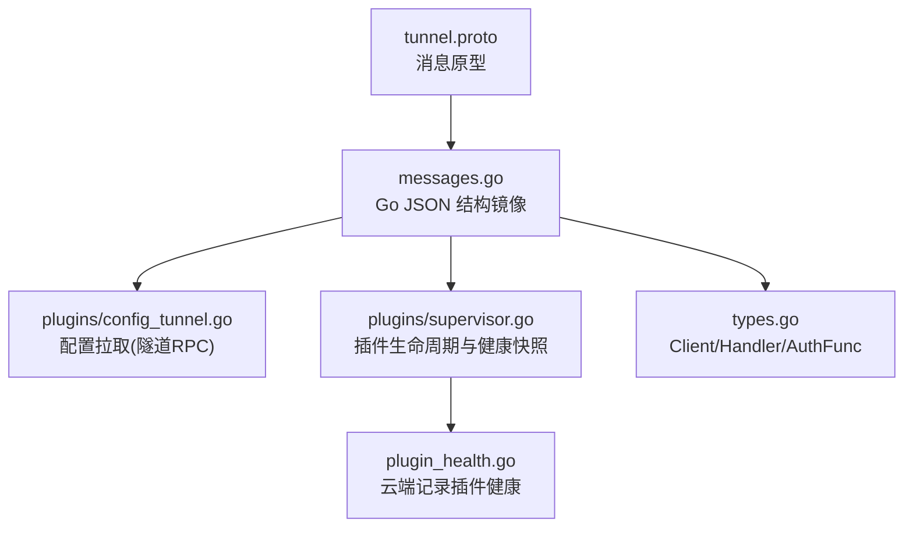
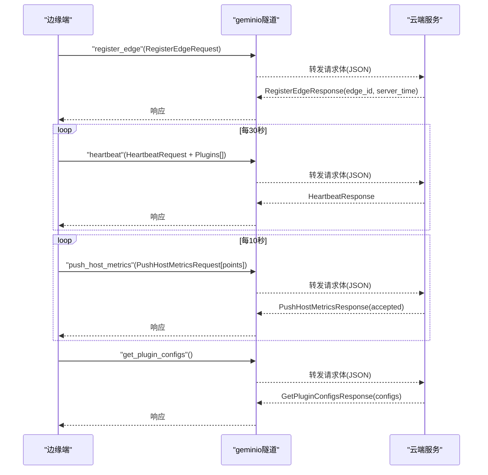
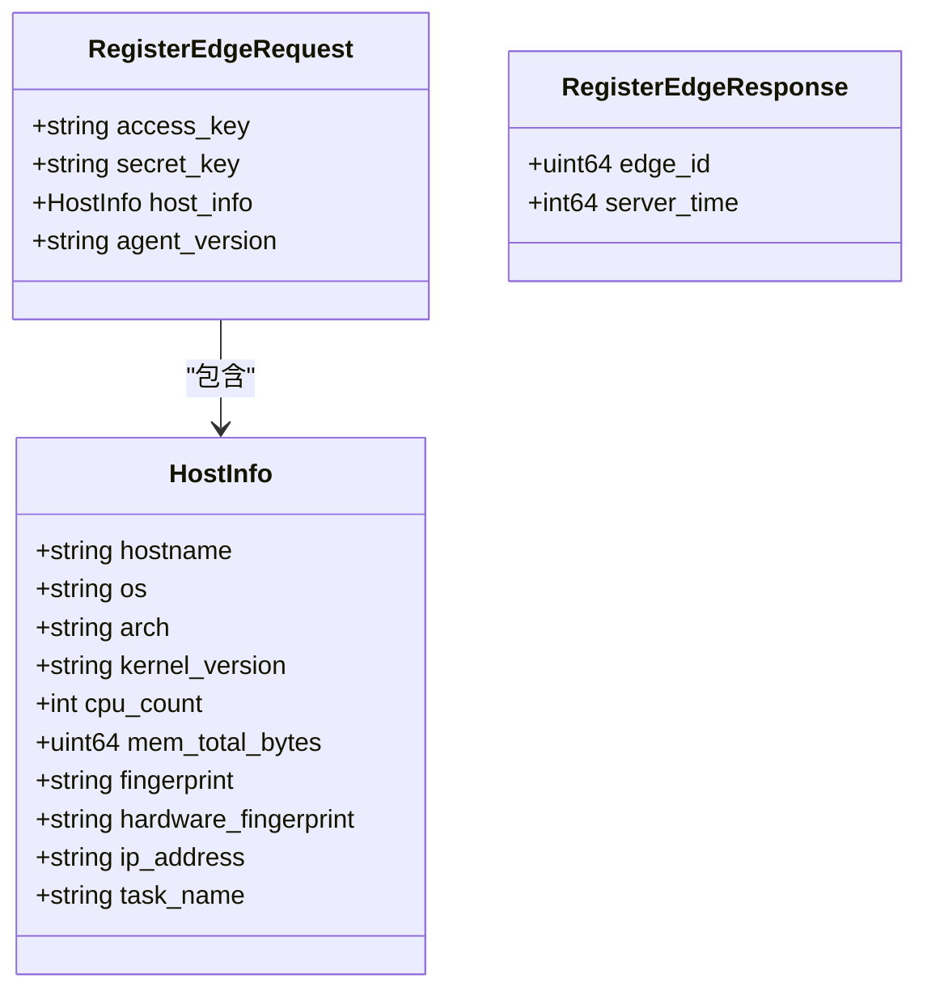
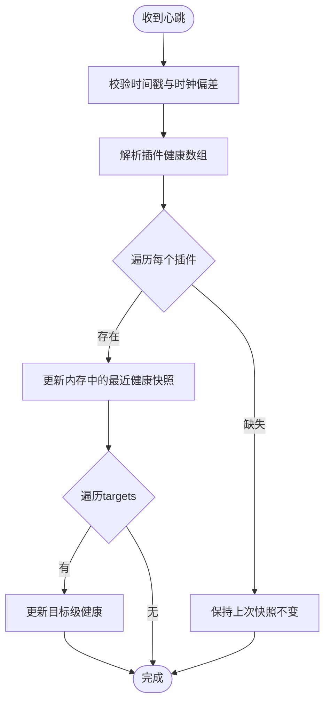
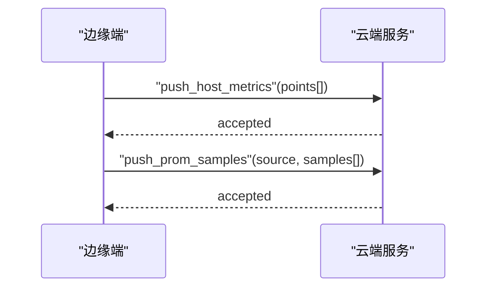
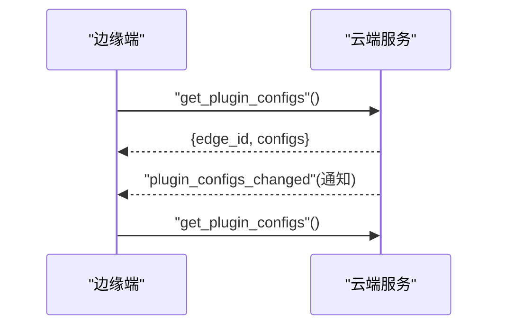

# 消息格式规范

<cite>
**本文引用的文件**   
- [api/tunnel/v1/tunnel.proto](file://api/tunnel/v1/tunnel.proto)
- [internal/pkg/tunnel/messages.go](file://internal/pkg/tunnel/messages.go)
- [internal/pkg/tunnel/types.go](file://internal/pkg/tunnel/types.go)
- [internal/edgeagent/plugins/plugin.go](file://internal/edgeagent/plugins/plugin.go)
- [internal/edgeagent/plugins/supervisor.go](file://internal/edgeagent/plugins/supervisor.go)
- [internal/edgeagent/plugins/config_tunnel.go](file://internal/edgeagent/plugins/config_tunnel.go)
- [internal/manager/biz/edge/plugin_health.go](file://internal/manager/biz/edge/plugin_health.go)
- [internal/manager/service/systemhealth/service.go](file://internal/manager/service/systemhealth/service.go)
</cite>

## 目录
1. [引言](#引言)
2. [项目结构](#项目结构)
3. [核心组件](#核心组件)
4. [架构总览](#架构总览)
5. [详细组件分析](#详细组件分析)
6. [依赖关系分析](#依赖关系分析)
7. [性能与传输特性](#性能与传输特性)
8. [故障排查指南](#故障排查指南)
9. [结论](#结论)
10. [附录：消息类型与字段定义](#附录消息类型与字段定义)

## 引言
本规范聚焦 OnGrid 插件通信的消息格式，覆盖边缘端（Edge）与云端（Manager）之间通过隧道协议交换的 JSON 消息。文档明确以下要点：
- 所有消息类型的 JSON 结构、字段含义与数据类型约束
- 序列化/反序列化规则、版本兼容性与向后兼容策略
- 健康检查、配置同步、指标上报、日志传输等关键场景的具体格式
- 消息验证规则与错误码约定
- 优先级、批量处理与流式传输机制

## 项目结构
OnGrid 的插件通信消息由“单一事实来源”的 proto 定义与 Go 侧手写 JSON 结构共同维护：
- api/tunnel/v1/tunnel.proto：定义隧道消息的权威原型（JSON 名称通过 json_name 固定）
- internal/pkg/tunnel/messages.go：Go 侧手写镜像结构，作为 MVP 阶段 JSON 编解码的唯一实现
- internal/pkg/tunnel/types.go：客户端/服务端会话、认证函数、调用接口等通用契约
- internal/edgeagent/plugins/*：插件运行时、Supervisor 生命周期、配置拉取（含隧道拉取）
- internal/manager/biz/edge/plugin_health.go：云端对心跳中插件健康数据的接收与缓存
- internal/manager/service/systemhealth/service.go：系统健康检查报告的数据模型（用于 UI 展示）

图表来源
- [api/tunnel/v1/tunnel.proto:1-166](file://api/tunnel/v1/tunnel.proto#L1-L166)
- [internal/pkg/tunnel/messages.go:1-514](file://internal/pkg/tunnel/messages.go#L1-L514)
- [internal/pkg/tunnel/types.go:1-120](file://internal/pkg/tunnel/types.go#L1-L120)
- [internal/edgeagent/plugins/config_tunnel.go:1-138](file://internal/edgeagent/plugins/config_tunnel.go#L1-L138)
- [internal/edgeagent/plugins/supervisor.go:1-276](file://internal/edgeagent/plugins/supervisor.go#L1-L276)
- [internal/manager/biz/edge/plugin_health.go:1-70](file://internal/manager/biz/edge/plugin_health.go#L1-L70)

章节来源
- [api/README.md:1-41](file://api/README.md#L1-L41)
- [api/tunnel/v1/tunnel.proto:1-166](file://api/tunnel/v1/tunnel.proto#L1-L166)
- [internal/pkg/tunnel/messages.go:1-514](file://internal/pkg/tunnel/messages.go#L1-L514)
- [internal/pkg/tunnel/types.go:1-120](file://internal/pkg/tunnel/types.go#L1-L120)

## 核心组件
- 隧道消息常量与方法名：统一在 messages.go 中以常量形式暴露，避免拼写错误并便于路由分发
- 握手与注册：register_edge（边→云），返回 edge_id 与服务器时间
- 心跳与健康：heartbeat（边→云），携带时间戳、状态位与插件健康快照
- 指标上报：push_host_metrics（边→云），批量主机指标点；push_prom_samples（边→云），开放集样本
- 查询类：get_host_load、get_process_list、get_netstat（云→边）
- 配置同步：get_plugin_configs（边→云）、plugin_configs_changed（云→边通知）
- 安全与升级：write_database_metrics_secret、agent_upgrade、fetch_package、apply_package
- WebSSH 流式通道：shell_open/shell_input/shell_resize/shell_close（管→边），shell_output/shell_exit（边→管）

章节来源
- [internal/pkg/tunnel/messages.go:15-80](file://internal/pkg/tunnel/messages.go#L15-L80)
- [internal/pkg/tunnel/messages.go:210-350](file://internal/pkg/tunnel/messages.go#L210-L350)
- [internal/pkg/tunnel/messages.go:351-503](file://internal/pkg/tunnel/messages.go#L351-L503)

## 架构总览
下图展示了 Edge 与 Manager 之间的主要消息交互流程，包括注册、心跳、指标上报与配置同步。

图表来源
- [internal/pkg/tunnel/messages.go:210-350](file://internal/pkg/tunnel/messages.go#L210-L350)
- [internal/pkg/tunnel/messages.go:351-400](file://internal/pkg/tunnel/messages.go#L351-L400)
- [internal/pkg/tunnel/messages.go:154-167](file://internal/pkg/tunnel/messages.go#L154-L167)

## 详细组件分析

### 握手与注册（register_edge）
- 方向：边→云
- 方法名："register_edge"
- 请求体关键字段：access_key、secret_key、host_info、agent_version
- 响应体关键字段：edge_id、server_time
- host_info 包含 hostname/os/arch/kernel_version/cpu_count/mem_total_bytes，以及可选 fingerprint/hardware_fingerprint/ip_address/task_name

图表来源
- [internal/pkg/tunnel/messages.go:213-270](file://internal/pkg/tunnel/messages.go#L213-L270)
- [api/tunnel/v1/tunnel.proto:21-60](file://api/tunnel/v1/tunnel.proto#L21-L60)

章节来源
- [internal/pkg/tunnel/messages.go:213-270](file://internal/pkg/tunnel/messages.go#L213-L270)
- [api/tunnel/v1/tunnel.proto:21-60](file://api/tunnel/v1/tunnel.proto#L21-L60)

### 心跳与健康（heartbeat）
- 方向：边→云
- 方法名："heartbeat"
- 请求体关键字段：ts（unix秒）、status_flags（map<string,string>）、plugins[]（插件健康快照）
- 插件健康快照字段：name/state/last_error/restart_count/pid/started_at/updated_at/targets[]
- 目标级健康 targets[]：id/name/kind/state/last_error/samples/last_success_at/updated_at

图表来源
- [internal/pkg/tunnel/messages.go:276-320](file://internal/pkg/tunnel/messages.go#L276-L320)
- [internal/manager/biz/edge/plugin_health.go:1-70](file://internal/manager/biz/edge/plugin_health.go#L1-L70)

章节来源
- [internal/pkg/tunnel/messages.go:276-320](file://internal/pkg/tunnel/messages.go#L276-L320)
- [internal/manager/biz/edge/plugin_health.go:1-70](file://internal/manager/biz/edge/plugin_health.go#L1-L70)

### 指标上报（push_host_metrics / push_prom_samples）
- push_host_metrics（边→云）
  - 请求体：edge_id（可选）、points[]（HostMetricPoint）
  - 响应体：accepted（已接受点数）
  - HostMetricPoint：ts(cpu_pct/mem_pct/load1/5/15/net_rx_bps/net_tx_bps/disk_used_pct)
- push_prom_samples（边→云）
  - 请求体：edge_id（可选）、source（字符串标识来源）、samples[]（PromSample）
  - PromSample：name、labels(map)、value、ts_ms（毫秒时间戳）
  - 响应体：accepted

图表来源
- [internal/pkg/tunnel/messages.go:326-377](file://internal/pkg/tunnel/messages.go#L326-L377)

章节来源
- [internal/pkg/tunnel/messages.go:326-377](file://internal/pkg/tunnel/messages.go#L326-L377)

### 配置同步（get_plugin_configs / plugin_configs_changed）
- get_plugin_configs（边→云）
  - 请求体：空
  - 响应体：edge_id、configs(map<string, entry>)
  - entry：enabled、endpoint、spec(map)
- plugin_configs_changed（云→边）
  - 通知型消息，请求体为空；边端收到后主动拉取最新配置

图表来源
- [internal/pkg/tunnel/messages.go:154-167](file://internal/pkg/tunnel/messages.go#L154-L167)
- [internal/pkg/tunnel/messages.go:29-36](file://internal/pkg/tunnel/messages.go#L29-L36)

章节来源
- [internal/pkg/tunnel/messages.go:154-167](file://internal/pkg/tunnel/messages.go#L154-L167)
- [internal/edgeagent/plugins/config_tunnel.go:54-108](file://internal/edgeagent/plugins/config_tunnel.go#L54-L108)

### 数据库指标凭据写入（write_database_metrics_secret(s)）
- write_database_metrics_secret（云→边）
  - 请求体：source_id、path、content/db_type/credentials/preserve_password/delete
- write_database_metrics_secrets（云→边）
  - 批量写入，请求体：secrets[]
- 响应体：ok

章节来源
- [internal/pkg/tunnel/messages.go:169-192](file://internal/pkg/tunnel/messages.go#L169-L192)

### 技能执行（execute_skill）
- execute_skill（云→边）
  - 请求体：key、params(json.RawMessage)
  - 响应体：result(json.RawMessage)/error

章节来源
- [internal/pkg/tunnel/messages.go:194-207](file://internal/pkg/tunnel/messages.go#L194-L207)

### WebSSH 流式通道（shell_*）
- 管→边：shell_open、shell_input、shell_resize、shell_close
- 边→管：shell_output、shell_exit
- 会话以 session_id 标识，支持多并发会话

章节来源
- [internal/pkg/tunnel/messages.go:86-152](file://internal/pkg/tunnel/messages.go#L86-L152)

### Agent 升级与包管理（agent_upgrade / fetch_package / apply_package）
- agent_upgrade（管→边）：url、sha256；响应 staged_path、bytes
- fetch_package（管→边）：url、sha256、version；响应 staged_path、bytes、manifest_files、version
- apply_package（管→边）：空体；响应 accepted

章节来源
- [internal/pkg/tunnel/messages.go:439-502](file://internal/pkg/tunnel/messages.go#L439-L502)

### 插件运行时与健康快照（插件侧）
- Plugin 接口：Name/Configure/Start/Stop/HealthSnapshot
- Supervisor：按周期拉取配置、对比差异、启动/停止/重载插件，收集 HealthSnapshot
- 健康快照映射到心跳中的 plugins[] 上报云端

章节来源
- [internal/edgeagent/plugins/plugin.go:18-106](file://internal/edgeagent/plugins/plugin.go#L18-L106)
- [internal/edgeagent/plugins/supervisor.go:94-110](file://internal/edgeagent/plugins/supervisor.go#L94-L110)

## 依赖关系分析
- tunnel.proto 是消息原型的唯一来源，messages.go 严格镜像其 json_name 以保持 JSON 一致性
- 插件侧通过 config_tunnel.go 使用隧道 RPC 拉取配置，并在失败时回退到环境变量配置
- 云端在 heartbeat 路径中记录插件健康，供前端展示

图表来源
- [api/tunnel/v1/tunnel.proto:1-166](file://api/tunnel/v1/tunnel.proto#L1-L166)
- [internal/pkg/tunnel/messages.go:1-514](file://internal/pkg/tunnel/messages.go#L1-L514)
- [internal/edgeagent/plugins/config_tunnel.go:1-138](file://internal/edgeagent/plugins/config_tunnel.go#L1-L138)
- [internal/edgeagent/plugins/supervisor.go:1-276](file://internal/edgeagent/plugins/supervisor.go#L1-L276)
- [internal/manager/biz/edge/plugin_health.go:1-70](file://internal/manager/biz/edge/plugin_health.go#L1-L70)

章节来源
- [api/README.md:1-41](file://api/README.md#L1-L41)
- [internal/pkg/tunnel/messages.go:1-14](file://internal/pkg/tunnel/messages.go#L1-L14)

## 性能与传输特性
- 批量上报：push_host_metrics 与 push_prom_samples 均支持批量，减少往返开销
- 周期性：心跳约 30s，指标上报约 10s，配置拉取安全网轮询约 60s
- 去重与拒收：服务端会统计 accepted 数量，反映批内被去重或拒收后的实际落库条数
- 流式传输：WebSSH 使用双向流进行终端数据转发
- 优先级：当前未显式实现消息优先级队列；建议将控制面（如配置变更、升级）置于更短超时与重试策略下

章节来源
- [internal/pkg/tunnel/messages.go:326-377](file://internal/pkg/tunnel/messages.go#L326-L377)
- [internal/pkg/tunnel/messages.go:86-152](file://internal/pkg/tunnel/messages.go#L86-L152)
- [internal/edgeagent/plugins/config_tunnel.go:112-118](file://internal/edgeagent/plugins/config_tunnel.go#L112-L118)

## 故障排查指南
- 常见错误定位
  - 认证失败：检查 register_edge 的 access_key/secret_key 与 Meta 元信息是否一致
  - 时钟偏差：heartbeat.ts 与服务端时间差过大可能触发告警或丢弃
  - 插件崩溃：查看 plugins[].last_error 与 restart_count，结合 supervisor 日志定位 Configure/Start 失败原因
  - 配置不同步：确认 plugin_configs_changed 通知是否到达，必要时手动触发 get_plugin_configs
- 健康检查
  - 系统健康报告结构包含 id/group/label/status/message/details/duration_ms，可用于快速判断子系统状态

章节来源
- [internal/pkg/tunnel/messages.go:276-320](file://internal/pkg/tunnel/messages.go#L276-L320)
- [internal/edgeagent/plugins/supervisor.go:138-230](file://internal/edgeagent/plugins/supervisor.go#L138-L230)
- [internal/manager/service/systemhealth/service.go:28-50](file://internal/manager/service/systemhealth/service.go#L28-L50)

## 结论
本规范明确了 OnGrid 插件通信的 JSON 消息格式、字段语义与约束，覆盖了握手、心跳、指标、配置、凭据、升级与 WebSSH 等关键路径。通过 proto 与手写 Go 结构的强绑定，确保了前后端与边云间的一致性与可演进性。建议在后续迭代中引入明确的优先级与背压策略，并完善错误码体系以提升可观测性与排障效率。

## 附录：消息类型与字段定义

### 通用约定
- 编码：MVP 阶段采用 JSON 编码；未来可能切换为 protobuf 二进制
- 字段命名：严格遵循 proto 的 json_name 注解
- 时间：Unix 秒（整数）或毫秒（特定字段标注 ts_ms）
- 可选字段：以 omitempty 表示，接收方应容忍缺失

章节来源
- [internal/pkg/tunnel/messages.go:1-14](file://internal/pkg/tunnel/messages.go#L1-L14)
- [api/tunnel/v1/tunnel.proto:1-16](file://api/tunnel/v1/tunnel.proto#L1-L16)

### 握手与注册
- 方法："register_edge"
- 请求：access_key(string)、secret_key(string)、host_info(对象)、agent_version(string)
- 响应：edge_id(uint64)、server_time(int64)
- host_info：hostname/os/arch/kernel_version/cpu_count(uint32)/mem_total_bytes(uint64)/fingerprint/hardware_fingerprint/ip_address/task_name

章节来源
- [internal/pkg/tunnel/messages.go:213-270](file://internal/pkg/tunnel/messages.go#L213-L270)
- [api/tunnel/v1/tunnel.proto:21-60](file://api/tunnel/v1/tunnel.proto#L21-L60)

### 心跳与健康
- 方法："heartbeat"
- 请求：ts(int64)、status_flags(map<string,string>)、plugins[]（每项：name/state/last_error/restart_count/pid/started_at/updated_at/targets[]）
- 响应：空对象
- targets[]：id/name/kind/state/last_error/samples/last_success_at/updated_at

章节来源
- [internal/pkg/tunnel/messages.go:276-320](file://internal/pkg/tunnel/messages.go#L276-L320)

### 指标上报
- 方法："push_host_metrics"
  - 请求：edge_id(uint64, 可选)、points[]（ts/CPU/MEM/LOAD*/NET RX/TX/DISK%）
  - 响应：accepted(uint32)
- 方法："push_prom_samples"
  - 请求：edge_id(uint64, 可选)、source(string)、samples[]（name/labels/map/value/ts_ms）
  - 响应：accepted(int)

章节来源
- [internal/pkg/tunnel/messages.go:326-377](file://internal/pkg/tunnel/messages.go#L326-L377)

### 配置同步
- 方法："get_plugin_configs"
  - 请求：空
  - 响应：edge_id(uint64)、configs(map<string, entry>)
  - entry：enabled(bool)、endpoint(string)、spec(map)
- 方法："plugin_configs_changed"
  - 通知：空体

章节来源
- [internal/pkg/tunnel/messages.go:154-167](file://internal/pkg/tunnel/messages.go#L154-L167)
- [internal/pkg/tunnel/messages.go:29-36](file://internal/pkg/tunnel/messages.go#L29-L36)

### 凭据写入
- 方法："write_database_metrics_secret"
  - 请求：source_id/path/content/db_type/credentials/map/preserve_password(bool)/delete(bool)
  - 响应：ok(bool)
- 方法："write_database_metrics_secrets"
  - 请求：secrets[]

章节来源
- [internal/pkg/tunnel/messages.go:169-192](file://internal/pkg/tunnel/messages.go#L169-L192)

### 技能执行
- 方法："execute_skill"
  - 请求：key(string)、params(json.RawMessage)
  - 响应：result(json.RawMessage)/error(string)

章节来源
- [internal/pkg/tunnel/messages.go:194-207](file://internal/pkg/tunnel/messages.go#L194-L207)

### WebSSH 流式通道
- 管→边：shell_open(session_id/cols/rows/term/ssh_host/ssh_user/ssh_pass)、shell_input(session_id/data)、shell_resize(session_id/cols/rows)、shell_close(session_id/reason)
- 边→管：shell_output(session_id/data)、shell_exit(session_id/exit_code/err)

章节来源
- [internal/pkg/tunnel/messages.go:86-152](file://internal/pkg/tunnel/messages.go#L86-L152)

### Agent 升级与包管理
- 方法："agent_upgrade"
  - 请求：url(string)、sha256(string)
  - 响应：staged_path(bytes)、bytes(int64)
- 方法："fetch_package"
  - 请求：url(string)、sha256(string)、version(string)
  - 响应：staged_path、bytes、manifest_files(int)、version
- 方法："apply_package"
  - 请求：空
  - 响应：accepted(bool)

章节来源
- [internal/pkg/tunnel/messages.go:439-502](file://internal/pkg/tunnel/messages.go#L439-L502)

### 健康检查报告（系统侧）
- 结构：Report{status, checked_at, summary{ok/degraded/failed/unknown}, checks[]}
- Check：id/group/label/status(message/details/duration_ms)

章节来源
- [internal/manager/service/systemhealth/service.go:28-50](file://internal/manager/service/systemhealth/service.go#L28-L50)

### 序列化与兼容性
- 序列化：JSON；字段名与 proto 的 json_name 保持一致
- 反序列化：接收方需忽略未知字段，保证向前兼容
- 版本策略：proto 包名带 v<major>；新增字段使用 optional；破坏性变更需提升 major 并通过 buf breaking 检测

章节来源
- [api/README.md:21-41](file://api/README.md#L21-L41)
- [internal/pkg/tunnel/messages.go:1-14](file://internal/pkg/tunnel/messages.go#L1-L14)

### 验证规则与错误码
- 必填校验：access_key/secret_key、ts、points/samples 非空等
- 范围校验：top_n、sort_by 枚举值、ts 时间戳合理性
- 错误处理：
  - 认证失败：返回错误体 errorBody{error, code}
  - 业务错误：在 ExecuteSkillResponse.error 或各 RPC 的错误分支返回
  - 健康异常：plugins[].last_error 提供人类可读原因

章节来源
- [internal/pkg/tunnel/messages.go:249-252](file://internal/pkg/tunnel/messages.go#L249-L252)
- [internal/pkg/tunnel/messages.go:194-207](file://internal/pkg/tunnel/messages.go#L194-L207)
- [internal/pkg/tunnel/messages.go:276-320](file://internal/pkg/tunnel/messages.go#L276-L320)