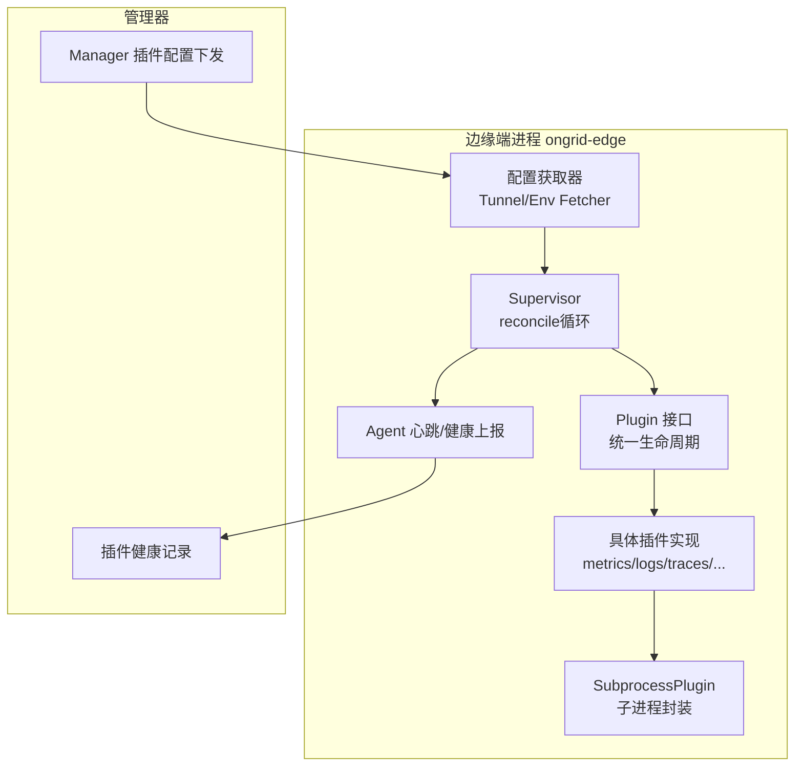
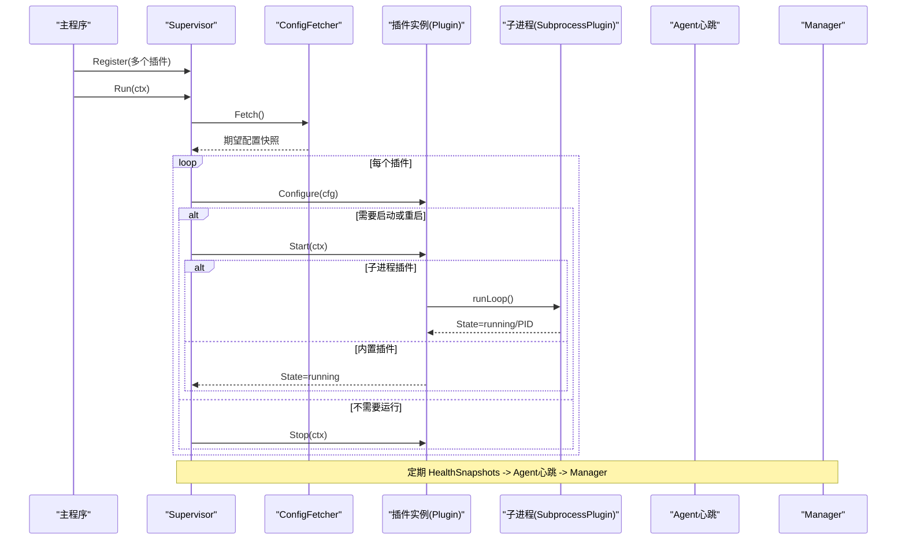
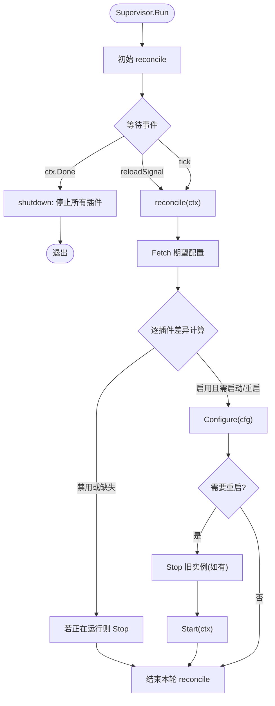
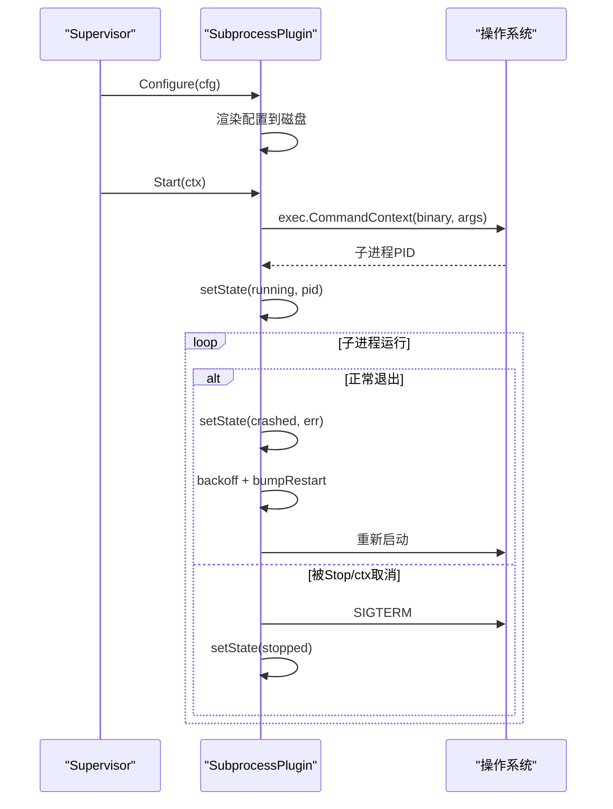
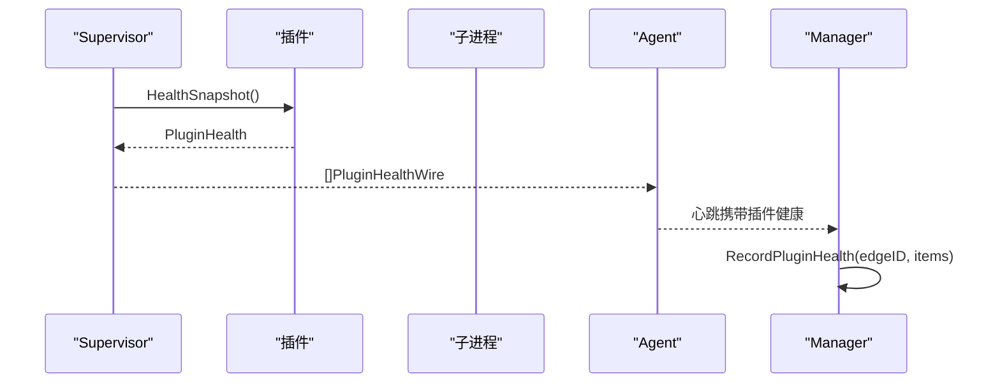
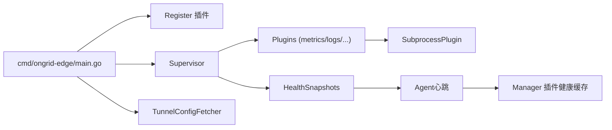

# 生命周期管理

<cite>
**本文引用的文件**   
- [supervisor.go](file://internal/edgeagent/plugins/supervisor.go)
- [plugin.go](file://internal/edgeagent/plugins/plugin.go)
- [subprocess.go](file://internal/edgeagent/plugins/subprocess.go)
- [main.go](file://cmd/ongrid-edge/main.go)
- [logs/plugin.go](file://internal/edgeagent/plugins/logs/plugin.go)
- [traces/plugin.go](file://internal/edgeagent/plugins/traces/plugin.go)
- [hostmetrics/plugin.go](file://internal/edgeagent/plugins/hostmetrics/plugin.go)
- [procmetrics/plugin.go](file://internal/edgeagent/plugins/procmetrics/plugin.go)
- [audit/plugin.go](file://internal/edgeagent/plugins/audit/plugin.go)
- [metrics/plugin.go](file://internal/edgeagent/plugins/metrics/plugin.go)
- [custommetrics/plugin.go](file://internal/edgeagent/plugins/custommetrics/plugin.go)
- [databasemetrics/plugin.go](file://internal/edgeagent/plugins/databasemetrics/plugin.go)
- [tunnel_config_fetcher.go](file://internal/edgeagent/plugins/config_tunnel.go)
- [config_env.go](file://internal/edgeagent/plugins/config_env.go)
- [plugin_health.go](file://internal/manager/biz/edge/plugin_health.go)
</cite>

## 目录
1. [简介](#简介)
2. [项目结构](#项目结构)
3. [核心组件](#核心组件)
4. [架构总览](#架构总览)
5. [详细组件分析](#详细组件分析)
6. [依赖关系分析](#依赖关系分析)
7. [性能与稳定性](#性能与稳定性)
8. [故障排查指南](#故障排查指南)
9. [结论](#结论)

## 简介
本文件聚焦 OnGrid 插件系统的生命周期管理，覆盖插件的启动、停止、重启与销毁流程；阐述 Supervisor 如何管理插件实例、进程监控与资源清理；说明插件状态转换机制、健康检查与故障恢复策略；并解释配置热更新、动态加载与卸载能力、事件通知机制以及插件依赖管理与启动顺序控制。

## 项目结构
OnGrid 边缘端插件运行时位于 internal/edgeagent/plugins 包中，核心由以下模块组成：
- 插件接口与数据模型：定义统一的 Plugin 接口、PluginConfig、PluginHealth 等
- 子进程插件封装：SubprocessPlugin 提供通用子进程生命周期、崩溃回退与日志收集
- 插件编排器：Supervisor 负责从配置源拉取期望态，对比当前态并驱动 Configure/Start/Stop
- 具体插件实现：metrics（内置）、logs、traces、hostmetrics、procmetrics、audit、custommetrics、databasemetrics 等
- 配置来源：TunnelConfigFetcher（隧道推送）与 EnvConfigFetcher（环境变量兜底）
- 主程序装配：cmd/ongrid-edge/main.go 注册插件、创建 Supervisor、上报健康信息



图表来源
- [supervisor.go:114-133](file://internal/edgeagent/plugins/supervisor.go#L114-L133)
- [plugin.go:25-52](file://internal/edgeagent/plugins/plugin.go#L25-L52)
- [subprocess.go:104-156](file://internal/edgeagent/plugins/subprocess.go#L104-L156)
- [main.go:246-305](file://cmd/ongrid-edge/main.go#L246-L305)
- [plugin_health.go:1-21](file://internal/manager/biz/edge/plugin_health.go#L1-L21)

章节来源
- [main.go:199-252](file://cmd/ongrid-edge/main.go#L199-L252)
- [supervisor.go:114-133](file://internal/edgeagent/plugins/supervisor.go#L114-L133)
- [plugin.go:25-52](file://internal/edgeagent/plugins/plugin.go#L25-L52)
- [subprocess.go:104-156](file://internal/edgeagent/plugins/subprocess.go#L104-L156)

## 核心组件
- 插件接口 Plugin：统一 Name/Configure/Start/Stop/HealthSnapshot 生命周期方法
- 子进程插件 SubprocessPlugin：封装二进制子进程的启动、优雅退出、崩溃回退重启、PID/时间戳与健康快照
- 插件编排器 Supervisor：周期性 reconcile，比较“期望配置”和“当前运行态”，驱动 Configure/Start/Stop，并在关闭时统一 Stop
- 配置获取器 ConfigFetcher：抽象配置来源，支持 Tunnel 实时推送与环境变量兜底
- 健康上报：Supervisor.HealthSnapshots 聚合各插件健康，经 Agent 心跳上报至 Manager 内存缓存

章节来源
- [plugin.go:25-52](file://internal/edgeagent/plugins/plugin.go#L25-L52)
- [subprocess.go:104-156](file://internal/edgeagent/plugins/subprocess.go#L104-L156)
- [supervisor.go:114-133](file://internal/edgeagent/plugins/supervisor.go#L114-L133)
- [plugin.go:108-118](file://internal/edgeagent/plugins/plugin.go#L108-L118)
- [plugin_health.go:1-21](file://internal/manager/biz/edge/plugin_health.go#L1-L21)

## 架构总览
Supervisor 作为插件运行时中枢，遵循“声明式配置 + 期望态收敛”的模式：
- 初始阶段：读取一次配置快照，Apply 到已注册的插件
- 运行期：监听外部 reload 信号与定时 tick，持续 reconcile
- 关闭期：在 ctx 取消后，对全部运行中的插件执行 Stop，确保资源释放



图表来源
- [main.go:246-305](file://cmd/ongrid-edge/main.go#L246-L305)
- [supervisor.go:114-133](file://internal/edgeagent/plugins/supervisor.go#L114-L133)
- [supervisor.go:138-230](file://internal/edgeagent/plugins/supervisor.go#L138-L230)
- [subprocess.go:194-235](file://internal/edgeagent/plugins/subprocess.go#L194-L235)

## 详细组件分析

### 插件接口与数据模型
- Plugin 接口定义了统一的生命周期钩子：Name/Configure/Start/Stop/HealthSnapshot
- PluginConfig 承载启用开关、EdgeID、Endpoint、鉴权信息与 Spec 参数
- PluginState 枚举包含 stopped/starting/running/crashed
- PluginHealth 与 TargetHealth 用于向 Manager 上报插件及多目标的健康信息

```mermaid
classDiagram
class Plugin {
+Name() string
+Configure(cfg) error
+Start(ctx) error
+Stop(ctx) error
+HealthSnapshot() PluginHealth
}
class PluginConfig {
+bool Enabled
+uint64 EdgeID
+string Endpoint
+string AuthUser
+string AuthPass
+map~string~Spec
}
class PluginHealth {
+string Name
+PluginState State
+string LastError
+int RestartCount
+int PID
+time StartedAt
+time UpdatedAt
+[]TargetHealth Targets
}
class TargetHealth {
+string ID
+string Name
+string Kind
+string State
+string LastError
+int Samples
+time LastSuccessAt
+time UpdatedAt
}
class SubprocessPlugin {
-name string
-binary string
-workDir string
-configFile string
-configRender func
-args func
-log Logger
-cfg PluginConfig
-cmd *exec.Cmd
-cancelRun context.CancelFunc
-health PluginHealth
-wantRunning bool
-stoppedCh chan struct{}
+Name() string
+Configure(cfg) error
+Start(ctx) error
+Stop(ctx) error
+HealthSnapshot() PluginHealth
}
Plugin <|.. SubprocessPlugin
```

图表来源
- [plugin.go:25-52](file://internal/edgeagent/plugins/plugin.go#L25-L52)
- [plugin.go:54-106](file://internal/edgeagent/plugins/plugin.go#L54-L106)
- [subprocess.go:32-50](file://internal/edgeagent/plugins/subprocess.go#L32-L50)

章节来源
- [plugin.go:25-52](file://internal/edgeagent/plugins/plugin.go#L25-L52)
- [plugin.go:54-106](file://internal/edgeagent/plugins/plugin.go#L54-L106)
- [subprocess.go:32-50](file://internal/edgeagent/plugins/subprocess.go#L32-L50)

### 插件编排器 Supervisor
- 职责：维护插件注册表、最近应用配置与运行状态；周期性 reconcile 期望态与当前态
- 关键流程：
  - Run：初始 apply，进入 select 循环处理 ctx.Done/reloadSignal/ticker
  - reconcile：Fetch 期望配置，逐插件判断是否应运行；若需变更则 Configure → Stop（如需要）→ Start
  - shutdown：ctx 取消后统一 Stop 所有插件
- 并发安全：使用互斥锁保护 plugins/current/running 三张映射
- 健康快照：遍历所有插件调用 HealthSnapshot，排序后返回供心跳上报



图表来源
- [supervisor.go:114-133](file://internal/edgeagent/plugins/supervisor.go#L114-L133)
- [supervisor.go:138-230](file://internal/edgeagent/plugins/supervisor.go#L138-L230)
- [supervisor.go:234-251](file://internal/edgeagent/plugins/supervisor.go#L234-L251)

章节来源
- [supervisor.go:114-133](file://internal/edgeagent/plugins/supervisor.go#L114-L133)
- [supervisor.go:138-230](file://internal/edgeagent/plugins/supervisor.go#L138-L230)
- [supervisor.go:234-251](file://internal/edgeagent/plugins/supervisor.go#L234-L251)

### 子进程插件封装 SubprocessPlugin
- 功能：为任意二进制子进程提供统一生命周期管理
- 配置渲染：根据 PluginConfig 生成配置文件（可选），写入 workDir
- 启动流程：校验二进制存在 → 设置工作目录 → 启动子进程 → 捕获 stdout/stderr 到日志文件 → 更新健康状态（PID/StartedAt）
- 优雅退出：Cancel 上下文 → 发送 SIGTERM → WaitDelay 超时后 SIGKILL
- 崩溃恢复：runLoop 检测非预期退出，指数退避重启（1s 起，上限 5min），递增 RestartCount
- 健康快照：返回当前 State/LastError/PID/StartedAt/UpdatedAt



图表来源
- [subprocess.go:107-133](file://internal/edgeagent/plugins/subprocess.go#L107-L133)
- [subprocess.go:135-156](file://internal/edgeagent/plugins/subprocess.go#L135-L156)
- [subprocess.go:194-235](file://internal/edgeagent/plugins/subprocess.go#L194-L235)
- [subprocess.go:237-287](file://internal/edgeagent/plugins/subprocess.go#L237-L287)

章节来源
- [subprocess.go:107-133](file://internal/edgeagent/plugins/subprocess.go#L107-L133)
- [subprocess.go:135-156](file://internal/edgeagent/plugins/subprocess.go#L135-L156)
- [subprocess.go:194-235](file://internal/edgeagent/plugins/subprocess.go#L194-L235)
- [subprocess.go:237-287](file://internal/edgeagent/plugins/subprocess.go#L237-L287)

### 具体插件实现要点
- logs（promtail）：通过 SubprocessPlugin 启动，渲染 promtail.yaml，位置文件持久化避免丢失 journald cursor
- traces（otelcol-contrib）：通过 SubprocessPlugin 启动，渲染 otelcol.yaml
- hostmetrics（node_exporter）：无配置文件，通过 Args 注入 textfile collector 目录
- procmetrics（process-exporter）：通过 SubprocessPlugin 启动，渲染 process-exporter.yaml
- audit（auditbeat）：通过 SubprocessPlugin 启动，渲染 auditbeat.yml，输出 JSONL 给 logs 插件自动采集
- metrics（内置）：in-process 抓取本地 /metrics 并通过 tunnel RPC 推送
- custommetrics：in-process 多目标抓取，按目标维度上报 TargetHealth
- databasemetrics：in-process 管理数据库导出器子进程，读取本地密钥文件，按 source 维度上报 TargetHealth

章节来源
- [logs/plugin.go:27-53](file://internal/edgeagent/plugins/logs/plugin.go#L27-L53)
- [traces/plugin.go:31-47](file://internal/edgeagent/plugins/traces/plugin.go#L31-L47)
- [hostmetrics/plugin.go:62-93](file://internal/edgeagent/plugins/hostmetrics/plugin.go#L62-L93)
- [procmetrics/plugin.go:32-42](file://internal/edgeagent/plugins/procmetrics/plugin.go#L32-L42)
- [audit/plugin.go:46-74](file://internal/edgeagent/plugins/audit/plugin.go#L46-L74)
- [metrics/plugin.go:85-102](file://internal/edgeagent/plugins/metrics/plugin.go#L85-L102)
- [custommetrics/plugin.go:45-63](file://internal/edgeagent/plugins/custommetrics/plugin.go#L45-L63)
- [databasemetrics/plugin.go:53-73](file://internal/edgeagent/plugins/databasemetrics/plugin.go#L53-L73)

### 配置热更新与动态加载/卸载
- 热更新触发：
  - 定时器：默认每 60s 拉取一次配置进行 reconcile
  - 外部信号：Manager 通过隧道推送 MethodPluginConfigsChanged，Supervisor.TriggerReload 合并多次信号
- 动态加载/卸载：
  - 加载：主程序启动时集中 Register 所有插件，Supervisor 根据期望配置决定是否 Start
  - 卸载：当某插件在期望配置中缺失或被禁用，Supervisor 会 Stop 对应实例并从 running 状态移除
- 配置来源：
  - TunnelConfigFetcher：从 Manager 实时拉取 per-edge 插件配置
  - EnvConfigFetcher：隧道不可用时降级为环境变量兜底，保证离线可用性

章节来源
- [supervisor.go:114-133](file://internal/edgeagent/plugins/supervisor.go#L114-L133)
- [supervisor.go:87-92](file://internal/edgeagent/plugins/supervisor.go#L87-L92)
- [main.go:298-305](file://cmd/ongrid-edge/main.go#L298-L305)
- [plugin.go:108-118](file://internal/edgeagent/plugins/plugin.go#L108-L118)
- [tunnel_config_fetcher.go](file://internal/edgeagent/plugins/config_tunnel.go)
- [config_env.go](file://internal/edgeagent/plugins/config_env.go)

### 健康检查与故障恢复
- 健康快照：
  - 子进程插件：setState 更新 State/LastError/PID/StartedAt/UpdatedAt；bumpRestart 递增重启计数
  - 内置插件：各自维护 health 字段，Start/Stop/错误路径更新状态
- 上报链路：
  - Supervisor.HealthSnapshots 聚合所有插件健康
  - 主程序将健康转换为 wire 格式，随 Agent 心跳上报至 Manager
  - Manager 侧以内存缓存存储最新快照，UI 展示
- 故障恢复：
  - 子进程异常退出：指数退避重启，最大间隔 5 分钟
  - 配置拉取失败：保持上一轮状态，不中断现有插件
  - 配置变更：先 Configure，再按需 Stop+Start，确保新配置生效



图表来源
- [supervisor.go:96-110](file://internal/edgeagent/plugins/supervisor.go#L96-L110)
- [main.go:258-297](file://cmd/ongrid-edge/main.go#L258-L297)
- [plugin_health.go:41-70](file://internal/manager/biz/edge/plugin_health.go#L41-L70)
- [subprocess.go:289-311](file://internal/edgeagent/plugins/subprocess.go#L289-L311)

章节来源
- [supervisor.go:96-110](file://internal/edgeagent/plugins/supervisor.go#L96-L110)
- [main.go:258-297](file://cmd/ongrid-edge/main.go#L258-L297)
- [plugin_health.go:41-70](file://internal/manager/biz/edge/plugin_health.go#L41-L70)
- [subprocess.go:289-311](file://internal/edgeagent/plugins/subprocess.go#L289-L311)

### 插件依赖管理与启动顺序控制
- 当前实现：Supervisor 对插件的 Apply 是无序遍历，未显式实现基于依赖的拓扑排序
- 间接依赖：
  - logs 插件渲染逻辑可探测 audit 插件的输出路径，从而自动 tail 审计日志
  - hostmetrics 插件通过 textfile collector 目录与其他 producer 协作
- 建议扩展：
  - 在插件元数据中声明 depends_on 列表
  - 在 reconcile 前构建有向图并进行拓扑排序，确保依赖插件优先启动
  - 对于强依赖失败的插件，标记为 crashed 并跳过后续依赖的启动

章节来源
- [supervisor.go:175-229](file://internal/edgeagent/plugins/supervisor.go#L175-L229)
- [logs/plugin.go:27-53](file://internal/edgeagent/plugins/logs/plugin.go#L27-L53)
- [hostmetrics/plugin.go:62-93](file://internal/edgeagent/plugins/hostmetrics/plugin.go#L62-L93)

## 依赖关系分析
- 主程序 main.go 负责：
  - 构造各插件实例并 Register 到 Supervisor
  - 创建 TunnelConfigFetcher 与 Supervisor
  - 注册 MethodPluginConfigsChanged 回调以触发热更新
  - 将 Supervisor.HealthSnapshots 接入 Agent 心跳上报
- Supervisor 依赖：
  - ConfigFetcher 接口（Tunnel/Env）
  - 已注册的 Plugin 实例集合
- 子进程插件依赖：
  - 系统 exec 能力、文件系统读写、信号处理
- Manager 侧：
  - 接收心跳中的插件健康快照，内存缓存并提供查询



图表来源
- [main.go:199-252](file://cmd/ongrid-edge/main.go#L199-L252)
- [main.go:298-305](file://cmd/ongrid-edge/main.go#L298-L305)
- [supervisor.go:114-133](file://internal/edgeagent/plugins/supervisor.go#L114-L133)
- [plugin_health.go:41-70](file://internal/manager/biz/edge/plugin_health.go#L41-L70)

章节来源
- [main.go:199-252](file://cmd/ongrid-edge/main.go#L199-L252)
- [main.go:298-305](file://cmd/ongrid-edge/main.go#L298-L305)
- [supervisor.go:114-133](file://internal/edgeagent/plugins/supervisor.go#L114-L133)
- [plugin_health.go:41-70](file://internal/manager/biz/edge/plugin_health.go#L41-L70)

## 性能与稳定性
- 性能特性
  - reconcile 频率可调（默认 60s），可通过 ReloadInterval 优化
  - 子进程崩溃重启采用指数退避，避免雪崩
  - 健康快照聚合轻量，仅拷贝必要字段
- 稳定性保障
  - 配置拉取失败不中断现有运行态
  - Stop 带超时保护，防止阻塞 supervisor 关闭
  - 子进程优雅退出（SIGTERM）+ 强制终止（SIGKILL）兜底

[本节为通用指导，无需源码引用]

## 故障排查指南
- 常见问题定位
  - 插件未启动：检查期望配置中 enabled 是否为 true；查看 reconcile 日志确认是否触发 Start
  - 子进程频繁重启：查看 LastError 与 RestartCount；确认二进制是否存在、配置是否合法、端口是否冲突
  - 配置未生效：确认 Manager 是否推送了 MethodPluginConfigsChanged；检查 Supervisor 是否收到 TriggerReload
  - 健康上报缺失：确认 Agent 心跳是否正常；检查 Supervisor.HealthSnapshots 是否被调用
- 诊断步骤
  - 查看插件工作目录下的 .log 文件，定位子进程错误
  - 核对 workDir 权限与 ProtectSystem=strict 限制，确保可写路径正确
  - 使用 Manager 侧插件健康缓存接口观察最近上报时间与状态

章节来源
- [supervisor.go:138-230](file://internal/edgeagent/plugins/supervisor.go#L138-L230)
- [subprocess.go:237-287](file://internal/edgeagent/plugins/subprocess.go#L237-L287)
- [main.go:298-305](file://cmd/ongrid-edge/main.go#L298-L305)
- [plugin_health.go:41-70](file://internal/manager/biz/edge/plugin_health.go#L41-L70)

## 结论
OnGrid 插件生命周期管理以 Supervisor 为核心，结合统一的 Plugin 接口与 SubprocessPlugin 封装，实现了配置驱动的启停、优雅退出、崩溃自愈与健康上报。通过 Tunnel 实时推送与环境变量兜底，系统在在线与离线场景下均具备高可用性与可观测性。未来可在插件元数据中引入依赖声明与拓扑排序，进一步增强复杂场景下的启动顺序控制与容错能力。