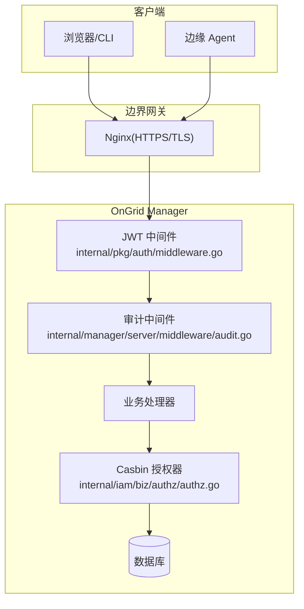
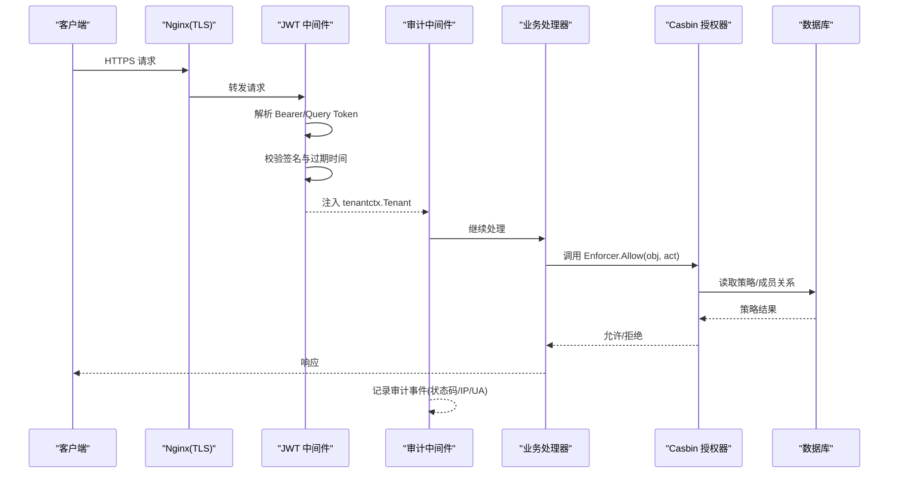
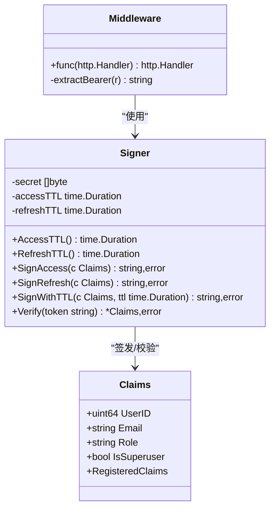
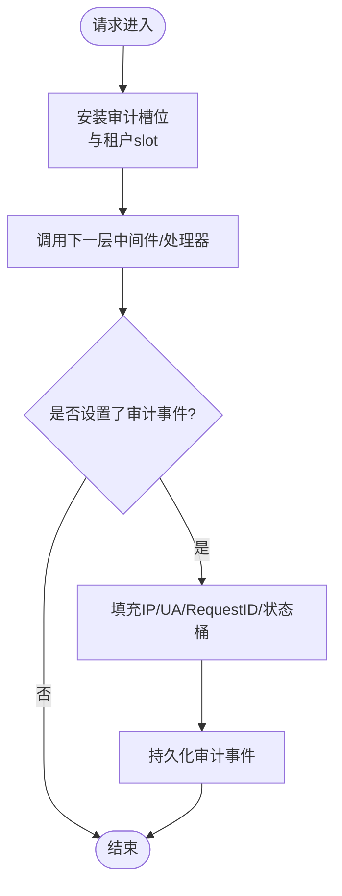
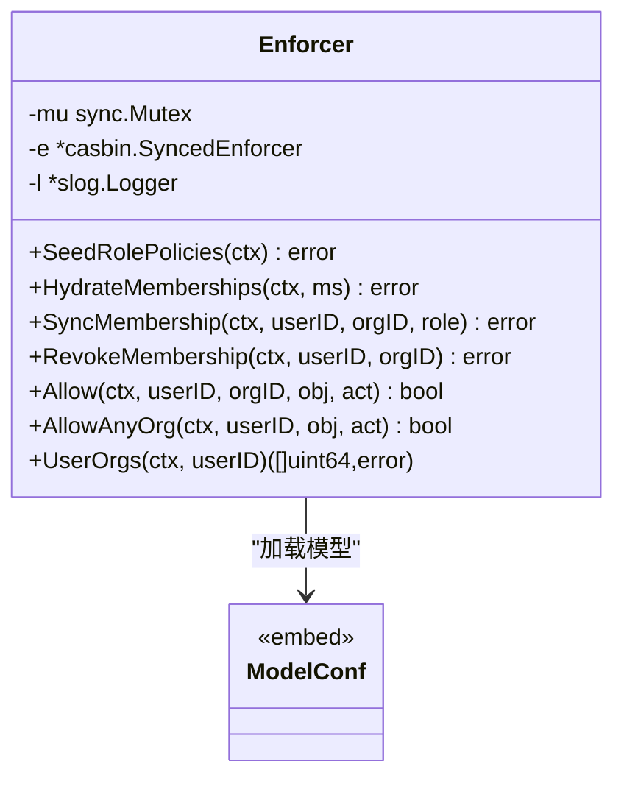
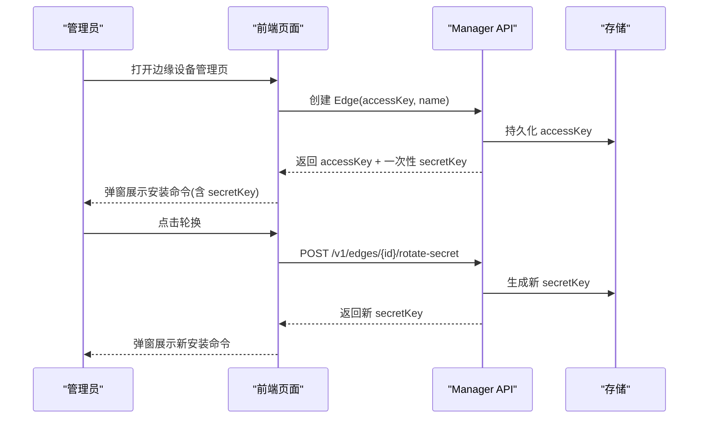
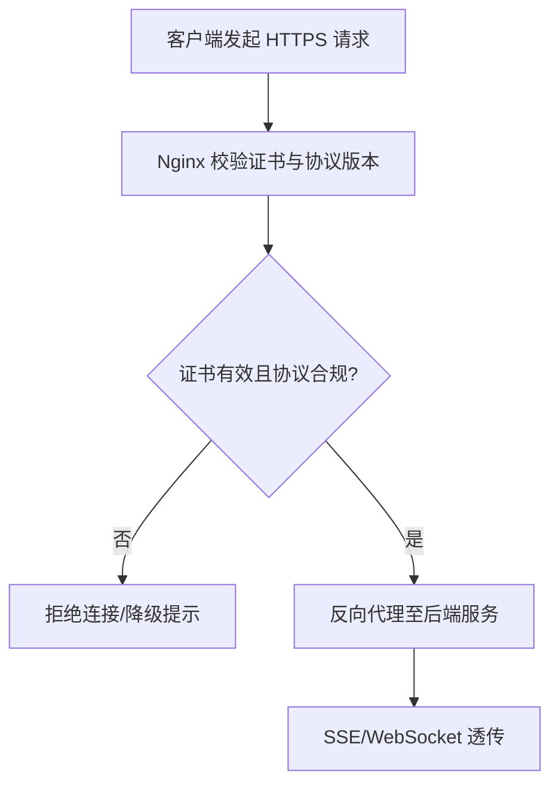
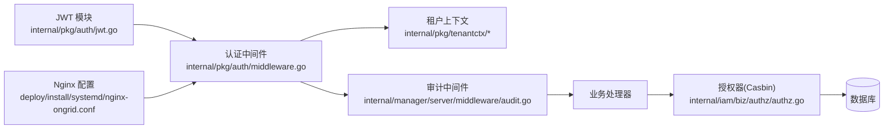
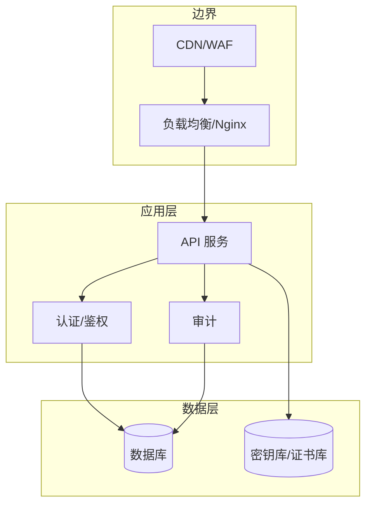
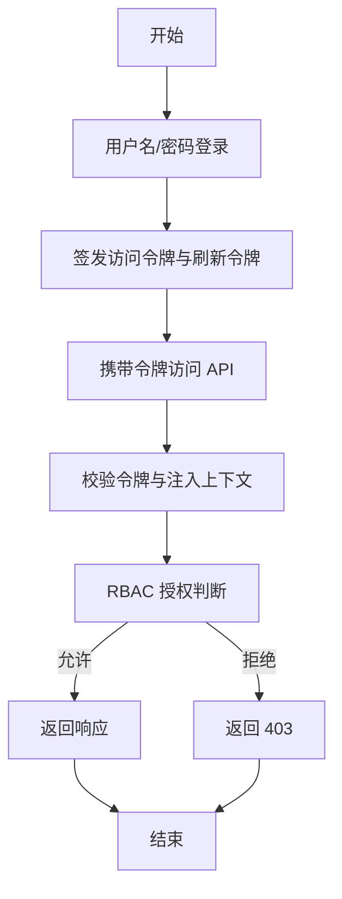

# 安全认证机制

<cite>
**本文引用的文件**   
- [internal/pkg/auth/jwt.go](file://internal/pkg/auth/jwt.go)
- [internal/pkg/auth/middleware.go](file://internal/pkg/auth/middleware.go)
- [internal/manager/server/middleware/audit.go](file://internal/manager/server/middleware/audit.go)
- [internal/iam/biz/authz/authz.go](file://internal/iam/biz/authz/authz.go)
- [internal/iam/biz/authz/model.conf](file://internal/iam/biz/authz/model.conf)
- [deploy/install/systemd/nginx-ongrid.conf](file://deploy/install/systemd/nginx-ongrid.conf)
- [cmd/ongrid/main.go](file://cmd/ongrid/main.go)
- [web/src/pages/Edges.tsx](file://web/src/pages/Edges.tsx)
- [internal/manager/server/edge/http_test.go](file://internal/manager/server/edge/http_test.go)
</cite>

## 目录
1. [简介](#简介)
2. [项目结构](#项目结构)
3. [核心组件](#核心组件)
4. [架构总览](#架构总览)
5. [详细组件分析](#详细组件分析)
6. [依赖关系分析](#依赖关系分析)
7. [性能与安全特性](#性能与安全特性)
8. [故障排查指南](#故障排查指南)
9. [结论](#结论)
10. [附录：配置与加固示例](#附录配置与加固示例)

## 简介
本文件系统化阐述 OnGrid 的安全认证机制，覆盖以下关键主题：
- AccessKey/SecretKey 边缘设备认证流程（创建、轮换、安装命令生成）
- TLS 证书验证与加密传输配置（Nginx 反向代理、HTTPS 强制跳转）
- JWT 访问令牌签发与校验、中间件注入租户上下文
- IAM 权限模型与基于 Casbin 的 RBAC 策略
- 审计日志记录与可观测性
- 密钥轮换机制与证书管理建议
- 防重放与会话劫持防护要点及网络安全最佳实践
- 安全架构图、认证流程图与配置示例
- 安全加固指南与漏洞检测方法

## 项目结构
与安全认证相关的关键代码与配置分布如下：
- 认证与鉴权
  - JWT 签发/校验与 HTTP 中间件：internal/pkg/auth/*
  - 租户上下文传递：internal/pkg/tenantctx/*
  - 基于 Casbin 的 RBAC 策略与同步：internal/iam/biz/authz/*
- 审计日志
  - 审计中间件与事件写入：internal/manager/server/middleware/audit.go
- 边缘设备密钥
  - 前端页面展示与轮换交互：web/src/pages/Edges.tsx
  - 后端接口测试用例（含旋转密钥与删除权限控制）：internal/manager/server/edge/http_test.go
- 传输安全
  - Nginx HTTPS 站点与证书路径：deploy/install/systemd/nginx-ongrid.conf
- 启动初始化与系统设置
  - 审计保留期等系统级配置：cmd/ongrid/main.go

**图表来源** 
- [internal/pkg/auth/middleware.go:1-68](file://internal/pkg/auth/middleware.go#L1-L68)
- [internal/manager/server/middleware/audit.go:1-169](file://internal/manager/server/middleware/audit.go#L1-L169)
- [internal/iam/biz/authz/authz.go:1-316](file://internal/iam/biz/authz/authz.go#L1-L316)
- [deploy/install/systemd/nginx-ongrid.conf:1-60](file://deploy/install/systemd/nginx-ongrid.conf#L1-L60)

**章节来源**
- [internal/pkg/auth/jwt.go:1-100](file://internal/pkg/auth/jwt.go#L1-L100)
- [internal/pkg/auth/middleware.go:1-68](file://internal/pkg/auth/middleware.go#L1-L68)
- [internal/manager/server/middleware/audit.go:1-169](file://internal/manager/server/middleware/audit.go#L1-L169)
- [internal/iam/biz/authz/authz.go:1-316](file://internal/iam/biz/authz/authz.go#L1-L316)
- [deploy/install/systemd/nginx-ongrid.conf:1-60](file://deploy/install/systemd/nginx-ongrid.conf#L1-L60)
- [cmd/ongrid/main.go:409-436](file://cmd/ongrid/main.go#L409-L436)

## 核心组件
- JWT 签名与校验
  - 使用 HS256 对称算法签发短生命周期访问令牌与长生命周期刷新令牌；Claims 包含用户标识、角色与超级管理员标记。
  - 校验失败返回未授权错误，不执行后续处理链。
- 认证中间件
  - 从 Authorization: Bearer 或查询参数 token 提取 JWT，校验后注入 tenantctx.Tenant 到请求上下文，供下游鉴权与审计使用。
- 审计中间件
  - 在请求进入时安装可变的审计槽位，处理完成后根据状态码与上下文信息填充审计事件并持久化。
- 基于 Casbin 的 RBAC
  - 启动时注入内置角色策略，运行时将组织成员关系同步为分组策略，支持按对象与动作进行细粒度授权判断。
- 边缘设备密钥
  - 提供密钥创建、一次性展示 secret_key、在线轮换与删除能力；前端在安装命令中携带 accessKey 与 secretKey。
- 传输安全
  - Nginx 启用 TLSv1.2/1.3，强制 HTTP→HTTPS 跳转，关闭代理缓冲以支持 SSE/流式响应。

**章节来源**
- [internal/pkg/auth/jwt.go:1-100](file://internal/pkg/auth/jwt.go#L1-L100)
- [internal/pkg/auth/middleware.go:1-68](file://internal/pkg/auth/middleware.go#L1-L68)
- [internal/manager/server/middleware/audit.go:1-169](file://internal/manager/server/middleware/audit.go#L1-L169)
- [internal/iam/biz/authz/authz.go:1-316](file://internal/iam/biz/authz/authz.go#L1-L316)
- [web/src/pages/Edges.tsx:232-261](file://web/src/pages/Edges.tsx#L232-L261)
- [web/src/pages/Edges.tsx:1398-1429](file://web/src/pages/Edges.tsx#L1398-L1429)
- [deploy/install/systemd/nginx-ongrid.conf:1-60](file://deploy/install/systemd/nginx-ongrid.conf#L1-L60)

## 架构总览
下图展示了从客户端到后端鉴权的完整链路，包括 JWT 校验、租户上下文注入、审计记录与基于角色的访问控制。

**图表来源** 
- [internal/pkg/auth/middleware.go:1-68](file://internal/pkg/auth/middleware.go#L1-L68)
- [internal/manager/server/middleware/audit.go:1-169](file://internal/manager/server/middleware/audit.go#L1-L169)
- [internal/iam/biz/authz/authz.go:1-316](file://internal/iam/biz/authz/authz.go#L1-L316)
- [deploy/install/systemd/nginx-ongrid.conf:1-60](file://deploy/install/systemd/nginx-ongrid.conf#L1-L60)

## 详细组件分析

### JWT 与认证中间件
- 令牌结构
  - Claims 包含 user_id、email、role、is_superuser 以及标准注册声明（exp、iat、sub）。
- 签发策略
  - 访问令牌与刷新令牌分别配置 TTL；内部票据可使用自定义 TTL。
- 校验逻辑
  - 仅做签名与声明校验，不做数据库用户查找；旧令牌兼容 Role=="admin" 回退。
- 中间件行为
  - 支持 Authorization: Bearer 与 ?token= 两种来源（WebSocket 场景）；失败直接返回 401。
  - 将租户上下文写入外层 slot，确保审计中间件可在处理后获取用户信息。

**图表来源** 
- [internal/pkg/auth/jwt.go:1-100](file://internal/pkg/auth/jwt.go#L1-L100)
- [internal/pkg/auth/middleware.go:1-68](file://internal/pkg/auth/middleware.go#L1-L68)

**章节来源**
- [internal/pkg/auth/jwt.go:1-100](file://internal/pkg/auth/jwt.go#L1-L100)
- [internal/pkg/auth/middleware.go:1-68](file://internal/pkg/auth/middleware.go#L1-L68)

### 审计中间件与事件模型
- 设计目标
  - 仅记录显式标注的用户操作，避免泛化的“HTTP 方法+资源”噪音。
- 实现要点
  - 在请求进入时安装可变 auditSlot，处理完成后统一填充 IP、UA、RequestID、状态桶等信息并持久化。
  - 通过外层 tenantctx slot 捕获认证中间件注入的用户信息。
- 典型审计事件
  - 登录成功/失败、查看审计日志、告警/规则/渠道/知识/用户/设置 CRUD 等。

**图表来源** 
- [internal/manager/server/middleware/audit.go:1-169](file://internal/manager/server/middleware/audit.go#L1-L169)

**章节来源**
- [internal/manager/server/middleware/audit.go:1-169](file://internal/manager/server/middleware/audit.go#L1-L169)
- [cmd/ongrid/main.go:409-436](file://cmd/ongrid/main.go#L409-L436)

### 基于 Casbin 的 RBAC 授权
- 策略模型
  - 内置角色：org_admin、member、viewer；superuser 由中间件短路绕过 casbin。
  - 策略行包含主体、域（组织）、对象、动作；成员关系映射为分组策略。
- 生命周期
  - 启动时注入固定角色策略；运行时同步组织成员关系；增删改成员时增量更新分组策略。
- 决策接口
  - Allow(userID, orgID, obj, act) 与 AllowAnyOrg(userID, obj, act)。

**图表来源** 
- [internal/iam/biz/authz/authz.go:1-316](file://internal/iam/biz/authz/authz.go#L1-L316)
- [internal/iam/biz/authz/model.conf](file://internal/iam/biz/authz/model.conf)

**章节来源**
- [internal/iam/biz/authz/authz.go:1-316](file://internal/iam/biz/authz/authz.go#L1-L316)
- [internal/iam/biz/authz/model.conf](file://internal/iam/biz/authz/model.conf)

### 边缘设备密钥（AccessKey/SecretKey）
- 创建与安装
  - 前端创建 Edge 时生成 accessKey 与 secretKey，安装命令一次性显示 secretKey，需立即保存。
- 轮换机制
  - 管理员触发轮换后，旧密钥立即失效；前端弹窗展示新 secretKey 并更新本地缓存以便一键安装。
- 权限控制
  - 删除与轮换操作受 RBAC 保护，非管理员将被拒绝。

**图表来源** 
- [web/src/pages/Edges.tsx:232-261](file://web/src/pages/Edges.tsx#L232-L261)
- [web/src/pages/Edges.tsx:1398-1429](file://web/src/pages/Edges.tsx#L1398-L1429)
- [internal/manager/server/edge/http_test.go:370-413](file://internal/manager/server/edge/http_test.go#L370-L413)

**章节来源**
- [web/src/pages/Edges.tsx:232-261](file://web/src/pages/Edges.tsx#L232-L261)
- [web/src/pages/Edges.tsx:1398-1429](file://web/src/pages/Edges.tsx#L1398-L1429)
- [internal/manager/server/edge/http_test.go:370-413](file://internal/manager/server/edge/http_test.go#L370-L413)

### TLS 证书与加密传输
- Nginx 配置要点
  - 监听 443 并启用 TLSv1.2/1.3，指定证书与私钥路径，限制密码套件。
  - 80 端口全部 301 跳转到 HTTPS。
  - 针对 WebSocket/SSE 设置 Upgrade 与 Connection 头，关闭代理缓冲。
- 证书管理建议
  - 生产环境建议使用可信 CA 签发的证书；结合自动化续期方案（如 Let’s Encrypt）定期轮换。
  - 边缘 Agent 首次心跳拉取最新管理器证书，确保证书一致性。

**图表来源** 
- [deploy/install/systemd/nginx-ongrid.conf:1-60](file://deploy/install/systemd/nginx-ongrid.conf#L1-L60)

**章节来源**
- [deploy/install/systemd/nginx-ongrid.conf:1-60](file://deploy/install/systemd/nginx-ongrid.conf#L1-L60)

## 依赖关系分析
- 组件耦合
  - 认证中间件依赖 JWT 签名器；审计中间件依赖租户上下文与响应包装器；授权器依赖 Casbin 与数据库。
- 外部依赖
  - JWT 库用于签名与校验；Casbin 用于策略引擎；Nginx 作为边界网关提供 TLS 终止与反向代理。
- 潜在风险点
  - JWT 密钥泄露会导致令牌伪造；RBAC 策略变更需幂等与原子性；审计事件缺失可能导致取证困难。

**图表来源** 
- [internal/pkg/auth/jwt.go:1-100](file://internal/pkg/auth/jwt.go#L1-L100)
- [internal/pkg/auth/middleware.go:1-68](file://internal/pkg/auth/middleware.go#L1-L68)
- [internal/manager/server/middleware/audit.go:1-169](file://internal/manager/server/middleware/audit.go#L1-L169)
- [internal/iam/biz/authz/authz.go:1-316](file://internal/iam/biz/authz/authz.go#L1-L316)
- [deploy/install/systemd/nginx-ongrid.conf:1-60](file://deploy/install/systemd/nginx-ongrid.conf#L1-L60)

**章节来源**
- [internal/pkg/auth/jwt.go:1-100](file://internal/pkg/auth/jwt.go#L1-L100)
- [internal/pkg/auth/middleware.go:1-68](file://internal/pkg/auth/middleware.go#L1-L68)
- [internal/manager/server/middleware/audit.go:1-169](file://internal/manager/server/middleware/audit.go#L1-L169)
- [internal/iam/biz/authz/authz.go:1-316](file://internal/iam/biz/authz/authz.go#L1-L316)
- [deploy/install/systemd/nginx-ongrid.conf:1-60](file://deploy/install/systemd/nginx-ongrid.conf#L1-L60)

## 性能与安全特性
- 性能
  - JWT 校验为轻量 CPU 操作；Casbin 策略匹配在内存中进行，成员关系同步采用批量无差异插入，适合中小规模组织。
  - Nginx 关闭代理缓冲以支持 SSE/流式输出，需注意内存占用与超时配置。
- 安全
  - 短生命周期访问令牌降低泄露影响面；刷新令牌用于续期；IsSuperuser 字段增强超管识别。
  - 审计事件仅记录有意义操作，便于事后追溯与合规检查。
  - TLS 强制与最小协议版本提升传输安全性。

## 故障排查指南
- 401 未授权
  - 检查 Authorization 头或 ?token 参数是否正确；确认 JWT 未过期且签名正确。
- 403 禁止访问
  - 确认当前用户角色与对象/动作是否在策略中允许；检查组织成员关系是否已同步。
- 审计事件缺失
  - 确认处理器是否显式设置审计事件；检查审计中间件是否被正确挂载。
- TLS 握手失败
  - 检查证书路径与权限；确认 Nginx 配置的协议版本与密码套件；验证客户端信任链。

**章节来源**
- [internal/pkg/auth/middleware.go:1-68](file://internal/pkg/auth/middleware.go#L1-L68)
- [internal/manager/server/middleware/audit.go:1-169](file://internal/manager/server/middleware/audit.go#L1-L169)
- [deploy/install/systemd/nginx-ongrid.conf:1-60](file://deploy/install/systemd/nginx-ongrid.conf#L1-L60)

## 结论
OnGrid 的安全认证体系围绕 JWT 令牌、RBAC 策略与审计日志构建，并通过 Nginx 提供强化的传输安全。边缘设备密钥的创建与轮换流程在前端与后端协同完成，具备明确的生命周期管理与权限控制。建议在部署中遵循最小权限原则、强化证书管理与密钥轮换策略，并结合审计与监控完善安全运营闭环。

## 附录：配置与加固示例

- 安全架构图（概念）

- 认证流程图（概念）

- 安全配置示例（参考）
  - Nginx HTTPS 站点与证书路径、TLS 版本与密码套件、HTTP→HTTPS 跳转、WebSocket/SSE 透传。
  - JWT 密钥轮换：定期更换 HS256 密钥，配合刷新令牌过渡期策略。
  - 审计保留期：通过环境变量调整审计日志保留天数，必要时外置归档。

**章节来源**
- [deploy/install/systemd/nginx-ongrid.conf:1-60](file://deploy/install/systemd/nginx-ongrid.conf#L1-L60)
- [cmd/ongrid/main.go:409-436](file://cmd/ongrid/main.go#L409-L436)