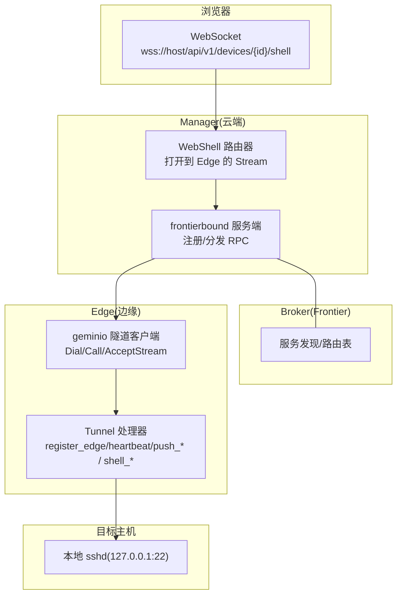
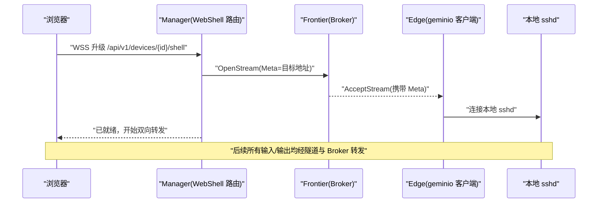
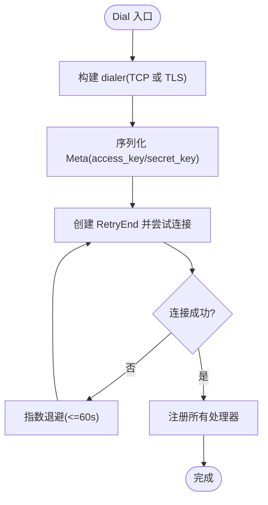
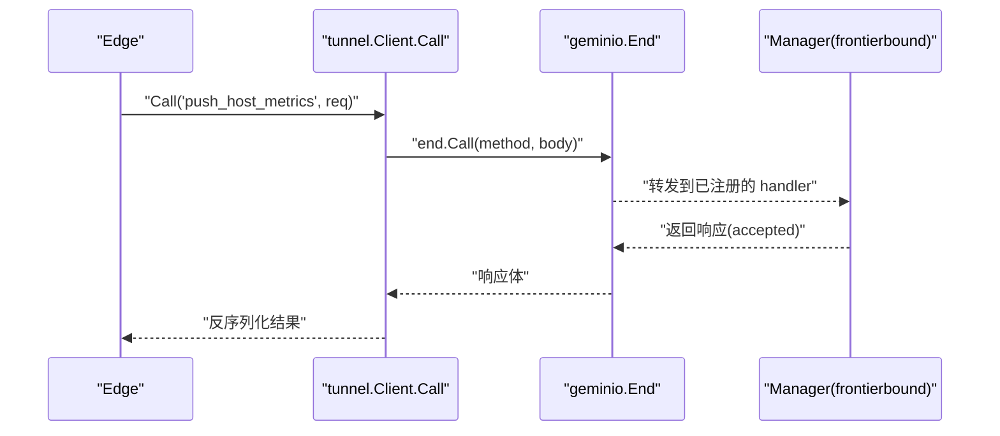
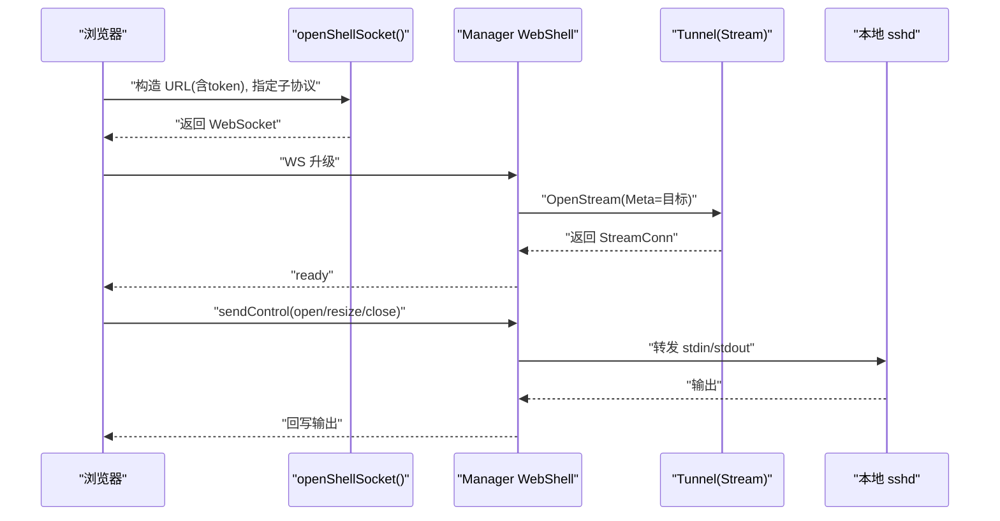
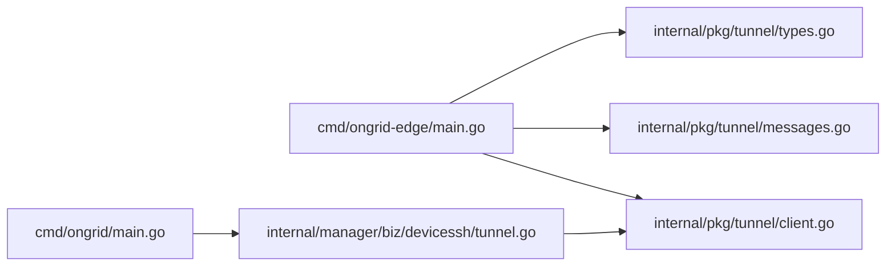

# 数据传输层

<cite>
**本文引用的文件**
- [internal/pkg/tunnel/client.go](file://internal/pkg/tunnel/client.go)
- [internal/pkg/tunnel/types.go](file://internal/pkg/tunnel/types.go)
- [internal/pkg/tunnel/messages.go](file://internal/pkg/tunnel/messages.go)
- [api/tunnel/v1/tunnel.proto](file://api/tunnel/v1/tunnel.proto)
- [cmd/ongrid-edge/main.go](file://cmd/ongrid-edge/main.go)
- [cmd/ongrid/main.go](file://cmd/ongrid/main.go)
- [web/src/api/webshell.ts](file://web/src/api/webshell.ts)
- [internal/manager/biz/devicessh/tunnel.go](file://internal/manager/biz/devicessh/tunnel.go)
</cite>

## 目录
1. [简介](#简介)
2. [项目结构](#项目结构)
3. [核心组件](#核心组件)
4. [架构总览](#架构总览)
5. [详细组件分析](#详细组件分析)
6. [依赖关系分析](#依赖关系分析)
7. [性能考量](#性能考量)
8. [故障排查指南](#故障排查指南)
9. [结论](#结论)
10. [附录](#附录)

## 简介
本文件聚焦 OnGrid 的数据传输层，围绕安全隧道建立、双向通信协议与消息传递机制展开。重点说明：
- 基于 geminio 的长连接隧道（TCP/TLS），边缘端指数退避重连与断线自动恢复
- 以 JSON 为载荷的双向 RPC 方法集（注册、心跳、指标推送、进程/负载查询、插件配置拉取与变更通知、WebSSH 流式转发等）
- 身份认证与会话管理（AccessKey/SecretKey + 云端鉴权函数）
- WebSocket 到 WebShell 的桥接路径（浏览器 → Manager → Frontier → Edge → 本地 sshd）
- 错误处理、重连策略、可观测性与运维建议

## 项目结构
传输层由“边缘侧客户端”和“云端服务端”两部分组成，并通过一个独立的 broker（Frontier）进行路由与发现。关键位置如下：
- 边缘侧隧道客户端实现与类型定义：internal/pkg/tunnel/*
- 协议消息形状（Go 手写镜像）：internal/pkg/tunnel/messages.go
- 协议定义（proto，仅描述形状，非 gRPC）：api/tunnel/v1/tunnel.proto
- 边缘主程序启动与插件/能力注册：cmd/ongrid-edge/main.go
- 云端服务安装与 handler 注册、设备 SSH 通道编排：cmd/ongrid/main.go、internal/manager/biz/devicessh/tunnel.go
- 前端 WebShell WebSocket 工厂：web/src/api/webshell.ts

图表来源
- [cmd/ongrid/main.go:1189-1223](file://cmd/ongrid/main.go#L1189-L1223)
- [internal/manager/biz/devicessh/tunnel.go:197-233](file://internal/manager/biz/devicessh/tunnel.go#L197-L233)
- [internal/pkg/tunnel/client.go:62-141](file://internal/pkg/tunnel/client.go#L62-L141)
- [web/src/api/webshell.ts:36-58](file://web/src/api/webshell.ts#L36-L58)

章节来源
- [cmd/ongrid-edge/main.go:89-148](file://cmd/ongrid-edge/main.go#L89-L148)
- [cmd/ongrid/main.go:1189-1223](file://cmd/ongrid/main.go#L1189-L1223)
- [internal/pkg/tunnel/client.go:62-141](file://internal/pkg/tunnel/client.go#L62-L141)
- [web/src/api/webshell.ts:36-58](file://web/src/api/webshell.ts#L36-L58)

## 核心组件
- 隧道客户端接口与实现
  - Client 接口提供 Dial、RegisterHandler、Call、AcceptStream、OnReconnect、Close 等方法
  - 默认实现基于 geminio.RetryEnd，具备透明重拨与元数据透传
- 协议消息与方法名
  - 通过常量与方法名在两端注册处理器；请求/响应体使用 JSON
  - 覆盖注册、心跳、指标上报、系统信息拉取、插件配置同步、WebSSH 控制帧等
- 认证与会话
  - 连接时携带 Meta(access_key, secret_key)，服务端通过 AuthFunc 校验并返回 Session(edge_id)
- 流式通道
  - AcceptStream 用于 manager→edge 的原始字节流（如 WebSSH 转发至本地 sshd）

章节来源
- [internal/pkg/tunnel/types.go:68-119](file://internal/pkg/tunnel/types.go#L68-L119)
- [internal/pkg/tunnel/client.go:27-60](file://internal/pkg/tunnel/client.go#L27-L60)
- [internal/pkg/tunnel/messages.go:17-80](file://internal/pkg/tunnel/messages.go#L17-L80)

## 架构总览
下图展示从浏览器发起 WebShell 到边缘本地 sshd 的端到端流程，以及后台指标/心跳的周期性上报路径。

图表来源
- [web/src/api/webshell.ts:36-58](file://web/src/api/webshell.ts#L36-L58)
- [internal/manager/biz/devicessh/tunnel.go:197-233](file://internal/manager/biz/devicessh/tunnel.go#L197-L233)
- [internal/pkg/tunnel/types.go:81-95](file://internal/pkg/tunnel/types.go#L81-L95)

## 详细组件分析

### 安全隧道建立与 TLS 加密
- 连接建立
  - 边缘侧调用 Dial，内部构建 dialer：若配置 CA 则走 tls.Dial，否则纯 TCP
  - 首次连接将 Meta(JSON: access_key/secret_key) 写入 geminio End，随后注册所有处理器
- 重连与退避
  - 首次拨号采用指数退避（1s 起，上限 60s）
  - 连接断开后由底层 RetryEnd 负责重拨；当检测到“路由失效”类错误时触发主动重拨
- 会话与认证
  - 服务端收到 Meta 后执行鉴权，成功则绑定 Session(edge_id)
  - 失败表现为连接关闭，边缘侧按退避继续重试

图表来源
- [internal/pkg/tunnel/client.go:143-176](file://internal/pkg/tunnel/client.go#L143-L176)
- [internal/pkg/tunnel/client.go:62-141](file://internal/pkg/tunnel/client.go#L62-L141)
- [internal/pkg/tunnel/types.go:33-50](file://internal/pkg/tunnel/types.go#L33-L50)

章节来源
- [internal/pkg/tunnel/client.go:62-141](file://internal/pkg/tunnel/client.go#L62-L141)
- [internal/pkg/tunnel/client.go:143-176](file://internal/pkg/tunnel/client.go#L143-L176)
- [internal/pkg/tunnel/types.go:33-50](file://internal/pkg/tunnel/types.go#L33-L50)

### 双向通信协议与消息传递
- 方法命名空间
  - register_edge、heartbeat、push_host_metrics、push_prom_samples、get_host_load、get_process_list、get_netstat
  - execute_skill、get_plugin_configs、plugin_configs_changed、write_database_metrics_secret
  - WebSSH: shell_open/shell_input/shell_resize/shell_close/shell_output/shell_exit
  - 升级: agent_upgrade、fetch_package、apply_package
- 编码与传输
  - 当前 MVP 使用 JSON 作为 wire 格式；未来可切换为 proto 二进制
  - 每个 Call 先 marshal 请求体，再反序列化为响应体
- 典型时序（以 push_host_metrics 为例）

图表来源
- [internal/pkg/tunnel/client.go:218-243](file://internal/pkg/tunnel/client.go#L218-L243)
- [internal/pkg/tunnel/messages.go:322-349](file://internal/pkg/tunnel/messages.go#L322-L349)
- [api/tunnel/v1/tunnel.proto:75-87](file://api/tunnel/v1/tunnel.proto#L75-L87)

章节来源
- [internal/pkg/tunnel/messages.go:17-80](file://internal/pkg/tunnel/messages.go#L17-L80)
- [internal/pkg/tunnel/client.go:218-243](file://internal/pkg/tunnel/client.go#L218-L243)
- [api/tunnel/v1/tunnel.proto:1-166](file://api/tunnel/v1/tunnel.proto#L1-L166)

### 身份认证与会话管理
- 认证参数
  - 连接时通过 Meta 携带 access_key/secret_key
- 服务端鉴权
  - 云端通过 AuthFunc 校验凭据并返回 Session(edge_id)
- 会话生命周期
  - 一次 End 对应一个 edge 身份；重连后需重新注册处理器并重新建立业务会话（例如 register_edge）

章节来源
- [internal/pkg/tunnel/types.go:26-31](file://internal/pkg/tunnel/types.go#L26-L31)
- [internal/pkg/tunnel/messages.go:508-514](file://internal/pkg/tunnel/messages.go#L508-L514)

### 数据压缩、分块传输与断线重连
- 压缩
  - 当前未实现应用层压缩；如需优化带宽可在上层对大对象进行压缩后再发送
- 分块传输
  - 针对大文件/包下载，可通过 fetch_package 分段拉取并在边缘侧校验 MANIFEST
- 断线重连
  - 首次拨号指数退避；运行期由 RetryEnd 接管；当出现“路由失效”错误时主动 redial 并回调 OnReconnect

章节来源
- [internal/pkg/tunnel/client.go:62-141](file://internal/pkg/tunnel/client.go#L62-L141)
- [internal/pkg/tunnel/client.go:258-301](file://internal/pkg/tunnel/client.go#L258-L301)
- [internal/pkg/tunnel/messages.go:466-502](file://internal/pkg/tunnel/messages.go#L466-L502)

### WebSocket 连接管理与 WebShell
- 浏览器侧
  - 通过 wss/ws 升级到 /api/v1/devices/{id}/shell，附带 token 与子协议 ongrid.shell.v1
  - 首帧发送 open 控制帧（包含终端尺寸、用户密码等）
- 云端侧
  - Manager 解析请求，选择 tunnel/direct 路由，通过 frontier OpenStream 打开到 Edge 的流
- 边缘侧
  - 接受流后根据 Meta 决定目标（默认 127.0.0.1:22），将字节流与本地 sshd 互转

图表来源
- [web/src/api/webshell.ts:36-58](file://web/src/api/webshell.ts#L36-L58)
- [web/src/api/webshell.ts:60-99](file://web/src/api/webshell.ts#L60-L99)
- [internal/manager/biz/devicessh/tunnel.go:197-233](file://internal/manager/biz/devicessh/tunnel.go#L197-L233)

章节来源
- [web/src/api/webshell.ts:36-58](file://web/src/api/webshell.ts#L36-L58)
- [web/src/api/webshell.ts:60-99](file://web/src/api/webshell.ts#L60-L99)
- [internal/manager/biz/devicessh/tunnel.go:197-233](file://internal/manager/biz/devicessh/tunnel.go#L197-L233)

### 心跳检测与负载均衡支持
- 心跳
  - 边缘定时发送 heartbeat，携带时间戳与可选状态位；服务端据此判断时钟偏差与存活
- 负载均衡
  - 当前设计面向单点 Fronteer/Broker；多实例部署需依赖外部 LB 与持久化路由表，确保同一 edge 的 stream 路由一致
  - 若后端重启导致路由失效，边缘会检测到并触发重拨

章节来源
- [internal/pkg/tunnel/messages.go:272-320](file://internal/pkg/tunnel/messages.go#L272-L320)
- [internal/pkg/tunnel/client.go:258-301](file://internal/pkg/tunnel/client.go#L258-L301)

## 依赖关系分析
- 边缘侧
  - cmd/ongrid-edge/main.go 初始化 tunnel.Client，注册各类能力（bash、host_files、restart_service、webshell、插件等）
  - internal/pkg/tunnel/* 提供连接、认证、RPC 封装与消息形状
- 云端侧
  - cmd/ongrid/main.go 安装 frontierbound handlers，并将 metric/prometheus/plugin-config 等能力接入
  - internal/manager/biz/devicessh/tunnel.go 编排 WebShell 的 stream 转发与目标解析

图表来源
- [cmd/ongrid-edge/main.go:89-148](file://cmd/ongrid-edge/main.go#L89-L148)
- [cmd/ongrid/main.go:1189-1223](file://cmd/ongrid/main.go#L1189-L1223)
- [internal/manager/biz/devicessh/tunnel.go:197-233](file://internal/manager/biz/devicessh/tunnel.go#L197-L233)

章节来源
- [cmd/ongrid-edge/main.go:89-148](file://cmd/ongrid-edge/main.go#L89-L148)
- [cmd/ongrid/main.go:1189-1223](file://cmd/ongrid/main.go#L1189-L1223)
- [internal/manager/biz/devicessh/tunnel.go:197-233](file://internal/manager/biz/devicessh/tunnel.go#L197-L233)

## 性能考量
- 网络与序列化
  - JSON 可读性强但体积较大；高吞吐场景可考虑在 Phase 2 切换到 proto 二进制
- 批量与去重
  - 指标推送采用批内聚合与去重，减少无效落库与往返
- 连接复用
  - 长连接+RetryEnd 避免频繁握手开销；合理设置超时与退避上限
- I/O 合并
  - WebShell 将 stdout/stderr 合并输出，降低帧数量
- 资源隔离
  - 插件与采集器独立 goroutine/subprocess，避免阻塞隧道收发

[本节为通用指导，不直接分析具体文件]

## 故障排查指南
- 连接失败/反复重拨
  - 检查 ServerAddr/CloudAddr、TLS CA 是否配置正确
  - 关注日志中的 backoff 与 dial failed 提示
- 认证失败
  - 确认 AccessKey/SecretKey 与服务端一致；服务端鉴权失败会以连接关闭体现
- 路由失效/管理器重启
  - 观察“not found/mismatch clientID”类错误；客户端会自动 redial 并触发 OnReconnect 回调
- WebShell 无法打开
  - 确认浏览器 token 有效、子协议匹配；检查 Manager 是否能通过 frontier 打开到 Edge 的 stream
  - 核对设备是否关联了有效的 Edge 及 SSHHost 配置

章节来源
- [internal/pkg/tunnel/client.go:62-141](file://internal/pkg/tunnel/client.go#L62-L141)
- [internal/pkg/tunnel/client.go:258-301](file://internal/pkg/tunnel/client.go#L258-L301)
- [web/src/api/webshell.ts:36-58](file://web/src/api/webshell.ts#L36-L58)
- [internal/manager/biz/devicessh/tunnel.go:208-233](file://internal/manager/biz/devicessh/tunnel.go#L208-L233)

## 结论
OnGrid 的数据传输层以 geminio 为基础，提供稳定可靠的边缘-云端双向通道。其特点包括：
- 安全的 TLS 加密与密钥认证
- 简洁清晰的 JSON RPC 协议与丰富的方法集
- 健壮的断线重连与路由失效恢复
- 可扩展的流式通道支撑 WebShell 等实时交互
- 良好的分层设计与可观测性，便于运维与排障

[本节为总结性内容，不直接分析具体文件]

## 附录
- 协议方法清单（节选）
  - 注册/心跳/指标：register_edge、heartbeat、push_host_metrics、push_prom_samples
  - 系统信息：get_host_load、get_process_list、get_netstat
  - 插件与配置：execute_skill、get_plugin_configs、plugin_configs_changed、write_database_metrics_secret
  - WebShell：shell_open/shell_input/shell_resize/shell_close/shell_output/shell_exit
  - 升级：agent_upgrade、fetch_package、apply_package

章节来源
- [internal/pkg/tunnel/messages.go:17-80](file://internal/pkg/tunnel/messages.go#L17-L80)
- [api/tunnel/v1/tunnel.proto:1-166](file://api/tunnel/v1/tunnel.proto#L1-L166)