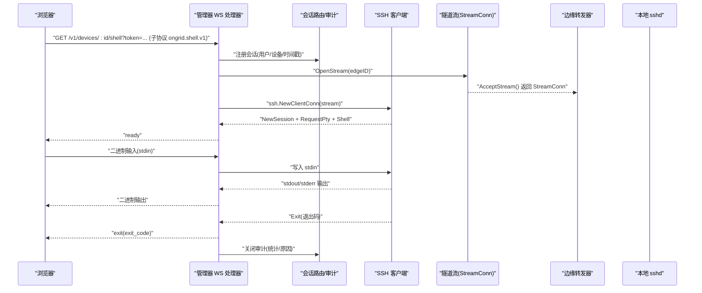
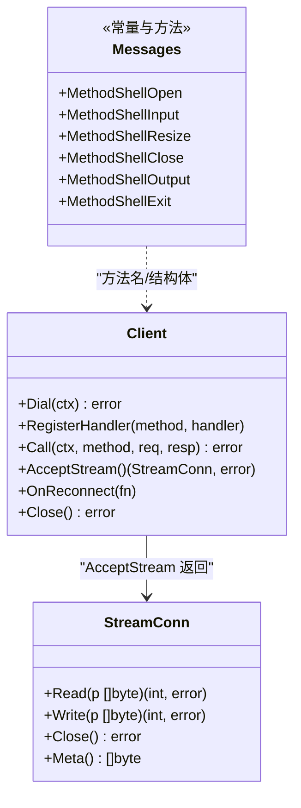
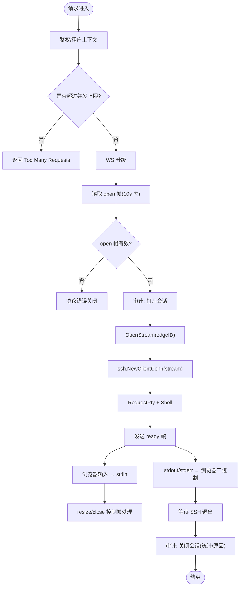
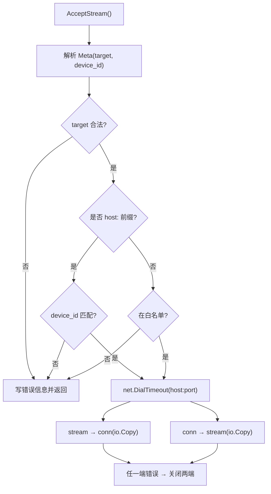
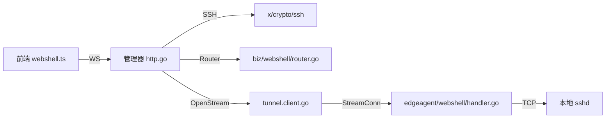

# 流式数据传输

<cite>
**本文引用的文件**   
- [internal/pkg/tunnel/types.go](file://internal/pkg/tunnel/types.go)
- [internal/pkg/tunnel/client.go](file://internal/pkg/tunnel/client.go)
- [internal/pkg/tunnel/messages.go](file://internal/pkg/tunnel/messages.go)
- [internal/edgeagent/webshell/handler.go](file://internal/edgeagent/webshell/handler.go)
- [internal/manager/server/webshell/http.go](file://internal/manager/server/webshell/http.go)
- [internal/manager/biz/webshell/router.go](file://internal/manager/biz/webshell/router.go)
- [web/src/api/webshell.ts](file://web/src/api/webshell.ts)
</cite>

## 目录
1. [简介](#简介)
2. [项目结构](#项目结构)
3. [核心组件](#核心组件)
4. [架构总览](#架构总览)
5. [详细组件分析](#详细组件分析)
6. [依赖关系分析](#依赖关系分析)
7. [性能与背压](#性能与背压)
8. [故障排查指南](#故障排查指南)
9. [结论](#结论)
10. [附录：开发指南](#附录开发指南)

## 简介
本文件系统化梳理 OnGrid 的流式数据传输能力，重点覆盖以下方面：
- WebSocket 流连接建立、双向数据流传输与实时通信机制
- StreamConn 接口实现、数据分块处理与背压控制
- WebShell 终端会话管理、文件传输优化与带宽限制策略
- 流连接生命周期管理、异常恢复与数据完整性保证
- 提供架构图、时序图与流程图，并给出性能优化建议与排障方法

## 项目结构
围绕“流式数据传输”的关键代码分布在如下模块：
- 隧道层（Edge ↔ Manager）：定义客户端、流接口、消息协议
- 边缘侧 WebShell 转发器：接收远端打开的流，按 Meta 目标转发到本地 TCP
- 管理端 WebShell HTTP/WebSocket 处理器：升级 WS、创建 SSH 会话、桥接浏览器与 SSH
- 前端 WebShell API：构建 WS URL、发送控制帧与二进制输入

```mermaid
graph TB
subgraph "浏览器"
FE["WebShell 前端<br/>WebSocket 客户端"]
end
subgraph "管理器(Manager)"
HTTP["HTTP + WebSocket 处理器<br/>/v1/devices/:id/shell"]
Router["会话路由/审计/限流"]
SSH["SSH 客户端<br/>PTY + Shell"]
end
subgraph "边端(Edge)"
TClient["tunnel.Client<br/>geminio 长连接"]
WSH["WebShell 转发器<br/>AcceptStream → io.Copy"]
LocalSSHD["本地 sshd<br/>127.0.0.1:22"]
end
FE --> |WS 文本/二进制| HTTP
HTTP --> |OpenStream 元数据| TClient
TClient --> |双向字节流| WSH
WSH --> |TCP 连接| LocalSSHD
SSH < --> |stdin/stdout| HTTP
```

图表来源
- [internal/manager/server/webshell/http.go:154-363](file://internal/manager/server/webshell/http.go#L154-L363)
- [internal/edgeagent/webshell/handler.go:103-174](file://internal/edgeagent/webshell/handler.go#L103-L174)
- [internal/pkg/tunnel/client.go:345-370](file://internal/pkg/tunnel/client.go#L345-L370)

章节来源
- [internal/pkg/tunnel/types.go:108-119](file://internal/pkg/tunnel/types.go#L108-L119)
- [internal/pkg/tunnel/client.go:62-141](file://internal/pkg/tunnel/client.go#L62-L141)
- [internal/manager/server/webshell/http.go:154-363](file://internal/manager/server/webshell/http.go#L154-L363)
- [internal/edgeagent/webshell/handler.go:103-174](file://internal/edgeagent/webshell/handler.go#L103-L174)
- [web/src/api/webshell.ts:36-58](file://web/src/api/webshell.ts#L36-L58)

## 核心组件
- StreamConn 接口：面向隧道层的窄接口，提供 Read/Write/Close/Meta，屏蔽底层实现细节
- tunnel.Client：边端长连接客户端，封装重试拨号、RPC 注册、反向调用接受、流接受等
- WebShell 管理器处理器：负责 WS 升级、鉴权与会话计数、审计记录、SSH 会话建立与桥接
- WebShell 边缘转发器：解析 Meta 目标，校验安全策略，建立本地 TCP 连接并进行双向复制
- 前端 WebShell API：构造 WS URL、发送 open/resize/close 控制帧、收发二进制终端数据

章节来源
- [internal/pkg/tunnel/types.go:108-119](file://internal/pkg/tunnel/types.go#L108-L119)
- [internal/pkg/tunnel/client.go:62-141](file://internal/pkg/tunnel/client.go#L62-L141)
- [internal/manager/server/webshell/http.go:154-363](file://internal/manager/server/webshell/http.go#L154-L363)
- [internal/edgeagent/webshell/handler.go:103-174](file://internal/edgeagent/webshell/handler.go#L103-L174)
- [web/src/api/webshell.ts:36-58](file://web/src/api/webshell.ts#L36-L58)

## 架构总览
整体采用“浏览器 WS ↔ 管理器 SSH 客户端 ↔ 隧道流 ↔ 边缘转发器 ↔ 本地 sshd”的链路。关键特性：
- 管理器侧持有 SSH 会话与 PTY，承担认证、窗口大小、退出码与审计
- 边缘侧仅做透明字节转发，不维护 SSH 状态，保持轻量
- 通过 StreamConn 抽象统一读写与关闭语义，便于替换底层实现



图表来源
- [internal/manager/server/webshell/http.go:154-363](file://internal/manager/server/webshell/http.go#L154-L363)
- [internal/edgeagent/webshell/handler.go:103-174](file://internal/edgeagent/webshell/handler.go#L103-L174)
- [internal/pkg/tunnel/client.go:345-370](file://internal/pkg/tunnel/client.go#L345-L370)

## 详细组件分析

### StreamConn 接口与隧道层
- StreamConn 提供 Read/Write/Close/Meta，是隧道层对上层应用的稳定契约
- tunnel.Client 封装 geminio 长连接，支持：
  - Dial 指数退避重连
  - RegisterHandler 云→边 RPC 注册
  - Call 边→云 RPC 调用
  - AcceptStream 云→边打开的双向流
  - OnReconnect 回调用于重连后重新注册业务逻辑
- messages.go 定义了 WebSSH 相关的方法名与请求/响应结构体，作为未来演进时的协议边界



图表来源
- [internal/pkg/tunnel/types.go:108-119](file://internal/pkg/tunnel/types.go#L108-L119)
- [internal/pkg/tunnel/client.go:62-141](file://internal/pkg/tunnel/client.go#L62-L141)
- [internal/pkg/tunnel/messages.go:43-80](file://internal/pkg/tunnel/messages.go#L43-L80)

章节来源
- [internal/pkg/tunnel/types.go:108-119](file://internal/pkg/tunnel/types.go#L108-L119)
- [internal/pkg/tunnel/client.go:62-141](file://internal/pkg/tunnel/client.go#L62-L141)
- [internal/pkg/tunnel/messages.go:43-80](file://internal/pkg/tunnel/messages.go#L43-L80)

### WebShell 管理器侧（HTTP + WebSocket + SSH）
- 路由与鉴权：/v1/devices/{device_id}/shell，基于租户上下文与权限中间件
- 并发限制：每用户/每设备最大会话数
- 审计：会话开启/关闭记录，包含入/出字节数、退出码、终止原因
- 会话桥接：
  - 读取浏览器 open 帧，校验必填字段
  - OpenStream 打开隧道流，包装为 SSH 客户端连接
  - 启动 PTY 与 Shell，将 stdout/stderr 以二进制帧推送给浏览器
  - 处理 resize/close 控制帧，更新窗口或结束会话
  - 空闲超时自动关闭



图表来源
- [internal/manager/server/webshell/http.go:154-363](file://internal/manager/server/webshell/http.go#L154-L363)
- [internal/manager/biz/webshell/router.go:72-101](file://internal/manager/biz/webshell/router.go#L72-L101)

章节来源
- [internal/manager/server/webshell/http.go:154-363](file://internal/manager/server/webshell/http.go#L154-L363)
- [internal/manager/biz/webshell/router.go:72-101](file://internal/manager/biz/webshell/router.go#L72-L101)

### WebShell 边缘侧（流转发与安全策略）
- 接受流：acceptLoop 循环 AcceptStream，失败时短暂休眠并重试
- 解析 Meta：根据 target 决定转发目标；支持回环白名单与 host:ip:port 前缀
- 防伪造：host: 路径要求 device_id 匹配本机指纹，未注册则拒绝
- 双向复制：使用 io.Copy 在 stream 与本地 TCP 连接之间互拷，任一端错误即关闭另一端



图表来源
- [internal/edgeagent/webshell/handler.go:103-174](file://internal/edgeagent/webshell/handler.go#L103-L174)

章节来源
- [internal/edgeagent/webshell/handler.go:103-174](file://internal/edgeagent/webshell/handler.go#L103-L174)

### 前端 WebShell API（WS 建立与控制帧）
- 子协议：ongrid.shell.v1
- 打开流程：构造 WS URL（ws/wss 自动推导），发送 open 帧（cols/rows/term/ssh_user/ssh_pass）
- 控制帧：resize/close；二进制帧承载终端输入
- 错误与退出：服务端推送 auth_error/exit 帧，UI 打印并等待 WS 自然关闭

章节来源
- [web/src/api/webshell.ts:29-103](file://web/src/api/webshell.ts#L29-L103)

## 依赖关系分析
- 管理器侧依赖：
  - gorilla/websocket 进行 WS 升级与读写
  - golang.org/x/crypto/ssh 建立 SSH 客户端会话
  - 内部 router 管理活跃会话与审计
- 边缘侧依赖：
  - internal/pkg/tunnel 提供的 StreamConn 与 Client
  - net 标准库建立本地 TCP 连接
- 前端依赖：
  - 原生 WebSocket API 与 JSON 控制帧



图表来源
- [internal/manager/server/webshell/http.go:154-363](file://internal/manager/server/webshell/http.go#L154-L363)
- [internal/manager/biz/webshell/router.go:72-101](file://internal/manager/biz/webshell/router.go#L72-L101)
- [internal/pkg/tunnel/client.go:345-370](file://internal/pkg/tunnel/client.go#L345-L370)
- [internal/edgeagent/webshell/handler.go:103-174](file://internal/edgeagent/webshell/handler.go#L103-L174)
- [web/src/api/webshell.ts:36-58](file://web/src/api/webshell.ts#L36-L58)

章节来源
- [internal/manager/server/webshell/http.go:154-363](file://internal/manager/server/webshell/http.go#L154-L363)
- [internal/manager/biz/webshell/router.go:72-101](file://internal/manager/biz/webshell/router.go#L72-L101)
- [internal/pkg/tunnel/client.go:345-370](file://internal/pkg/tunnel/client.go#L345-L370)
- [internal/edgeagent/webshell/handler.go:103-174](file://internal/edgeagent/webshell/handler.go#L103-L174)
- [web/src/api/webshell.ts:36-58](file://web/src/api/webshell.ts#L36-L58)

## 性能与背压
- 缓冲区与帧大小
  - 管理器 WS Upgrader 设置读/写缓冲，避免频繁分配
  - 输出泵使用固定大小缓冲区（如 8KB）批量写入，降低系统调用次数
- 背压控制
  - 浏览器 → 管理器：二进制帧逐条写入 SSH stdin，若 SSH 写入阻塞，WS 写入也会阻塞，形成天然背压
  - 管理器 → 浏览器：stdout/stderr 读取阻塞于 SSH，WS 写入阻塞于网络拥塞，不会无界堆积
  - 边缘转发器：io.Copy 双向复制，任一端阻塞都会影响另一端，具备端到端背压
- 空闲与资源回收
  - 空闲超时（IdleTimeout）定期清理长时间无输入的会话，释放资源
  - 并发上限（每用户/每设备）防止单点滥用
- 带宽限制策略
  - 可在网关层（如 Nginx）对 WS 路径实施速率限制
  - 对大输出场景可考虑压缩（需权衡 CPU 与延迟）

章节来源
- [internal/manager/server/webshell/http.go:83-90](file://internal/manager/server/webshell/http.go#L83-L90)
- [internal/manager/server/webshell/http.go:365-382](file://internal/manager/server/webshell/http.go#L365-L382)
- [internal/manager/server/webshell/http.go:399-432](file://internal/manager/server/webshell/http.go#L399-L432)
- [internal/edgeagent/webshell/handler.go:159-174](file://internal/edgeagent/webshell/handler.go#L159-L174)

## 故障排查指南
- WS 无法升级
  - 检查子协议是否匹配 ongrid.shell.v1
  - 确认鉴权中间件与租户上下文是否正确注入
- open 帧缺失或格式错误
  - 确保在 10 秒内发送 open 帧且包含必要字段
- SSH 认证失败
  - 管理器会推送 auth_error 帧，提示用户名/密码错误
- 边缘不可达
  - OpenStream 失败时，管理器推送 edge unreachable 并关闭 WS
- 会话被强制关闭
  - 管理员可通过 kill 接口终止会话；空闲超时也会触发关闭
- 边缘转发错误
  - 非法 target 或缺少 device_id 会导致转发器返回错误信息

章节来源
- [internal/manager/server/webshell/http.go:204-219](file://internal/manager/server/webshell/http.go#L204-L219)
- [internal/manager/server/webshell/http.go:260-296](file://internal/manager/server/webshell/http.go#L260-L296)
- [internal/manager/server/webshell/http.go:399-432](file://internal/manager/server/webshell/http.go#L399-L432)
- [internal/edgeagent/webshell/handler.go:117-148](file://internal/edgeagent/webshell/handler.go#L117-L148)

## 结论
OnGrid 的流式数据传输以 StreamConn 为核心抽象，结合隧道层的高可用重连与边缘侧的安全转发，实现了低耦合、可扩展的实时通信能力。管理器集中管理 SSH 会话与审计，边缘侧保持极简转发逻辑，既保证了安全性，也提升了可维护性与性能。通过合理的缓冲区、背压与空闲回收策略，系统在大规模并发下仍能保持稳定。

## 附录：开发指南
- 新建流式应用
  - 定义 StreamConn 适配层，复用 tunnel.Client.AcceptStream
  - 在管理器侧实现 WS 升级、控制帧解析与数据桥接
  - 在边缘侧解析 Meta，执行安全校验与双向复制
- 最佳实践
  - 始终设置 WS 子协议，避免误用
  - 控制帧与数据帧分离，减少解析开销
  - 合理设置空闲超时与并发上限，保护后端资源
  - 对敏感字段（如密码）尽快清零，避免驻留内存
- 测试建议
  - 模拟网络抖动与断线重连，验证重连与回调
  - 构造非法 Meta 与缺失 device_id，验证安全策略
  - 高负载场景下观察背压行为与内存占用