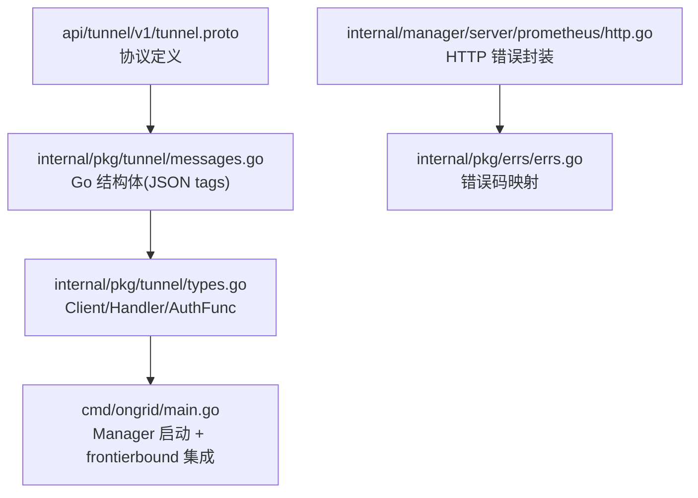
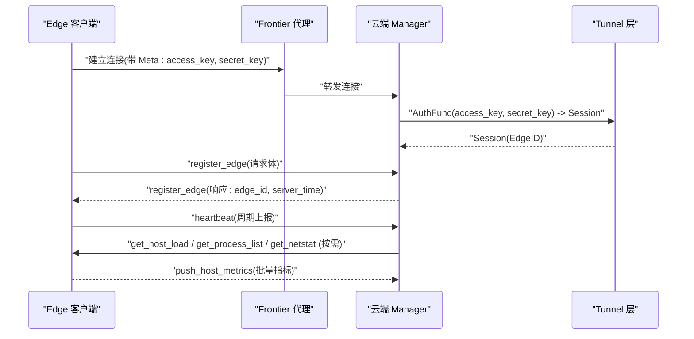
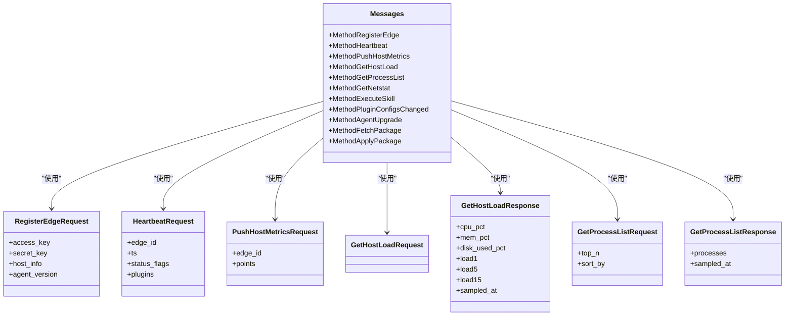
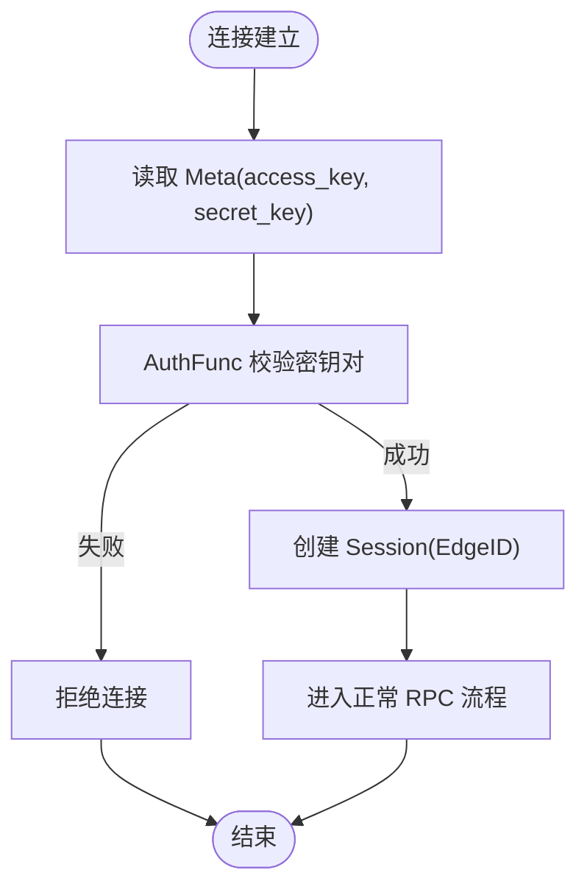
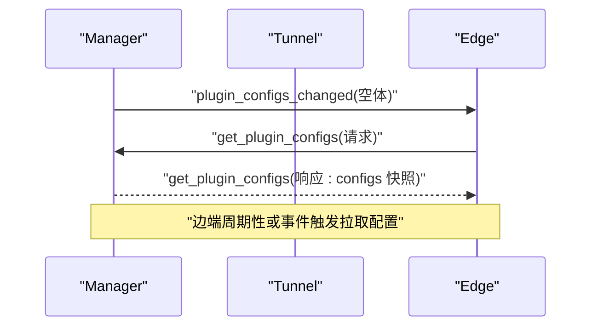
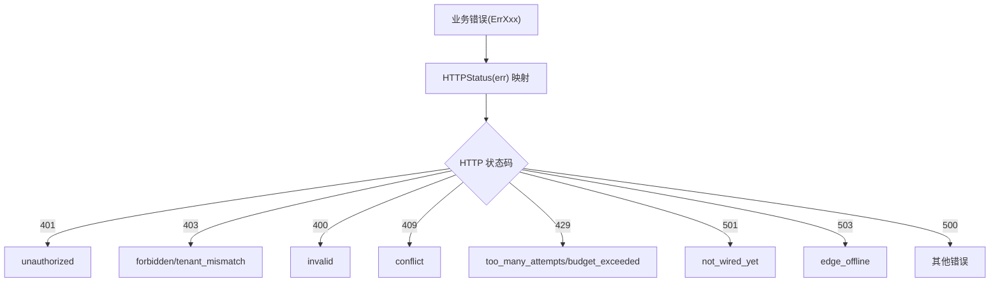
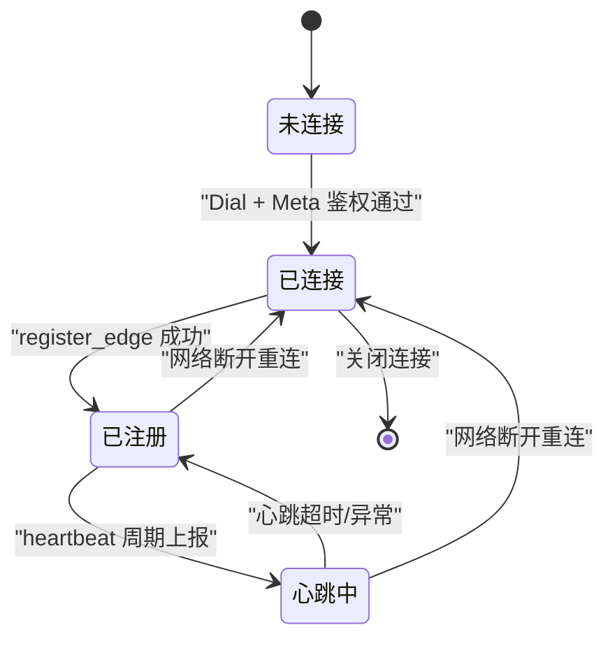
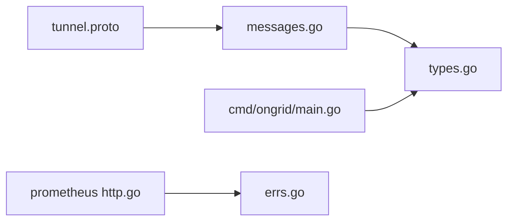

# 消息协议设计

<cite>
**本文引用的文件**
- [api/README.md](file://api/README.md)
- [api/tunnel/v1/tunnel.proto](file://api/tunnel/v1/tunnel.proto)
- [internal/pkg/tunnel/messages.go](file://internal/pkg/tunnel/messages.go)
- [internal/pkg/tunnel/types.go](file://internal/pkg/tunnel/types.go)
- [cmd/ongrid/main.go](file://cmd/ongrid/main.go)
- [internal/manager/server/prometheus/http.go](file://internal/manager/server/prometheus/http.go)
- [internal/pkg/errs/errs.go](file://internal/pkg/errs/errs.go)
</cite>

## 目录
1. [简介](#简介)
2. [项目结构](#项目结构)
3. [核心组件](#核心组件)
4. [架构总览](#架构总览)
5. [详细组件分析](#详细组件分析)
6. [依赖关系分析](#依赖关系分析)
7. [性能考量](#性能考量)
8. [故障排查指南](#故障排查指南)
9. [结论](#结论)
10. [附录](#附录)

## 简介
本文件系统化梳理 OnGrid 的“OnGrid 消息协议”，聚焦于边缘端与云端之间的隧道消息（geminio 通道，MVP 使用 JSON 编码），并覆盖以下要点：
- JSON-RPC 风格的消息格式、方法命名规范与参数传递机制
- Meta 元数据结构、会话管理与身份认证字段
- 请求-响应模式、异步推送与流式通道
- 错误码定义与 HTTP 层映射
- 序列化/反序列化过程、类型安全保证与版本兼容性策略
- 协议状态图、兼容性矩阵、扩展指南与调试建议

说明：
- 本项目在 MVP 阶段未采用 JSON-RPC 标准信封，而是以 geminio 的 method 名作为 RPC 路由键，请求体为 JSON。后续阶段可平滑切换至 protobuf 二进制。
- 本文所有协议细节均来源于仓库中的 proto 定义与 Go 实现注释，避免臆造。

## 项目结构
协议相关代码主要分布在如下位置：
- api/tunnel/v1/tunnel.proto：tunnel 消息的“单一事实来源”（proto 描述）
- internal/pkg/tunnel/messages.go：与 proto 一一对应的 Go 结构体（JSON tags），用于内部传输
- internal/pkg/tunnel/types.go：客户端配置、会话、处理器签名等
- cmd/ongrid/main.go：云端 manager 启动与 frontierbound SDK 集成（注册回调、反向调用）
- internal/manager/server/prometheus/http.go：HTTP 错误统一封装示例（便于理解错误码体系）
- internal/pkg/errs/errs.go：通用错误哨兵与 HTTP 状态码映射

**图示来源**
- [api/tunnel/v1/tunnel.proto:1-166](file://api/tunnel/v1/tunnel.proto#L1-L166)
- [internal/pkg/tunnel/messages.go:1-514](file://internal/pkg/tunnel/messages.go#L1-L514)
- [internal/pkg/tunnel/types.go:1-120](file://internal/pkg/tunnel/types.go#L1-L120)
- [cmd/ongrid/main.go:1-30](file://cmd/ongrid/main.go#L1-L30)
- [internal/manager/server/prometheus/http.go:224-288](file://internal/manager/server/prometheus/http.go#L224-L288)
- [internal/pkg/errs/errs.go:1-54](file://internal/pkg/errs/errs.go#L1-L54)

**章节来源**
- [api/README.md:1-41](file://api/README.md#L1-L41)
- [api/tunnel/v1/tunnel.proto:1-166](file://api/tunnel/v1/tunnel.proto#L1-L166)
- [internal/pkg/tunnel/messages.go:1-514](file://internal/pkg/tunnel/messages.go#L1-L514)
- [internal/pkg/tunnel/types.go:1-120](file://internal/pkg/tunnel/types.go#L1-L120)
- [cmd/ongrid/main.go:1-30](file://cmd/ongrid/main.go#L1-L30)
- [internal/manager/server/prometheus/http.go:224-288](file://internal/manager/server/prometheus/http.go#L224-L288)
- [internal/pkg/errs/errs.go:1-54](file://internal/pkg/errs/errs.go#L1-L54)

## 核心组件
- 方法名常量与方法路由
  - 通过常量集中管理 wire 上的 method 名称，避免拼写错误，如 register_edge、heartbeat、push_host_metrics、get_host_load、get_process_list、get_netstat、execute_skill、plugin_configs_changed、agent_upgrade、fetch_package、apply_package 以及 WebSSH 系列方法。
- 请求/响应体
  - 每个方法对应一组请求/响应结构体，字段通过 json_name 与 proto 保持一致，确保 JSON 序列化稳定。
- 会话与会话上下文
  - Session 承载已认证的 edge 身份；AuthFunc 负责基于 access_key/secret_key 校验并返回 Session。
- 客户端接口
  - Client 提供 Dial、RegisterHandler、Call、AcceptStream、OnReconnect、Close 等方法，封装重连、双向流与回调。

**章节来源**
- [internal/pkg/tunnel/messages.go:15-80](file://internal/pkg/tunnel/messages.go#L15-L80)
- [internal/pkg/tunnel/types.go:8-31](file://internal/pkg/tunnel/types.go#L8-L31)
- [internal/pkg/tunnel/types.go:68-106](file://internal/pkg/tunnel/types.go#L68-L106)

## 架构总览
OnGrid 的隧道通信由前端/云端通过 frontier 代理建立到 edge 的长连接。MVP 阶段：
- 传输层：geminio 通道
- 载荷：JSON（未来可切换到 protobuf 二进制）
- 路由：method 字符串（非 gRPC）
- 认证：Meta 中携带 access_key/secret_key，服务端进行鉴权后建立 Session

**图示来源**
- [internal/pkg/tunnel/messages.go:505-514](file://internal/pkg/tunnel/messages.go#L505-L514)
- [internal/pkg/tunnel/messages.go:258-270](file://internal/pkg/tunnel/messages.go#L258-L270)
- [internal/pkg/tunnel/messages.go:280-320](file://internal/pkg/tunnel/messages.go#L280-L320)
- [internal/pkg/tunnel/messages.go:326-349](file://internal/pkg/tunnel/messages.go#L326-L349)
- [internal/pkg/tunnel/messages.go:383-401](file://internal/pkg/tunnel/messages.go#L383-L401)
- [internal/pkg/tunnel/messages.go:423-433](file://internal/pkg/tunnel/messages.go#L423-L433)
- [cmd/ongrid/main.go:1-13](file://cmd/ongrid/main.go#L1-L13)

## 详细组件分析

### 方法命名与消息格式
- 方法命名
  - 全部以小写下划线形式，语义清晰，集中在 messages.go 的常量区，供两端一致使用。
- 消息格式
  - 请求/响应均为 JSON 对象，字段名与 proto 的 json_name 严格对齐。
  - 时间戳：部分使用 unix 秒或毫秒（如 ts_ms），需按字段约定解析。
  - 枚举值：以字符串形式传输（如 sort_by="cpu"/"mem"）。

**图示来源**
- [internal/pkg/tunnel/messages.go:15-80](file://internal/pkg/tunnel/messages.go#L15-L80)
- [internal/pkg/tunnel/messages.go:258-270](file://internal/pkg/tunnel/messages.go#L258-L270)
- [internal/pkg/tunnel/messages.go:280-320](file://internal/pkg/tunnel/messages.go#L280-L320)
- [internal/pkg/tunnel/messages.go:326-349](file://internal/pkg/tunnel/messages.go#L326-L349)
- [internal/pkg/tunnel/messages.go:383-401](file://internal/pkg/tunnel/messages.go#L383-L401)
- [internal/pkg/tunnel/messages.go:423-433](file://internal/pkg/tunnel/messages.go#L423-L433)

**章节来源**
- [internal/pkg/tunnel/messages.go:15-80](file://internal/pkg/tunnel/messages.go#L15-L80)
- [internal/pkg/tunnel/messages.go:258-270](file://internal/pkg/tunnel/messages.go#L258-L270)
- [internal/pkg/tunnel/messages.go:280-320](file://internal/pkg/tunnel/messages.go#L280-L320)
- [internal/pkg/tunnel/messages.go:326-349](file://internal/pkg/tunnel/messages.go#L326-L349)
- [internal/pkg/tunnel/messages.go:383-401](file://internal/pkg/tunnel/messages.go#L383-L401)
- [internal/pkg/tunnel/messages.go:423-433](file://internal/pkg/tunnel/messages.go#L423-L433)

### Meta 元数据、会话与认证
- Meta 结构
  - 包含 access_key 与 secret_key，用于连接时鉴权。
- 会话
  - AuthFunc 校验通过后返回 Session（当前仅含 EdgeID），后续处理函数可通过 Session 获取已认证身份。
- 客户端配置
  - ClientConfig 支持 ServerAddr/CloudAddr、AccessKey/SecretKey、TLS CA 等。

**图示来源**
- [internal/pkg/tunnel/messages.go:505-514](file://internal/pkg/tunnel/messages.go#L505-L514)
- [internal/pkg/tunnel/types.go:26-31](file://internal/pkg/tunnel/types.go#L26-L31)
- [internal/pkg/tunnel/types.go:33-50](file://internal/pkg/tunnel/types.go#L33-L50)

**章节来源**
- [internal/pkg/tunnel/messages.go:505-514](file://internal/pkg/tunnel/messages.go#L505-L514)
- [internal/pkg/tunnel/types.go:8-31](file://internal/pkg/tunnel/types.go#L8-L31)
- [internal/pkg/tunnel/types.go:33-50](file://internal/pkg/tunnel/types.go#L33-L50)

### 请求-响应与异步/流式
- 请求-响应
  - 典型方法如 register_edge、heartbeat、push_host_metrics、get_host_load、get_process_list、get_netstat 均为同步请求-响应。
- 异步通知
  - plugin_configs_changed 为云端→边端的异步通知，边端收到后主动拉取最新配置快照。
- 流式通道
  - WebSSH 使用 AcceptStream 打开双向流，将浏览器终端 I/O 透传到本地 sshd。

**图示来源**
- [internal/pkg/tunnel/messages.go:29-36](file://internal/pkg/tunnel/messages.go#L29-L36)
- [internal/pkg/tunnel/messages.go:154-167](file://internal/pkg/tunnel/messages.go#L154-L167)

**章节来源**
- [internal/pkg/tunnel/messages.go:29-36](file://internal/pkg/tunnel/messages.go#L29-L36)
- [internal/pkg/tunnel/messages.go:154-167](file://internal/pkg/tunnel/messages.go#L154-L167)

### 错误码与 HTTP 映射
- 隧道层错误
  - 各方法响应体可能包含 error 字段（例如 execute_skill 的 ExecuteSkillResponse.error）。
- HTTP 层错误
  - 统一的 writeErr 输出 {error, code}，code 来自 errs.HTTPStatus(err) 的映射。
- 常见错误哨兵
  - unauthorized、forbidden、invalid、not_found、conflict、too_many_attempts、budget_exceeded、edge_offline、not_wired_yet 等。

**图示来源**
- [internal/manager/server/prometheus/http.go:253-288](file://internal/manager/server/prometheus/http.go#L253-L288)
- [internal/pkg/errs/errs.go:12-53](file://internal/pkg/errs/errs.go#L12-L53)

**章节来源**
- [internal/manager/server/prometheus/http.go:253-288](file://internal/manager/server/prometheus/http.go#L253-L288)
- [internal/pkg/errs/errs.go:12-53](file://internal/pkg/errs/errs.go#L12-L53)

### 序列化/反序列化与类型安全
- 序列化
  - 使用 Go 标准库 JSON 编解码，字段名通过 json_name 与 proto 保持严格一致。
- 类型安全
  - 通过强类型 Go 结构体约束字段类型与必填性；proto 的 enum 在 wire 上以字符串表示，但 Go 侧有常量约束。
- 兼容性与演进
  - 新增字段默认向后兼容；删除字段需谨慎；proto 包名与 go_package 路径遵循约定，便于生成代码与 buf breaking 检测。

**章节来源**
- [api/README.md:21-31](file://api/README.md#L21-L31)
- [internal/pkg/tunnel/messages.go:1-14](file://internal/pkg/tunnel/messages.go#L1-L14)

### 版本与兼容性策略
- 包与版本
  - proto 包名采用 ongrid.<bc>[.<subdomain>].v<major> 形式，go_package 指向生成的 v1 包。
- 向前兼容
  - 每个 RPC 拥有独立 Request/Response 类型，即使为空也保留，便于后续扩展。
- 变更检测
  - CI 中使用 buf breaking 检测破坏性变更。

**章节来源**
- [api/README.md:21-31](file://api/README.md#L21-L31)
- [api/README.md:33-41](file://api/README.md#L33-L41)

### 协议状态图（Edge 生命周期）

**图示来源**
- [internal/pkg/tunnel/types.go:68-106](file://internal/pkg/tunnel/types.go#L68-L106)
- [internal/pkg/tunnel/messages.go:258-270](file://internal/pkg/tunnel/messages.go#L258-L270)
- [internal/pkg/tunnel/messages.go:280-320](file://internal/pkg/tunnel/messages.go#L280-L320)

### 兼容性矩阵（方法族）
- 基础链路
  - register_edge、heartbeat、push_host_metrics
- 诊断查询
  - get_host_load、get_process_list、get_netstat
- 插件与技能
  - execute_skill、get_plugin_configs、plugin_configs_changed、write_database_metrics_secret
- 升级与打包
  - agent_upgrade、fetch_package、apply_package
- WebSSH
  - shell_open、shell_input、shell_resize、shell_close、shell_output、shell_exit

**章节来源**
- [internal/pkg/tunnel/messages.go:15-80](file://internal/pkg/tunnel/messages.go#L15-L80)

## 依赖关系分析
- 模块耦合
  - tunnel.messages 与 tunnel.types 紧密耦合，前者定义消息体，后者定义客户端与处理器接口。
  - cmd/ongrid/main.go 依赖 frontierbound SDK 注册回调与反向调用，间接依赖 tunnel 层。
  - HTTP 错误封装依赖 errs 包，形成统一的错误码体系。
- 外部依赖
  - frontier 代理承担 geminio 终止与路由；proto 定义是跨语言/跨模块的契约。

**图示来源**
- [api/tunnel/v1/tunnel.proto:1-166](file://api/tunnel/v1/tunnel.proto#L1-L166)
- [internal/pkg/tunnel/messages.go:1-514](file://internal/pkg/tunnel/messages.go#L1-L514)
- [internal/pkg/tunnel/types.go:1-120](file://internal/pkg/tunnel/types.go#L1-L120)
- [cmd/ongrid/main.go:1-30](file://cmd/ongrid/main.go#L1-L30)
- [internal/manager/server/prometheus/http.go:224-288](file://internal/manager/server/prometheus/http.go#L224-L288)
- [internal/pkg/errs/errs.go:1-54](file://internal/pkg/errs/errs.go#L1-L54)

**章节来源**
- [api/tunnel/v1/tunnel.proto:1-166](file://api/tunnel/v1/tunnel.proto#L1-L166)
- [internal/pkg/tunnel/messages.go:1-514](file://internal/pkg/tunnel/messages.go#L1-L514)
- [internal/pkg/tunnel/types.go:1-120](file://internal/pkg/tunnel/types.go#L1-L120)
- [cmd/ongrid/main.go:1-30](file://cmd/ongrid/main.go#L1-L30)
- [internal/manager/server/prometheus/http.go:224-288](file://internal/manager/server/prometheus/http.go#L224-L288)
- [internal/pkg/errs/errs.go:1-54](file://internal/pkg/errs/errs.go#L1-L54)

## 性能考量
- 指标上报批量化
  - push_host_metrics 支持批量点上传，减少往返开销。
- 心跳与状态位
  - heartbeat 支持 status_flags 与插件健康信息，便于快速发现异常。
- 流式通道
  - WebSSH 使用流式 IO，适合交互式场景。
- 重连与退避
  - Client.Dial 具备指数退避重连，提升稳定性。

[本节为通用指导，不直接分析具体文件]

## 故障排查指南
- 连接与认证
  - 检查 Meta 中 access_key/secret_key 是否正确；确认 AuthFunc 是否返回有效 Session。
- 方法路由
  - 核对 method 常量是否与两端一致，避免拼写差异导致路由失败。
- 错误码定位
  - 查看 HTTP 响应中的 code 字段，结合 errs 的错误映射定位问题类别。
- 日志与审计
  - 利用插件健康上报与 heartbeat 的 last_error 字段，快速定位插件崩溃原因。

**章节来源**
- [internal/pkg/tunnel/messages.go:505-514](file://internal/pkg/tunnel/messages.go#L505-L514)
- [internal/pkg/tunnel/messages.go:280-320](file://internal/pkg/tunnel/messages.go#L280-L320)
- [internal/manager/server/prometheus/http.go:253-288](file://internal/manager/server/prometheus/http.go#L253-L288)
- [internal/pkg/errs/errs.go:12-53](file://internal/pkg/errs/errs.go#L12-L53)

## 结论
OnGrid 的隧道消息协议以 proto 为契约、JSON 为载荷、method 为路由，配合 Meta 认证与 Session 管理，实现了稳定可靠的边缘-云端通信。通过统一的错误码映射与可扩展的方法族，既满足当前运维场景，也为后续功能演进预留了空间。

[本节为总结性内容，不直接分析具体文件]

## 附录

### 协议扩展指南
- 新增方法
  - 在 messages.go 的常量区添加新 method 名，并在相应位置补充 Request/Response 结构体。
  - 若涉及 proto 变更，更新 api/tunnel/v1/tunnel.proto，并确保 json_name 与 Go 结构体一致。
- 兼容策略
  - 优先使用可选字段；避免删除已有字段；使用独立的 Request/Response 类型以便演进。
- 测试与验证
  - 使用 buf breaking 检测破坏性变更；在端到端环境中验证序列化/反序列化一致性。

**章节来源**
- [api/README.md:21-31](file://api/README.md#L21-L31)
- [api/README.md:33-41](file://api/README.md#L33-L41)
- [internal/pkg/tunnel/messages.go:1-14](file://internal/pkg/tunnel/messages.go#L1-L14)

### 调试工具使用方法
- 抓包与回放
  - 在 frontier 或网关层抓取 JSON 载荷，对照 proto 与 messages.go 的结构体进行比对。
- 本地联调
  - 使用 Client.OnReconnect 钩子打印关键事件；在 Handler 中记录 method 与 body 摘要。
- 错误追踪
  - 关注 HTTP 响应的 code 字段与业务 error 字段，结合 errs 映射快速定位。

**章节来源**
- [internal/pkg/tunnel/types.go:96-103](file://internal/pkg/tunnel/types.go#L96-L103)
- [internal/manager/server/prometheus/http.go:253-288](file://internal/manager/server/prometheus/http.go#L253-L288)