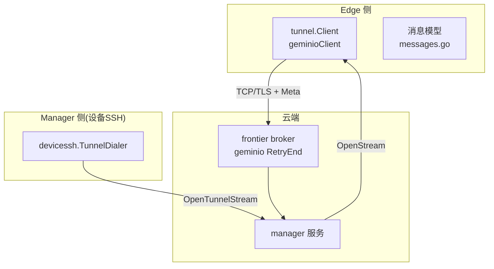
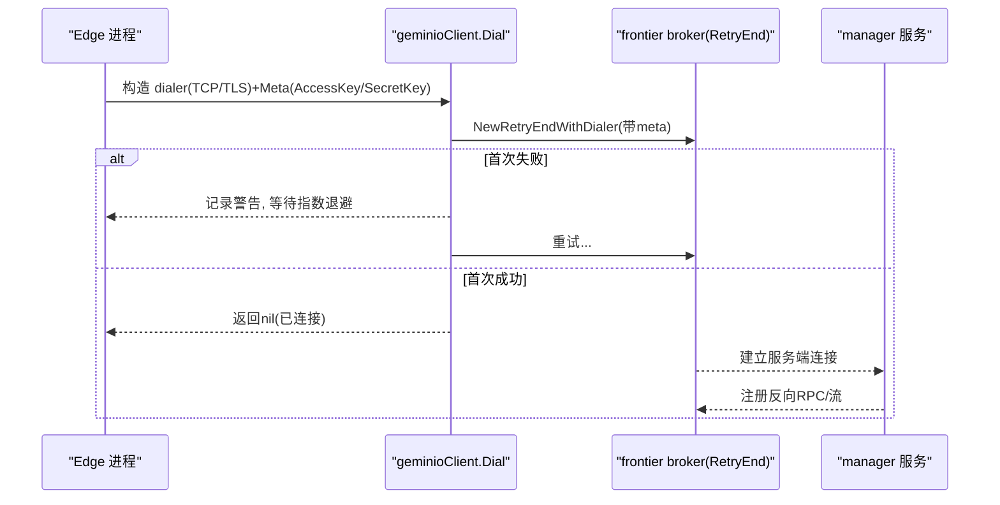
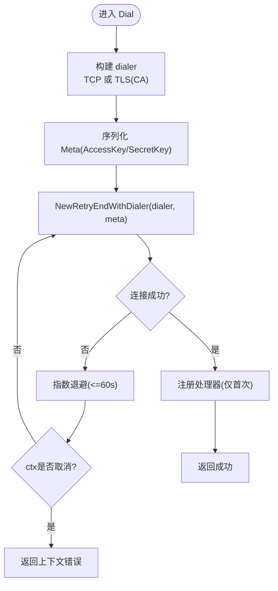
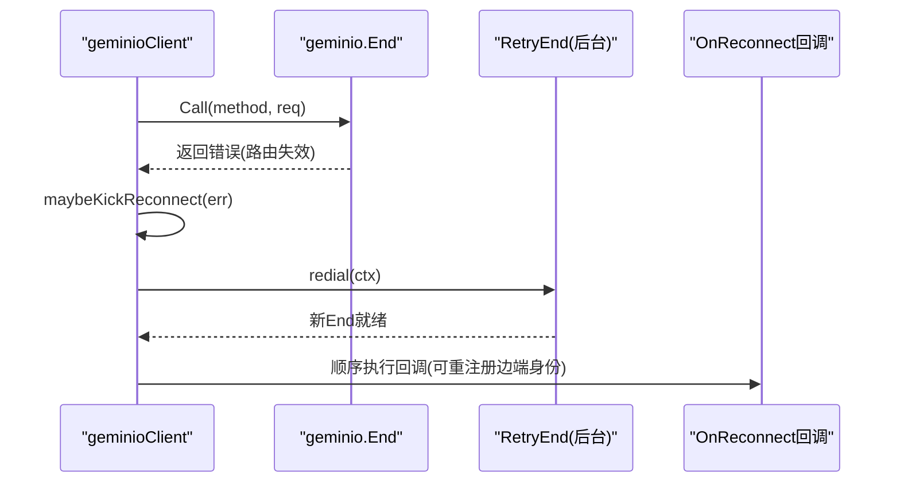
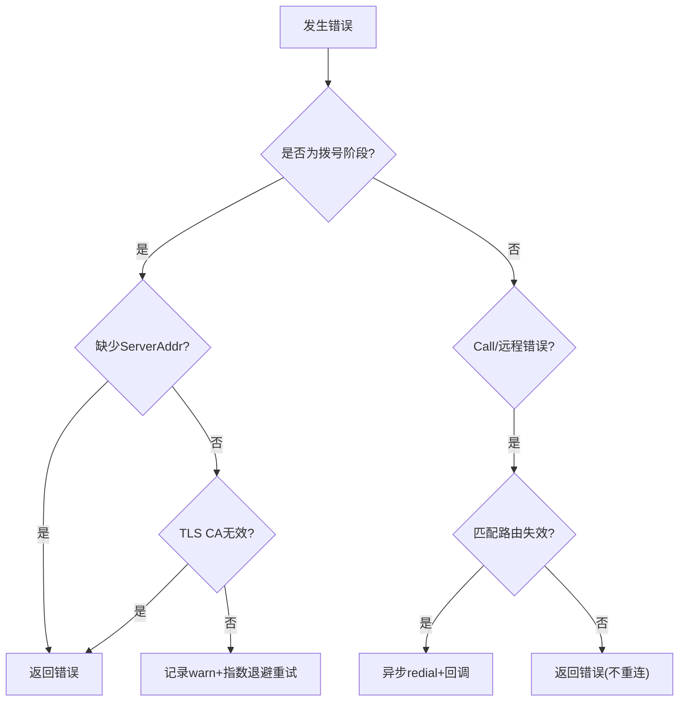
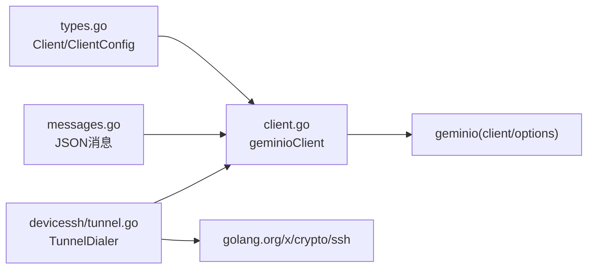

# 隧道连接管理

<cite>
**本文引用的文件**
- [internal/pkg/tunnel/client.go](file://internal/pkg/tunnel/client.go)
- [internal/pkg/tunnel/types.go](file://internal/pkg/tunnel/types.go)
- [internal/pkg/tunnel/doc.go](file://internal/pkg/tunnel/doc.go)
- [internal/pkg/tunnel/messages.go](file://internal/pkg/tunnel/messages.go)
- [internal/manager/biz/devicessh/tunnel.go](file://internal/manager/biz/devicessh/tunnel.go)
- [internal/manager/service/frontierbound/client_test.go](file://internal/manager/service/frontierbound/client_test.go)
</cite>

## 目录
1. [简介](#简介)
2. [项目结构](#项目结构)
3. [核心组件](#核心组件)
4. [架构总览](#架构总览)
5. [详细组件分析](#详细组件分析)
6. [依赖关系分析](#依赖关系分析)
7. [性能与监控](#性能与监控)
8. [故障诊断指南](#故障诊断指南)
9. [结论](#结论)
10. [附录](#附录)

## 简介
本文件聚焦 OnGrid 的“隧道连接管理”，围绕 edge 侧 geminio 客户端实现，系统性阐述：
- Dial 方法的指数退避重连机制
- TLS 证书校验与连接建立流程
- 连接状态管理、错误处理与自动重连策略
- 连接池（复用）与并发安全、资源清理
- 连接建立序列图、错误处理流程图
- 性能监控指标建议与最佳实践

该能力由 internal/pkg/tunnel 提供，edge 通过 geminio 与云端的 frontier broker 建立长连接，承载心跳、遥测、技能执行、WebSSH 等双向 RPC 与流式通道。

## 项目结构
与隧道连接相关的核心代码位于 internal/pkg/tunnel，包含客户端实现、类型定义、消息协议以及若干业务方法的消息形状；manager 侧通过 devicessh.tunnel 将 SSH 会话经边缘 agent 转发到目标主机。



图表来源
- [internal/pkg/tunnel/client.go:66-141](file://internal/pkg/tunnel/client.go#L66-L141)
- [internal/pkg/tunnel/types.go:69-106](file://internal/pkg/tunnel/types.go#L69-L106)
- [internal/manager/biz/devicessh/tunnel.go:97-148](file://internal/manager/biz/devicessh/tunnel.go#L97-L148)

章节来源
- [internal/pkg/tunnel/doc.go:1-14](file://internal/pkg/tunnel/doc.go#L1-L14)
- [internal/pkg/tunnel/types.go:33-66](file://internal/pkg/tunnel/types.go#L33-L66)

## 核心组件
- tunnel.Client 接口：封装拨号、注册处理器、调用 RPC、接受流、重连回调、关闭等能力。
- geminioClient 实现：基于 github.com/singchia/geminio 的 RetryEnd，负责指数退避首连、TLS CA 校验、自动重连、处理器重注册、异步重连触发与回调。
- 消息模型：以 JSON 为线格式，定义 register_edge、heartbeat、push_host_metrics、shell_*、bash.exec、host_files.*、restart_service.restart 等方法及请求/响应结构。
- Manager 侧 TunnelDialer：将 SSH 会话经 manager→frontier→edge 的 OpenStream 路径转发到本地 sshd，形成“隧道”访问。

章节来源
- [internal/pkg/tunnel/types.go:69-106](file://internal/pkg/tunnel/types.go#L69-L106)
- [internal/pkg/tunnel/client.go:27-60](file://internal/pkg/tunnel/client.go#L27-L60)
- [internal/pkg/tunnel/messages.go:17-80](file://internal/pkg/tunnel/messages.go#L17-L80)
- [internal/manager/biz/devicessh/tunnel.go:46-81](file://internal/manager/biz/devicessh/tunnel.go#L46-L81)

## 架构总览
Edge 启动后创建 tunnel.Client，使用 AccessKey/SecretKey 作为 Meta 进行认证；首次 Dial 采用指数退避，成功后进入稳定态。后续网络抖动或路由失效时，底层 RetryEnd 自动重连；当 Call 返回特定错误（如路由失效），客户端会主动发起一次独立的重连并触发 OnReconnect 回调，供上层重新注册边端身份。



图表来源
- [internal/pkg/tunnel/client.go:66-141](file://internal/pkg/tunnel/client.go#L66-L141)
- [internal/pkg/tunnel/client.go:144-176](file://internal/pkg/tunnel/client.go#L144-L176)
- [internal/pkg/tunnel/types.go:69-106](file://internal/pkg/tunnel/types.go#L69-L106)

## 详细组件分析

### 1) Dial 方法与指数退避重连
- 构建 dialer：若配置了 TLS CA 文件，则加载 PEM 并设置 RootCAs，强制最低 TLS 版本；否则走纯 TCP。
- 组装 Meta：AccessKey/SecretKey 序列化后随每次连接发送。
- 指数退避循环：初始间隔 1s，最大 60s，按 2 倍增长；在 ctx 取消前持续尝试。
- 成功后：保存 End 引用，一次性注册所有已注册的处理器（后续重连由 RetryEnd 记忆并自动 reinit）。



图表来源
- [internal/pkg/tunnel/client.go:66-141](file://internal/pkg/tunnel/client.go#L66-L141)
- [internal/pkg/tunnel/client.go:144-176](file://internal/pkg/tunnel/client.go#L144-L176)

章节来源
- [internal/pkg/tunnel/client.go:66-141](file://internal/pkg/tunnel/client.go#L66-L141)
- [internal/pkg/tunnel/client.go:144-176](file://internal/pkg/tunnel/client.go#L144-L176)

### 2) TLS 证书验证与连接建立
- 支持两种模式：
  - 明文 TCP：直接 net.Dial。
  - TLS：读取 CA PEM，构建 x509.CertPool，设置 MinVersion=TLS1.2，使用 tls.Client 完成握手。
- 地址解析：优先 ServerAddr，其次 CloudAddr；CA 文件同理优先 TLSCAFile，其次 TLSCA。

章节来源
- [internal/pkg/tunnel/client.go:144-176](file://internal/pkg/tunnel/client.go#L144-L176)
- [internal/pkg/tunnel/types.go:52-66](file://internal/pkg/tunnel/types.go#L52-L66)

### 3) 连接状态管理与自动重连
- 状态存储：atomic.Pointer[geminio.End] 保存当前 End 引用；closed 标志控制生命周期。
- 自动重连：
  - 首次 Dial 失败：指数退避重试。
  - 运行期断开：由 geminio RetryEnd 内部后台重连。
  - 路由失效：Call 检测到特定错误（包含“not found”或“mismatch clientID”）时，触发一次独立 goroutine 的 redial，并在完成后顺序执行 OnReconnect 回调。
- 处理器重注册：Dial 成功后一次性注册；后续重连由 RetryEnd 记忆并自动恢复。



图表来源
- [internal/pkg/tunnel/client.go:218-243](file://internal/pkg/tunnel/client.go#L218-L243)
- [internal/pkg/tunnel/client.go:258-322](file://internal/pkg/tunnel/client.go#L258-L322)
- [internal/pkg/tunnel/client.go:324-331](file://internal/pkg/tunnel/client.go#L324-L331)

章节来源
- [internal/pkg/tunnel/client.go:218-243](file://internal/pkg/tunnel/client.go#L218-L243)
- [internal/pkg/tunnel/client.go:258-322](file://internal/pkg/tunnel/client.go#L258-L322)
- [internal/pkg/tunnel/client.go:324-331](file://internal/pkg/tunnel/client.go#L324-L331)

### 4) 错误处理与分类
- 拨号阶段：
  - 未配置服务端地址：立即返回错误。
  - TLS CA 读取/解析失败：返回错误。
  - 网络/认证失败：记录 warn 日志并按退避重试。
- 运行期：
  - Call 返回错误：包装后返回，同时可能触发异步重连。
  - 远程错误：同样可能触发重连。
  - 路由失效判定：错误信息包含“not found”或“mismatch clientID”。



图表来源
- [internal/pkg/tunnel/client.go:144-176](file://internal/pkg/tunnel/client.go#L144-L176)
- [internal/pkg/tunnel/client.go:218-243](file://internal/pkg/tunnel/client.go#L218-L243)
- [internal/pkg/tunnel/client.go:324-331](file://internal/pkg/tunnel/client.go#L324-L331)

章节来源
- [internal/pkg/tunnel/client.go:144-176](file://internal/pkg/tunnel/client.go#L144-L176)
- [internal/pkg/tunnel/client.go:218-243](file://internal/pkg/tunnel/client.go#L218-L243)
- [internal/pkg/tunnel/client.go:324-331](file://internal/pkg/tunnel/client.go#L324-L331)

### 5) 连接池与并发安全
- 连接复用：每个 edge 进程维护一个 End（单例），通过 atomic.Pointer 原子读写，避免多路竞争。
- 并发安全：
  - handlers 注册表使用 sync.RWMutex 保护。
  - reconnect 标志使用 atomic.Bool 防止并发重复重连。
  - Close 使用 sync.Once 确保只关闭一次。
- 资源清理：Close 会关闭当前 End，停止后续重试；AcceptStream 在未拨号时返回明确错误。

章节来源
- [internal/pkg/tunnel/client.go:40-60](file://internal/pkg/tunnel/client.go#L40-L60)
- [internal/pkg/tunnel/client.go:334-343](file://internal/pkg/tunnel/client.go#L334-L343)
- [internal/pkg/tunnel/client.go:348-358](file://internal/pkg/tunnel/client.go#L348-L358)

### 6) 流式通道与 WebSSH 隧道
- AcceptStream：阻塞等待云端打开的双向流，返回 StreamConn（Read/Write/Close/Meta）。
- Manager 侧 TunnelDialer：通过 OpenTunnelStream(edgeID, target) 获取 io.ReadWriteCloser，在其上叠加 SSH 会话，实现浏览器 Shell 到边缘本地 sshd 的转发。

```mermaid
sequenceDiagram
participant UI as "浏览器Shell"
participant M as "manager(TunnelDialer)"
participant FB as "frontierbound"
participant E as "edge(geminioClient)"
participant S as "本地sshd"
UI->>M : 发起Shell会话
M->>FB : OpenStream(edgeID, target="host : ... : 22")
FB-->>E : AcceptStream()
E-->>M : 返回StreamConn
M->>S : 建立SSH会话并绑定stdin/stdout
UI<->M : 交互数据透传
```

图表来源
- [internal/manager/biz/devicessh/tunnel.go:97-148](file://internal/manager/biz/devicessh/tunnel.go#L97-L148)
- [internal/pkg/tunnel/types.go:81-95](file://internal/pkg/tunnel/types.go#L81-L95)

章节来源
- [internal/manager/biz/devicessh/tunnel.go:97-148](file://internal/manager/biz/devicessh/tunnel.go#L97-L148)
- [internal/pkg/tunnel/types.go:81-95](file://internal/pkg/tunnel/types.go#L81-L95)

### 7) 处理器与消息协议
- 处理器注册：RegisterHandler 可在拨号前后注册；已存在连接时会即时注册。
- 消息方法：register_edge、heartbeat、push_host_metrics、get_host_load、get_process_list、execute_skill、plugin_configs_changed、write_database_metrics_secret、shell_*、agent_upgrade、fetch_package、apply_package、bash.exec、host_files.*、restart_service.restart 等。
- 元数据：Meta 携带 AccessKey/SecretKey，用于服务端鉴权。

章节来源
- [internal/pkg/tunnel/client.go:178-209](file://internal/pkg/tunnel/client.go#L178-L209)
- [internal/pkg/tunnel/messages.go:17-80](file://internal/pkg/tunnel/messages.go#L17-L80)
- [internal/pkg/tunnel/messages.go:508-514](file://internal/pkg/tunnel/messages.go#L508-L514)

## 依赖关系分析
- 外部依赖：github.com/singchia/geminio（含 client 与 options），golang.org/x/crypto/ssh（manager 侧 SSH 叠加）。
- 模块内依赖：
  - client.go 依赖 types.go 的 ClientConfig/Client 接口。
  - messages.go 提供 JSON 消息体，被上层（edgeagent、manager tools）消费。
  - devicessh/tunnel.go 依赖前端边界 client（frontierbound）提供的 OpenTunnelStream。



图表来源
- [internal/pkg/tunnel/types.go:33-66](file://internal/pkg/tunnel/types.go#L33-L66)
- [internal/pkg/tunnel/client.go:1-21](file://internal/pkg/tunnel/client.go#L1-L21)
- [internal/manager/biz/devicessh/tunnel.go:1-16](file://internal/manager/biz/devicessh/tunnel.go#L1-L16)

章节来源
- [internal/pkg/tunnel/types.go:33-66](file://internal/pkg/tunnel/types.go#L33-L66)
- [internal/pkg/tunnel/client.go:1-21](file://internal/pkg/tunnel/client.go#L1-L21)
- [internal/manager/biz/devicessh/tunnel.go:1-16](file://internal/manager/biz/devicessh/tunnel.go#L1-L16)

## 性能与监控
- 拨号延迟：关注 Dial 首次成功耗时与重试次数（可通过 slog 输出 server_addr/backoff/err 统计）。
- 重连频率：统计 shouldReconnect 触发的次数与 redial 成功率。
- 处理器注册：关注 Dial 后 handler 注册失败的次数。
- 流式通道：AcceptStream 阻塞时长与错误分布。
- 建议指标（Prometheus 暴露点可参考 manager /metrics）：
  - ongrid_tunnel_dial_total、ongrid_tunnel_reconnect_total、ongrid_tunnel_handler_register_failures、ongrid_tunnel_stream_accept_errors、ongrid_tls_handshake_duration_seconds 等。

[本节为通用指导，无需源码引用]

## 故障诊断指南
- 无法拨通
  - 检查 ServerAddr/CloudAddr 是否正确。
  - 若启用 TLS，确认 TLSCAFile/TLSCA 指向有效 CA 文件且包含合法 PEM。
  - 观察 Dial 失败日志中的 backoff 与 err，定位网络/认证问题。
- 频繁重连
  - 关注 Call 错误是否包含“not found”或“mismatch clientID”，说明云端路由失效，需等待自动重连或手动触发 OnReconnect。
  - 检查 frontier 重启导致的短暂不可用窗口。
- 处理器未生效
  - 确认 RegisterHandler 在 Dial 前/后均能正确注册；查看 Dial 后的注册日志。
- WebSSH 无响应
  - 检查 OpenTunnelStream 的 target 参数是否符合 host:ip:port 约定。
  - 确认边缘本地 sshd 可达且端口正确。

章节来源
- [internal/pkg/tunnel/client.go:144-176](file://internal/pkg/tunnel/client.go#L144-L176)
- [internal/pkg/tunnel/client.go:218-243](file://internal/pkg/tunnel/client.go#L218-L243)
- [internal/pkg/tunnel/client.go:324-331](file://internal/pkg/tunnel/client.go#L324-L331)
- [internal/manager/biz/devicessh/tunnel.go:222-233](file://internal/manager/biz/devicessh/tunnel.go#L222-L233)

## 结论
OnGrid 的隧道连接管理以 geminio 的 RetryEnd 为核心，结合指数退避、TLS CA 校验、异步重连与回调机制，提供了高可用的 edge↔cloud 通信通道。配合 manager 侧的 TunnelDialer，可实现对私有网络设备的 SSH 访问。通过合理的日志与指标采集，可有效保障稳定性与可观测性。

[本节为总结，无需源码引用]

## 附录

### API 与方法速览（节选）
- 注册与保活
  - register_edge：边端上线，上报 HostInfo、AgentVersion。
  - heartbeat：周期性心跳，附带插件健康状态。
- 遥测与查询
  - push_host_metrics / push_prom_samples：上报主机指标与 Prometheus 样本。
  - get_host_load / get_process_list：云端拉取实时负载与进程列表。
- 技能与工具
  - execute_skill：统一入口，按 key 分发到本地技能。
  - bash.exec：受限命令执行（cmdpolicy 沙箱）。
  - host_files.*：批量文件扫描/统计。
  - restart_service.restart：受控的服务重启（审批门控）。
- WebSSH
  - shell_open/shell_input/shell_resize/shell_close/shell_output/shell_exit：交互式终端。
- 升级与打包
  - agent_upgrade / fetch_package / apply_package：二进制与包升级流程。

章节来源
- [internal/pkg/tunnel/messages.go:17-80](file://internal/pkg/tunnel/messages.go#L17-L80)
- [internal/pkg/tunnel/bash.go:13-43](file://internal/pkg/tunnel/bash.go#L13-43)
- [internal/pkg/tunnel/host_files.go:24-37](file://internal/pkg/tunnel/host_files.go#L24-37)
- [internal/pkg/tunnel/restart_service.go:21-27](file://internal/pkg/tunnel/restart_service.go#L21-L27)