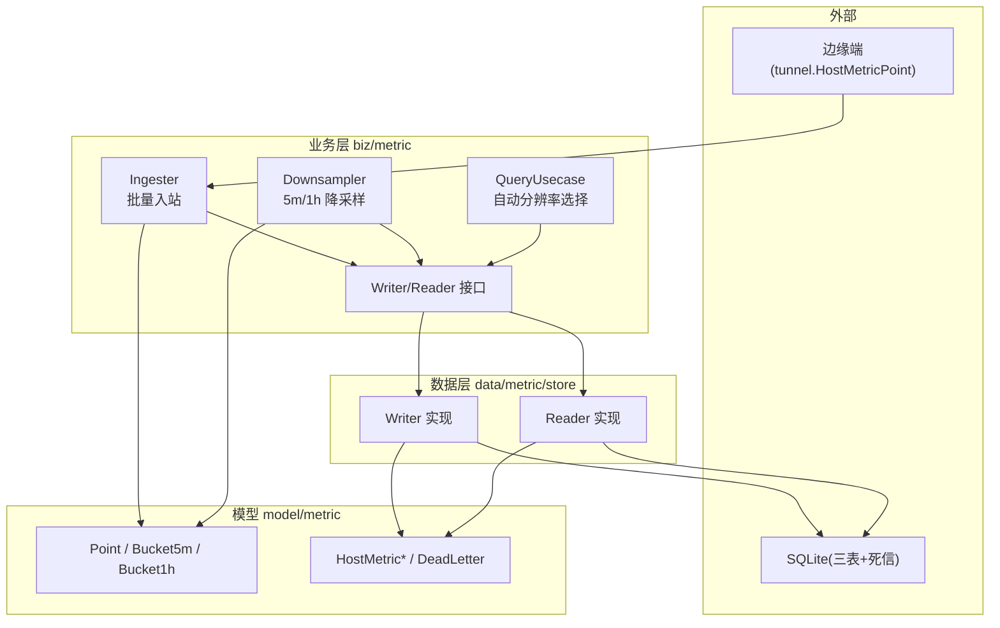
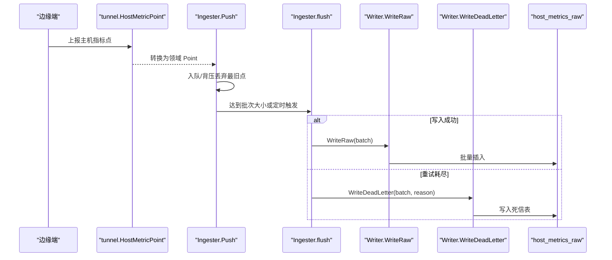
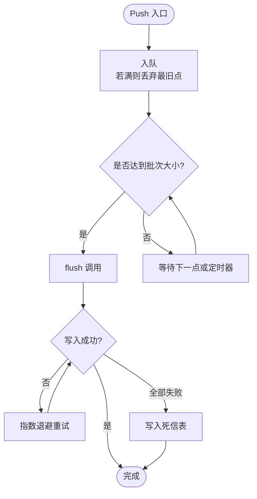
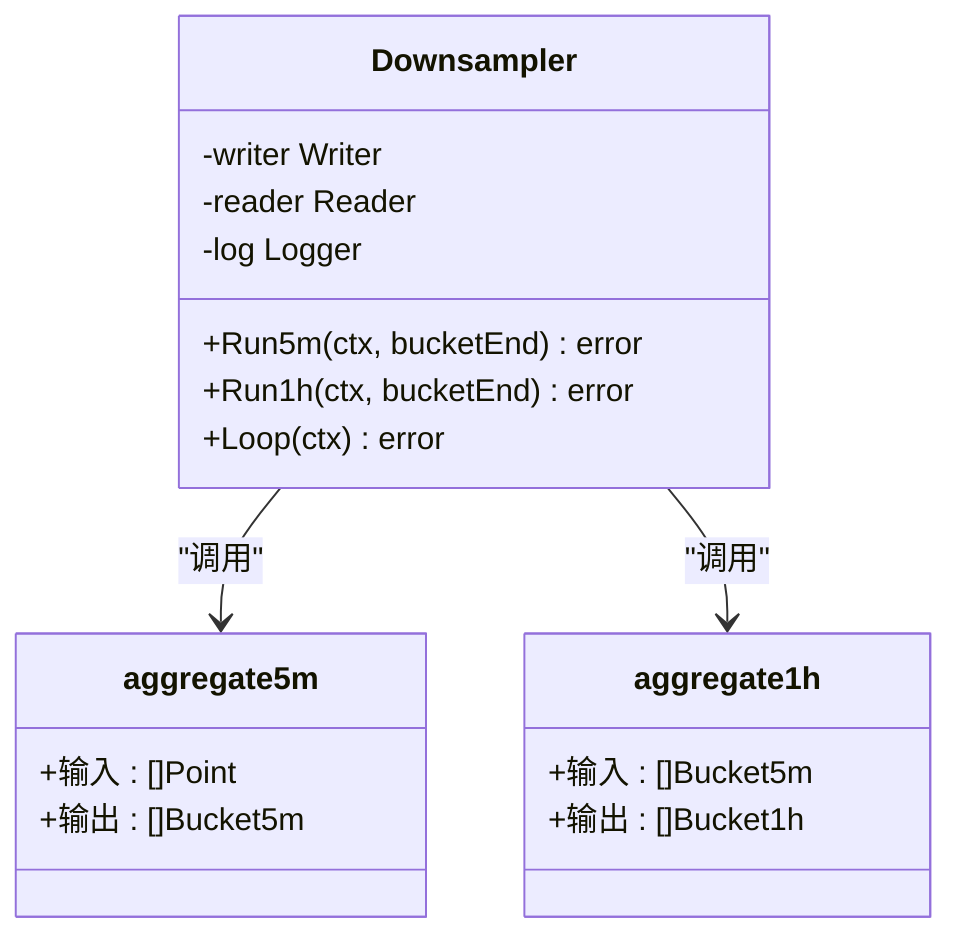
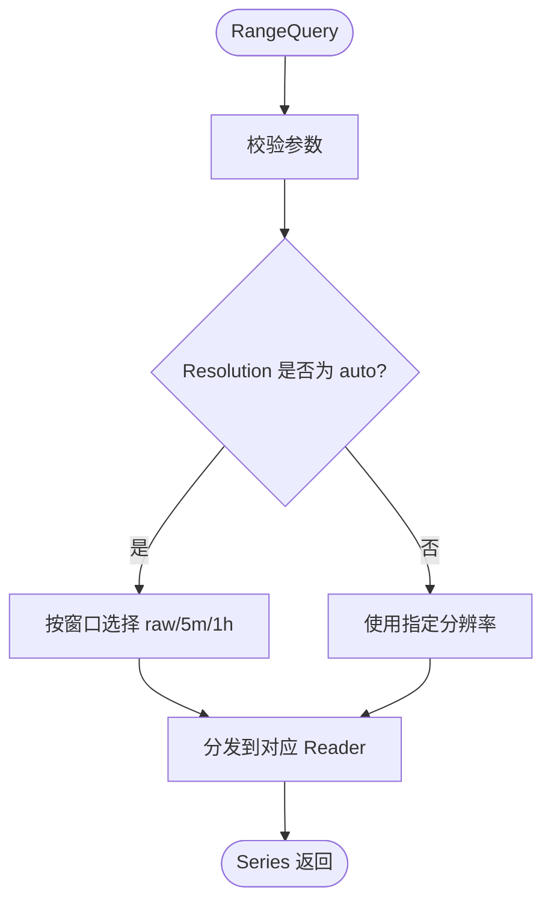
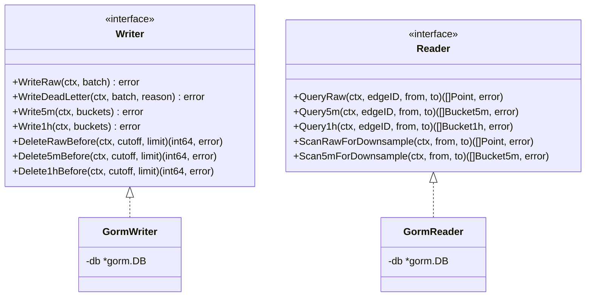
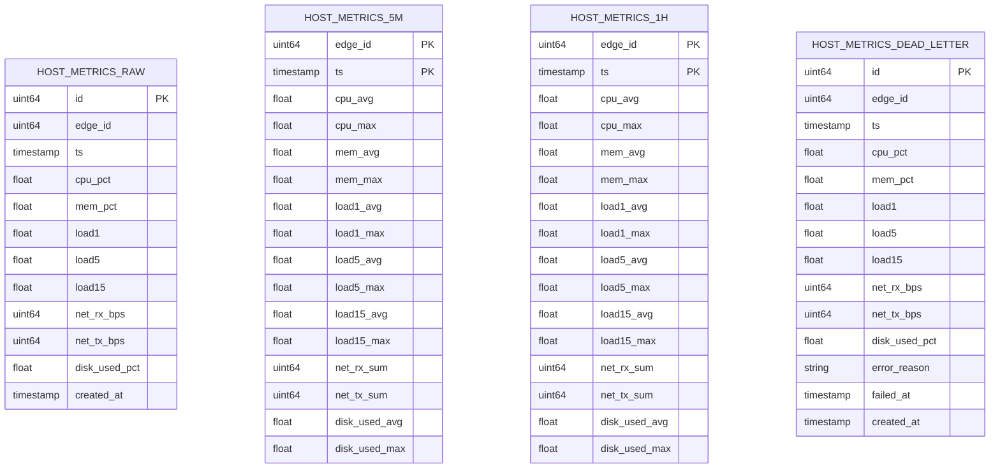
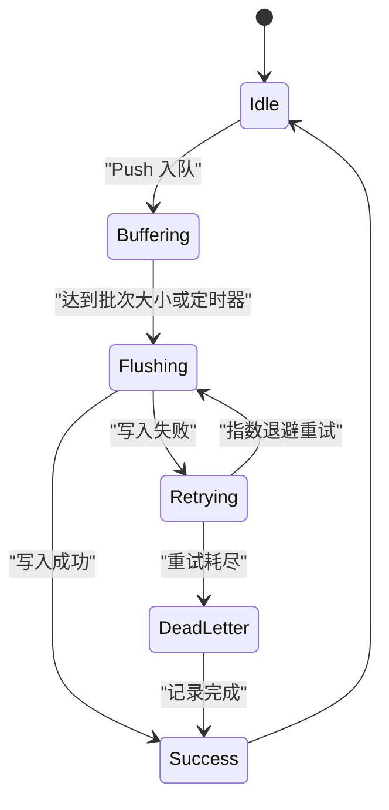
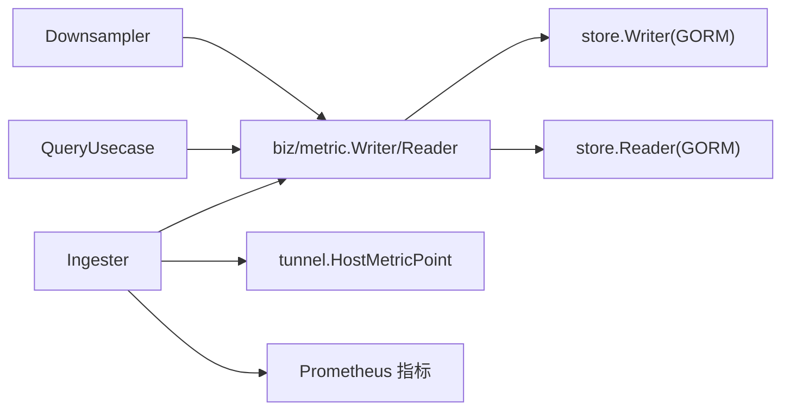

# 数据处理层

<cite>
**本文引用的文件**   
- [doc.go](file://internal/manager/biz/metric/doc.go)
- [ingester.go](file://internal/manager/biz/metric/ingester.go)
- [downsample.go](file://internal/manager/biz/metric/downsample.go)
- [query.go](file://internal/manager/biz/metric/query.go)
- [repo.go](file://internal/manager/biz/metric/repo.go)
- [writer.go](file://internal/manager/data/metric/store/writer.go)
- [reader.go](file://internal/manager/data/metric/store/reader.go)
- [model.go](file://internal/manager/model/metric/model.go)
- [types.go](file://internal/pkg/tunnel/types.go)
- [manager_metrics.go](file://internal/pkg/prom/manager_metrics.go)
</cite>

## 目录
1. [简介](#简介)
2. [项目结构](#项目结构)
3. [核心组件](#核心组件)
4. [架构总览](#架构总览)
5. [详细组件分析](#详细组件分析)
6. [依赖分析](#依赖分析)
7. [性能考虑](#性能考虑)
8. [故障排查指南](#故障排查指南)
9. [结论](#结论)
10. [附录](#附录)

## 简介
本章节聚焦 OnGrid 云端数据处理层，围绕“接收—解析—转换—落盘—聚合—查询—保留”的完整链路展开。重点说明：
- 指标数据的标准化处理、标签映射与时间戳对齐机制
- 数据验证、去重与异常检测逻辑（含死信通道）
- 降采样算法、数据聚合与窗口计算实现
- 数据管道架构图、处理状态图与性能监控指标
- 配置选项、批处理优化与内存管理策略

## 项目结构
数据处理层位于 manager 子域 metric 包，采用“业务接口 + 存储实现 + 领域模型”的分层设计：
- biz/metric：业务层，定义写入/读取接口、入站批处理、降采样与查询路由
- data/metric/store：持久化实现（GORM），面向 SQLite 表
- model/metric：领域值类型与 GORM 行结构
- pkg/tunnel：边缘侧上报协议类型（用于入站点转换）

图表来源
- [ingester.go:1-262](file://internal/manager/biz/metric/ingester.go#L1-L262)
- [downsample.go:1-302](file://internal/manager/biz/metric/downsample.go#L1-L302)
- [query.go:1-133](file://internal/manager/biz/metric/query.go#L1-L133)
- [repo.go:1-53](file://internal/manager/biz/metric/repo.go#L1-L53)
- [writer.go:1-183](file://internal/manager/data/metric/store/writer.go#L1-L183)
- [reader.go:1-170](file://internal/manager/data/metric/store/reader.go#L1-L170)
- [model.go:1-189](file://internal/manager/model/metric/model.go#L1-L189)
- [types.go:1-120](file://internal/pkg/tunnel/types.go#L1-L120)

章节来源
- [doc.go:1-7](file://internal/manager/biz/metric/doc.go#L1-L7)

## 核心组件
- 入站批处理器 Ingester
  - 非阻塞 Push，内部缓冲队列按批次或定时触发 flush
  - 失败重试与死信通道，保证可观测性与容错
- 降采样器 Downsampler
  - 周期扫描 raw/5m 生成 5m/1h 聚合桶
  - 纯函数聚合，幂等写入
- 查询用例 QueryUsecase
  - 基于时间窗口的自动分辨率选择（raw/5m/1h）
  - 统一返回 Series 封装
- 读写接口 Writer/Reader
  - 存储无关的业务契约，屏蔽底层表结构
- 领域模型 Point/Bucket5m/Bucket1h 与 GORM 行 HostMetric*
  - 明确区分领域值与持久化行，避免泄漏存储细节

章节来源
- [ingester.go:15-118](file://internal/manager/biz/metric/ingester.go#L15-L118)
- [downsample.go:11-115](file://internal/manager/biz/metric/downsample.go#L11-L115)
- [query.go:14-133](file://internal/manager/biz/metric/query.go#L14-L133)
- [repo.go:10-53](file://internal/manager/biz/metric/repo.go#L10-L53)
- [model.go:18-96](file://internal/manager/model/metric/model.go#L18-L96)

## 架构总览
从边缘到云端的端到端数据流如下：

图表来源
- [ingester.go:163-247](file://internal/manager/biz/metric/ingester.go#L163-L247)
- [writer.go:36-88](file://internal/manager/data/metric/store/writer.go#L36-L88)
- [model.go:34-50](file://internal/manager/model/metric/model.go#L34-L50)
- [types.go:1-120](file://internal/pkg/tunnel/types.go#L1-L120)

## 详细组件分析

### 入站批处理 Ingester
- 目标
  - 将来自边缘的指标点以高吞吐、低延迟方式批量落库
  - 在背压下优雅降级（丢弃最旧点），并暴露可观测性指标
- 关键行为
  - Push 非阻塞；当缓冲区满时丢弃最旧点并计数
  - 后台 goroutine 按批次大小或定时器触发 flush
  - flush 带指数退避重试；全部失败则写入死信表
- 错误分类
  - 将错误归并为低基数的 label（如 ctx_cancel/write_error），防止基数爆炸
- 指标
  - 写入成功/失败计数、flush 失败原因、丢弃计数、批次大小直方图

图表来源
- [ingester.go:163-247](file://internal/manager/biz/metric/ingester.go#L163-L247)

章节来源
- [ingester.go:15-118](file://internal/manager/biz/metric/ingester.go#L15-L118)
- [ingester.go:163-247](file://internal/manager/biz/metric/ingester.go#L163-L247)
- [ingester.go:249-262](file://internal/manager/biz/metric/ingester.go#L249-L262)

### 降采样与聚合 Downsampler
- 目标
  - 将高频原始样本聚合成 5 分钟和 1 小时桶，降低长期存储与查询成本
- 调度
  - 对齐墙钟边界启动，分别以 5 分钟和 1 小时为周期执行
- 聚合规则
  - 5m：对 gauge 字段求平均与最大，对计数器字段求和，按 edge_id 分组
  - 1h：对 5m 桶再次聚合，avg 字段取等权平均，max 字段取最大值，counter 字段继续求和
- 幂等性
  - 5m/1h 写入使用 Save（覆盖主键冲突），支持重复运行

图表来源
- [downsample.go:11-115](file://internal/manager/biz/metric/downsample.go#L11-L115)
- [downsample.go:121-274](file://internal/manager/biz/metric/downsample.go#L121-L274)

章节来源
- [downsample.go:11-115](file://internal/manager/biz/metric/downsample.go#L11-L115)
- [downsample.go:121-274](file://internal/manager/biz/metric/downsample.go#L121-L274)

### 查询与自动分辨率选择 QueryUsecase
- 目标
  - 根据时间窗口自动选择合适的数据源（raw/5m/1h），对外提供统一 Series 结果
- 自动分辨率策略
  - 窗口 ≤ 6 小时 → raw
  - 窗口 ≤ 7 天 → 5m
  - 否则 → 1h
- 参数校验
  - EdgeID 必填、From < To、窗口不超过 365 天、Resolution 合法

图表来源
- [query.go:70-133](file://internal/manager/biz/metric/query.go#L70-L133)

章节来源
- [query.go:14-133](file://internal/manager/biz/metric/query.go#L14-L133)

### 存储抽象与实现 Writer/Reader
- 接口契约
  - Writer：WriteRaw、WriteDeadLetter、Write5m、Write1h、Delete*Before
  - Reader：QueryRaw/5m/1h、ScanRawForDownsample、Scan5mForDownsample
- 实现要点
  - 批量写入（CreateInBatches）、Save 覆盖以实现幂等
  - 删除操作通过 rowid 子查询限制影响行数，适配 SQLite
  - 读路径按 edge_id 过滤并按 ts 升序返回

图表来源
- [repo.go:10-53](file://internal/manager/biz/metric/repo.go#L10-L53)
- [writer.go:14-183](file://internal/manager/data/metric/store/writer.go#L14-L183)
- [reader.go:13-170](file://internal/manager/data/metric/store/reader.go#L13-L170)

章节来源
- [repo.go:10-53](file://internal/manager/biz/metric/repo.go#L10-L53)
- [writer.go:36-183](file://internal/manager/data/metric/store/writer.go#L36-L183)
- [reader.go:24-170](file://internal/manager/data/metric/store/reader.go#L24-L170)

### 领域模型与数据标准化
- 标准化与时间戳对齐
  - 入站 tunnel.HostMetricPoint 的时间戳为 Unix 秒 UTC，转换为 time.Time.UTC
  - 5m/1h 桶的 Ts 为桶起始时间，严格对齐 5 分钟/小时边界
- 标签映射
  - 当前阶段按 edge_id 维度进行聚合与查询，无 org_id 参与
- 去重与幂等
  - 5m/1h 写入使用 Save 覆盖主键冲突，确保任务重跑幂等
- 异常检测与死信
  - 写入失败经多次重试后进入死信表，附带错误原因与失败时间

图表来源
- [model.go:102-189](file://internal/manager/model/metric/model.go#L102-L189)

章节来源
- [model.go:18-96](file://internal/manager/model/metric/model.go#L18-L96)
- [model.go:102-189](file://internal/manager/model/metric/model.go#L102-L189)

### 处理状态图（Ingester）

图表来源
- [ingester.go:163-247](file://internal/manager/biz/metric/ingester.go#L163-L247)

## 依赖分析
- 组件耦合
  - Ingester/Downsampler/QueryUsecase 仅依赖 Writer/Reader 接口，解耦存储实现
  - store.Writer/Reader 依赖 GORM 与具体表结构
- 外部依赖
  - tunnel.HostMetricPoint 作为入站数据载体
  - Prometheus 指标注册用于可观测性

图表来源
- [repo.go:10-53](file://internal/manager/biz/metric/repo.go#L10-L53)
- [writer.go:14-183](file://internal/manager/data/metric/store/writer.go#L14-L183)
- [reader.go:13-170](file://internal/manager/data/metric/store/reader.go#L13-L170)
- [types.go:1-120](file://internal/pkg/tunnel/types.go#L1-L120)
- [manager_metrics.go:289-301](file://internal/pkg/prom/manager_metrics.go#L289-L301)

章节来源
- [repo.go:10-53](file://internal/manager/biz/metric/repo.go#L10-L53)
- [manager_metrics.go:289-301](file://internal/pkg/prom/manager_metrics.go#L289-L301)

## 性能考虑
- 批处理与内存
  - 默认批次大小 500，缓冲容量为批次大小的 4 倍，减少系统调用与锁竞争
  - flush 前做防御性拷贝，避免调用方复用切片导致竞态
- 写入优化
  - 使用 CreateInBatches 批量插入；5m/1h 使用 Save 覆盖实现幂等
  - 删除操作通过 rowid 子查询限制影响行数，避免长事务
- 调度与对齐
  - 降采样对齐墙钟边界，避免与正在填充的桶竞争
- 可观测性
  - 暴露写入成功/失败、flush 失败原因、丢弃计数、批次大小等指标，便于定位瓶颈

[本节为通用性能建议，不直接分析具体文件]

## 故障排查指南
- 常见现象
  - 指标丢失：关注 buffer_full 丢弃计数与 dead letter 表
  - 写入失败：检查 flush 失败原因分类（ctx_cancel/write_error）
  - 聚合异常：确认 5m/1h 任务是否按时执行且幂等覆盖
- 定位步骤
  - 查看 ingester 指标：ongrid_ingest_dropped_total、ongrid_ingest_flush_failures_total、ongrid_ingest_batch_size
  - 检查 host_metrics_dead_letter 表中的 error_reason 与 failed_at
  - 核对 5m/1h 表的幂等覆盖情况（主键冲突即覆盖）

章节来源
- [ingester.go:249-262](file://internal/manager/biz/metric/ingester.go#L249-L262)
- [writer.go:59-88](file://internal/manager/data/metric/store/writer.go#L59-L88)
- [writer.go:90-148](file://internal/manager/data/metric/store/writer.go#L90-L148)

## 结论
OnGrid 数据处理层通过清晰的接口分层、严格的标准化与对齐、稳健的批处理与重试机制、以及幂等的降采样聚合，实现了高吞吐、可扩展且可观测的指标处理流水线。未来可在多租户标签、更细粒度的异常检测与更灵活的窗口策略上持续演进。

[本节为总结性内容，不直接分析具体文件]

## 附录

### 配置与调优清单
- 批处理大小与超时
  - 批次大小：默认 500
  - 刷新间隔：默认 5 秒
  - 缓冲容量倍数：默认 4
- 重试策略
  - 退避序列：100ms / 500ms / 2s
- 自动分辨率阈值
  - raw ≤ 6 小时
  - 5m ≤ 7 天
  - 其他走 1h
- 保留与清理
  - 死信表保留 7 天（由上层保留策略控制）
  - Delete*Before 支持分批删除

章节来源
- [ingester.go:45-57](file://internal/manager/biz/metric/ingester.go#L45-L57)
- [query.go:31-36](file://internal/manager/biz/metric/query.go#L31-L36)
- [model.go:168-189](file://internal/manager/model/metric/model.go#L168-L189)