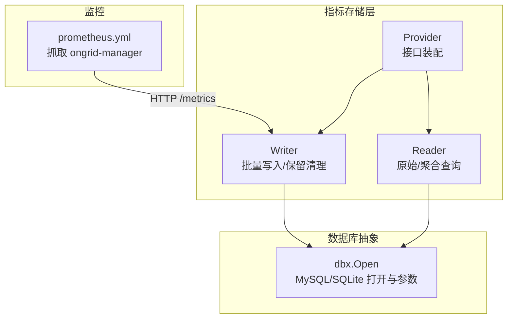
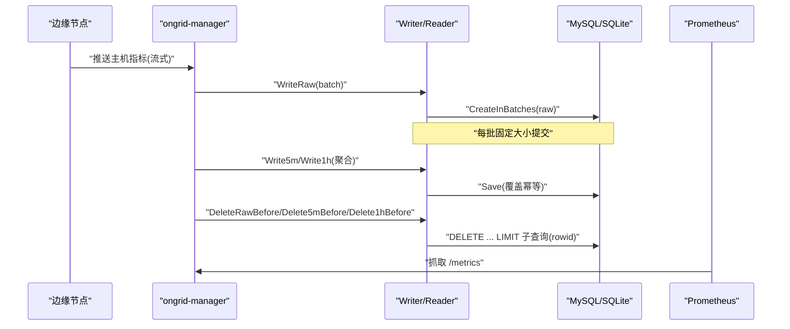
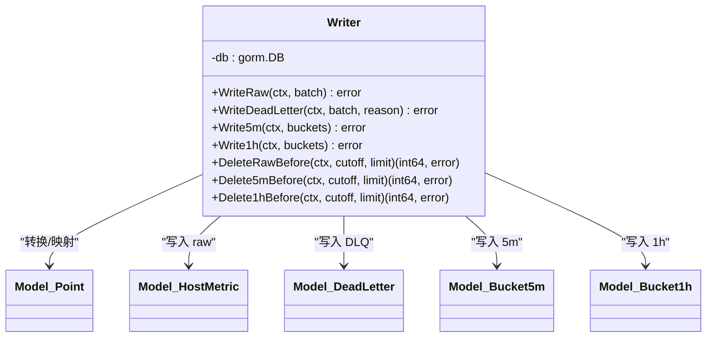
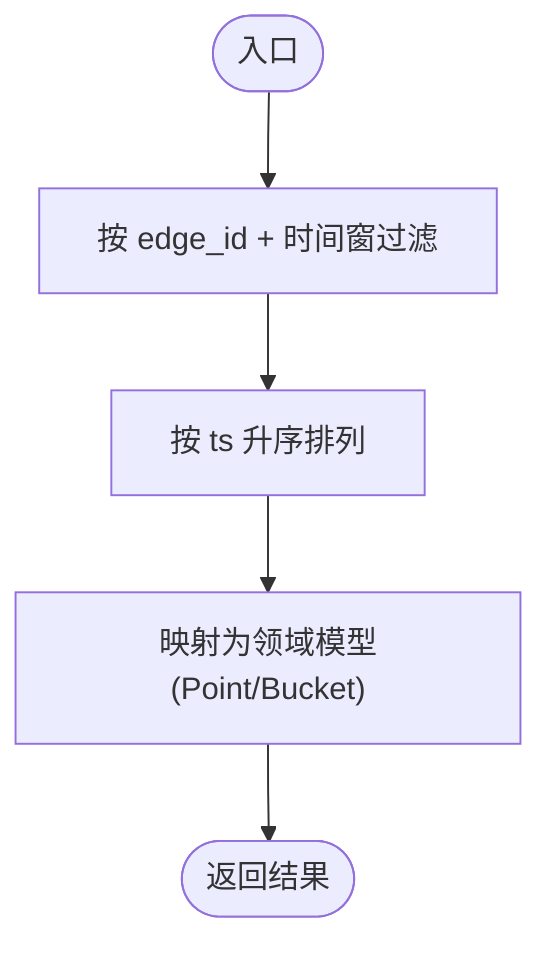
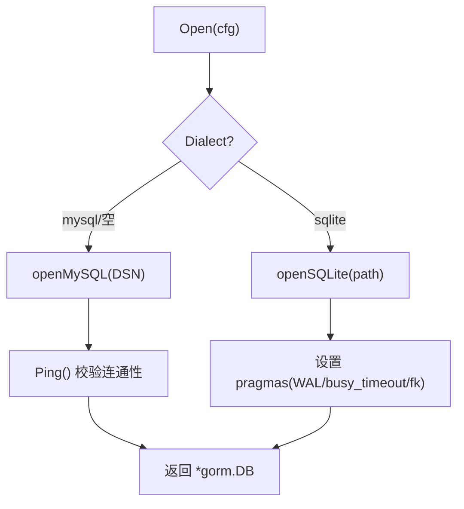
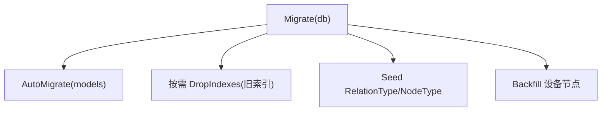
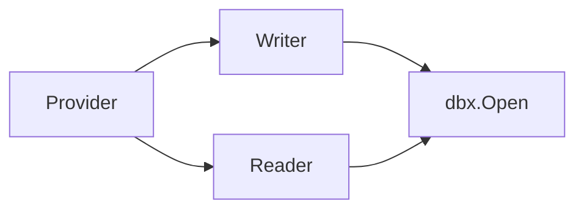
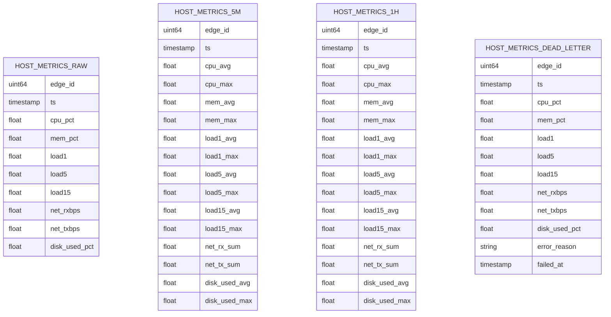

# 数据存储与持久化

<cite>
**本文引用的文件**   
- [writer.go](file://internal/manager/data/metric/store/writer.go)
- [reader.go](file://internal/manager/data/metric/store/reader.go)
- [provider.go](file://internal/manager/data/metric/store/provider.go)
- [dbx.go](file://internal/pkg/dbx/dbx.go)
- [migrate.go](file://internal/manager/data/topology/store/migrate.go)
- [prometheus.yml](file://deploy/install/prometheus.yml)
</cite>

## 目录
1. [引言](#引言)
2. [项目结构](#项目结构)
3. [核心组件](#核心组件)
4. [架构总览](#架构总览)
5. [详细组件分析](#详细组件分析)
6. [依赖分析](#依赖分析)
7. [性能考虑](#性能考虑)
8. [故障排查指南](#故障排查指南)
9. [结论](#结论)
10. [附录](#附录)

## 引言
本章节聚焦 OnGrid 的时序数据写入、聚合、查询与生命周期管理，围绕以下目标展开：
- 时序数据库写入优化策略：批量插入、事务语义与并发控制
- 数据分片与索引设计：按边端维度组织、时间范围扫描与下采样路径
- 存储引擎选择与兼容性：MySQL 与 SQLite 双后端
- 空间回收机制：基于时间的分层清理（raw/5m/1h）
- 迁移脚本管理与版本兼容：幂等迁移与种子数据
- 监控与容量规划：Prometheus 自观测与指标采集配置
- 备份恢复与高可用：路线图中的快照、演练与多副本方案

## 项目结构
与“数据存储与持久化”直接相关的代码位于 manager 的数据层与通用数据库基础设施中：
- 指标仓储实现：GORM 驱动的 Writer/Reader，面向 host_metrics_raw/5m/1h/dead_letter 表族
- 数据库连接与方言适配：dbx 统一打开 MySQL/SQLite，并设置关键参数
- 迁移与种子：以拓扑为例展示幂等 AutoMigrate、索引重建与回补流程
- 监控：Prometheus 对 ongrid-manager 的抓取配置

图表来源
- [writer.go:14-57](file://internal/manager/data/metric/store/writer.go#L14-L57)
- [reader.go:13-50](file://internal/manager/data/metric/store/reader.go#L13-L50)
- [provider.go:9-16](file://internal/manager/data/metric/store/provider.go#L9-L16)
- [dbx.go:34-49](file://internal/pkg/dbx/dbx.go#L34-L49)
- [prometheus.yml:22-25](file://deploy/install/prometheus.yml#L22-L25)

章节来源
- [writer.go:14-183](file://internal/manager/data/metric/store/writer.go#L14-L183)
- [reader.go:13-170](file://internal/manager/data/metric/store/reader.go#L13-L170)
- [provider.go:9-16](file://internal/manager/data/metric/store/provider.go#L9-L16)
- [dbx.go:1-151](file://internal/pkg/dbx/dbx.go#L1-L151)
- [prometheus.yml:1-36](file://deploy/install/prometheus.yml#L1-L36)

## 核心组件
- Writer（写入器）
  - 批量写入 raw 点、DLQ 失败点、5m/1h 聚合桶
  - 使用 CreateInBatches 分批提交；聚合写入采用 Save 覆盖式幂等
  - 提供 DeleteBefore 系列接口，按时间裁剪各层级数据
- Reader（读取器）
  - 支持按 edge_id + 时间窗查询 raw/5m/1h
  - 提供全量扫描接口用于下采样任务（按 edge_id, ts 排序）
- Provider（装配器）
  - 暴露 biz.Writer/biz.Reader 接口值，供上层组装
- dbx（数据库抽象）
  - 统一打开 MySQL/SQLite，设置日志级别、连接探测、WAL/外键等参数
- Prometheus 配置
  - 自监控抓取 ongrid-manager 的 /metrics

章节来源
- [writer.go:14-183](file://internal/manager/data/metric/store/writer.go#L14-L183)
- [reader.go:13-170](file://internal/manager/data/metric/store/reader.go#L13-L170)
- [provider.go:9-16](file://internal/manager/data/metric/store/provider.go#L9-L16)
- [dbx.go:34-151](file://internal/pkg/dbx/dbx.go#L34-L151)
- [prometheus.yml:22-25](file://deploy/install/prometheus.yml#L22-L25)

## 架构总览
时序数据从边缘侧经隧道推送至云端，由 ongrid-manager 接收后落盘到 MySQL/SQLite。写入路径包含：
- 原始点批量入库（host_metrics_raw）
- 定时任务将 raw 聚合成 5m/1h 桶（host_metrics_5m/host_metrics_1h）
- 失败样本进入 DLQ（host_metrics_dead_letter）以便审计与重放
- 定期按时间窗口删除过期数据，释放空间

图表来源
- [writer.go:36-88](file://internal/manager/data/metric/store/writer.go#L36-L88)
- [writer.go:90-148](file://internal/manager/data/metric/store/writer.go#L90-L148)
- [writer.go:150-182](file://internal/manager/data/metric/store/writer.go#L150-L182)
- [prometheus.yml:22-25](file://deploy/install/prometheus.yml#L22-L25)

## 详细组件分析

### 写入器（Writer）
- 批量插入
  - WriteRaw 将 Point 切片映射为 HostMetric 行，使用 CreateInBatches 分批写入，批次大小常量定义在模块内
  - WriteDeadLetter 将失败样本逐条记录原因与失败时间，便于诊断与重放
- 聚合写入
  - Write5m/Write1h 使用 Save 进行覆盖式写入，保证重复执行幂等
- 空间回收
  - DeleteRawBefore/Delete5mBefore/Delete1hBefore 通过统一的 deleteBefore 实现，使用 rowid 子查询限制删除行数，避免一次性锁表或长事务

图表来源
- [writer.go:14-57](file://internal/manager/data/metric/store/writer.go#L14-L57)
- [writer.go:59-88](file://internal/manager/data/metric/store/writer.go#L59-L88)
- [writer.go:90-148](file://internal/manager/data/metric/store/writer.go#L90-L148)
- [writer.go:150-182](file://internal/manager/data/metric/store/writer.go#L150-L182)

章节来源
- [writer.go:14-183](file://internal/manager/data/metric/store/writer.go#L14-L183)

### 读取器（Reader）
- 单边查询
  - QueryRaw/Query5m/Query1h 均按 edge_id + 时间窗过滤，并按 ts 升序返回
- 全局扫描
  - ScanRawForDownsample/Scan5mForDownsample 按 (edge_id, ts) 顺序拉取，便于外部下采样任务消费

图表来源
- [reader.go:24-50](file://internal/manager/data/metric/store/reader.go#L24-L50)
- [reader.go:52-67](file://internal/manager/data/metric/store/reader.go#L52-L67)
- [reader.go:69-101](file://internal/manager/data/metric/store/reader.go#L69-L101)
- [reader.go:103-148](file://internal/manager/data/metric/store/reader.go#L103-L148)

章节来源
- [reader.go:13-170](file://internal/manager/data/metric/store/reader.go#L13-L170)

### 数据库抽象（dbx）
- 方言选择
  - Open 根据配置选择 MySQL 或 SQLite；空方言默认 MySQL
- MySQL
  - 使用 Ping 快速验证连通性，失败即启动期报错
- SQLite
  - 启用 WAL、busy_timeout、foreign_keys 等 pragmas，提升并发读能力与健壮性
- 日志
  - 默认 Warn 级别，避免污染应用日志

图表来源
- [dbx.go:34-49](file://internal/pkg/dbx/dbx.go#L34-L49)
- [dbx.go:51-77](file://internal/pkg/dbx/dbx.go#L51-L77)
- [dbx.go:79-112](file://internal/pkg/dbx/dbx.go#L79-L112)
- [dbx.go:114-128](file://internal/pkg/dbx/dbx.go#L114-L128)

章节来源
- [dbx.go:1-151](file://internal/pkg/dbx/dbx.go#L1-L151)

### 迁移与种子（示例：拓扑）
- 幂等 AutoMigrate：注册 Node/Relation/RelationType/NodeType 等模型
- 索引重建：在需要时先删除旧复合索引再重建
- 软删除标记回填：确保历史数据具备一致性
- 内置种子：RelationType/NodeType 的内置条目 upsert
- 设备节点回填：缺失的设备行自动关联到对应节点

图表来源
- [migrate.go:16-39](file://internal/manager/data/topology/store/migrate.go#L16-L39)
- [migrate.go:41-49](file://internal/manager/data/topology/store/migrate.go#L41-L49)

章节来源
- [migrate.go:1-49](file://internal/manager/data/topology/store/migrate.go#L1-L49)

### 监控与可观测性
- Prometheus 抓取 ongrid-manager 的 /metrics，间隔 15s
- 规则文件通过挂载方式加载，支持热重载

章节来源
- [prometheus.yml:22-25](file://deploy/install/prometheus.yml#L22-L25)

## 依赖分析
- Writer/Reader 依赖 dbx 提供的 *gorm.DB
- Provider 仅暴露接口，解耦具体实现
- 迁移逻辑依赖 GORM AutoMigrate 与自定义工具函数（如软删除标记回填）

图表来源
- [provider.go:9-16](file://internal/manager/data/metric/store/provider.go#L9-L16)
- [writer.go:14-27](file://internal/manager/data/metric/store/writer.go#L14-L27)
- [reader.go:13-22](file://internal/manager/data/metric/store/reader.go#L13-L22)
- [dbx.go:34-49](file://internal/pkg/dbx/dbx.go#L34-L49)

章节来源
- [provider.go:9-16](file://internal/manager/data/metric/store/provider.go#L9-L16)
- [writer.go:14-27](file://internal/manager/data/metric/store/writer.go#L14-L27)
- [reader.go:13-22](file://internal/manager/data/metric/store/reader.go#L13-L22)
- [dbx.go:34-49](file://internal/pkg/dbx/dbx.go#L34-L49)

## 性能考虑
- 批量写入
  - 使用 CreateInBatches 固定批次大小，降低单次事务体积与锁竞争
- 幂等聚合
  - 5m/1h 聚合采用覆盖式写入，允许重跑且不会重复计数
- 删除策略
  - 删除操作按 rowid 子查询 + LIMIT 分批执行，避免长时间锁表与大事务
- 并发与 I/O
  - SQLite 开启 WAL 与 busy_timeout，提高并发读能力与稳定性
  - MySQL 启动期 Ping 快速失败，减少冷启动后的首次查询延迟
- 查询路径
  - 所有查询均按 edge_id + 时间窗过滤，建议为 (edge_id, ts) 建立联合索引以提升范围扫描性能
- 下采样
  - 提供按 (edge_id, ts) 排序的全量扫描接口，利于外部任务顺序消费与断点续传

[本节为通用性能指导，不直接分析具体文件]

## 故障排查指南
- 写入失败定位
  - 检查 DLQ 表：失败样本会附带错误原因与失败时间，便于回放与根因分析
- 删除卡顿或锁等待
  - 确认删除调用是否传入合理 limit；必要时调小批次或增加间隔
- 连接问题
  - MySQL：关注启动期 Ping 失败日志
  - SQLite：确认路径存在、权限正确，WAL 模式已生效
- 监控缺失
  - 确认 Prometheus 能访问 ongrid-manager 的 /metrics 端口与路径

章节来源
- [writer.go:59-88](file://internal/manager/data/metric/store/writer.go#L59-L88)
- [writer.go:150-182](file://internal/manager/data/metric/store/writer.go#L150-L182)
- [dbx.go:51-77](file://internal/pkg/dbx/dbx.go#L51-L77)
- [dbx.go:79-112](file://internal/pkg/dbx/dbx.go#L79-L112)
- [prometheus.yml:22-25](file://deploy/install/prometheus.yml#L22-L25)

## 结论
OnGrid 的时序数据层以 GORM 为核心，结合批量写入、幂等聚合与分批删除，实现了可扩展、可维护的本地持久化方案。通过 dbx 抽象同时支持 MySQL 与 SQLite，满足不同部署场景。配合 Prometheus 自监控与幂等迁移，系统具备良好的可观测性与演进能力。未来可在索引优化、压缩与跨库复制方面持续增强。

[本节为总结性内容，不直接分析具体文件]

## 附录

### 数据模型与表关系（概念图）

[此图为概念建模示意，非直接映射具体源码结构]

### 迁移与版本兼容要点
- 幂等性：AutoMigrate 多次运行无副作用
- 索引变更：在需要时显式删除旧索引后再创建新索引
- 种子数据：使用 upsert 保证内置字典项一致
- 数据回补：对历史数据进行必要的字段/关联补齐

章节来源
- [migrate.go:16-39](file://internal/manager/data/topology/store/migrate.go#L16-L39)
- [migrate.go:41-49](file://internal/manager/data/topology/store/migrate.go#L41-L49)

### 备份恢复与高可用（路线图）
- 管理器状态快照：打包 MySQL + Qdrant + 对象存储，支持可配置保留
- 一键恢复：指向快照 tarball，校验 schema 版本与边端重握手计划
- 异地复制：rsync/S3 同步至冷备区域
- 演练模式：定时从最新备份恢复，统计 MTTR
- 边端状态检查点：升级前对工作目录快照（已有部分 .previous 机制）

章节来源
- [ROADMAP.md:316-358](file://ROADMAP.md#L316-L358)