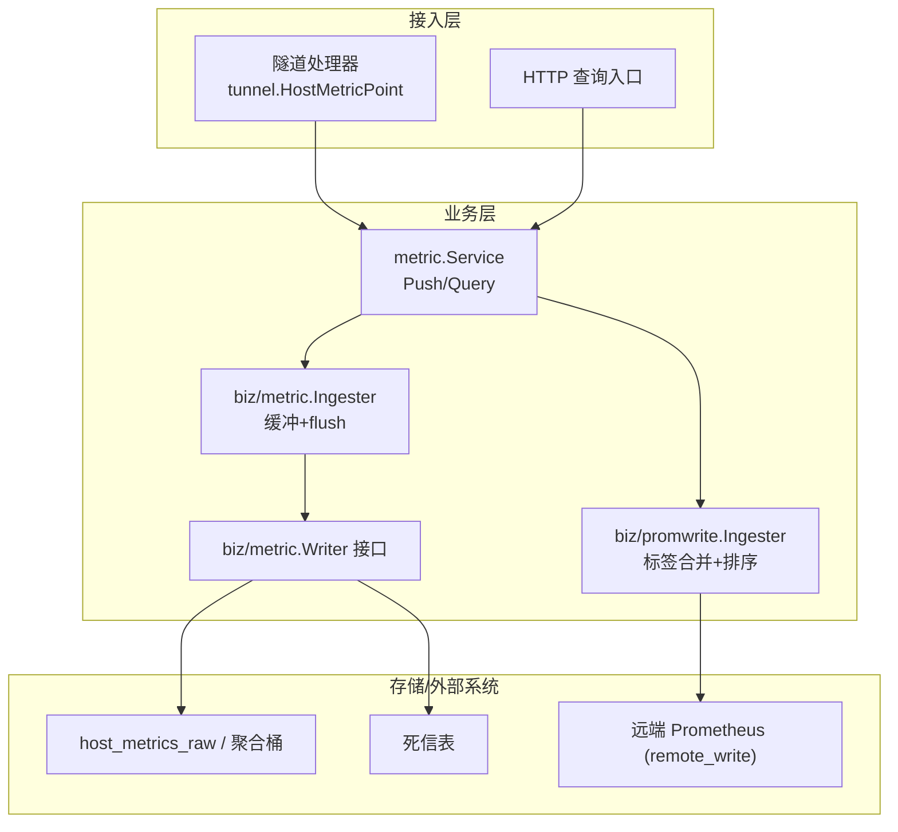
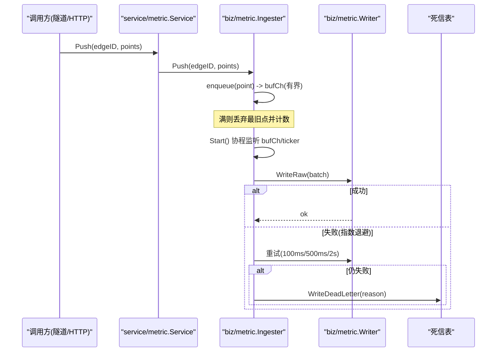
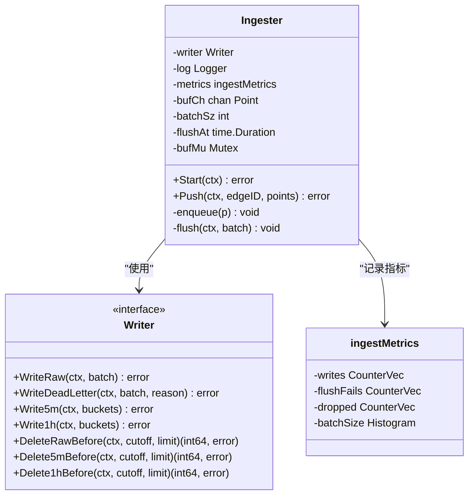
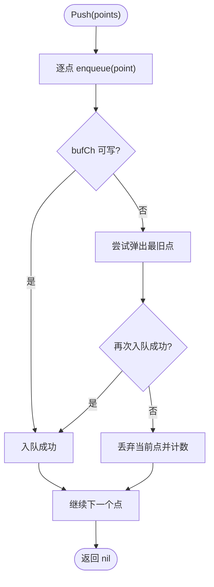
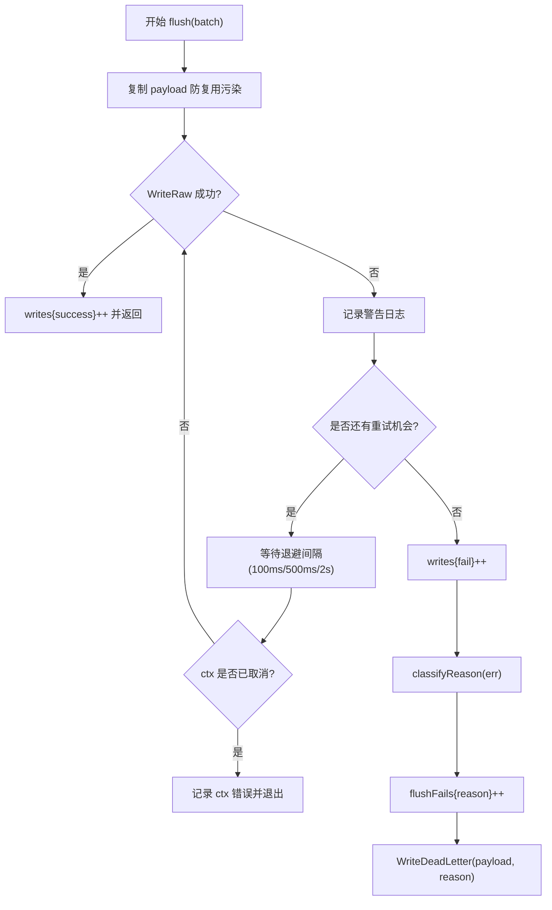
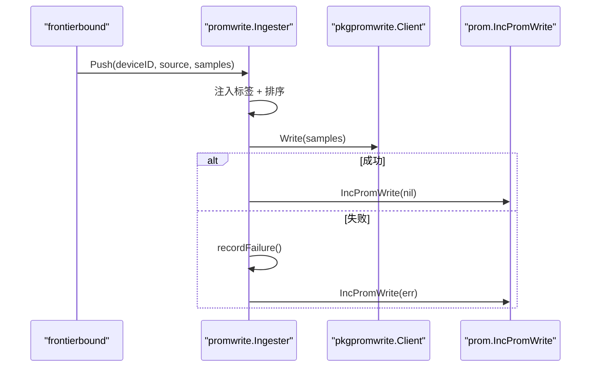
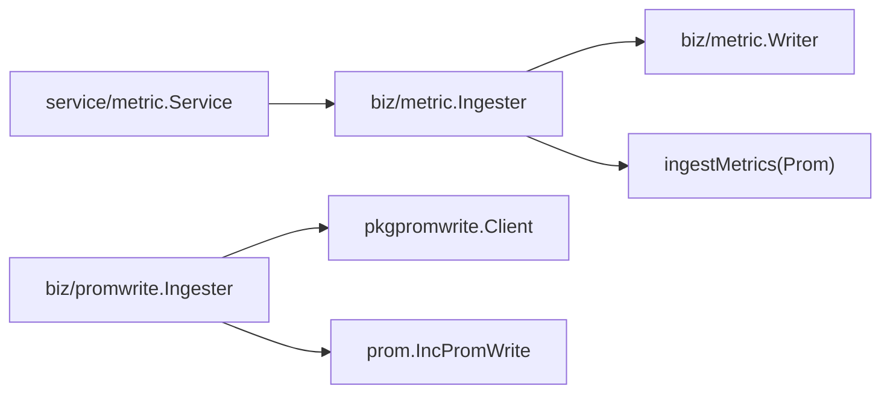

# 数据接收与缓冲

<cite>
**本文引用的文件**   
- [internal/manager/biz/metric/ingester.go](file://internal/manager/biz/metric/ingester.go)
- [internal/manager/biz/metric/repo.go](file://internal/manager/biz/metric/repo.go)
- [internal/manager/service/metric/service.go](file://internal/manager/service/metric/service.go)
- [internal/manager/biz/promwrite/ingester.go](file://internal/manager/biz/promwrite/ingester.go)
- [internal/pkg/prom/manager_metrics.go](file://internal/pkg/prom/manager_metrics.go)
- [cmd/ongrid/main.go](file://cmd/ongrid/main.go)
- [internal/manager/biz/alert/usecase.go](file://internal/manager/biz/alert/usecase.go)
- [internal/manager/biz/metric/ingester_test.go](file://internal/manager/biz/metric/ingester_test.go)
</cite>

## 目录
1. [引言](#引言)
2. [项目结构](#项目结构)
3. [核心组件](#核心组件)
4. [架构总览](#架构总览)
5. [详细组件分析](#详细组件分析)
6. [依赖关系分析](#依赖关系分析)
7. [性能考量](#性能考量)
8. [故障排查指南](#故障排查指南)
9. [结论](#结论)
10. [附录](#附录)

## 引言
本文件聚焦 OnGrid 的数据接收与缓冲模块，围绕 Ingester 组件的架构设计与实现进行深入说明。内容涵盖：
- 非阻塞 Push 接口设计
- 批量缓冲机制与背压策略（最旧数据淘汰）
- 异步 flush 循环（定时触发 + 批量大小触发）
- 错误重试、指数退避与死信队列处理
- 缓冲区容量管理、内存优化技术
- 监控指标、配置调优与故障排查建议

## 项目结构
Ingester 位于 manager 业务层，负责将来自隧道侧的 HostMetricPoint 转换为内部 Point，进行批量化缓冲并异步落盘；Prom 路径由 promwrite.Ingester 负责将样本写入远端 Prometheus。服务层对上层透明地暴露统一接口。



图表来源
- [internal/manager/service/metric/service.go:1-48](file://internal/manager/service/metric/service.go#L1-L48)
- [internal/manager/biz/metric/ingester.go:1-262](file://internal/manager/biz/metric/ingester.go#L1-L262)
- [internal/manager/biz/metric/repo.go:1-53](file://internal/manager/biz/metric/repo.go#L1-L53)
- [internal/manager/biz/promwrite/ingester.go:1-172](file://internal/manager/biz/promwrite/ingester.go#L1-L172)

章节来源
- [internal/manager/service/metric/service.go:1-48](file://internal/manager/service/metric/service.go#L1-L48)
- [internal/manager/biz/metric/ingester.go:1-262](file://internal/manager/biz/metric/ingester.go#L1-L262)
- [internal/manager/biz/metric/repo.go:1-53](file://internal/manager/biz/metric/repo.go#L1-L53)
- [internal/manager/biz/promwrite/ingester.go:1-172](file://internal/manager/biz/promwrite/ingester.go#L1-L172)

## 核心组件
- biz/metric.Ingester：HostMetric 数据接收与缓冲的核心，提供非阻塞 Push、双触发 flush、失败重试与死信路由。
- biz/metric.Writer：存储抽象接口，定义 WriteRaw、WriteDeadLetter 等能力，屏蔽底层存储差异。
- service/metric.Service：面向隧道/HTTP 的统一门面，转发到 biz.IngestService 与 QueryUsecase。
- biz/promwrite.Ingester：Prom 样本写入封装，负责设备标识注入、标签排序与健康状态统计。
- internal/pkg/prom 指标：全局注册 prom_write_total 等自观测指标。

章节来源
- [internal/manager/biz/metric/ingester.go:1-262](file://internal/manager/biz/metric/ingester.go#L1-L262)
- [internal/manager/biz/metric/repo.go:1-53](file://internal/manager/biz/metric/repo.go#L1-L53)
- [internal/manager/service/metric/service.go:1-48](file://internal/manager/service/metric/service.go#L1-L48)
- [internal/manager/biz/promwrite/ingester.go:1-172](file://internal/manager/biz/promwrite/ingester.go#L1-L172)
- [internal/pkg/prom/manager_metrics.go:155-200](file://internal/pkg/prom/manager_metrics.go#L155-L200)

## 架构总览
Ingester 采用“生产者-缓冲-消费者”模式：
- 生产者：隧道或 HTTP 调用方通过 Service.Push 提交 HostMetricPoint。
- 缓冲：Ingester 使用有界通道 bufCh 作为环形缓冲，容量为 batchSz × 4。
- 消费者：Start 启动的 goroutine 按时间或批量阈值触发 flush。
- 持久化：通过 Writer.WriteRaw 落库；失败时按指数退避重试，最终进入死信表。



图表来源
- [internal/manager/service/metric/service.go:37-42](file://internal/manager/service/metric/service.go#L37-L42)
- [internal/manager/biz/metric/ingester.go:120-161](file://internal/manager/biz/metric/ingester.go#L120-L161)
- [internal/manager/biz/metric/ingester.go:200-247](file://internal/manager/biz/metric/ingester.go#L200-L247)
- [internal/manager/biz/metric/repo.go:16-33](file://internal/manager/biz/metric/repo.go#L16-L33)

## 详细组件分析

### Ingester 类图与职责


图表来源
- [internal/manager/biz/metric/ingester.go:25-37](file://internal/manager/biz/metric/ingester.go#L25-L37)
- [internal/manager/biz/metric/ingester.go:60-65](file://internal/manager/biz/metric/ingester.go#L60-L65)
- [internal/manager/biz/metric/repo.go:16-33](file://internal/manager/biz/metric/repo.go#L16-L33)

章节来源
- [internal/manager/biz/metric/ingester.go:25-37](file://internal/manager/biz/metric/ingester.go#L25-L37)
- [internal/manager/biz/metric/repo.go:16-33](file://internal/manager/biz/metric/repo.go#L16-L33)

### 非阻塞 Push 与背压策略
- 非阻塞入队：Push 遍历 points，逐个调用 enqueue。enqueue 优先尝试无阻塞发送；若通道已满，则进入“丢弃最旧点”流程，确保 Push 永不阻塞且永不返回错误。
- 最旧数据淘汰：当 bufCh 满时，先尝试从头部弹出一个元素腾挪空间，再重新尝试入队；若仍无法入队，则直接丢弃当前点。该过程通过互斥锁保证并发安全，避免多个 Push 同时竞争空通道导致误删。
- 背压指标：每次淘汰都会增加 dropped{reason="buffer_full"} 计数器，便于观测拥塞程度。



图表来源
- [internal/manager/biz/metric/ingester.go:166-171](file://internal/manager/biz/metric/ingester.go#L166-L171)
- [internal/manager/biz/metric/ingester.go:175-198](file://internal/manager/biz/metric/ingester.go#L175-L198)

章节来源
- [internal/manager/biz/metric/ingester.go:166-198](file://internal/manager/biz/metric/ingester.go#L166-L198)

### 异步 flush 循环（定时 + 批量）
- 启动：Start 在独立 goroutine 中维护一个临时 batch 切片，并通过 select 监听 bufCh 和 ticker。
- 批量触发：当 batch 长度达到 batchSz 时立即 flush。
- 定时触发：每 flushAt 周期检查是否有待刷新的 batch，若有则 flush。
- 优雅关闭：ctx 取消后，尽可能非阻塞地排空 bufCh，最后以带超时的上下文执行一次最终 flush，确保资源释放可控。

```mermaid
sequenceDiagram
participant Loop as "Start() 协程"
participant Buf as "bufCh"
participant T as "ticker"
participant F as "flush()"
Loop->>Buf : 读取 point
Loop->>Loop : 追加到 batch
alt len(batch) >= batchSz
Loop->>F : flush(batch)
Loop->>Loop : 重置 batch
end
T-->>Loop : tick
alt batch 非空
Loop->>F : flush(batch)
Loop->>Loop : 重置 batch
end
Note over Loop : ctx.Done 时排空并做最终 flush
```

图表来源
- [internal/manager/biz/metric/ingester.go:120-161](file://internal/manager/biz/metric/ingester.go#L120-L161)

章节来源
- [internal/manager/biz/metric/ingester.go:120-161](file://internal/manager/biz/metric/ingester.go#L120-L161)

### 错误重试、指数退避与死信队列
- 重试策略：对 WriteRaw 失败执行最多三次重试，间隔分别为 100ms、500ms、2s。
- 上下文感知：重试等待期间若父上下文取消，则提前退出并记录错误原因。
- 死信路由：所有重试均失败后，将批次写入死信表，附带分类后的错误原因（如 ctx_cancel、write_error）。
- 指标上报：成功/失败分别计入 writes{result=success|fail}，重试耗尽计入 flushFails{reason}。



图表来源
- [internal/manager/biz/metric/ingester.go:200-247](file://internal/manager/biz/metric/ingester.go#L200-L247)
- [internal/manager/biz/metric/ingester.go:249-261](file://internal/manager/biz/metric/ingester.go#L249-L261)

章节来源
- [internal/manager/biz/metric/ingester.go:200-261](file://internal/manager/biz/metric/ingester.go#L200-L261)

### 缓冲区容量管理与内存优化
- 容量计算：bufCh 容量 = batchSz × bufferCapMultiplier（默认 multiplier=4），在 NewIngester 中初始化。
- 内存友好：
  - 入队前尽量无阻塞，避免额外拷贝。
  - flush 时对 batch 做防御性拷贝，防止调用方复用切片造成数据竞争。
  - 使用固定大小的 histogram buckets 控制指标开销。
- 容量调优建议：增大 batchSz 可降低 flush 频率但会提高延迟；增大 multiplier 可提升吞吐但占用更多内存。需结合 QPS 与下游写入能力综合评估。

章节来源
- [internal/manager/biz/metric/ingester.go:46-50](file://internal/manager/biz/metric/ingester.go#L46-L50)
- [internal/manager/biz/metric/ingester.go:109-118](file://internal/manager/biz/metric/ingester.go#L109-L118)
- [internal/manager/biz/metric/ingester.go:204-206](file://internal/manager/biz/metric/ingester.go#L204-L206)

### Prometheus 路径 Ingester（promwrite）
- 职责：将 tunnel.PromSample 转换为 promwrite.Sample，注入 device_id 与 ongrid_source 标签，并按名称排序以满足 remote_write 要求。
- 健康快照：维护连续失败次数与最近失败时间，供告警健康评估器读取。
- 指标：通过 IncPromWrite 更新 prom_write_total{result=ok|fail}。



图表来源
- [internal/manager/biz/promwrite/ingester.go:87-158](file://internal/manager/biz/promwrite/ingester.go#L87-L158)
- [internal/pkg/prom/manager_metrics.go:493-503](file://internal/pkg/prom/manager_metrics.go#L493-L503)

章节来源
- [internal/manager/biz/promwrite/ingester.go:52-59](file://internal/manager/biz/promwrite/ingester.go#L52-L59)
- [internal/manager/biz/promwrite/ingester.go:87-158](file://internal/manager/biz/promwrite/ingester.go#L87-L158)
- [internal/pkg/prom/manager_metrics.go:493-503](file://internal/pkg/prom/manager_metrics.go#L493-L503)

### 服务层与入口
- service/metric.Service 仅做薄封装，将 Push/Query 委托给 biz 层，保持边界清晰。
- 主进程在启动时将 metric 相关服务与管道评估器装配，legacy 的 host-metric 路径在新版本中以 no-op ingester 形式兼容旧边缘节点。

章节来源
- [internal/manager/service/metric/service.go:18-42](file://internal/manager/service/metric/service.go#L18-L42)
- [cmd/ongrid/main.go:1052-1065](file://cmd/ongrid/main.go#L1052-L1065)
- [internal/manager/biz/alert/usecase.go:32-50](file://internal/manager/biz/alert/usecase.go#L32-L50)

## 依赖关系分析
- Ingester 依赖 Writer 接口，屏蔽具体存储实现（MySQL/ClickHouse 等）。
- promwrite.Ingester 依赖 pkgpromwrite.Client 与 prom 指标包。
- 测试通过 fakeWriter 验证批量触发、死信路由与丢点行为。



图表来源
- [internal/manager/biz/metric/ingester.go:25-37](file://internal/manager/biz/metric/ingester.go#L25-L37)
- [internal/manager/biz/metric/repo.go:16-33](file://internal/manager/biz/metric/repo.go#L16-L33)
- [internal/manager/service/metric/service.go:18-42](file://internal/manager/service/metric/service.go#L18-L42)
- [internal/manager/biz/promwrite/ingester.go:87-158](file://internal/manager/biz/promwrite/ingester.go#L87-L158)
- [internal/pkg/prom/manager_metrics.go:493-503](file://internal/pkg/prom/manager_metrics.go#L493-L503)

章节来源
- [internal/manager/biz/metric/ingester.go:25-37](file://internal/manager/biz/metric/ingester.go#L25-L37)
- [internal/manager/biz/metric/repo.go:16-33](file://internal/manager/biz/metric/repo.go#L16-L33)
- [internal/manager/biz/promwrite/ingester.go:87-158](file://internal/manager/biz/promwrite/ingester.go#L87-L158)
- [internal/pkg/prom/manager_metrics.go:493-503](file://internal/pkg/prom/manager_metrics.go#L493-L503)

## 性能考量
- 吞吐与延迟权衡：
  - batchSz 越大，写入效率越高，但端到端延迟上升。
  - flushAt 越小，实时性越好，但可能频繁触发小批写入。
- 内存占用：
  - bufCh 容量随 batchSz 线性增长；在高 QPS 场景下需评估峰值内存。
- 指标开销：
  - 使用固定 bucket 的直方图与低基数的 counter/histogram，避免高基数导致的采集压力。
- 降级与保护：
  - 缓冲满即丢最旧点，保障系统稳定；失败重试与死信确保数据不丢失于系统内部。

[本节为通用指导，无需源码引用]

## 故障排查指南
- 现象：大量 dropped{reason="buffer_full"}
  - 可能原因：上游 QPS 超过下游写入能力或 Ingester 未启动。
  - 排查要点：确认 Start 是否运行、batchSz 与 flushAt 是否合理、下游写入延迟。
- 现象：flushFails{reason="write_error"} 升高
  - 可能原因：数据库不可用、磁盘满、网络抖动。
  - 排查要点：观察重试间隔与死信数量，定位具体错误原因。
- 现象：prom_write_total{result=fail} 升高
  - 可能原因：远端 Prometheus 不可达或拒绝写入。
  - 排查要点：检查 promwrite.Ingester.Health 快照与网络连通性。
- 现象：Push 阻塞或超时
  - 可能原因：Ingester 未启动或缓冲长期不满导致消费缓慢。
  - 排查要点：确认 Start 生命周期与 bufCh 容量设置。

章节来源
- [internal/manager/biz/metric/ingester.go:166-198](file://internal/manager/biz/metric/ingester.go#L166-L198)
- [internal/manager/biz/metric/ingester.go:200-247](file://internal/manager/biz/metric/ingester.go#L200-L247)
- [internal/manager/biz/promwrite/ingester.go:87-158](file://internal/manager/biz/promwrite/ingester.go#L87-L158)
- [internal/pkg/prom/manager_metrics.go:493-503](file://internal/pkg/prom/manager_metrics.go#L493-L503)

## 结论
Ingester 通过非阻塞入队、有界缓冲与双触发 flush，在保证系统稳定的前提下实现了高吞吐与低延迟的折中；配合指数退避与死信队列，提升了容错性与可恢复性。Prom 路径的 Ingester 则在数据标准化与健康观测方面提供了完善支撑。生产环境应依据实际负载调整 batchSz 与 flushAt，并结合监控指标持续优化。

[本节为总结性内容，无需源码引用]

## 附录

### 关键指标说明
- ongrid_ingest_writes_total{result=success|fail}：批次写入结果计数。
- ongrid_ingest_flush_failures_total{reason}：重试耗尽的分类原因计数。
- ongrid_ingest_dropped_total{reason="buffer_full"}：缓冲满导致的丢点计数。
- ongrid_ingest_batch_size：flush 时刻的批次大小分布。
- prom_write_total{result=ok|fail}：Prom 写入结果计数。

章节来源
- [internal/manager/biz/metric/ingester.go:76-94](file://internal/manager/biz/metric/ingester.go#L76-L94)
- [internal/pkg/prom/manager_metrics.go:174-180](file://internal/pkg/prom/manager_metrics.go#L174-L180)

### 配置参数与默认值
- defaultBatchSize：默认 500，影响批量大小与缓冲容量。
- defaultFlushAt：默认 5s，定时 flush 周期。
- bufferCapMultiplier：默认 4，缓冲容量倍数。
- flushBackoffs：重试间隔 100ms、500ms、2s。

章节来源
- [internal/manager/biz/metric/ingester.go:46-57](file://internal/manager/biz/metric/ingester.go#L46-L57)

### 行为验证（测试用例参考）
- 批量大小触发即时 flush
- 定时 flush 生效
- 重试耗尽后进入死信队列
- 缓冲满时丢弃最旧点且不阻塞 Push

章节来源
- [internal/manager/biz/metric/ingester_test.go:132-169](file://internal/manager/biz/metric/ingester_test.go#L132-L169)
- [internal/manager/biz/metric/ingester_test.go:171-210](file://internal/manager/biz/metric/ingester_test.go#L171-L210)
- [internal/manager/biz/metric/ingester_test.go:212-240](file://internal/manager/biz/metric/ingester_test.go#L212-L240)