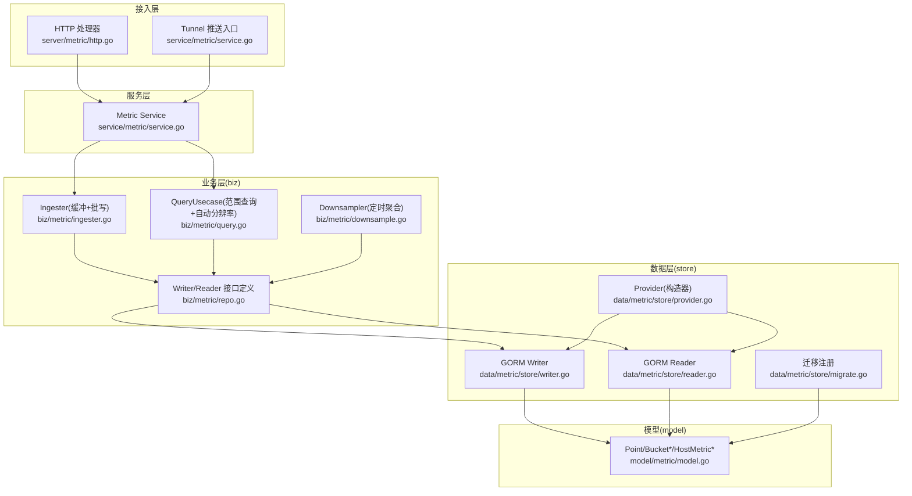
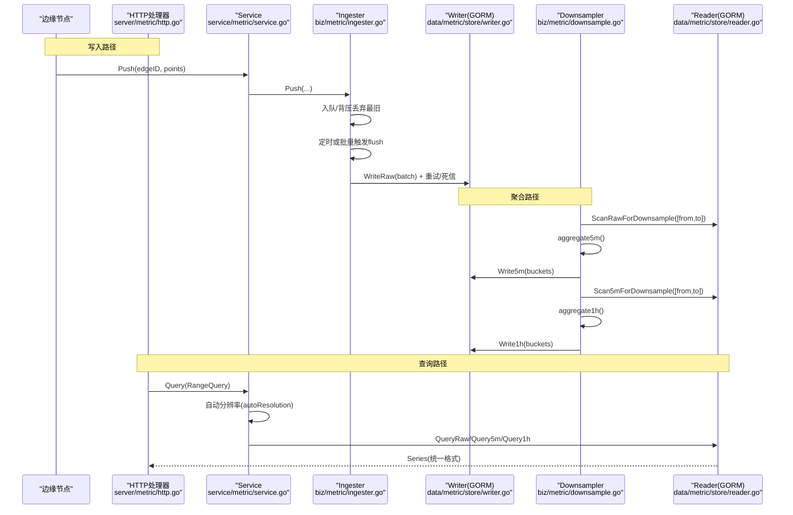
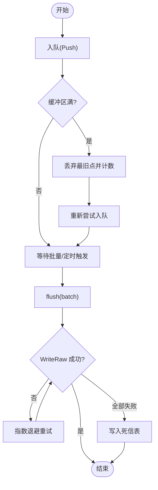
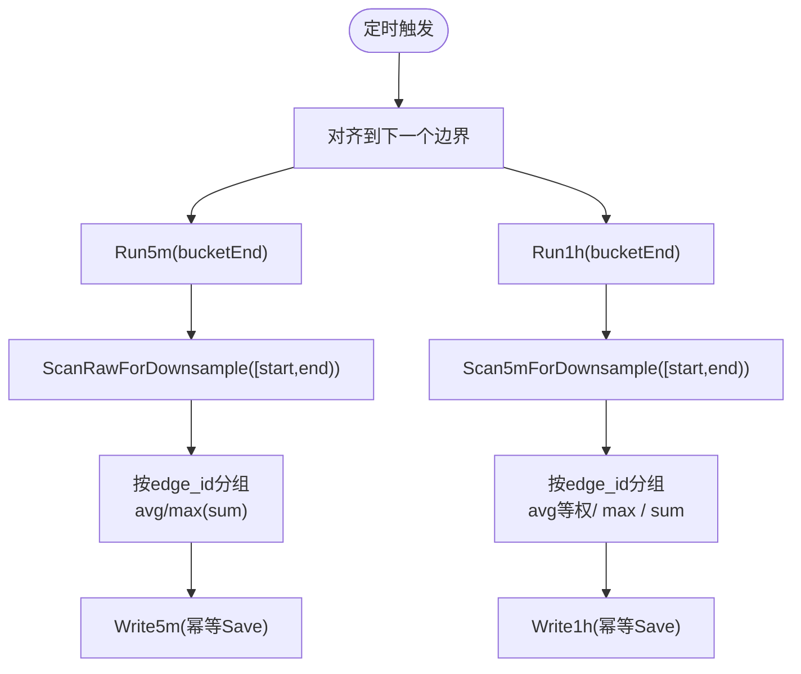
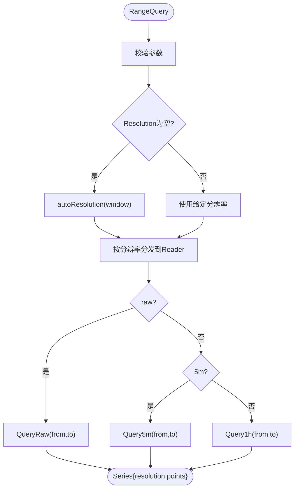
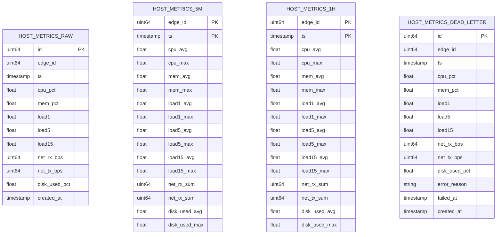
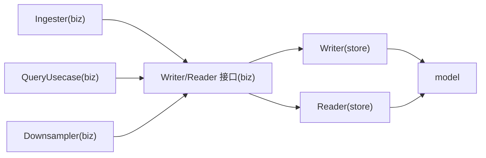

# 数据聚合与降采样

<cite>
**本文引用的文件**   
- [downsample.go](file://internal/manager/biz/metric/downsample.go)
- [query.go](file://internal/manager/biz/metric/query.go)
- [ingester.go](file://internal/manager/biz/metric/ingester.go)
- [repo.go](file://internal/manager/biz/metric/repo.go)
- [writer.go](file://internal/manager/data/metric/store/writer.go)
- [reader.go](file://internal/manager/data/metric/store/reader.go)
- [migrate.go](file://internal/manager/data/metric/store/migrate.go)
- [provider.go](file://internal/manager/data/metric/store/provider.go)
- [model.go](file://internal/manager/model/metric/model.go)
- [http.go](file://internal/manager/server/metric/http.go)
- [service.go](file://internal/manager/service/metric/service.go)
</cite>

## 目录
1. [简介](#简介)
2. [项目结构](#项目结构)
3. [核心组件](#核心组件)
4. [架构总览](#架构总览)
5. [详细组件分析](#详细组件分析)
6. [依赖关系分析](#依赖关系分析)
7. [性能考量](#性能考量)
8. [故障排查指南](#故障排查指南)
9. [结论](#结论)
10. [附录](#附录)

## 简介
本模块为 OnGrid 主机指标的数据聚合与降采样子系统，负责将高频原始样本按时间窗口聚合成低分辨率的桶（5分钟、1小时），并提供基于时间范围的查询能力。系统采用三层存储模型：原始层（秒级）、5分钟聚合层、1小时聚合层；查询时根据时间窗口自动选择合适的数据源，兼顾精度与性能。写入路径具备批量缓冲、退避重试与死信落盘机制；读取路径提供统一的响应形态，屏蔽底层分辨率差异。

## 项目结构
该子域遵循清晰的分层设计：HTTP/Tunnel 接入层 → 服务层 → 业务逻辑层（biz）→ 数据访问层（store）→ 持久化模型（model）。

图表来源
- [http.go:1-258](file://internal/manager/server/metric/http.go#L1-L258)
- [service.go:1-48](file://internal/manager/service/metric/service.go#L1-L48)
- [ingester.go:1-262](file://internal/manager/biz/metric/ingester.go#L1-L262)
- [query.go:1-133](file://internal/manager/biz/metric/query.go#L1-L133)
- [downsample.go:1-302](file://internal/manager/biz/metric/downsample.go#L1-L302)
- [repo.go:1-53](file://internal/manager/biz/metric/repo.go#L1-L53)
- [writer.go:1-183](file://internal/manager/data/metric/store/writer.go#L1-L183)
- [reader.go:1-170](file://internal/manager/data/metric/store/reader.go#L1-L170)
- [migrate.go:1-21](file://internal/manager/data/metric/store/migrate.go#L1-L21)
- [provider.go:1-17](file://internal/manager/data/metric/store/provider.go#L1-L17)
- [model.go:1-189](file://internal/manager/model/metric/model.go#L1-L189)

章节来源
- [http.go:1-258](file://internal/manager/server/metric/http.go#L1-L258)
- [service.go:1-48](file://internal/manager/service/metric/service.go#L1-L48)
- [ingester.go:1-262](file://internal/manager/biz/metric/ingester.go#L1-L262)
- [query.go:1-133](file://internal/manager/biz/metric/query.go#L1-L133)
- [downsample.go:1-302](file://internal/manager/biz/metric/downsample.go#L1-L302)
- [repo.go:1-53](file://internal/manager/biz/metric/repo.go#L1-L53)
- [writer.go:1-183](file://internal/manager/data/metric/store/writer.go#L1-L183)
- [reader.go:1-170](file://internal/manager/data/metric/store/reader.go#L1-L170)
- [migrate.go:1-21](file://internal/manager/data/metric/store/migrate.go#L1-L21)
- [provider.go:1-17](file://internal/manager/data/metric/store/provider.go#L1-L17)
- [model.go:1-189](file://internal/manager/model/metric/model.go#L1-L189)

## 核心组件
- 写入与缓冲：Ingester 负责接收边缘上报的主机指标点，进行批量缓冲与周期性刷新，失败时指数退避重试并落盘死信表。
- 聚合与降采样：Downsampler 定时扫描原始层与5分钟层，分别生成5分钟和1小时的聚合桶，保证幂等写入。
- 查询与自动分辨率：QueryUsecase 校验参数并按窗口大小自动选择 raw/5m/1h 数据源，返回统一 Series 结构。
- 数据访问：Store 层的 Writer/Reader 以 GORM 对接 SQLite/MySQL，提供批量写入、范围查询、跨边聚合扫描与保留清理接口。
- 模型与迁移：model 定义领域值类型与 GORM 行结构；migrate 注册三张聚合表与一张死信表。

章节来源
- [ingester.go:1-262](file://internal/manager/biz/metric/ingester.go#L1-L262)
- [downsample.go:1-302](file://internal/manager/biz/metric/downsample.go#L1-L302)
- [query.go:1-133](file://internal/manager/biz/metric/query.go#L1-L133)
- [writer.go:1-183](file://internal/manager/data/metric/store/writer.go#L1-L183)
- [reader.go:1-170](file://internal/manager/data/metric/store/reader.go#L1-L170)
- [migrate.go:1-21](file://internal/manager/data/metric/store/migrate.go#L1-L21)
- [model.go:1-189](file://internal/manager/model/metric/model.go#L1-L189)

## 架构总览
下图展示从边缘侧上报到查询的全链路流程，包括缓冲、批写、聚合与查询自动分辨率。

图表来源
- [http.go:1-258](file://internal/manager/server/metric/http.go#L1-L258)
- [service.go:1-48](file://internal/manager/service/metric/service.go#L1-L48)
- [ingester.go:1-262](file://internal/manager/biz/metric/ingester.go#L1-L262)
- [writer.go:1-183](file://internal/manager/data/metric/store/writer.go#L1-L183)
- [downsample.go:1-302](file://internal/manager/biz/metric/downsample.go#L1-L302)
- [reader.go:1-170](file://internal/manager/data/metric/store/reader.go#L1-L170)

## 详细组件分析

### 写入与缓冲（Ingester）
- 非阻塞入队：Push 将点转换为领域 Point 后入队；当缓冲区满时丢弃最旧点并记录 dropped 计数。
- 批量刷新：按批次大小或定时器触发 flush；对 WriteRaw 失败执行指数退避重试，全部失败则写入死信表。
- 可观测性：暴露写入成功/失败、刷新失败原因、丢弃计数与批次大小分布等指标。

图表来源
- [ingester.go:1-262](file://internal/manager/biz/metric/ingester.go#L1-L262)
- [writer.go:1-183](file://internal/manager/data/metric/store/writer.go#L1-L183)

章节来源
- [ingester.go:1-262](file://internal/manager/biz/metric/ingester.go#L1-L262)
- [writer.go:1-183](file://internal/manager/data/metric/store/writer.go#L1-L183)

### 多时间窗口聚合算法（Downsampler）
- 调度策略：Loop 使用两个固定周期 ticker（5分钟、1小时），在下一个边界对齐后启动，避免与当前填充中的桶竞争。
- 5分钟聚合：ScanRawForDownsample 拉取指定时间窗内所有边的原始点，按 edge_id 分组计算：
  - 仪表类（CPU/Mem/Load/DiskUsed）：avg + max
  - 计数器类（NetRx/NetTx）：sum
  - 输出 Bucket5m，ts 为桶起始时间（按5分钟对齐）
- 1小时聚合：Scan5mForDownsample 拉取同一小时内所有5分钟桶，按 edge_id 分组计算：
  - avg 字段：等权平均（不重加权样本数）
  - max 字段：取最大值
  - sum 字段：累加
  - 输出 Bucket1h，ts 为桶起始时间（按小时对齐）
- 幂等写入：Write5m/Write1h 使用 Save 覆盖相同 (edge_id, ts) 的记录，支持重复运行。

图表来源
- [downsample.go:1-302](file://internal/manager/biz/metric/downsample.go#L1-L302)
- [reader.go:1-170](file://internal/manager/data/metric/store/reader.go#L1-L170)
- [writer.go:1-183](file://internal/manager/data/metric/store/writer.go#L1-L183)

章节来源
- [downsample.go:1-302](file://internal/manager/biz/metric/downsample.go#L1-L302)
- [reader.go:1-170](file://internal/manager/data/metric/store/reader.go#L1-L170)
- [writer.go:1-183](file://internal/manager/data/metric/store/writer.go#L1-L183)

### 查询优化与自动分辨率（QueryUsecase）
- 参数校验：EdgeID 必填、From < To、窗口不超过365天、Resolution 合法。
- 自动分辨率：
  - 窗口 ≤ 6小时 → raw
  - 窗口 ≤ 7天 → 5m
  - 否则 → 1h
- 结果归一化：Series 仅有一个非空集合（RawPoints/Buckets5m/Buckets1h），由上层 HTTP 转为统一 pointDTO 响应。

图表来源
- [query.go:1-133](file://internal/manager/biz/metric/query.go#L1-L133)
- [reader.go:1-170](file://internal/manager/data/metric/store/reader.go#L1-L170)
- [http.go:1-258](file://internal/manager/server/metric/http.go#L1-L258)

章节来源
- [query.go:1-133](file://internal/manager/biz/metric/query.go#L1-L133)
- [http.go:1-258](file://internal/manager/server/metric/http.go#L1-L258)

### 索引策略与存储模型
- 主键与复合主键：
  - 原始表：自增主键 id；复合索引 idx_host_metrics_raw_edge_ts(edge_id, ts)。
  - 聚合表：复合主键 (edge_id, ts)，确保幂等写入与高效范围查询。
- 查询排序：所有范围查询均按 ts ASC 返回，便于前端时序渲染。
- 删除策略：Delete*Before 使用 rowid 子查询限制删除行数，适配 SQLite 的 DELETE ... LIMIT 行为。

图表来源
- [model.go:1-189](file://internal/manager/model/metric/model.go#L1-L189)
- [migrate.go:1-21](file://internal/manager/data/metric/store/migrate.go#L1-L21)

章节来源
- [model.go:1-189](file://internal/manager/model/metric/model.go#L1-L189)
- [migrate.go:1-21](file://internal/manager/data/metric/store/migrate.go#L1-L21)

### 聚合函数支持与时间范围处理
- 聚合函数：
  - 仪表类：avg、max
  - 计数器类：sum
- 时间范围：
  - 查询与聚合均采用闭区间 [from, to]；为避免下一桶首点泄漏，聚合扫描传入 to-1ns。
  - 桶起始时间严格对齐到5分钟或小时边界。

章节来源
- [downsample.go:1-302](file://internal/manager/biz/metric/downsample.go#L1-L302)
- [reader.go:1-170](file://internal/manager/data/metric/store/reader.go#L1-L170)

### 结果排序与响应形态
- 排序：所有查询按 ts 升序返回，保证时序正确性。
- 响应形态：HTTP 层将 raw/5m/1h 统一映射为 pointDTO，其中 gauge 字段以 avg/max 呈现，计数器字段以 net_rx_bps/net_tx_bps 呈现；缺失值以 null 表示，便于前端断线绘制。

章节来源
- [http.go:1-258](file://internal/manager/server/metric/http.go#L1-L258)
- [reader.go:1-170](file://internal/manager/data/metric/store/reader.go#L1-L170)

### 缓存层设计与扩展点
- 当前实现未内置应用层缓存；如需提升热点查询性能，可在 Service 层引入内存缓存（如 per-edge 最近N个桶的 LRU），并结合 TTL 与失效策略。
- 通过 Provider 与接口抽象，未来可替换为 ClickHouse 等后端，不影响 biz 层调用。

章节来源
- [provider.go:1-17](file://internal/manager/data/metric/store/provider.go#L1-L17)
- [repo.go:1-53](file://internal/manager/biz/metric/repo.go#L1-L53)

## 依赖关系分析
- 耦合与内聚：
  - biz 层通过 Writer/Reader 接口与 store 解耦，聚合与查询逻辑集中且内聚。
  - Downsample 与 Ingester 各自独立调度，互不直接依赖，降低竞争风险。
- 外部依赖：
  - GORM 用于 SQL 构建与批量操作；Prometheus 客户端用于指标采集。
- 潜在循环依赖：
  - 当前无循环导入；biz 不感知具体存储实现。

图表来源
- [ingester.go:1-262](file://internal/manager/biz/metric/ingester.go#L1-L262)
- [query.go:1-133](file://internal/manager/biz/metric/query.go#L1-L133)
- [downsample.go:1-302](file://internal/manager/biz/metric/downsample.go#L1-L302)
- [repo.go:1-53](file://internal/manager/biz/metric/repo.go#L1-L53)
- [writer.go:1-183](file://internal/manager/data/metric/store/writer.go#L1-L183)
- [reader.go:1-170](file://internal/manager/data/metric/store/reader.go#L1-L170)
- [model.go:1-189](file://internal/manager/model/metric/model.go#L1-L189)

章节来源
- [repo.go:1-53](file://internal/manager/biz/metric/repo.go#L1-L53)
- [writer.go:1-183](file://internal/manager/data/metric/store/writer.go#L1-L183)
- [reader.go:1-170](file://internal/manager/data/metric/store/reader.go#L1-L170)

## 性能考量
- 写入吞吐
  - 批量大小与缓冲容量：默认 batchSz=500，缓冲容量为 batchSz×4；可根据峰值 QPS 调整 bufferCapMultiplier。
  - 刷新间隔：默认 5s；短间隔提升实时性但增加 DB 压力，长间隔提高吞吐但延迟增大。
  - 重试与死信：指数退避 100ms/500ms/2s，失败落盘保障可恢复性。
- 聚合效率
  - 扫描顺序：按 (edge_id, ts) 排序，利于内存分组与顺序写入。
  - 幂等写入：Save 覆盖相同 (edge_id, ts)，容错重跑。
- 查询性能
  - 自动分辨率：小窗口走 raw，中窗口走 5m，大窗口走 1h，减少扫描量。
  - 索引利用：(edge_id, ts) 复合索引加速范围查询。
- 资源规划建议
  - 磁盘容量估算：按 edge 数量 × 指标字段数 × 采样频率 × 保留天数估算；聚合层显著压缩空间。
  - CPU/内存：Downsampler 全量扫描受限于内存占用，建议分片或分页扫描（当前实现一次性加载，适合中小规模）。

[本节为通用指导，无需特定文件引用]

## 故障排查指南
- 写入失败
  - 观察 ongrid_ingest_flush_failures_total 与 ongrid_ingest_dropped_total 指标，定位 buffer_full 或 write_error。
  - 检查 host_metrics_dead_letter 表，获取错误原因与失败时间点。
- 聚合异常
  - 确认 Downsampler Loop 是否正常运行；查看日志中 Run5m/Run1h 失败告警。
  - 验证聚合表是否存在重复 (edge_id, ts) 冲突（应被幂等覆盖）。
- 查询结果异常
  - 检查 autoResolution 选择的分辨率是否符合预期（窗口大小阈值）。
  - 确认 from/to 是否满足 From < To 且窗口不超过 365 天。
- 数据库层面
  - 检查 Delete*Before 是否按计划执行，避免历史数据膨胀。
  - 关注 SQLite 的 DELETE ... LIMIT 行为，确保删除语句正确。

章节来源
- [ingester.go:1-262](file://internal/manager/biz/metric/ingester.go#L1-L262)
- [downsample.go:1-302](file://internal/manager/biz/metric/downsample.go#L1-L302)
- [query.go:1-133](file://internal/manager/biz/metric/query.go#L1-L133)
- [writer.go:1-183](file://internal/manager/data/metric/store/writer.go#L1-L183)

## 结论
本模块以“缓冲批写 + 定时降采样 + 自动分辨率查询”为核心，实现了高吞吐、可扩展、易维护的主机指标聚合与查询体系。通过明确的分层与接口抽象，既保证了当前 SQLite 场景下的稳定运行，也为后续切换至高性能后端预留了扩展点。建议在大规模部署时结合监控指标与容量规划，动态调优批大小、刷新间隔与聚合任务并发度，以获得最佳的性能与成本平衡。

[本节为总结性内容，无需特定文件引用]

## 附录
- API 参考
  - GET /v1/edges/{id}/metrics?from=RFC3339&to=RFC3339&resolution=auto|raw|5m|1h
  - 响应包含 resolution、from、to 与 points 列表；gauge 字段以 avg/max 呈现，计数器字段以 net_rx_bps/net_tx_bps 呈现。
- 配置项速查
  - 批大小：defaultBatchSize = 500
  - 刷新间隔：defaultFlushAt = 5s
  - 缓冲倍数：bufferCapMultiplier = 4
  - 自动分辨率阈值：≤6h 用 raw，≤7d 用 5m，其余用 1h
  - 最大窗口：365天

章节来源
- [http.go:1-258](file://internal/manager/server/metric/http.go#L1-L258)
- [ingester.go:1-262](file://internal/manager/biz/metric/ingester.go#L1-L262)
- [query.go:1-133](file://internal/manager/biz/metric/query.go#L1-L133)