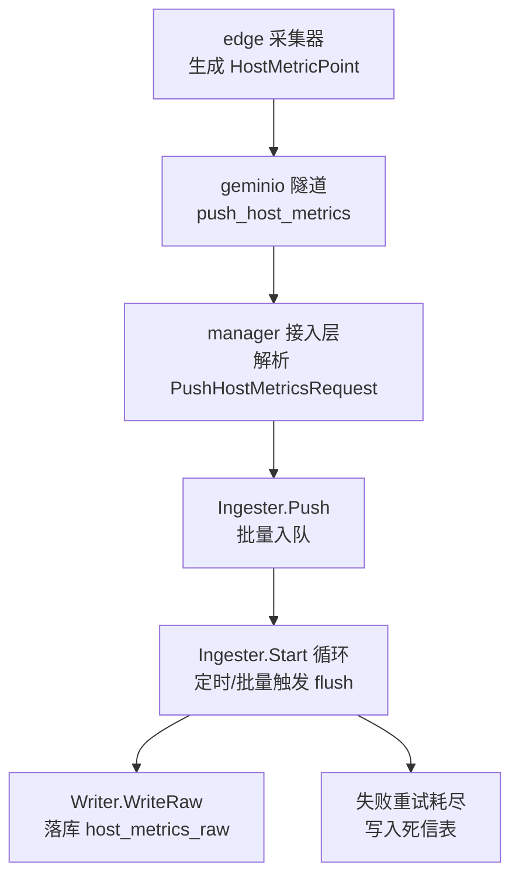
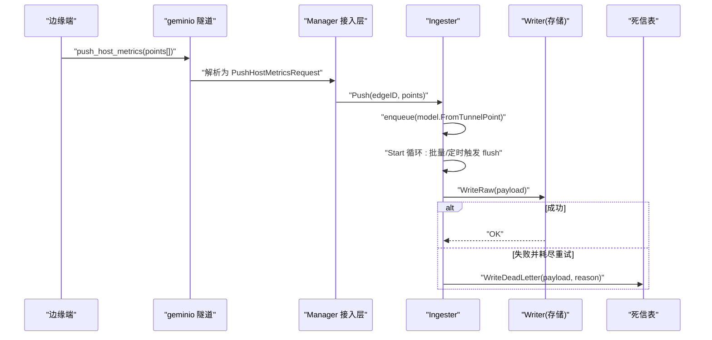
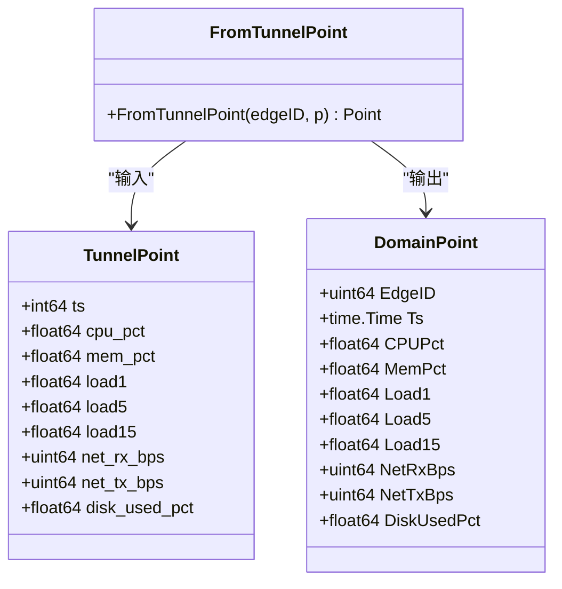
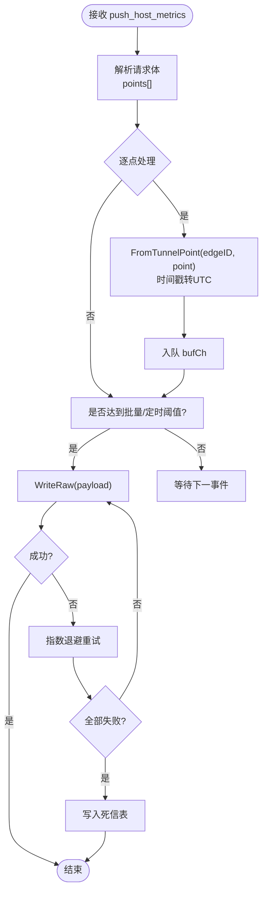
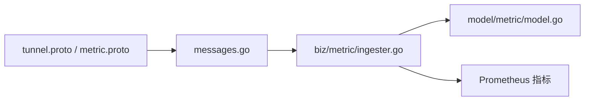

# 数据转换与标准化

<cite>
**本文引用的文件**
- [tunnel.proto](file://api/tunnel/v1/tunnel.proto)
- [metric.proto](file://api/manager/metric/v1/metric.proto)
- [messages.go](file://internal/pkg/tunnel/messages.go)
- [ingester.go](file://internal/manager/biz/metric/ingester.go)
- [model.go](file://internal/manager/model/metric/model.go)
- [ingester_test.go](file://internal/manager/biz/metric/ingester_test.go)
</cite>

## 目录
1. [引言](#引言)
2. [项目结构](#项目结构)
3. [核心组件](#核心组件)
4. [架构总览](#架构总览)
5. [详细组件分析](#详细组件分析)
6. [依赖关系分析](#依赖关系分析)
7. [性能考量](#性能考量)
8. [故障排查指南](#故障排查指南)
9. [结论](#结论)
10. [附录](#附录)

## 引言
本文件聚焦 OnGrid 从边缘设备到云端的数据转换与标准化流程，重点说明 tunnel.HostMetricPoint 到 model.Point 的映射、标签与时间戳对齐、数据类型转换、数据验证规则、异常值检测与去重机制，并提供字段映射表、转换规则、错误处理策略以及数据质量检查、性能优化与调试工具使用指南。

## 项目结构
与“数据转换与标准化”直接相关的代码分布在以下位置：
- 协议定义（边云传输）：api/tunnel/v1/tunnel.proto
- 协议定义（管理面查询）：api/manager/metric/v1/metric.proto
- 边云消息体 Go 镜像：internal/pkg/tunnel/messages.go
- 指标摄入与批处理：internal/manager/biz/metric/ingester.go
- 领域模型与持久化实体：internal/manager/model/metric/model.go
- 相关测试用例：internal/manager/biz/metric/ingester_test.go

图表来源
- [messages.go:326-349](file://internal/pkg/tunnel/messages.go#L326-L349)
- [ingester.go:120-171](file://internal/manager/biz/metric/ingester.go#L120-L171)
- [ingester.go:200-247](file://internal/manager/biz/metric/ingester.go#L200-L247)
- [model.go:18-50](file://internal/manager/model/metric/model.go#L18-L50)

章节来源
- [tunnel.proto:30-41](file://api/tunnel/v1/tunnel.proto#L30-L41)
- [metric.proto:28-40](file://api/manager/metric/v1/metric.proto#L28-L40)
- [messages.go:326-349](file://internal/pkg/tunnel/messages.go#L326-L349)
- [ingester.go:15-50](file://internal/manager/biz/metric/ingester.go#L15-L50)
- [model.go:18-50](file://internal/manager/model/metric/model.go#L18-L50)

## 核心组件
- 协议层
  - tunnel.HostMetricPoint：边→云的时序点，字段与 manager/metric 同形但独立复制，避免跨包耦合。
  - manager/metric.HostMetricPoint：面向查询的领域点，用于 API 返回与聚合读取。
- 消息体镜像
  - internal/pkg/tunnel/messages.go 中的 HostMetricPoint/PushHostMetricsRequest 等类型以 JSON 标签与 proto json_name 保持一致，作为 MVP 的 JSON 承载体。
- 摄入与批处理
  - Ingester：非阻塞入队、按批次或定时器刷新、指数退避重试、失败写死信表；提供 Prometheus 指标观测。
- 领域模型
  - model.Point：内部领域点，包含 EdgeID、UTC 时间戳及指标字段；FromTunnelPoint 完成从隧道点到领域点的转换。
  - 持久化实体：host_metrics_raw / host_metrics_5m / host_metrics_1h / dead_letter。

章节来源
- [tunnel.proto:30-41](file://api/tunnel/v1/tunnel.proto#L30-L41)
- [metric.proto:28-40](file://api/manager/metric/v1/metric.proto#L28-L40)
- [messages.go:326-349](file://internal/pkg/tunnel/messages.go#L326-L349)
- [ingester.go:15-50](file://internal/manager/biz/metric/ingester.go#L15-L50)
- [model.go:18-50](file://internal/manager/model/metric/model.go#L18-L50)

## 架构总览
下图展示从边缘上报到云端落库的关键路径与职责边界。

图表来源
- [messages.go:326-349](file://internal/pkg/tunnel/messages.go#L326-L349)
- [ingester.go:120-171](file://internal/manager/biz/metric/ingester.go#L120-L171)
- [ingester.go:200-247](file://internal/manager/biz/metric/ingester.go#L200-L247)
- [model.go:34-50](file://internal/manager/model/metric/model.go#L34-L50)

## 详细组件分析

### 字段映射与类型转换
- 源类型：tunnel.HostMetricPoint（JSON 字段名与 proto json_name 一致）
- 目标类型：model.Point（领域点，含 EdgeID、UTC 时间戳）
- 转换函数：model.FromTunnelPoint(edgeID, p)
  - 时间戳：将 unix 秒转换为 time.Time 并强制 UTC
  - 数值字段：float64/uint64 直转
  - 标识：注入 edgeID

图表来源
- [messages.go:326-337](file://internal/pkg/tunnel/messages.go#L326-L337)
- [model.go:18-50](file://internal/manager/model/metric/model.go#L18-L50)

章节来源
- [messages.go:326-337](file://internal/pkg/tunnel/messages.go#L326-L337)
- [model.go:18-50](file://internal/manager/model/metric/model.go#L18-L50)

### 标签规范化与时间戳对齐
- 标签规范化
  - 当前 HostMetricPoint 不包含动态标签维度，所有样本通过 EdgeID 区分来源主机，无需额外标签清洗。
- 时间戳对齐
  - 入库原始点保持上报时戳（秒级），不做对齐；聚合层在 5m/1h 桶中按桶起始时间对齐（floor）。
  - 领域点的时间戳统一为 UTC，消除时区差异。

章节来源
- [model.go:34-50](file://internal/manager/model/metric/model.go#L34-L50)
- [model.go:52-96](file://internal/manager/model/metric/model.go#L52-L96)

### 数据验证规则与异常值检测
- 基本校验
  - 时间戳：由 int64 秒转为 UTC 时间，若上游时钟严重偏差，可在上层告警（心跳已携带客户端时间戳用于偏差检测）。
  - 数值范围：未实现硬拦截；浮点/整型直转，允许负数或超常值进入下游。
- 异常值检测
  - 当前未在摄入路径实现阈值过滤；建议在聚合或查询侧进行异常值识别与插补。
- 去重机制
  - 响应中包含 accepted 计数，表明服务端存在去重/拒收逻辑；具体去重键（如 edge_id+ts）与策略由后端实现，此处不暴露细节。

章节来源
- [messages.go:346-349](file://internal/pkg/tunnel/messages.go#L346-L349)
- [ingester.go:163-171](file://internal/manager/biz/metric/ingester.go#L163-L171)

### 去重与死信策略
- 去重
  - 云端对重复点或无效点进行去重/拒绝，并通过 accepted 字段回传实际接受数量。
- 死信
  - 当 WriteRaw 多次重试仍失败后，Ingester 将整批写入死信表，附带错误原因，便于后续人工干预与回放。

章节来源
- [messages.go:346-349](file://internal/pkg/tunnel/messages.go#L346-L349)
- [ingester.go:200-247](file://internal/manager/biz/metric/ingester.go#L200-L247)

### 转换流程图

图表来源
- [ingester.go:120-171](file://internal/manager/biz/metric/ingester.go#L120-L171)
- [ingester.go:200-247](file://internal/manager/biz/metric/ingester.go#L200-L247)
- [model.go:34-50](file://internal/manager/model/metric/model.go#L34-L50)

## 依赖关系分析
- 模块内聚与耦合
  - Ingester 仅依赖 model.Point 与 Writer 接口，屏蔽存储细节；与 tunnel 解耦，通过 FromTunnelPoint 完成协议到领域的桥接。
  - messages.go 与 proto 保持字段一致性，确保边云 JSON 契约稳定。
- 外部依赖
  - Prometheus 指标用于可观测性（写入次数、失败原因、丢弃计数、批次大小分布）。
- 潜在环依赖
  - 无直接循环导入；tunnel 包不引入 biz 层，biz 层也不反向依赖 tunnel 的具体 RPC 方法名常量。

图表来源
- [tunnel.proto:30-41](file://api/tunnel/v1/tunnel.proto#L30-L41)
- [metric.proto:28-40](file://api/manager/metric/v1/metric.proto#L28-L40)
- [messages.go:326-349](file://internal/pkg/tunnel/messages.go#L326-L349)
- [ingester.go:15-50](file://internal/manager/biz/metric/ingester.go#L15-L50)
- [model.go:18-50](file://internal/manager/model/metric/model.go#L18-L50)

章节来源
- [ingester.go:15-50](file://internal/manager/biz/metric/ingester.go#L15-L50)
- [model.go:18-50](file://internal/manager/model/metric/model.go#L18-L50)

## 性能考量
- 批处理与缓冲
  - 默认批次大小 500，缓冲区容量为批次大小的 4 倍；达到批次上限或定时器到期即触发 flush。
- 非阻塞入队
  - Push 永不阻塞调用方；缓冲满时丢弃最旧点并记录 dropped 指标，保障吞吐与低延迟。
- 重试与退避
  - 写入失败采用 100ms/500ms/2s 三次退避；全部失败则写死信表，避免主路径阻塞。
- 指标观测
  - ongrid_ingest_writes_total、ongrid_ingest_flush_failures_total、ongrid_ingest_dropped_total、ongrid_ingest_batch_size 可用于监控吞吐、丢点与失败原因。

章节来源
- [ingester.go:45-118](file://internal/manager/biz/metric/ingester.go#L45-L118)
- [ingester.go:163-198](file://internal/manager/biz/metric/ingester.go#L163-L198)
- [ingester.go:200-247](file://internal/manager/biz/metric/ingester.go#L200-L247)

## 故障排查指南
- 常见问题定位
  - 指标丢失：查看 dropped 计数器与日志“buffer full, dropped oldest point”，确认生产速率与缓冲配置。
  - 写入失败：关注 flush failures 分类（ctx_cancel/write_error），结合底层存储健康状态。
  - 时间异常：确认边缘时钟与服务器时间差（心跳携带客户端时间戳），必要时校准 NTP。
- 调试建议
  - 开启 slog 日志，观察 flush 尝试次数与错误信息。
  - 采样 ongrid_ingest_batch_size 直方图，评估批次大小是否合理。
  - 检查死信表，提取失败原因与样例点，进行离线回放与修复。

章节来源
- [ingester.go:175-198](file://internal/manager/biz/metric/ingester.go#L175-L198)
- [ingester.go:200-247](file://internal/manager/biz/metric/ingester.go#L200-L247)

## 结论
OnGrid 的数据转换与标准化以“协议镜像 + 领域模型 + 批处理摄入”为核心，实现了从边缘到云端的稳定、可扩展与时序一致的指标流水线。通过严格的 UTC 时间对齐、非阻塞批处理与死信兜底，系统在吞吐与可靠性之间取得良好平衡。未来可在数据验证、异常值检测与更细粒度的去重策略上进一步增强。

## 附录

### 字段映射表（tunnel → model）
- ts(int64) → Ts(time.Time, UTC)
- cpu_pct(float64) → CPUPct(float64)
- mem_pct(float64) → MemPct(float64)
- load1(float64) → Load1(float64)
- load5(float64) → Load5(float64)
- load15(float64) → Load15(float64)
- net_rx_bps(uint64) → NetRxBps(uint64)
- net_tx_bps(uint64) → NetTxBps(uint64)
- disk_used_pct(float64) → DiskUsedPct(float64)
- 附加：EdgeID 由调用方注入

章节来源
- [messages.go:326-337](file://internal/pkg/tunnel/messages.go#L326-L337)
- [model.go:18-50](file://internal/manager/model/metric/model.go#L18-L50)

### 转换规则摘要
- 时间戳：unix 秒 → UTC time.Time
- 数值类型：float64/uint64 直转
- 标识：注入 EdgeID
- 去重：服务端根据 accepted 计数体现（具体键与策略由后端实现）
- 失败处理：指数退避重试 → 死信表

章节来源
- [model.go:34-50](file://internal/manager/model/metric/model.go#L34-L50)
- [messages.go:346-349](file://internal/pkg/tunnel/messages.go#L346-L349)
- [ingester.go:200-247](file://internal/manager/biz/metric/ingester.go#L200-L247)

### 测试要点参考
- 时间转换：验证 FromTunnelPoint 输出的时间与区域
- 批处理触发：验证批次大小与定时器触发 flush
- 非阻塞入队：缓冲满时不阻塞且记录丢弃

章节来源
- [ingester_test.go:242-251](file://internal/manager/biz/metric/ingester_test.go#L242-L251)
- [ingester_test.go:132-151](file://internal/manager/biz/metric/ingester_test.go#L132-L151)
- [ingester_test.go:219-240](file://internal/manager/biz/metric/ingester_test.go#L219-L240)