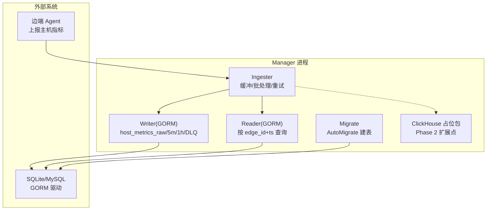
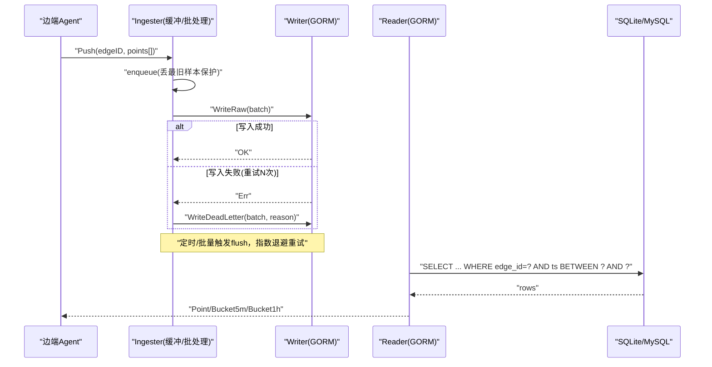
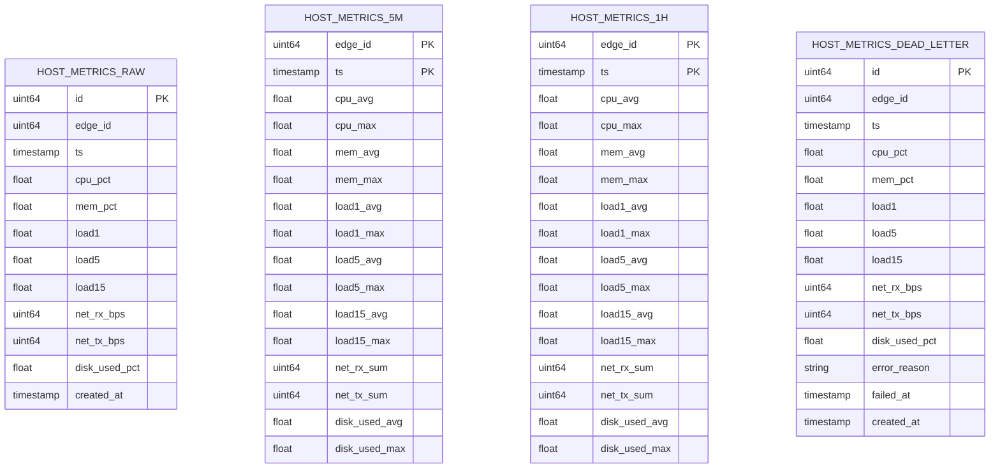
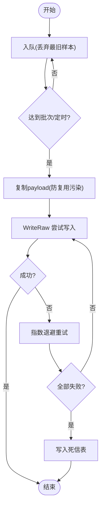
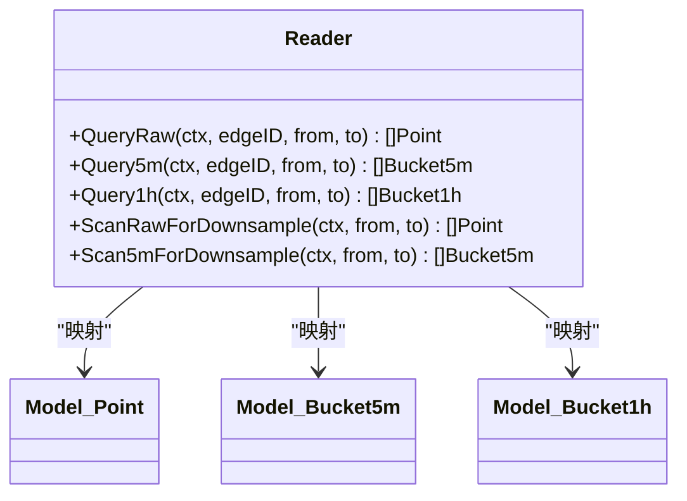
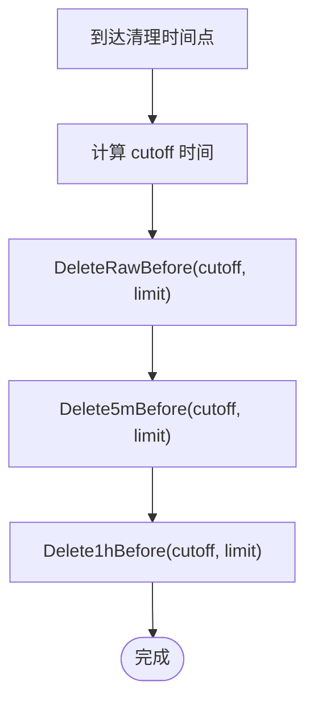
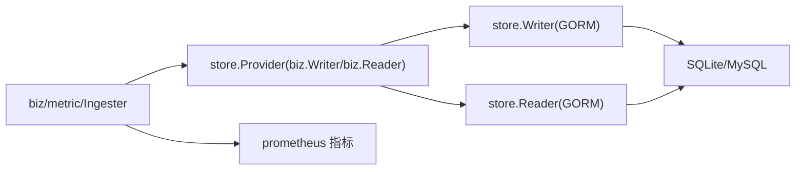
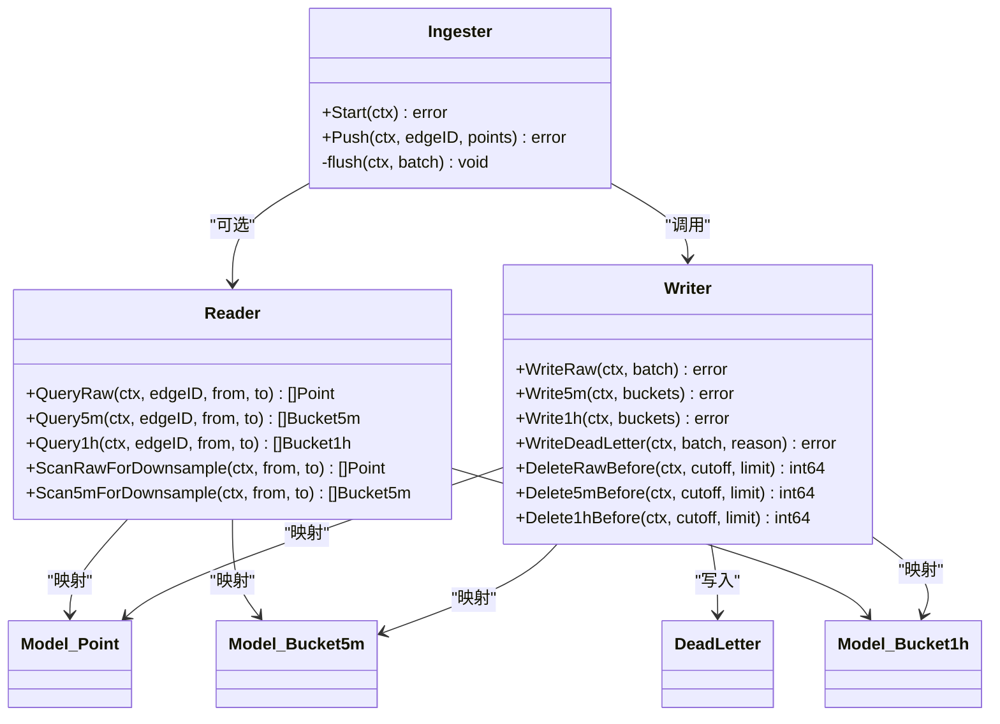
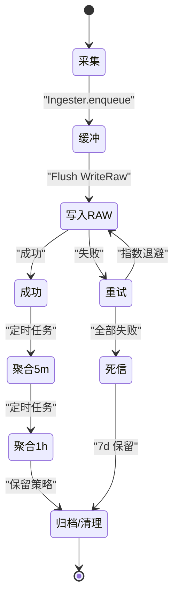

# 数据存储层

<cite>
**本文引用的文件**   
- [internal/manager/data/metric/store/provider.go](file://internal/manager/data/metric/store/provider.go)
- [internal/manager/data/metric/store/writer.go](file://internal/manager/data/metric/store/writer.go)
- [internal/manager/data/metric/store/reader.go](file://internal/manager/data/metric/store/reader.go)
- [internal/manager/data/metric/clickhouse/doc.go](file://internal/manager/data/metric/clickhouse/doc.go)
- [internal/manager/model/metric/model.go](file://internal/manager/model/metric/model.go)
- [internal/manager/data/metric/store/migrate.go](file://internal/manager/data/metric/store/migrate.go)
- [internal/manager/biz/metric/ingester.go](file://internal/manager/biz/metric/ingester.go)
- [cmd/ongrid/main.go](file://cmd/ongrid/main.go)
</cite>

## 目录
1. [简介](#简介)
2. [项目结构](#项目结构)
3. [核心组件](#核心组件)
4. [架构总览](#架构总览)
5. [详细组件分析](#详细组件分析)
6. [依赖关系分析](#依赖关系分析)
7. [性能与容量规划](#性能与容量规划)
8. [故障排查指南](#故障排查指南)
9. [结论](#结论)
10. [附录](#附录)

## 简介
本文件聚焦 OnGrid 的“主机指标”时序数据持久化与查询能力，围绕以下目标展开：
- 时序数据库设计架构（当前基于 SQLite/GORM，预留 ClickHouse 扩展点）
- 数据写入优化（批量、退避重试、死信队列）
- 查询性能调优（索引、分区/分表策略、聚合层级）
- 存储压缩与保留清理（按时间窗口删除、DLQ 保留）
- 读写分离与一致性（单库主从未实现；未来可扩展）
- 缓存层设计与一致性保证（当前无应用级缓存；可引入）
- 架构图、生命周期图、容量规划与运维方案（备份恢复、故障转移）

## 项目结构
与“主机指标”相关的代码位于 manager 子域的数据层与模型层：
- 模型定义：domain 值类型与 GORM 行类型分离，屏蔽存储细节
- 数据访问层：Writer/Reader 接口及 GORM 实现，提供多表操作与迁移
- 接入层：Ingester 负责缓冲、批处理、重试与 DLQ
- 扩展点：ClickHouse 占位包，为后续高性能时序存储演进预留

图示来源
- [internal/manager/biz/metric/ingester.go:1-262](file://internal/manager/biz/metric/ingester.go#L1-L262)
- [internal/manager/data/metric/store/writer.go:1-183](file://internal/manager/data/metric/store/writer.go#L1-L183)
- [internal/manager/data/metric/store/reader.go:1-170](file://internal/manager/data/metric/store/reader.go#L1-L170)
- [internal/manager/data/metric/clickhouse/doc.go:1-5](file://internal/manager/data/metric/clickhouse/doc.go#L1-L5)
- [internal/manager/data/metric/store/migrate.go:1-21](file://internal/manager/data/metric/store/migrate.go#L1-L21)

章节来源
- [internal/manager/data/metric/store/provider.go:1-17](file://internal/manager/data/metric/store/provider.go#L1-L17)
- [internal/manager/data/metric/store/writer.go:1-183](file://internal/manager/data/metric/store/writer.go#L1-L183)
- [internal/manager/data/metric/store/reader.go:1-170](file://internal/manager/data/metric/store/reader.go#L1-L170)
- [internal/manager/data/metric/clickhouse/doc.go:1-5](file://internal/manager/data/metric/clickhouse/doc.go#L1-L5)
- [internal/manager/model/metric/model.go:1-189](file://internal/manager/model/metric/model.go#L1-L189)
- [internal/manager/data/metric/store/migrate.go:1-21](file://internal/manager/data/metric/store/migrate.go#L1-L21)
- [internal/manager/biz/metric/ingester.go:1-262](file://internal/manager/biz/metric/ingester.go#L1-L262)
- [cmd/ongrid/main.go:198-241](file://cmd/ongrid/main.go#L198-L241)

## 核心组件
- 模型层（model/metric）
  - Point/Bucket5m/Bucket1h：面向业务域的无标签值类型
  - HostMetric/HostMetric5m/HostMetric1h/DeadLetter：GORM 行类型，绑定物理表
- 数据访问层（data/metric/store）
  - Writer：批量写入 raw/5m/1h，写失败入 DLQ；支持按时间删除
  - Reader：按 edge_id + ts 范围查询 raw/5m/1h；提供全量扫描用于下采样
  - Migrate：AutoMigrate 注册所有表，含复合主键与索引
  - Provider：在装配期返回 biz.Writer/biz.Reader 接口实例
- 接入层（biz/metric）
  - Ingester：非阻塞 Push，缓冲满则丢弃最旧样本；定时/批量触发 flush；指数退避重试；最终落 DLQ

章节来源
- [internal/manager/model/metric/model.go:1-189](file://internal/manager/model/metric/model.go#L1-L189)
- [internal/manager/data/metric/store/writer.go:1-183](file://internal/manager/data/metric/store/writer.go#L1-L183)
- [internal/manager/data/metric/store/reader.go:1-170](file://internal/manager/data/metric/store/reader.go#L1-L170)
- [internal/manager/data/metric/store/migrate.go:1-21](file://internal/manager/data/metric/store/migrate.go#L1-L21)
- [internal/manager/data/metric/store/provider.go:1-17](file://internal/manager/data/metric/store/provider.go#L1-L17)
- [internal/manager/biz/metric/ingester.go:1-262](file://internal/manager/biz/metric/ingester.go#L1-L262)

## 架构总览
OnGrid 主机指标数据流采用“边端上报 → 接入缓冲 → 批量落盘 → 分层聚合 → 范围查询”的链路。当前默认存储为 SQLite（通过 GORM），并预留 ClickHouse 作为 Phase 2 的高吞吐扩展点。

图示来源
- [internal/manager/biz/metric/ingester.go:120-262](file://internal/manager/biz/metric/ingester.go#L120-L262)
- [internal/manager/data/metric/store/writer.go:36-183](file://internal/manager/data/metric/store/writer.go#L36-L183)
- [internal/manager/data/metric/store/reader.go:24-101](file://internal/manager/data/metric/store/reader.go#L24-L101)

## 详细组件分析

### 模型与表结构
- 三层时序表
  - host_metrics_raw：原始样本（10s 粒度）
  - host_metrics_5m：5分钟聚合（avg/max/sum）
  - host_metrics_1h：1小时聚合（avg/max/sum）
- 死信表
  - host_metrics_dead_letter：记录写入失败的样本与原因，便于事后重放或审计
- 索引与主键
  - raw 表：复合索引 (edge_id, ts)
  - 5m/1h 表：复合主键 (edge_id, ts)，确保幂等覆盖写入

图示来源
- [internal/manager/model/metric/model.go:102-189](file://internal/manager/model/metric/model.go#L102-L189)

章节来源
- [internal/manager/model/metric/model.go:1-189](file://internal/manager/model/metric/model.go#L1-L189)
- [internal/manager/data/metric/store/migrate.go:9-20](file://internal/manager/data/metric/store/migrate.go#L9-L20)

### 写入路径与优化
- 缓冲与批处理
  - 固定批次大小与定时器双触发，减少事务开销
  - 缓冲满时丢弃最旧样本，避免阻塞上游
- 重试与降级
  - 指数退避重试（100ms/500ms/2s），全部失败后写入 DLQ
  - 统一错误分类，控制 Prometheus 标签基数
- 批量写入
  - CreateInBatches 降低往返次数
  - Save 对 5m/1h 进行幂等覆盖（基于复合主键）

图示来源
- [internal/manager/biz/metric/ingester.go:163-247](file://internal/manager/biz/metric/ingester.go#L163-L247)
- [internal/manager/data/metric/store/writer.go:36-118](file://internal/manager/data/metric/store/writer.go#L36-L118)

章节来源
- [internal/manager/biz/metric/ingester.go:45-118](file://internal/manager/biz/metric/ingester.go#L45-L118)
- [internal/manager/biz/metric/ingester.go:120-262](file://internal/manager/biz/metric/ingester.go#L120-L262)
- [internal/manager/data/metric/store/writer.go:25-118](file://internal/manager/data/metric/store/writer.go#L25-L118)

### 查询路径与索引
- 精确过滤：按 edge_id + ts 区间查询，利用复合索引快速定位
- 聚合读取：直接读取 5m/1h 表，避免实时聚合
- 全量扫描：提供 Scan*ForDownsample 方法，供离线任务生成更粗粒度聚合

图示来源
- [internal/manager/data/metric/store/reader.go:24-101](file://internal/manager/data/metric/store/reader.go#L24-L101)
- [internal/manager/model/metric/model.go:18-96](file://internal/manager/model/metric/model.go#L18-L96)

章节来源
- [internal/manager/data/metric/store/reader.go:1-170](file://internal/manager/data/metric/store/reader.go#L1-L170)
- [internal/manager/model/metric/model.go:18-96](file://internal/manager/model/metric/model.go#L18-L96)

### 数据保留与自动清理
- 保留策略
  - raw/5m/1h 均提供 Delete*Before(cutoff, limit) 接口，按 rowid 子查询限制删除行数，避免长事务
- DLQ 保留
  - 死信表保留 7 天（注释约定），建议配合定时任务清理
- 下线策略
  - 结合边缘设备生命周期，定期清理不再活跃的 edge_id 数据（需上层调度）

图示来源
- [internal/manager/data/metric/store/writer.go:150-183](file://internal/manager/data/metric/store/writer.go#L150-L183)

章节来源
- [internal/manager/data/metric/store/writer.go:150-183](file://internal/manager/data/metric/store/writer.go#L150-L183)
- [internal/manager/model/metric/model.go:168-189](file://internal/manager/model/metric/model.go#L168-L189)

### 扩展点：ClickHouse 占位
- 目的：Phase 2 在高吞吐场景替换底层存储
- 现状：仅占位包，待触发条件成熟后实现 Writer/Reader 的具体逻辑
- 影响面：biz 层与 store 接口不变，切换透明

章节来源
- [internal/manager/data/metric/clickhouse/doc.go:1-5](file://internal/manager/data/metric/clickhouse/doc.go#L1-L5)

### 装配与入口
- 装配器 provider 暴露 NewBizWriter/NewBizReader，供 cmd 组装使用
- main 中加载配置、初始化日志与追踪，随后启动各服务（包含 metric 相关服务）

章节来源
- [internal/manager/data/metric/store/provider.go:9-16](file://internal/manager/data/metric/store/provider.go#L9-L16)
- [cmd/ongrid/main.go:198-241](file://cmd/ongrid/main.go#L198-L241)

## 依赖关系分析
- 模块内聚
  - model 与 store 解耦：biz 只依赖接口，不感知具体存储
- 外部依赖
  - GORM 驱动（SQLite/MySQL）
  - Prometheus 客户端（监控指标）
- 潜在循环
  - 当前未见循环依赖；biz 与 store 通过接口隔离

图示来源
- [internal/manager/biz/metric/ingester.go:1-118](file://internal/manager/biz/metric/ingester.go#L1-L118)
- [internal/manager/data/metric/store/provider.go:9-16](file://internal/manager/data/metric/store/provider.go#L9-L16)

章节来源
- [internal/manager/biz/metric/ingester.go:1-118](file://internal/manager/biz/metric/ingester.go#L1-L118)
- [internal/manager/data/metric/store/provider.go:1-17](file://internal/manager/data/metric/store/provider.go#L1-L17)

## 性能与容量规划
- 写入优化
  - 批次大小与超时：默认 batch=500，flush=5s；可按吞吐调整
  - 缓冲容量：bufferCapMultiplier=4，防止突发峰值导致阻塞
  - 重试预算：三次退避，失败即入 DLQ，避免雪崩
- 查询优化
  - 索引：(edge_id, ts) 复合索引，范围查询高效
  - 聚合层级：优先读 5m/1h，避免实时聚合
- 容量估算（示例）
  - 假设单机每秒 1 条样本，每条约 100 字节
    - 日增量 ≈ 8.6MB；月增量 ≈ 250MB
    - 5m/1h 聚合显著降低体积，适合长期留存
  - 建议磁盘预留：至少 3~5 倍于预估增长，以容纳 WAL/索引膨胀与清理窗口
- 压缩与归档
  - 当前未启用行级压缩；可通过数据库引擎特性或冷数据归档到对象存储（需上层调度）
- 读写分离
  - 当前单库；若需读放大，可在 MySQL 上开启只读副本并通过 Reader 路由（需改造 Provider）

[本节为通用指导，无需源码引用]

## 故障排查指南
- 写入失败
  - 观察指标：ongrid_ingest_writes_total{result=fail}、ongrid_ingest_flush_failures_total
  - 检查 DLQ 表：host_metrics_dead_letter，关注 error_reason 与 failed_at
- 缓冲溢出
  - 指标：ongrid_ingest_dropped_total{reason="buffer_full"}
  - 对策：增大 bufferCapMultiplier 或提高 flush 频率
- 查询缓慢
  - 确认索引存在且命中；缩小时间窗；优先走 5m/1h 表
- 清理卡住
  - 使用带 LIMIT 的 deleteBefore 分批执行；避免长事务锁表

章节来源
- [internal/manager/biz/metric/ingester.go:200-262](file://internal/manager/biz/metric/ingester.go#L200-L262)
- [internal/manager/data/metric/store/writer.go:166-183](file://internal/manager/data/metric/store/writer.go#L166-L183)

## 结论
当前主机指标存储层以“轻量可用、易于演进”为目标：
- 用 GORM + SQLite/MySQL 满足中小规模场景
- 通过 Ingester 缓冲与 DLQ 保障高可用写入
- 以 5m/1h 聚合提升查询效率与长期留存能力
- 预留 ClickHouse 扩展点，平滑过渡到高吞吐时序存储

[本节为总结性内容，无需源码引用]

## 附录

### 存储架构图（代码级）

图示来源
- [internal/manager/biz/metric/ingester.go:1-262](file://internal/manager/biz/metric/ingester.go#L1-L262)
- [internal/manager/data/metric/store/writer.go:1-183](file://internal/manager/data/metric/store/writer.go#L1-L183)
- [internal/manager/data/metric/store/reader.go:1-170](file://internal/manager/data/metric/store/reader.go#L1-L170)
- [internal/manager/model/metric/model.go:18-189](file://internal/manager/model/metric/model.go#L18-L189)

### 数据生命周期图

图示来源
- [internal/manager/biz/metric/ingester.go:120-262](file://internal/manager/biz/metric/ingester.go#L120-L262)
- [internal/manager/data/metric/store/writer.go:150-183](file://internal/manager/data/metric/store/writer.go#L150-L183)
- [internal/manager/model/metric/model.go:168-189](file://internal/manager/model/metric/model.go#L168-L189)

### 容量规划清单
- 输入参数
  - 设备数量 × 指标维度 × 采样间隔
- 存储选型
  - 小规模：SQLite（内置、零运维）
  - 大规模：MySQL + 只读副本（读放大）或 ClickHouse（高吞吐）
- 保留策略
  - raw：短期（如 7~30 天）
  - 5m/1h：中长期（如 90~365 天）
- 扩容与迁移
  - 通过 Provider 切换 Writer/Reader 实现，保持 biz 层稳定

[本节为通用指导，无需源码引用]