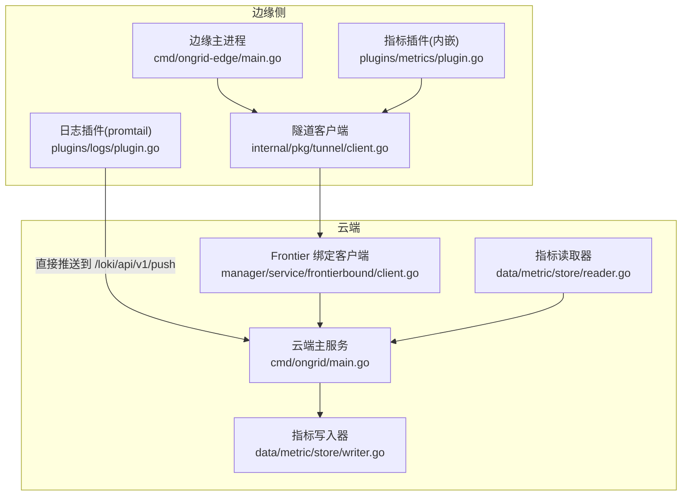
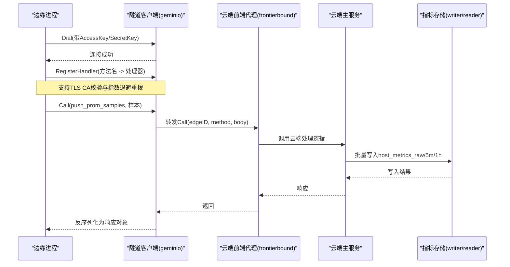
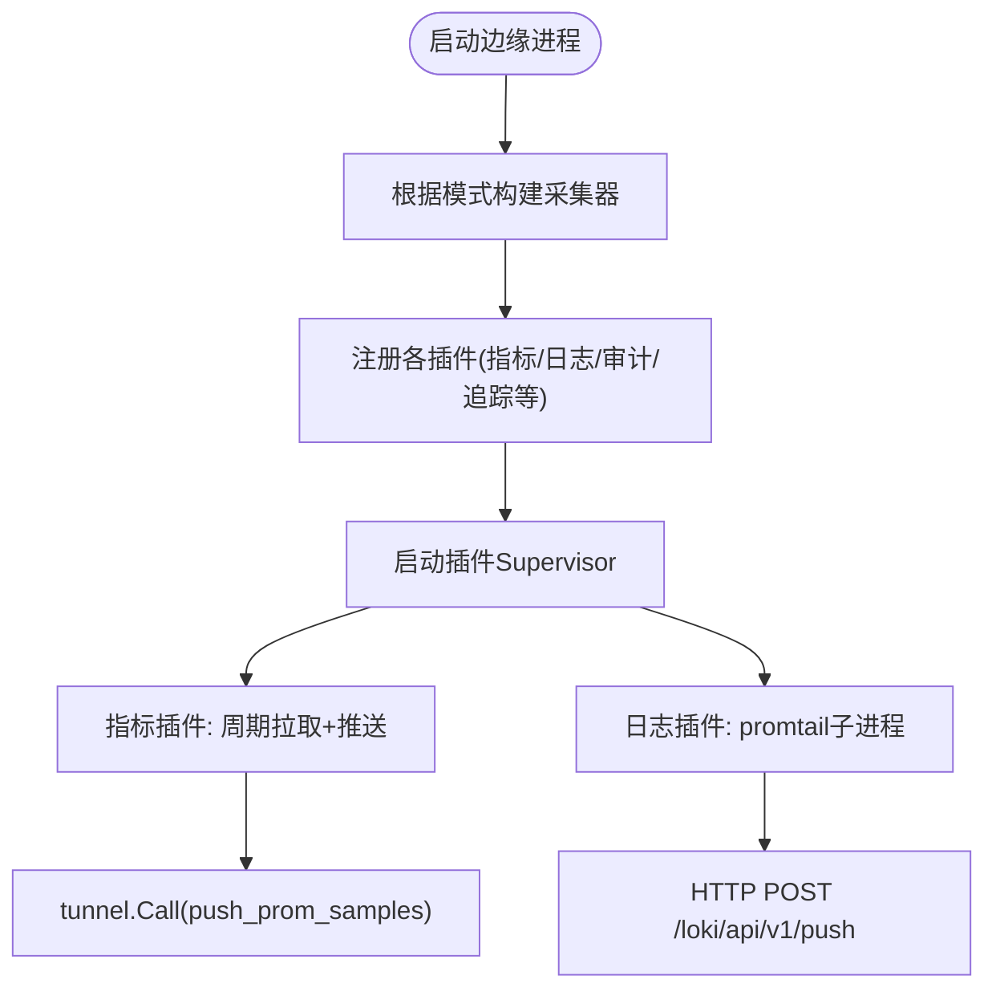
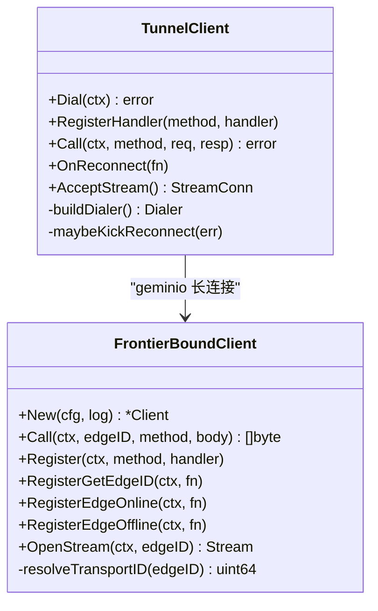
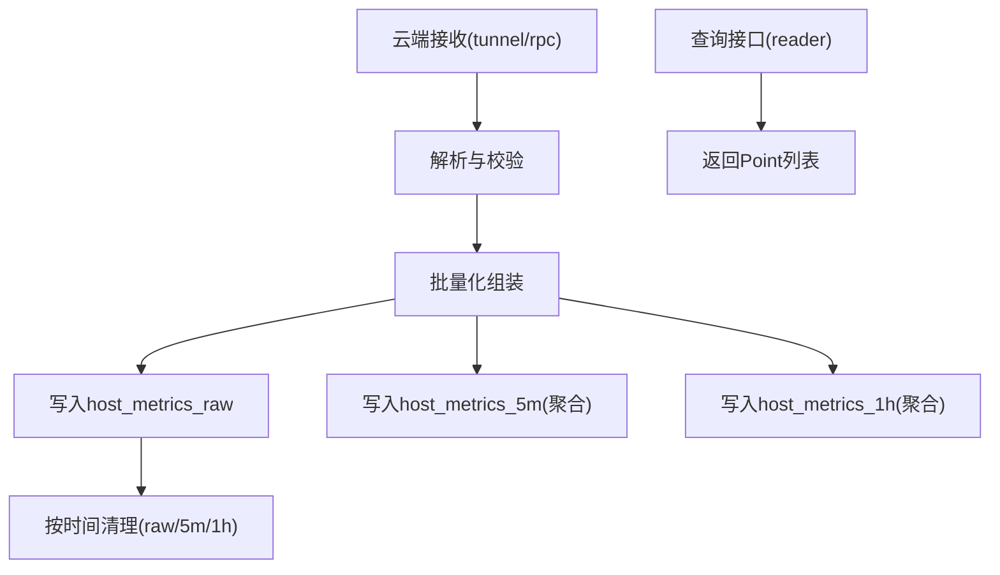
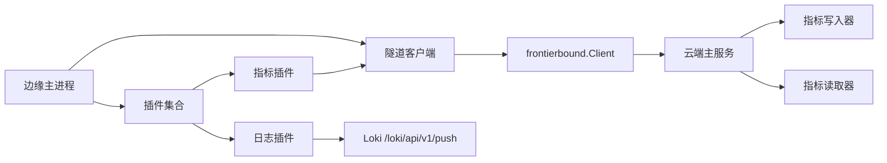

# 数据流架构

<cite>
**本文引用的文件**
- [cmd/ongrid-edge/main.go](file://cmd/ongrid-edge/main.go)
- [internal/pkg/tunnel/client.go](file://internal/pkg/tunnel/client.go)
- [internal/manager/service/frontierbound/client.go](file://internal/manager/service/frontierbound/client.go)
- [internal/edgeagent/plugins/metrics/plugin.go](file://internal/edgeagent/plugins/metrics/plugin.go)
- [internal/edgeagent/plugins/logs/plugin.go](file://internal/edgeagent/plugins/logs/plugin.go)
- [internal/manager/data/metric/store/writer.go](file://internal/manager/data/metric/store/writer.go)
- [internal/manager/data/metric/store/reader.go](file://internal/manager/data/metric/store/reader.go)
- [cmd/ongrid/main.go](file://cmd/ongrid/main.go)
</cite>

## 目录
1. [简介](#简介)
2. [项目结构](#项目结构)
3. [核心组件](#核心组件)
4. [架构总览](#架构总览)
5. [详细组件分析](#详细组件分析)
6. [依赖关系分析](#依赖关系分析)
7. [性能与容量规划](#性能与容量规划)
8. [故障排查指南](#故障排查指南)
9. [结论](#结论)
10. [附录](#附录)

## 简介
本文件系统化梳理 OnGrid 的数据流架构，覆盖从边缘节点采集、安全隧道传输、云端接收解析到持久化存储的全链路。重点说明：
- 边缘侧指标采集、日志聚合与事件捕获机制
- 基于 geminio + frontier 的安全隧道设计与协议约定
- 云端对数据的接收、解析、转换与落库策略（含多时间粒度表）
- 数据一致性、背压与流量控制要点
- 面向生产环境的性能优化建议与容量规划指导

## 项目结构
围绕数据流的关键代码分布在以下模块：
- 边缘进程入口与插件编排：cmd/ongrid-edge/main.go
- 隧道客户端实现（边缘侧）：internal/pkg/tunnel/client.go
- 云端前端代理（frontierbound）：internal/manager/service/frontierbound/client.go
- 指标插件（边端拉取并推送）：internal/edgeagent/plugins/metrics/plugin.go
- 日志插件（子进程 promtail）：internal/edgeagent/plugins/logs/plugin.go
- 云端指标写入与读取（MySQL/GORM）：internal/manager/data/metric/store/{writer,reader}.go
- 云端主服务启动与 HTTP/Metrics 监听：cmd/ongrid/main.go

**图表来源**
- [cmd/ongrid-edge/main.go:1-120](file://cmd/ongrid-edge/main.go#L1-L120)
- [internal/pkg/tunnel/client.go:1-120](file://internal/pkg/tunnel/client.go#L1-L120)
- [internal/manager/service/frontierbound/client.go:1-120](file://internal/manager/service/frontierbound/client.go#L1-L120)
- [internal/edgeagent/plugins/metrics/plugin.go:1-120](file://internal/edgeagent/plugins/metrics/plugin.go#L1-L120)
- [internal/edgeagent/plugins/logs/plugin.go:1-54](file://internal/edgeagent/plugins/logs/plugin.go#L1-L54)
- [internal/manager/data/metric/store/writer.go:1-60](file://internal/manager/data/metric/store/writer.go#L1-L60)
- [internal/manager/data/metric/store/reader.go:1-50](file://internal/manager/data/metric/store/reader.go#L1-L50)
- [cmd/ongrid/main.go:2480-2500](file://cmd/ongrid/main.go#L2480-L2500)

**章节来源**
- [cmd/ongrid-edge/main.go:1-120](file://cmd/ongrid-edge/main.go#L1-L120)
- [internal/pkg/tunnel/client.go:1-120](file://internal/pkg/tunnel/client.go#L1-L120)
- [internal/manager/service/frontierbound/client.go:1-120](file://internal/manager/service/frontierbound/client.go#L1-L120)
- [internal/edgeagent/plugins/metrics/plugin.go:1-120](file://internal/edgeagent/plugins/metrics/plugin.go#L1-L120)
- [internal/edgeagent/plugins/logs/plugin.go:1-54](file://internal/edgeagent/plugins/logs/plugin.go#L1-L54)
- [internal/manager/data/metric/store/writer.go:1-60](file://internal/manager/data/metric/store/writer.go#L1-L60)
- [internal/manager/data/metric/store/reader.go:1-50](file://internal/manager/data/metric/store/reader.go#L1-L50)
- [cmd/ongrid/main.go:2480-2500](file://cmd/ongrid/main.go#L2480-L2500)

## 核心组件
- 边缘主进程：负责加载配置、初始化隧道客户端、构建采集器、注册各类插件（指标、日志、审计、追踪等），并通过心跳上报健康状态。
- 隧道客户端（边缘侧）：封装 geminio 的长连接、自动重拨、认证元信息传递、方法级 RPC 调用与回调；支持 TLS CA 校验与指数退避。
- 云端前端代理（frontierbound）：对接 frontier broker，提供按 edgeID 路由的 Call/Register/OpenStream 能力，维护 transportID 与业务 edgeID 映射。
- 指标插件（边缘侧）：周期拉取本地 /metrics（如 node_exporter），解析 Prometheus 文本格式后通过 tunnel RPC push_prom_samples 推送至云端。
- 日志插件（边缘侧）：以子进程方式运行 promtail，根据 manager 下发的配置渲染 promtail.yaml，直接向云端 /loki/api/v1/push 推送日志。
- 云端指标存储：使用 GORM 批量写入 MySQL，包含原始点表与 5m/1h 聚合表，并提供按时间范围查询接口。

**章节来源**
- [cmd/ongrid-edge/main.go:100-180](file://cmd/ongrid-edge/main.go#L100-L180)
- [internal/pkg/tunnel/client.go:60-140](file://internal/pkg/tunnel/client.go#L60-L140)
- [internal/manager/service/frontierbound/client.go:60-120](file://internal/manager/service/frontierbound/client.go#L60-L120)
- [internal/edgeagent/plugins/metrics/plugin.go:180-280](file://internal/edgeagent/plugins/metrics/plugin.go#L180-L280)
- [internal/edgeagent/plugins/logs/plugin.go:20-54](file://internal/edgeagent/plugins/logs/plugin.go#L20-L54)
- [internal/manager/data/metric/store/writer.go:36-118](file://internal/manager/data/metric/store/writer.go#L36-L118)
- [internal/manager/data/metric/store/reader.go:24-50](file://internal/manager/data/metric/store/reader.go#L24-L50)

## 架构总览
整体采用“边缘主动拨号 + 云端被动接入”的零入站端口设计。边缘侧通过隧道客户端建立到云端的加密通道，所有上行数据（指标、RPC 请求、流式通道）均经此通道传输；日志由 promtail 直连云端 Loki 入口。云端通过 frontier 进行服务发现与路由，将来自不同边缘的请求分发到对应处理逻辑，最终将指标写入 MySQL 的多时间粒度表。

**图表来源**
- [internal/pkg/tunnel/client.go:60-140](file://internal/pkg/tunnel/client.go#L60-L140)
- [internal/manager/service/frontierbound/client.go:128-190](file://internal/manager/service/frontierbound/client.go#L128-L190)
- [internal/edgeagent/plugins/metrics/plugin.go:210-280](file://internal/edgeagent/plugins/metrics/plugin.go#L210-L280)
- [internal/manager/data/metric/store/writer.go:36-118](file://internal/manager/data/metric/store/writer.go#L36-L118)

## 详细组件分析

### 边缘数据采集与插件编排
- 采集模式：支持 off/auto/embedded/scrape 多种模式，默认 off（由 hostmetrics/procmetrics 子进程插件暴露指标，云端 Prom 直接抓取）。
- 插件体系：logs/traces/hostmetrics/procmetrics/custommetrics/databasemetrics 等插件由 Supervisor 管理，支持远程配置下发与热重载。
- 指标插件：内嵌拉取本地 /metrics，解析为 Prometheus samples，通过 tunnel RPC push_prom_samples 推送；在 register_edge 完成前延迟推送以避免 edge_id=0。
- 日志插件：以子进程运行 promtail，渲染配置文件后直接推送至云端 /loki/api/v1/push。

**图表来源**
- [cmd/ongrid-edge/main.go:316-376](file://cmd/ongrid-edge/main.go#L316-L376)
- [internal/edgeagent/plugins/metrics/plugin.go:180-280](file://internal/edgeagent/plugins/metrics/plugin.go#L180-L280)
- [internal/edgeagent/plugins/logs/plugin.go:20-54](file://internal/edgeagent/plugins/logs/plugin.go#L20-L54)

**章节来源**
- [cmd/ongrid-edge/main.go:100-180](file://cmd/ongrid-edge/main.go#L100-L180)
- [cmd/ongrid-edge/main.go:316-376](file://cmd/ongrid-edge/main.go#L316-L376)
- [internal/edgeagent/plugins/metrics/plugin.go:180-280](file://internal/edgeagent/plugins/metrics/plugin.go#L180-L280)
- [internal/edgeagent/plugins/logs/plugin.go:20-54](file://internal/edgeagent/plugins/logs/plugin.go#L20-L54)

### 安全隧道与协议设计
- 连接建立：边缘侧使用 ClientConfig（CloudAddr、AccessKey、SecretKey、可选 TLS CA）发起 Dial，内部基于 geminio 的 RetryEnd 实现断线重拨与指数退避。
- 认证与会话：Dial 时将 Meta（JSON 包含 AccessKey/SecretKey）随连接发送；云端通过 RegisterGetEdgeID 将凭据映射为业务 edgeID。
- 方法调用：Call 对 JSON 序列化/反序列化，错误检测包含远端错误与路由失效场景，必要时触发异步重拨。
- 反向注册：RegisterHandler 允许云端向边缘发起 RPC（如主机文件检查、重启服务等），支持在线注册与重连后自动恢复。
- 流式通道：OpenStream 提供双向字节流，用于 WebSSH 等场景，Meta 携带目标地址描述。

**图表来源**
- [internal/pkg/tunnel/client.go:60-140](file://internal/pkg/tunnel/client.go#L60-L140)
- [internal/pkg/tunnel/client.go:178-243](file://internal/pkg/tunnel/client.go#L178-L243)
- [internal/manager/service/frontierbound/client.go:60-120](file://internal/manager/service/frontierbound/client.go#L60-L120)
- [internal/manager/service/frontierbound/client.go:128-242](file://internal/manager/service/frontierbound/client.go#L128-L242)

**章节来源**
- [internal/pkg/tunnel/client.go:60-140](file://internal/pkg/tunnel/client.go#L60-L140)
- [internal/pkg/tunnel/client.go:178-243](file://internal/pkg/tunnel/client.go#L178-L243)
- [internal/manager/service/frontierbound/client.go:128-242](file://internal/manager/service/frontierbound/client.go#L128-L242)

### 云端接收、解析与持久化
- 接收路径：frontierbound 作为云端网关，将边缘的 Call 请求按 edgeID 路由到具体业务处理器；同时维护 transportID 与 edgeID 的双向映射，避免标签污染。
- 指标写入：writer 提供 WriteRaw/Write5m/Write1h 等方法，分别写入原始点表与聚合表；批量大小固定，写失败可走 DLQ 记录原因。
- 指标读取：reader 提供按 edgeID 与时间范围查询原始点的接口，供上层工具或报表使用。
- 服务监听：云端主服务启动 HTTP API 与独立 metrics 端口，便于外部监控。

**图表来源**
- [internal/manager/service/frontierbound/client.go:128-190](file://internal/manager/service/frontierbound/client.go#L128-L190)
- [internal/manager/data/metric/store/writer.go:36-118](file://internal/manager/data/metric/store/writer.go#L36-L118)
- [internal/manager/data/metric/store/reader.go:24-50](file://internal/manager/data/metric/store/reader.go#L24-L50)
- [cmd/ongrid/main.go:2480-2500](file://cmd/ongrid/main.go#L2480-L2500)

**章节来源**
- [internal/manager/service/frontierbound/client.go:128-190](file://internal/manager/service/frontierbound/client.go#L128-L190)
- [internal/manager/data/metric/store/writer.go:36-118](file://internal/manager/data/metric/store/writer.go#L36-L118)
- [internal/manager/data/metric/store/reader.go:24-50](file://internal/manager/data/metric/store/reader.go#L24-L50)
- [cmd/ongrid/main.go:2480-2500](file://cmd/ongrid/main.go#L2480-L2500)

## 依赖关系分析
- 边缘侧依赖：
  - ongrid-edge 依赖 tunnel.Client 与 plugins 体系；metrics 插件依赖 tunnel.Pusher 接口以便测试替换。
- 云端侧依赖：
  - frontierbound.Client 依赖 fbsvc.Service（geminio Service），对外暴露统一 Call/Register/OpenStream 接口。
  - metric store 依赖 GORM 与 MySQL，提供读写抽象。
- 外部系统：
  - Loki（/loki/api/v1/push）由 promtail 直连推送。
  - Prometheus（云端）可通过 docker 桥直接抓取边缘子进程暴露的指标（当 collector_mode=off 时）。

**图表来源**
- [cmd/ongrid-edge/main.go:100-180](file://cmd/ongrid-edge/main.go#L100-L180)
- [internal/edgeagent/plugins/metrics/plugin.go:1-120](file://internal/edgeagent/plugins/metrics/plugin.go#L1-L120)
- [internal/edgeagent/plugins/logs/plugin.go:1-54](file://internal/edgeagent/plugins/logs/plugin.go#L1-L54)
- [internal/manager/service/frontierbound/client.go:1-120](file://internal/manager/service/frontierbound/client.go#L1-L120)
- [internal/manager/data/metric/store/writer.go:1-60](file://internal/manager/data/metric/store/writer.go#L1-L60)
- [internal/manager/data/metric/store/reader.go:1-50](file://internal/manager/data/metric/store/reader.go#L1-L50)

**章节来源**
- [cmd/ongrid-edge/main.go:100-180](file://cmd/ongrid-edge/main.go#L100-L180)
- [internal/edgeagent/plugins/metrics/plugin.go:1-120](file://internal/edgeagent/plugins/metrics/plugin.go#L1-L120)
- [internal/edgeagent/plugins/logs/plugin.go:1-54](file://internal/edgeagent/plugins/logs/plugin.go#L1-L54)
- [internal/manager/service/frontierbound/client.go:1-120](file://internal/manager/service/frontierbound/client.go#L1-L120)
- [internal/manager/data/metric/store/writer.go:1-60](file://internal/manager/data/metric/store/writer.go#L1-L60)
- [internal/manager/data/metric/store/reader.go:1-50](file://internal/manager/data/metric/store/reader.go#L1-L50)

## 性能与容量规划
- 采集频率与批大小
  - 指标插件默认 scrape_interval 较短（秒级），需结合目标数量与样本量评估带宽与 CPU 占用。
  - 云端写入采用固定批大小（如 500），可根据数据库吞吐调整批次大小以提升写入效率。
- 网络与重拨
  - 隧道客户端具备指数退避与最大退避上限，避免雪崩；云端 frontierbound 维护 transportID 映射，减少无效请求。
- 存储与保留
  - 原始点表与 5m/1h 聚合表分离，便于长期归档与快速查询；删除操作按 rowid 限制批量，避免长时间锁表。
- 背压与流量控制
  - 边缘侧插件在失败时仅记录警告并等待下一轮重试，不阻塞其他目标拉取。
  - 云端可按 edgeID 维度做限流与队列缓冲，防止单点过载影响全局。
- 容量规划建议
  - 估算每边缘每秒样本数 × 边缘数量 × 保留天数 → 决定 MySQL 磁盘与索引空间。
  - 针对高基数标签（如 instance/target）进行去重与降采样，降低 cardinality。
  - 对热点边缘设置更短 scrape_interval，对冷数据边缘拉长间隔。

[本节为通用指导，无需特定文件引用]

## 故障排查指南
- 连接问题
  - 边缘 Dial 失败会持续重试并记录 warn；检查 CloudAddr、AccessKey/SecretKey、TLS CA 配置。
  - 云端 frontierbound 若未建立 transportID 映射，可能丢弃请求导致 edge_id 异常，需确认 RegisterGetEdgeID 是否生效。
- 指标推送失败
  - 指标插件在 scrape 或 push 失败时会记录警告并递增 failureCount；检查本地 /metrics 可达性与云端 push_prom_samples 处理器。
- 日志推送失败
  - promtail 子进程崩溃或无法连接 /loki/api/v1/push 会导致日志丢失；查看插件工作目录下的进程日志与 positions.yaml。
- 存储写入失败
  - writer 的批量写入失败可转存 DLQ 表；检查 MySQL 连接、磁盘空间与事务超时。

**章节来源**
- [internal/pkg/tunnel/client.go:60-140](file://internal/pkg/tunnel/client.go#L60-L140)
- [internal/manager/service/frontierbound/client.go:252-310](file://internal/manager/service/frontierbound/client.go#L252-L310)
- [internal/edgeagent/plugins/metrics/plugin.go:210-280](file://internal/edgeagent/plugins/metrics/plugin.go#L210-L280)
- [internal/edgeagent/plugins/logs/plugin.go:20-54](file://internal/edgeagent/plugins/logs/plugin.go#L20-L54)
- [internal/manager/data/metric/store/writer.go:59-88](file://internal/manager/data/metric/store/writer.go#L59-L88)

## 结论
OnGrid 的数据流以“边缘主动拨号 + 云端集中治理”为核心，借助 geminio 与 frontier 构建稳定可靠的安全隧道，配合插件化采集与云端多粒度存储，形成可扩展、易运维的可观测性基础设施。通过合理的采集频率、批大小与保留策略，可在保证一致性的前提下实现高性能与低成本。

[本节为总结性内容，无需特定文件引用]

## 附录
- 关键术语
  - 边缘（Edge）：部署在被管主机上的 agent 进程，负责采集与上报。
  - 云端（Manager）：集中管理服务，负责接收、解析、持久化与展示。
  - 隧道（Tunnel）：基于 geminio 的加密长连接，承载 RPC 与流式通道。
  - 前端代理（Frontierbound）：云端对 frontier broker 的适配层，负责路由与生命周期管理。
- 参考路径
  - 边缘主进程：cmd/ongrid-edge/main.go
  - 隧道客户端：internal/pkg/tunnel/client.go
  - 云端前端代理：internal/manager/service/frontierbound/client.go
  - 指标插件：internal/edgeagent/plugins/metrics/plugin.go
  - 日志插件：internal/edgeagent/plugins/logs/plugin.go
  - 指标存储：internal/manager/data/metric/store/{writer,reader}.go
  - 云端主服务：cmd/ongrid/main.go

[本节为补充信息，无需特定文件引用]