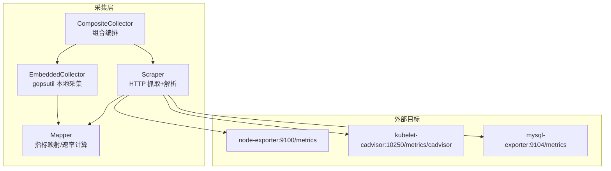
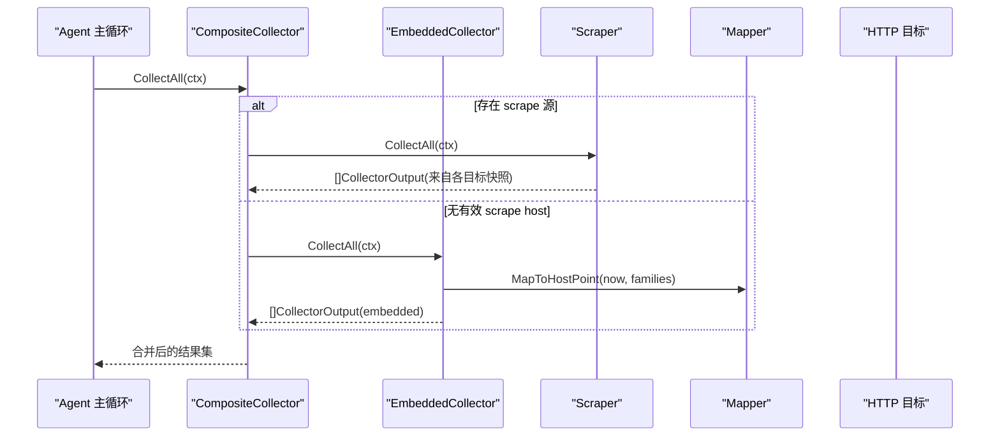
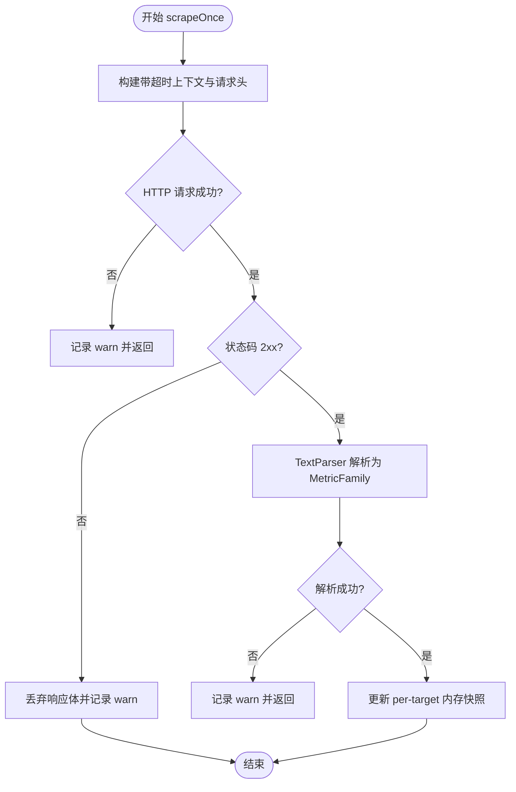
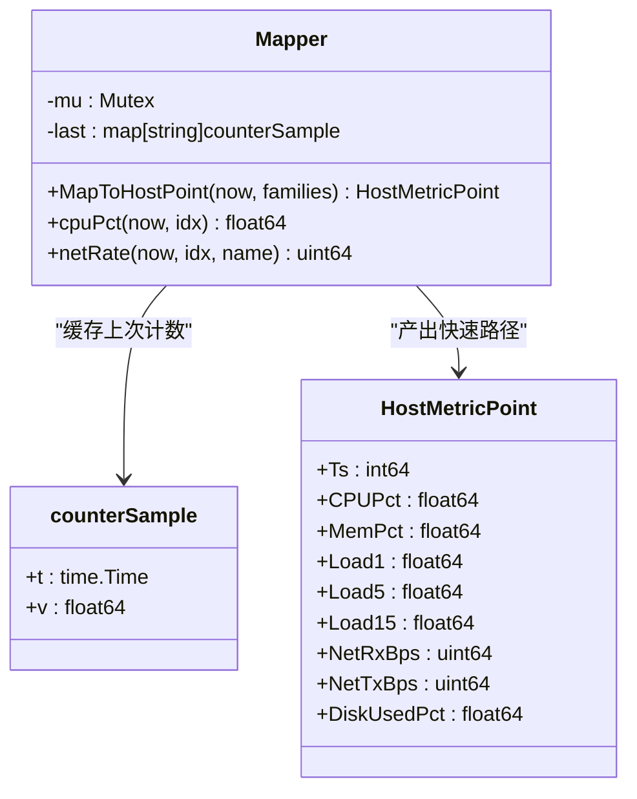
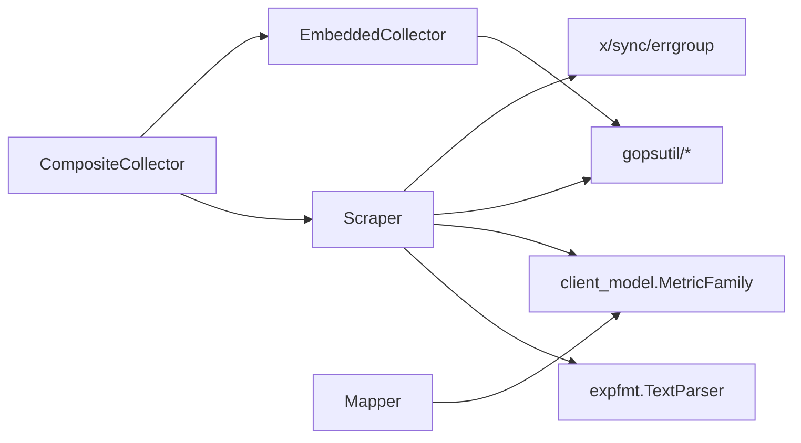

# 数据采集层

<cite>
**本文引用的文件**
- [scrape.go](file://internal/edgeagent/collector/scrape.go)
- [types.go](file://internal/edgeagent/collector/types.go)
- [scrapecfg.go](file://internal/edgeagent/collector/scrapecfg.go)
- [mapper.go](file://internal/edgeagent/collector/mapper.go)
- [composite.go](file://internal/edgeagent/collector/composite.go)
- [embedded.go](file://internal/edgeagent/collector/embedded.go)
- [scrape_config.example.yaml](file://internal/edgeagent/collector/scrape_config.example.yaml)
</cite>

## 目录
1. [简介](#简介)
2. [项目结构](#项目结构)
3. [核心组件](#核心组件)
4. [架构总览](#架构总览)
5. [详细组件分析](#详细组件分析)
6. [依赖关系分析](#依赖关系分析)
7. [性能与并发](#性能与并发)
8. [配置示例](#配置示例)
9. [故障排查指南](#故障排查指南)
10. [结论](#结论)

## 简介
本章节聚焦 OnGrid 边缘节点的数据采集层，围绕指标收集器（Scraper）的工作原理、HTTP 目标抓取流程、Prometheus 文本格式解析、内存快照管理、系统指标映射（CPU、内存、网络、磁盘）、进程监控与数据映射机制进行系统化说明。同时覆盖多目标并发采集策略、错误处理与重试语义、以及性能调优建议与排障要点。

## 项目结构
数据采集层位于 edgeagent/collector 包内，采用“嵌入式采集 + HTTP 抓取”双源融合的设计：
- 嵌入式采集：通过 gopsutil 直接读取本地系统指标，输出 node_exporter 兼容的 Prometheus 指标族，供快速路径（HostMetricPoint）和开放路径（PromSample）使用。
- HTTP 抓取：按配置轮询多个 /metrics 端点，解析 Prometheus 文本格式，维护每目标的最近成功快照，并支持 role=host/component 两种角色。
- 组合采集器：在 host 角色可用时优先使用 scrape 的快速路径；否则回退到嵌入式基线。

图示来源
- [embedded.go:1-403](file://internal/edgeagent/collector/embedded.go#L1-L403)
- [scrape.go:1-415](file://internal/edgeagent/collector/scrape.go#L1-L415)
- [mapper.go:1-373](file://internal/edgeagent/collector/mapper.go#L1-L373)
- [composite.go:1-92](file://internal/edgeagent/collector/composite.go#L1-L92)

章节来源
- [embedded.go:1-403](file://internal/edgeagent/collector/embedded.go#L1-L403)
- [scrape.go:1-415](file://internal/edgeagent/collector/scrape.go#L1-L415)
- [mapper.go:1-373](file://internal/edgeagent/collector/mapper.go#L1-L373)
- [composite.go:1-92](file://internal/edgeagent/collector/composite.go#L1-L92)

## 核心组件
- Scraper：为每个目标启动独立 goroutine，周期性发起 HTTP GET，解析响应体为 MetricFamily，写入 per-target 内存快照；提供 CollectAll 将快照转换为 CollectorOutput（含 HostPoint 与 Samples）。
- EmbeddedCollector：基于 gopsutil 生成 node_exporter 命名规范的指标族，复用同一 Mapper 以统一快速路径。
- Mapper：负责从 MetricFamily 提取 8 字段 HostMetricPoint（CPU%、内存%、Load1/5/15、网络收发 Bps、磁盘使用%），并对计数器做差值速率化；同时将 MetricFamily 扁平化为 PromSample 列表。
- CompositeCollector：协调嵌入式与 scrape 源，当存在 host 角色的 scrape 快照且有效时优先使用其快速路径，否则回退嵌入式基线。
- ScrapeConfig：加载 YAML 配置，定义 targets 列表及默认值（interval、timeout、role 等）。

章节来源
- [scrape.go:29-95](file://internal/edgeagent/collector/scrape.go#L29-L95)
- [embedded.go:26-73](file://internal/edgeagent/collector/embedded.go#L26-L73)
- [mapper.go:16-62](file://internal/edgeagent/collector/mapper.go#L16-L62)
- [composite.go:10-55](file://internal/edgeagent/collector/composite.go#L10-L55)
- [scrapecfg.go:12-91](file://internal/edgeagent/collector/scrapecfg.go#L12-L91)

## 架构总览
采集层对外暴露统一的 Collector 接口，上层 agent 循环调用 CollectAll 获取一批 CollectorOutput，再分别推送至云端。

图示来源
- [composite.go:30-55](file://internal/edgeagent/collector/composite.go#L30-L55)
- [embedded.go:54-73](file://internal/edgeagent/collector/embedded.go#L54-L73)
- [scrape.go:185-226](file://internal/edgeagent/collector/scrape.go#L185-L226)
- [mapper.go:40-62](file://internal/edgeagent/collector/mapper.go#L40-L62)

## 详细组件分析

### Scraper：HTTP 抓取与内存快照
- 生命周期
  - NewScraper：根据配置为每个 target 创建 http.Client（可配置 TLS 跳过验证）与 Mapper。
  - Run：errgroup 并发运行 runTarget，每个 target 一个 goroutine，立即执行一次抓取，随后按 interval 定时触发。
- 单次抓取流程
  - 构建带超时的请求，设置 Accept 为 text/plain；可选从 bearer_token_file 读取 Token 注入 Authorization。
  - 执行 HTTP GET，非 2xx 记录告警并丢弃响应体；成功则用 TextParser 解析为 MetricFamily。
  - 将 families 转为有序切片，更新 per-target 内存快照（包含 families、时间戳、source、role）。
- 输出
  - CollectAll：遍历已缓存的快照，对每个目标生成 CollectorOutput；若 role=host 且 mapper 能产出非零 CPU%，则标记 HostPointValid=true，并填充 HostPoint。
- 错误处理
  - 请求构建失败、网络错误、非 2xx、解析失败均记录 warn 日志，不中断其他目标。
  - 未产生过成功抓取的 target 被静默跳过，等待下一次 tick。

图示来源
- [scrape.go:115-183](file://internal/edgeagent/collector/scrape.go#L115-L183)

章节来源
- [scrape.go:58-95](file://internal/edgeagent/collector/scrape.go#L58-L95)
- [scrape.go:97-113](file://internal/edgeagent/collector/scrape.go#L97-L113)
- [scrape.go:115-183](file://internal/edgeagent/collector/scrape.go#L115-L183)
- [scrape.go:185-226](file://internal/edgeagent/collector/scrape.go#L185-L226)

### Mapper：指标映射与速率计算
- 快速路径（HostMetricPoint）
  - CPU%：基于 node_cpu_seconds_total 的计数器差值，累计 total 与 idle 增量，计算 (total-idle)/total*100。首次调用返回 0。
  - 内存%：优先使用 MemAvailable，缺失时回退 MemFree+Buffers+Cached，计算占用百分比。
  - Load1/5/15：直接取对应 gauge。
  - 网络 Bps：对 node_network_receive/transmit_bytes_total 按设备聚合差值，排除 lo，除以最小 dt 得到字节每秒。
  - 磁盘使用%：匹配 mountpoint="/" 的 size/avail，计算占用百分比。
- 开放路径（FlattenSamples）
  - 将 MetricFamily 展平为 PromSample 列表，支持 GAUGE/COUNTER/UNTYPED/SUMMARY/HISTOGRAM；合并 static_labels（producer 标签优先）。
  - 过滤 NaN/Inf 以保证 JSON 可序列化。
- 并发安全
  - 内部使用互斥锁保护 last 计数器缓存，确保连续两次采样基于稳定快照计算差值。

图示来源
- [mapper.go:16-62](file://internal/edgeagent/collector/mapper.go#L16-L62)
- [mapper.go:227-307](file://internal/edgeagent/collector/mapper.go#L227-L307)

章节来源
- [mapper.go:40-62](file://internal/edgeagent/collector/mapper.go#L40-L62)
- [mapper.go:64-137](file://internal/edgeagent/collector/mapper.go#L64-L137)
- [mapper.go:227-307](file://internal/edgeagent/collector/mapper.go#L227-L307)

### EmbeddedCollector：本地系统指标采集
- 采集范围：CPU、内存、负载、网络、文件系统、时间/启动时间，全部遵循 node_exporter 命名规范。
- 输出：构造 MetricFamily 列表，交由 Mapper 生成 HostMetricPoint 与 PromSample。
- 进程列表：通过 gopsutil 枚举进程，按 CPU 或内存排序返回 topN。
- 主机信息：OS、内核版本、主机名、硬件指纹、IP、CPU/内存总量等。

章节来源
- [embedded.go:176-235](file://internal/edgeagent/collector/embedded.go#L176-L235)
- [embedded.go:239-340](file://internal/edgeagent/collector/embedded.go#L239-L340)
- [embedded.go:132-174](file://internal/edgeagent/collector/embedded.go#L132-L174)
- [embedded.go:75-112](file://internal/edgeagent/collector/embedded.go#L75-L112)

### CompositeCollector：组合编排与回退策略
- 优先使用 scrape 的 host 角色快速路径；若无有效 host 快照，则回退嵌入式基线。
- 对 GetHostLoad 同样遵循该优先级：先尝试 scrape，若非零则返回；否则回退 embedded。
- 进程列表优先 embedded，其次 scraper（后者仍走 gopsutil）。

章节来源
- [composite.go:30-55](file://internal/edgeagent/collector/composite.go#L30-L55)
- [composite.go:67-81](file://internal/edgeagent/collector/composite.go#L67-L81)
- [composite.go:83-91](file://internal/edgeagent/collector/composite.go#L83-L91)

### 类型与接口
- CollectorSource：区分 embedded 与 scrape:<target_name>。
- CollectorOutput：包含 Source、HostPoint（快速路径）、HostPointValid、Samples（开放路径）。
- Collector 接口：CollectAll、HostInfo、GetHostLoad、GetProcessList。

章节来源
- [types.go:9-58](file://internal/edgeagent/collector/types.go#L9-L58)

## 依赖关系分析
- 外部库
  - prometheus/common/expfmt：解析 Prometheus 文本格式。
  - prometheus/client_model/go：MetricFamily/Metric 模型。
  - shirou/gopsutil/v3：CPU/内存/负载/网络/磁盘/进程/主机信息。
  - golang.org/x/sync/errgroup：并发控制。
- 内部依赖
  - tunnel.HostInfo/HostMetricPoint/PromSample：与云端交互的数据结构。
  - 插件/服务层通过 Collector 接口消费采集结果。

图示来源
- [scrape.go:1-27](file://internal/edgeagent/collector/scrape.go#L1-L27)
- [embedded.go:1-24](file://internal/edgeagent/collector/embedded.go#L1-L24)
- [mapper.go:1-14](file://internal/edgeagent/collector/mapper.go#L1-L14)

章节来源
- [scrape.go:1-27](file://internal/edgeagent/collector/scrape.go#L1-L27)
- [embedded.go:1-24](file://internal/edgeagent/collector/embedded.go#L1-L24)
- [mapper.go:1-14](file://internal/edgeagent/collector/mapper.go#L1-L14)

## 性能与并发
- 并发模型
  - 每个 scrape target 独立 goroutine，errgroup 统一管理生命周期；单个目标失败不影响其他目标。
- 连接复用
  - 每个 target 持有独立 http.Client，开启 keep-alive，减少握手开销。
- 解析与内存
  - 仅保留最近一次成功的 MetricFamily 快照，避免历史堆积；FlattenSamples 按需生成样本。
- 速率计算
  - Mapper 内部缓存上次计数，按时间差计算速率；首次调用返回 0，避免异常尖刺。
- 调度与超时
  - 每个 scrape 请求受 timeout 限制，防止长尾阻塞；tick 间隔可按目标差异化配置。

[本节为通用性能讨论，无需特定文件引用]

## 配置示例
- 配置文件路径与模式
  - 路径：/etc/ongrid-edge/scrape.yaml
  - 模式：当 ONGRID_EDGE_COLLECTOR_MODE=scrape 时启用 scrape 模式。
- 关键字段
  - targets[].name：唯一标识，作为 Source="scrape:<name>"。
  - targets[].url：绝对 URL（http/https）。
  - targets[].role：host/component，默认 component；host 参与快速路径。
  - targets[].interval：抓取周期，默认 30s。
  - targets[].timeout：单次抓取超时，默认 10s。
  - targets[].bearer_token_file：Bearer Token 文件路径。
  - targets[].tls_insecure：是否跳过证书校验（谨慎使用）。
  - targets[].static_labels：静态标签，与 producer 标签合并（producer 优先）。

参考示例文件路径
- [scrape_config.example.yaml:1-30](file://internal/edgeagent/collector/scrape_config.example.yaml#L1-L30)

章节来源
- [scrapecfg.go:12-91](file://internal/edgeagent/collector/scrapecfg.go#L12-L91)
- [scrape_config.example.yaml:1-30](file://internal/edgeagent/collector/scrape_config.example.yaml#L1-L30)

## 故障排查指南
- 常见现象与定位
  - 目标不可达或非 2xx：查看 scrape 日志中的 “scrape: non-2xx” 与 “scrape: http error”，确认 URL、认证、TLS 配置。
  - 解析失败：检查上游 /metrics 是否为标准 Prometheus 文本格式，关注 “scrape: parse failed”。
  - 首次速率归零：Mapper 首次调用返回 0 属正常，等待至少一次完整 tick。
  - host 快速路径无效：确认 role=host 的目标能产出 node_load/node_memory/node_cpu 等关键指标。
- 认证与证书
  - bearer_token_file 为空或读取失败会记录 warn，需确保文件可读且内容非空。
  - tls_insecure 仅在自签名场景使用，生产环境建议使用可信 CA。
- 性能问题
  - 过大 interval 导致数据稀疏；过小 interval 增加解析与网络压力。
  - 大量高基数标签会导致样本膨胀，应结合 static_labels 与上游指标设计优化。
- 进程列表与主机信息
  - 进程列表由 gopsutil 提供，topN 默认 20，可按需调整。
  - 主机信息用于注册与识别，包含硬件指纹与 IP，有助于跨重装保持设备映射。

章节来源
- [scrape.go:145-183](file://internal/edgeagent/collector/scrape.go#L145-L183)
- [scrape.go:379-398](file://internal/edgeagent/collector/scrape.go#L379-L398)
- [embedded.go:132-174](file://internal/edgeagent/collector/embedded.go#L132-L174)
- [embedded.go:75-112](file://internal/edgeagent/collector/embedded.go#L75-L112)

## 结论
OnGrid 数据采集层通过“嵌入式 + HTTP 抓取”的双源融合，既保证了在无外部 exporter 时的可用性，又提供了面向复杂环境的可扩展性。Scraper 的多目标并发、严格的超时与错误隔离、以及 Mapper 的稳定速率计算，共同构成了高效可靠的采集体系。配合合理的配置与排障实践，可在多种部署形态下稳定产出高质量指标。