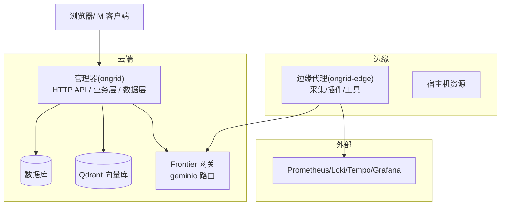
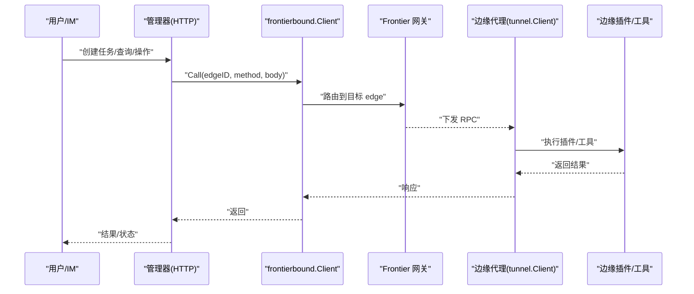
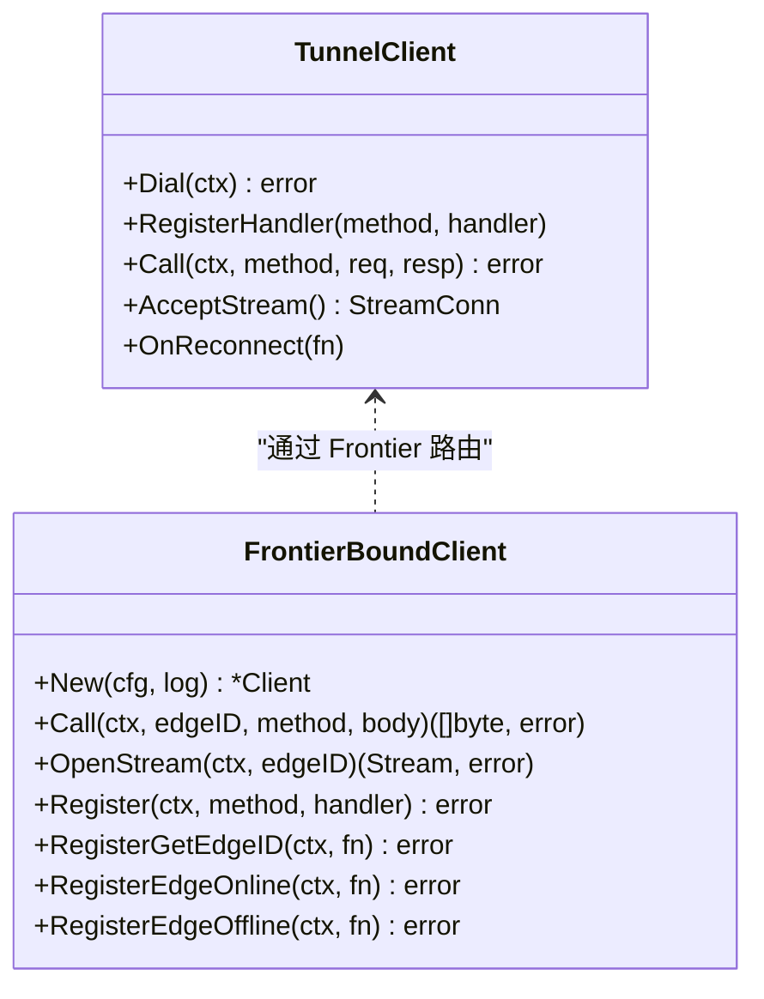
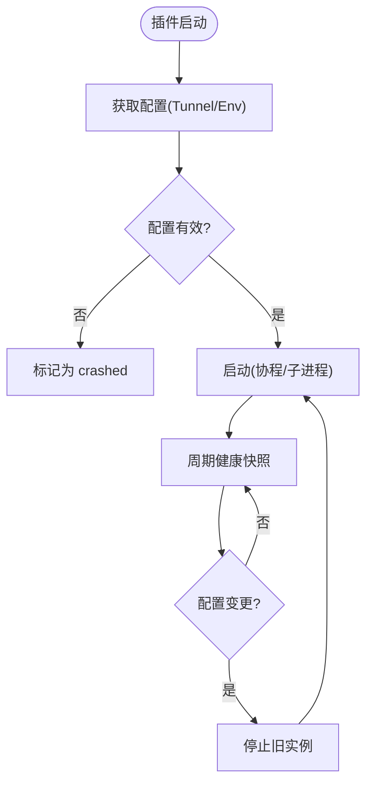
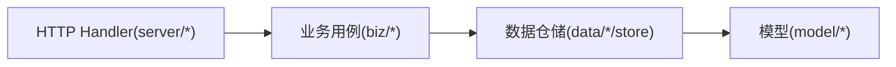
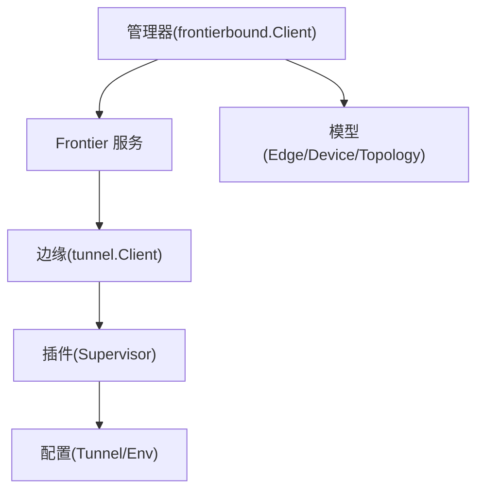
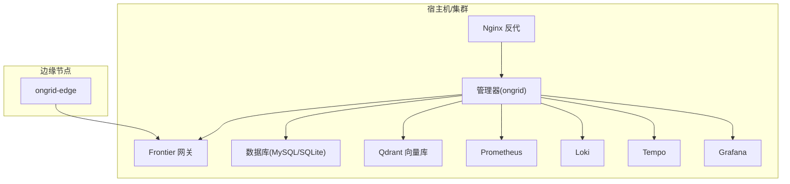

# 架构设计

<cite>
**本文引用的文件列表**
- [cmd/ongrid/main.go](file://cmd/ongrid/main.go)
- [cmd/ongrid-edge/main.go](file://cmd/ongrid-edge/main.go)
- [internal/pkg/tunnel/client.go](file://internal/pkg/tunnel/client.go)
- [internal/manager/service/frontierbound/client.go](file://internal/manager/service/frontierbound/client.go)
- [internal/edgeagent/plugins/plugin.go](file://internal/edgeagent/plugins/plugin.go)
- [internal/edgeagent/plugins/config_tunnel.go](file://internal/edgeagent/plugins/config_tunnel.go)
- [internal/skill/types.go](file://internal/skill/types.go)
- [internal/manager/biz/topology/repo.go](file://internal/manager/biz/topology/repo.go)
- [internal/manager/model/device/model.go](file://internal/manager/model/device/model.go)
- [deploy/docker-compose.yml](file://deploy/docker-compose.yml)
- [deploy/install.sh](file://deploy/install/install.sh)
- [api/README.md](file://api/README.md)
</cite>

## 目录
1. [引言](#引言)
2. [项目结构](#项目结构)
3. [核心组件](#核心组件)
4. [架构总览](#架构总览)
5. [详细组件分析](#详细组件分析)
6. [依赖关系分析](#依赖关系分析)
7. [性能与可扩展性](#性能与可扩展性)
8. [安全、监控与灾难恢复](#安全监控与灾难恢复)
9. [部署拓扑与基础设施要求](#部署拓扑与基础设施要求)
10. [分层架构实现（展示-业务-数据）](#分层架构实现展示-业务-数据)
11. [插件化架构与扩展机制](#插件化架构与扩展机制)
12. [系统边界与技术决策权衡](#系统边界与技术决策权衡)
13. [故障排查指南](#故障排查指南)
14. [结论](#结论)

## 引言
OnGrid 是一个面向运维的 AI Agent 平台，采用“云端管理器 + 边缘代理”的微服务架构。通过零入站端口策略，由边缘侧主动拨号至云端，结合 Prometheus/Loki/Tempo/Grafana 等可观测栈，提供指标、日志、链路追踪、拓扑、告警、自动调查与远程执行能力。本文从整体架构、通信机制、分层模式、插件化扩展、部署拓扑与安全横切关注点等方面进行全面说明。

## 项目结构
仓库采用 Go 后端 + TypeScript/React 前端的单体多模块组织：
- cmd: 进程入口（云端 ongrid、边缘 ongrid-edge）
- internal: 核心领域代码（IAM、Manager、EdgeAgent、共享包 pkg、Skill 框架）
- api: gRPC/Proto 定义（用于未来或跨语言集成）
- deploy: 安装脚本、Docker Compose、Nginx、Prometheus/Loki/Tempo/Grafana 配置
- web: 前端 SPA
- docs/repowiki: 文档与 Wiki 生成产物

图表来源
- [cmd/ongrid/main.go](file://cmd/ongrid/main.go)
- [cmd/ongrid-edge/main.go](file://cmd/ongrid-edge/main.go)
- [internal/pkg/tunnel/client.go](file://internal/pkg/tunnel/client.go)
- [internal/manager/service/frontierbound/client.go](file://internal/manager/service/frontierbound/client.go)

章节来源
- [cmd/ongrid/main.go](file://cmd/ongrid/main.go)
- [cmd/ongrid-edge/main.go](file://cmd/ongrid-edge/main.go)

## 核心组件
- 云端管理器（ongrid）
  - HTTP API 层：按领域划分 server/*，统一注册路由
  - 业务逻辑层：biz/* 包含用例编排、权限校验、流程控制
  - 数据持久化层：data/*/store 封装存储访问，model 定义实体
  - 与 Frontier 网关建立长连接，接收边缘回调并发起反向调用
- 边缘代理（ongrid-edge）
  - 通过 tunnel.Client 主动拨号到云端
  - 内置采集器与插件运行时，支持日志/指标/追踪/审计等能力
  - 暴露本地 /metrics 和 /healthz 调试端点
- 共享能力
  - Skill 框架：统一的设备侧能力注册与调度
  - 插件运行时：Supervisor 管理生命周期与健康上报
  - 隧道与网关适配：tunnel.Client 与 frontierbound.Client

章节来源
- [cmd/ongrid/main.go](file://cmd/ongrid/main.go)
- [cmd/ongrid-edge/main.go](file://cmd/ongrid-edge/main.go)
- [internal/skill/types.go](file://internal/skill/types.go)
- [internal/edgeagent/plugins/plugin.go](file://internal/edgeagent/plugins/plugin.go)

## 架构总览
OnGrid 采用“云端管理器 + 边缘代理”的双端微服务架构，通过 Frontier 网关进行双向通信。管理器负责用户界面、AI 编排、告警、知识、市场、工作流等；边缘代理负责数据采集、工具执行、插件运行与远程会话转发。

图表来源
- [internal/manager/service/frontierbound/client.go](file://internal/manager/service/frontierbound/client.go)
- [internal/pkg/tunnel/client.go](file://internal/pkg/tunnel/client.go)
- [cmd/ongrid/main.go](file://cmd/ongrid/main.go)
- [cmd/ongrid-edge/main.go](file://cmd/ongrid-edge/main.go)

## 详细组件分析

### 云端管理器（ongrid）
- 启动流程
  - 加载配置、初始化日志与 OpenTelemetry
  - 打开数据库并执行迁移
  - 初始化 IAM（用户、组织、成员、Casbin 授权）
  - 初始化 LLM 多提供商路由与设置项
  - 构建各业务域（设备、边缘、告警、拓扑、监控、报告、技能等）
  - 注册 HTTP 路由与中间件（鉴权、审计、指标）
  - 连接 Frontier 网关，注册边缘上线/下线回调与反向调用处理器
- 关键职责
  - 对外暴露 REST API（web、admin、aiops、prom、traces、logs 等）
  - 编排 AIOps 工作流（RCA、调查、审批、通知）
  - 管理插件配置推送与升级包分发
  - 维护拓扑图、知识库、市场、工作流等

章节来源
- [cmd/ongrid/main.go](file://cmd/ongrid/main.go)

### 边缘代理（ongrid-edge）
- 启动流程
  - 加载配置、初始化日志与指标
  - 建立 tunnel.Client 连接到云端
  - 根据 collector_mode 选择采集模式（off/auto/embedded/scrape）
  - 注册内置能力（host_files、restart_service、bash、webshell）
  - 启动插件 Supervisor，按配置拉取并管理插件子进程/协程
  - 暴露本地 /metrics 与 /healthz
- 关键职责
  - 周期性采集并推送指标
  - 执行云端下发的工具/技能
  - 为 WebSSH 提供字节流转发
  - 健康上报与热重载插件配置

章节来源
- [cmd/ongrid-edge/main.go](file://cmd/ongrid-edge/main.go)

### 通信与隧道
- 边缘侧
  - tunnel.Client 基于 geminio 实现，带指数退避重连、错误检测与 OnReconnect 钩子
  - 支持 TLS CA 认证与元数据携带（AccessKey/SecretKey）
- 云端侧
  - frontierbound.Client 对接 Frontier 服务，维护 transportID 与 edgeID 映射
  - 提供 Call/OpenStream/Register 等接口，屏蔽底层细节

图表来源
- [internal/pkg/tunnel/client.go](file://internal/pkg/tunnel/client.go)
- [internal/manager/service/frontierbound/client.go](file://internal/manager/service/frontierbound/client.go)

章节来源
- [internal/pkg/tunnel/client.go](file://internal/pkg/tunnel/client.go)
- [internal/manager/service/frontierbound/client.go](file://internal/manager/service/frontierbound/client.go)

### 插件化架构与扩展机制
- 插件接口
  - Plugin 定义 Name/Configure/Start/Stop/HealthSnapshot
  - Supervisor 统一管理生命周期、崩溃重启与健康快照上报
- 配置来源
  - TunnelConfigFetcher 通过隧道从管理器拉取 per-edge 配置
  - EnvConfigFetcher 作为离线回退，保证冷启动可用
- 内置插件
  - logs/traces/hostmetrics/procmetrics/custommetrics/databasemetrics/audit/metrics 等
- 能力框架（Skill）
  - 统一的元数据描述、参数 Schema、权限分级（safe/mutating/dangerous）、执行器（Executor）
  - 支持 ScopeHost（在边缘执行）与 ScopeManager（在云端执行）

图表来源
- [internal/edgeagent/plugins/plugin.go](file://internal/edgeagent/plugins/plugin.go)
- [internal/edgeagent/plugins/config_tunnel.go](file://internal/edgeagent/plugins/config_tunnel.go)
- [internal/skill/types.go](file://internal/skill/types.go)

章节来源
- [internal/edgeagent/plugins/plugin.go](file://internal/edgeagent/plugins/plugin.go)
- [internal/edgeagent/plugins/config_tunnel.go](file://internal/edgeagent/plugins/config_tunnel.go)
- [internal/skill/types.go](file://internal/skill/types.go)

### 分层架构实现（Presentation-Business-Data）
- 展示层（HTTP API）
  - manager/server/* 负责请求解析、DTO 转换、错误映射
  - 中间件注入鉴权、审计、指标
- 业务层（Use Case）
  - manager/biz/* 实现用例编排、规则校验、流程控制
  - 不直接访问 data 层，依赖接口抽象
- 数据层（Store/Repo）
  - manager/data/*/store 封装 SQL/ORM 访问
  - model 定义实体与表映射
- 示例：拓扑领域
  - biz/topology 提供过滤与 CRUD 规则
  - data/topology/store 提供节点/关系/类型仓储
  - model/topology 定义拓扑实体

图表来源
- [internal/manager/biz/topology/repo.go](file://internal/manager/biz/topology/repo.go)
- [internal/manager/model/device/model.go](file://internal/manager/model/device/model.go)

章节来源
- [internal/manager/biz/topology/repo.go](file://internal/manager/biz/topology/repo.go)
- [internal/manager/model/device/model.go](file://internal/manager/model/device/model.go)

## 依赖关系分析
- 管理器对 Frontier 的依赖
  - 通过 frontierbound.Client 调用边缘方法、注册回调、打开流
- 边缘对隧道的依赖
  - 通过 tunnel.Client 拨号、注册处理器、接受流
- 插件与配置
  - 插件通过 ConfigFetcher 获取配置，TunnelConfigFetcher 优先于 EnvConfigFetcher
- 模型与关系
  - EdgeDevice 表示 Edge 与 Device 的多对多关系，含唯一约束与软删除

图表来源
- [internal/manager/service/frontierbound/client.go](file://internal/manager/service/frontierbound/client.go)
- [internal/pkg/tunnel/client.go](file://internal/pkg/tunnel/client.go)
- [internal/edgeagent/plugins/config_tunnel.go](file://internal/edgeagent/plugins/config_tunnel.go)
- [internal/manager/model/device/model.go](file://internal/manager/model/device/model.go)

章节来源
- [internal/manager/service/frontierbound/client.go](file://internal/manager/service/frontierbound/client.go)
- [internal/pkg/tunnel/client.go](file://internal/pkg/tunnel/client.go)
- [internal/edgeagent/plugins/config_tunnel.go](file://internal/edgeagent/plugins/config_tunnel.go)
- [internal/manager/model/device/model.go](file://internal/manager/model/device/model.go)

## 性能与可扩展性
- 连接与重连
  - 边缘侧指数退避重连，避免雪崩；云端侧维护 ID 映射，避免标签污染
- 采集模式
  - off/auto/embedded/scrape 多种模式，默认 off 以配合子进程导出器直采
- 插件隔离
  - 子进程/协程隔离，崩溃不影响主进程；健康快照快速定位问题
- 水平扩展
  - 管理器无状态，可通过多副本+负载均衡扩展；Frontier 作为中心路由需高可用
- 存储与索引
  - 数据库分库分表策略需结合规模规划；Qdrant 用于向量检索，注意容量与分区

[本节为通用指导，无需具体文件引用]

## 安全、监控与灾难恢复
- 安全
  - JWT 鉴权与 Casbin RBAC；边缘 AccessKey/SecretKey 认证；可选 TLS CA
  - 敏感配置通过 system_settings 加密存储与动态刷新
- 监控
  - 管理器与边缘均暴露 /metrics；OpenTelemetry 上报至 Tempo
  - Grafana 面板同步与仪表盘镜像
- 审计与合规
  - 审计日志追加式记录，保留期可配；Skill 权限分级与审批流程
- 灾难恢复
  - 启动时修复“僵尸在线”边缘与孤儿调查任务
  - 插件配置双源（Tunnel/Env），断网仍可降级运行

章节来源
- [cmd/ongrid/main.go](file://cmd/ongrid/main.go)
- [cmd/ongrid-edge/main.go](file://cmd/ongrid-edge/main.go)

## 部署拓扑与基础设施要求
- 容器编排
  - docker-compose 一键拉起管理器、Frontier、Grafana/Prometheus/Loki/Tempo/Qdrant 等
- 安装脚本
  - install.sh 提供 systemd 服务、依赖安装与环境变量模板
- 前置条件
  - Linux 发行版（Ubuntu/Debian/RHEL 系列）
  - 外网可达（边缘主动拨号），必要端口开放（Frontier 监听地址）
  - 可选：TLS CA 证书、外部数据库、向量库

图表来源
- [deploy/docker-compose.yml](file://deploy/docker-compose.yml)
- [deploy/install/install.sh](file://deploy/install/install.sh)

章节来源
- [deploy/docker-compose.yml](file://deploy/docker-compose.yml)
- [deploy/install/install.sh](file://deploy/install/install.sh)

## 分层架构实现（展示-业务-数据）
- 展示层
  - HTTP 路由集中在 manager/server/*，统一中间件处理
  - 前端通过 REST API 交互，部分流式场景使用 WebSocket/Stream
- 业务层
  - biz/* 实现用例，组合多个仓储与外部服务（LLM、Prom、Grafana、IM 桥接）
  - 权限与审计在业务层统一接入
- 数据层
  - data/*/store 提供仓储接口，model/* 定义实体与迁移
  - dbx 封装迁移与软删除等通用能力

章节来源
- [cmd/ongrid/main.go](file://cmd/ongrid/main.go)

## 插件化架构与扩展机制
- 插件接口与生命周期
  - Configure/Start/Stop/HealthSnapshot，Supervisor 驱动
- 配置拉取与回退
  - TunnelConfigFetcher 优先，EnvConfigFetcher 兜底
- 能力框架（Skill）
  - 元数据驱动注册，自动生成 UI 表单与 LLM 工具描述
  - 权限分级与执行范围（宿主/云端）

章节来源
- [internal/edgeagent/plugins/plugin.go](file://internal/edgeagent/plugins/plugin.go)
- [internal/edgeagent/plugins/config_tunnel.go](file://internal/edgeagent/plugins/config_tunnel.go)
- [internal/skill/types.go](file://internal/skill/types.go)

## 系统边界与技术决策权衡
- 系统边界
  - 管理器：API 聚合、编排、持久化、AI 能力
  - 边缘：采集、执行、插件、会话转发
  - Frontier：服务发现与消息路由
  - 外部：可观测栈、IM 渠道、LLM 提供商
- 技术决策
  - 零入站端口：边缘主动拨号，降低暴露面
  - 插件化：能力解耦，独立生命周期与配置
  - Skill 框架：统一元数据驱动，减少重复代码
  - 多提供商 LLM：路由与缓存，灵活切换
- 权衡考虑
  - 复杂度 vs 可维护性：分层与插件化提升可维护性但增加学习成本
  - 实时性 vs 可靠性：隧道重连与回退保障可用性，可能引入延迟
  - 集中式路由 vs 去中心化：Frontier 简化路由但成为单点，需高可用

[本节为概念性总结，无需具体文件引用]

## 故障排查指南
- 连接问题
  - 检查边缘 CloudAddr/TLS CA/密钥；查看隧道重连日志
- 插件异常
  - 查看插件健康快照与 LastError；确认配置来源（Tunnel/Env）
- 指标缺失
  - 确认采集模式与导出器端口；检查 Manager 侧 Prom/Loki/Tempo 配置
- 权限与鉴权
  - 验证 JWT Secret 与 Casbin 策略；检查审计日志

章节来源
- [internal/pkg/tunnel/client.go](file://internal/pkg/tunnel/client.go)
- [internal/edgeagent/plugins/plugin.go](file://internal/edgeagent/plugins/plugin.go)
- [cmd/ongrid/main.go](file://cmd/ongrid/main.go)

## 结论
OnGrid 通过清晰的云端-边缘分层、插件化与 Skill 框架，实现了高内聚低耦合的可扩展架构。借助 Frontier 网关与隧道机制，系统在安全性与可观测性方面具备良好基础。建议在大规模部署中关注 Frontier 的高可用、数据库与向量库的容量规划，以及插件与技能的治理与审计。