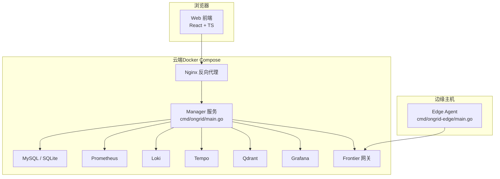
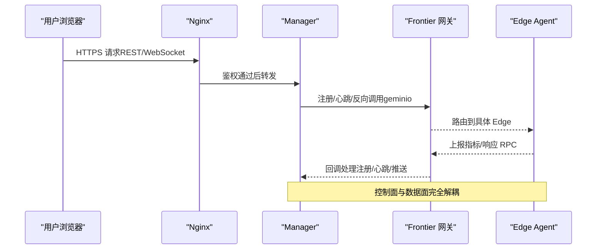
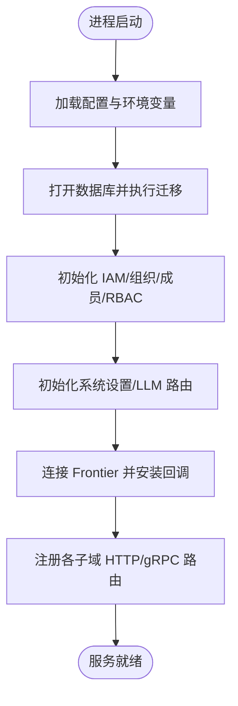
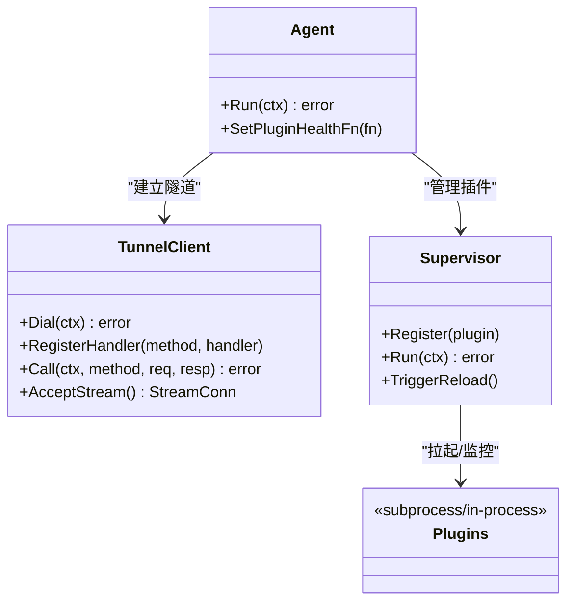
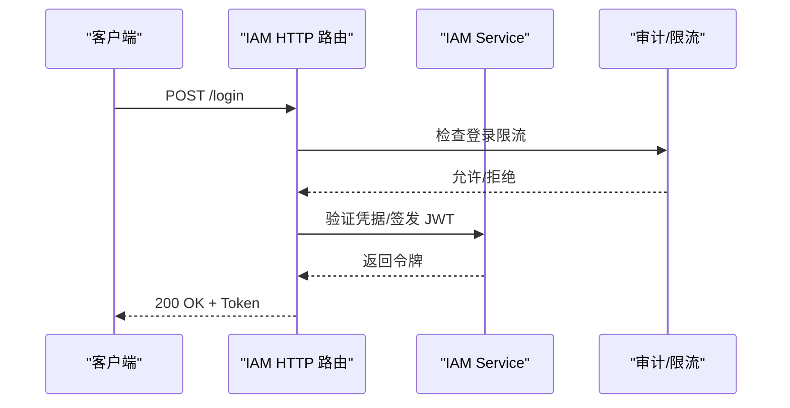
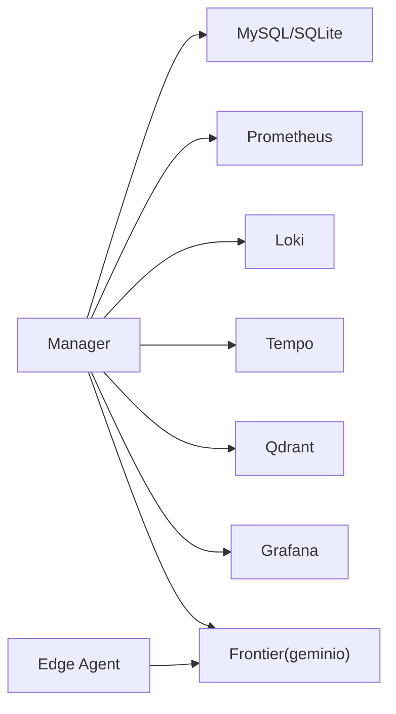

# 系统概览

<cite>
**本文引用的文件**
- [cmd/ongrid/main.go](file://cmd/ongrid/main.go)
- [cmd/ongrid-edge/main.go](file://cmd/ongrid-edge/main.go)
- [internal/pkg/config/config.go](file://internal/pkg/config/config.go)
- [deploy/docker-compose.yml](file://deploy/docker-compose.yml)
- [internal/pkg/tunnel/client.go](file://internal/pkg/tunnel/client.go)
- [internal/manager/service/frontierbound/client.go](file://internal/manager/service/frontierbound/client.go)
- [internal/iam/server/http.go](file://internal/iam/server/http.go)
- [web/src/api/devices.ts](file://web/src/api/devices.ts)
- [web/src/pages/Edges.tsx](file://web/src/pages/Edges.tsx)
</cite>

## 目录
1. [简介](#简介)
2. [项目结构](#项目结构)
3. [核心组件](#核心组件)
4. [架构总览](#架构总览)
5. [详细组件分析](#详细组件分析)
6. [依赖关系分析](#依赖关系分析)
7. [性能与可扩展性](#性能与可扩展性)
8. [故障排查指南](#故障排查指南)
9. [结论](#结论)
10. [附录：技术栈与版本兼容](#附录技术栈与版本兼容)

## 简介
OnGrid 是一个面向运维的 AI Agent 平台，采用“云端管理器 + 边缘代理”的分层架构。控制面（Manager）负责编排、策略、鉴权与可观测性集成；数据面（Edge Agent）负责采集、执行与上报。通过零入站端口设计，边缘侧主动拨号至云端，避免在目标主机暴露 SSH/HTTP 等端口，提升安全性与部署便捷性。

## 项目结构
- 后端服务（Go）
  - 云端管理器入口：cmd/ongrid/main.go
  - 边缘代理入口：cmd/ongrid-edge/main.go
  - 配置加载：internal/pkg/config/config.go
  - 隧道客户端（边缘侧）：internal/pkg/tunnel/client.go
  - 管理器到边缘的调用封装：internal/manager/service/frontierbound/client.go
  - IAM 服务 HTTP 路由与中间件：internal/iam/server/http.go
- 前端（React + TypeScript）
  - API 封装与页面：web/src/api/*.ts, web/src/pages/*.tsx
- 部署编排
  - 本地开发 compose：deploy/docker-compose.yml

图表来源
- [deploy/docker-compose.yml:1-397](file://deploy/docker-compose.yml#L1-L397)
- [cmd/ongrid/main.go:1-200](file://cmd/ongrid/main.go#L1-L200)
- [cmd/ongrid-edge/main.go:1-120](file://cmd/ongrid-edge/main.go#L1-L120)

章节来源
- [deploy/docker-compose.yml:1-397](file://deploy/docker-compose.yml#L1-L397)
- [cmd/ongrid/main.go:1-200](file://cmd/ongrid/main.go#L1-L200)
- [cmd/ongrid-edge/main.go:1-120](file://cmd/ongrid-edge/main.go#L1-L120)

## 核心组件
- Manager 服务（控制面）
  - 职责边界：用户与组织管理（IAM）、设备与边缘生命周期、告警与 RCA、AI 工作流编排、插件与技能注册、遥测写入（Prom/Loki/Tempo）、WebShell 与远程执行编排、系统设置与密钥管理。
  - 关键实现：主进程组装各子域 biz/data/model/server/service，初始化数据库迁移、LLM 多提供商路由、Frontier 长连接、OpenTelemetry 追踪、审计日志与通知通道。
- Edge Agent（数据面）
  - 职责边界：建立到云端的隧道、周期性采集指标、提供工具 RPC（主机信息、进程列表、文件浏览、重启服务等）、插件运行时（日志/追踪/自定义指标/数据库导出器）。
  - 关键实现：tunnel.Client 自动重连、插件 Supervisor 管理子进程、按模式选择采集路径（off/auto/embedded/scrape）。
- IAM 系统
  - 职责边界：用户、组织、成员关系、RBAC（Casbin）、登录限流与审计。
  - 关键实现：HTTP 路由、登录失败速率限制、租户上下文注入。
- 前端（SPA）
  - 职责边界：控制台 UI、API 封装、状态管理、国际化。
  - 通信协议：HTTPS + JSON REST（经 Nginx 反代），WebSocket 用于 WebShell 流式交互。

章节来源
- [cmd/ongrid/main.go:180-220](file://cmd/ongrid/main.go#L180-L220)
- [cmd/ongrid-edge/main.go:56-120](file://cmd/ongrid-edge/main.go#L56-L120)
- [internal/iam/server/http.go:1-41](file://internal/iam/server/http.go#L1-L41)
- [web/src/api/devices.ts:34-54](file://web/src/api/devices.ts#L34-L54)
- [web/src/pages/Edges.tsx:1-34](file://web/src/pages/Edges.tsx#L1-L34)

## 架构总览
- 控制面与数据面分离
  - 控制面（Manager）不直接监听目标主机端口，所有对边缘的访问均通过 Frontier 网关进行反向调用或流转发。
  - 数据面（Edge Agent）仅出站连接，保持“零入站端口”。
- 微服务化与分层
  - Manager 内部按领域划分 biz/data/model/server/service 五层，跨域通过 proto 接口或事件解耦。
  - 共享能力下沉至 internal/pkg（配置、认证、日志、追踪、Prom/Loki/Tempo 客户端等）。
- 前后端分离
  - 前端静态资源由 Nginx 托管，API 请求经 Nginx auth_request 校验后反代至 Manager。
  - 实时交互（如 WebShell）使用 WebSocket 经由 Manager 建立到 Edge 的流通道。

图表来源
- [cmd/ongrid/main.go:865-900](file://cmd/ongrid/main.go#L865-L900)
- [internal/manager/service/frontierbound/client.go:60-90](file://internal/manager/service/frontierbound/client.go#L60-L90)
- [internal/pkg/tunnel/client.go:62-141](file://internal/pkg/tunnel/client.go#L62-L141)
- [deploy/docker-compose.yml:206-218](file://deploy/docker-compose.yml#L206-L218)

## 详细组件分析

### Manager 服务（控制面）
- 启动流程要点
  - 加载配置、初始化日志与追踪、打开数据库并执行迁移。
  - 初始化 IAM（用户/组织/成员/Casbin）、审计、系统设置、LLM 多提供商路由。
  - 建立 Frontier 长连接，安装边缘生命周期回调与反向调用处理器。
  - 注册各子域 HTTP/gRPC 路由与中间件（鉴权、RBAC、租户上下文）。
- 关键能力
  - 设备与边缘管理、告警评估与 RCA、AI 工作流编排、插件与技能注册、遥测写入（Prom/Loki/Tempo）、WebShell 与远程执行编排。
- 错误与健壮性
  - 启动时回填“陈旧在线”的边缘状态、失败或中断的调查任务。
  - Frontier 连接 warmup 保护，避免首次 edge 注册成功但后续方法未注册的竞态。

图表来源
- [cmd/ongrid/main.go:195-276](file://cmd/ongrid/main.go#L195-L276)
- [cmd/ongrid/main.go:865-900](file://cmd/ongrid/main.go#L865-L900)
- [cmd/ongrid/main.go:1189-1223](file://cmd/ongrid/main.go#L1189-L1223)

章节来源
- [cmd/ongrid/main.go:195-276](file://cmd/ongrid/main.go#L195-L276)
- [cmd/ongrid/main.go:865-900](file://cmd/ongrid/main.go#L865-L900)
- [cmd/ongrid/main.go:1189-1223](file://cmd/ongrid/main.go#L1189-L1223)

### Edge Agent（数据面）
- 启动流程要点
  - 解析配置、创建 tunnel.Client 并 Dial（指数退避、TLS CA 可选）。
  - 根据 CollectorMode 构建采集器（off/auto/embedded/scrape）。
  - 注册内置能力（host_files、restart_service、bash、WebShell）。
  - 启动插件 Supervisor，按配置拉取并管理子进程（日志/追踪/指标/数据库导出器等）。
- 关键能力
  - 指标采集与推送、工具 RPC、插件热重载、健康快照上报。
- 错误与健壮性
  - 连接丢失自动重连；插件注册失败降级运行；升级阶段目录与任务名支持。

图表来源
- [internal/pkg/tunnel/client.go:27-141](file://internal/pkg/tunnel/client.go#L27-L141)
- [cmd/ongrid-edge/main.go:56-120](file://cmd/ongrid-edge/main.go#L56-L120)
- [cmd/ongrid-edge/main.go:199-305](file://cmd/ongrid-edge/main.go#L199-L305)

章节来源
- [cmd/ongrid-edge/main.go:56-120](file://cmd/ongrid-edge/main.go#L56-L120)
- [cmd/ongrid-edge/main.go:199-305](file://cmd/ongrid-edge/main.go#L199-L305)
- [internal/pkg/tunnel/client.go:27-141](file://internal/pkg/tunnel/client.go#L27-L141)

### IAM 系统
- 职责边界
  - 用户/组织/成员管理、RBAC（Casbin）、登录限流、审计记录。
- 关键实现
  - HTTP 路由与中间件链、登录失败按 IP/邮箱窗口计数、租户上下文注入。

图表来源
- [internal/iam/server/http.go:1-41](file://internal/iam/server/http.go#L1-L41)

章节来源
- [internal/iam/server/http.go:1-41](file://internal/iam/server/http.go#L1-L41)

### 前端与通信协议
- 前后端分离
  - 前端静态资源由 Nginx 托管，API 请求经 Nginx auth_request 校验后反代至 Manager。
  - 页面通过 web/src/api/*.ts 封装 REST 调用，状态管理位于 store。
- 通信协议
  - REST/JSON：常规业务接口
  - WebSocket：WebShell 双向流
  - gRPC/geminio：Manager ↔ Frontier ↔ Edge 控制面与数据面通道

章节来源
- [web/src/api/devices.ts:34-54](file://web/src/api/devices.ts#L34-L54)
- [web/src/pages/Edges.tsx:1-34](file://web/src/pages/Edges.tsx#L1-L34)

## 依赖关系分析
- 组件耦合与内聚
  - Manager 内部按领域分层，跨域通过 proto 或 pkg 共享，降低循环依赖风险。
  - Edge Agent 与 Manager 通过 Frontier 解耦，避免直连。
- 外部依赖
  - 数据库：MySQL（默认）/SQLite（可选）
  - 时序/日志/链路：Prometheus/Loki/Tempo
  - 向量检索：Qdrant
  - 可视化：Grafana
  - 网关：singchia/frontier（geminio）

图表来源
- [deploy/docker-compose.yml:14-397](file://deploy/docker-compose.yml#L14-L397)
- [internal/manager/service/frontierbound/client.go:60-90](file://internal/manager/service/frontierbound/client.go#L60-L90)
- [internal/pkg/tunnel/client.go:62-141](file://internal/pkg/tunnel/client.go#L62-L141)

章节来源
- [deploy/docker-compose.yml:14-397](file://deploy/docker-compose.yml#L14-L397)

## 性能与可扩展性
- 采集路径优化
  - Edge 支持 off/auto/embedded/scrape 多种模式，默认 off 以避免重复样本，配合 Prometheus 直接抓取 node_exporter/process-exporter。
- 连接与重试
  - Edge 侧 Dial 指数退避（最大 60s），Manager 侧 Frontier 连接 warmup 保护，减少首次注册后的路由可见性竞态。
- 可观测性
  - OpenTelemetry 全链路追踪，Prometheus 自监控指标，Grafana 统一展示。
- 扩展点
  - 插件体系（日志/追踪/指标/数据库导出器）以子进程方式隔离，Supervisor 统一管理。
  - LLM 多提供商路由，支持动态切换与模型列表。

[本节为通用指导，无需源码引用]

## 故障排查指南
- 常见症状与定位
  - Edge 无法连接：检查 CloudAddr/AccessKey/SecretKey 与网络连通性；查看指数退避日志。
  - Manager 无法接收边端数据：确认 Frontier 服务可用、warmup 时间是否足够、edge 注册回调是否生效。
  - 登录失败频繁：查看 IAM 登录限流计数器与审计日志。
  - 插件异常：查看 Supervisor 健康快照与 last_error。
- 快速自检
  - Edge /healthz 与 /metrics 本地端口可达性
  - Manager /metrics 与 OpenTelemetry 上报
  - Frontier 容器健康与端口映射

章节来源
- [internal/pkg/tunnel/client.go:62-141](file://internal/pkg/tunnel/client.go#L62-L141)
- [cmd/ongrid/main.go:1189-1223](file://cmd/ongrid/main.go#L1189-L1223)
- [internal/iam/server/http.go:1-41](file://internal/iam/server/http.go#L1-L41)
- [cmd/ongrid-edge/main.go:169-177](file://cmd/ongrid-edge/main.go#L169-L177)

## 结论
OnGrid 通过清晰的“控制面/数据面”分离、基于 Frontier 的无入站端口设计与完善的可观测性体系，实现了高安全、易部署、可扩展的运维 AI 平台。Manager 作为编排中枢，Edge 作为轻量探针与执行器，二者通过稳定可靠的隧道与插件生态协同工作，满足从日常巡检到自动化排障的多场景需求。

[本节为总结，无需源码引用]

## 附录：技术栈与版本兼容
- 后端
  - Go（参考 go.mod 与 README 中的版本标识）
  - MySQL 8.0（默认）/ SQLite（可选）
  - singchia/frontier（geminio）
  - OpenTelemetry、Prometheus、Loki、Tempo、Qdrant、Grafana
- 前端
  - React 18 + TypeScript + Vite + Tailwind CSS
- 部署
  - Docker Compose（本地开发）；生产建议参考 deploy/install 脚本与 systemd 单元
- 版本兼容性
  - 参考仓库根目录 README 与 .tool-versions 中声明的版本约束

章节来源
- [README.md:1-96](file://README.md#L1-L96)
- [deploy/docker-compose.yml:14-397](file://deploy/docker-compose.yml#L14-L397)
- [internal/pkg/config/config.go:369-486](file://internal/pkg/config/config.go#L369-L486)