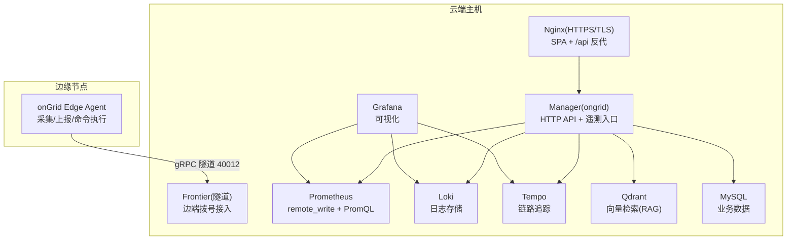
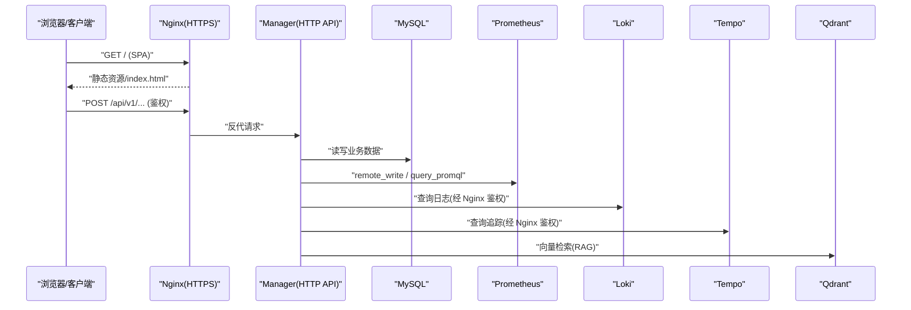
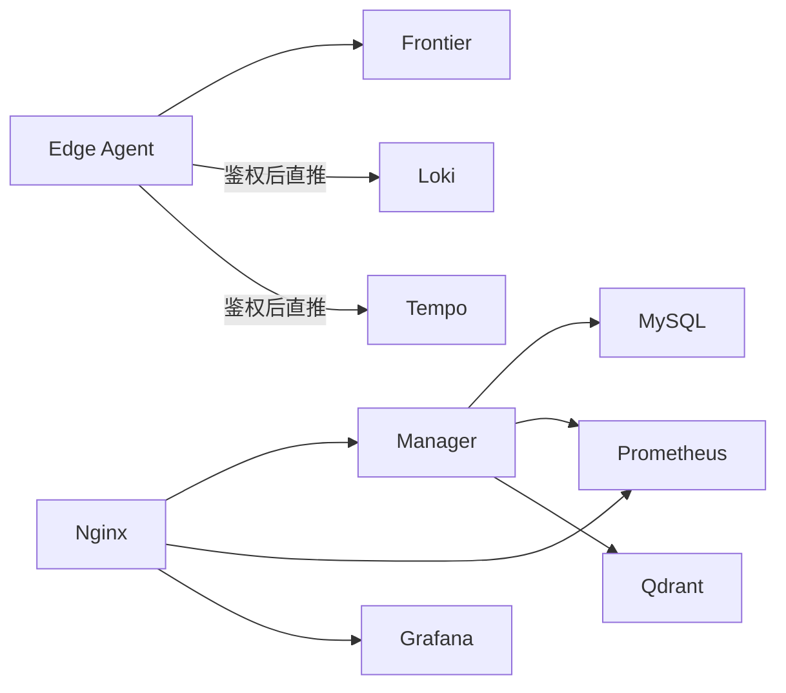

# 部署拓扑

<cite>
**本文引用的文件**   
- [deploy/README.md](file://deploy/README.md)
- [deploy/docker-compose.yml](file://deploy/docker-compose.yml)
- [deploy/install/docker-compose.yml](file://deploy/install/docker-compose.yml)
- [deploy/Dockerfile.ongrid](file://deploy/Dockerfile.ongrid)
- [deploy/Dockerfile.ongrid-edge](file://deploy/Dockerfile.ongrid-edge)
- [deploy/Dockerfile.frontier](file://deploy/Dockerfile.frontier)
- [deploy/Dockerfile.web](file://deploy/Dockerfile.web)
- [deploy/install/install.sh](file://deploy/install/install.sh)
- [deploy/install/README.md](file://deploy/install/README.md)
- [deploy/install/systemd/install-systemd.sh](file://deploy/install/systemd/install-systemd.sh)
- [deploy/install/nginx.conf](file://deploy/install/nginx.conf)
- [deploy/install/prometheus.yml](file://deploy/install/prometheus.yml)
- [deploy/install/loki-config.yaml](file://deploy/install/loki-config.yaml)
- [deploy/install/tempo-config.yaml](file://deploy/install/tempo-config.yaml)
- [deploy/install/grafana/provisioning/datasources/prometheus.yml](file://deploy/install/grafana/provisioning/datasources/prometheus.yml)
- [deploy/install/grafana/provisioning/datasources/loki.yml](file://deploy/install/grafana/provisioning/datasources/loki.yml)
</cite>

## 目录
1. [简介](#简介)
2. [项目结构](#项目结构)
3. [核心组件](#核心组件)
4. [架构总览](#架构总览)
5. [详细组件分析](#详细组件分析)
6. [依赖关系分析](#依赖关系分析)
7. [性能与高可用](#性能与高可用)
8. [网络与安全拓扑](#网络与安全拓扑)
9. [故障排查指南](#故障排查指南)
10. [结论](#结论)
11. [附录：部署模板与最佳实践](#附录部署模板与最佳实践)

## 简介
本文件面向生产环境，系统化阐述 OnGrid 的部署拓扑与容器化方案，覆盖云端集群与边缘节点分布、镜像构建与编排、负载均衡与容灾策略、网络与安全配置，并提供不同规模环境的部署模板与最佳实践建议。文档以仓库内实际交付物为依据，确保可落地执行。

## 项目结构
OnGrid 的生产级部署资产集中在 deploy 目录：
- 开发用 docker-compose（本地调试）位于 deploy/docker-compose.yml
- 生产风格安装包与脚本位于 deploy/install/
- 各服务 Dockerfile 位于 deploy/ 根目录
- Nginx 反向代理与 TLS 终止配置位于 deploy/install/nginx.conf
- Prometheus/Loki/Tempo/Grafana 等观测栈配置文件位于 deploy/install/ 对应子目录

图示来源
- [deploy/install/docker-compose.yml](file://deploy/install/docker-compose.yml)
- [deploy/install/nginx.conf](file://deploy/install/nginx.conf)
- [deploy/install/prometheus.yml](file://deploy/install/prometheus.yml)
- [deploy/install/loki-config.yaml](file://deploy/install/loki-config.yaml)
- [deploy/install/tempo-config.yaml](file://deploy/install/tempo-config.yaml)

章节来源
- [deploy/README.md:1-130](file://deploy/README.md#L1-L130)
- [deploy/install/README.md:1-616](file://deploy/install/README.md#L1-L616)

## 核心组件
- Manager（云管服务）
  - 提供 HTTP API、鉴权、设备/边缘管理、AI 能力、遥测聚合、RAG 知识库等
  - 通过环境变量驱动数据库、LLM、Prometheus/Loki/Tempo/qdrant 等集成
- Frontier（隧道网关）
  - 负责边缘节点拨号入站（默认端口 40012），内部服务端口 40011 仅容器网可达
- Nginx（统一入口）
  - HTTPS 终止、静态 SPA 托管、/api 反代到 Manager、对 Loki/Tempo 数据面进行鉴权转发
- 观测与存储
  - MySQL：业务数据
  - Prometheus：接收 remote_write、暴露 PromQL 给 AI 工具
  - Loki：日志后端
  - Tempo：链路追踪后端
  - Qdrant：向量库（本地 ONNX 嵌入或外部 OpenAI 兼容接口）
  - Grafana：可视化与仪表盘
- Edge Agent（边缘节点）
  - 纯 Go 静态二进制，拨号连接云端 Frontier，不监听入站（除本地 /metrics）

章节来源
- [deploy/Dockerfile.ongrid:1-231](file://deploy/Dockerfile.ongrid#L1-L231)
- [deploy/Dockerfile.ongrid-edge:1-71](file://deploy/Dockerfile.ongrid-edge#L1-L71)
- [deploy/Dockerfile.frontier:1-52](file://deploy/Dockerfile.frontier#L1-L52)
- [deploy/Dockerfile.web:1-79](file://deploy/Dockerfile.web#L1-L79)
- [deploy/install/docker-compose.yml:1-610](file://deploy/install/docker-compose.yml#L1-L610)

## 架构总览
生产形态采用“单主机多容器”或“多主机分片”两种模式：
- 单主机：Manager/Nginx/Frontier/MySQL/Prom/Loki/Tempo/Qdrant/Grafana 全部在同一台宿主机上运行，适合中小规模
- 多主机：将 MySQL/Prom/Loki/Tempo/Qdrant 外置为托管服务，Manager/Nginx/Frontier 集中部署；Edge 广泛分布于各机房/站点

图示来源
- [deploy/install/nginx.conf:1-284](file://deploy/install/nginx.conf#L1-L284)
- [deploy/install/docker-compose.yml:1-610](file://deploy/install/docker-compose.yml#L1-L610)

## 详细组件分析

### 容器镜像与构建
- ongrid（Manager）
  - 多阶段构建：Go builder + debian:bookworm-slim 运行时
  - CGO 启用以支持本地 ONNX 嵌入器；ONNX Runtime 动态库随镜像分发
  - 非 root 用户运行，暴露 8080(HTTP)、9100(/metrics)
- ongrid-edge（边缘代理）
  - 纯 Go 静态编译，distroless 运行时，仅暴露本地 9101(/metrics)
- frontier（隧道）
  - 独立镜像，对外暴露 40012（边端拨号）、40011（内部服务）
- web（Nginx + SPA）
  - Node 构建前端产物，nginx:alpine 作为运行时，证书与 nginx.conf 通过 bind-mount 注入

章节来源
- [deploy/Dockerfile.ongrid:1-231](file://deploy/Dockerfile.ongrid#L1-L231)
- [deploy/Dockerfile.ongrid-edge:1-71](file://deploy/Dockerfile.ongrid-edge#L1-L71)
- [deploy/Dockerfile.frontier:1-52](file://deploy/Dockerfile.frontier#L1-L52)
- [deploy/Dockerfile.web:1-79](file://deploy/Dockerfile.web#L1-L79)

### 编排与服务发现
- 开发编排（deploy/docker-compose.yml）
  - 使用 bridge 网络 ongrid_net，服务间通过容器名互通
  - MySQL 健康检查后启动 ongrid；frontier 暴露 40012 供 edge 拨号
- 生产编排（deploy/install/docker-compose.yml）
  - 所有有状态数据 bind-mount 至宿主 ${ONGRID_DATA_DIR}，便于备份与迁移
  - 仅暴露必要端口：443/80(Nginx)、40012(Frontier)、9100(Metrics)
  - 通过 .env 注入密钥与地址，避免硬编码

章节来源
- [deploy/docker-compose.yml:1-397](file://deploy/docker-compose.yml#L1-L397)
- [deploy/install/docker-compose.yml:1-610](file://deploy/install/docker-compose.yml#L1-L610)

### 安装与升级流程
- install.sh
  - 自动检测 Docker/Compose、可选 CN 镜像源、生成自签证书、创建目录并 chown、拷贝配置、加载镜像、拉起服务、轮询 healthz
  - 自动探测宿主机代理并写入 .env，收集内部域名加入 NO_PROXY
- upgrade.sh
  - 要求先 cp 已安装的 .env 到升级包目录，按优先级解析路径变量，安全回滚友好
- systemd 模式
  - 通过 install-systemd.sh 安装原生 systemd 单元，适配 FHS 或折叠布局

章节来源
- [deploy/install/install.sh:1-800](file://deploy/install/install.sh#L1-L800)
- [deploy/install/README.md:261-314](file://deploy/install/README.md#L261-L314)
- [deploy/install/systemd/install-systemd.sh:1-477](file://deploy/install/systemd/install-systemd.sh#L1-L477)

### 反向代理与鉴权
- Nginx 职责
  - HTTPS 终止、SPA 静态资源、/api 反代到 Manager
  - /prometheus/ 与 /grafana/ 复用 Manager 会话鉴权
  - /loki/api/v1/push 与 /v1/traces 走 auth_request 校验 edge 凭据，直接透传到 Loki/Tempo
  - 对数据面做 per-edge 限流
- 关键路径
  - /api/* → Manager
  - /healthz /readyz → Manager
  - /prometheus/* → Prometheus（需鉴权）
  - /grafana/* → Grafana（需鉴权）
  - /loki/api/v1/push → Loki（edgeauth 鉴权）
  - /v1/traces → Tempo（edgeauth 鉴权）
  - /install.sh, /uninstall.sh, /edge/* → 静态资源（无鉴权）

章节来源
- [deploy/install/nginx.conf:1-284](file://deploy/install/nginx.conf#L1-L284)

### 观测与告警
- Prometheus
  - 接收 Manager remote_write，暴露 PromQL 给 AI 工具
  - 规则文件 rules.yml 热重载
- Loki
  - 单节点文件系统后端，保留期 30 天，限制 cardinality 与速率
- Tempo
  - OTLP gRPC/HTTP 接收，spanmetrics/service-graph 写回 Prometheus
- Grafana
  - 预置 Prometheus/Loki 数据源与服务器详情仪表盘

章节来源
- [deploy/install/prometheus.yml:1-36](file://deploy/install/prometheus.yml#L1-L36)
- [deploy/install/loki-config.yaml:1-67](file://deploy/install/loki-config.yaml#L1-L67)
- [deploy/install/tempo-config.yaml:1-78](file://deploy/install/tempo-config.yaml#L1-L78)
- [deploy/install/grafana/provisioning/datasources/prometheus.yml:1-11](file://deploy/install/grafana/provisioning/datasources/prometheus.yml#L1-L11)
- [deploy/install/grafana/provisioning/datasources/loki.yml:1-21](file://deploy/install/grafana/provisioning/datasources/loki.yml#L1-L21)

### 数据与持久化
- 统一安装目录
  - /opt/ongrid/{ongrid,ongrid-web,data,logs}，四子目录职责清晰
- 数据卷
  - v0.7.45+ 改为 bind-mount 到宿主，便于备份与迁移
  - 提供自动/手动迁移脚本，兼容旧 named volume
- 备份策略
  - MySQL 热备、Prom TSDB 快照、Loki/Tempo/qdrant 目录归档

章节来源
- [deploy/install/README.md:125-198](file://deploy/install/README.md#L125-L198)
- [deploy/install/README.md:368-444](file://deploy/install/README.md#L368-L444)

## 依赖关系分析
- 服务间依赖
  - ongrid 依赖 mysql 健康检查通过后启动
  - prometheus 被 manager remote_write 推送，manager 通过 PromQL 查询
  - loki/tempo 由 edge 侧插件经 Nginx 鉴权后直推
  - grafana 依赖 prometheus/loki/tempo 数据源
- 外部依赖
  - LLM 提供商（OpenAI/Zhipu/Anthropic/Gemini/DeepSeek/Kimi 等）
  - 可选外部观测栈（Prom/Loki/Tempo/Grafana/qdrant）

图示来源
- [deploy/install/docker-compose.yml:1-610](file://deploy/install/docker-compose.yml#L1-L610)
- [deploy/install/nginx.conf:1-284](file://deploy/install/nginx.conf#L1-L284)

章节来源
- [deploy/install/docker-compose.yml:1-610](file://deploy/install/docker-compose.yml#L1-L610)

## 性能与高可用
- 性能要点
  - Nginx 关闭缓冲以支持长连接与 SSE 流式输出
  - Prometheus 开启 remote_write 接收与生命周期管理
  - Loki/Tempo 设置合理的 retention 与速率限制，防止 OOM
  - Manager 绑定非 root 用户，减少攻击面
- 高可用设计
  - 当前安装包为单主机形态；若需 HA，可将 MySQL/Prom/Loki/Tempo/qdrant 外置为托管集群
  - 通过 Nginx 前置实现多实例 Manager 的负载均衡（需共享同一数据库与对象存储）
  - 数据备份与快照策略见“数据与持久化”小节

[本节为通用指导，不直接分析具体文件]

## 网络与安全拓扑
- 端口规划
  - 443/80：Nginx（HTTPS/HTTP 重定向）
  - 40012：Frontier（Edge 拨号）
  - 9100：Manager /metrics（仅本机 Prometheus 抓取）
- 防火墙与安全组
  - 仅开放 443/80/40012 到公网；其余端口仅限内网
- 域名与证书
  - 安装时自动生成自签证书，生产替换为正式证书
  - 通过 DNS 指向单一入口，统一鉴权
- 代理与 NO_PROXY
  - 自动探测宿主机代理并写入 .env
  - 自动收集 /etc/hosts、resolv.conf、hostname 等内部域名加入 NO_PROXY

章节来源
- [deploy/install/install.sh:125-297](file://deploy/install/install.sh#L125-L297)
- [deploy/install/README.md:72-124](file://deploy/install/README.md#L72-L124)
- [deploy/install/README.md:477-491](file://deploy/install/README.md#L477-L491)

## 故障排查指南
- 常见症状与定位
  - /healthz 不通：检查 .env 中 JWT_SECRET、DB_DSN、端口占用
  - MySQL 健康检查超时：冷启动慢，查看 MySQL 日志
  - Edge 连不上：检查 40012 端口与防火墙；查看 edge 日志
  - AI Chat 500：未配置 OPENAI_API_KEY
- 快速验证
  - docker compose ps、curl -k https://host/healthz
  - 容器内访问 Prometheus/Loki/Tempo 健康端点

章节来源
- [deploy/install/README.md:564-616](file://deploy/install/README.md#L564-L616)

## 结论
OnGrid 生产部署以“单主机多容器”为核心形态，具备完善的安装/升级/卸载脚本与可观测性栈。通过 Nginx 统一入口与 edgeauth 鉴权，既保证安全性又简化了边缘数据面接入。对于更大规模场景，推荐将数据库与观测栈外置为托管服务，并在 Nginx 层实现 Manager 多实例负载。

[本节为总结，不直接分析具体文件]

## 附录：部署模板与最佳实践

### 小规模（单主机）
- 适用：≤ 50 个边缘节点
- 部署方式：compose 模式
- 关键点：
  - 使用自签证书过渡，尽快替换为正式证书
  - 将 data 目录挂载到 SSD/NVMe
  - 定期备份 MySQL 与 TSDB 目录

章节来源
- [deploy/install/README.md:212-260](file://deploy/install/README.md#L212-L260)
- [deploy/install/README.md:368-408](file://deploy/install/README.md#L368-L408)

### 中等规模（单主机 + 外部观测栈）
- 适用：50–500 个边缘节点
- 部署方式：compose 模式，但对接外部 Prometheus/Loki/Tempo/Grafana/qdrant
- 关键点：
  - 在 .env 中配置外部 URL，停止内部容器
  - 注意版本兼容性与 TLS 证书校验

章节来源
- [deploy/install/README.md:445-467](file://deploy/install/README.md#L445-L467)

### 大规模（多主机 + 外部化）
- 适用：≥ 500 个边缘节点
- 部署方式：
  - Manager/Nginx/Frontier 集中部署（可多实例）
  - MySQL/Prom/Loki/Tempo/qdrant 使用托管集群
- 关键点：
  - Nginx 前置实现 Manager 多实例负载均衡
  - 严格的安全组与最小权限原则
  - 建立跨机房的数据备份与灾难恢复演练

[本节为概念性建议，不直接分析具体文件]