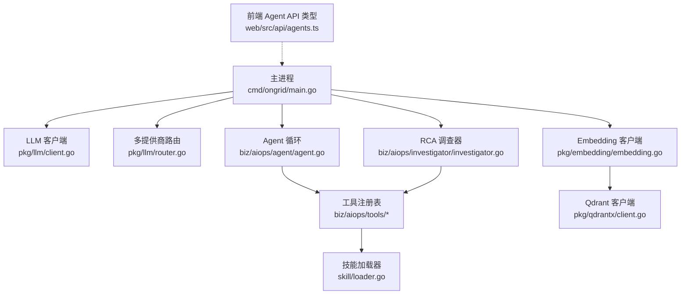
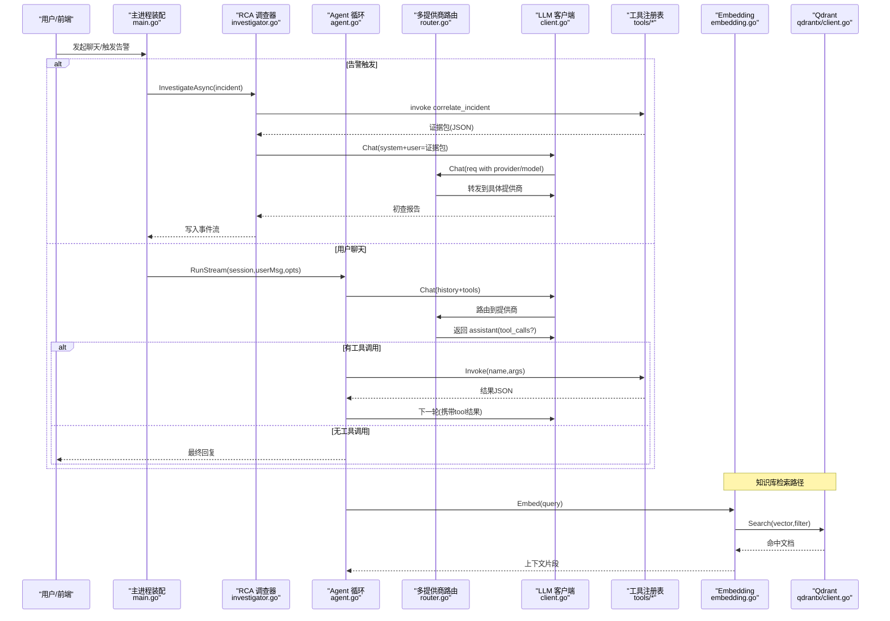
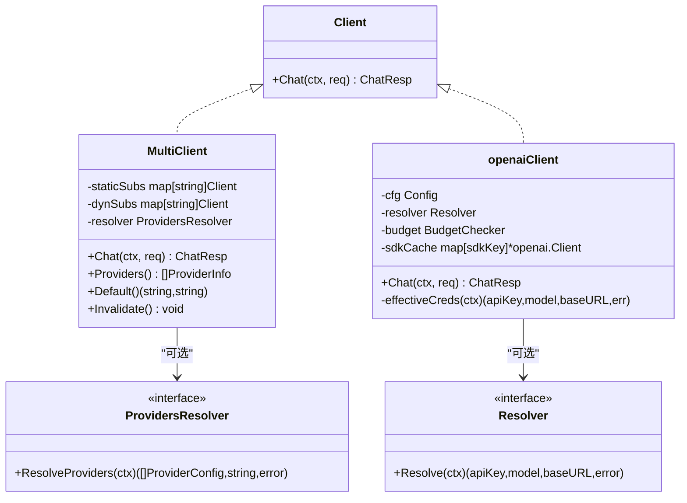
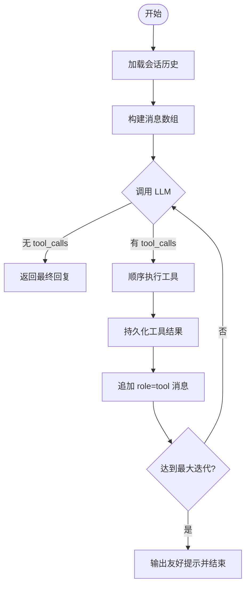
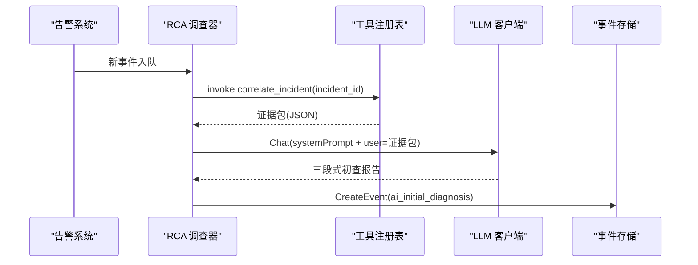
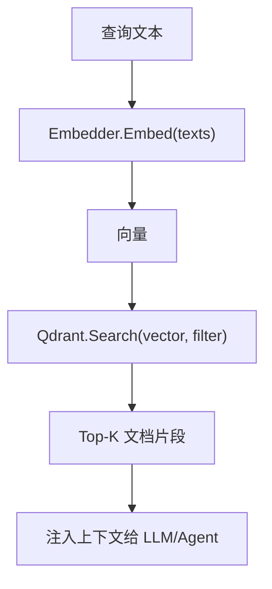
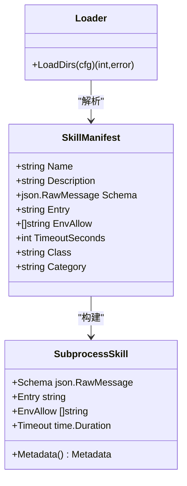
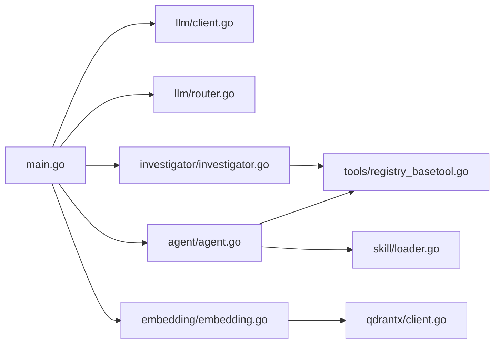

# AI智能运维模块

<cite>
**本文引用的文件**
- [cmd/ongrid/main.go](file://cmd/ongrid/main.go)
- [internal/pkg/llm/client.go](file://internal/pkg/llm/client.go)
- [internal/pkg/llm/router.go](file://internal/pkg/llm/router.go)
- [internal/manager/biz/aiops/agent/agent.go](file://internal/manager/biz/aiops/agent/agent.go)
- [internal/manager/biz/aiops/investigator/investigator.go](file://internal/manager/biz/aiops/investigator/investigator.go)
- [internal/manager/biz/aiops/tools/registry_basetool.go](file://internal/manager/biz/aiops/tools/registry_basetool.go)
- [internal/skill/loader.go](file://internal/skill/loader.go)
- [internal/pkg/embedding/embedding.go](file://internal/pkg/embedding/embedding.go)
- [internal/pkg/qdrantx/client.go](file://internal/pkg/qdrantx/client.go)
- [docs/workflow-catalog.md](file://docs/workflow-catalog.md)
- [web/src/api/agents.ts](file://web/src/api/agents.ts)
</cite>

## 目录
1. [简介](#简介)
2. [项目结构](#项目结构)
3. [核心组件](#核心组件)
4. [架构总览](#架构总览)
5. [详细组件分析](#详细组件分析)
6. [依赖关系分析](#依赖关系分析)
7. [性能与可观测性](#性能与可观测性)
8. [故障排查指南](#故障排查指南)
9. [结论](#结论)
10. [附录：扩展与最佳实践](#附录扩展与最佳实践)

## 简介
本模块为 Ongrid 的 AI 智能运维能力，围绕“多 LLM 提供商统一接入、RCA 根因分析、知识库与 RAG、Agent 工作流编排、技能系统与工具集”构建。系统支持 OpenAI、Anthropic、Gemini、DeepSeek、Kimi、智谱等模型，通过统一接口抽象与动态路由机制，实现按消息或会话选择不同提供商；在告警触发时自动拉取指标/日志/链路证据并生成初查报告；结合向量检索与知识图谱（Qdrant）提供语义检索；以 Agent 循环驱动工具调用，配合工作流节点完成自动化闭环。

## 项目结构
AI 相关代码主要分布在以下层次：
- 入口与装配：cmd/ongrid/main.go 负责 LLM 客户端、多提供商路由、RCA 调查器、Agent 运行时、工具注册与工作流能力的装配。
- LLM 层：internal/pkg/llm 提供 Chat 客户端、预算控制、指标埋点、多提供商路由与默认解析。
- Agent 与 RCA：internal/manager/biz/aiops/agent 实现 Tool-Calling 循环；investigator 实现告警驱动的自动初查。
- 工具与技能：tools 注册 BaseTool；skill 提供外部技能加载与执行。
- 知识与 RAG：embedding 封装 Embedder；qdrantx 封装向量库操作。
- 前端契约：web/src/api/agents.ts 定义 Agent 摘要与用户自定义 Agent 输入结构。

**图示来源**
- [cmd/ongrid/main.go](file://cmd/ongrid/main.go)
- [internal/pkg/llm/client.go](file://internal/pkg/llm/client.go)
- [internal/pkg/llm/router.go](file://internal/pkg/llm/router.go)
- [internal/manager/biz/aiops/agent/agent.go](file://internal/manager/biz/aiops/agent/agent.go)
- [internal/manager/biz/aiops/investigator/investigator.go](file://internal/manager/biz/aiops/investigator/investigator.go)
- [internal/skill/loader.go](file://internal/skill/loader.go)
- [internal/pkg/embedding/embedding.go](file://internal/pkg/embedding/embedding.go)
- [internal/pkg/qdrantx/client.go](file://internal/pkg/qdrantx/client.go)
- [web/src/api/agents.ts](file://web/src/api/agents.ts)

**章节来源**
- [cmd/ongrid/main.go](file://cmd/ongrid/main.go)

## 核心组件
- 多提供商 LLM 客户端与路由
  - 统一 Client.Chat 接口，支持 Provider 字段选择；空 Provider 走默认提供商。
  - MultiClient 维护静态与动态提供商目录，TTL 缓存，失败回退到静态配置。
  - 内置预算检查、指标埋点、Zhipu JWT 鉴权适配、BaseURL 规范化。
- Agent 循环
  - 基于 Tool-Calling 的多轮对话：历史重建、工具模式过滤、结果持久化、SSE 事件推送。
  - 安全策略：禁用 web_search 除非显式开启；旧内核拒绝写类工具；最大迭代上限保护。
- RCA 调查器
  - 告警触发后异步拉取 correlate_incident 证据包，单轮 LLM 生成三段式初查报告，写入事件流。
- 工具与技能
  - BaseTool 注册表按需暴露（审计变更、拓扑、数据库、Prom/Loki/Tempo 查询等）。
  - 外部技能通过 skill.json 清单加载，子进程隔离执行，白名单目录与超时控制。
- 知识库与 RAG
  - Embedder 面向 OpenAI 兼容 /v1/embeddings，支持 Zhipu JWT；Qdrant 提供集合管理、索引、Upsert、搜索与滚动浏览。

**章节来源**
- [internal/pkg/llm/client.go](file://internal/pkg/llm/client.go)
- [internal/pkg/llm/router.go](file://internal/pkg/llm/router.go)
- [internal/manager/biz/aiops/agent/agent.go](file://internal/manager/biz/aiops/agent/agent.go)
- [internal/manager/biz/aiops/investigator/investigator.go](file://internal/manager/biz/aiops/investigator/investigator.go)
- [internal/manager/biz/aiops/tools/registry_basetool.go](file://internal/manager/biz/aiops/tools/registry_basetool.go)
- [internal/skill/loader.go](file://internal/skill/loader.go)
- [internal/pkg/embedding/embedding.go](file://internal/pkg/embedding/embedding.go)
- [internal/pkg/qdrantx/client.go](file://internal/pkg/qdrantx/client.go)

## 架构总览
下图展示从请求到 LLM 调用、工具执行、RCA 与知识库检索的整体流程。

**图示来源**
- [cmd/ongrid/main.go](file://cmd/ongrid/main.go)
- [internal/manager/biz/aiops/investigator/investigator.go](file://internal/manager/biz/aiops/investigator/investigator.go)
- [internal/manager/biz/aiops/agent/agent.go](file://internal/manager/biz/aiops/agent/agent.go)
- [internal/pkg/llm/router.go](file://internal/pkg/llm/router.go)
- [internal/pkg/llm/client.go](file://internal/pkg/llm/client.go)
- [internal/pkg/embedding/embedding.go](file://internal/pkg/embedding/embedding.go)
- [internal/pkg/qdrantx/client.go](file://internal/pkg/qdrantx/client.go)

## 详细组件分析

### 多提供商 LLM 客户端与路由
- 统一接口
  - Client.Chat 接收 Model、Provider、Messages、Tools、Temperature、UserID。
  - BudgetChecker 在发送前估算 token 数进行预算拦截，成功后记录实际用量。
  - Resolver 支持运行时覆盖 apiKey/model/baseURL，带 TTL 缓存，避免频繁读库。
- 多提供商路由
  - MultiClient 维护静态与动态提供商目录；当 ChatReq.Provider 为空时回退到默认提供商或构造时的 fallback。
  - ProvidersResolver 允许热更新目录；Invalidate 立即失效缓存。
  - 指标标签不含用户/租户敏感信息，仅 model/provider/status。
- 提供商适配
  - BaseURL 规范化：若未带版本段则补 /v1，兼容 Ollama/vLLM 等。
  - Zhipu 特殊处理：对 open.bigmodel.cn 使用 JWT 签名替换 Authorization。

**图示来源**
- [internal/pkg/llm/client.go](file://internal/pkg/llm/client.go)
- [internal/pkg/llm/router.go](file://internal/pkg/llm/router.go)

**章节来源**
- [internal/pkg/llm/client.go](file://internal/pkg/llm/client.go)
- [internal/pkg/llm/router.go](file://internal/pkg/llm/router.go)

### Agent 循环（Tool-Calling 多轮推理）
- 运行流程
  - 读取会话历史，组装 llm.Message；根据选项决定是否暴露 web_search。
  - 每轮调用 LLM，若无 tool_calls 则结束；否则顺序执行工具，持久化结果并追加 role=tool 消息继续下一轮。
  - 支持 SSE 事件：assistant/tool_start/tool_end/done/task_notification/approval_pending。
- 安全与健壮性
  - 旧内核禁止写类工具；web_search 需显式开启；最大迭代次数保护。
  - 历史回放时严格校验 tool_call 与 tool 结果配对，缺失则丢弃不合法片段。
- 上下文增强
  - @-mention 解析器将平台对象内联为 Markdown 列表，提升 LLM 理解力。

**图示来源**
- [internal/manager/biz/aiops/agent/agent.go](file://internal/manager/biz/aiops/agent/agent.go)

**章节来源**
- [internal/manager/biz/aiops/agent/agent.go](file://internal/manager/biz/aiops/agent/agent.go)

### RCA 根因分析引擎（自动初查）
- 触发时机
  - 告警产生后，主进程条件启用调查器，后台 worker 池异步处理。
- 工作流程
  - 直接调用 correlate_incident 工具聚合指标/日志/链路/边端数据。
  - 固定 system prompt 要求三段式输出（定性、可能根因、排障步骤）。
  - 将结果写入 incident 事件流，SPA 渲染在顶部。
- 容错与限流
  - 队列满则丢弃并告警；LLM 超时/错误均记录但不阻塞告警路径。

**图示来源**
- [internal/manager/biz/aiops/investigator/investigator.go](file://internal/manager/biz/aiops/investigator/investigator.go)
- [internal/manager/biz/aiops/tools/registry_basetool.go](file://internal/manager/biz/aiops/tools/registry_basetool.go)

**章节来源**
- [internal/manager/biz/aiops/investigator/investigator.go](file://internal/manager/biz/aiops/investigator/investigator.go)
- [internal/manager/biz/aiops/tools/registry_basetool.go](file://internal/manager/biz/aiops/tools/registry_basetool.go)

### 知识库与 RAG（向量检索与语义检索）
- Embedding
  - 面向 OpenAI 兼容 /v1/embeddings；支持 Zhipu JWT；维度校验；批量嵌入。
- Qdrant
  - EnsureCollection 幂等创建，维度不一致时按是否已有数据决定重建或报错。
  - Upsert/GetPoints/DeleteByFilter/Search/Scroll 等基础操作；支持 MustMatch 过滤与 PrefixMatch 全文前缀匹配。
- 集成方式
  - 知识服务通过 Embedder 获取向量，再调用 Qdrant 进行检索；搜索结果作为上下文注入 Agent/RCA。

**图示来源**
- [internal/pkg/embedding/embedding.go](file://internal/pkg/embedding/embedding.go)
- [internal/pkg/qdrantx/client.go](file://internal/pkg/qdrantx/client.go)

**章节来源**
- [internal/pkg/embedding/embedding.go](file://internal/pkg/embedding/embedding.go)
- [internal/pkg/qdrantx/client.go](file://internal/pkg/qdrantx/client.go)

### Agent 工作流编排与技能系统
- 工作流
  - 触发器（手动/定时/告警）→ 工具/Agent/条件/转换/通知 节点串联，节点间通过表达式传递数据。
  - 工具目录涵盖观测、设备、集群拓扑、告警事件、知识检索等，部分写类工具需人审。
- 技能系统
  - 外部技能通过 skill.json 清单描述名称、描述、参数 Schema、入口程序、环境变量白名单、超时、分类等。
  - Loader 扫描白名单目录，解析清单，校验并注册 SubprocessSkill；重复注册跳过，异常不阻断启动。

**图示来源**
- [internal/skill/loader.go](file://internal/skill/loader.go)
- [docs/workflow-catalog.md](file://docs/workflow-catalog.md)

**章节来源**
- [internal/skill/loader.go](file://internal/skill/loader.go)
- [docs/workflow-catalog.md](file://docs/workflow-catalog.md)

### 前端 Agent 能力契约
- AgentSummary 与 CreateUserAgentInput 定义了后端 Agent 清单与用户自定义 Agent 的字段，包括名称、描述、可用工具、权限模式、模型、最大轮次、系统提示等。
- 前端据此渲染 Agent 卡片与侧边栏选择器。

**章节来源**
- [web/src/api/agents.ts](file://web/src/api/agents.ts)

## 依赖关系分析
- 组件耦合
  - main.go 集中装配：LLM 客户端、MultiClient、Agent、RCA、工具注册、Embedding/Qdrant、工作流。
  - Agent 依赖 tools.Registry 与 session 仓库；RCA 依赖 tools 与事件存储；Embedding 与 Qdrant 解耦于知识服务。
- 外部依赖
  - LLM 提供商通过 OpenAI 兼容接口接入；Zhipu 需要 JWT 签名；Qdrant 提供向量检索。
- 潜在风险
  - 工具名幻觉导致 graph 工具节点报错（见工作流目录已知问题），需在工具清单与运行时保持一致。
  - 写类工具需人审，旧内核下被拒绝，需确保使用图内核以获得 SOP 双签。

**图示来源**
- [cmd/ongrid/main.go](file://cmd/ongrid/main.go)
- [internal/pkg/llm/client.go](file://internal/pkg/llm/client.go)
- [internal/pkg/llm/router.go](file://internal/pkg/llm/router.go)
- [internal/manager/biz/aiops/agent/agent.go](file://internal/manager/biz/aiops/agent/agent.go)
- [internal/manager/biz/aiops/investigator/investigator.go](file://internal/manager/biz/aiops/investigator/investigator.go)
- [internal/manager/biz/aiops/tools/registry_basetool.go](file://internal/manager/biz/aiops/tools/registry_basetool.go)
- [internal/skill/loader.go](file://internal/skill/loader.go)
- [internal/pkg/embedding/embedding.go](file://internal/pkg/embedding/embedding.go)
- [internal/pkg/qdrantx/client.go](file://internal/pkg/qdrantx/client.go)

**章节来源**
- [cmd/ongrid/main.go](file://cmd/ongrid/main.go)
- [docs/workflow-catalog.md](file://docs/workflow-catalog.md)

## 性能与可观测性
- 预算与限流
  - 预算检查在发送前估算 token，超限拒绝；成功之后记录实际用量。
- 超时与并发
  - LLM 默认超时 120s；RCA 调查器使用固定大小 worker 池与缓冲队列，超量丢弃。
- 指标埋点
  - 路由层记录 provider/model/status/duration/input/output tokens；客户端记录请求耗时与 token 总量。
- 资源优化
  - SDK 客户端按 (apiKey, baseURL) 缓存；Resolver 结果 TTL 缓存；Qdrant 索引按需创建。

[本节为通用指导，无需特定文件引用]

## 故障排查指南
- 常见错误与定位
  - “provider not configured”：检查 MultiClient 动态目录与默认提供商设置。
  - “budget exceeded”：降低温度或减少上下文长度，调整预算阈值。
  - “tool X not found in toolsNode indexes”：确认工具清单与运行时一致（参考工作流目录已知问题）。
  - “collection dim mismatch”：Qdrant 集合维度与 Embedding 模型不一致，清空或重建集合。
- 快速自检
  - 查看 LLM 路由 Providers 与 Default 是否正确。
  - 验证 RCA 调查器是否启用且队列未满。
  - 确认 Embedding 与 Qdrant 连通性与维度一致。

**章节来源**
- [internal/pkg/llm/router.go](file://internal/pkg/llm/router.go)
- [internal/pkg/llm/client.go](file://internal/pkg/llm/client.go)
- [internal/manager/biz/aiops/investigator/investigator.go](file://internal/manager/biz/aiops/investigator/investigator.go)
- [internal/pkg/qdrantx/client.go](file://internal/pkg/qdrantx/client.go)
- [docs/workflow-catalog.md](file://docs/workflow-catalog.md)

## 结论
本模块以统一的 LLM 接口与多提供商路由为核心，结合 Agent 循环与 RCA 自动初查，形成“感知—诊断—行动”的闭环；通过技能系统与工具集扩展能力边界，并以 RAG 增强上下文质量。整体设计强调安全可控（预算、超时、工具白名单、写类人审）、可观测与可扩展，便于持续引入新模型与新工具。

[本节为总结，无需特定文件引用]

## 附录：扩展与最佳实践
- 自定义工具开发
  - 新增 BaseTool 并在注册表中按需暴露；遵循 JSON Schema 描述入参；保证幂等与可审计。
  - 写类工具务必纳入人审流程，并确保图内核启用 SOP 双签。
- Prompt 模板管理
  - 将 system prompt 与业务场景分离，按角色/领域维护模板；RCA 与 Agent 分别配置。
- 模型选择策略
  - 按任务复杂度与成本选择模型：简单问答用轻量模型，复杂推理用强模型；通过路由默认与 per-call 覆盖灵活切换。
- 集成与优化
  - 合理设置 HistoryLimit 与 MaxIterations，避免过长上下文与过多轮次。
  - 使用 @-mention 精准注入上下文，减少无效工具调用。
  - 对高频检索路径启用 Qdrant 索引与分页滚动，控制返回规模。

[本节为通用指导，无需特定文件引用]