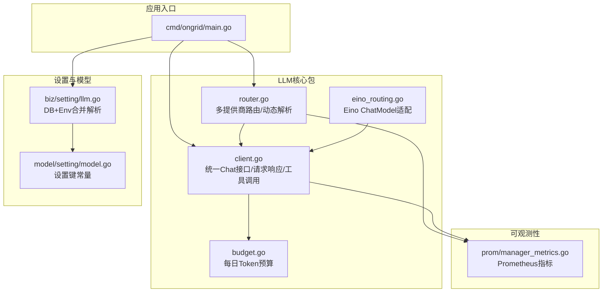
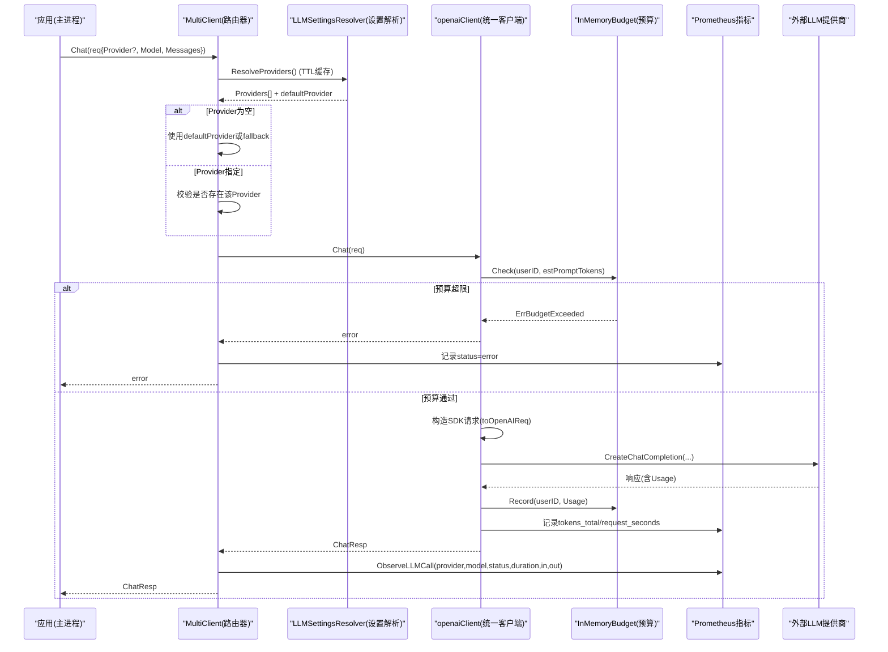
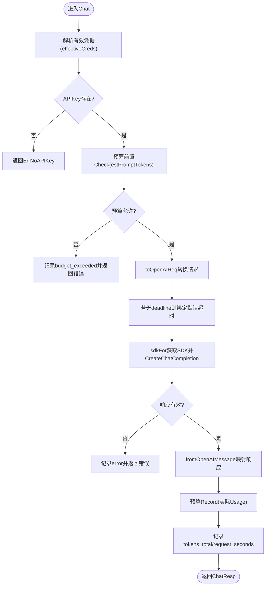
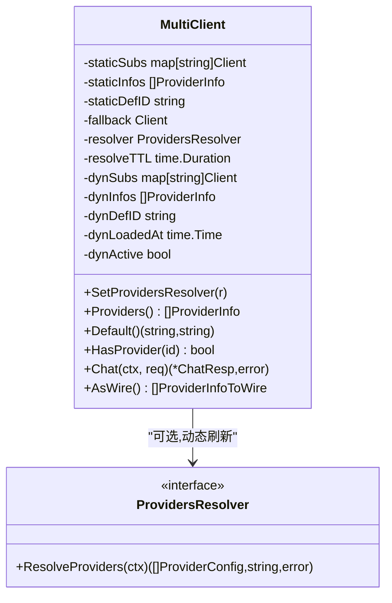
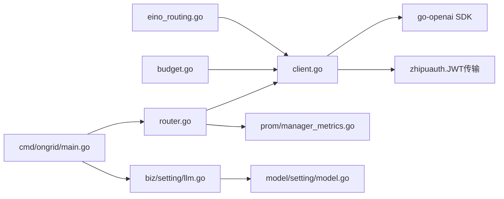

# LLM集成架构

<cite>
**本文引用的文件列表**
- [cmd/ongrid/main.go](file://cmd/ongrid/main.go)
- [internal/pkg/llm/doc.go](file://internal/pkg/llm/doc.go)
- [internal/pkg/llm/client.go](file://internal/pkg/llm/client.go)
- [internal/pkg/llm/router.go](file://internal/pkg/llm/router.go)
- [internal/pkg/llm/budget.go](file://internal/pkg/llm/budget.go)
- [internal/pkg/llm/eino_routing.go](file://internal/pkg/llm/eino_routing.go)
- [internal/manager/biz/setting/llm.go](file://internal/manager/biz/setting/llm.go)
- [internal/manager/model/setting/model.go](file://internal/manager/model/setting/model.go)
- [internal/pkg/prom/manager_metrics.go](file://internal/pkg/prom/manager_metrics.go)
</cite>

## 目录
1. [简介](#简介)
2. [项目结构](#项目结构)
3. [核心组件](#核心组件)
4. [架构总览](#架构总览)
5. [详细组件分析](#详细组件分析)
6. [依赖关系分析](#依赖关系分析)
7. [性能与可观测性](#性能与可观测性)
8. [故障转移与错误处理](#故障转移与错误处理)
9. [负载均衡与成本预算控制](#负载均衡与成本预算控制)
10. [自定义LLM提供商扩展指南](#自定义llm提供商扩展指南)
11. [最佳实践与优化建议](#最佳实践与优化建议)
12. [结论](#结论)

## 简介
本文件面向开发者，系统性阐述多提供商大语言模型的统一接口抽象、动态路由机制与运行时配置能力。系统以OpenAI兼容的聊天补全接口为统一契约，通过“客户端+路由器+设置解析器”的分层设计，实现对OpenAI、Anthropic、Gemini、DeepSeek、Kimi等提供商的统一接入；同时提供按日Token预算控制、Prometheus指标采集、以及基于设置中心（system_settings）的动态刷新能力。文档还包含Eino框架适配层、错误分类与状态标签、以及扩展自定义提供商的实践路径。

## 项目结构
围绕LLM集成的关键代码位于以下模块：
- 统一客户端与协议定义：internal/pkg/llm/client.go
- 多提供商路由器：internal/pkg/llm/router.go
- 预算控制：internal/pkg/llm/budget.go
- Eino适配与路由模型：internal/pkg/llm/eino_routing.go
- 设置解析器（DB + Env合并）：internal/manager/biz/setting/llm.go
- 设置键常量：internal/manager/model/setting/model.go
- 启动装配与默认值注入：cmd/ongrid/main.go
- 指标注册：internal/pkg/prom/manager_metrics.go

图表来源
- [cmd/ongrid/main.go:532-721](file://cmd/ongrid/main.go#L532-L721)
- [internal/pkg/llm/client.go:1-120](file://internal/pkg/llm/client.go#L1-L120)
- [internal/pkg/llm/router.go:1-120](file://internal/pkg/llm/router.go#L1-L120)
- [internal/pkg/llm/budget.go:1-73](file://internal/pkg/llm/budget.go#L1-L73)
- [internal/pkg/llm/eino_routing.go:1-120](file://internal/pkg/llm/eino_routing.go#L1-L120)
- [internal/manager/biz/setting/llm.go:1-120](file://internal/manager/biz/setting/llm.go#L1-L120)
- [internal/manager/model/setting/model.go:62-120](file://internal/manager/model/setting/model.go#L62-L120)
- [internal/pkg/prom/manager_metrics.go:152-269](file://internal/pkg/prom/manager_metrics.go#L152-L269)

章节来源
- [cmd/ongrid/main.go:532-721](file://cmd/ongrid/main.go#L532-L721)
- [internal/pkg/llm/doc.go:1-14](file://internal/pkg/llm/doc.go#L1-L14)

## 核心组件
- 统一客户端接口与消息模型
  - 定义了统一的ChatReq/ChatResp、Message、ToolCall、ToolSchema、Usage等类型，遵循OpenAI风格，屏蔽底层差异。
  - 支持可选Provider字段用于路由选择；空Provider走默认或回退客户端。
- 多提供商路由器
  - MultiClient根据ChatReq.Provider将请求分发到对应子客户端；支持静态构建与动态解析两种模式。
  - 支持ProvidersResolver在运行时刷新提供商目录，TTL缓存避免频繁IO。
- 预算控制器
  - InMemoryBudget实现按UTC日的全局Token上限检查与记录，预留用户维度扩展点。
- Eino适配层
  - RoutingChatModel将内部多个ChatModel按provider id进行分发，并支持动态默认提供者解析。
  - NewClientChatModel将现有llm.Client适配为eino的ChatModel，便于后续Agent图编排。
- 设置解析器
  - LLMSettingsResolver从system_settings.llm.*读取每提供商配置，并与环境变量默认值合并，形成最终ProviderConfig集合。
  - 支持向后兼容旧版openai_model字段。

章节来源
- [internal/pkg/llm/client.go:97-128](file://internal/pkg/llm/client.go#L97-L128)
- [internal/pkg/llm/router.go:30-129](file://internal/pkg/llm/router.go#L30-L129)
- [internal/pkg/llm/budget.go:9-73](file://internal/pkg/llm/budget.go#L9-L73)
- [internal/pkg/llm/eino_routing.go:78-142](file://internal/pkg/llm/eino_routing.go#L78-L142)
- [internal/manager/biz/setting/llm.go:126-224](file://internal/manager/biz/setting/llm.go#L126-L224)

## 架构总览
下图展示了从应用入口到各提供商的完整链路，包括动态设置解析、路由分发、预算检查、指标上报与错误分类。

图表来源
- [internal/pkg/llm/router.go:279-334](file://internal/pkg/llm/router.go#L279-L334)
- [internal/pkg/llm/client.go:344-448](file://internal/pkg/llm/client.go#L344-L448)
- [internal/pkg/llm/budget.go:35-60](file://internal/pkg/llm/budget.go#L35-L60)
- [internal/pkg/prom/manager_metrics.go:233-262](file://internal/pkg/prom/manager_metrics.go#L233-L262)

## 详细组件分析

### 统一客户端（client.go）
- 职责
  - 维护Config（APIKey、Model、BaseURL、Timeout），支持Resolver动态覆盖。
  - 将ChatReq转换为go-openai SDK请求，并将响应映射回内部Message/ToolCall/Usage。
  - 对Zhipu（bigmodel.cn）自动注入JWT认证传输层。
  - 对BaseURL进行规范化，确保OpenAI兼容端点路径正确。
- 关键流程
  - effectiveCreds：按TTL缓存解析结果，空字段回退到env-seeded cfg。
  - sdkFor：按(apiKey, baseURL)缓存SDK实例，减少重复创建。
  - Chat：预算前置检查→构建请求→超时保护→发送→统计→后置记录。
- 复杂度与性能
  - 内存级缓存（sdkCache、resolvedCreds）降低冷路径开销。
  - 估算prompt tokens用于预算前置拦截，避免无效网络调用。
- 错误处理
  - 无APIKey返回ErrNoAPIKey；网络错误不重试（工具非幂等）。
  - 错误分类用于Prometheus标签（timeout/rate_limited/error）。

图表来源
- [internal/pkg/llm/client.go:344-448](file://internal/pkg/llm/client.go#L344-L448)
- [internal/pkg/llm/client.go:220-251](file://internal/pkg/llm/client.go#L220-L251)
- [internal/pkg/llm/client.go:253-286](file://internal/pkg/llm/client.go#L253-L286)
- [internal/pkg/llm/client.go:288-321](file://internal/pkg/llm/client.go#L288-L321)
- [internal/pkg/llm/client.go:547-563](file://internal/pkg/llm/client.go#L547-L563)

章节来源
- [internal/pkg/llm/client.go:1-120](file://internal/pkg/llm/client.go#L1-L120)
- [internal/pkg/llm/client.go:344-448](file://internal/pkg/llm/client.go#L344-L448)

### 多提供商路由器（router.go）
- 职责
  - 管理静态与动态提供商目录，按Provider分发请求。
  - 暴露Providers()/Default()/HasProvider()/AsWire()供HTTP层使用。
  - 错误分类与Prometheus指标聚合（provider、model、status、duration、in/out tokens）。
- 动态解析
  - SetProvidersResolver注入LLMSettingsResolver；activeSubs在TTL内复用结果。
  - 当解析失败或结果为空时，回退到静态目录。
- 默认提供者策略
  - 优先使用显式defaultProvider；否则取排序后的第一个可用Provider。

图表来源
- [internal/pkg/llm/router.go:61-129](file://internal/pkg/llm/router.go#L61-L129)
- [internal/pkg/llm/router.go:156-230](file://internal/pkg/llm/router.go#L156-L230)
- [internal/pkg/llm/router.go:279-334](file://internal/pkg/llm/router.go#L279-L334)

章节来源
- [internal/pkg/llm/router.go:1-129](file://internal/pkg/llm/router.go#L1-L129)
- [internal/pkg/llm/router.go:279-334](file://internal/pkg/llm/router.go#L279-L334)

### 预算控制（budget.go）
- 职责
  - 按UTC日累计TotalTokens，Check在请求前预估拦截，Record在成功后追加。
  - 当前为全局限制，预留userID参数以便未来租户维度扩展。
- 行为
  - dailyLimit<=0表示无限制。
  - Used()仅测试用途，生产侧应视为近似值。

章节来源
- [internal/pkg/llm/budget.go:9-73](file://internal/pkg/llm/budget.go#L9-L73)

### Eino适配与路由（eino_routing.go）
- 职责
  - RoutingChatModel将多个内部ChatModel按provider id分发，支持动态默认提供者解析。
  - NewClientChatModel将现有llm.Client适配为eino ChatModel，保持向后兼容。
- 特性
  - WithProvider选项可在单次调用中覆盖默认Provider。
  - BindTools/WithTools双路径兼容，保证与eino ReAct Agent协作。
  - 流式接口在当前版本以单块缓冲实现，后续PR将引入token-by-token流式。

章节来源
- [internal/pkg/llm/eino_routing.go:78-142](file://internal/pkg/llm/eino_routing.go#L78-L142)
- [internal/pkg/llm/eino_routing.go:317-353](file://internal/pkg/llm/eino_routing.go#L317-L353)

### 设置解析器（biz/setting/llm.go）
- 职责
  - 从system_settings.llm.*读取每提供商配置（api_key、base_url、models、default_model），与env默认值合并。
  - 支持向后兼容旧版openai_model字段。
  - 输出ProviderConfig集合及default_provider，供路由器使用。
- 规则
  - 若某Provider未配置APIKey则跳过；Custom需显式base_url否则跳过。
  - models去重，default_model优先于models首项。
  - default_provider优先级：DB > env > ""（路由器取排序第一）。

章节来源
- [internal/manager/biz/setting/llm.go:126-224](file://internal/manager/biz/setting/llm.go#L126-L224)
- [internal/manager/model/setting/model.go:62-120](file://internal/manager/model/setting/model.go#L62-L120)

### 启动装配与默认值注入（cmd/ongrid/main.go）
- 行为
  - 从配置与环境变量初始化各提供商ProviderConfig，并构建MultiClient。
  - 首次启动时将env默认值写入system_settings（SetIfAbsent），使UI可见。
  - 注入LLMSettingsResolver到路由器，实现运行时热更新（~60s生效）。
  - 为后台工作流（如RCA调查者）构建inner ChatModel，并从已解析的Provider集合中注册。

章节来源
- [cmd/ongrid/main.go:532-721](file://cmd/ongrid/main.go#L532-L721)
- [cmd/ongrid/main.go:3328-3360](file://cmd/ongrid/main.go#L3328-L3360)

## 依赖关系分析
- 耦合与内聚
  - client.go与router.go高内聚，分别负责单一提供商通信与跨提供商分发。
  - budget.go独立且可插拔，通过BudgetChecker接口解耦。
  - eino_routing.go作为适配层，向上对接eino生态，向下复用llm.Client。
  - setting/llm.go与model/setting/model.go强相关，集中管理设置键与解析逻辑。
- 外部依赖
  - go-openai SDK用于所有OpenAI兼容端点的HTTP交互。
  - Prometheus用于指标采集。
  - Zhipu JWT传输层用于特定提供商鉴权。

图表来源
- [internal/pkg/llm/client.go:1-27](file://internal/pkg/llm/client.go#L1-L27)
- [internal/pkg/llm/router.go:1-28](file://internal/pkg/llm/router.go#L1-L28)
- [internal/pkg/llm/eino_routing.go:28-36](file://internal/pkg/llm/eino_routing.go#L28-L36)
- [internal/manager/biz/setting/llm.go:1-10](file://internal/manager/biz/setting/llm.go#L1-L10)
- [internal/manager/model/setting/model.go:62-120](file://internal/manager/model/setting/model.go#L62-L120)
- [cmd/ongrid/main.go:532-721](file://cmd/ongrid/main.go#L532-L721)

章节来源
- [internal/pkg/llm/router.go:1-28](file://internal/pkg/llm/router.go#L1-L28)
- [internal/pkg/llm/client.go:1-27](file://internal/pkg/llm/client.go#L1-L27)
- [internal/pkg/llm/eino_routing.go:28-36](file://internal/pkg/llm/eino_routing.go#L28-L36)
- [internal/manager/biz/setting/llm.go:1-10](file://internal/manager/biz/setting/llm.go#L1-L10)
- [internal/manager/model/setting/model.go:62-120](file://internal/manager/model/setting/model.go#L62-L120)
- [cmd/ongrid/main.go:532-721](file://cmd/ongrid/main.go#L532-L721)

## 性能与可观测性
- 指标
  - ongrid_llm_calls_total：按provider、model、status（ok|error|timeout|rate_limited）计数。
  - ongrid_llm_call_duration_seconds：按provider、model分桶的延迟直方图。
  - ongrid_llm_router_tokens_total：按provider、model、kind（input|output）的Token总量。
- 日志
  - 禁止记录用户消息内容；仅记录模型名、user_id、token数、工具调用数量、耗时等。
- 缓存
  - SDK实例按(apiKey, baseURL)缓存；Resolver结果TTL=60s；设置服务自身也有TTL。

章节来源
- [internal/pkg/prom/manager_metrics.go:152-269](file://internal/pkg/prom/manager_metrics.go#L152-L269)
- [internal/pkg/llm/doc.go:1-14](file://internal/pkg/llm/doc.go#L1-L14)
- [internal/pkg/llm/client.go:165-187](file://internal/pkg/llm/client.go#L165-L187)
- [internal/pkg/llm/router.go:131-146](file://internal/pkg/llm/router.go#L131-L146)

## 故障转移与错误处理
- 错误分类
  - timeout/canceled → status=timeout
  - rate limit/429 → status=rate_limited
  - 其他 → status=error
- 回退策略
  - 当Provider为空或未配置时，路由器回退到defaultProvider或构造时传入的fallback客户端。
  - 设置解析失败时，路由器回退到静态目录；单个Provider缺失APIKey会被跳过。
- 预算失败
  - 预算超限时直接拒绝请求，不发起网络调用，避免浪费资源。

章节来源
- [internal/pkg/llm/router.go:336-351](file://internal/pkg/llm/router.go#L336-L351)
- [internal/pkg/llm/router.go:279-334](file://internal/pkg/llm/router.go#L279-L334)
- [internal/pkg/llm/client.go:344-448](file://internal/pkg/llm/client.go#L344-L448)

## 负载均衡与成本预算控制
- 负载均衡
  - 当前路由器按Provider精确分发，未实现加权轮询或基于延迟/成本的自适应选择。
  - 可通过上层业务逻辑（例如按会话/租户选择不同Provider）实现粗粒度负载分散。
- 成本预算控制
  - InMemoryBudget提供按日全局Token上限；可扩展为数据库持久化并按租户维度统计。
  - 建议在网关或服务层增加配额告警与熔断策略，结合Prometheus指标进行监控。

章节来源
- [internal/pkg/llm/budget.go:9-73](file://internal/pkg/llm/budget.go#L9-L73)
- [internal/pkg/prom/manager_metrics.go:233-262](file://internal/pkg/prom/manager_metrics.go#L233-L262)

## 自定义LLM提供商扩展指南
- 步骤
  1. 新增Provider常量与设置键
     - 在model/setting/model.go中添加新的Key*常量（api_key、base_url、models、default_model）。
  2. 更新设置解析器
     - 在biz/setting/llm.go的allProviderKeys中加入新Provider键位信息。
  3. 启动装配
     - 在cmd/ongrid/main.go中为新Provider添加ProviderConfig构建逻辑，并注入到MultiClient。
  4. 验证
     - 通过设置中心写入新Provider配置，确认SPA模型下拉框可见，且路由能正确分发。
- 注意事项
  - Custom提供商必须显式配置base_url，否则会被跳过。
  - APIKey为空将被跳过，不会出现在模型目录中。
  - 若提供商非OpenAI兼容，需要新增适配器或替换SDK层（当前设计假设OpenAI兼容）。

章节来源
- [internal/manager/model/setting/model.go:62-120](file://internal/manager/model/setting/model.go#L62-L120)
- [internal/manager/biz/setting/llm.go:70-124](file://internal/manager/biz/setting/llm.go#L70-L124)
- [cmd/ongrid/main.go:550-604](file://cmd/ongrid/main.go#L550-L604)

## 最佳实践与优化建议
- 配置管理
  - 优先通过设置中心（system_settings.llm.*）管理密钥与模型列表，避免硬编码。
  - 使用环境变量作为兜底默认值，保障首次部署可用性。
- 性能优化
  - 合理设置默认超时（当前120s），避免长尾请求阻塞。
  - 利用BaseURL规范化与SDK实例缓存，减少重复创建与路径错误。
- 可观测性
  - 关注ongrid_llm_calls_total与ongrid_llm_call_duration_seconds，识别慢Provider与限流问题。
  - 结合预算指标与告警，防止成本失控。
- 错误处理
  - 避免对非幂等工具调用进行自动重试。
  - 针对rate_limit与timeout进行分类监控与告警。

[本节为通用指导，无需具体文件引用]

## 结论
本架构以OpenAI兼容接口为核心，通过统一客户端、动态路由器与设置解析器，实现了多提供商LLM的无缝集成与运行时热更新。配合预算控制与完善的指标体系，系统在可用性、可观测性与成本控制方面具备良好基础。未来可在负载均衡、流式响应、租户维度预算等方面持续演进。