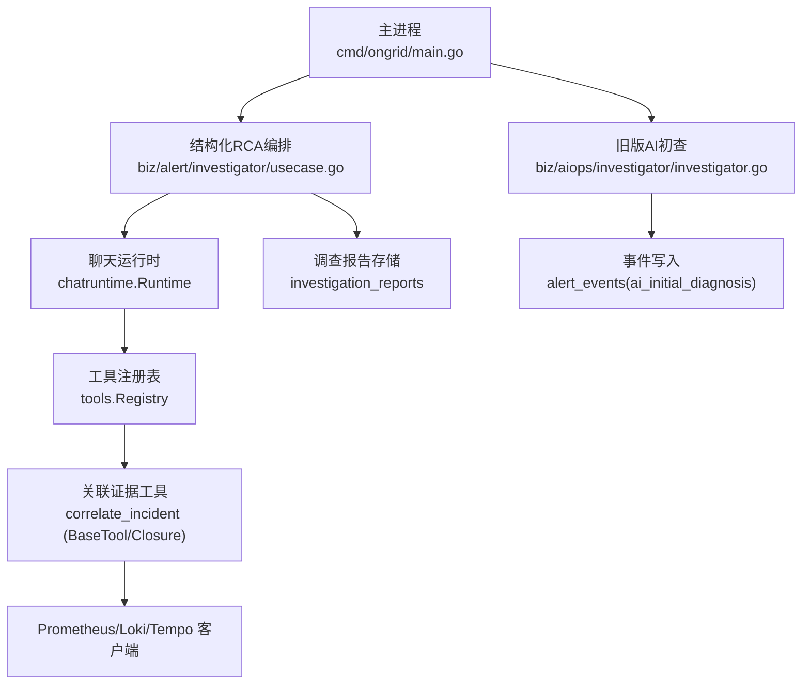
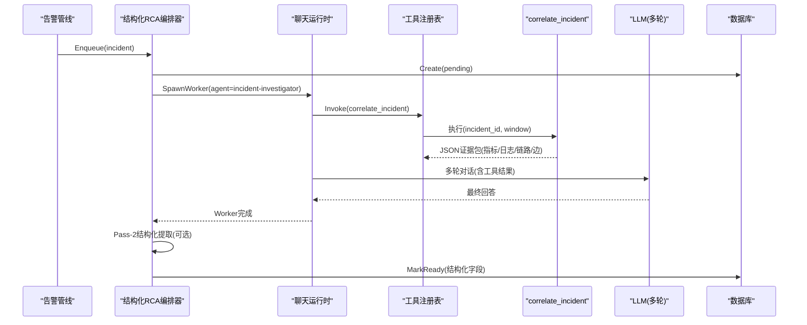
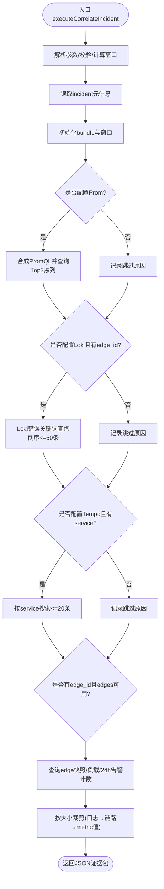
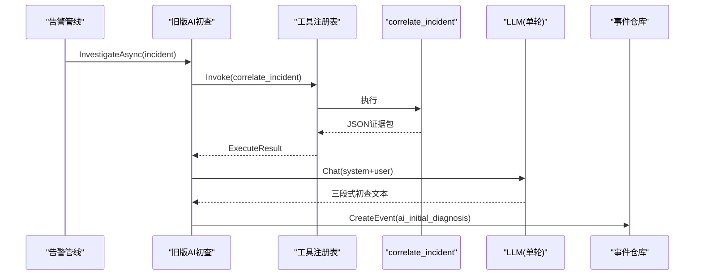
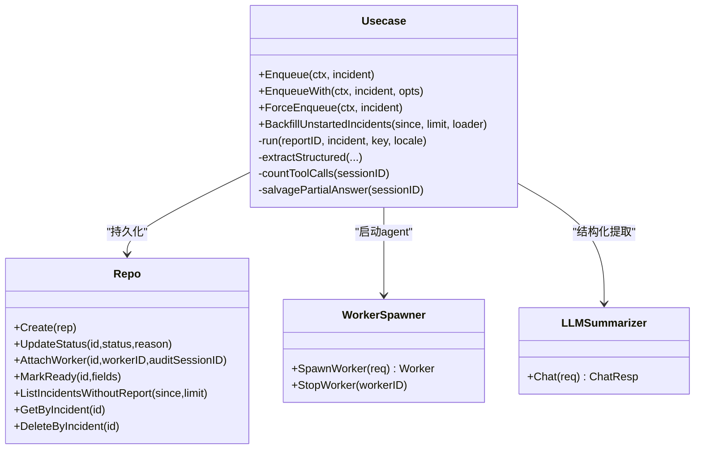
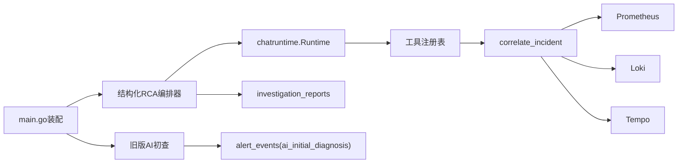

# RCA根因分析引擎

<cite>
**本文引用的文件**   
- [cmd/ongrid/main.go](file://cmd/ongrid/main.go)
- [internal/manager/biz/alert/investigator/usecase.go](file://internal/manager/biz/alert/investigator/usecase.go)
- [internal/manager/biz/alert/investigator/report_extractor.go](file://internal/manager/biz/alert/investigator/report_extractor.go)
- [internal/manager/biz/aiops/investigator/investigator.go](file://internal/manager/biz/aiops/investigator/investigator.go)
- [internal/manager/biz/aiops/tools/correlate_incident.go](file://internal/manager/biz/aiops/tools/correlate_incident.go)
- [internal/manager/biz/aiops/tools/correlate_incident_basetool.go](file://internal/manager/biz/aiops/tools/correlate_incident_basetool.go)
- [internal/manager/biz/aiops/tools/registry_basetool.go](file://internal/manager/biz/aiops/tools/registry_basetool.go)
- [internal/pkg/prom/manager_metrics.go](file://internal/pkg/prom/manager_metrics.go)
- [ROADMAP.md](file://ROADMAP.md)
</cite>

## 目录
1. [简介](#简介)
2. [项目结构](#项目结构)
3. [核心组件](#核心组件)
4. [架构总览](#架构总览)
5. [详细组件分析](#详细组件分析)
6. [依赖关系分析](#依赖关系分析)
7. [性能与并发控制](#性能与并发控制)
8. [故障排查指南](#故障排查指南)
9. [结论](#结论)
10. [附录：调优与最佳实践](#附录：调优与最佳实践)

## 简介
本文件面向RCA（Root Cause Analysis）根因分析引擎，系统性阐述自动故障诊断系统的工作原理与实现细节。内容覆盖告警事件触发、上下文数据收集、智能分析流程、correlate_incident工具的证据聚合、系统提示词设计与结果结构化、异步工作队列与并发控制、超时与降级策略、结果持久化与前端展示集成，以及Prompt优化、数据采样与性能调优建议。

## 项目结构
RCA相关代码主要分布在以下模块：
- 启动装配与开关：cmd/ongrid/main.go
- 结构化RCA编排与持久化：internal/manager/biz/alert/investigator/*
- 旧版AI初查（单轮LLM）：internal/manager/biz/aiops/investigator/*
- 关联证据聚合工具：internal/manager/biz/aiops/tools/correlate_incident*.go
- 指标监控：internal/pkg/prom/manager_metrics.go
- 路线图与演进计划：ROADMAP.md

图表来源
- [cmd/ongrid/main.go:1635-1734](file://cmd/ongrid/main.go#L1635-L1734)
- [internal/manager/biz/alert/investigator/usecase.go:195-234](file://internal/manager/biz/alert/investigator/usecase.go#L195-L234)
- [internal/manager/biz/aiops/investigator/investigator.go:134-164](file://internal/manager/biz/aiops/investigator/investigator.go#L134-L164)
- [internal/manager/biz/aiops/tools/registry_basetool.go:150-156](file://internal/manager/biz/aiops/tools/registry_basetool.go#L150-L156)
- [internal/manager/biz/aiops/tools/correlate_incident.go:159-298](file://internal/manager/biz/aiops/tools/correlate_incident.go#L159-L298)

章节来源
- [cmd/ongrid/main.go:1635-1734](file://cmd/ongrid/main.go#L1635-L1734)
- [internal/manager/biz/alert/investigator/usecase.go:195-234](file://internal/manager/biz/alert/investigator/usecase.go#L195-L234)
- [internal/manager/biz/aiops/investigator/investigator.go:134-164](file://internal/manager/biz/aiops/investigator/investigator.go#L134-L164)
- [internal/manager/biz/aiops/tools/registry_basetool.go:150-156](file://internal/manager/biz/aiops/tools/registry_basetool.go#L150-L156)
- [internal/manager/biz/aiops/tools/correlate_incident.go:159-298](file://internal/manager/biz/aiops/tools/correlate_incident.go#L159-L298)

## 核心组件
- 结构化RCA编排器（Usecase）：负责严重度门控、去重、并发上限、超时、会话生成、结构化提取与持久化。
- 旧版AI初查Investigator：在incident首次触发时，调用correlate_incident获取证据包，单轮LLM输出三段式初查并写入事件流。
- correlate_incident工具：围绕incident_id拉取指标、日志、链路和边缘节点快照，裁剪到固定大小后返回JSON证据包。
- 报告提取器（Pass-2）：对最终回答进行结构化抽取，产出root_cause、evidence、suggested_actions、confidence等字段。
- 监控指标：暴露RCA工作器并发数等关键指标。

章节来源
- [internal/manager/biz/alert/investigator/usecase.go:195-234](file://internal/manager/biz/alert/investigator/usecase.go#L195-L234)
- [internal/manager/biz/aiops/investigator/investigator.go:134-164](file://internal/manager/biz/aiops/investigator/investigator.go#L134-L164)
- [internal/manager/biz/aiops/tools/correlate_incident.go:159-298](file://internal/manager/biz/aiops/tools/correlate_incident.go#L159-L298)
- [internal/manager/biz/alert/investigator/report_extractor.go:40-135](file://internal/manager/biz/alert/investigator/report_extractor.go#L40-L135)
- [internal/pkg/prom/manager_metrics.go:284-287](file://internal/pkg/prom/manager_metrics.go#L284-L287)

## 架构总览
RCA由两条并行路径组成：
- 旧版AI初查：incident触发 → 调用correlate_incident → 单轮LLM → 写入ai_initial_diagnosis事件。
- 结构化RCA：incident触发 → 创建pending报告 → 启动agent worker（多轮ReAct）→ 可选Pass-2结构化提取 → 写入investigation_reports。

图表来源
- [internal/manager/biz/alert/investigator/usecase.go:332-428](file://internal/manager/biz/alert/investigator/usecase.go#L332-L428)
- [internal/manager/biz/alert/investigator/usecase.go:553-667](file://internal/manager/biz/alert/investigator/usecase.go#L553-L667)
- [internal/manager/biz/aiops/tools/correlate_incident.go:159-298](file://internal/manager/biz/aiops/tools/correlate_incident.go#L159-L298)
- [internal/manager/biz/alert/investigator/report_extractor.go:40-135](file://internal/manager/biz/alert/investigator/report_extractor.go#L40-L135)

## 详细组件分析

### correlate_incident工具（证据聚合）
职责
- 解析参数（incident_id、window_minutes），计算时间窗口。
- 查询incident元信息，构造bundle。
- 条件性拉取：
  - 指标面板：基于规则启发式合成PromQL，按幅度排序取Top3。
  - 日志面板：Loki正则过滤错误关键字，倒序取最多50条。
  - 链路面板：Tempo按service标签搜索，最多20条。
  - 边缘快照：edge基本信息+当前负载+近24h告警计数。
- 响应裁剪：超过阈值先剪日志，再剪链路，最后丢弃metric值保留labels。

数据结构
- bundle包含incident摘要、窗口、metric_panel、log_panel、trace_panel、edge快照、skipped/truncated标记。

超时与容错
- 整体超时约60秒；子调用各自短超时；上游失败记录在Skipped中不中断整体。

图表来源
- [internal/manager/biz/aiops/tools/correlate_incident.go:159-298](file://internal/manager/biz/aiops/tools/correlate_incident.go#L159-L298)
- [internal/manager/biz/aiops/tools/correlate_incident.go:300-372](file://internal/manager/biz/aiops/tools/correlate_incident.go#L300-L372)
- [internal/manager/biz/aiops/tools/correlate_incident.go:378-430](file://internal/manager/biz/aiops/tools/correlate_incident.go#L378-L430)
- [internal/manager/biz/aiops/tools/correlate_incident.go:434-488](file://internal/manager/biz/aiops/tools/correlate_incident.go#L434-L488)
- [internal/manager/biz/aiops/tools/correlate_incident.go:494-535](file://internal/manager/biz/aiops/tools/correlate_incident.go#L494-L535)
- [internal/manager/biz/aiops/tools/correlate_incident.go:541-618](file://internal/manager/biz/aiops/tools/correlate_incident.go#L541-L618)
- [internal/manager/biz/aiops/tools/correlate_incident.go:645-694](file://internal/manager/biz/aiops/tools/correlate_incident.go#L645-L694)

章节来源
- [internal/manager/biz/aiops/tools/correlate_incident.go:159-298](file://internal/manager/biz/aiops/tools/correlate_incident.go#L159-L298)
- [internal/manager/biz/aiops/tools/correlate_incident.go:300-372](file://internal/manager/biz/aiops/tools/correlate_incident.go#L300-L372)
- [internal/manager/biz/aiops/tools/correlate_incident.go:378-430](file://internal/manager/biz/aiops/tools/correlate_incident.go#L378-L430)
- [internal/manager/biz/aiops/tools/correlate_incident.go:434-488](file://internal/manager/biz/aiops/tools/correlate_incident.go#L434-L488)
- [internal/manager/biz/aiops/tools/correlate_incident.go:494-535](file://internal/manager/biz/aiops/tools/correlate_incident.go#L494-L535)
- [internal/manager/biz/aiops/tools/correlate_incident.go:541-618](file://internal/manager/biz/aiops/tools/correlate_incident.go#L541-L618)
- [internal/manager/biz/aiops/tools/correlate_incident.go:645-694](file://internal/manager/biz/aiops/tools/correlate_incident.go#L645-L694)

### 旧版AI初查Investigator（单轮LLM）
- 触发时机：incident首次触发时，独立于请求上下文运行。
- 流程：直接调用correlate_incident获取证据包 → 拼接system prompt与user消息 → 单轮Chat → 写入ai_initial_diagnosis事件。
- 资源保护：默认3个工作者、100深度缓冲；队列满则丢弃并告警；LLM超时默认120秒；用户消息二次裁剪至~30KB。

图表来源
- [internal/manager/biz/aiops/investigator/investigator.go:166-213](file://internal/manager/biz/aiops/investigator/investigator.go#L166-L213)
- [internal/manager/biz/aiops/investigator/investigator.go:227-293](file://internal/manager/biz/aiops/investigator/investigator.go#L227-L293)
- [internal/manager/biz/aiops/investigator/investigator.go:295-313](file://internal/manager/biz/aiops/investigator/investigator.go#L295-L313)

章节来源
- [internal/manager/biz/aiops/investigator/investigator.go:166-213](file://internal/manager/biz/aiops/investigator/investigator.go#L166-L213)
- [internal/manager/biz/aiops/investigator/investigator.go:227-293](file://internal/manager/biz/aiops/investigator/investigator.go#L227-L293)
- [internal/manager/biz/aiops/investigator/investigator.go:295-313](file://internal/manager/biz/aiops/investigator/investigator.go#L295-L313)

### 结构化RCA编排器（Usecase）
- 门控：最小严重度、进程内inflight去重、全局并发上限（信号量）。
- 生命周期：创建pending行 → 启动agent worker → 绑定worker/审计会话 → 处理MaxStep异常（抢救部分结果）→ Pass-2结构化提取 → MarkReady。
- 语言与提示：根据locale注入语言指令；为模型设置硬预算（工具调用次数限制）。
- 回补：启动时扫描未开始调查的incident并重新入队。

图表来源
- [internal/manager/biz/alert/investigator/usecase.go:195-234](file://internal/manager/biz/alert/investigator/usecase.go#L195-L234)
- [internal/manager/biz/alert/investigator/usecase.go:332-428](file://internal/manager/biz/alert/investigator/usecase.go#L332-L428)
- [internal/manager/biz/alert/investigator/usecase.go:553-667](file://internal/manager/biz/alert/investigator/usecase.go#L553-L667)
- [internal/manager/biz/alert/investigator/report_extractor.go:40-135](file://internal/manager/biz/alert/investigator/report_extractor.go#L40-L135)

章节来源
- [internal/manager/biz/alert/investigator/usecase.go:332-428](file://internal/manager/biz/alert/investigator/usecase.go#L332-L428)
- [internal/manager/biz/alert/investigator/usecase.go:553-667](file://internal/manager/biz/alert/investigator/usecase.go#L553-L667)
- [internal/manager/biz/alert/investigator/report_extractor.go:40-135](file://internal/manager/biz/alert/investigator/report_extractor.go#L40-L135)

### 报告提取器（Pass-2）
- 输入：incident元信息 + 调查员最终回答。
- 输出：结构化JSON（root_cause、affected_window、pinpoint_target、evidence、suggested_actions、confidence）。
- 健壮性：失败或解析异常时回退到“首段一行”启发式，保证报告始终可展示。

章节来源
- [internal/manager/biz/alert/investigator/report_extractor.go:40-135](file://internal/manager/biz/alert/investigator/report_extractor.go#L40-L135)
- [internal/manager/biz/alert/investigator/report_extractor.go:192-211](file://internal/manager/biz/alert/investigator/report_extractor.go#L192-L211)
- [internal/manager/biz/alert/investigator/report_extractor.go:218-247](file://internal/manager/biz/alert/investigator/report_extractor.go#L218-L247)

### 工具注册与启用
- correlate_incident仅在全部信号源就绪时注册（alertUC、promQuery、logQuery、traceQuery均非空）。
- BaseTool形式支持批量调用，但文档明确建议每次2-4个incident，避免成本爆炸。

章节来源
- [internal/manager/biz/aiops/tools/registry_basetool.go:150-156](file://internal/manager/biz/aiops/tools/registry_basetool.go#L150-L156)
- [internal/manager/biz/aiops/tools/correlate_incident_basetool.go:88-116](file://internal/manager/biz/aiops/tools/correlate_incident_basetool.go#L88-L116)

## 依赖关系分析
- 外部依赖：Prometheus（指标）、Loki（日志）、Tempo（链路）、数据库（incident/events/reports）。
- 内部耦合：
  - main.go装配legacy与structured两条investigator链，并通过SetInvestigator接入告警usecase。
  - Usecase依赖chatruntime.Runtime、LLM Summarizer、Repo接口。
  - correlate_incident依赖AlertUsecase与三个查询客户端。

图表来源
- [cmd/ongrid/main.go:1635-1734](file://cmd/ongrid/main.go#L1635-L1734)
- [internal/manager/biz/aiops/tools/registry_basetool.go:150-156](file://internal/manager/biz/aiops/tools/registry_basetool.go#L150-L156)
- [internal/manager/biz/aiops/tools/correlate_incident.go:159-298](file://internal/manager/biz/aiops/tools/correlate_incident.go#L159-L298)

章节来源
- [cmd/ongrid/main.go:1635-1734](file://cmd/ongrid/main.go#L1635-L1734)
- [internal/manager/biz/aiops/tools/registry_basetool.go:150-156](file://internal/manager/biz/aiops/tools/registry_basetool.go#L150-L156)
- [internal/manager/biz/aiops/tools/correlate_incident.go:159-298](file://internal/manager/biz/aiops/tools/correlate_incident.go#L159-L298)

## 性能与并发控制
- 旧版AI初查：
  - 工作者池：默认3，队列深度100；队列满丢弃并告警。
  - LLM超时：默认120秒；用户消息二次裁剪至~30KB。
- 结构化RCA：
  - 全局并发上限：默认5（可通过环境变量覆盖）；超限立即标记skipped并落库。
  - 单任务超时：默认5分钟；MaxStep异常时尝试抢救部分结果。
  - 启动回补：扫描最近24小时未开始调查的incident，限流100条。
- 指标观测：
  - ongrid_investigator_inflight：当前运行的RCA工作器数量。

章节来源
- [internal/manager/biz/aiops/investigator/investigator.go:48-60](file://internal/manager/biz/aiops/investigator/investigator.go#L48-L60)
- [internal/manager/biz/aiops/investigator/investigator.go:166-213](file://internal/manager/biz/aiops/investigator/investigator.go#L166-L213)
- [internal/manager/biz/alert/investigator/usecase.go:195-234](file://internal/manager/biz/alert/investigator/usecase.go#L195-L234)
- [internal/manager/biz/alert/investigator/usecase.go:553-667](file://internal/manager/biz/alert/investigator/usecase.go#L553-L667)
- [cmd/ongrid/main.go:1803-1830](file://cmd/ongrid/main.go#L1803-L1830)
- [internal/pkg/prom/manager_metrics.go:284-287](file://internal/pkg/prom/manager_metrics.go#L284-L287)

## 故障排查指南
- correlate_incident返回空或跳过某面板：检查Skipped字段，确认对应客户端是否配置、incident是否携带必要标签（如service、edge_id）。
- 旧版AI初查未产生事件：确认LLM已配置、队列未满、correlate_incident成功返回。
- 结构化RCA长时间pending：查看是否达到并发上限、是否被MaxStep截断；检查MessageReader是否接入以支持抢救。
- 报告为空或无结构化字段：Pass-2可能失败，回退逻辑会保留findings_md；检查Summarizer配置与超时。

章节来源
- [internal/manager/biz/aiops/tools/correlate_incident.go:159-298](file://internal/manager/biz/aiops/tools/correlate_incident.go#L159-L298)
- [internal/manager/biz/aiops/investigator/investigator.go:227-293](file://internal/manager/biz/aiops/investigator/investigator.go#L227-L293)
- [internal/manager/biz/alert/investigator/usecase.go:553-667](file://internal/manager/biz/alert/investigator/usecase.go#L553-L667)
- [internal/manager/biz/alert/investigator/report_extractor.go:40-135](file://internal/manager/biz/alert/investigator/report_extractor.go#L40-L135)

## 结论
RCA引擎通过“证据聚合工具 + 多轮Agent + 结构化提取”的组合，实现了从incident触发到可操作报告的端到端自动化。系统在可用性方面提供了完善的门控、并发控制、超时与降级策略，并在旧版与新版两条路径上兼顾了成本与效果。后续演进将增强变更事件采集、有向拓扑基线、相似事件检索与置信度校准等能力。

## 附录：调优与最佳实践
- Prompt优化
  - 在用户提示中显式设定工具调用预算与停止条件，避免无效循环消耗步数。
  - 使用语言指令确保输出语言一致，便于前端渲染与下游解析。
- 数据采样策略
  - correlate_incident已内置TopN与长度裁剪；必要时调整window_minutes与面板上限。
  - 日志/链路面板优先选择高噪声项（错误/慢调用）以提升信噪比。
- 性能调优参数
  - 旧版AI初查：Workers、QueueDepth、LLMTimeout、UserMsgCap。
  - 结构化RCA：MinSeverity、DedupWindow、WorkerTimeout、MaxConcurrent、SummarizerModel/Provider/Timeout。
  - 环境变量参考：ONGRID_INVESTIGATOR_ENABLED、ONGRID_INVESTIGATOR_MAX_CONCURRENT、ONGRID_INVESTIGATOR_MIN_SEVERITY、ONGRID_INVESTIGATOR_SUMMARIZER_PROVIDER/MODEL、ONGRID_DEFAULT_LOCALE。
- 监控与观测
  - 关注ongrid_investigator_inflight与数据库等待指标，评估并发与资源瓶颈。
- 未来方向（Roadmap）
  - 变更事件采集、有向依赖与基线、相似事件检索、置信度校准、根因图可视化。

章节来源
- [internal/manager/biz/alert/investigator/usecase.go:107-162](file://internal/manager/biz/alert/investigator/usecase.go#L107-L162)
- [cmd/ongrid/main.go:1673-1723](file://cmd/ongrid/main.go#L1673-L1723)
- [internal/manager/biz/aiops/investigator/investigator.go:48-60](file://internal/manager/biz/aiops/investigator/investigator.go#L48-L60)
- [ROADMAP.md:29-57](file://ROADMAP.md#L29-L57)