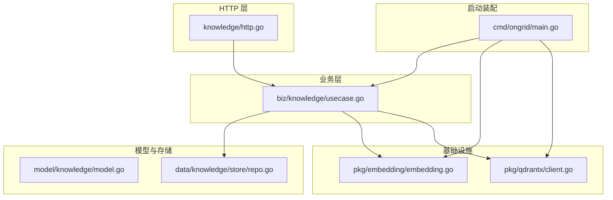
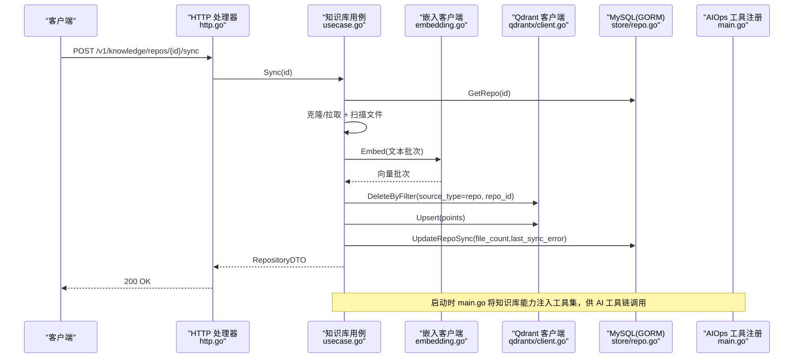
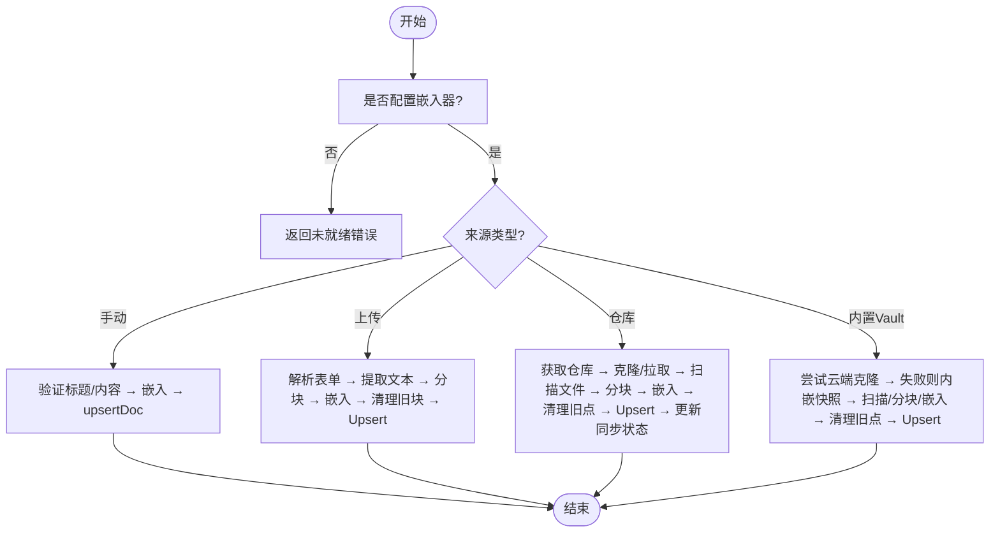
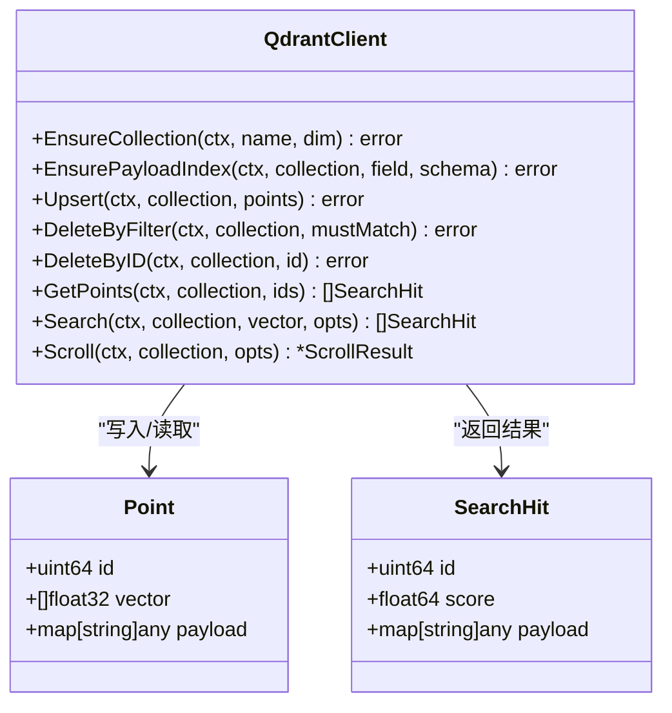
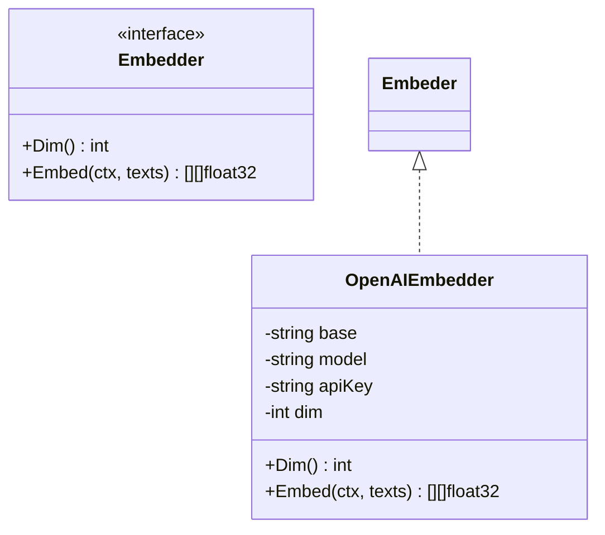
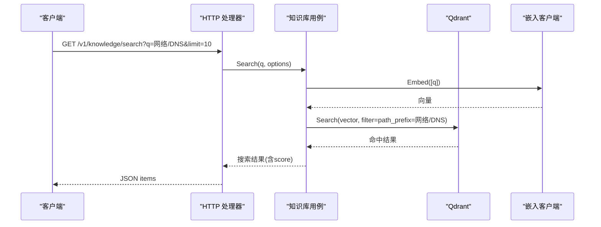
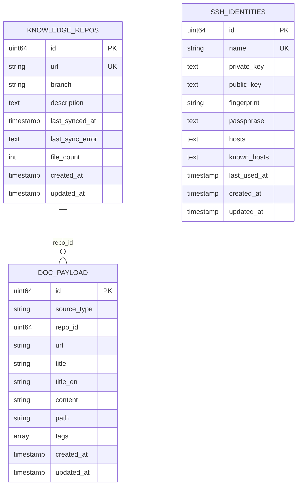
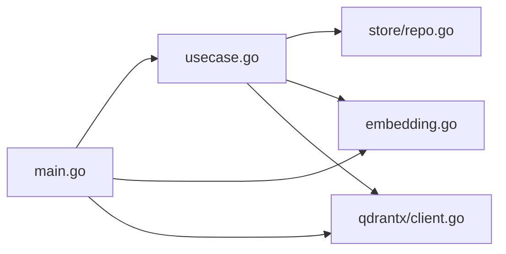
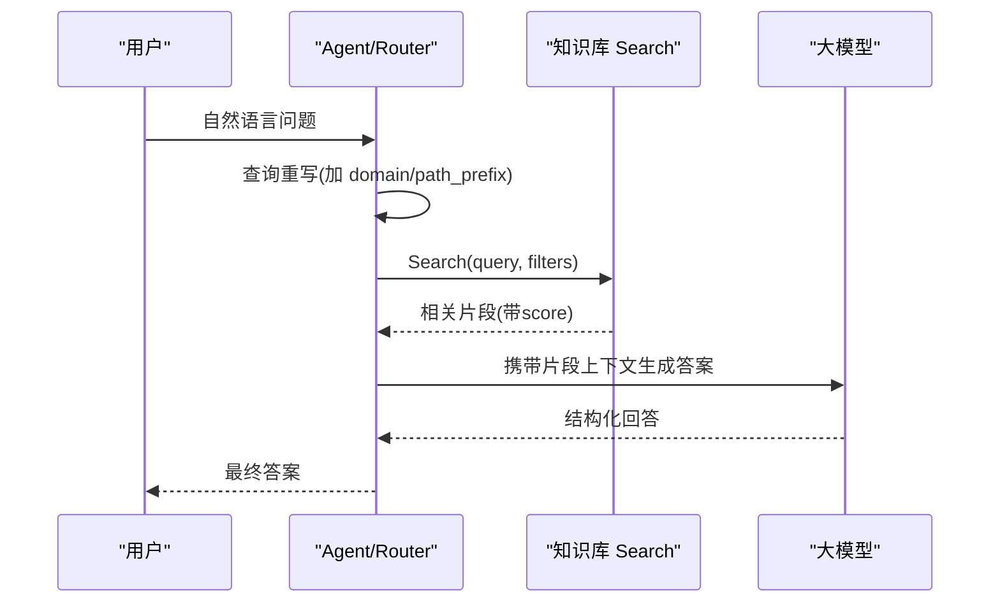

# 知识库与RAG系统

<cite>
**本文引用的文件**   
- [cmd/ongrid/main.go](file://cmd/ongrid/main.go)
- [internal/manager/biz/knowledge/usecase.go](file://internal/manager/biz/knowledge/usecase.go)
- [internal/manager/server/knowledge/http.go](file://internal/manager/server/knowledge/http.go)
- [internal/manager/data/knowledge/store/repo.go](file://internal/manager/data/knowledge/store/repo.go)
- [internal/manager/model/knowledge/model.go](file://internal/manager/model/knowledge/model.go)
- [internal/pkg/qdrantx/client.go](file://internal/pkg/qdrantx/client.go)
- [internal/pkg/embedding/embedding.go](file://internal/pkg/embedding/embedding.go)
- [scripts/sync-builtin-vault.sh](file://scripts/sync-builtin-vault.sh)
</cite>

## 目录
1. [简介](#简介)
2. [项目结构](#项目结构)
3. [核心组件](#核心组件)
4. [架构总览](#架构总览)
5. [详细组件分析](#详细组件分析)
6. [依赖关系分析](#依赖关系分析)
7. [性能考量](#性能考量)
8. [故障排查指南](#故障排查指南)
9. [结论](#结论)
10. [附录](#附录)

## 简介
本文件系统性阐述知识库与检索增强生成（RAG）系统的实现与使用，重点覆盖：
- 向量数据库 Qdrant 的集成：集合管理、索引、上载、过滤与相似度搜索。
- 文档嵌入与语义检索：多提供商兼容的 Embedder 接口、批处理与维度一致性。
- 内置知识库组织：来源类型、路径树、标签与去重策略。
- RAG 流程：查询重写、上下文检索、结果排序与答案融合（结合工具链）。
- 知识更新机制：版本化同步、增量索引与幂等重建。
- 自定义知识源接入：Git 仓库、文件系统与内置 Vault 的接入方式。
- 最佳实践：文档规范、元数据设计与检索效果优化建议。

## 项目结构
知识库与 RAG 相关代码主要分布在以下层次：
- HTTP 层：路由定义、鉴权与审计、请求解析与响应封装。
- 业务层（Usecase）：编排 Git 克隆/拉取、文件扫描、分块、嵌入、Qdrant 写入与搜索。
- 模型与存储：MySQL/GORM 仅保存仓库注册与 SSH 凭证；文档内容全部落盘于 Qdrant。
- 基础设施：Embedding 客户端（OpenAI 兼容）、Qdrant HTTP 封装。
- 启动装配：主进程初始化迁移、Embedder、Qdrant 集合与索引、将知识库能力注入工具集。

图表来源
- [internal/manager/server/knowledge/http.go:110-137](file://internal/manager/server/knowledge/http.go#L110-L137)
- [internal/manager/biz/knowledge/usecase.go:121-167](file://internal/manager/biz/knowledge/usecase.go#L121-L167)
- [internal/manager/data/knowledge/store/repo.go:20-31](file://internal/manager/data/knowledge/store/repo.go#L20-L31)
- [internal/manager/model/knowledge/model.go:24-38](file://internal/manager/model/knowledge/model.go#L24-L38)
- [internal/pkg/embedding/embedding.go:72-85](file://internal/pkg/embedding/embedding.go#L72-L85)
- [internal/pkg/qdrantx/client.go:51-116](file://internal/pkg/qdrantx/client.go#L51-L116)
- [cmd/ongrid/main.go:1354-1361](file://cmd/ongrid/main.go#L1354-L1361)

章节来源
- [internal/manager/server/knowledge/http.go:110-137](file://internal/manager/server/knowledge/http.go#L110-L137)
- [internal/manager/biz/knowledge/usecase.go:121-167](file://internal/manager/biz/knowledge/usecase.go#L121-L167)
- [internal/manager/data/knowledge/store/repo.go:20-31](file://internal/manager/data/knowledge/store/repo.go#L20-L31)
- [internal/manager/model/knowledge/model.go:24-38](file://internal/manager/model/knowledge/model.go#L24-L38)
- [internal/pkg/embedding/embedding.go:72-85](file://internal/pkg/embedding/embedding.go#L72-L85)
- [internal/pkg/qdrantx/client.go:51-116](file://internal/pkg/qdrantx/client.go#L51-L116)
- [cmd/ongrid/main.go:1354-1361](file://cmd/ongrid/main.go#L1354-L1361)

## 核心组件
- 知识库服务（Usecase）
  - 职责：编排文档入库（手动/上传/仓库/内置 Vault）、分块与嵌入、Qdrant 写入与搜索、列表与路径统计、删除与移动。
  - 关键特性：按 source_type 区分来源；支持 path/path_prefix/tags 服务端过滤；幂等 ID 与 id_alias 去重；批量嵌入与 Upsert。
- Qdrant 客户端
  - 职责：集合创建/校验维度、负载字段索引、Upsert、DeleteByFilter、Search、Scroll。
  - 约定：单集合、Cosine 距离、uint64 点 ID、payload 包含 source_type/title/content/url 等。
- 嵌入客户端（Embedder）
  - 职责：OpenAI 兼容 /v1/embeddings 调用，支持 GLM/Qwen/DeepSeek 等；本地 ONNX 模式预留接口；自动拼接 BaseURL 尾缀；Zhipu JWT 签名适配。
- 模型与持久化
  - MySQL 仅存仓库注册与 SSH 凭证；所有文档正文与向量均在 Qdrant。
- HTTP 服务
  - 暴露 REST API：文档 CRUD、上传、搜索、路径树、仓库注册/同步/删除、内置 Vault 同步、SSH 凭证管理。

章节来源
- [internal/manager/biz/knowledge/usecase.go:121-167](file://internal/manager/biz/knowledge/usecase.go#L121-L167)
- [internal/pkg/qdrantx/client.go:29-46](file://internal/pkg/qdrantx/client.go#L29-L46)
- [internal/pkg/embedding/embedding.go:72-85](file://internal/pkg/embedding/embedding.go#L72-L85)
- [internal/manager/model/knowledge/model.go:24-38](file://internal/manager/model/knowledge/model.go#L24-L38)
- [internal/manager/server/knowledge/http.go:110-137](file://internal/manager/server/knowledge/http.go#L110-L137)

## 架构总览
下图展示从用户请求到向量检索与 LLM 工具调用的端到端链路。

图表来源
- [internal/manager/server/knowledge/http.go:522-542](file://internal/manager/server/knowledge/http.go#L522-L542)
- [internal/manager/biz/knowledge/usecase.go:905-1094](file://internal/manager/biz/knowledge/usecase.go#L905-L1094)
- [internal/manager/data/knowledge/store/repo.go:72-87](file://internal/manager/data/knowledge/store/repo.go#L72-L87)
- [internal/pkg/embedding/embedding.go:151-214](file://internal/pkg/embedding/embedding.go#L151-L214)
- [internal/pkg/qdrantx/client.go:177-203](file://internal/pkg/qdrantx/client.go#L177-L203)
- [cmd/ongrid/main.go:1354-1361](file://cmd/ongrid/main.go#L1354-L1361)

## 详细组件分析

### 组件一：知识库业务用例（Usecase）
- 文档入库
  - 手动文档：标题+内容→嵌入→单点 Upsert。
  - 上传文档：multipart 解析→文本提取→分块→嵌入→按 URL 幂等清理旧块→Upsert。
  - 仓库同步：git clone/fetch → 文件扫描（限制扩展名与大小）→分块→嵌入→按 repo_id 幂等重建。
  - 内置 Vault：优先云端克隆，失败回退至二进制内嵌快照，统一走 scan→chunk→embed→upsert。
- 搜索与列表
  - Search：对查询文本嵌入后执行 Cosine top-K，支持 path/path_prefix/tags 服务端过滤，父级去重。
  - ListDocs/ListPaths：Scroll + 按 id_alias 去重，返回逻辑文档条目与路径计数。
- 版本与增量
  - 先 DeleteByFilter 再 Upsert，保证幂等重建；ID 基于 scope||url 派生，稳定可覆盖。
- 错误与健壮性
  - Git 网络抖动重试、原子替换克隆目录、临时文件清理、超时与 WaitDelay 防挂起。

图表来源
- [internal/manager/biz/knowledge/usecase.go:184-217](file://internal/manager/biz/knowledge/usecase.go#L184-L217)
- [internal/manager/biz/knowledge/usecase.go:234-318](file://internal/manager/biz/knowledge/usecase.go#L234-L318)
- [internal/manager/biz/knowledge/usecase.go:905-1094](file://internal/manager/biz/knowledge/usecase.go#L905-L1094)
- [internal/manager/biz/knowledge/usecase.go:1110-1201](file://internal/manager/biz/knowledge/usecase.go#L1110-L1201)

章节来源
- [internal/manager/biz/knowledge/usecase.go:184-217](file://internal/manager/biz/knowledge/usecase.go#L184-L217)
- [internal/manager/biz/knowledge/usecase.go:234-318](file://internal/manager/biz/knowledge/usecase.go#L234-L318)
- [internal/manager/biz/knowledge/usecase.go:905-1094](file://internal/manager/biz/knowledge/usecase.go#L905-L1094)
- [internal/manager/biz/knowledge/usecase.go:1110-1201](file://internal/manager/biz/knowledge/usecase.go#L1110-L1201)

### 组件二：Qdrant 客户端
- 集合与索引
  - EnsureCollection：检测并创建集合，维度不一致且无数据时安全重建；否则拒绝以避免数据丢失。
  - EnsurePayloadIndex：为 path、path_prefixes、tags、source_type、repo_id 等字段建立 keyword 索引，提升过滤性能。
- 数据操作
  - Upsert：批量写入点（含 payload 与向量）。
  - DeleteByFilter/DeleteByID：按条件或 ID 删除。
  - Search：top-K 余弦相似度，支持 MustMatch 过滤。
  - Scroll：分页滚动列出 payload，用于列表与路径统计。

图表来源
- [internal/pkg/qdrantx/client.go:51-116](file://internal/pkg/qdrantx/client.go#L51-L116)
- [internal/pkg/qdrantx/client.go:159-175](file://internal/pkg/qdrantx/client.go#L159-L175)
- [internal/pkg/qdrantx/client.go:177-203](file://internal/pkg/qdrantx/client.go#L177-L203)
- [internal/pkg/qdrantx/client.go:272-302](file://internal/pkg/qdrantx/client.go#L272-L302)
- [internal/pkg/qdrantx/client.go:318-351](file://internal/pkg/qdrantx/client.go#L318-L351)

章节来源
- [internal/pkg/qdrantx/client.go:51-116](file://internal/pkg/qdrantx/client.go#L51-L116)
- [internal/pkg/qdrantx/client.go:159-175](file://internal/pkg/qdrantx/client.go#L159-L175)
- [internal/pkg/qdrantx/client.go:177-203](file://internal/pkg/qdrantx/client.go#L177-L203)
- [internal/pkg/qdrantx/client.go:272-302](file://internal/pkg/qdrantx/client.go#L272-L302)
- [internal/pkg/qdrantx/client.go:318-351](file://internal/pkg/qdrantx/client.go#L318-L351)

### 组件三：嵌入客户端（Embedder）
- 提供商抽象
  - OpenAI 兼容：POST /v1/embeddings，智能拼接 BaseURL 尾缀；支持 Zhipu JWT 签名。
  - 本地模式预留：fastembed/onnx 接口已定义，便于离线部署。
- 批处理与维度
  - 批量输入保持顺序；Dim() 用于集合维度对齐；默认 1536，可通过环境变量覆盖。
- 错误处理
  - 维度不匹配、返回数量不一致、Provider 错误消息透传。

图表来源
- [internal/pkg/embedding/embedding.go:38-48](file://internal/pkg/embedding/embedding.go#L38-L48)
- [internal/pkg/embedding/embedding.go:72-85](file://internal/pkg/embedding/embedding.go#L72-L85)
- [internal/pkg/embedding/embedding.go:151-214](file://internal/pkg/embedding/embedding.go#L151-L214)

章节来源
- [internal/pkg/embedding/embedding.go:72-85](file://internal/pkg/embedding/embedding.go#L72-L85)
- [internal/pkg/embedding/embedding.go:151-214](file://internal/pkg/embedding/embedding.go#L151-L214)

### 组件四：HTTP 服务与路由
- 文档接口：GET/POST/PATCH/DELETE /v1/knowledge/docs，支持路径与标签过滤、分页。
- 上传接口：POST /v1/knowledge/upload，支持 .md/.txt/.pdf/.docx 文本提取。
- 搜索接口：GET /v1/knowledge/search?q=&limit=&path=&path_prefix=&tag=...
- 仓库接口：CRUD /v1/knowledge/repos，触发同步 /repos/{id}/sync。
- 内置 Vault：POST /v1/knowledge/vault/sync，返回 file_count 与 source（cloud/embedded）。
- 权限与审计：可选 Casbin 中间件；写操作记录审计事件。

图表来源
- [internal/manager/server/knowledge/http.go:424-455](file://internal/manager/server/knowledge/http.go#L424-L455)
- [internal/manager/biz/knowledge/usecase.go:732-802](file://internal/manager/biz/knowledge/usecase.go#L732-L802)
- [internal/pkg/qdrantx/client.go:272-302](file://internal/pkg/qdrantx/client.go#L272-L302)
- [internal/pkg/embedding/embedding.go:151-214](file://internal/pkg/embedding/embedding.go#L151-L214)

章节来源
- [internal/manager/server/knowledge/http.go:110-137](file://internal/manager/server/knowledge/http.go#L110-L137)
- [internal/manager/server/knowledge/http.go:424-455](file://internal/manager/server/knowledge/http.go#L424-L455)

### 组件五：模型与存储
- 来源类型
  - manual、repo、vault、upload，用于区分文档来源与权限边界。
- 仓库与 SSH 凭证
  - knowledge_repos：URL、Branch、FileCount、LastSyncedAt、LastSyncError。
  - ssh_identities：私钥、公钥指纹、hosts 白名单、known_hosts、使用时间戳。
- 文档结构
  - Doc：ID、SourceType、RepoID、URL、Title、TitleEN、Content、Path、Tags、时间戳。

图表来源
- [internal/manager/model/knowledge/model.go:42-52](file://internal/manager/model/knowledge/model.go#L42-L52)
- [internal/manager/model/knowledge/model.go:70-88](file://internal/manager/model/knowledge/model.go#L70-L88)
- [internal/manager/model/knowledge/model.go:108-129](file://internal/manager/model/knowledge/model.go#L108-L129)

章节来源
- [internal/manager/model/knowledge/model.go:24-38](file://internal/manager/model/knowledge/model.go#L24-L38)
- [internal/manager/model/knowledge/model.go:42-52](file://internal/manager/model/knowledge/model.go#L42-L52)
- [internal/manager/model/knowledge/model.go:70-88](file://internal/manager/model/knowledge/model.go#L70-L88)
- [internal/manager/model/knowledge/model.go:108-129](file://internal/manager/model/knowledge/model.go#L108-L129)

## 依赖关系分析
- 耦合与内聚
  - HTTP 层仅依赖 Service 接口，低耦合；Usecase 聚合 GORM Store、Embedder、QdrantClient，高内聚。
- 外部依赖
  - Qdrant（HTTP REST）、LLM 提供商（OpenAI 兼容）、Git 命令、文件系统。
- 潜在循环
  - 无直接循环依赖；通过接口解耦。
- 启动装配
  - main.go 在构建 AIOps 运行时前完成知识库迁移、仓库仓储、Embedder 与 Qdrant 初始化，并将知识库能力注入工具集。

图表来源
- [cmd/ongrid/main.go:1354-1361](file://cmd/ongrid/main.go#L1354-L1361)
- [internal/manager/biz/knowledge/usecase.go:121-167](file://internal/manager/biz/knowledge/usecase.go#L121-L167)
- [internal/manager/data/knowledge/store/repo.go:20-31](file://internal/manager/data/knowledge/store/repo.go#L20-L31)

章节来源
- [cmd/ongrid/main.go:1354-1361](file://cmd/ongrid/main.go#L1354-L1361)
- [internal/manager/biz/knowledge/usecase.go:121-167](file://internal/manager/biz/knowledge/usecase.go#L121-L167)
- [internal/manager/data/knowledge/store/repo.go:20-31](file://internal/manager/data/knowledge/store/repo.go#L20-L31)

## 性能考量
- 嵌入批处理
  - 每批 32 条，降低单次请求开销，提高吞吐。
- 分块策略
  - chunkChars=2500，重叠 250，最大 256 块/文件，兼顾长文检索与预算控制。
- 过滤与索引
  - 为 path、path_prefixes、tags、source_type、repo_id 建 keyword 索引，避免全表扫描。
- 过采样与去重
  - 搜索 over-fetch 上限 200，按 parent_url/url/id 去重，确保最终 limit 唯一文档数。
- 集合维度一致性
  - 启动时 EnsureCollection 校验维度，防止后续写入报错。

[本节为通用指导，无需具体文件引用]

## 故障排查指南
- 未配置嵌入器
  - 现象：创建/更新/同步返回“未就绪”错误。
  - 处理：设置 ONGRID_EMBEDDING_API_KEY（或兼容变量），并确保维度一致。
- Qdrant 集合维度不匹配
  - 现象：提示集合已有数据且维度不同，拒绝重建。
  - 处理：备份后手动删除集合，或调整嵌入模型维度与环境变量。
- Git 同步失败
  - 现象：认证失败、DNS 解析失败、连接超时、速率限制等。
  - 处理：根据错误提示添加 SSH 凭证或 HTTPS token；检查网络与 DNS；必要时重试。
- 列表为空但向量存在
  - 现象：历史数据缺少 chunk_index 导致列表过滤失效。
  - 处理：新插入已修复；历史数据可通过重新同步或修正 payload 恢复。

章节来源
- [internal/manager/biz/knowledge/usecase.go:184-217](file://internal/manager/biz/knowledge/usecase.go#L184-L217)
- [internal/pkg/qdrantx/client.go:51-116](file://internal/pkg/qdrantx/client.go#L51-L116)
- [internal/manager/biz/knowledge/usecase.go:2211-2227](file://internal/manager/biz/knowledge/usecase.go#L2211-L2227)

## 结论
本系统以“轻量关系型元数据 + 向量全文检索”的架构实现了可扩展的知识库与 RAG 能力。通过统一的 Embedder 接口与 Qdrant 客户端，系统具备多提供商兼容与离线扩展潜力；通过幂等重建与原子替换，保障同步稳定性；通过路径树与标签体系，提供直观的文档组织与精准过滤。配合 AIOps 工具链，可在诊断与排障场景中快速检索相关知识，提升效率。

[本节为总结，无需具体文件引用]

## 附录

### RAG 检索增强生成流程（结合工具链）
- 查询重写
  - 由上层 Agent/Router 根据意图与上下文改写查询，补充领域限定（如 path_prefix）。
- 上下文检索
  - 调用知识库 Search，传入 path/path_prefix/tags 过滤，得到 top-K 片段。
- 结果排序
  - 基于余弦分数排序，并在应用层进行父级去重与截断。
- 答案融合
  - 将检索到的片段作为上下文提供给 LLM，结合其他工具输出形成最终回答。

[此图为概念流程，不映射具体源码文件]

### 知识更新机制、版本管理与增量索引策略
- 幂等重建
  - 同步前先 DeleteByFilter 清空旧点，再 Upsert 新点，确保“零残留”。
- 原子替换
  - 克隆到临时目录，成功后 os.Rename 原子替换，避免半态。
- 增量与重试
  - 快路径 fetch+reset，失败回退慢路径；网络抖动指数退避重试。
- 版本标记
  - repository.last_synced_at、last_sync_error、file_count 反映同步状态。

章节来源
- [internal/manager/biz/knowledge/usecase.go:905-1094](file://internal/manager/biz/knowledge/usecase.go#L905-L1094)
- [internal/manager/biz/knowledge/usecase.go:1451-1511](file://internal/manager/biz/knowledge/usecase.go#L1451-L1511)
- [internal/manager/data/knowledge/store/repo.go:72-87](file://internal/manager/data/knowledge/store/repo.go#L72-L87)

### 自定义知识源接入指南
- Git 仓库
  - 通过 HTTP 注册仓库 URL 与分支，触发同步；支持 SSH 身份与 HTTPS（未来 credential.helper）。
- 文件系统
  - 通过上传接口导入 .md/.txt/.pdf/.docx，内部转为文本并入库。
- 内置 Vault
  - 云端优先，失败回退内嵌快照；脚本 sync-builtin-vault.sh 可将上游 vault 内容打包进二进制。

章节来源
- [internal/manager/server/knowledge/http.go:498-542](file://internal/manager/server/knowledge/http.go#L498-L542)
- [internal/manager/server/knowledge/http.go:296-353](file://internal/manager/server/knowledge/http.go#L296-L353)
- [internal/manager/biz/knowledge/usecase.go:1110-1201](file://internal/manager/biz/knowledge/usecase.go#L1110-L1201)
- [scripts/sync-builtin-vault.sh:1-35](file://scripts/sync-builtin-vault.sh#L1-L35)

### 知识库构建与维护最佳实践
- 文档规范
  - 使用 .md/.rst/.txt；合理划分 Path 层级；为长文档编写清晰标题与摘要。
- 元数据设计
  - 充分利用 path/path_prefix/tags 做细粒度过滤；为英文环境提供 TitleEN。
- 检索效果优化
  - 在调用 Search 时尽量传入 path_prefix 缩小范围；适当增大 limit 并结合去重；定期同步与清理无效仓库。
- 运维建议
  - 监控 last_sync_error 与 file_count；关注 Qdrant 集合维度与索引健康；对频繁变更的仓库采用短周期同步。

[本节为通用指导，无需具体文件引用]