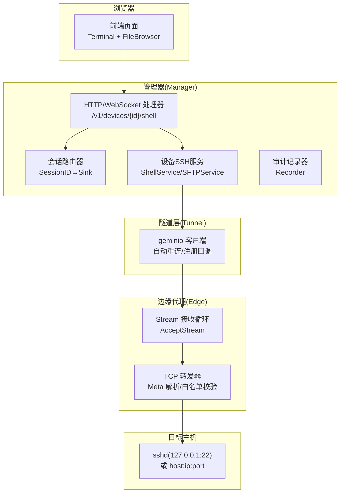
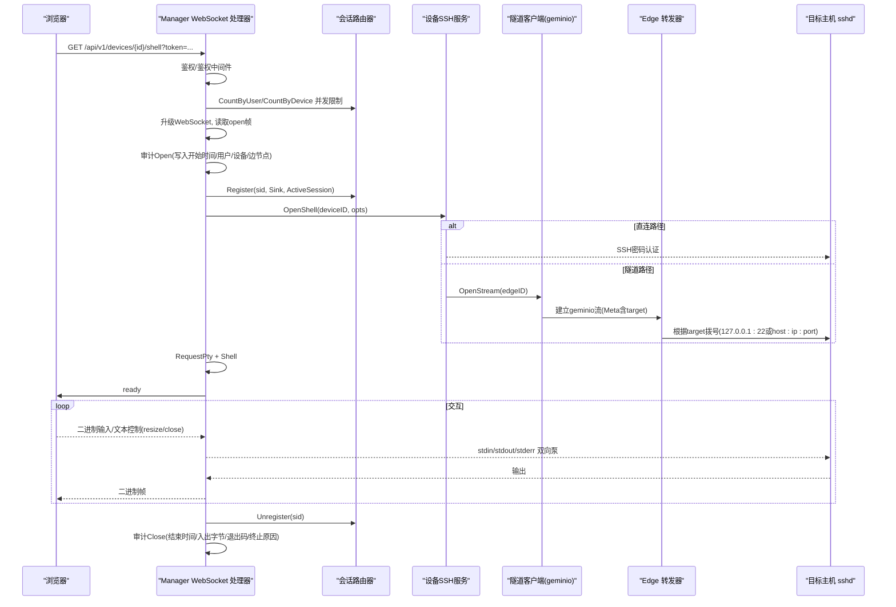
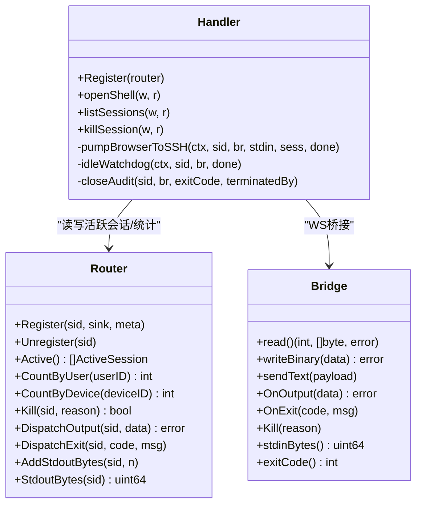
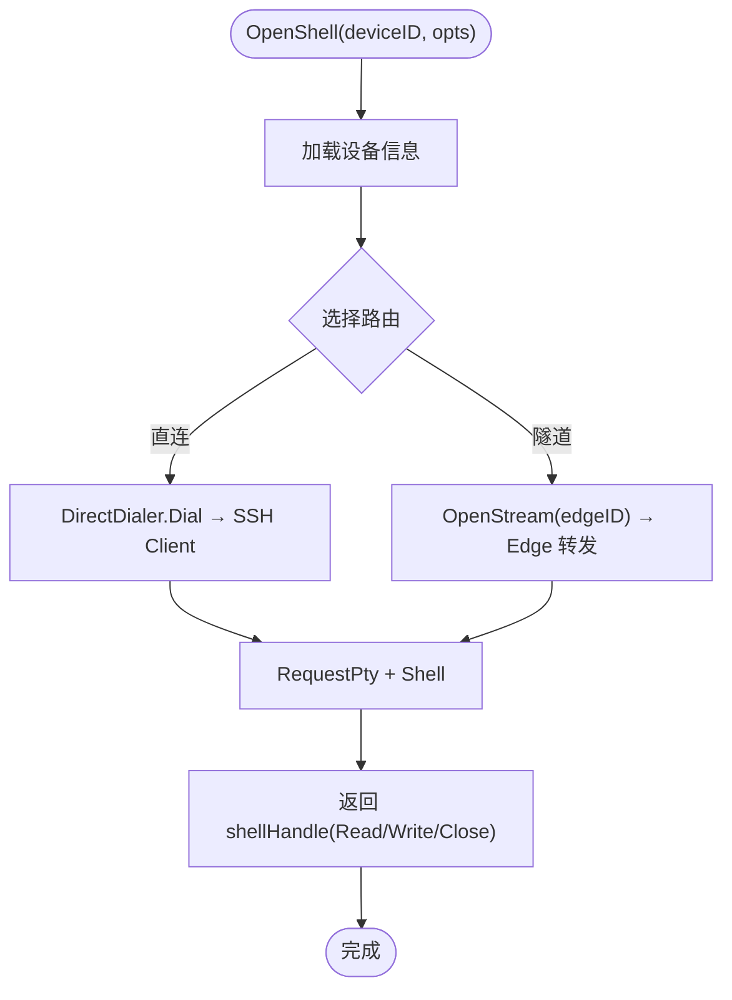
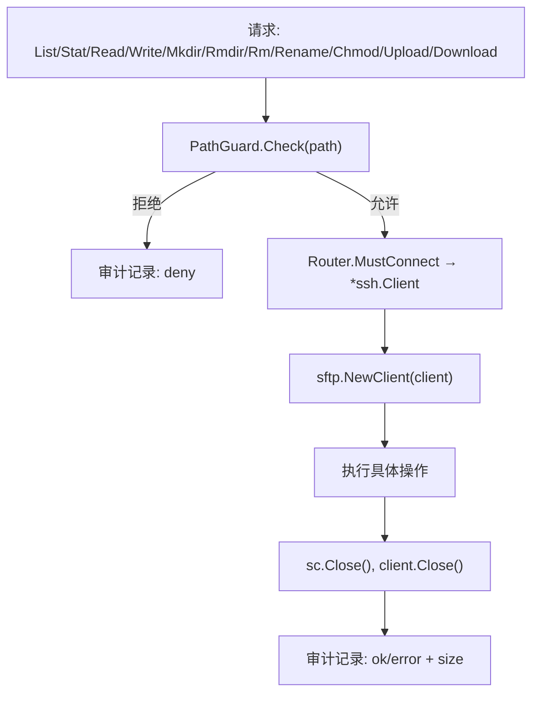
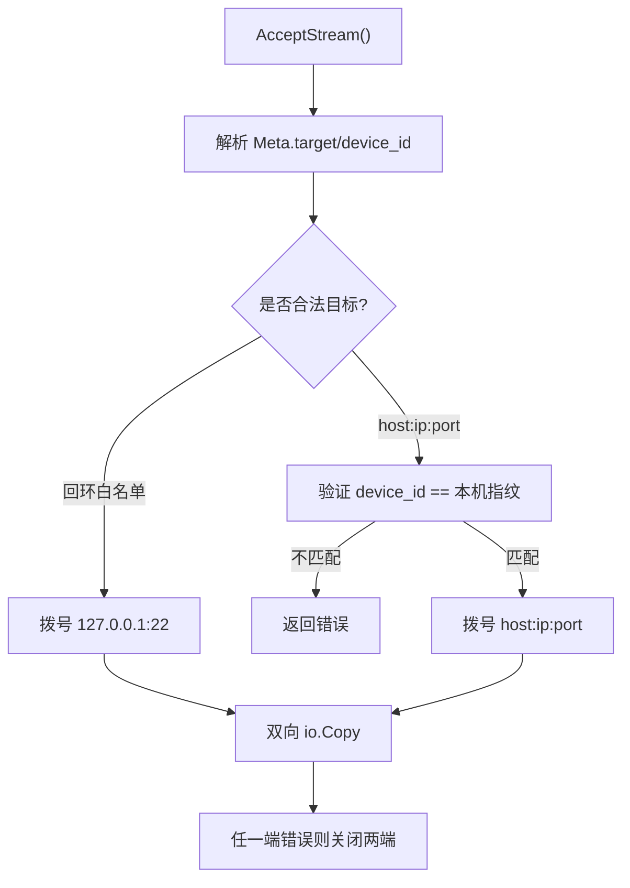
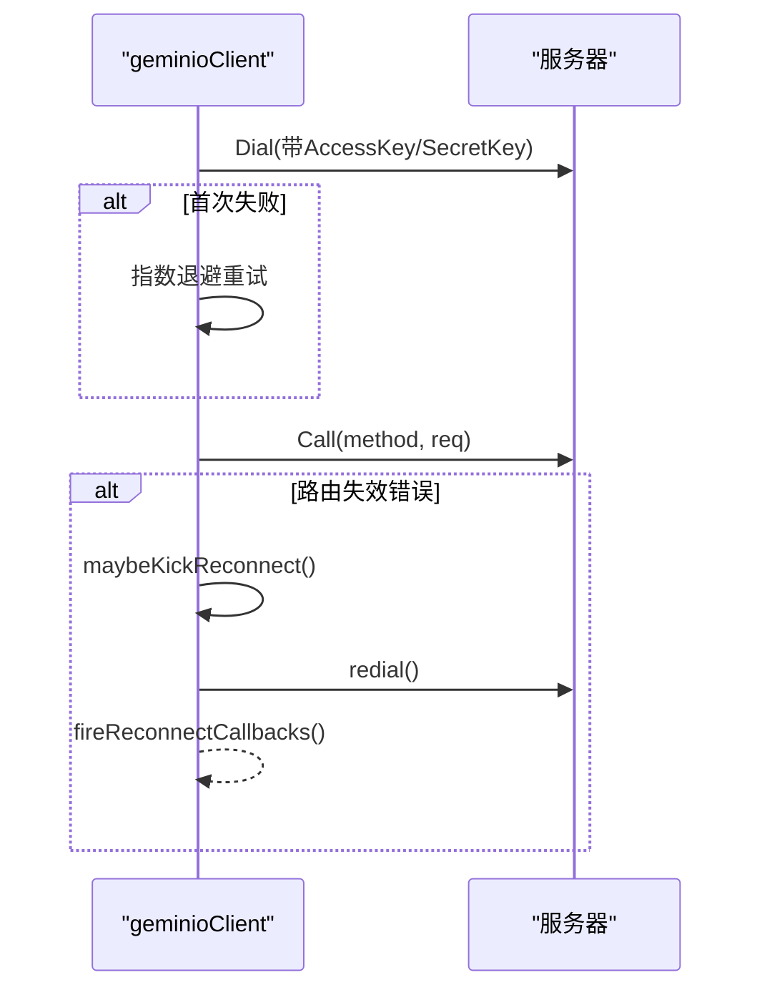
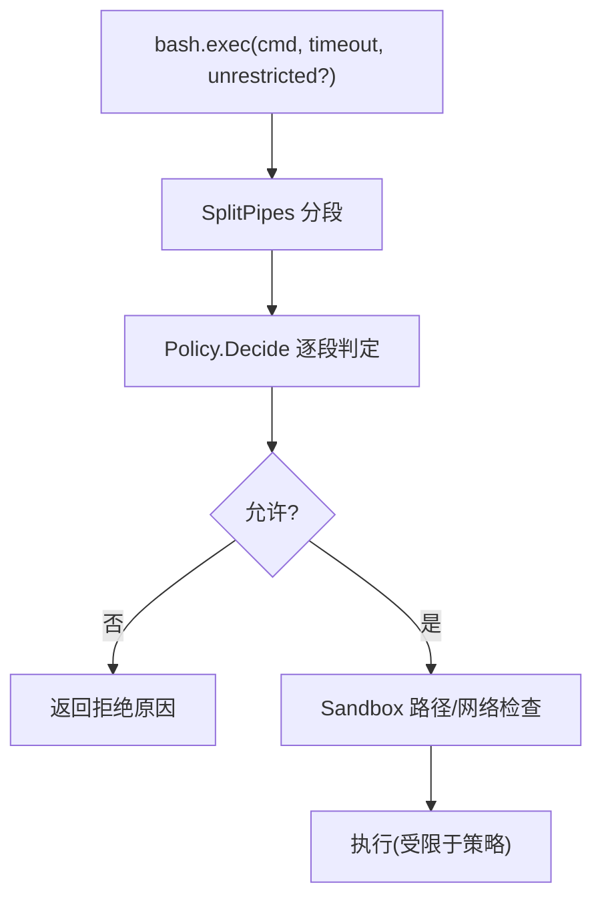
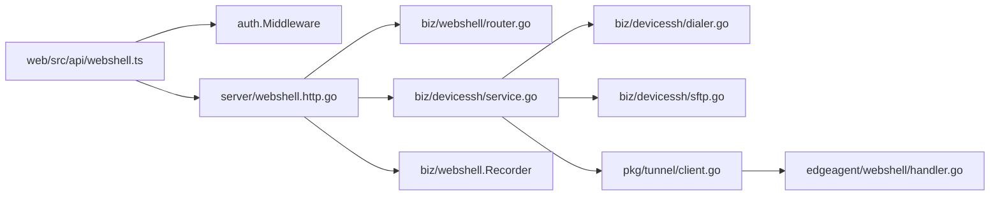

# WebShell系统

<cite>
**本文引用的文件**   
- [internal/manager/server/webshell/http.go](file://internal/manager/server/webshell/http.go)
- [internal/manager/biz/webshell/router.go](file://internal/manager/biz/webshell/router.go)
- [internal/edgeagent/webshell/handler.go](file://internal/edgeagent/webshell/handler.go)
- [internal/pkg/tunnel/client.go](file://internal/pkg/tunnel/client.go)
- [internal/manager/biz/devicessh/service.go](file://internal/manager/biz/devicessh/service.go)
- [internal/manager/biz/devicessh/dialer.go](file://internal/manager/biz/devicessh/dialer.go)
- [internal/manager/biz/devicessh/sftp.go](file://internal/manager/biz/devicessh/sftp.go)
- [web/src/api/webshell.ts](file://web/src/api/webshell.ts)
- [internal/edgeagent/cmdpolicy/policy.go](file://internal/edgeagent/cmdpolicy/policy.go)
</cite>

## 目录
1. [简介](#简介)
2. [项目结构](#项目结构)
3. [核心组件](#核心组件)
4. [架构总览](#架构总览)
5. [详细组件分析](#详细组件分析)
6. [依赖关系分析](#依赖关系分析)
7. [性能与配置调优](#性能与配置调优)
8. [故障排查指南](#故障排查指南)
9. [结论](#结论)
10. [附录](#附录)

## 简介
本文件面向运维人员，系统化阐述 WebShell 系统的实现与使用：基于 WebSocket 的安全浏览器 SSH 访问、设备 SSH 连接管理（直连与隧道）、SFTP 文件传输能力、命令审计与安全控制、多租户隔离机制，以及可观测性与性能调优建议。WebShell 通过 Manager 侧的 HTTP/WebSocket 入口建立会话，经 Edge Agent 将数据流转发到目标主机，全程具备认证、鉴权、审计与资源限制。

## 项目结构
WebShell 相关代码分布在以下层次：
- 前端：WebSocket 客户端封装与类型定义
- 管理器（Manager）：HTTP/WebSocket 处理、会话路由、审计记录、设备 SSH 服务与 SFTP 服务
- 边缘代理（Edge Agent）：轻量 TCP 转发器，负责按策略校验并转发字节流
- 通用隧道层：基于 geminio 的长连接与自动重连

**图示来源** 
- [internal/manager/server/webshell/http.go:108-125](file://internal/manager/server/webshell/http.go#L108-L125)
- [internal/manager/biz/webshell/router.go:57-90](file://internal/manager/biz/webshell/router.go#L57-L90)
- [internal/manager/biz/devicessh/service.go:100-155](file://internal/manager/biz/devicessh/service.go#L100-L155)
- [internal/pkg/tunnel/client.go:62-141](file://internal/pkg/tunnel/client.go#L62-L141)
- [internal/edgeagent/webshell/handler.go:49-76](file://internal/edgeagent/webshell/handler.go#L49-L76)

**章节来源**
- [internal/manager/server/webshell/http.go:108-125](file://internal/manager/server/webshell/http.go#L108-L125)
- [internal/manager/biz/webshell/router.go:57-90](file://internal/manager/biz/webshell/router.go#L57-L90)
- [internal/manager/biz/devicessh/service.go:100-155](file://internal/manager/biz/devicessh/service.go#L100-L155)
- [internal/pkg/tunnel/client.go:62-141](file://internal/pkg/tunnel/client.go#L62-L141)
- [internal/edgeagent/webshell/handler.go:49-76](file://internal/edgeagent/webshell/handler.go#L49-L76)

## 核心组件
- 前端 WebSocket 工厂：构造 wss/ws 地址、携带 token、协商子协议、发送 open/resize/close 控制帧
- 管理器 WebSocket 处理器：升级连接、并发限制、审计写入、PTY+Shell 生命周期、空闲超时
- 会话路由器：维护 SessionID→Sink 映射、活跃会话统计、按用户/设备计数、Kill 钩子
- 设备 SSH 服务：选择直连或隧道路径、创建 PTY Shell、返回 Read/Write/Close 句柄
- SFTP 服务：路径守卫、权限控制、上传下载、操作审计
- 边缘转发器：解析 Meta、校验 target/device_id、双向 io.Copy
- 隧道客户端：geminio 封装、指数退避重连、注册回调、错误分类触发重连

**章节来源**
- [web/src/api/webshell.ts:36-58](file://web/src/api/webshell.ts#L36-L58)
- [internal/manager/server/webshell/http.go:154-363](file://internal/manager/server/webshell/http.go#L154-L363)
- [internal/manager/biz/webshell/router.go:57-158](file://internal/manager/biz/webshell/router.go#L57-L158)
- [internal/manager/biz/devicessh/service.go:100-155](file://internal/manager/biz/devicessh/service.go#L100-L155)
- [internal/manager/biz/devicessh/sftp.go:117-389](file://internal/manager/biz/devicessh/sftp.go#L117-L389)
- [internal/edgeagent/webshell/handler.go:103-174](file://internal/edgeagent/webshell/handler.go#L103-L174)
- [internal/pkg/tunnel/client.go:218-331](file://internal/pkg/tunnel/client.go#L218-L331)

## 架构总览
WebShell 采用“浏览器 → Manager → Edge → sshd”的分层架构。Manager 承担认证鉴权、会话路由、审计与资源限制；Edge 仅做安全透传；目标主机提供标准 SSH 服务。

**图示来源** 
- [internal/manager/server/webshell/http.go:154-363](file://internal/manager/server/webshell/http.go#L154-L363)
- [internal/manager/biz/devicessh/service.go:100-155](file://internal/manager/biz/devicessh/service.go#L100-L155)
- [internal/pkg/tunnel/client.go:62-141](file://internal/pkg/tunnel/client.go#L62-L141)
- [internal/edgeagent/webshell/handler.go:103-174](file://internal/edgeagent/webshell/handler.go#L103-L174)

## 详细组件分析

### 组件A：WebSocket 终端与会话管理
- 功能要点
  - 前端构造 ws/wss URL，附加 token 查询参数，协商子协议
  - 后端在升级后要求首个文本帧为 open，包含 cols/rows/term/ssh_user/ssh_pass
  - 并发限制：每用户/每设备上限
  - 空闲超时：无输入则自动关闭
  - 审计：Open/Close 记录用户、设备、边节点、起止时间、入出字节、退出码、终止原因
  - Kill：管理员可主动终止会话

**图示来源** 
- [internal/manager/server/webshell/http.go:58-90](file://internal/manager/server/webshell/http.go#L58-L90)
- [internal/manager/biz/webshell/router.go:57-158](file://internal/manager/biz/webshell/router.go#L57-L158)
- [internal/manager/server/webshell/http.go:597-669](file://internal/manager/server/webshell/http.go#L597-L669)

**章节来源**
- [web/src/api/webshell.ts:36-58](file://web/src/api/webshell.ts#L36-L58)
- [internal/manager/server/webshell/http.go:154-363](file://internal/manager/server/webshell/http.go#L154-L363)
- [internal/manager/biz/webshell/router.go:57-158](file://internal/manager/biz/webshell/router.go#L57-L158)

### 组件B：设备 SSH 连接管理（直连与隧道）
- 功能要点
  - ShellService.OpenShell 加载设备信息，Router.Pick 决定直连或隧道
  - 直连：Manager 直接 SSH 到设备 IP:Port
  - 隧道：Manager 通过 geminio 打开到 Edge 的流，Edge 再拨号到目标
  - 支持强制路由（direct/tunnel/auto），不同端点可指定不同策略
  - 会话以 Read/Write/Close 暴露给上层

**图示来源** 
- [internal/manager/biz/devicessh/service.go:100-155](file://internal/manager/biz/devicessh/service.go#L100-L155)
- [internal/manager/biz/devicessh/dialer.go:86-125](file://internal/manager/biz/devicessh/dialer.go#L86-L125)

**章节来源**
- [internal/manager/biz/devicessh/service.go:100-155](file://internal/manager/biz/devicessh/service.go#L100-L155)
- [internal/manager/biz/devicessh/dialer.go:86-125](file://internal/manager/biz/devicessh/dialer.go#L86-L125)

### 组件C：SFTP 文件传输与权限控制
- 功能要点
  - 统一入口 withSFTP：Router.MustConnect → sftp.NewClient
  - 路径守卫 PathGuard.Check 对所有用户输入路径进行校验
  - 上传/下载/读写/删除/重命名/权限变更等操作均带审计
  - 大小限制：读默认 10MiB，写服务端上限 16MiB，下载上限 1GiB
  - 当前实现主要走直连路径（tunnel 路径占位）

**图示来源** 
- [internal/manager/biz/devicessh/sftp.go:88-114](file://internal/manager/biz/devicessh/sftp.go#L88-L114)
- [internal/manager/biz/devicessh/sftp.go:117-389](file://internal/manager/biz/devicessh/sftp.go#L117-L389)

**章节来源**
- [internal/manager/biz/devicessh/sftp.go:117-389](file://internal/manager/biz/devicessh/sftp.go#L117-L389)

### 组件D：边缘转发器与安全边界
- 功能要点
  - AcceptStream 循环接受来自 Manager 的流
  - 解析 Meta.target：
    - 白名单回环：127.0.0.1:22 / localhost:22
    - host:ip:port 模式需 device_id 匹配本机指纹
  - 双向 io.Copy 转发，任一方向出错即关闭两端

**图示来源** 
- [internal/edgeagent/webshell/handler.go:103-174](file://internal/edgeagent/webshell/handler.go#L103-L174)

**章节来源**
- [internal/edgeagent/webshell/handler.go:103-174](file://internal/edgeagent/webshell/handler.go#L103-L174)

### 组件E：隧道客户端与自动重连
- 功能要点
  - Dial 指数退避重连，最大间隔 60s
  - Call 失败时检测“路由失效”类错误，触发异步重连并回调 OnReconnect
  - AcceptStream 包装 StreamConn，屏蔽底层细节

**图示来源** 
- [internal/pkg/tunnel/client.go:62-141](file://internal/pkg/tunnel/client.go#L62-L141)
- [internal/pkg/tunnel/client.go:218-331](file://internal/pkg/tunnel/client.go#L218-L331)

**章节来源**
- [internal/pkg/tunnel/client.go:62-141](file://internal/pkg/tunnel/client.go#L62-L141)
- [internal/pkg/tunnel/client.go:218-331](file://internal/pkg/tunnel/client.go#L218-L331)

### 组件F：命令审计与安全控制（Edge 侧 bash 沙箱）
- 说明
  - Edge 侧对 LLM 驱动的 bash.exec 调用实施只读基线策略，包含二进制白名单、参数匹配、路径与网络白名单等
  - 可通过 YAML 覆盖扩展/替换规则
  - 注意：WebShell 的交互式终端由 Manager 侧发起 SSH PTY，不经过 Edge 的 bash 沙箱；bash 沙箱主要用于 AIops 工具链中的非交互式命令执行

**图示来源** 
- [internal/edgeagent/cmdpolicy/policy.go:707-800](file://internal/edgeagent/cmdpolicy/policy.go#L707-L800)

**章节来源**
- [internal/edgeagent/cmdpolicy/policy.go:707-800](file://internal/edgeagent/cmdpolicy/policy.go#L707-L800)

## 依赖关系分析
- 前端 webshell.ts 依赖后端 /api/v1/devices/{device_id}/shell 与 /api/v1/webshell/sessions*
- Manager HTTP 处理器依赖：
  - biz/webshell.Router（活跃会话与统计）
  - biz/devicessh.ShellService（设备 SSH 会话）
  - 审计 Recorder（持久化审计）
  - 设备/边节点仓库（查找在线 Edge）
- Edge 转发器依赖 tunnel.StreamConn 与本地设备指纹

**图示来源** 
- [web/src/api/webshell.ts:36-58](file://web/src/api/webshell.ts#L36-L58)
- [internal/manager/server/webshell/http.go:108-125](file://internal/manager/server/webshell/http.go#L108-L125)
- [internal/manager/biz/webshell/router.go:57-90](file://internal/manager/biz/webshell/router.go#L57-L90)
- [internal/manager/biz/devicessh/service.go:100-155](file://internal/manager/biz/devicessh/service.go#L100-L155)
- [internal/manager/biz/devicessh/dialer.go:86-125](file://internal/manager/biz/devicessh/dialer.go#L86-L125)
- [internal/manager/biz/devicessh/sftp.go:117-389](file://internal/manager/biz/devicessh/sftp.go#L117-L389)
- [internal/pkg/tunnel/client.go:62-141](file://internal/pkg/tunnel/client.go#L62-L141)
- [internal/edgeagent/webshell/handler.go:103-174](file://internal/edgeagent/webshell/handler.go#L103-L174)

**章节来源**
- [web/src/api/webshell.ts:36-58](file://web/src/api/webshell.ts#L36-L58)
- [internal/manager/server/webshell/http.go:108-125](file://internal/manager/server/webshell/http.go#L108-L125)
- [internal/manager/biz/webshell/router.go:57-90](file://internal/manager/biz/webshell/router.go#L57-L90)
- [internal/manager/biz/devicessh/service.go:100-155](file://internal/manager/biz/devicessh/service.go#L100-L155)
- [internal/manager/biz/devicessh/dialer.go:86-125](file://internal/manager/biz/devicessh/dialer.go#L86-L125)
- [internal/manager/biz/devicessh/sftp.go:117-389](file://internal/manager/biz/devicessh/sftp.go#L117-L389)
- [internal/pkg/tunnel/client.go:62-141](file://internal/pkg/tunnel/client.go#L62-L141)
- [internal/edgeagent/webshell/handler.go:103-174](file://internal/edgeagent/webshell/handler.go#L103-L174)

## 性能与配置调优
- 并发与限流
  - 每用户最大并发会话数：MaxSessionsPerUser
  - 每设备最大并发会话数：MaxSessionsPerDevice
- 超时设置
  - 空闲超时 IdleTimeout：无输入自动关闭
  - SSH 握手与 PTY 初始化均有超时保护
- 缓冲区与帧
  - WebSocket Upgrader 读写缓冲可调
  - 前端应设置 binaryType='arraybuffer' 以降低拷贝开销
- 隧道重连
  - 指数退避上限 60s；路由失效自动重连
- 资源限制
  - SFTP 读/写/下载大小上限
  - 审计记录入出字节用于监控吞吐

[本节为通用指导，无需特定文件引用]

## 故障排查指南
- 无法建立 WebSocket
  - 检查 Authorization/Bearer 或 ?token= 是否正确传递
  - 确认子协议协商一致
- 认证失败
  - 查看 auth_error 消息，常见为用户名或密码错误
- 设备离线
  - 列表在线 Edge 为空或状态非在线
- 会话被杀
  - 管理员 DELETE /webshell/sessions/{id} 或空闲超时
- 隧道不可用
  - 观察隧道重连日志与错误分类（路由失效/连接断开）
- SFTP 权限拒绝
  - 检查 PathGuard 规则与远端文件系统权限

**章节来源**
- [internal/manager/server/webshell/http.go:154-363](file://internal/manager/server/webshell/http.go#L154-L363)
- [internal/pkg/tunnel/client.go:218-331](file://internal/pkg/tunnel/client.go#L218-L331)
- [internal/manager/biz/devicessh/sftp.go:117-389](file://internal/manager/biz/devicessh/sftp.go#L117-L389)

## 结论
WebShell 通过分层设计与严格的安全边界，实现了安全的浏览器 SSH 访问与文件管理能力。Manager 集中承载认证鉴权、会话路由与审计，Edge 保持最小攻击面，隧道层保障高可用。配合并发限制、空闲超时与审计记录，可满足生产环境的运维需求。

## 附录
- 常用 API
  - WebSocket: GET /api/v1/devices/{device_id}/shell?token=...
  - 审计列表: GET /api/v1/webshell/sessions
  - 终止会话: DELETE /api/v1/webshell/sessions/{id}
- 前端注意事项
  - 设置 binaryType='arraybuffer'
  - 首帧发送 open 控制帧，随后发送 resize/close
  - 子协议 ongrid.shell.v1 保持一致

**章节来源**
- [web/src/api/webshell.ts:36-58](file://web/src/api/webshell.ts#L36-L58)
- [internal/manager/server/webshell/http.go:108-125](file://internal/manager/server/webshell/http.go#L108-L125)