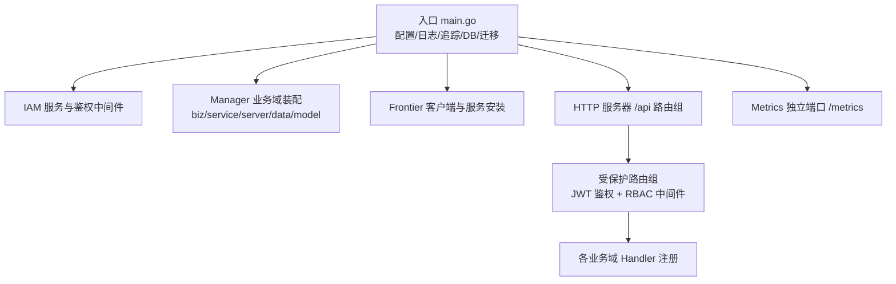
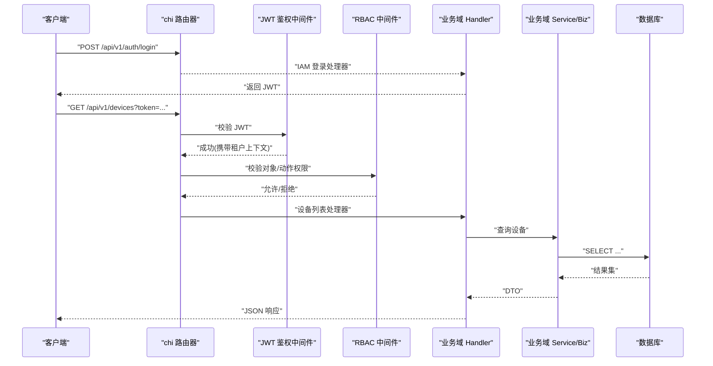
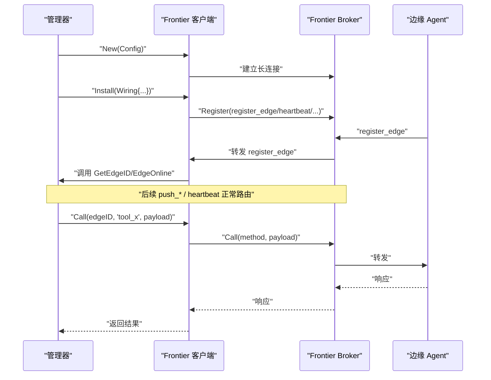
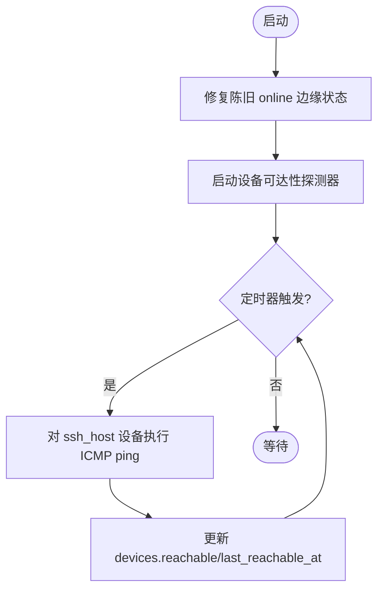
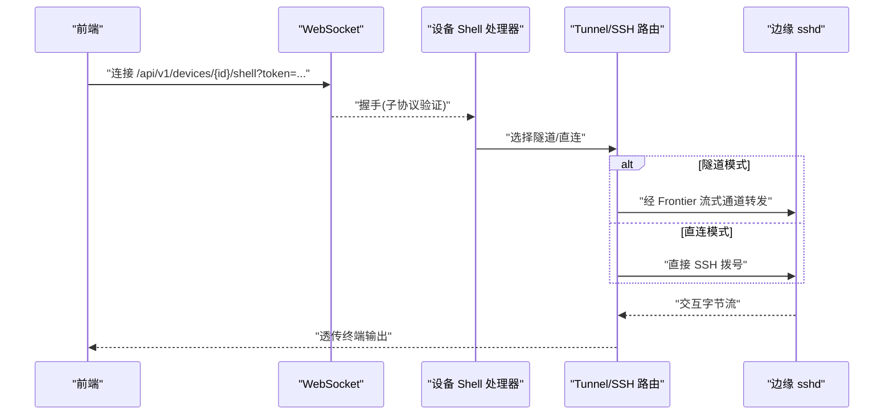
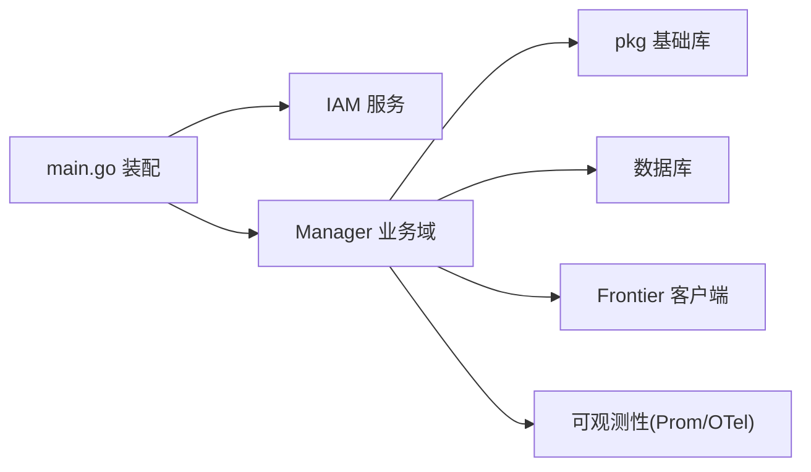

# 云端管理器服务

<cite>
**本文引用的文件**   
- [cmd/ongrid/main.go](file://cmd/ongrid/main.go)
- [internal/pkg/authzmw/middleware.go](file://internal/pkg/authzmw/middleware.go)
- [internal/manager/service/frontierbound/client.go](file://internal/manager/service/frontierbound/client.go)
- [internal/iam/server/http.go](file://internal/iam/server/http.go)
- [internal/pkg/prom/manager_metrics.go](file://internal/pkg/prom/manager_metrics.go)
- [web/src/api/webshell.ts](file://web/src/api/webshell.ts)
- [web/src/api/devices.ts](file://web/src/api/devices.ts)
</cite>

## 目录
1. [简介](#简介)
2. [项目结构](#项目结构)
3. [核心组件](#核心组件)
4. [架构总览](#架构总览)
5. [详细组件分析](#详细组件分析)
6. [依赖关系分析](#依赖关系分析)
7. [性能与可观测性](#性能与可观测性)
8. [故障排查指南](#故障排查指南)
9. [结论](#结论)
10. [附录：扩展点与自定义实现](#附录扩展点与自定义实现)

## 简介
本文件面向开发者与运维人员，系统性阐述云端管理器服务的架构设计、启动流程、HTTP API 初始化（路由、中间件、依赖注入）、各业务域（设备管理、AIOPS、告警、可观测性等）的服务层实现与业务逻辑、Frontier 消息中间件的集成方式（长连接、反向调用、边缘通信协议），以及配置管理、数据库迁移、错误处理、日志记录、健康检查、性能监控与故障恢复策略。文末提供扩展点与自定义实现的实践指南。

## 项目结构
管理器服务采用“按领域边界 + 分层”组织：server（HTTP/gRPC handler）→ service（跨域编排）→ biz（用例与领域模型）→ data（仓储实现）→ model（实体）。入口位于 cmd/ongrid/main.go，负责加载配置、初始化日志与追踪、打开数据库并执行迁移、组装 IAM 与管理域能力、注册 HTTP 路由与中间件、启动 Frontier 长连接与服务端反向调用处理器、拉起后台任务与健康检查等。



图示来源
- [cmd/ongrid/main.go:2350-2482](file://cmd/ongrid/main.go#L2350-L2482)
- [internal/pkg/authzmw/middleware.go:1-98](file://internal/pkg/authzmw/middleware.go#L1-L98)

章节来源
- [cmd/ongrid/main.go:195-276](file://cmd/ongrid/main.go#L195-L276)
- [cmd/ongrid/main.go:2350-2482](file://cmd/ongrid/main.go#L2350-L2482)

## 核心组件
- 配置与日志追踪
  - 从环境变量与配置文件加载运行参数；初始化 slog 结构化日志与 OpenTelemetry 追踪（默认上报至 Tempo OTLP HTTP 接收端）。
- 数据库与迁移
  - 通过 dbx.Open 打开后端（MySQL/SQLite），集中执行各子域的 Migrate 函数完成 schema 自管理。
- IAM 与 RBAC
  - 构建用户、组织、成员关系与 Casbin 授权器；提供 JWT 签发与校验；在 manager 侧以中间件形式对写操作进行 RBAC 控制。
- Manager 业务域
  - 设备管理、边缘节点、指标采集、告警、AIOPS、知识、市场、MCP、审批、监控面板、WebShell、系统健康/升级、审计、报告、工作流等。
- Frontier 边云协同
  - 建立到上游 frontier broker 的长连接，注册生命周期回调与反向调用处理器；支持 Call/OpenStream 直达边缘。
- HTTP API 与 Metrics
  - 主监听器暴露 /api 路由；独立端口暴露 /metrics 聚合 Prometheus 指标。

章节来源
- [cmd/ongrid/main.go:195-276](file://cmd/ongrid/main.go#L195-L276)
- [cmd/ongrid/main.go:282-391](file://cmd/ongrid/main.go#L282-L391)
- [cmd/ongrid/main.go:865-1223](file://cmd/ongrid/main.go#L865-L1223)
- [cmd/ongrid/main.go:2350-2482](file://cmd/ongrid/main.go#L2350-L2482)
- [internal/pkg/prom/manager_metrics.go:203-236](file://internal/pkg/prom/manager_metrics.go#L203-L236)

## 架构总览
管理器服务作为控制面，向上承载 Web/CLI 与外部系统集成，向下通过 Frontier 与边缘 Agent 通信，持久化数据落库，并通过 Prometheus/Grafana/Loki/Tempo 形成可观测闭环。

```mermaid
graph TB
subgraph "外部"
SPA["前端 SPA"]
Ops["运维工具/CI"]
IM["飞书/钉钉/Telegram 等"]
end
subgraph "管理器服务"
HTTP["HTTP 服务器 /api"]
AUTH["JWT 鉴权"]
RBAC["RBAC 中间件"]
BIZ["业务域 (设备/边缘/告警/AIOPS/...)"]
DB["数据库 (MySQL/SQLite)"]
PROM["Prometheus 指标"]
OTEL["OpenTelemetry 追踪"]
end
subgraph "边云协同"
FB["Frontier 客户端"]
BROKER["Frontier Broker"]
EDGE["边缘 Agent"]
end
SPA --> HTTP
Ops --> HTTP
IM --> HTTP
HTTP --> AUTH --> RBAC --> BIZ
BIZ --> DB
BIZ --> PROM
BIZ --> OTEL
BIZ --> FB
FB < --> BROKER
BROKER < --> EDGE
```

图示来源
- [cmd/ongrid/main.go:2350-2482](file://cmd/ongrid/main.go#L2350-L2482)
- [internal/pkg/authzmw/middleware.go:1-98](file://internal/pkg/authzmw/middleware.go#L1-L98)
- [internal/manager/service/frontierbound/client.go:1-311](file://internal/manager/service/frontierbound/client.go#L1-L311)

## 详细组件分析

### HTTP API 服务器初始化与路由
- 公共路由
  - 认证登录/刷新、Prom 代理公开接口、IM 平台 webhook、页面分享公开读取等挂载于 /api 下不受 JWT 保护的分组。
- 受保护路由组
  - 统一使用 JWT 中间件校验身份，随后进入 RBAC 中间件进行对象/动作级授权。
  - 各业务域 Handler 在此注册，如设备、边缘、WebShell、指标、监控、日志、追踪、AIOPS、告警、系统健康/升级、IM 桥接、技能、知识库、设置、集成、市场、密钥、MCP、审批、审计、报告、工作流等。
- 版本与页面分享
  - /v1/version 返回管理器版本；页面分享通过带 TTL 的 token 提供无登录访问。



图示来源
- [cmd/ongrid/main.go:2350-2482](file://cmd/ongrid/main.go#L2350-L2482)
- [internal/iam/server/http.go:116-155](file://internal/iam/server/http.go#L116-L155)
- [internal/pkg/authzmw/middleware.go:1-98](file://internal/pkg/authzmw/middleware.go#L1-L98)

章节来源
- [cmd/ongrid/main.go:2350-2482](file://cmd/ongrid/main.go#L2350-L2482)
- [internal/iam/server/http.go:116-155](file://internal/iam/server/http.go#L116-L155)
- [internal/pkg/authzmw/middleware.go:1-98](file://internal/pkg/authzmw/middleware.go#L1-L98)

### 依赖注入与装配
- 入口集中装配：配置 → 日志/追踪 → DB/迁移 → IAM → 各业务域 Repo/UC/Service/Handler → 中间件 → 路由 → 后台任务。
- 关键注入点
  - IAM：用户仓库、JWT 签名器、Casbin 授权器、组织/成员服务。
  - 设置中心：system_settings 仓储与服务，为 LLM、Prom、Grafana、Loki、Tempo、WebSearch 等提供运行时配置。
  - AIOPS：多提供商 LLM 路由、聊天运行时、工具注册、协调器/工作者。
  - 设备/边缘：设备可达性探测、边缘在线状态修复、插件配置推送。
  - Frontier：客户端实例、反向调用安装、设备解析器、WebShell 路由。
  - 可观测性：Prometheus 指标注册、DB 池采样、RCA 并发度采样、会话采样。

章节来源
- [cmd/ongrid/main.go:282-391](file://cmd/ongrid/main.go#L282-L391)
- [cmd/ongrid/main.go:401-476](file://cmd/ongrid/main.go#L401-L476)
- [cmd/ongrid/main.go:532-727](file://cmd/ongrid/main.go#L532-L727)
- [cmd/ongrid/main.go:729-800](file://cmd/ongrid/main.go#L729-L800)
- [cmd/ongrid/main.go:865-1223](file://cmd/ongrid/main.go#L865-L1223)
- [cmd/ongrid/main.go:2496-2600](file://cmd/ongrid/main.go#L2496-L2600)

### Frontier 消息中间件集成
- 长连接建立
  - 根据配置创建 Client，直连 upstream frontier broker；支持禁用模式（e2e/降级场景）。
- 反向调用注册
  - 安装 register_edge、heartbeat、push_host_metrics、push_prom_samples、get_plugin_configs、shell_output、shell_exit 等方法处理器，以及 GetEdgeID、EdgeOnline、EdgeOffline 生命周期回调。
- 边缘通信协议
  - 基于 geminio 的 Request/Response 与 Stream 抽象；manager 侧封装 Client，将 edgeID 与 transportID 映射，屏蔽底层细节。
- 典型调用链
  - 管理端主动调用边缘：fbClient.Call(edgeID, method, body)。
  - 边缘主动回调：broker 转发请求至 manager 已注册的 handler。
  - 双向流：OpenStream 用于 WebSSH 等透传场景。



图示来源
- [internal/manager/service/frontierbound/client.go:1-311](file://internal/manager/service/frontierbound/client.go#L1-L311)
- [cmd/ongrid/main.go:865-1223](file://cmd/ongrid/main.go#L865-L1223)

章节来源
- [internal/manager/service/frontierbound/client.go:1-311](file://internal/manager/service/frontierbound/client.go#L1-L311)
- [cmd/ongrid/main.go:865-1223](file://cmd/ongrid/main.go#L865-L1223)

### 业务域概览与关键流程

#### 设备管理与边缘节点
- 设备可达性探测：定时对所有具备 ssh_host 的设备执行 ICMP ping，回写 reachable 与 last_reachable_at。
- 边缘在线状态修复：启动时扫描 stale online 的 edge 行，依据阈值置 offline。
- 插件配置推送：变更 plugin_config 后通过 fbClient 实时推送到受影响边缘。



图示来源
- [cmd/ongrid/main.go:740-765](file://cmd/ongrid/main.go#L740-L765)
- [cmd/ongrid/main.go:2582-2598](file://cmd/ongrid/main.go#L2582-L2598)

章节来源
- [cmd/ongrid/main.go:740-765](file://cmd/ongrid/main.go#L740-L765)
- [cmd/ongrid/main.go:2582-2598](file://cmd/ongrid/main.go#L2582-L2598)

#### 告警与 RCA 调查
- 评估流水线：PhaseA/PhaseB 评估器、抑制、重试、路由、预览等。
- 调查器：RCA worker 并发度采样，启动时失败孤儿调查任务以避免 UI 死转圈。

章节来源
- [cmd/ongrid/main.go:767-777](file://cmd/ongrid/main.go#L767-L777)
- [cmd/ongrid/main.go:2557-2572](file://cmd/ongrid/main.go#L2557-L2572)

#### AIOPS 与多提供商 LLM
- 多提供商路由：OpenAI、Anthropic、智谱 GLM、Gemini、DeepSeek、Kimi 等，支持动态提供者目录与默认提供者。
- 聊天运行时：协调器/工作者、工具注册、审查门控（ReviewGate）与子代理控制工具。
- 工具生态：配置变更草稿/应用、重启服务等 mutating 工具需管理员确认与审核。

章节来源
- [cmd/ongrid/main.go:532-727](file://cmd/ongrid/main.go#L532-L727)
- [internal/manager/biz/aiops/tools/registry_basetool.go:158-188](file://internal/manager/biz/aiops/tools/registry_basetool.go#L158-L188)

#### 可观测性与集成
- 指标：HTTP 请求计数与时延、DB 池状态、LLM 调用计数等。
- 追踪：OpenTelemetry 初始化与上报，供 Grafana/Tempo 消费。
- 日志：slog 结构化日志，按组件打标签。
- 外部集成：Grafana 仪表盘同步、Loki/Tempo URL 种子、Prom 远程写入与查询。

章节来源
- [internal/pkg/prom/manager_metrics.go:203-236](file://internal/pkg/prom/manager_metrics.go#L203-L236)
- [cmd/ongrid/main.go:218-241](file://cmd/ongrid/main.go#L218-L241)
- [cmd/ongrid/main.go:401-476](file://cmd/ongrid/main.go#L401-L476)

#### WebShell 与设备 SSH/SFTP
- 前端通过 WebSocket 子协议 ongird.shell.v1 连接 /api/v1/devices/:id/shell 或 shell-direct。
- 隧道模式经由 Frontier 流式通道直达边缘本地 sshd；直连模式由管理器直接拨号目标 IP。



图示来源
- [web/src/api/webshell.ts:29-58](file://web/src/api/webshell.ts#L29-L58)
- [cmd/ongrid/main.go:2444-2456](file://cmd/ongrid/main.go#L2444-L2456)

章节来源
- [web/src/api/webshell.ts:29-58](file://web/src/api/webshell.ts#L29-L58)
- [cmd/ongrid/main.go:2444-2456](file://cmd/ongrid/main.go#L2444-L2456)

## 依赖关系分析
- 低耦合高内聚：每个业务域按 server/service/biz/data/model 分层，依赖方向自上而下。
- 共享基础设施：dbx、auth、prom、tracing、notify、secretbox、workspace 等 pkg 被多处复用。
- 外部依赖：frontier broker、LLM 提供商、Grafana/Loki/Tempo/Prometheus。



图示来源
- [cmd/ongrid/main.go:2350-2482](file://cmd/ongrid/main.go#L2350-L2482)
- [internal/manager/service/frontierbound/client.go:1-311](file://internal/manager/service/frontierbound/client.go#L1-L311)

章节来源
- [cmd/ongrid/main.go:2350-2482](file://cmd/ongrid/main.go#L2350-L2482)
- [internal/manager/service/frontierbound/client.go:1-311](file://internal/manager/service/frontierbound/client.go#L1-L311)

## 性能与可观测性
- 指标采集
  - HTTP 请求总量与时延、DB 池连接数/等待计数、LLM 调用计数、RCA 并发度、Worker 会话计数等。
- 追踪
  - 全局 OTel 初始化，Span 自动注入 HTTP 与下游调用，便于端到端定位。
- 健康检查
  - /v1/version 轻量探针；/metrics 暴露运行态；DB 池采样用于容量预警。
- 建议
  - 合理设置 DB 池大小与超时；对热点接口增加缓存；对长耗时任务异步化；结合 Prometheus 规则告警。

章节来源
- [internal/pkg/prom/manager_metrics.go:203-236](file://internal/pkg/prom/manager_metrics.go#L203-L236)
- [cmd/ongrid/main.go:2496-2600](file://cmd/ongrid/main.go#L2496-L2600)

## 故障排查指南
- 启动阶段
  - JWT 默认密钥未修改会拒绝启动；确保设置强随机密钥。
  - DB 迁移失败直接退出；查看迁移日志与 SQL 错误。
  - Frontier 禁用模式下，边缘相关功能将返回 ErrDisabled。
- 运行期
  - 设备在线状态异常：检查边缘心跳与 last_seen_at；关注 presence 重平衡任务。
  - 告警调查卡住：启动时会失败孤儿调查任务，避免 UI 死转圈。
  - 指标缺失：确认 /metrics 端口可达与 OTel 上报地址正确。
- 常见错误
  - 权限不足：RBAC 中间件返回 403；检查对象/动作与角色策略。
  - 边缘不可达：Check Frontier 连接与 ACK 可见性 race 防护日志。

章节来源
- [cmd/ongrid/main.go:282-287](file://cmd/ongrid/main.go#L282-L287)
- [cmd/ongrid/main.go:251-276](file://cmd/ongrid/main.go#L251-L276)
- [cmd/ongrid/main.go:865-884](file://cmd/ongrid/main.go#L865-L884)
- [cmd/ongrid/main.go:740-777](file://cmd/ongrid/main.go#L740-L777)
- [internal/pkg/authzmw/middleware.go:70-98](file://internal/pkg/authzmw/middleware.go#L70-L98)

## 结论
管理器服务以清晰的层次与模块化设计，整合了 IAM、设备/边缘管理、告警、AIOPS、可观测性与边云协同能力。通过统一的依赖注入与中间件机制，实现了可扩展、可观测、可治理的控制面。配合 Frontier 的长连接与反向调用，形成了稳定高效的边缘通信体系。

## 附录：扩展点与自定义实现
- 新增业务域
  - 在 internal/manager 下新建 biz/service/server/data/model 五层目录；在 main.go 中装配 Repo/UC/Service/Handler，并在受保护路由组注册。
- 自定义中间件
  - 参考 authzmw 模式，定义 Authorizer 接口与 chi 中间件装饰器，按需接入 RBAC。
- 新增 LLM 提供商
  - 在 providerConfigs 中添加新提供商配置，并在 LLMSettingsResolver 中补充默认值与模型列表。
- 新增边缘反向调用
  - 在 frontierbound.Install 中注册新的方法处理器，并在 biz 层实现对应逻辑。
- 新增指标与追踪
  - 在 prom.RegisterManagerMetrics 中注册新指标；在关键路径埋点 Span。

章节来源
- [cmd/ongrid/main.go:2350-2482](file://cmd/ongrid/main.go#L2350-L2482)
- [internal/pkg/authzmw/middleware.go:1-98](file://internal/pkg/authzmw/middleware.go#L1-L98)
- [cmd/ongrid/main.go:532-727](file://cmd/ongrid/main.go#L532-L727)
- [cmd/ongrid/main.go:865-1223](file://cmd/ongrid/main.go#L865-L1223)
- [internal/pkg/prom/manager_metrics.go:203-236](file://internal/pkg/prom/manager_metrics.go#L203-L236)