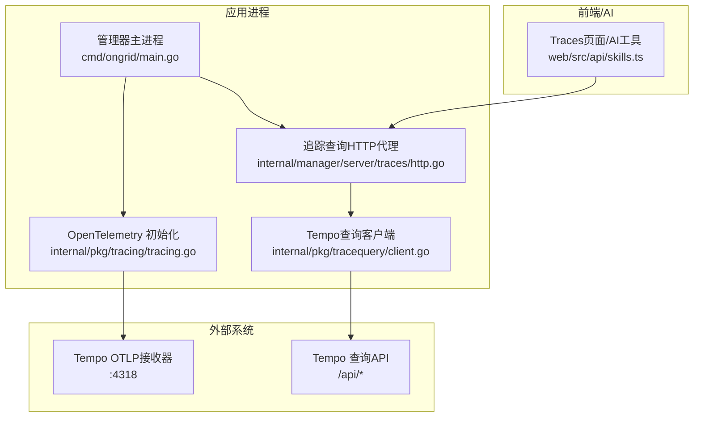
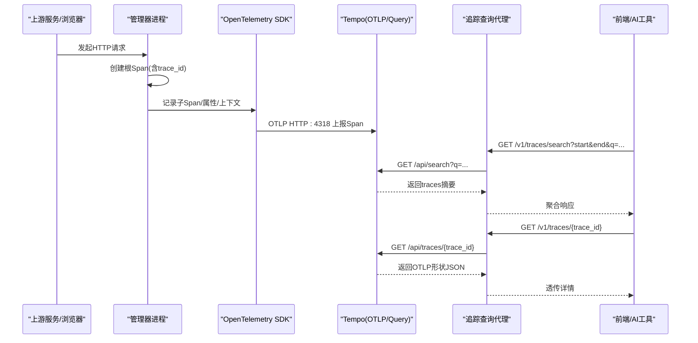
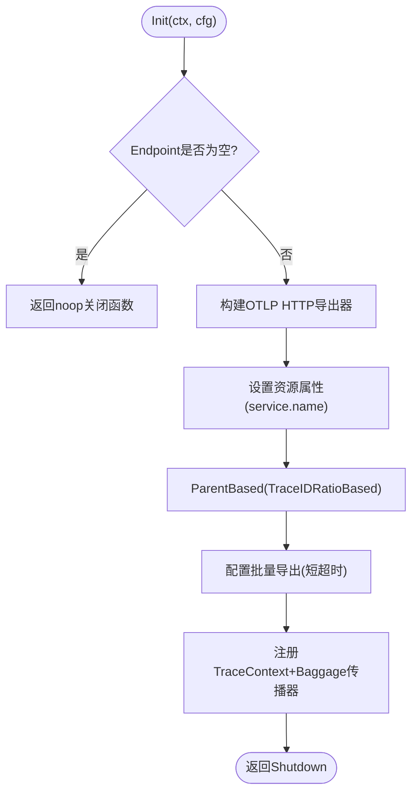
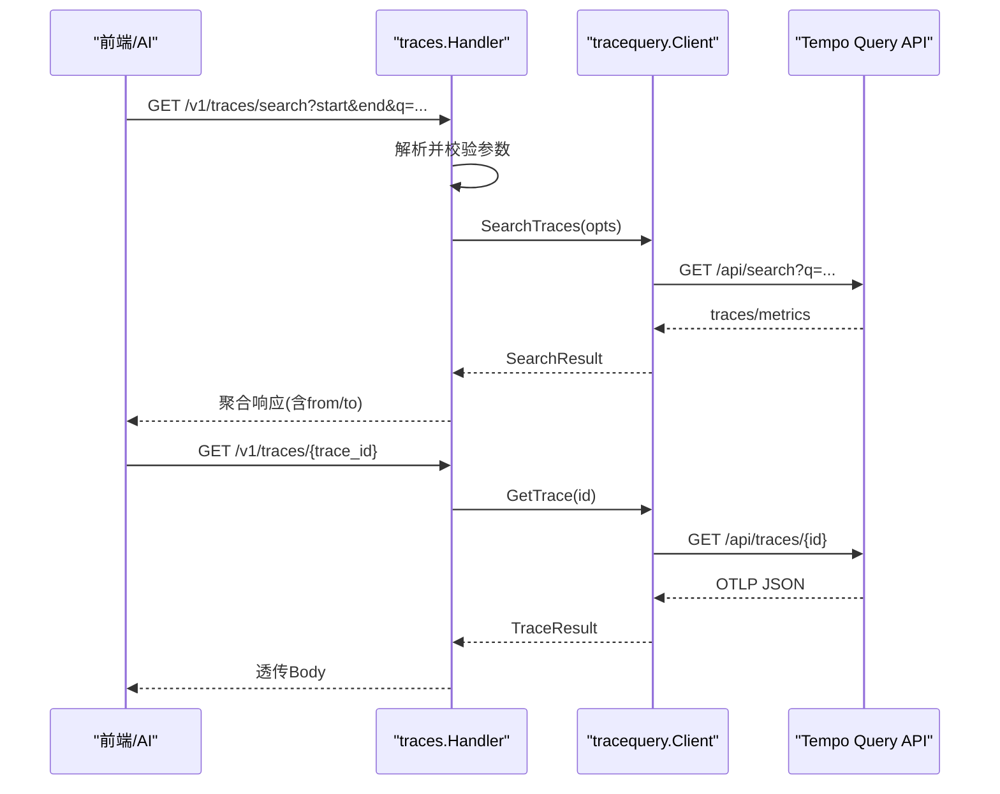
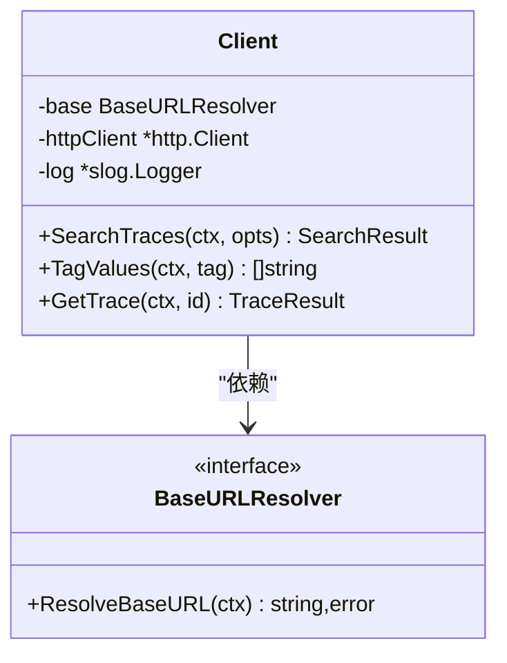
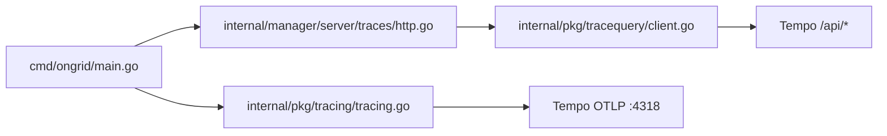
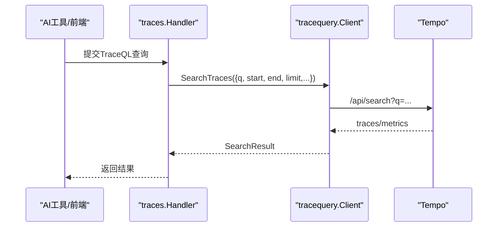
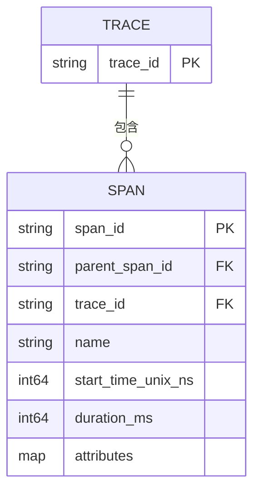

# 分布式追踪

<cite>
**本文引用的文件**
- [internal/pkg/tracing/tracing.go](file://internal/pkg/tracing/tracing.go)
- [internal/pkg/tracequery/client.go](file://internal/pkg/tracequery/client.go)
- [internal/pkg/tracequery/doc.go](file://internal/pkg/tracequery/doc.go)
- [internal/manager/server/traces/http.go](file://internal/manager/server/traces/http.go)
- [cmd/ongrid/main.go](file://cmd/ongrid/main.go)
- [internal/manager/biz/knowledge/builtin_vault/systems/observability-stack/tempo.md](file://internal/manager/biz/knowledge/builtin_vault/systems/observability-stack/tempo.md)
- [internal/manager/biz/aiops/tools/correlate_incident.go](file://internal/manager/biz/aiops/tools/correlate_incident.go)
- [web/src/api/skills.ts](file://web/src/api/skills.ts)
</cite>

## 目录
1. [简介](#简介)
2. [项目结构](#项目结构)
3. [核心组件](#核心组件)
4. [架构总览](#架构总览)
5. [详细组件分析](#详细组件分析)
6. [依赖关系分析](#依赖关系分析)
7. [性能与采样策略](#性能与采样策略)
8. [查询客户端与TraceQL支持](#查询客户端与traceql支持)
9. [数据模型与上下文传播](#数据模型与上下文传播)
10. [性能监控集成](#性能监控集成)
11. [埋点规范与最佳实践](#埋点规范与最佳实践)
12. [故障排查指南](#故障排查指南)
13. [结论](#结论)

## 简介
本文件面向开发团队，系统化阐述本项目对 Tempo 分布式追踪平台的集成方案、数据链路追踪机制、采样策略、查询客户端实现、数据模型与上下文传播，以及与性能监控的联动。文档同时提供可操作的代码埋点规范和无侵入追踪最佳实践，帮助在保障成本的前提下获得高价值的可观测性收益。

## 项目结构
与追踪相关的关键路径包括：
- 进程内 OpenTelemetry 初始化与导出（Manager 与 Edge Agent）
- 通过 HTTP 代理暴露受控的 Trace 查询接口
- 前端与 AI 工具链对 Trace 查询能力的调用
- 知识库中对 Tempo 工作原理与使用建议的沉淀

图示来源
- [cmd/ongrid/main.go:217-234](file://cmd/ongrid/main.go#L217-L234)
- [internal/pkg/tracing/tracing.go:35-106](file://internal/pkg/tracing/tracing.go#L35-L106)
- [internal/manager/server/traces/http.go:1-57](file://internal/manager/server/traces/http.go#L1-L57)
- [internal/pkg/tracequery/client.go:1-87](file://internal/pkg/tracequery/client.go#L1-L87)
- [web/src/api/skills.ts:183-191](file://web/src/api/skills.ts#L183-L191)

章节来源
- [cmd/ongrid/main.go:217-234](file://cmd/ongrid/main.go#L217-L234)
- [internal/pkg/tracing/tracing.go:35-106](file://internal/pkg/tracing/tracing.go#L35-L106)
- [internal/manager/server/traces/http.go:1-57](file://internal/manager/server/traces/http.go#L1-L57)
- [internal/pkg/tracequery/client.go:1-87](file://internal/pkg/tracequery/client.go#L1-L87)
- [web/src/api/skills.ts:183-191](file://web/src/api/skills.ts#L183-L191)

## 核心组件
- OpenTelemetry 初始化与导出：负责构建 TracerProvider、设置资源属性（服务名）、配置采样率、批量导出到 Tempo OTLP HTTP 接收器，并注册跨进程传播器（TraceContext + Baggage）。
- 追踪查询代理：将内部认证后的请求转发至 Tempo 查询 API，屏蔽直接暴露 /api/* 的风险，并提供统一的参数校验与错误包装。
- Tempo 查询客户端：封装 /api/search、/api/traces/<id>、/api/search/tag/<tag>/values 等接口，返回原始 JSON 以便上层灵活处理。
- 前端与AI工具：通过统一 API 发起 TraceQL 查询或按标签筛选，并在 UI 中展示结果。

章节来源
- [internal/pkg/tracing/tracing.go:35-106](file://internal/pkg/tracing/tracing.go#L35-L106)
- [internal/manager/server/traces/http.go:1-57](file://internal/manager/server/traces/http.go#L1-L57)
- [internal/pkg/tracequery/client.go:1-87](file://internal/pkg/tracequery/client.go#L1-L87)
- [web/src/api/skills.ts:183-191](file://web/src/api/skills.ts#L183-L191)

## 架构总览
下图展示了从业务请求进入、Span 生成与传播、OTLP 导出到 Tempo，再到查询与可视化的完整链路。

图示来源
- [cmd/ongrid/main.go:217-234](file://cmd/ongrid/main.go#L217-L234)
- [internal/pkg/tracing/tracing.go:60-106](file://internal/pkg/tracing/tracing.go#L60-L106)
- [internal/manager/server/traces/http.go:52-176](file://internal/manager/server/traces/http.go#L52-L176)
- [internal/pkg/tracequery/client.go:111-201](file://internal/pkg/tracequery/client.go#L111-L201)

## 详细组件分析

### OpenTelemetry 初始化与导出
- 功能要点
  - 根据配置构造 OTLP HTTP 导出器，支持明文/HTTPS。
  - 设置资源属性 service.name，便于 spanmetrics 拆分。
  - 配置 ParentBased + TraceIDRatioBased 采样器，默认全量采样，可按比例下调。
  - 批量导出，批超时较短，减少事故时延迟。
  - 注册全局 TextMapPropagator（TraceContext + Baggage），确保跨进程/跨服务传播。
- 关键行为
  - Endpoint 为空时返回无操作关闭函数，保证启动逻辑可无条件 defer。
  - SamplingRatio 越界自动回退为 1.0。

图示来源
- [internal/pkg/tracing/tracing.go:60-106](file://internal/pkg/tracing/tracing.go#L60-L106)

章节来源
- [internal/pkg/tracing/tracing.go:35-106](file://internal/pkg/tracing/tracing.go#L35-L106)

### 追踪查询代理（HTTP）
- 路由
  - GET /v1/traces/search：代理 /api/search，支持 TraceQL 与标签过滤、时间窗、时长范围、limit 校验。
  - GET /v1/traces/{trace_id}：代理 /api/traces/<id>，原样返回 OTLP 形状 JSON。
  - GET /v1/traces/tags/{tag}/values：代理 /api/search/tag/<tag>/values，用于下拉选项。
- 安全与可用性
  - 当后端未启用时返回 503，避免静默失败。
  - 所有下游调用带超时控制，异常统一包装为结构化错误。

图示来源
- [internal/manager/server/traces/http.go:52-176](file://internal/manager/server/traces/http.go#L52-L176)
- [internal/pkg/tracequery/client.go:111-201](file://internal/pkg/tracequery/client.go#L111-L201)

章节来源
- [internal/manager/server/traces/http.go:1-229](file://internal/manager/server/traces/http.go#L1-L229)
- [internal/pkg/tracequery/client.go:1-253](file://internal/pkg/tracequery/client.go#L1-L253)

### Tempo 查询客户端
- 能力
  - SearchTraces：支持 TraceQL 表达式或 legacy tags 过滤；支持 limit、时间窗、min/max duration。
  - TagValues：获取某标签的所有取值，供 UI 下拉选择。
  - GetTrace：按 trace_id 拉取完整 OTLP 形状 JSON。
- 设计要点
  - BaseURLResolver 抽象，支持静态 URL 与动态解析（运行时更新生效）。
  - 单次请求默认 30s 超时，响应体限制最大 16MiB，防止大响应拖垮内存。
  - 非 2xx 状态码统一转为错误，保留部分错误信息便于诊断。

图示来源
- [internal/pkg/tracequery/client.go:32-87](file://internal/pkg/tracequery/client.go#L32-L87)
- [internal/pkg/tracequery/client.go:111-201](file://internal/pkg/tracequery/client.go#L111-L201)

章节来源
- [internal/pkg/tracequery/client.go:1-253](file://internal/pkg/tracequery/client.go#L1-L253)
- [internal/pkg/tracequery/doc.go:1-13](file://internal/pkg/tracequery/doc.go#L1-L13)

### 主进程集成与探针
- 初始化 OTel：根据配置指向容器网络中的 tempo:4318，失败不阻断启动。
- 注入查询代理：若配置了 Traces.URL，则启用真实代理；否则安装“禁用”处理器，返回 503。
- 探针与设置：提供 Tempo URL 探测与动态解析，便于集成页与健康检查。

章节来源
- [cmd/ongrid/main.go:217-234](file://cmd/ongrid/main.go#L217-L234)
- [cmd/ongrid/main.go:1160-1174](file://cmd/ongrid/main.go#L1160-L1174)

## 依赖关系分析
- 模块耦合
  - tracing 仅依赖 OTel SDK，职责单一，易于替换后端。
  - tracequery 与 manager server traces 解耦，通过接口与 BaseURLResolver 抽象降低耦合度。
  - 主进程作为装配层，组合各组件并管理生命周期。
- 外部依赖
  - OTLP HTTP 接收器（tempo:4318）
  - Tempo 查询 API（/api/*）

图示来源
- [cmd/ongrid/main.go:217-234](file://cmd/ongrid/main.go#L217-L234)
- [internal/manager/server/traces/http.go:1-57](file://internal/manager/server/traces/http.go#L1-L57)
- [internal/pkg/tracequery/client.go:1-87](file://internal/pkg/tracequery/client.go#L1-L87)
- [internal/pkg/tracing/tracing.go:60-106](file://internal/pkg/tracing/tracing.go#L60-L106)

章节来源
- [cmd/ongrid/main.go:217-234](file://cmd/ongrid/main.go#L217-L234)
- [internal/manager/server/traces/http.go:1-57](file://internal/manager/server/traces/http.go#L1-L57)
- [internal/pkg/tracequery/client.go:1-87](file://internal/pkg/tracequery/client.go#L1-L87)
- [internal/pkg/tracing/tracing.go:60-106](file://internal/pkg/tracing/tracing.go#L60-L106)

## 性能与采样策略
- 采样策略
  - Head sampling：在根 Span 决定，成本低但可能丢失尾部兴趣。
  - Tail sampling：基于整条链路完成后再决策，适合错误/慢路径，开销更高。
  - Hybrid：低基础采样率 + 针对错误/慢路径的尾采样。
- 本项目实现
  - 采用 ParentBased + TraceIDRatioBased，默认全量采样，可通过配置按比例下调。
  - 批量导出短超时，减少事故时延迟。
- 成本优化建议
  - 结合业务关键路径优先，提高关键服务的采样率，降低非关键服务采样率。
  - 利用指标关联（spanmetrics）做容量规划与告警，再按需下钻到具体 Trace。

章节来源
- [internal/manager/biz/knowledge/builtin_vault/systems/observability-stack/tempo.md:48-61](file://internal/manager/biz/knowledge/builtin_vault/systems/observability-stack/tempo.md#L48-L61)
- [internal/pkg/tracing/tracing.go:48-99](file://internal/pkg/tracing/tracing.go#L48-L99)

## 查询客户端与TraceQL支持
- TraceQL 语法与用法
  - 选择器与组合：{ ... } 选择 Span，&& 表示同一 Trace 内匹配。
  - 聚合：count()、avg(duration) 等。
  - 典型场景：按服务名、状态码、耗时阈值筛选。
- 客户端能力
  - SearchTraces：支持 q=TraceQL 或 legacy tags；支持 limit、时间窗、min/max duration。
  - TagValues：用于 UI 下拉填充。
  - GetTrace：按 ID 拉取完整 OTLP JSON。
- 前端与AI工具
  - 提供 query_traceql 工具，允许在平台内执行 TraceQL 查询。

图示来源
- [web/src/api/skills.ts:183-191](file://web/src/api/skills.ts#L183-L191)
- [internal/manager/server/traces/http.go:66-152](file://internal/manager/server/traces/http.go#L66-L152)
- [internal/pkg/tracequery/client.go:111-157](file://internal/pkg/tracequery/client.go#L111-L157)

章节来源
- [internal/manager/biz/knowledge/builtin_vault/systems/observability-stack/tempo.md:63-81](file://internal/manager/biz/knowledge/builtin_vault/systems/observability-stack/tempo.md#L63-L81)
- [internal/pkg/tracequery/client.go:89-157](file://internal/pkg/tracequery/client.go#L89-L157)
- [web/src/api/skills.ts:183-191](file://web/src/api/skills.ts#L183-L191)

## 数据模型与上下文传播
- 数据模型
  - Trace 由多个 Span 组成树形结构，每个 Span 包含 name、开始时间、持续时间、属性、parent_span_id、trace_id。
  - 查询返回的 Trace 详情为 OTLP 形状的 JSON（resourceSpans/scopeSpans/spans）。
- 上下文传播
  - 使用 W3C TraceContext 与 Baggage 进行跨进程/跨服务传播。
  - 通过全局 TextMapPropagator 注册，配合 HTTP 中间件自动注入/提取。

图示来源
- [internal/manager/biz/knowledge/builtin_vault/systems/observability-stack/tempo.md:13-22](file://internal/manager/biz/knowledge/builtin_vault/systems/observability-stack/tempo.md#L13-L22)
- [internal/pkg/tracing/tracing.go:100-104](file://internal/pkg/tracing/tracing.go#L100-L104)

章节来源
- [internal/manager/biz/knowledge/builtin_vault/systems/observability-stack/tempo.md:13-22](file://internal/manager/biz/knowledge/builtin_vault/systems/observability-stack/tempo.md#L13-L22)
- [internal/pkg/tracing/tracing.go:100-104](file://internal/pkg/tracing/tracing.go#L100-L104)

## 性能监控集成
- 指标关联
  - 通过 spanmetrics 生成 RED 指标（如 traces_spanmetrics_*），可在 Prometheus 中告警与可视化。
  - 推荐流程：告警 → 指标示例（exemplar）→ 定位 trace_id → 在 Tempo 查看 Span 详情。
- 慢请求识别与瓶颈分析
  - 使用 TraceQL 按服务名与耗时阈值筛选，快速定位慢路径。
  - 结合日志（附带 trace_id）与指标，形成“日志-指标-追踪”三位一体排障闭环。
- 容量规划
  - 基于 spanmetrics 的调用总量与延迟分布，评估采样率与存储成本。
  - 对热点服务提升采样率，对低频服务降低采样率，平衡成本与价值。

章节来源
- [internal/manager/biz/knowledge/builtin_vault/systems/observability-stack/tempo.md:35-46](file://internal/manager/biz/knowledge/builtin_vault/systems/observability-stack/tempo.md#L35-L46)
- [internal/manager/biz/knowledge/builtin_vault/systems/observability-stack/tempo.md:83-95](file://internal/manager/biz/knowledge/builtin_vault/systems/observability-stack/tempo.md#L83-L95)

## 埋点规范与最佳实践
- 命名与属性
  - 为每个 Span 设置清晰的 name 与关键属性（如 http.status_code、service.name、operation 等）。
  - 使用 resource.service.name 区分不同服务实例，便于 spanmetrics 拆分。
- 上下文传播
  - 在 HTTP/gRPC 调用处自动注入/提取 TraceContext，确保跨服务链路完整。
  - 必要时使用 Baggage 传递少量关键上下文（如租户、用户标识）。
- 采样与成本
  - 默认全量采样，逐步引入比例采样；对错误/慢路径开启尾采样（建议在 OTel Collector 侧实现）。
  - 对高频非关键路径降低采样率，对关键交易路径保持较高采样率。
- 无侵入实践
  - 使用框架级中间件自动埋点（HTTP 网关、数据库驱动、消息队列客户端等）。
  - 避免在热路径上添加昂贵属性或频繁 I/O。
- 与日志/指标联动
  - 日志必须携带 trace_id，便于从 Loki 跳转到 Tempo。
  - 指标示例（exemplar）关联 trace_id，实现从指标到追踪的快速下钻。

[本节为通用指导，不直接分析具体文件]

## 故障排查指南
- 常见问题
  - 查询返回 503：追踪后端未启用或未配置正确。
  - 查询超时：冷块扫描较慢，适当增大超时或缩小时间窗口。
  - 结果缺失：确认时间窗、TraceQL 表达式与标签是否正确。
- 诊断步骤
  - 检查 /v1/traces/tags/{tag}/values 是否正常返回。
  - 使用最小化 TraceQL 表达式复现问题。
  - 核对 OTLP 导出是否可达（tempo:4318）。
- 错误处理
  - 代理层对非 2xx 状态码统一包装错误，便于前端提示与日志定位。

章节来源
- [internal/manager/server/traces/http.go:66-196](file://internal/manager/server/traces/http.go#L66-L196)
- [internal/pkg/tracequery/client.go:206-243](file://internal/pkg/tracequery/client.go#L206-L243)

## 结论
本项目以 OpenTelemetry 为核心，将 Span 数据通过 OTLP 导出到 Tempo，并通过轻量代理暴露安全的查询接口。借助 TraceQL 与标签过滤，结合 spanmetrics 指标与日志关联，形成高效的排障与容量规划闭环。通过合理的采样策略与无侵入埋点实践，可在控制成本的同时显著提升可观测性与排障效率。