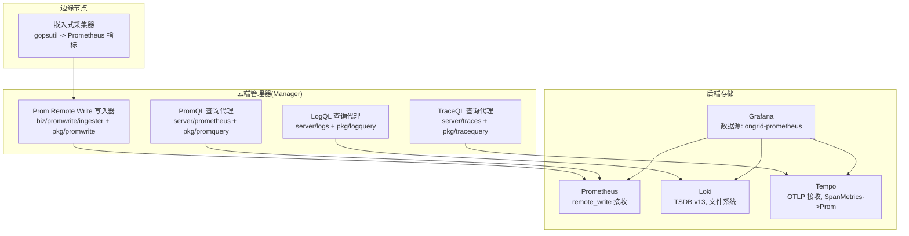
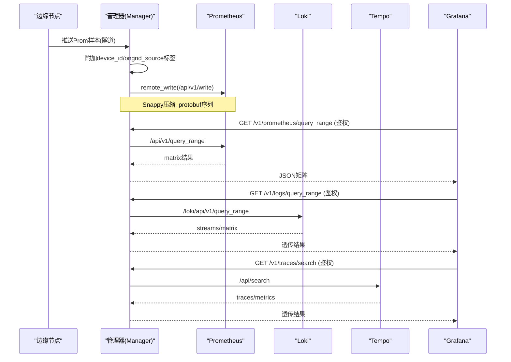
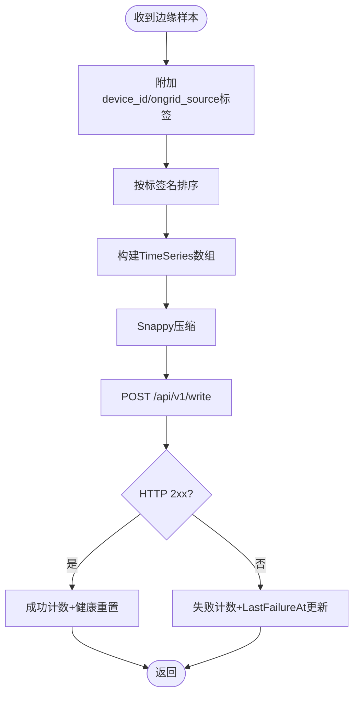
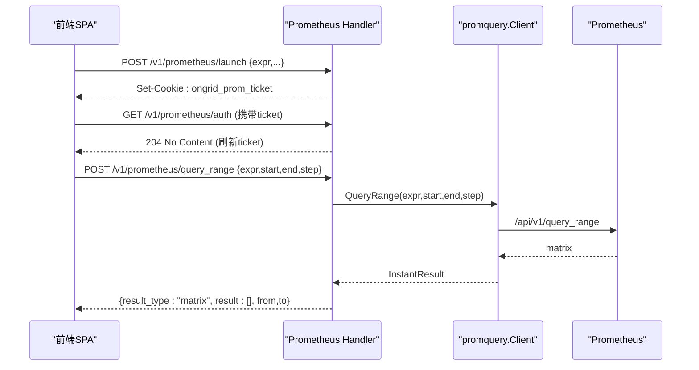
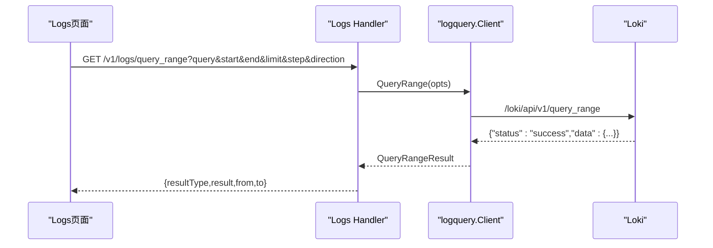
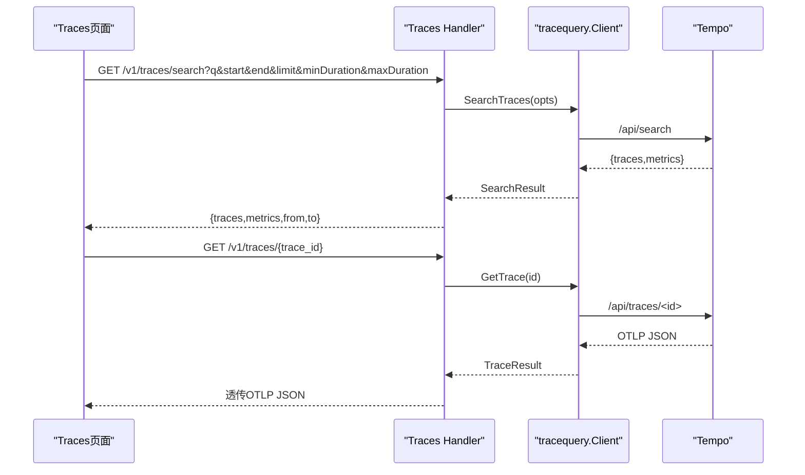
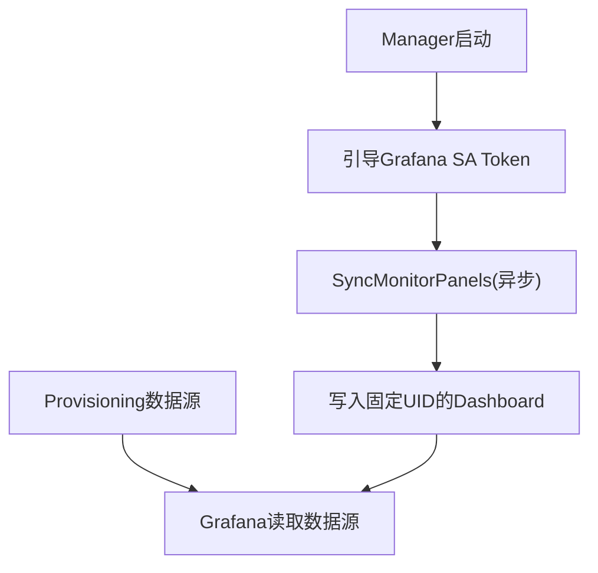
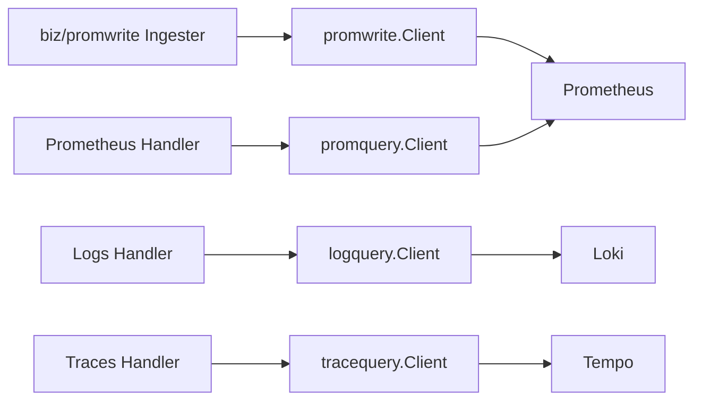

# 可观测性平台

<cite>
**本文引用的文件**   
- [cmd/ongrid/main.go](file://cmd/ongrid/main.go)
- [internal/pkg/promwrite/client.go](file://internal/pkg/promwrite/client.go)
- [internal/pkg/promquery/client.go](file://internal/pkg/promquery/client.go)
- [internal/pkg/logquery/client.go](file://internal/pkg/logquery/client.go)
- [internal/pkg/tracequery/client.go](file://internal/pkg/tracequery/client.go)
- [internal/manager/biz/promwrite/ingester.go](file://internal/manager/biz/promwrite/ingester.go)
- [internal/manager/server/prometheus/http.go](file://internal/manager/server/prometheus/http.go)
- [internal/manager/server/logs/http.go](file://internal/manager/server/logs/http.go)
- [internal/manager/server/traces/http.go](file://internal/manager/server/traces/http.go)
- [deploy/install/prometheus.yml](file://deploy/install/prometheus.yml)
- [deploy/install/loki-config.yaml](file://deploy/install/loki-config.yaml)
- [deploy/install/tempo-config.yaml](file://deploy/install/tempo-config.yaml)
- [deploy/grafana/provisioning/datasources/prometheus.yml](file://deploy/grafana/provisioning/datasources/prometheus.yml)
- [internal/manager/biz/knowledge/builtin_vault/systems/observability-stack/tempo.md](file://internal/manager/biz/knowledge/builtin_vault/systems/observability-stack/tempo.md)
- [internal/manager/biz/knowledge/builtin_vault/diagnostics/grafana-datasource-errors.md](file://internal/manager/biz/knowledge/builtin_vault/diagnostics/grafana-datasource-errors.md)
- [internal/edgeagent/collector/embedded.go](file://internal/edgeagent/collector/embedded.go)
</cite>

## 目录
1. [简介](#简介)
2. [项目结构](#项目结构)
3. [核心组件](#核心组件)
4. [架构总览](#架构总览)
5. [详细组件分析](#详细组件分析)
6. [依赖关系分析](#依赖关系分析)
7. [性能与容量规划](#性能与容量规划)
8. [故障排查指南](#故障排查指南)
9. [结论](#结论)
10. [附录：数据建模与SRE实践](#附录数据建模与sre实践)

## 简介
本文件面向 SRE 与平台工程团队，系统化阐述 ongrid 可观测性平台的指标、日志、追踪采集与查询能力，覆盖以下关键主题：
- Prometheus 时序数据的接收（Remote Write）、存储与 PromQL 查询代理
- Loki 日志聚合的集成：采集、索引构建与 LogQL 查询代理
- Tempo 分布式追踪的集成：Trace ID 关联、链路分析与性能瓶颈定位
- Grafana 仪表板自动同步与管理：面板模板、数据源配置与权限控制
- 可观测性数据建模规范：指标命名、标签设计与日志结构化建议
- SRE 监控体系与故障诊断实践

## 项目结构
本仓库的可观测性相关代码主要分布在如下位置：
- 管理端 HTTP 路由与业务层：Prom/Loki/Tempo 查询代理与鉴权
- 通用客户端库：promwrite、promquery、logquery、tracequery
- 部署配置：Prometheus/Loki/Tempo/Grafana 默认配置与数据源
- Edge 侧采集器：gopsutil 内嵌指标采集并映射为 Prometheus 兼容格式

图表来源
- [internal/edgeagent/collector/embedded.go:1-51](file://internal/edgeagent/collector/embedded.go#L1-L51)
- [internal/manager/biz/promwrite/ingester.go:1-172](file://internal/manager/biz/promwrite/ingester.go#L1-L172)
- [internal/pkg/promwrite/client.go:1-178](file://internal/pkg/promwrite/client.go#L1-L178)
- [internal/manager/server/prometheus/http.go:1-289](file://internal/manager/server/prometheus/http.go#L1-L289)
- [internal/pkg/promquery/client.go:1-168](file://internal/pkg/promquery/client.go#L1-L168)
- [internal/manager/server/logs/http.go:1-200](file://internal/manager/server/logs/http.go#L1-L200)
- [internal/pkg/logquery/client.go:1-280](file://internal/pkg/logquery/client.go#L1-L280)
- [internal/manager/server/traces/http.go:1-229](file://internal/manager/server/traces/http.go#L1-L229)
- [internal/pkg/tracequery/client.go:1-253](file://internal/pkg/tracequery/client.go#L1-L253)
- [deploy/install/prometheus.yml:1-36](file://deploy/install/prometheus.yml#L1-L36)
- [deploy/install/loki-config.yaml:1-67](file://deploy/install/loki-config.yaml#L1-L67)
- [deploy/install/tempo-config.yaml:1-78](file://deploy/install/tempo-config.yaml#L1-L78)
- [deploy/grafana/provisioning/datasources/prometheus.yml:1-11](file://deploy/grafana/provisioning/datasources/prometheus.yml#L1-L11)

章节来源
- [cmd/ongrid/main.go:478-530](file://cmd/ongrid/main.go#L478-L530)
- [cmd/ongrid/main.go:1067-1087](file://cmd/ongrid/main.go#L1067-L1087)

## 核心组件
- 指标写入（Remote Write）
  - 将边缘推送的样本附加 device_id/ongrid_source 等标签后，通过 promwrite.Client 以 application/x-protobuf+snappy 协议写入云侧 Prometheus。
- 指标查询（PromQL 代理）
  - 提供鉴权后的 query_range 接口，透传到后端 Prometheus，供前端 PromQLPanel 渲染。
- 日志查询（LogQL 代理）
  - 暴露 /v1/logs/* 路由，转发到 Loki 的 query_range/labels API，支持方向与步长参数。
- 追踪查询（TraceQL 代理）
  - 暴露 /v1/traces/* 路由，转发到 Tempo 的 search/tagValues/getTrace 接口，支持 TraceQL 与标签过滤。
- Grafana 集成
  - 启动时引导嵌入型 Grafana SA Token，并将 Monitor 页面用户面板镜像到固定 Dashboard UID；数据源通过 provisioning 注入。

章节来源
- [internal/manager/biz/promwrite/ingester.go:1-172](file://internal/manager/biz/promwrite/ingester.go#L1-L172)
- [internal/pkg/promwrite/client.go:1-178](file://internal/pkg/promwrite/client.go#L1-L178)
- [internal/manager/server/prometheus/http.go:1-289](file://internal/manager/server/prometheus/http.go#L1-L289)
- [internal/pkg/promquery/client.go:1-168](file://internal/pkg/promquery/client.go#L1-L168)
- [internal/manager/server/logs/http.go:1-200](file://internal/manager/server/logs/http.go#L1-L200)
- [internal/pkg/logquery/client.go:1-280](file://internal/pkg/logquery/client.go#L1-L280)
- [internal/manager/server/traces/http.go:1-229](file://internal/manager/server/traces/http.go#L1-L229)
- [internal/pkg/tracequery/client.go:1-253](file://internal/pkg/tracequery/client.go#L1-L253)
- [cmd/ongrid/main.go:478-530](file://cmd/ongrid/main.go#L478-L530)
- [deploy/grafana/provisioning/datasources/prometheus.yml:1-11](file://deploy/grafana/provisioning/datasources/prometheus.yml#L1-L11)

## 架构总览
下图展示了从边缘采集到云端存储与查询的全链路，以及 Grafana 的数据源与面板同步路径。

图表来源
- [internal/manager/biz/promwrite/ingester.go:87-158](file://internal/manager/biz/promwrite/ingester.go#L87-L158)
- [internal/pkg/promwrite/client.go:126-176](file://internal/pkg/promwrite/client.go#L126-L176)
- [internal/manager/server/prometheus/http.go:160-243](file://internal/manager/server/prometheus/http.go#L160-L243)
- [internal/pkg/promquery/client.go:103-167](file://internal/pkg/promquery/client.go#L103-L167)
- [internal/manager/server/logs/http.go:64-124](file://internal/manager/server/logs/http.go#L64-L124)
- [internal/pkg/logquery/client.go:124-171](file://internal/pkg/logquery/client.go#L124-L171)
- [internal/manager/server/traces/http.go:66-152](file://internal/manager/server/traces/http.go#L66-L152)
- [internal/pkg/tracequery/client.go:111-157](file://internal/pkg/tracequery/client.go#L111-L157)

## 详细组件分析

### 指标：Remote Write 写入与自观测
- 写入流程
  - 边缘样本经隧道到达 Manager，Ingester 合并 device_id/ongrid_source 等标签，按名称排序后调用 promwrite.Client.Write。
  - Client 构造 TimeSeries 列表，Snappy 压缩并以 application/x-protobuf 发送。
- 健康与失败统计
  - Ingester 维护连续失败次数与最近失败时间，配合 manager 自观测指标用于告警评估。
- 超时与错误处理
  - 单次写请求默认 10s 超时；非 2xx 响应会记录状态码与截断 body 以便排障。

图表来源
- [internal/manager/biz/promwrite/ingester.go:87-158](file://internal/manager/biz/promwrite/ingester.go#L87-L158)
- [internal/pkg/promwrite/client.go:126-176](file://internal/pkg/promwrite/client.go#L126-L176)

章节来源
- [internal/manager/biz/promwrite/ingester.go:1-172](file://internal/manager/biz/promwrite/ingester.go#L1-L172)
- [internal/pkg/promwrite/client.go:1-178](file://internal/pkg/promwrite/client.go#L1-L178)

### 指标：PromQL 查询代理与鉴权
- 鉴权与票据
  - 通过 /v1/prometheus/auth 校验 ticket 并滑动续期；/v1/prometheus/launch 生成临时访问票据。
- 查询代理
  - /v1/prometheus/query_range 对表达式长度、时间范围与步长进行校验，调用 promquery.Client.QueryRange 并返回矩阵结果。
- 动态解析
  - 底层 promquery.Client 使用 BaseURLResolver，每次请求解析后端 URL，结合 ~5s TTL 缓存实现热更新。

图表来源
- [internal/manager/server/prometheus/http.go:56-137](file://internal/manager/server/prometheus/http.go#L56-L137)
- [internal/manager/server/prometheus/http.go:160-243](file://internal/manager/server/prometheus/http.go#L160-L243)
- [internal/pkg/promquery/client.go:103-167](file://internal/pkg/promquery/client.go#L103-L167)

章节来源
- [internal/manager/server/prometheus/http.go:1-289](file://internal/manager/server/prometheus/http.go#L1-L289)
- [internal/pkg/promquery/client.go:1-168](file://internal/pkg/promquery/client.go#L1-L168)

### 日志：Loki 采集、索引与 LogQL 查询代理
- 采集与索引
  - Loki 单节点部署，schema v13，TSDB 存储于文件系统，保留期 30 天；limits_config 限制全局流数量与查询窗口。
  - creation_grace_period 放宽至 1h，容忍 journald 样本时钟漂移。
- 查询代理
  - /v1/logs/query_range 支持 limit/step/direction 参数；/v1/logs/labels 与 /v1/logs/labels/{name}/values 提供标签枚举。
  - 统一设置 X-Scope-OrgID=ongrid，适配单租户安装。

图表来源
- [internal/manager/server/logs/http.go:64-124](file://internal/manager/server/logs/http.go#L64-L124)
- [internal/pkg/logquery/client.go:124-171](file://internal/pkg/logquery/client.go#L124-L171)
- [deploy/install/loki-config.yaml:1-67](file://deploy/install/loki-config.yaml#L1-L67)

章节来源
- [internal/manager/server/logs/http.go:1-200](file://internal/manager/server/logs/http.go#L1-L200)
- [internal/pkg/logquery/client.go:1-280](file://internal/pkg/logquery/client.go#L1-L280)
- [deploy/install/loki-config.yaml:1-67](file://deploy/install/loki-config.yaml#L1-L67)

### 追踪：Tempo 接入、TraceQL 与关联分析
- 接入与存储
  - OTLP gRPC/HTTP 接收，本地块存储，默认 7 天保留；SpanMetrics 与 Service Graph 生成器将 trace 指标 remote_write 到 Prometheus。
- 查询代理
  - /v1/traces/search 支持 TraceQL 或 tags 形式；/v1/traces/tags/{tag}/values 与 /v1/traces/{trace_id} 提供标签值与详情。
- 关联分析
  - 通过 metric exemplar 或日志中的 trace_id 快速跳转到具体链路，定位慢调用与错误根因。

图表来源
- [internal/manager/server/traces/http.go:66-152](file://internal/manager/server/traces/http.go#L66-L152)
- [internal/pkg/tracequery/client.go:111-201](file://internal/pkg/tracequery/client.go#L111-L201)
- [deploy/install/tempo-config.yaml:1-78](file://deploy/install/tempo-config.yaml#L1-L78)
- [internal/manager/biz/knowledge/builtin_vault/systems/observability-stack/tempo.md:1-95](file://internal/manager/biz/knowledge/builtin_vault/systems/observability-stack/tempo.md#L1-L95)

章节来源
- [internal/manager/server/traces/http.go:1-229](file://internal/manager/server/traces/http.go#L1-L229)
- [internal/pkg/tracequery/client.go:1-253](file://internal/pkg/tracequery/client.go#L1-L253)
- [deploy/install/tempo-config.yaml:1-78](file://deploy/install/tempo-config.yaml#L1-L78)
- [internal/manager/biz/knowledge/builtin_vault/systems/observability-stack/tempo.md:1-95](file://internal/manager/biz/knowledge/builtin_vault/systems/observability-stack/tempo.md#L1-L95)

### Grafana 仪表板自动同步与数据源
- 数据源
  - 通过 provisioning 注入 ongrid-prometheus 数据源，指向内部 Prometheus 地址。
- 面板同步
  - 启动时异步引导嵌入型 Grafana SA Token，并在首次成功后将 Monitor 页面用户面板镜像到固定 Dashboard UID，保证“在 Grafana 中打开”可用。
- 权限与安全
  - 查询入口均受 Manager 鉴权保护；Grafana 仅作为展示层，不直接暴露后端查询接口。

图表来源
- [cmd/ongrid/main.go:478-530](file://cmd/ongrid/main.go#L478-L530)
- [deploy/grafana/provisioning/datasources/prometheus.yml:1-11](file://deploy/grafana/provisioning/datasources/prometheus.yml#L1-L11)

章节来源
- [cmd/ongrid/main.go:478-530](file://cmd/ongrid/main.go#L478-L530)
- [deploy/grafana/provisioning/datasources/prometheus.yml:1-11](file://deploy/grafana/provisioning/datasources/prometheus.yml#L1-L11)

## 依赖关系分析
- 组件耦合
  - Server 层仅依赖窄接口（Querier/PromQuerier），降低与具体实现的耦合度。
  - 客户端库（promwrite/promquery/logquery/tracequery）采用 BaseURLResolver/EndpointResolver 抽象，便于运行时切换后端。
- 外部依赖
  - Prometheus 启用 remote_write 接收；Loki 使用 TSDB v13 与 compactor；Tempo 开启 metrics_generator 向 Prometheus 回写 spanmetrics。
- 潜在循环依赖
  - 各信号通道独立封装，无跨包循环引用；Manager 业务层通过接口解耦。

图表来源
- [internal/manager/server/prometheus/http.go:1-289](file://internal/manager/server/prometheus/http.go#L1-L289)
- [internal/manager/server/logs/http.go:1-200](file://internal/manager/server/logs/http.go#L1-L200)
- [internal/manager/server/traces/http.go:1-229](file://internal/manager/server/traces/http.go#L1-L229)
- [internal/manager/biz/promwrite/ingester.go:1-172](file://internal/manager/biz/promwrite/ingester.go#L1-L172)
- [internal/pkg/promwrite/client.go:1-178](file://internal/pkg/promwrite/client.go#L1-L178)
- [internal/pkg/promquery/client.go:1-168](file://internal/pkg/promquery/client.go#L1-L168)
- [internal/pkg/logquery/client.go:1-280](file://internal/pkg/logquery/client.go#L1-L280)
- [internal/pkg/tracequery/client.go:1-253](file://internal/pkg/tracequery/client.go#L1-L253)

章节来源
- [internal/manager/server/prometheus/http.go:1-289](file://internal/manager/server/prometheus/http.go#L1-L289)
- [internal/manager/server/logs/http.go:1-200](file://internal/manager/server/logs/http.go#L1-L200)
- [internal/manager/server/traces/http.go:1-229](file://internal/manager/server/traces/http.go#L1-L229)
- [internal/manager/biz/promwrite/ingester.go:1-172](file://internal/manager/biz/promwrite/ingester.go#L1-L172)
- [internal/pkg/promwrite/client.go:1-178](file://internal/pkg/promwrite/client.go#L1-L178)
- [internal/pkg/promquery/client.go:1-168](file://internal/pkg/promquery/client.go#L1-L168)
- [internal/pkg/logquery/client.go:1-280](file://internal/pkg/logquery/client.go#L1-L280)
- [internal/pkg/tracequery/client.go:1-253](file://internal/pkg/tracequery/client.go#L1-L253)

## 性能与容量规划
- Prometheus
  - remote_write 单次请求体小，默认 10s 超时；建议根据吞吐调整远端接收队列与持久化策略。
  - 规则文件与自观测指标已加载，注意高基数标签带来的内存压力。
- Loki
  - limits_config 限制 max_global_streams_per_user 与 max_query_series，避免高基数导致查询放大。
  - creation_grace_period 放宽到 1h 以容忍时钟漂移；合理设置 retention_period 与 compactor 窗口。
- Tempo
  - block_retention 默认 7 天；spanmetrics 远程写入 Prometheus，便于复用现有告警与可视化。
  - 大 trace 上限与写入速率限制需结合业务峰值调优。
- Grafana
  - 数据源由 provisioning 管理，避免重启被覆盖；面板变量与 UID 稳定有助于长期维护。

[本节为通用指导，无需源码引用]

## 故障排查指南
- Grafana 数据源报错或面板为空
  - 先验证后端健康探针（Prom/Loki/Tempo）是否可达；确认容器网络与 DNS。
  - 若后端健康但面板无数据，检查时间范围、重命名/丢弃的指标或模板变量。
  - 若所有面板空，检查数据源 UID 漂移问题。
- Prometheus 查询异常
  - 检查 /v1/prometheus/query_range 的表达式长度、时间范围与步长合法性。
  - 关注 promquery 非 2xx 日志与错误类型。
- Loki 查询失败
  - 检查 start/end 时间戳格式与 direction 取值；确认 limits_config 未触发拒绝。
- Tempo 搜索缓慢
  - 冷块扫描耗时较长，优先使用 TraceQL 精确过滤或基于 service.name/name 标签检索。
  - 利用 spanmetrics 指标做快速定位，再跳转具体 trace。

章节来源
- [internal/manager/biz/knowledge/builtin_vault/diagnostics/grafana-datasource-errors.md:1-87](file://internal/manager/biz/knowledge/builtin_vault/diagnostics/grafana-datasource-errors.md#L1-L87)
- [internal/manager/server/prometheus/http.go:160-243](file://internal/manager/server/prometheus/http.go#L160-L243)
- [internal/manager/server/logs/http.go:64-124](file://internal/manager/server/logs/http.go#L64-L124)
- [internal/manager/server/traces/http.go:66-152](file://internal/manager/server/traces/http.go#L66-L152)

## 结论
本可观测性平台以统一的 Manager 为中枢，将指标、日志、追踪三种信号分别对接 Prometheus/Loki/Tempo，并通过鉴权后的查询代理对外提供服务。Grafana 通过 provisioning 与面板同步机制，形成“采集—存储—查询—可视化”的闭环。通过合理的容量规划与故障排查流程，SRE 团队可在复杂环境中高效定位问题、保障系统稳定性。

[本节为总结，无需源码引用]

## 附录：数据建模与SRE实践

### 指标命名与标签设计
- 命名规范
  - 使用下划线分隔，动词+名词+单位（如 cpu_usage_seconds_total）。
  - 避免在指标名中包含易变维度（如主机名、实例 IP）。
- 标签设计
  - 固定附加 device_id 与 ongrid_source，便于多采集源区分与设备级聚合。
  - 控制基数：服务、环境、区域等低基数字段；避免用户态任意键值。
- 示例参考
  - 边缘采集器输出 Prometheus 兼容指标，遵循统一映射约定。

章节来源
- [internal/manager/biz/promwrite/ingester.go:87-158](file://internal/manager/biz/promwrite/ingester.go#L87-L158)
- [internal/edgeagent/collector/embedded.go:1-51](file://internal/edgeagent/collector/embedded.go#L1-L51)

### 日志结构化建议
- 字段拆分
  - 将结构化字段（如 edge_id、service、level、trace_id）作为标签或 JSON 字段，便于 Loki 索引与筛选。
- 时间容差
  - 考虑时钟漂移，确保采集端时间戳与服务器时间一致；必要时调整 creation_grace_period。
- 查询优化
  - 使用方向 backward 获取最新日志；合理设置 limit 与 step，避免全量扫描。

章节来源
- [deploy/install/loki-config.yaml:1-67](file://deploy/install/loki-config.yaml#L1-L67)
- [internal/manager/server/logs/http.go:64-124](file://internal/manager/server/logs/http.go#L64-L124)

### 追踪关联与瓶颈定位
- 关联链路
  - 在日志中附带 trace_id，在指标中使用 exemplar，实现从告警到链路的快速跳转。
- 采样策略
  - 推荐混合采样：基础头采样 + 尾采样（错误/慢路径），在 OTel Collector 侧实现。
- 查询模式
  - 优先使用 TraceQL 选择器与 duration 过滤；结合 spanmetrics 指标进行概览。

章节来源
- [internal/manager/biz/knowledge/builtin_vault/systems/observability-stack/tempo.md:1-95](file://internal/manager/biz/knowledge/builtin_vault/systems/observability-stack/tempo.md#L1-L95)
- [deploy/install/tempo-config.yaml:1-78](file://deploy/install/tempo-config.yaml#L1-L78)

### SRE 监控体系建设要点
- 分层告警
  - 基础设施层（CPU/Mem/Disk/Net）、应用层（RED 指标）、业务层（关键事务成功率/延迟）。
- 统一视图
  - 通过 Grafana 面板模板与变量，实现按设备/服务维度的钻取。
- 自动化
  - 面板与数据源通过 provisioning 管理，变更即生效；查询代理统一鉴权与限流。

[本节为通用指导，无需源码引用]