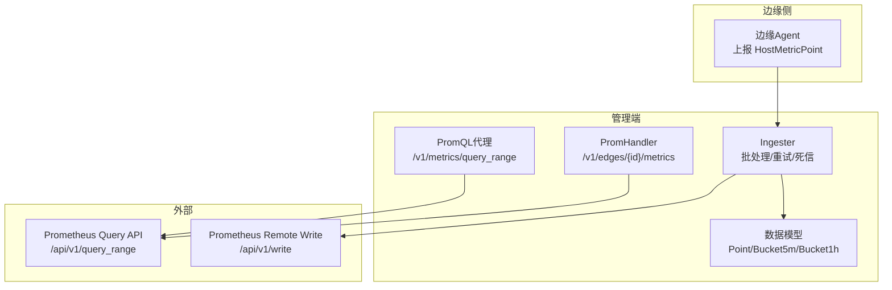
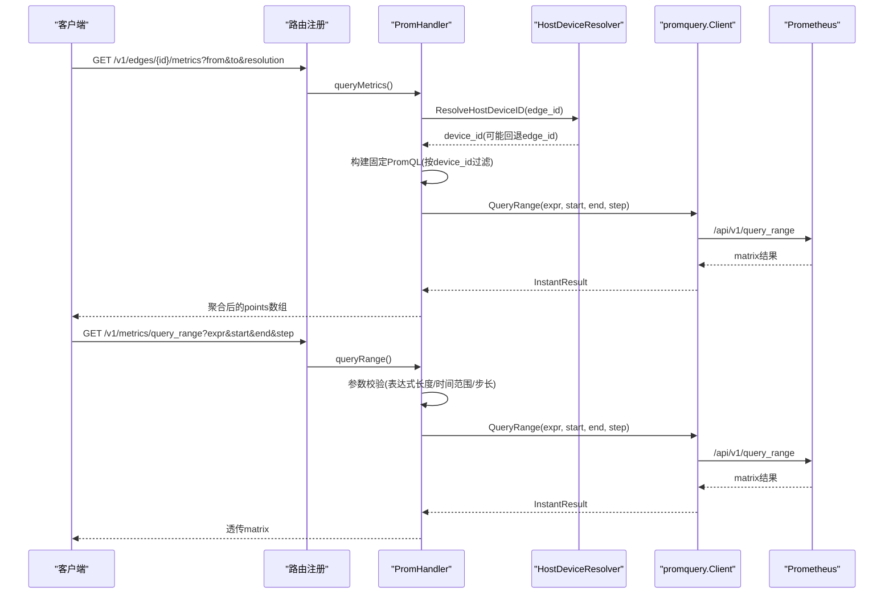
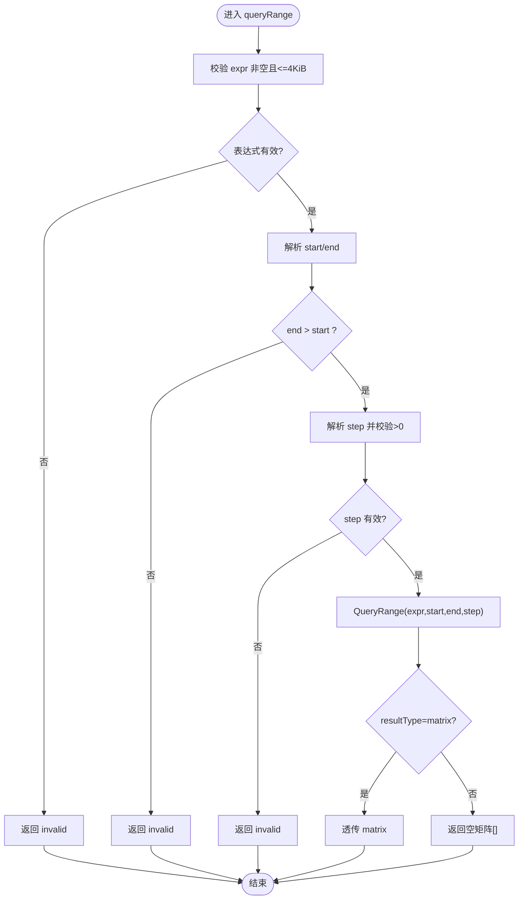
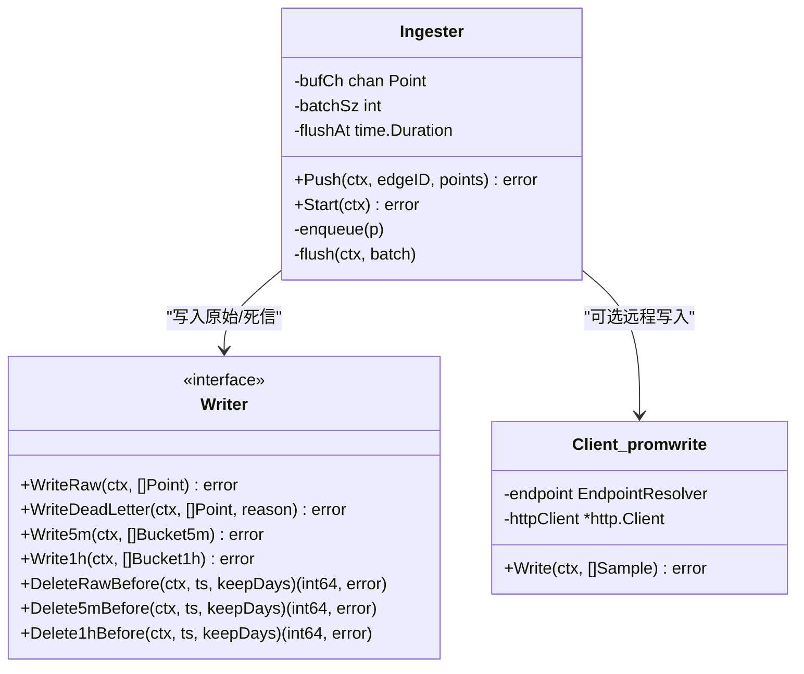
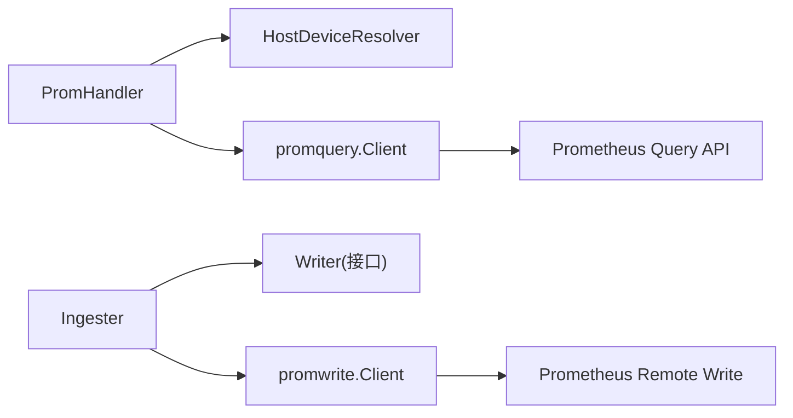

# 指标采集系统

<cite>
**本文引用的文件**   
- [prom_handler.go](file://internal/manager/server/metric/prom_handler.go)
- [http.go](file://internal/manager/server/metric/http.go)
- [ingester.go](file://internal/manager/biz/metric/ingester.go)
- [model.go](file://internal/manager/model/metric/model.go)
- [client.go](file://internal/pkg/promwrite/client.go)
- [client.go](file://internal/pkg/promquery/client.go)
- [main.go](file://cmd/ongrid/main.go)
- [prom_handler_test.go](file://internal/manager/server/metric/prom_handler_test.go)
- [ingester_test.go](file://internal/manager/biz/metric/ingester_test.go)
- [client_test.go](file://internal/pkg/promwrite/client_test.go)
- [client_test.go](file://internal/pkg/promquery/client_test.go)
</cite>

## 目录
1. [简介](#简介)
2. [项目结构](#项目结构)
3. [核心组件](#核心组件)
4. [架构总览](#架构总览)
5. [详细组件分析](#详细组件分析)
6. [依赖关系分析](#依赖关系分析)
7. [性能与调优](#性能与调优)
8. [故障排查指南](#故障排查指南)
9. [结论](#结论)
10. [附录：自定义指标接入示例与最佳实践](#附录自定义指标接入示例与最佳实践)

## 简介
本文件面向开发者，系统化阐述指标采集系统的实现与使用方式，重点覆盖以下方面：
- Prometheus 时序数据的接收、存储与查询机制
- PromHandler 的实现原理，包括 /v1/edges/{id}/metrics 端点处理逻辑、设备ID解析与标签映射
- PromQL 查询代理（/v1/metrics/query_range）的查询范围验证、表达式大小限制与并发处理
- 指标数据模型设计（CPU、内存、磁盘、网络等系统指标的采集规范与命名约定）
- 指标写入器（Ingester + promwrite）的批量写入优化、错误重试与死信持久化策略
- 性能调优建议（查询超时、连接池、内存使用）
- 自定义指标接入的完整示例与最佳实践

## 项目结构
指标子系统围绕“边缘侧采集 → 云端写入 → 云端查询”的主线展开。关键路径如下：
- 边缘侧通过隧道上报主机指标（HostMetricPoint），由管理端的 Ingester 聚合并落盘或转发至远端 Prometheus
- 管理端提供两类查询接口：
  - 设备级聚合查询：GET /v1/edges/{id}/metrics（PromHandler 将 edge_id 解析为 device_id，构造固定 PromQL 并并行查询）
  - 通用 PromQL 查询代理：GET /v1/metrics/query_range（参数校验后透传到 Prometheus）

图表来源
- [prom_handler.go:71-74](file://internal/manager/server/metric/prom_handler.go#L71-L74)
- [client.go:103-117](file://internal/pkg/promquery/client.go#L103-L117)
- [client.go:126-176](file://internal/pkg/promwrite/client.go#L126-L176)
- [ingester.go:15-24](file://internal/manager/biz/metric/ingester.go#L15-L24)
- [model.go:18-96](file://internal/manager/model/metric/model.go#L18-L96)

章节来源
- [prom_handler.go:71-74](file://internal/manager/server/metric/prom_handler.go#L71-L74)
- [client.go:103-117](file://internal/pkg/promquery/client.go#L103-L117)
- [client.go:126-176](file://internal/pkg/promwrite/client.go#L126-L176)
- [ingester.go:15-24](file://internal/manager/biz/metric/ingester.go#L15-L24)
- [model.go:18-96](file://internal/manager/model/metric/model.go#L18-L96)

## 核心组件
- PromHandler：负责设备级指标聚合查询与通用 PromQL 查询代理
- Ingester：负责边缘上报指标的批量化、退避重试与死信持久化
- promquery.Client：封装对 Prometheus 的 query/query_range 调用
- promwrite.Client：封装对 Prometheus 的 remote_write 调用
- 数据模型：Point、Bucket5m、Bucket1h 以及对应的 GORM 行类型

章节来源
- [prom_handler.go:43-74](file://internal/manager/server/metric/prom_handler.go#L43-L74)
- [ingester.go:15-24](file://internal/manager/biz/metric/ingester.go#L15-L24)
- [client.go:35-82](file://internal/pkg/promquery/client.go#L35-L82)
- [client.go:42-117](file://internal/pkg/promwrite/client.go#L42-L117)
- [model.go:18-96](file://internal/manager/model/metric/model.go#L18-L96)

## 架构总览
下图展示了从请求到响应的主要交互流程，涵盖设备级查询与通用查询两条路径。

图表来源
- [prom_handler.go:71-74](file://internal/manager/server/metric/prom_handler.go#L71-L74)
- [prom_handler.go:76-131](file://internal/manager/server/metric/prom_handler.go#L76-L131)
- [prom_handler.go:319-393](file://internal/manager/server/metric/prom_handler.go#L319-L393)
- [client.go:103-117](file://internal/pkg/promquery/client.go#L103-L117)

## 详细组件分析

### PromHandler：设备级指标聚合与通用查询代理
- 路由注册
  - GET /v1/edges/{id}/metrics：设备级聚合查询
  - GET /v1/metrics/query_range：通用 PromQL 查询代理
- 设备ID解析与标签映射
  - 优先通过 HostDeviceResolver 将 edge_id 解析为 device_id；若解析失败或未配置，则回退为 edge_id
  - 所有 PromQL 表达式均以内联标签形式限定 {device_id="..."|edge_id="..."}，避免跨边泄漏
- 固定指标集合与计算
  - CPU：cpu_avg、cpu_max（基于 node_cpu_seconds_total idle 比率）
  - 内存：mem_avg（基于 node_memory_MemAvailable_bytes / node_memory_MemTotal_bytes）
  - 负载：load1/load5/load15
  - 磁盘：disk_used_pct（取各挂载点的最大使用率）
  - 网络：net_rx_bps/net_tx_bps（基于 node_network_receive/transmit_bytes_total 的速率）
- 并发与超时
  - 每个指标表达式独立 goroutine 发起 QueryRange，统一 30s 上下文超时
  - 单系列失败不影响其他系列返回
- 通用查询代理
  - 参数校验：expr 非空且不超过 4 KiB；start/end 必须合法且 end > start；step 必须为正数
  - 结果透传：仅当结果为 matrix 时透传，否则返回空数组

图表来源
- [prom_handler.go:319-393](file://internal/manager/server/metric/prom_handler.go#L319-L393)
- [prom_handler_test.go:98-114](file://internal/manager/server/metric/prom_handler_test.go#L98-L114)

章节来源
- [prom_handler.go:71-74](file://internal/manager/server/metric/prom_handler.go#L71-L74)
- [prom_handler.go:76-131](file://internal/manager/server/metric/prom_handler.go#L76-L131)
- [prom_handler.go:132-226](file://internal/manager/server/metric/prom_handler.go#L132-L226)
- [prom_handler.go:319-393](file://internal/manager/server/metric/prom_handler.go#L319-L393)
- [prom_handler_test.go:47-80](file://internal/manager/server/metric/prom_handler_test.go#L47-L80)
- [prom_handler_test.go:98-114](file://internal/manager/server/metric/prom_handler_test.go#L98-L114)

### 指标写入器：Ingester 与 promwrite
- Ingester 职责
  - 缓冲与批处理：默认批次大小 500，刷新间隔 5s；缓冲区容量为 batchSz*4
  - 背压策略：缓冲区满时丢弃最旧样本，记录 dropped 计数
  - 重试与死信：WriteRaw 失败按 100ms/500ms/2s 指数退避重试；全部失败后写入死信表
  - 指标暴露：writes/failures/dropped/batchSize 等计数器与直方图
- promwrite.Client 职责
  - 将 Sample 序列化为 Prometheus remote_write 协议（snappy 压缩）
  - 支持静态 URL、基础 URL 拼接、动态 EndpointResolver
  - 单次 HTTP 超时默认 10s，无内部重试（上层 Ingester 负责）

图表来源
- [ingester.go:15-24](file://internal/manager/biz/metric/ingester.go#L15-L24)
- [ingester.go:120-161](file://internal/manager/biz/metric/ingester.go#L120-L161)
- [ingester.go:200-247](file://internal/manager/biz/metric/ingester.go#L200-L247)
- [client.go:126-176](file://internal/pkg/promwrite/client.go#L126-L176)

章节来源
- [ingester.go:15-24](file://internal/manager/biz/metric/ingester.go#L15-L24)
- [ingester.go:120-161](file://internal/manager/biz/metric/ingester.go#L120-L161)
- [ingester.go:200-247](file://internal/manager/biz/metric/ingester.go#L200-L247)
- [client.go:126-176](file://internal/pkg/promwrite/client.go#L126-L176)
- [ingester_test.go:171-210](file://internal/manager/biz/metric/ingester_test.go#L171-L210)
- [client_test.go:201-265](file://internal/pkg/promwrite/client_test.go#L201-L265)

### 数据模型与命名约定
- 领域模型
  - Point：单条原始样本（EdgeID、Ts、CPU/Mem/Load/Disk/Net）
  - Bucket5m/Bucket1h：5分钟/1小时聚合（Gauge 保留 avg+max，Counter 保留 sum）
- 持久化模型（GORM）
  - host_metrics_raw、host_metrics_5m、host_metrics_1h、host_metrics_dead_letter
- 命名约定
  - 指标名遵循 node_* 前缀（如 node_cpu_seconds_total、node_memory_MemTotal_bytes、node_filesystem_avail_bytes、node_network_receive_bytes_total 等）
  - 标签维度以 device_id 为主，必要时回退 edge_id，确保查询隔离

章节来源
- [model.go:18-96](file://internal/manager/model/metric/model.go#L18-L96)
- [model.go:102-189](file://internal/manager/model/metric/model.go#L102-L189)
- [prom_handler.go:132-160](file://internal/manager/server/metric/prom_handler.go#L132-L160)

### 启动与集成要点
- 云端 Prometheus 启用开关
  - 当未启用时，PromHandler 的 prom 客户端为 nil，相关查询返回“未就绪”
  - 启用后，通过配置或系统设置动态解析 base URL 与 write URL，无需重启生效
- 主进程初始化
  - 在 main 中根据配置决定是否创建 promwrite/promquery 客户端及 ingester

章节来源
- [prom_handler.go:109-112](file://internal/manager/server/metric/prom_handler.go#L109-L112)
- [main.go:1067-1087](file://cmd/ongrid/main.go#L1067-L1087)

## 依赖关系分析
- PromHandler 依赖
  - HostDeviceResolver：用于 edge_id → device_id 解析
  - promquery.Client：执行 range 查询
- Ingester 依赖
  - Writer 接口：抽象底层存储（本地 SQLite 或远端 TSDB）
  - promwrite.Client：可选地直接写入远端 Prometheus
- promquery.Client 与 promwrite.Client
  - 均通过 Resolver 接口获取目标地址，支持运行时热更新

图表来源
- [prom_handler.go:43-74](file://internal/manager/server/metric/prom_handler.go#L43-L74)
- [client.go:35-82](file://internal/pkg/promquery/client.go#L35-L82)
- [client.go:42-117](file://internal/pkg/promwrite/client.go#L42-L117)
- [ingester.go:15-24](file://internal/manager/biz/metric/ingester.go#L15-L24)

章节来源
- [prom_handler.go:43-74](file://internal/manager/server/metric/prom_handler.go#L43-L74)
- [client.go:35-82](file://internal/pkg/promquery/client.go#L35-L82)
- [client.go:42-117](file://internal/pkg/promwrite/client.go#L42-L117)
- [ingester.go:15-24](file://internal/manager/biz/metric/ingester.go#L15-L24)

## 性能与调优
- 查询超时
  - PromHandler 内层 QueryRange 统一 30s 超时，避免慢查询拖住协程
  - promquery.Client 默认 30s 超时；promwrite.Client 默认 10s 超时
- 并发与吞吐
  - PromHandler 对多个指标表达式并发查询，提升整体响应速度
  - Ingester 批处理大小与刷新间隔可按负载调整（默认 500/5s）
- 连接池与HTTP客户端
  - 可通过注入 http.Client 自定义超时、连接复用与TLS参数
  - 注意控制并发度与响应体大小上限（promquery 已限制响应体读取上限）
- 内存与序列化
  - promwrite 使用 snappy 压缩减少带宽占用
  - Ingester 在 flush 前做防御性拷贝，避免共享切片导致的竞态

章节来源
- [prom_handler.go:162-163](file://internal/manager/server/metric/prom_handler.go#L162-L163)
- [client.go:43-46](file://internal/pkg/promquery/client.go#L43-L46)
- [client.go:50-54](file://internal/pkg/promwrite/client.go#L50-L54)
- [ingester.go:200-206](file://internal/manager/biz/metric/ingester.go#L200-L206)
- [client.go](file://internal/pkg/promwrite/client.go:146-L147)

## 故障排查指南
- 通用查询代理报错
  - 表达式过大：超过 4 KiB 将被拒绝
  - 时间范围非法：end 必须晚于 start
  - step 无效：必须为正数且可解析
- 设备级查询为空
  - 检查 edge_id 是否能正确解析为 device_id；若未解析成功，会回退到 edge_id 标签
  - 确认 Prometheus 中存在对应 device_id 的 series
- 写入失败与丢数据
  - Ingester 会在多次重试失败后将批次写入死信表，需关注 dead letter 记录
  - 监控 ongrid_ingest_dropped_total 与 ongrid_ingest_flush_failures_total 指标

章节来源
- [prom_handler.go:319-393](file://internal/manager/server/metric/prom_handler.go#L319-L393)
- [prom_handler.go:123-131](file://internal/manager/server/metric/prom_handler.go#L123-L131)
- [ingester.go:200-247](file://internal/manager/biz/metric/ingester.go#L200-L247)
- [ingester_test.go:171-210](file://internal/manager/biz/metric/ingester_test.go#L171-L210)

## 结论
本系统以清晰的边界划分了“写入”和“查询”两条链路：写入侧通过 Ingester 保证高吞吐与容错，查询侧通过 PromHandler 提供稳定的设备级聚合与灵活的通用 PromQL 能力。配合完善的参数校验、超时控制与指标观测，系统在可扩展性与稳定性之间取得良好平衡。

## 附录：自定义指标接入示例与最佳实践
- 接入方式
  - 边缘侧通过隧道上报 HostMetricPoint（包含 CPU/Mem/Load/Disk/Net 等字段）
  - 管理端 Ingester 将其转换为领域模型 Point，并按策略批量写入本地存储或远端 Prometheus
- 指标命名与标签
  - 指标名建议使用 node_* 前缀，便于与现有体系对齐
  - 标签维度优先使用 device_id，确保多设备隔离
- 查询示例
  - 设备级聚合：GET /v1/edges/{id}/metrics?from=RFC3339&to=RFC3339&resolution=auto|raw|5m|1h
  - 通用 PromQL：GET /v1/metrics/query_range?expr=<表达式>&start=RFC3339&end=RFC3339&step=30s
- 最佳实践
  - 合理设置 resolution/step，避免过细粒度导致查询缓慢
  - 表达式控制在 4 KiB 以内，避免被拒绝
  - 关注 Ingester 的 dropped 与 flush failures 指标，及时扩容或优化后端

章节来源
- [prom_handler.go:71-74](file://internal/manager/server/metric/prom_handler.go#L71-L74)
- [prom_handler.go:319-393](file://internal/manager/server/metric/prom_handler.go#L319-L393)
- [ingester.go:15-24](file://internal/manager/biz/metric/ingester.go#L15-L24)
- [model.go:18-96](file://internal/manager/model/metric/model.go#L18-L96)