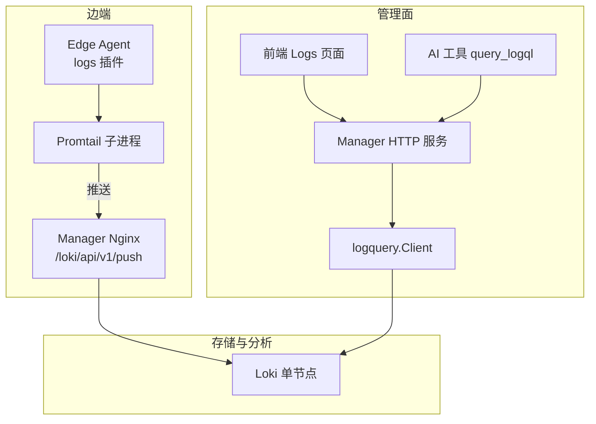
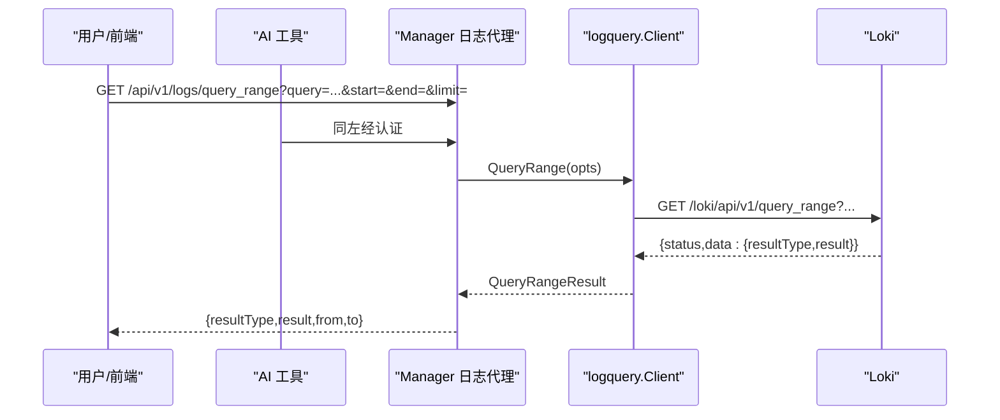
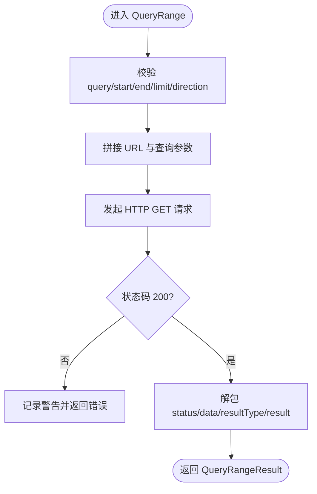
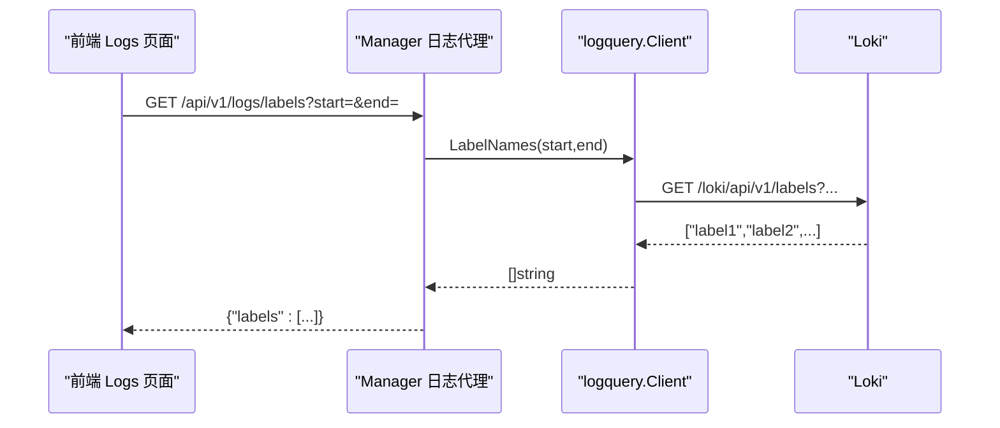
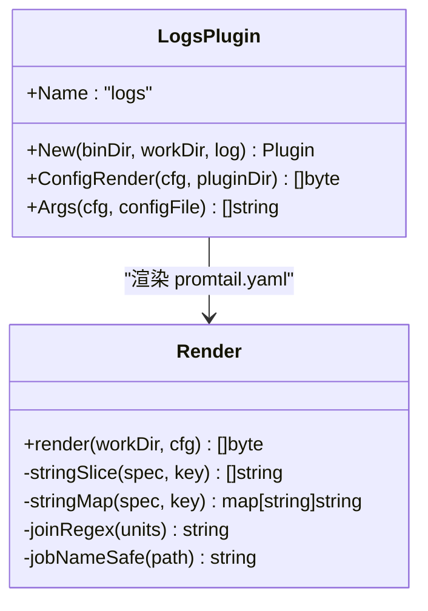
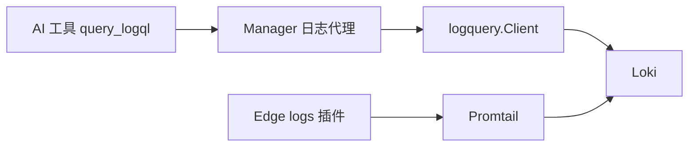

# 日志聚合系统

<cite>
**本文引用的文件**   
- [internal/pkg/logquery/client.go](file://internal/pkg/logquery/client.go)
- [internal/manager/server/logs/http.go](file://internal/manager/server/logs/http.go)
- [internal/edgeagent/plugins/logs/plugin.go](file://internal/edgeagent/plugins/logs/plugin.go)
- [internal/edgeagent/plugins/logs/render.go](file://internal/edgeagent/plugins/logs/render.go)
- [deploy/install/loki-config.yaml](file://deploy/install/loki-config.yaml)
- [cmd/ongrid/main.go](file://cmd/ongrid/main.go)
- [internal/manager/biz/aiops/tools/query_logql_basetool.go](file://internal/manager/biz/aiops/tools/query_logql_basetool.go)
- [internal/manager/biz/knowledge/builtin_vault/systems/observability-stack/loki.md](file://internal/manager/biz/knowledge/builtin_vault/systems/observability-stack/loki.md)
- [internal/manager/biz/knowledge/builtin_vault/diagnostics/loki-ingestion-backpressure.md](file://internal/manager/biz/knowledge/builtin_vault/diagnostics/loki-ingestion-backpressure.md)
</cite>

## 目录
1. [简介](#简介)
2. [项目结构](#项目结构)
3. [核心组件](#核心组件)
4. [架构总览](#架构总览)
5. [详细组件分析](#详细组件分析)
6. [依赖关系分析](#依赖关系分析)
7. [性能与容量规划](#性能与容量规划)
8. [故障排查指南](#故障排查指南)
9. [结论](#结论)
10. [附录：API 接口文档](#附录api-接口文档)

## 简介
本文件面向运维与平台工程人员，系统化阐述本项目中基于 Loki 的日志聚合方案。内容覆盖：
- 集成架构与数据流转（边端采集 → Manager 代理查询 → Loki）
- LogQL 查询客户端实现（查询构建、结果解析、分页与方向控制）
- 日志采集插件工作原理（文件监控、journald 采集、格式解析与结构化提取）
- 索引策略与标签设计（低基数原则、分片与存储优化）
- 日志轮转与清理策略（Loki compactor 与保留期配置）
- 日志查询 API 完整接口说明（过滤条件、时间范围、聚合函数支持）
- 最佳实践与排障技巧

## 项目结构
围绕日志子系统的关键代码与配置分布如下：
- 查询客户端：internal/pkg/logquery/client.go
- 管理面查询代理：internal/manager/server/logs/http.go
- 边端采集插件：internal/edgeagent/plugins/logs/{plugin.go, render.go}
- Loki 单节点配置：deploy/install/loki-config.yaml
- 启动装配与工具注册：cmd/ongrid/main.go
- AI 工具层调用入口：internal/manager/biz/aiops/tools/query_logql_basetool.go
- 知识文档与排障指引：internal/manager/biz/knowledge/builtin_vault/systems/observability-stack/loki.md、diagnostics/loki-ingestion-backpressure.md

图示来源
- [internal/edgeagent/plugins/logs/plugin.go:1-54](file://internal/edgeagent/plugins/logs/plugin.go#L1-L54)
- [internal/edgeagent/plugins/logs/render.go:30-95](file://internal/edgeagent/plugins/logs/render.go#L30-L95)
- [internal/manager/server/logs/http.go:1-55](file://internal/manager/server/logs/http.go#L1-L55)
- [internal/pkg/logquery/client.go:120-171](file://internal/pkg/logquery/client.go#L120-L171)
- [deploy/install/loki-config.yaml:1-67](file://deploy/install/loki-config.yaml#L1-L67)

章节来源
- [internal/pkg/logquery/client.go:1-280](file://internal/pkg/logquery/client.go#L1-L280)
- [internal/manager/server/logs/http.go:1-200](file://internal/manager/server/logs/http.go#L1-L200)
- [internal/edgeagent/plugins/logs/plugin.go:1-54](file://internal/edgeagent/plugins/logs/plugin.go#L1-L54)
- [internal/edgeagent/plugins/logs/render.go:1-273](file://internal/edgeagent/plugins/logs/render.go#L1-L273)
- [deploy/install/loki-config.yaml:1-67](file://deploy/install/loki-config.yaml#L1-L67)
- [cmd/ongrid/main.go:1276-1308](file://cmd/ongrid/main.go#L1276-L1308)

## 核心组件
- logquery.Client：封装 /loki/api/v1/query_range、/labels、/label/{name}/values；统一超时、错误包装、租户头注入、结果类型透传。
- logs.Handler：在 Manager 侧提供受认证的查询代理路由，将前端/AI 请求转发至 logquery.Client。
- Edge logs 插件：以子进程方式运行 Promtail，渲染 promtail.yaml，按设备维度附加低基数标签并推送至 Manager Nginx 的 push 入口。
- Loki 配置：单节点部署，TSDB v13 索引、文件系统对象存储、compactor 启用、保留期与限流参数。

章节来源
- [internal/pkg/logquery/client.go:53-100](file://internal/pkg/logquery/client.go#L53-L100)
- [internal/manager/server/logs/http.go:28-55](file://internal/manager/server/logs/http.go#L28-L55)
- [internal/edgeagent/plugins/logs/plugin.go:20-53](file://internal/edgeagent/plugins/logs/plugin.go#L20-L53)
- [deploy/install/loki-config.yaml:21-51](file://deploy/install/loki-config.yaml#L21-L51)

## 架构总览
整体数据与控制流如下：
- 写入路径：边端 Promtail 读取 journald/文件 → 通过 bearer/basic auth 推送至 Manager Nginx → 转发到 Loki /push。
- 查询路径：前端/AI 调用 Manager /v1/logs/* → Manager 校验参数并调用 logquery.Client → 访问 Loki /query_range 或 labels 接口 → 返回结果。

图示来源
- [internal/manager/server/logs/http.go:64-124](file://internal/manager/server/logs/http.go#L64-L124)
- [internal/pkg/logquery/client.go:120-171](file://internal/pkg/logquery/client.go#L120-L171)

章节来源
- [internal/manager/server/logs/http.go:1-200](file://internal/manager/server/logs/http.go#L1-L200)
- [internal/pkg/logquery/client.go:120-171](file://internal/pkg/logquery/client.go#L120-L171)

## 详细组件分析

### LogQL 查询客户端（logquery.Client）
- 能力边界
  - 查询范围：/loki/api/v1/query_range，支持 limit、step、direction（forward/backward）。
  - 标签枚举：/loki/api/v1/labels 与 /loki/api/v1/label/{name}/values。
  - 结果透传：保留 resultType 与 result 原始 JSON，便于上层区分 streams/matrix。
- 关键实现要点
  - 参数校验：空查询、起止时间缺失或逆序均拒绝。
  - 默认值：limit 缺省为 1000，direction 缺省 backward。
  - 租户隔离：统一设置 X-Scope-OrgID: ongrid。
  - 超时与限流：HTTP 客户端默认 30s；响应体限制 8MiB。
  - 错误处理：非 200 状态码记录警告并返回可读错误信息。

图示来源
- [internal/pkg/logquery/client.go:120-171](file://internal/pkg/logquery/client.go#L120-L171)
- [internal/pkg/logquery/client.go:232-272](file://internal/pkg/logquery/client.go#L232-L272)

章节来源
- [internal/pkg/logquery/client.go:102-171](file://internal/pkg/logquery/client.go#L102-L171)
- [internal/pkg/logquery/client.go:232-272](file://internal/pkg/logquery/client.go#L232-L272)

### 管理面查询代理（Manager /v1/logs/*）
- 暴露路由
  - GET /v1/logs/query_range：代理 /loki/api/v1/query_range
  - GET /v1/logs/labels：代理 /loki/api/v1/labels
  - GET /v1/logs/labels/{name}/values：代理 /loki/api/v1/label/<name>/values
- 安全与健壮性
  - 前置认证中间件；当后端未启用时返回 503。
  - 参数校验：start/end 支持 RFC3339 与 unix 秒/毫秒/纳秒字符串；limit 限定 1..5000；step 必须为正时长；direction 仅 forward/backward。
  - 上下文超时：查询 30s，标签 15s。
  - 响应增强：附带 from/to 时间戳，便于前端展示。

图示来源
- [internal/manager/server/logs/http.go:126-143](file://internal/manager/server/logs/http.go#L126-L143)
- [internal/pkg/logquery/client.go:175-199](file://internal/pkg/logquery/client.go#L175-L199)

章节来源
- [internal/manager/server/logs/http.go:1-200](file://internal/manager/server/logs/http.go#L1-L200)

### 边端日志采集插件（Promtail 子进程）
- 生命周期
  - 由 ongrid-edge 以子进程方式拉起 Promtail，工作目录包含渲染后的配置文件与 positions 文件。
  - 每次 reconcile 重新渲染 promtail.yaml，确保动态更新采集目标与标签。
- 配置渲染
  - 默认开启 journald 采集，可按 unit 白名单过滤；若关闭 journald 且未指定 file_paths，则回退到 /var/log/syslog 与 /var/log/messages。
  - 自动发现审计插件输出文件（audit.jsonl），无需人工干预。
  - 外部标签固定 device_id，并可叠加 extra_labels（由管理器下发并做白名单校验）。
  - 客户端支持 basic_auth 或 bearer_token，默认跳过证书校验以便自签证书环境快速上线。
- 推送目标
  - 直接推送到 Manager Nginx 的 /loki/api/v1/push，不走隧道，降低延迟与复杂度。

图示来源
- [internal/edgeagent/plugins/logs/plugin.go:20-53](file://internal/edgeagent/plugins/logs/plugin.go#L20-L53)
- [internal/edgeagent/plugins/logs/render.go:97-189](file://internal/edgeagent/plugins/logs/render.go#L97-L189)

章节来源
- [internal/edgeagent/plugins/logs/plugin.go:1-54](file://internal/edgeagent/plugins/logs/plugin.go#L1-L54)
- [internal/edgeagent/plugins/logs/render.go:1-273](file://internal/edgeagent/plugins/logs/render.go#L1-L273)

### AI 工具层（query_logql）
- 条件注册：仅在配置了日志后端 URL 时注册 query_logql 工具。
- 调用链路：AI 工具 → Registry → logquery.Client → Loki。
- 典型用法：结合 incident 关联，拉取最近错误行用于诊断面板。

章节来源
- [cmd/ongrid/main.go:1293-1304](file://cmd/ongrid/main.go#L1293-L1304)
- [internal/manager/biz/aiops/tools/query_logql_basetool.go](file://internal/manager/biz/aiops/tools/query_logql_basetool.go)

### Loki 配置与索引策略
- 索引与存储
  - schema v13，index prefix index_，period 24h；chunks/rules 使用文件系统。
- 保留与清理
  - retention_period: 720h（30 天）；compactor 启用，delete_request_store 使用 filesystem。
- 限流与容错
  - ingestion_rate_mb: 8，ingestion_burst_size_mb: 16；reject_old_samples=true，最大 168h。
  - creation_grace_period: 1h，容忍时钟漂移导致的未来样本。
- 标签与基数
  - 严格遵循低基数原则，避免高基数 label 导致 stream 爆炸。

章节来源
- [deploy/install/loki-config.yaml:21-51](file://deploy/install/loki-config.yaml#L21-L51)
- [internal/manager/biz/knowledge/builtin_vault/systems/observability-stack/loki.md:1-133](file://internal/manager/biz/knowledge/builtin_vault/systems/observability-stack/loki.md#L1-L133)

## 依赖关系分析
- 组件耦合
  - Manager 日志代理对 logquery.Client 为窄接口依赖，便于替换后端。
  - Edge logs 插件对审计插件存在单向探测依赖（自动追加 audit.jsonl）。
  - AI 工具层对 logquery.Client 的条件化依赖，未配置则不注册。
- 外部依赖
  - Loki HTTP API（query_range、labels、push）。
  - Promtail 二进制（作为子进程运行）。

图示来源
- [internal/manager/server/logs/http.go:28-55](file://internal/manager/server/logs/http.go#L28-L55)
- [internal/pkg/logquery/client.go:53-100](file://internal/pkg/logquery/client.go#L53-L100)
- [internal/edgeagent/plugins/logs/plugin.go:20-53](file://internal/edgeagent/plugins/logs/plugin.go#L20-L53)

章节来源
- [internal/manager/server/logs/http.go:1-200](file://internal/manager/server/logs/http.go#L1-L200)
- [internal/pkg/logquery/client.go:1-280](file://internal/pkg/logquery/client.go#L1-L280)
- [internal/edgeagent/plugins/logs/plugin.go:1-54](file://internal/edgeagent/plugins/logs/plugin.go#L1-L54)

## 性能与容量规划
- 查询性能
  - 优先缩小时间窗口与标签选择器，再使用管道过滤；大窗口+高吞吐易触发 OOM 或慢查询。
  - 合理设置 limit（建议 1000~5000），必要时分页滚动加载。
- 写入性能
  - 控制 ingestion_rate 与 burst，必要时水平扩展 ingester（多实例模式）。
  - 避免高基数标签，将高基数字段下沉到日志正文，用 LogQL 文本匹配。
- 存储与索引
  - 关注 active streams 数量与 churn 速率；超过阈值需收紧标签或分流。
  - 调整 retention_period 与 compactor 工作目录空间，保障清理正常。

章节来源
- [internal/manager/biz/knowledge/builtin_vault/systems/observability-stack/loki.md:83-109](file://internal/manager/biz/knowledge/builtin_vault/systems/observability-stack/loki.md#L83-L109)
- [deploy/install/loki-config.yaml:31-51](file://deploy/install/loki-config.yaml#L31-L51)

## 故障排查指南
- 常见信号与处置
  - 429：单一噪声源限速 → 源头限流；合法高吞吐 → 提升 rate/burst 或扩容 ingester。
  - max_streams_per_user 超限 → 降低标签基数，将高基数数据放入日志正文。
  - out-of-order / too far behind → 检查同一 stream 是否多写点、时钟同步。
  - 5xx/连接失败 → distributor/ingester 不可用或 OOM，扩容或重启。
- 定位步骤
  - 确认 edge 端 promtail 位置文件与重试退避是否正常。
  - 核对 Manager Nginx 到 Loki 的连通性与鉴权。
  - 查看 Loki 指标：distributor_ingester_appends_failures_total、ingester_memory_chunks、request_duration_seconds。
  - 针对大查询，逐步缩小时间窗口与标签集合，验证是否命中上限。

章节来源
- [internal/manager/biz/knowledge/builtin_vault/diagnostics/loki-ingestion-backpressure.md:45-76](file://internal/manager/biz/knowledge/builtin_vault/diagnostics/loki-ingestion-backpressure.md#L45-L76)
- [internal/manager/biz/knowledge/builtin_vault/systems/observability-stack/loki.md:124-133](file://internal/manager/biz/knowledge/builtin_vault/systems/observability-stack/loki.md#L124-L133)

## 结论
本日志聚合方案以“边端轻量采集 + 管理面安全代理 + Loki 低成本存储”为核心，兼顾易用性与可运维性。通过严格的标签治理、合理的保留与清理策略、以及清晰的查询代理与客户端封装，可在中小规模场景稳定落地。后续可演进的方向包括：动态 BaseURL 解析、更丰富的模板覆盖、以及向 Alloy 等新一代采集器的平滑迁移。

## 附录：API 接口文档

### 通用说明
- 基础路径：/api/v1/logs
- 认证：由上层认证中间件保护
- 时间参数：支持 RFC3339 与 unix 秒/毫秒/纳秒字符串
- 错误格式：{"error": "..."}

### 查询日志
- 方法：GET
- 路径：/api/v1/logs/query_range
- 查询参数
  - query: LogQL 表达式（必填）
  - start: 起始时间（必填）
  - end: 结束时间（必填）
  - limit: 行数上限，1..5000，默认 1000
  - step: 步长（正时长，可选，仅 metric_over_time 类有效）
  - direction: forward 或 backward，默认 backward
- 成功响应
  - resultType: "streams" | "matrix"
  - result: 原始 JSON（streams 或 matrix）
  - from/to: 本次查询的时间边界（RFC3339）
- 错误码
  - 400：参数非法
  - 502：后端不可达或返回异常
  - 503：日志后端未启用

章节来源
- [internal/manager/server/logs/http.go:64-124](file://internal/manager/server/logs/http.go#L64-L124)

### 列出标签名
- 方法：GET
- 路径：/api/v1/logs/labels
- 查询参数
  - start: 可选
  - end: 可选
- 成功响应
  - labels: ["label1","label2",...]
- 错误码
  - 502：后端不可达
  - 503：日志后端未启用

章节来源
- [internal/manager/server/logs/http.go:126-143](file://internal/manager/server/logs/http.go#L126-L143)

### 列出标签值
- 方法：GET
- 路径：/api/v1/logs/labels/{name}/values
- 路径参数
  - name: 标签名（必填）
- 查询参数
  - start: 可选
  - end: 可选
- 成功响应
  - values: ["v1","v2",...]
- 错误码
  - 400：缺少 name
  - 502：后端不可达
  - 503：日志后端未启用

章节来源
- [internal/manager/server/logs/http.go:145-167](file://internal/manager/server/logs/http.go#L145-L167)

### LogQL 支持与示例
- 日志查询（返回行）
  - 包含/不包含：|= "..."、!= "..."
  - 正则：|~ "(?i)pattern"
  - 结构化解析：| json | field="value"、| logfmt | latency > 1s
- 聚合查询（返回时序）
  - count_over_time、rate、sum by(...) 等
- 性能建议
  - 先缩标签选择器，再做文本/结构化过滤
  - 控制时间窗口与 limit，避免全量扫描

章节来源
- [internal/manager/biz/knowledge/builtin_vault/systems/observability-stack/loki.md:55-82](file://internal/manager/biz/knowledge/builtin_vault/systems/observability-stack/loki.md#L55-L82)

### 日志轮转与清理策略
- 保留期
  - retention_period: 720h（30 天）
- 压缩与删除
  - compactor.working_directory 与 delete_request_store 使用 filesystem
  - retention_enabled: true
- 时钟漂移容忍
  - creation_grace_period: 1h，放宽未来样本容忍度

章节来源
- [deploy/install/loki-config.yaml:31-55](file://deploy/install/loki-config.yaml#L31-L55)