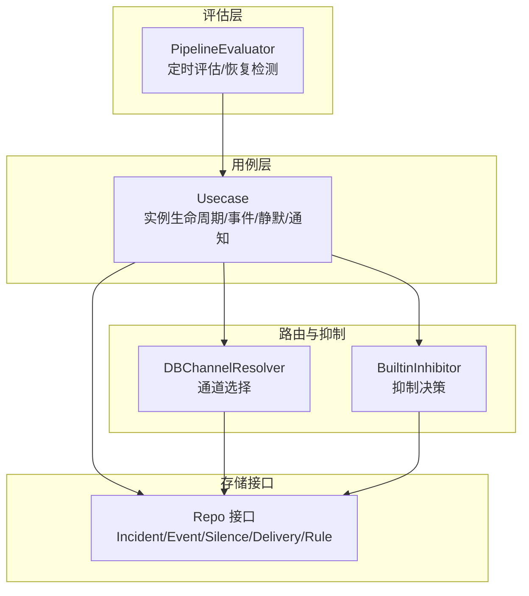
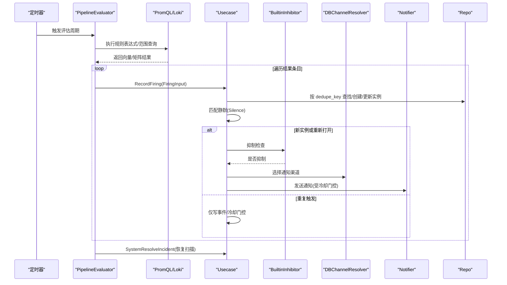
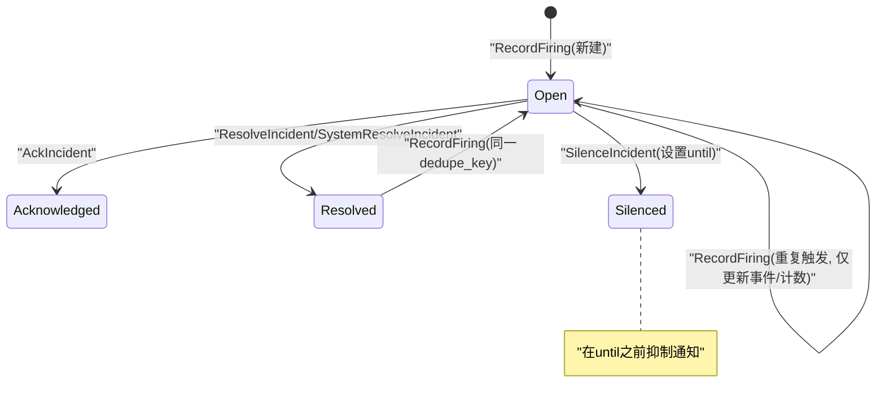
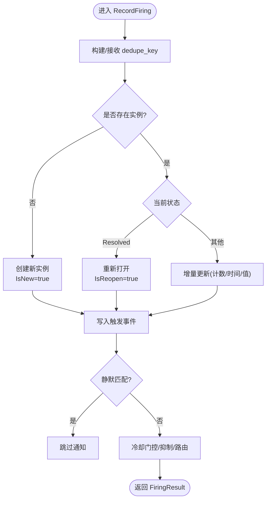
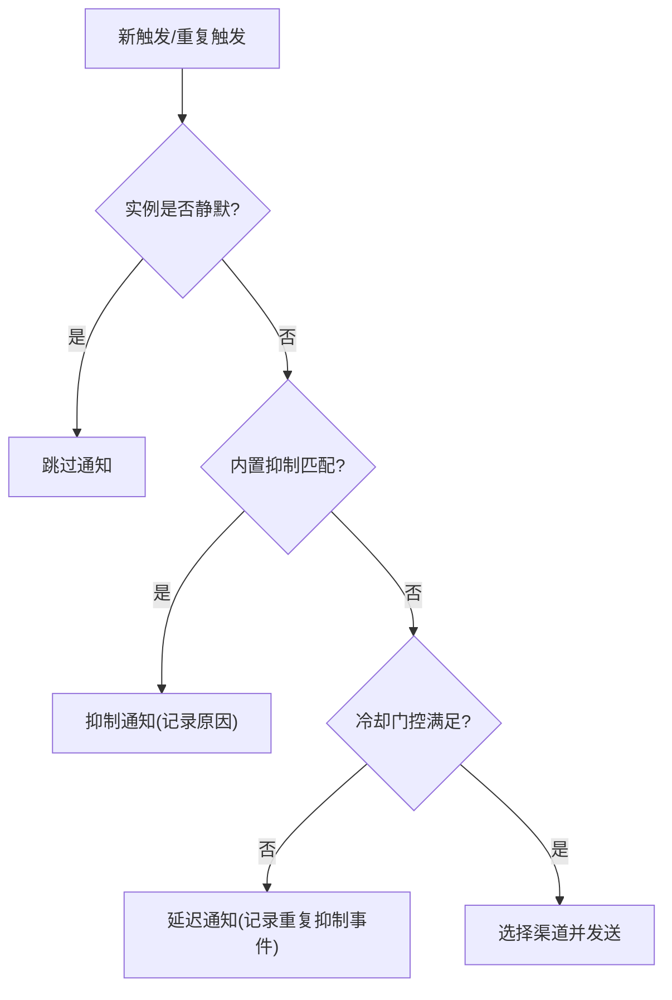
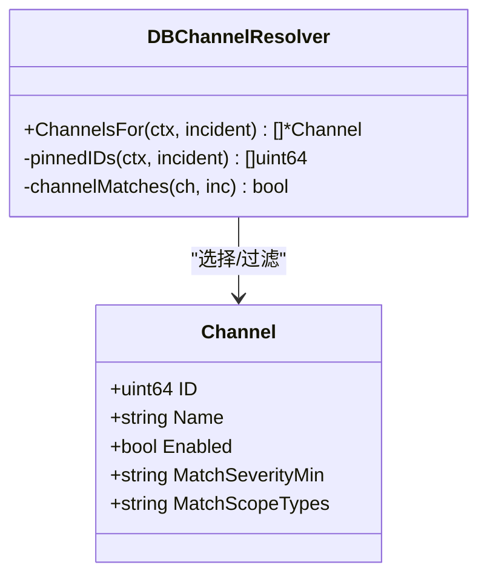
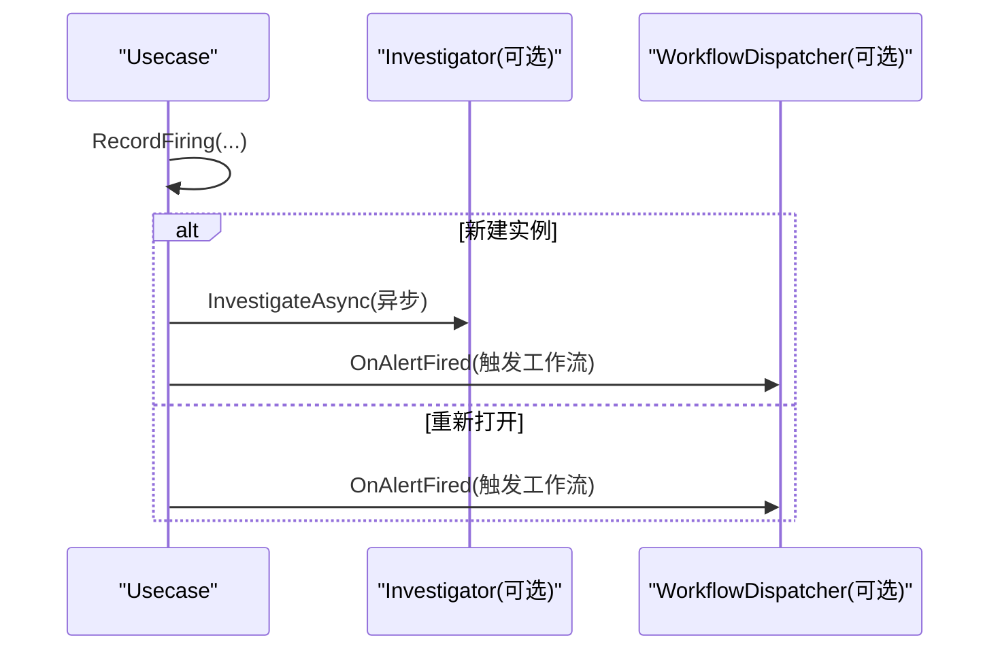
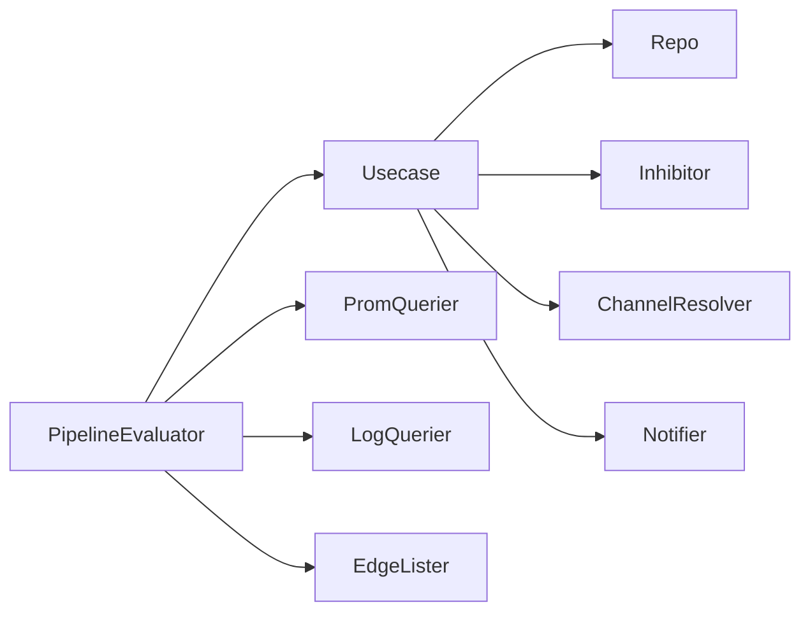

# 告警实例管理

<cite>
**本文引用的文件**   
- [usecase.go](file://internal/manager/biz/alert/usecase.go)
- [pipeline.go](file://internal/manager/biz/alert/pipeline.go)
- [inhibit.go](file://internal/manager/biz/alert/inhibit.go)
- [repo.go](file://internal/manager/biz/alert/repo.go)
- [router.go](file://internal/manager/biz/alert/router.go)
</cite>

## 目录
1. [简介](#简介)
2. [项目结构](#项目结构)
3. [核心组件](#核心组件)
4. [架构总览](#架构总览)
5. [详细组件分析](#详细组件分析)
6. [依赖关系分析](#依赖关系分析)
7. [性能与稳定性](#性能与稳定性)
8. [故障排查指南](#故障排查指南)
9. [结论](#结论)
10. [附录](#附录)

## 简介
本文件面向“告警实例管理”能力，围绕以下目标展开：
- 生命周期状态机：Firing（触发）、Resolved（已解决）、Suppressed（抑制）等状态的转换逻辑与触发条件。
- 去重机制：dedupe key 生成策略、重复告警合并算法与恢复判定。
- 抑制与聚合：抑制规则配置与使用，避免告警风暴与通知疲劳。
- 升级与自动化修复：告警升级策略与自动化修复工单触发条件。
- 历史查询、统计分析与报表：事件记录、指标计数与可观测性支撑。

## 项目结构
本模块位于内部业务层 alert 子域，采用分层设计：
- usecase：用例编排，负责实例生命周期、事件写入、静默匹配、通知投递与冷却门控。
- pipeline：定时评估器，驱动 metric/log 类规则，产出 FiringInput 并调用用例。
- inhibit：内置抑制器，基于活跃实例进行抑制决策。
- router：通道解析器，按规则级或全局策略选择通知渠道。
- repo：领域仓储接口，定义实例、事件、静默、通道、投递、规则等数据访问契约。

图表来源
- [pipeline.go:116-196](file://internal/manager/biz/alert/pipeline.go#L116-L196)
- [usecase.go:315-479](file://internal/manager/biz/alert/usecase.go#L315-L479)
- [router.go:31-111](file://internal/manager/biz/alert/router.go#L31-L111)
- [inhibit.go:25-74](file://internal/manager/biz/alert/inhibit.go#L25-L74)
- [repo.go:28-103](file://internal/manager/biz/alert/repo.go#L28-L103)

章节来源
- [pipeline.go:116-196](file://internal/manager/biz/alert/pipeline.go#L116-L196)
- [usecase.go:315-479](file://internal/manager/biz/alert/usecase.go#L315-L479)
- [router.go:31-111](file://internal/manager/biz/alert/router.go#L31-L111)
- [inhibit.go:25-74](file://internal/manager/biz/alert/inhibit.go#L25-L74)
- [repo.go:28-103](file://internal/manager/biz/alert/repo.go#L28-L103)

## 核心组件
- Usecase：提供 RecordFiring、Resolve/Ack/Silence、事件写入、通知投递与冷却门控、静默匹配、系统级 Resolve 等用例方法；可选注入 AI 调查与工作流分发器。
- PipelineEvaluator：周期性拉取 Prom/Loki 数据，构造 FiringInput，调用 Usecase.RecordFiring，并在结果集合变化时执行系统级恢复。
- BuiltinInhibitor：根据活跃实例对低优先级告警进行抑制，典型场景包括 edge_offline 抑制同设备主机告警、prom_ingest_fail 抑制 scrape_down 告警。
- DBChannelResolver：按规则级 pin 或全局 severity/scope 过滤选择通知渠道，支持回退到环境变量默认渠道。
- Repo 接口：统一封装实例、事件、静默、通道、投递、规则等数据访问契约。

章节来源
- [usecase.go:73-103](file://internal/manager/biz/alert/usecase.go#L73-L103)
- [pipeline.go:82-145](file://internal/manager/biz/alert/pipeline.go#L82-L145)
- [inhibit.go:25-74](file://internal/manager/biz/alert/inhibit.go#L25-L74)
- [router.go:31-111](file://internal/manager/biz/alert/router.go#L31-L111)
- [repo.go:28-103](file://internal/manager/biz/alert/repo.go#L28-L103)

## 架构总览
从规则评估到通知投递的端到端流程如下：

图表来源
- [pipeline.go:254-380](file://internal/manager/biz/alert/pipeline.go#L254-L380)
- [usecase.go:315-479](file://internal/manager/biz/alert/usecase.go#L315-L479)
- [inhibit.go:44-74](file://internal/manager/biz/alert/inhibit.go#L44-L74)
- [router.go:65-111](file://internal/manager/biz/alert/router.go#L65-L111)
- [repo.go:38-103](file://internal/manager/biz/alert/repo.go#L38-L103)

## 详细组件分析

### 生命周期状态机与转换
- 初始状态：Open（首次触发）。
- 关键转换：
  - Open → Acknowledged：人工确认。
  - Open → Resolved：人工或系统级自动解决。
  - Open → Silenced：进入静默期，期间抑制通知。
  - Resolved → Open：同一 dedupe_key 再次触发时重新打开。
  - 任意状态 → 事件记录：每次触发、静默、投递成功/失败均写入事件。
- 静默匹配：优先判断实例自身是否处于未过期的静默状态；否则匹配活跃的静默行（按 scope/device/rule 等匹配器）。
- 冷却门控：通过 last_notified_at 与冷却时间窗口控制通知频率，避免风暴。

图表来源
- [usecase.go:152-211](file://internal/manager/biz/alert/usecase.go#L152-L211)
- [usecase.go:315-479](file://internal/manager/biz/alert/usecase.go#L315-L479)
- [usecase.go:535-573](file://internal/manager/biz/alert/usecase.go#L535-L573)

章节来源
- [usecase.go:152-211](file://internal/manager/biz/alert/usecase.go#L152-L211)
- [usecase.go:315-479](file://internal/manager/biz/alert/usecase.go#L315-L479)
- [usecase.go:535-573](file://internal/manager/biz/alert/usecase.go#L535-L573)

### 去重机制与合并算法
- dedupe key 生成策略：
  - 默认：由 scope_type、device_id（可选）、rule 组合生成。
  - 覆盖：FiringInput.DedupeKey 允许上层自定义（如 pipeline 类规则以 rule_key + labelset 编码）。
  - 标签归一化：labelSetKey 会排除非身份标签（如 __name__、ongrid_source），并对键排序后拼接，确保稳定。
- 合并算法：
  - 首次命中：创建新实例，标记 IsNew=true。
  - 重复命中：更新 LastFiredAt、事件计数等，不新增实例。
  - 恢复后再触发：若原实例为 Resolved，则 Reopen 回到 Open，标记 IsReopen=true。
- 恢复判定（pipeline 侧）：
  - 维护上一轮触发的 dedupe_key 快照；本轮缺失的 key 视为条件清除，调用 SystemResolveIncident 自动恢复。

图表来源
- [usecase.go:315-479](file://internal/manager/biz/alert/usecase.go#L315-L479)
- [pipeline.go:254-380](file://internal/manager/biz/alert/pipeline.go#L254-L380)
- [pipeline.go:428-453](file://internal/manager/biz/alert/pipeline.go#L428-L453)

章节来源
- [usecase.go:315-479](file://internal/manager/biz/alert/usecase.go#L315-L479)
- [pipeline.go:254-380](file://internal/manager/biz/alert/pipeline.go#L254-L380)
- [pipeline.go:428-453](file://internal/manager/biz/alert/pipeline.go#L428-L453)

### 抑制与聚合（避免风暴与疲劳）
- 抑制规则（内置）：
  - edge_offline 抑制同设备主机级别告警（避免根因掩盖下的噪声）。
  - prom_ingest_fail 抑制 pipeline:scrape_down:*（当远端写入不可用时，所有采集目标均为噪声）。
- 静默（Silence）：
  - 针对实例或按 scope/device/rule 匹配器创建静默，静默期内抑制通知。
- 聚合与冷却：
  - 重复触发只写事件，不重复通知；结合 last_notified_at 与冷却窗口限制通知频率。
  - 规则级“发送策略”（NotifyWindowSeconds + NotifyMinFires）可在窗口内达到阈值才通知，进一步降噪。

图表来源
- [inhibit.go:44-74](file://internal/manager/biz/alert/inhibit.go#L44-L74)
- [usecase.go:160-211](file://internal/manager/biz/alert/usecase.go#L160-L211)
- [usecase.go:481-511](file://internal/manager/biz/alert/usecase.go#L481-L511)
- [usecase.go:575-800](file://internal/manager/biz/alert/usecase.go#L575-L800)

章节来源
- [inhibit.go:44-74](file://internal/manager/biz/alert/inhibit.go#L44-L74)
- [usecase.go:160-211](file://internal/manager/biz/alert/usecase.go#L160-L211)
- [usecase.go:481-511](file://internal/manager/biz/alert/usecase.go#L481-L511)
- [usecase.go:575-800](file://internal/manager/biz/alert/usecase.go#L575-L800)

### 通知路由与通道选择
- 规则级 Pin：若规则指定了 notify_channel_ids，则仅在这些启用通道中匹配（忽略全局 severity/scope 过滤）。
- 全局过滤：按 severity 等级与 scope_type 匹配通道；若无匹配，回退到环境变量配置的默认渠道。
- 合成通道：当无数据库通道匹配时，返回仅含 Name 的合成通道对象，供上层继续投递。

图表来源
- [router.go:31-111](file://internal/manager/biz/alert/router.go#L31-L111)
- [router.go:130-141](file://internal/manager/biz/alert/router.go#L130-L141)

章节来源
- [router.go:31-111](file://internal/manager/biz/alert/router.go#L31-L111)
- [router.go:130-141](file://internal/manager/biz/alert/router.go#L130-L141)

### 告警升级与自动化修复
- 升级策略：
  - 当前实现未包含自动升级逻辑；可通过外部工作流或规则组合实现（例如基于事件计数或持续时长触发更高等级）。
- 自动化修复工单：
  - 在新建或重新打开实例时，Usecase 会非阻塞地派发工作流（OnAlertFired），可用于触发自动化修复流程。
  - 该派发仅在 isNew 或 isReopen 时触发，避免对重复触发产生抖动。

图表来源
- [usecase.go:52-71](file://internal/manager/biz/alert/usecase.go#L52-L71)
- [usecase.go:448-470](file://internal/manager/biz/alert/usecase.go#L448-L470)

章节来源
- [usecase.go:52-71](file://internal/manager/biz/alert/usecase.go#L52-L71)
- [usecase.go:448-470](file://internal/manager/biz/alert/usecase.go#L448-L470)

### 历史查询、统计分析与报表
- 历史事件：
  - 每次触发、静默、投递成功/失败都会写入事件表，支持按实例 ID 分页查询。
- 统计分析：
  - 事件写入成功后递增 alert_events_total 指标，便于基于事件类型/严重级别/规则键进行监控与告警。
  - CountEventsByType 支持按时间与规则/严重级别过滤，用于检测异常模式（如大量静默事件）。
- 报表支撑：
  - 通过事件表与指标，可导出 BI 报表，分析通知失败率、静默覆盖率、风暴趋势等。

章节来源
- [usecase.go:114-123](file://internal/manager/biz/alert/usecase.go#L114-L123)
- [usecase.go:213-221](file://internal/manager/biz/alert/usecase.go#L213-L221)
- [repo.go:49-54](file://internal/manager/biz/alert/repo.go#L49-L54)

## 依赖关系分析
- 耦合与内聚：
  - Usecase 作为编排中心，依赖 Repo、Notifier、Inhibitor、ChannelResolver，职责清晰且松耦合。
  - PipelineEvaluator 仅依赖 RulesProvider、PromQuerier、LogQuerier、EdgeLister，聚焦于数据获取与触发。
- 外部依赖：
  - PromQL/Loki 查询客户端、通知路由器、AI 调查与工作流分发器均为可选注入，保持核心路径轻量。
- 潜在循环依赖：
  - 通过接口抽象避免直接导入上层模块（如 aiops/flow），降低循环风险。

图表来源
- [pipeline.go:82-145](file://internal/manager/biz/alert/pipeline.go#L82-L145)
- [usecase.go:73-103](file://internal/manager/biz/alert/usecase.go#L73-L103)
- [repo.go:28-103](file://internal/manager/biz/alert/repo.go#L28-L103)

章节来源
- [pipeline.go:82-145](file://internal/manager/biz/alert/pipeline.go#L82-L145)
- [usecase.go:73-103](file://internal/manager/biz/alert/usecase.go#L73-L103)
- [repo.go:28-103](file://internal/manager/biz/alert/repo.go#L28-L103)

## 性能与稳定性
- 评估周期与冷却：
  - 默认评估间隔与冷却时间有合理默认值，可按需调整以降低负载与通知压力。
- 并发安全：
  - 同一 dedupe_key 的并发触发通过重试与幂等更新保证一致性。
- 资源清理：
  - 设备离线/移除时，gauge 系列会被清理，避免残留数据导致误报。
- 最佳实践：
  - 合理设置规则表达式与标签，减少高基数导致的 dedupe key 爆炸。
  - 使用规则级“发送策略”与静默配合，平衡及时性与噪音。

[本节为通用指导，无需源码引用]

## 故障排查指南
- 通知未送达：
  - 检查通道是否启用、severity/scope 是否匹配、是否被抑制或静默。
  - 查看 FinishDelivery 写入的事件，定位失败原因与重试次数。
- 告警风暴：
  - 检查冷却门控与规则级发送策略是否生效；必要时扩大窗口或提高最小触发次数。
  - 关注 alert_events_total 指标，识别高频事件类型与规则。
- 无法恢复：
  - 确认 PromQL 表达式是否正确返回空集；检查 pipeline 的 firingSnapshot 与恢复逻辑。
- 静默无效：
  - 验证静默起止时间、匹配器（scope/device/rule）是否与实例一致。

章节来源
- [usecase.go:535-573](file://internal/manager/biz/alert/usecase.go#L535-L573)
- [usecase.go:114-123](file://internal/manager/biz/alert/usecase.go#L114-L123)
- [pipeline.go:355-380](file://internal/manager/biz/alert/pipeline.go#L355-L380)
- [usecase.go:160-211](file://internal/manager/biz/alert/usecase.go#L160-L211)

## 结论
本模块以 Usecase 为核心，结合 PipelineEvaluator、Inhibitor、ChannelResolver 与 Repo 接口，实现了完整的告警实例生命周期管理。通过稳定的 dedupe key 策略、抑制与静默机制、冷却门控以及事件与指标记录，有效避免了告警风暴与通知疲劳，并为自动化修复与报表分析提供了坚实基础。

[本节为总结，无需源码引用]

## 附录
- 术语说明：
  - dedupe key：用于唯一标识一个告警实例的键，决定合并与恢复行为。
  - 静默：在指定时间段内抑制通知但不改变实例状态。
  - 抑制：基于更高优先级或根因告警的存在而抑制低优先级告警的通知。
  - 冷却门控：基于最近通知时间的节流机制，防止频繁通知。

[本节为概念说明，无需源码引用]