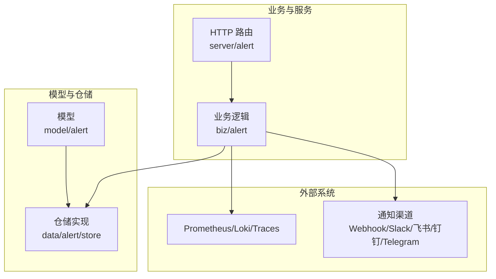
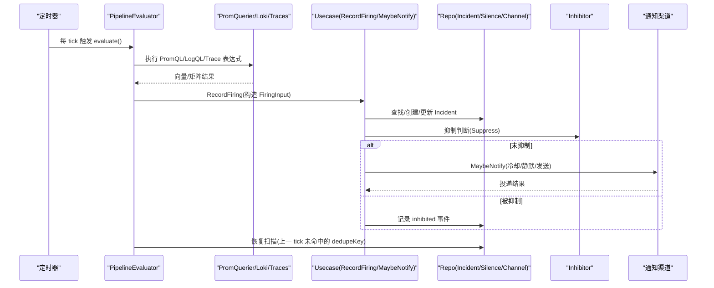
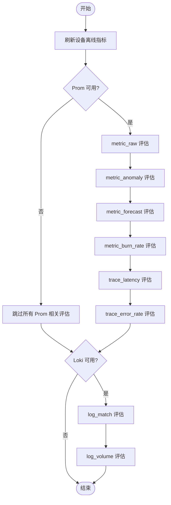
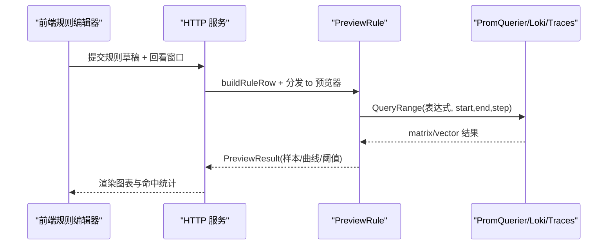
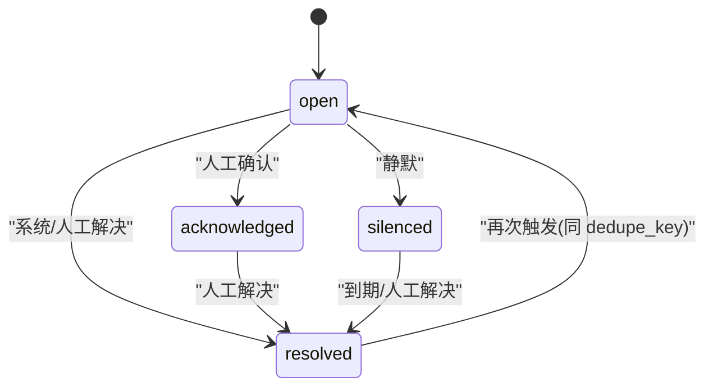
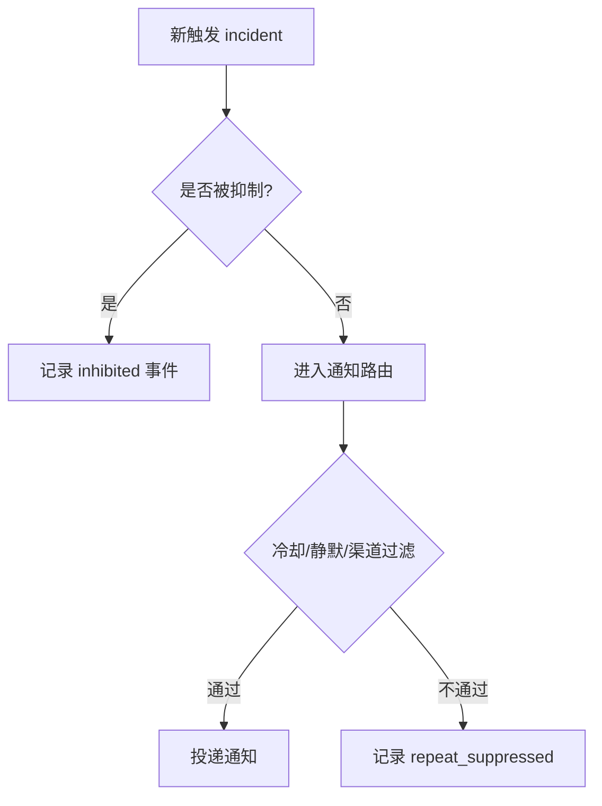
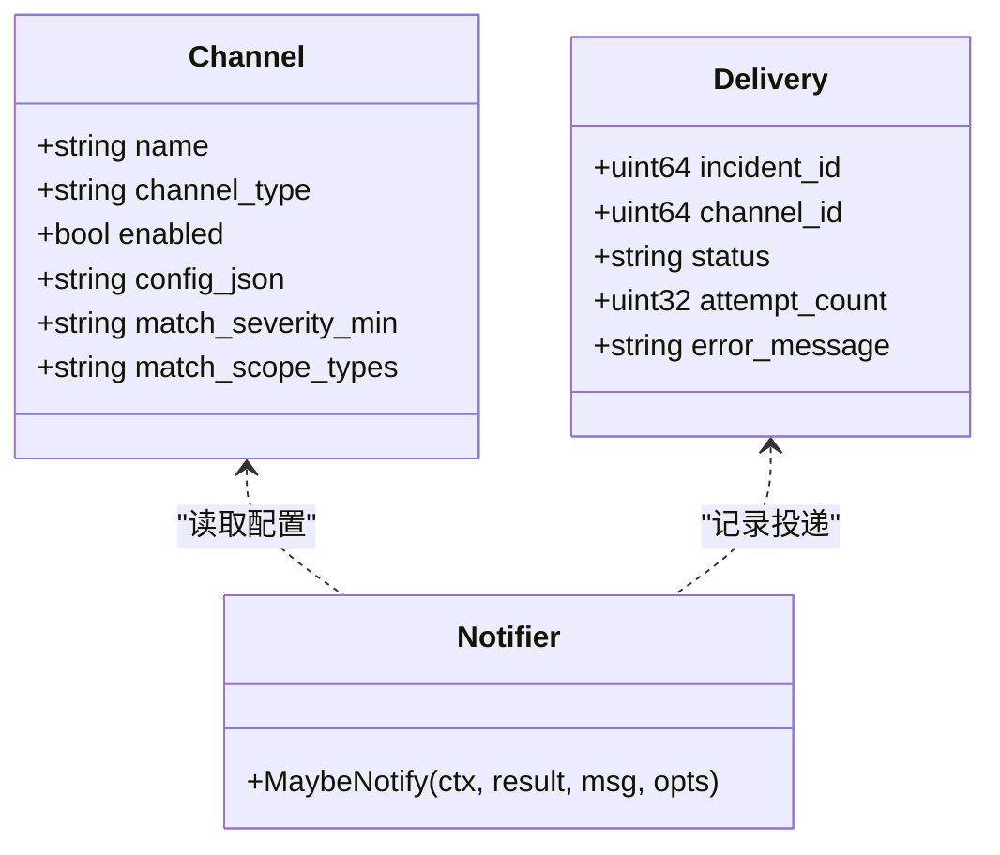
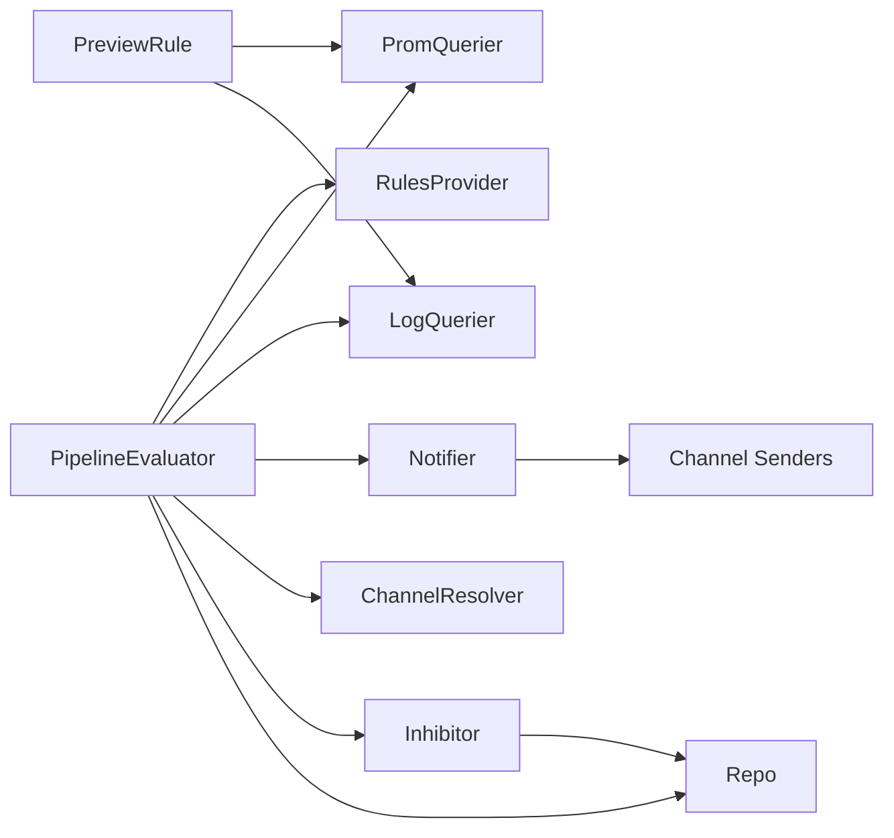

# 告警系统

<cite>
**本文引用的文件**   
- [pipeline.go](file://internal/manager/biz/alert/pipeline.go)
- [evaluators_phaseA.go](file://internal/manager/biz/alert/evaluators_phaseA.go)
- [preview.go](file://internal/manager/biz/alert/preview.go)
- [inhibit.go](file://internal/manager/biz/alert/inhibit.go)
- [repo.go](file://internal/manager/biz/alert/repo.go)
- [model.go](file://internal/manager/model/alert/model.go)
- [investigation.go](file://internal/manager/model/alert/investigation.go)
- [alert.proto](file://api/manager/alert/v1/alert.proto)
- [http.go](file://internal/manager/server/alert/http.go)
- [main.go](file://cmd/ongrid/main.go)
- [webhook.go](file://internal/pkg/notify/webhook.go)
- [usecase.go](file://internal/manager/biz/alert/usecase.go)
- [store_repo.go](file://internal/manager/data/alert/store/repo.go)
</cite>

## 目录
1. [简介](#简介)
2. [项目结构](#项目结构)
3. [核心组件](#核心组件)
4. [架构总览](#架构总览)
5. [详细组件分析](#详细组件分析)
6. [依赖关系分析](#依赖关系分析)
7. [性能与稳定性](#性能与稳定性)
8. [故障排查指南](#故障排查指南)
9. [结论](#结论)
10. [附录：规则编写与最佳实践](#附录：规则编写与最佳实践)

## 简介
本文件面向运维与平台工程师，系统化阐述 ongrid 告警系统的完整生命周期：从规则定义、预览校验、PromQL/Loki/Trace 查询引擎集成、评估引擎与实例生成，到抑制去重聚合、多渠道通知、升级策略与自动化修复工单联动。文档同时提供配置、调试与排障指南，帮助快速落地并稳定运行。

## 项目结构
告警子系统位于 manager 域内，采用“模型-仓储-业务-服务-HTTP”分层组织：
- 模型层：Incident、Event、Rule、Channel、Delivery、InvestigationReport 等实体定义
- 仓储层：基于 GORM 的持久化实现（SQLite）
- 业务层：Usecase、PipelineEvaluator、Inhibitor、Preview 等
- 服务层：gRPC/HTTP 接口适配
- 外部集成：Prometheus、Loki、Traces（spanmetrics）、IM/Webhook 渠道

图表来源
- [model.go](file://internal/manager/model/alert/model.go)
- [store_repo.go](file://internal/manager/data/alert/store/repo.go)
- [pipeline.go](file://internal/manager/biz/alert/pipeline.go)
- [http.go](file://internal/manager/server/alert/http.go)

章节来源
- [model.go](file://internal/manager/model/alert/model.go)
- [store_repo.go](file://internal/manager/data/alert/store/repo.go)
- [pipeline.go](file://internal/manager/biz/alert/pipeline.go)
- [http.go](file://internal/manager/server/alert/http.go)

## 核心组件
- 管道评估器 PipelineEvaluator：定时轮询，按规则类型分发到 metric_raw/anomaly/forecast/burn_rate/log_match/log_volume/trace_* 子评估器；负责设备离线指标刷新、恢复判定、事件记录与通知触发。
- 规则与模型：Incident/Event/Rule/Channel/Delivery/InvestigationReport 等，统一状态机与标签体系。
- 抑制器 Inhibitor：内置 edge_offline 抑制主机级噪声、prom_ingest_fail 抑制 scrape_down 风暴。
- 预览 PreviewRule：对规则进行编译与历史窗口试算，返回命中样本与可选曲线图数据。
- 通知通道：Webhook/Slack/飞书/钉钉/企业微信/Telegram，支持签名与结构化消息体。
- 自动调查 Investigator：新发告警时异步触发根因初查报告，写入 investigation_reports。

章节来源
- [pipeline.go](file://internal/manager/biz/alert/pipeline.go)
- [model.go](file://internal/manager/model/alert/model.go)
- [inhibit.go](file://internal/manager/biz/alert/inhibit.go)
- [preview.go](file://internal/manager/biz/alert/preview.go)
- [webhook.go](file://internal/pkg/notify/webhook.go)
- [investigation.go](file://internal/manager/model/alert/investigation.go)

## 架构总览

图表来源
- [pipeline.go](file://internal/manager/biz/alert/pipeline.go)
- [inhibit.go](file://internal/manager/biz/alert/inhibit.go)
- [repo.go](file://internal/manager/biz/alert/repo.go)

## 详细组件分析

### 管道评估器与评估阶段
- 设备离线指标刷新：将 host 最后心跳时间转换为 device_last_seen_seconds_ago gauge，供 metric_raw 规则直接消费，统一了“主机离线”的检测路径。
- metric_raw：表达式即谓词，PromQL 比较过滤后返回的每个向量项视为一次触发；通过 dedupe_key 去重，并在下一 tick 对比快照实现自动恢复。
- metric_anomaly：基于基线窗口计算均值/标准差或中位数/绝对偏差，超过阈值则触发。
- metric_forecast：predict_linear 外推在预测窗口内穿越阈值则触发。
- metric_burn_rate：多窗口多倍率 SLO burn rate 组合判定，任一窗口不满足则整体不触发；全部满足才触发。
- log_match/log_volume：基于 Loki count_over_time 统计匹配行数或总量，支持行过滤与窗口聚合。
- trace_latency/trace_error_rate：基于 spanmetrics 直方图与调用计数计算延迟分位与错误率。

图表来源
- [pipeline.go](file://internal/manager/biz/alert/pipeline.go)
- [evaluators_phaseA.go](file://internal/manager/biz/alert/evaluators_phaseA.go)

章节来源
- [pipeline.go](file://internal/manager/biz/alert/pipeline.go)
- [evaluators_phaseA.go](file://internal/manager/biz/alert/evaluators_phaseA.go)

### 规则定义与预览
- 规则输入包含 kind、scope_type、join_mode、severity、conditions、labels、runbook_url、通知策略（窗口+最小触发次数）以及可选的通知渠道覆盖。
- 预览流程：编译规则 → 选择合适的数据源（Prom/Loki/Traces）→ 在指定回看窗口内执行范围查询 → 输出命中样本数、最近样本、可选曲线与阈值参考。
- 对于 metric_raw，若表达式可解析为“左值 比较符 阈值”，预览会额外拉取左值序列以绘制曲线与阈值线。

图表来源
- [preview.go](file://internal/manager/biz/alert/preview.go)
- [http.go](file://internal/manager/server/alert/http.go)

章节来源
- [preview.go](file://internal/manager/biz/alert/preview.go)
- [http.go](file://internal/manager/server/alert/http.go)

### 实例生成与生命周期
- 去重键：pipeline:<rule_key>:label_set_key（host 规则附加 device_id），避免同一主体重复告警。
- 状态机：open → acknowledged/silenced → resolved；reopened 由再次触发驱动；silence 按时间窗与匹配器生效。
- 事件审计：每次 firing、repeat_suppressed、ack/silence/resolve、notification_sent/failed、inhibited、ai_initial_diagnosis 均落库。
- 恢复机制：metric_raw 通过上一 tick 的 fired 快照对比，PromQL 不再返回某 series 即视为条件清除，系统自动 resolve。

图表来源
- [model.go](file://internal/manager/model/alert/model.go)
- [store_repo.go](file://internal/manager/data/alert/store/repo.go)

章节来源
- [model.go](file://internal/manager/model/alert/model.go)
- [store_repo.go](file://internal/manager/data/alert/store/repo.go)

### 抑制、去重与聚合
- 抑制规则（BuiltinInhibitor）：
  - 当主机级别存在 edge_offline 活跃实例时，抑制该主机上的其他告警。
  - 当 pipeline:prom_ingest_fail 活跃时，抑制 pipeline:scrape_down:* 类告警。
- 去重键：基于 rule_key 与 label_set_key（排除 __name__、ongrid_source 等非身份标签）。
- 聚合：burn_rate 要求多窗口同时满足；log_volume 可按窗口聚合计数；trace 错误率按服务维度聚合。

图表来源
- [inhibit.go](file://internal/manager/biz/alert/inhibit.go)
- [pipeline.go](file://internal/manager/biz/alert/pipeline.go)

章节来源
- [inhibit.go](file://internal/manager/biz/alert/inhibit.go)
- [pipeline.go](file://internal/manager/biz/alert/pipeline.go)

### 多渠道通知与签名
- 支持的渠道：Webhook、Slack、飞书、钉钉、企业微信、Telegram。
- 通用 Webhook：可携带 HMAC 签名头；Slack 使用 attachments 结构化展示；飞书支持 timestamp+sign 签名。
- 渠道筛选：按 severity_min、scope_types 白名单、规则级 notify_channel_ids_json 覆盖。
- 投递重试：delivery 表记录每次尝试，失败且未超预算的条目会被重试工作流处理。

图表来源
- [model.go](file://internal/manager/model/alert/model.go)
- [webhook.go](file://internal/pkg/notify/webhook.go)
- [usecase.go](file://internal/manager/biz/alert/usecase.go)

章节来源
- [webhook.go](file://internal/pkg/notify/webhook.go)
- [usecase.go](file://internal/manager/biz/alert/usecase.go)
- [model.go](file://internal/manager/model/alert/model.go)

### 自动调查与升级策略
- 自动调查：新发告警时，后台异步启动调查 agent，收集 metric/log/trace 证据，产出三段式初查报告（现象定性、可能根因、立即可执行步骤），写入 investigation_reports 并关联事件流。
- 升级策略：可在规则层设置「发送策略」——在窗口内达到最小触发次数才通知；结合抑制与静默，降低风暴风险。
- 自动化修复：可通过技能（skills）与工具注册表（tools）联动，在调查报告中给出可直接执行的命令或动作建议，后续可扩展为一键执行与审批流。

章节来源
- [investigation.go](file://internal/manager/model/alert/investigation.go)
- [model.go](file://internal/manager/model/alert/model.go)

### HTTP/gRPC 接口与入口
- gRPC AlertService：提供 incidents 列表、详情、确认、解决等能力。
- HTTP 路由：承载告警管理、通知渠道管理、事件查看等页面后端。
- 启动装配：初始化 Repo/Usecase/CachedRulesProvider/Resolver/Inhibitor，并启动 PipelineEvaluator 循环。

章节来源
- [alert.proto](file://api/manager/alert/v1/alert.proto)
- [http.go](file://internal/manager/server/alert/http.go)
- [main.go](file://cmd/ongrid/main.go)

## 依赖关系分析
- 组件耦合：
  - PipelineEvaluator 依赖 RulesProvider、PromQuerier、LogQuerier、Notifier、ChannelResolver、Inhibitor、Repo。
  - PreviewRule 依赖 PromQuerier/Loki/Traces 客户端，仅读无副作用。
  - Inhibitor 依赖 Repo 的 incident 查询。
  - 通知模块依赖各渠道 Sender 实现。
- 外部依赖：
  - Prometheus（PromQL）、Loki（LogQL）、Traces（spanmetrics）。
  - IM/Webhook 渠道（HTTP 出站）。
- 潜在环依赖：通过接口抽象（如 PromQuerier、LogQuerier、Notifier、Inhibitor）解耦，避免循环引用。

图表来源
- [pipeline.go](file://internal/manager/biz/alert/pipeline.go)
- [preview.go](file://internal/manager/biz/alert/preview.go)
- [inhibit.go](file://internal/manager/biz/alert/inhibit.go)
- [repo.go](file://internal/manager/biz/alert/repo.go)

章节来源
- [pipeline.go](file://internal/manager/biz/alert/pipeline.go)
- [preview.go](file://internal/manager/biz/alert/preview.go)
- [inhibit.go](file://internal/manager/biz/alert/inhibit.go)
- [repo.go](file://internal/manager/biz/alert/repo.go)

## 性能与稳定性
- 评估间隔与冷却：默认评估间隔 5 分钟、冷却 10 分钟，可按需调整以降低负载与通知风暴。
- 指标刷新：device_last_seen_seconds_ago 每 tick 刷新，删除已下线设备的系列，避免残留触发。
- 恢复判定：metric_raw 通过上一 tick 快照对比，无需额外计数器，减少存储压力。
- 预览降采样：曲线点上限 1500，采用步长抽取保证 UI 流畅。
- 重试与幂等：delivery 表记录投递状态与错误信息，失败重试有最大尝试次数限制。

[本节为通用指导，不涉及具体代码片段]

## 故障排查指南
- 无法触发 metric_raw：
  - 检查表达式是否为有效 PromQL 且能返回 vector/matrix。
  - 确认 Prometheus 可达且时间戳对齐。
  - 查看评估日志与 histogram 指标定位慢查询或错误。
- 频繁重复告警：
  - 检查 dedupe_key 是否合理，避免非身份标签参与。
  - 启用抑制规则（edge_offline/prom_ingest_fail）。
  - 配置发送策略（窗口+最小触发次数）。
- 通知未送达：
  - 核对渠道配置（endpoint/secret/token）与签名算法。
  - 查看 delivery 表与 notification_deliveries 记录，定位失败原因。
- 自动恢复不生效：
  - 确认 metric_raw 表达式语义正确，PromQL 比较过滤后应移除 series。
  - 检查上一 tick 快照与当前结果差异。

章节来源
- [pipeline.go](file://internal/manager/biz/alert/pipeline.go)
- [inhibit.go](file://internal/manager/biz/alert/inhibit.go)
- [store_repo.go](file://internal/manager/data/alert/store/repo.go)

## 结论
本告警系统以统一的管道评估为核心，兼容多种信号源与复杂规则形态，配合抑制、去重、静默与发送策略，有效缓解告警风暴；通过预览与自动调查提升规则质量与排障效率；多渠道通知与投递重试保障触达可靠性。建议在生产环境结合业务特征调优评估间隔、冷却与发送策略，并完善渠道签名与白名单安全控制。

[本节为总结性内容，不涉及具体代码片段]

## 附录：规则编写与最佳实践
- 规则设计原则
  - 明确 scope：host 规则务必携带 device_id 标签；global 规则避免过度拆分。
  - 表达式简洁：尽量用比较运算符表达阈值，便于预览提取阈值线与自动恢复。
  - 合理窗口：避免过短窗口导致抖动，过长窗口导致延迟。
- 误报减少
  - 使用抑制规则屏蔽衍生噪声（如 edge_offline 下的主机告警）。
  - 利用发送策略（窗口+最小触发次数）过滤瞬时波动。
  - 使用 labels 精细化分组，避免跨实例合并。
- 性能优化
  - 优先使用 closed-set 指标（cpu_pct/mem_pct/disk_used_pct 等）以获得更稳定的表达式。
  - 预览阶段限定回看窗口，避免过大范围查询。
  - 对高频规则增加缓存与限流（由上层 Provider 控制）。
- 通知与合规
  - 为 Webhook/飞书/钉钉等开启签名与白名单。
  - 为关键渠道设置 severity_min 与 scope_types 过滤。
  - 保留 runbook_url 以便快速处置。

[本节为通用指导，不涉及具体代码片段]