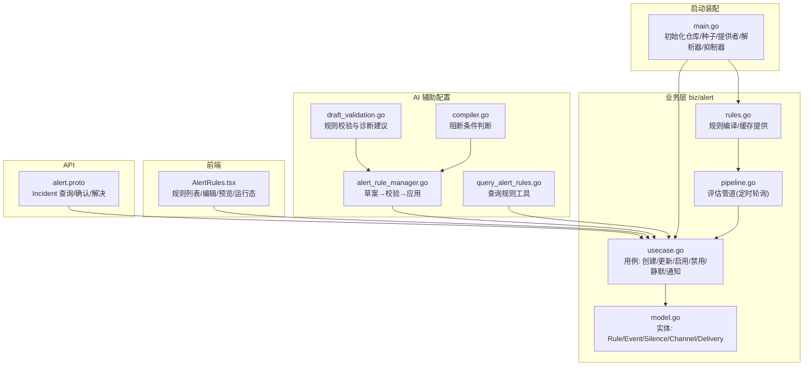
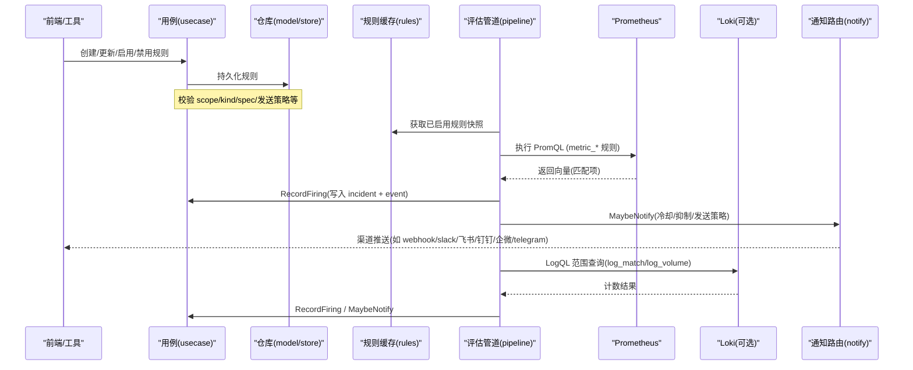
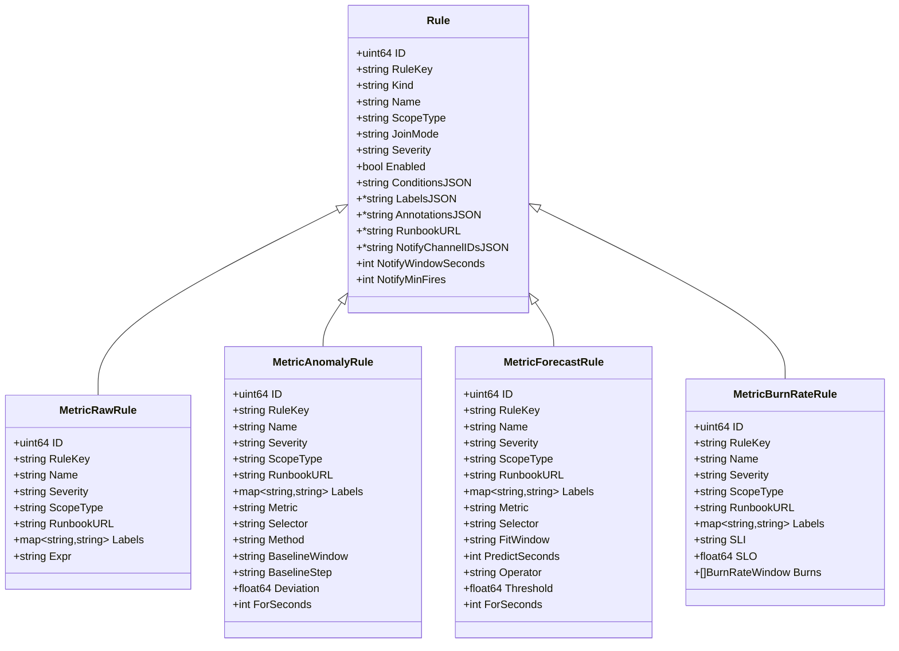
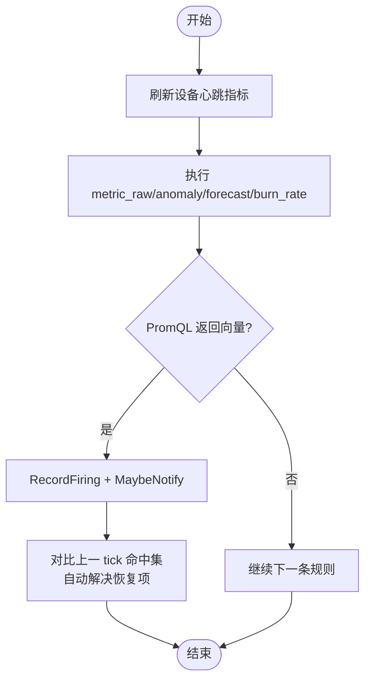
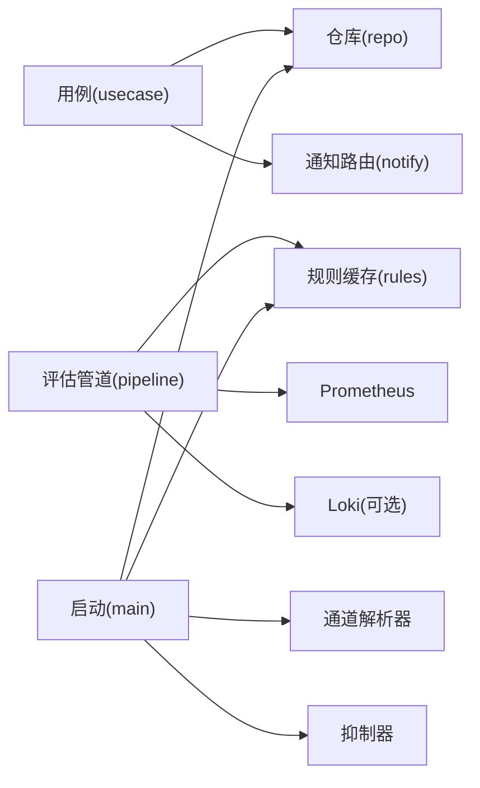

# 告警规则管理

<cite>
**本文引用的文件**   
- [alert.proto](file://api/manager/alert/v1/alert.proto)
- [rules.go](file://internal/manager/biz/alert/rules.go)
- [pipeline.go](file://internal/manager/biz/alert/pipeline.go)
- [usecase.go](file://internal/manager/biz/alert/usecase.go)
- [model.go](file://internal/manager/model/alert/model.go)
- [draft_validation.go](file://internal/manager/biz/aiops/alertconfig/draft_validation.go)
- [alert_rule_manager.go](file://internal/manager/biz/aiops/alertconfig/alert_rule_manager.go)
- [compiler.go](file://internal/manager/biz/aiops/alertdraft/compiler.go)
- [query_alert_rules.go](file://internal/manager/biz/aiops/tools/query_alert_rules.go)
- [AlertRules.tsx](file://web/src/pages/AlertRules.tsx)
- [main.go](file://cmd/ongrid/main.go)
</cite>

## 目录
1. [简介](#简介)
2. [项目结构](#项目结构)
3. [核心组件](#核心组件)
4. [架构总览](#架构总览)
5. [详细组件分析](#详细组件分析)
6. [依赖关系分析](#依赖关系分析)
7. [性能与容量规划](#性能与容量规划)
8. [排障指南](#排障指南)
9. [结论](#结论)
10. [附录：PromQL 编写规范与示例](#附录promql-编写规范与示例)

## 简介
本文件面向运维人员，系统化阐述告警规则的定义、存储、生命周期管理与执行流程。重点覆盖以下能力：
- 规则类型：metric_raw、metric_anomaly、metric_forecast、metric_burn_rate（以及 log_match/log_volume、trace_latency/trace_error_rate 的保存与评估状态）
- PromQL 表达式编写规范：时间窗口、聚合函数、标签过滤与布尔谓词
- 作用域：全局、设备级（host）、平台自身（monitoring_pipeline）的配置与适用场景
- 版本控制、启用/禁用机制、配置校验与预览
- 调试工具与测试方法：预览、事件回放、冷却与抑制、发送策略
- 最佳实践与常见错误排查

## 项目结构
与告警规则相关的代码主要分布在以下模块：
- API 层：incident 查询与操作接口定义
- 业务层（biz/alert）：规则编译、缓存、评估管道、用例编排
- 模型层（model/alert）：规则、事件、静默、通知通道等数据实体
- AI 辅助配置（biz/aiops/alertconfig）：草案生成、校验、应用工作流
- 前端页面（web）：规则列表、编辑、预览与运行态信息展示
- 启动装配（cmd/ongrid）：规则提供者、解析器、抑制器、种子数据初始化

图表来源
- [alert.proto:1-88](file://api/manager/alert/v1/alert.proto#L1-L88)
- [rules.go:1-200](file://internal/manager/biz/alert/rules.go#L1-L200)
- [pipeline.go:1-120](file://internal/manager/biz/alert/pipeline.go#L1-L120)
- [usecase.go:575-813](file://internal/manager/biz/alert/usecase.go#L575-L813)
- [model.go:292-338](file://internal/manager/model/alert/model.go#L292-L338)
- [alert_rule_manager.go:1-120](file://internal/manager/biz/aiops/alertconfig/alert_rule_manager.go#L1-L120)
- [draft_validation.go:55-103](file://internal/manager/biz/aiops/alertconfig/draft_validation.go#L55-L103)
- [compiler.go:10-33](file://internal/manager/biz/aiops/alertdraft/compiler.go#L10-L33)
- [query_alert_rules.go:88-134](file://internal/manager/biz/aiops/tools/query_alert_rules.go#L88-L134)
- [AlertRules.tsx:187-220](file://web/src/pages/AlertRules.tsx#L187-L220)
- [main.go:1022-1050](file://cmd/ongrid/main.go#L1022-L1050)

章节来源
- [alert.proto:1-88](file://api/manager/alert/v1/alert.proto#L1-L88)
- [rules.go:1-200](file://internal/manager/biz/alert/rules.go#L1-L200)
- [pipeline.go:1-120](file://internal/manager/biz/alert/pipeline.go#L1-L120)
- [usecase.go:575-813](file://internal/manager/biz/alert/usecase.go#L575-L813)
- [model.go:292-338](file://internal/manager/model/alert/model.go#L292-L338)
- [alert_rule_manager.go:1-120](file://internal/manager/biz/aiops/alertconfig/alert_rule_manager.go#L1-L120)
- [draft_validation.go:55-103](file://internal/manager/biz/aiops/alertconfig/draft_validation.go#L55-L103)
- [compiler.go:10-33](file://internal/manager/biz/aiops/alertdraft/compiler.go#L10-L33)
- [query_alert_rules.go:88-134](file://internal/manager/biz/aiops/tools/query_alert_rules.go#L88-L134)
- [AlertRules.tsx:187-220](file://web/src/pages/AlertRules.tsx#L187-L220)
- [main.go:1022-1050](file://cmd/ongrid/main.go#L1022-L1050)

## 核心组件
- 规则模型与种类
  - 支持 metric_raw、metric_anomaly、metric_forecast、metric_burn_rate；log_match/log_volume、trace_latency/trace_error_rate 可保存但评估器尚未完全上线
  - 规则键（rule_key）唯一且稳定，用于去重与关联事件
  - 作用域：global、host、monitoring_pipeline；不同 kind 有默认与作用域白名单
- 规则编译与缓存
  - 从持久化行读取并编译为运行时结构体，按 kind 分类缓存
  - 周期性刷新，原子替换快照，避免并发读脏数据
- 评估管道
  - 定时轮询触发，依次执行 metric_raw/anomaly/forecast/burn_rate 及日志/追踪类规则（若可用）
  - 对 metric_raw：PromQL 返回向量即视为命中，逐条记录事件并尝试通知
  - 自动恢复：上一 tick 命中而当前未命中的 dedupe key 会被系统自动解决
- 用例编排
  - 创建/更新/启用/禁用/删除规则
  - 静默（silence）、冷却（cooldown）、抑制（inhibit）、发送策略（window+min_fires）
  - 通知投递记录（delivery）与审计事件（event）
- AI 辅助配置
  - 自然语言/表单草稿 → 预检 → 预览 → 应用
  - 校验失败时给出明确错误与建议，必要时阻止创建

章节来源
- [model.go:90-177](file://internal/manager/model/alert/model.go#L90-L177)
- [rules.go:206-458](file://internal/manager/biz/alert/rules.go#L206-L458)
- [pipeline.go:147-196](file://internal/manager/biz/alert/pipeline.go#L147-L196)
- [usecase.go:627-704](file://internal/manager/biz/alert/usecase.go#L627-L704)
- [alert_rule_manager.go:22-51](file://internal/manager/biz/aiops/alertconfig/alert_rule_manager.go#L22-L51)
- [draft_validation.go:55-103](file://internal/manager/biz/aiops/alertconfig/draft_validation.go#L55-L103)

## 架构总览
下图展示了从“规则定义”到“评估与通知”的关键路径，以及与外部系统的交互点。

图表来源
- [pipeline.go:147-196](file://internal/manager/biz/alert/pipeline.go#L147-L196)
- [rules.go:305-458](file://internal/manager/biz/alert/rules.go#L305-L458)
- [usecase.go:315-479](file://internal/manager/biz/alert/usecase.go#L315-L479)
- [usecase.go:1215-1358](file://internal/manager/biz/alert/usecase.go#L1215-L1358)

## 详细组件分析

### 规则模型与种类
- 规则字段
  - rule_key、kind、name、scope_type、join_mode、severity、enabled、conditions_json、labels_json、runbook_url、notify_channel_ids_json、notify_window_seconds、notify_min_fires
- 规则种类与默认作用域
  - metric_threshold（仅 UI 输入，保存时降级为 metric_raw）
  - metric_raw：任意 PromQL 布尔谓词
  - metric_anomaly：基于滚动基线的异常检测（zscore/mad）
  - metric_forecast：线性外推预测阈值穿越
  - metric_burn_rate：SLO 多窗口多燃烧率
  - log_match/log_volume、trace_latency/trace_error_rate：可保存，评估器逐步上线
- 作用域白名单与默认值
  - 不同 kind 允许的作用域集合不同，空值时回退到默认

图表来源
- [model.go:292-338](file://internal/manager/model/alert/model.go#L292-L338)
- [rules.go:36-91](file://internal/manager/biz/alert/rules.go#L36-L91)
- [rules.go:167-191](file://internal/manager/biz/alert/rules.go#L167-L191)

章节来源
- [model.go:90-177](file://internal/manager/model/alert/model.go#L90-L177)
- [model.go:292-338](file://internal/manager/model/alert/model.go#L292-L338)
- [rules.go:36-91](file://internal/manager/biz/alert/rules.go#L36-L91)
- [rules.go:167-191](file://internal/manager/biz/alert/rules.go#L167-L191)

### 规则编译与缓存
- 编译入口：按 kind 解析 conditions_json 为运行时结构体，缺失或非法字段会记录警告并跳过该行，不影响整体评估
- 缓存提供器：周期性加载并原子替换快照，读取端无锁
- 兼容与别名：normalizeKind 将历史 kind 映射到当前实现，metric_threshold 在保存阶段被改写为 metric_raw

章节来源
- [rules.go:358-458](file://internal/manager/biz/alert/rules.go#L358-L458)
- [model.go:134-177](file://internal/manager/model/alert/model.go#L134-L177)
- [usecase.go:706-813](file://internal/manager/biz/alert/usecase.go#L706-L813)

### 评估管道与自动恢复
- 定时循环：每 tick 先刷新设备心跳指标（device_last_seen_seconds_ago），再依次评估各类规则
- metric_raw：PromQL 返回向量即触发，逐条记录事件；通过上一 tick 的命中快照对比，自动解决恢复项
- 日志/追踪：当客户端可用时执行相应查询，否则跳过

图表来源
- [pipeline.go:170-196](file://internal/manager/biz/alert/pipeline.go#L170-L196)
- [pipeline.go:254-380](file://internal/manager/biz/alert/pipeline.go#L254-L380)

章节来源
- [pipeline.go:147-196](file://internal/manager/biz/alert/pipeline.go#L147-L196)
- [pipeline.go:254-380](file://internal/manager/biz/alert/pipeline.go#L254-L380)

### 规则生命周期管理（创建/更新/启用/禁用/删除）
- 创建/更新：统一走 buildRuleRow/buildConditionsJSON，进行 kind/scope/operator/字段校验与序列化
- 启用/禁用：SetRuleEnabled 直接切换 enabled 位
- 删除：内置规则不可删除，仅能禁用
- 发送策略：window+min_fires 同时为 0 表示禁用；均大于 0 表示启用，混合值拒绝

章节来源
- [usecase.go:627-704](file://internal/manager/biz/alert/usecase.go#L627-L704)
- [usecase.go:706-813](file://internal/manager/biz/alert/usecase.go#L706-L813)
- [usecase.go:815-981](file://internal/manager/biz/alert/usecase.go#L815-L981)

### 作用域（全局/设备级/平台自身）
- 作用域白名单：不同 kind 允许的作用域不同，空值时采用默认
- host：适合主机资源、系统日志、设备上采集的数据库实例指标
- global：服务级、SLO、Trace 或明确按整体汇总的规则
- monitoring_pipeline：监控平台自身健康（采集、存储、告警链路）

章节来源
- [usecase.go:983-1023](file://internal/manager/biz/alert/usecase.go#L983-L1023)
- [alert_rule_manager.go:175-207](file://internal/manager/biz/aiops/alertconfig/alert_rule_manager.go#L175-L207)

### 版本控制、预览与校验
- 草稿与校验：AI 辅助配置生成草稿，执行语法/语义检查与预览，给出错误与建议
- 阻断条件：某些关键错误会阻止创建（如 required/unsupported/$window 不满足等）
- 预览限制：系列数与样本数上限，避免过大查询影响性能

章节来源
- [draft_validation.go:55-103](file://internal/manager/biz/aiops/alertconfig/draft_validation.go#L55-L103)
- [compiler.go:10-33](file://internal/manager/biz/aiops/alertdraft/compiler.go#L10-L33)
- [alert_rule_manager.go:16-20](file://internal/manager/biz/aiops/alertconfig/alert_rule_manager.go#L16-L20)

### 通知、静默、抑制与冷却
- 静默：支持按 scope/device/rule 匹配，支持时间窗
- 冷却：同一 incident 两次通知的最小间隔
- 抑制：高优先级 incident 可抑制低优先级通知
- 发送策略：在 window 内达到 min_fires 才通知，否则记录 repeat_suppressed

章节来源
- [usecase.go:1215-1358](file://internal/manager/biz/alert/usecase.go#L1215-L1358)
- [usecase.go:1474-1516](file://internal/manager/biz/alert/usecase.go#L1474-L1516)

### 前端与运行态
- 规则列表页：显示 severity、摘要、启用开关、编辑/删除按钮
- 运行态信息：展示评估周期与冷却时间等
- 表达式编辑器：metric_raw 支持完整 PromQL 表达式（含比较）

章节来源
- [AlertRules.tsx:187-220](file://web/src/pages/AlertRules.tsx#L187-L220)
- [AlertRules.tsx:521-556](file://web/src/pages/AlertRules.tsx#L521-L556)
- [AlertRules.tsx:1257-1278](file://web/src/pages/AlertRules.tsx#L1257-L1278)

## 依赖关系分析
- 对外依赖
  - Prometheus：PromQL 即时查询（metric_* 规则）
  - Loki：LogQL 范围查询（log_match/log_volume，可选）
  - 通知渠道：webhook/slack/飞书/钉钉/企微/telegram
- 内部依赖
  - 仓库（repo）：规则、事件、静默、投递记录
  - 评估器：规则缓存、Prom/Loki 客户端
  - 启动装配：初始化仓库、种子数据、规则提供者、通道解析器、抑制器

图表来源
- [pipeline.go:1-120](file://internal/manager/biz/alert/pipeline.go#L1-120)
- [usecase.go:1215-1358](file://internal/manager/biz/alert/usecase.go#L1215-L1358)
- [main.go:1022-1050](file://cmd/ongrid/main.go#L1022-L1050)

章节来源
- [pipeline.go:1-120](file://internal/manager/biz/alert/pipeline.go#L1-120)
- [usecase.go:1215-1358](file://internal/manager/biz/alert/usecase.go#L1215-L1358)
- [main.go:1022-1050](file://cmd/ongrid/main.go#L1022-L1050)

## 性能与容量规划
- 评估间隔与冷却
  - 评估间隔默认 5 分钟（可配置），冷却默认 10 分钟（可配置）
  - 合理设置 window/min_fires 以抑制风暴
- 查询规模
  - 预览限制系列数与样本数，避免大查询
  - 使用合适的 selector 与聚合维度，减少向量基数
- 指标刷新
  - device_last_seen_seconds_ago 每 tick 刷新，确保主机离线规则及时生效

章节来源
- [pipeline.go:117-145](file://internal/manager/biz/alert/pipeline.go#L117-L145)
- [alert_rule_manager.go:16-20](file://internal/manager/biz/aiops/alertconfig/alert_rule_manager.go#L16-L20)
- [pipeline.go:198-252](file://internal/manager/biz/alert/pipeline.go#L198-L252)

## 排障指南
- 规则未生效
  - 检查 kind 是否可评估、scope 是否允许、enabled 是否为真
  - 查看缓存刷新日志与编译失败告警
- metric_raw 无预览序列
  - 表达式缺少比较谓词或 label 不匹配，需补全比较或使用聚合
- 高频告警
  - 调整阈值、selector、聚合维度；开启 window+min_fires 发送策略
- 通知未送达
  - 检查 channel 配置（endpoint/url）、是否启用、是否被抑制或冷却
- 自动恢复未触发
  - 确认 metric_raw 表达式在恢复后不再返回向量；检查 dedupe key 一致性

章节来源
- [rules.go:358-458](file://internal/manager/biz/alert/rules.go#L358-L458)
- [draft_validation.go:55-103](file://internal/manager/biz/aiops/alertconfig/draft_validation.go#L55-L103)
- [usecase.go:1215-1358](file://internal/manager/biz/alert/usecase.go#L1215-L1358)
- [pipeline.go:254-380](file://internal/manager/biz/alert/pipeline.go#L254-L380)

## 结论
本系统以 metric_raw 为核心，结合 anomaly/forecast/burn_rate 等高级规则类型，提供统一的规则定义、编译、缓存与评估管道。通过作用域、静默、冷却、抑制与发送策略的组合，兼顾灵活性与稳定性。AI 辅助配置与预览校验提升了易用性与安全性。运维人员可据此快速构建高质量、可维护的告警体系。

## 附录：PromQL 编写规范与示例

### 通用规范
- metric_raw 必须包含明确的比较谓词（例如 >、>=、==、!=），裸数值序列会在返回任意样本时被判定为触发
- 使用合适的时间窗口（[5m]、[1h]）与聚合函数（rate、increase、avg_over_time、sum by(...)）
- 标签过滤要精确，避免笛卡尔积爆炸；必要时用 on()/group_left/group_right 控制连接维度
- 持续性需求应体现在 PromQL 中（如 min_over_time/count_over_time 子查询），而非依赖 for_seconds

### 典型模式
- 主机 CPU 使用率超过阈值（设备级）
  - 思路：计算 idle 占比，取反得到使用率，按 device_id 聚合，比较阈值
- 服务错误率超过阈值（全局）
  - 思路：统计 ERROR 比例，按 service_name 聚合，比较百分比
- 磁盘空间将在未来 N 小时耗尽（预测）
  - 思路：使用 predict_linear 外推，比较预测值与阈值
- SLO 燃烧率（多窗口）
  - 思路：SLI 表达成功率，SLO 目标百分比，burns 指定多个窗口与倍数，全部窗口同时触发才报警

### 作用域选择建议
- host：主机资源、进程、本地日志、设备侧数据库实例
- global：跨主机聚合的服务级 SLO、Trace 错误率、平台整体健康
- monitoring_pipeline：平台自身采集/存储/告警链路健康

### 调试与测试方法
- 使用预览功能验证表达式与窗口，关注“无预览序列”“高命中次数”等提示
- 利用事件表（alert_events）与投递记录（notification_deliveries）定位问题
- 通过 query_alert_rules 工具筛选规则，结合名称/kind/enabled 过滤
- 在前端页面查看运行态信息（评估周期、冷却时间）

章节来源
- [draft_validation.go:55-103](file://internal/manager/biz/aiops/alertconfig/draft_validation.go#L55-L103)
- [query_alert_rules.go:88-134](file://internal/manager/biz/aiops/tools/query_alert_rules.go#L88-L134)
- [AlertRules.tsx:187-220](file://web/src/pages/AlertRules.tsx#L187-L220)
- [AlertRules.tsx:1257-1278](file://web/src/pages/AlertRules.tsx#L1257-L1278)