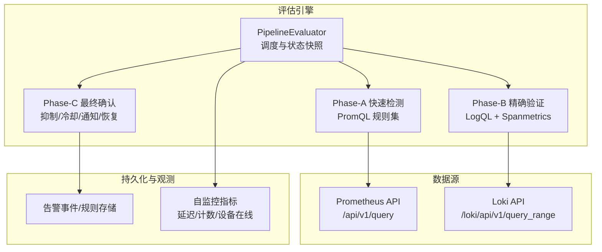
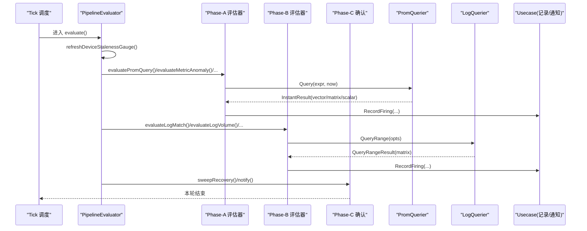
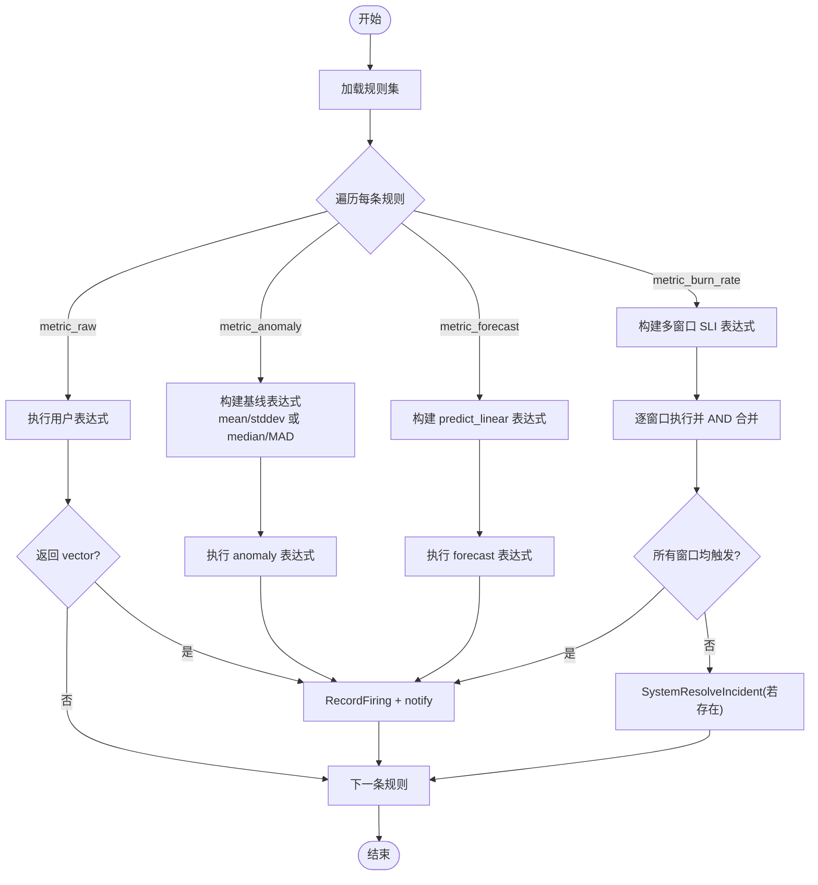
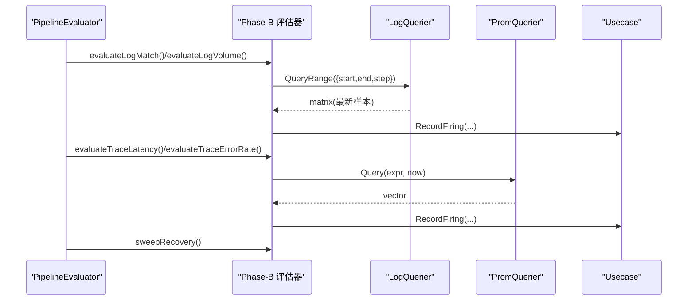
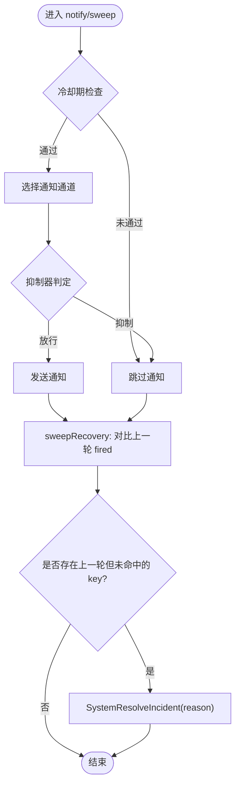
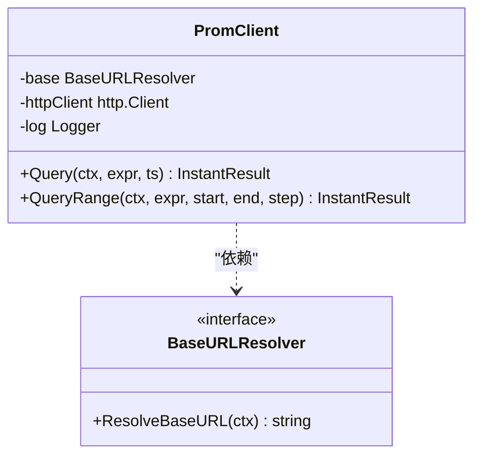
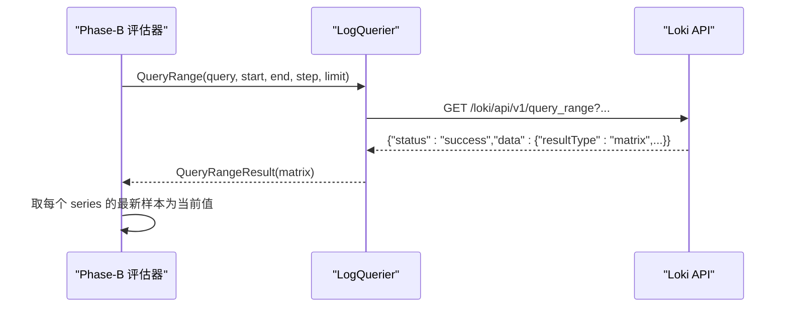
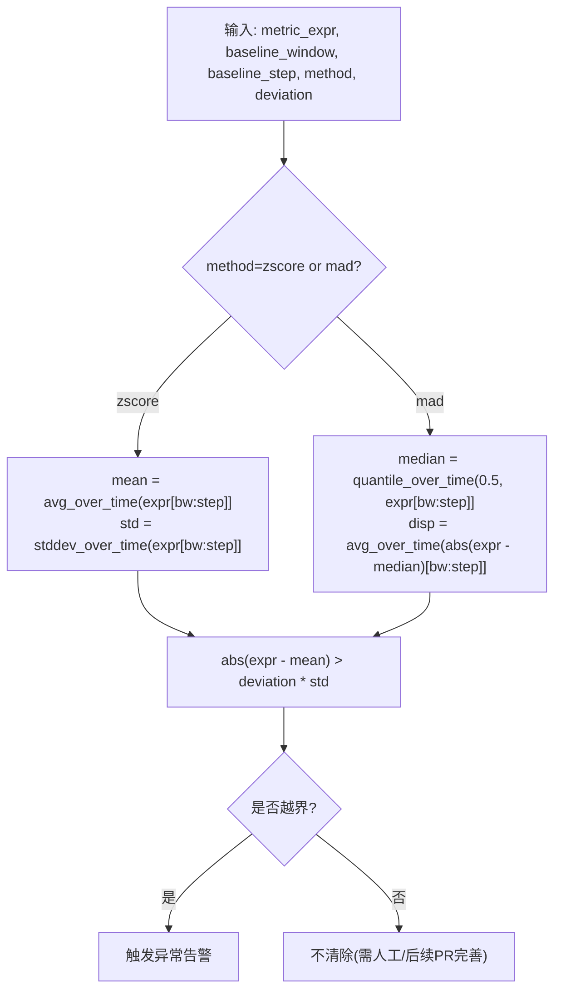
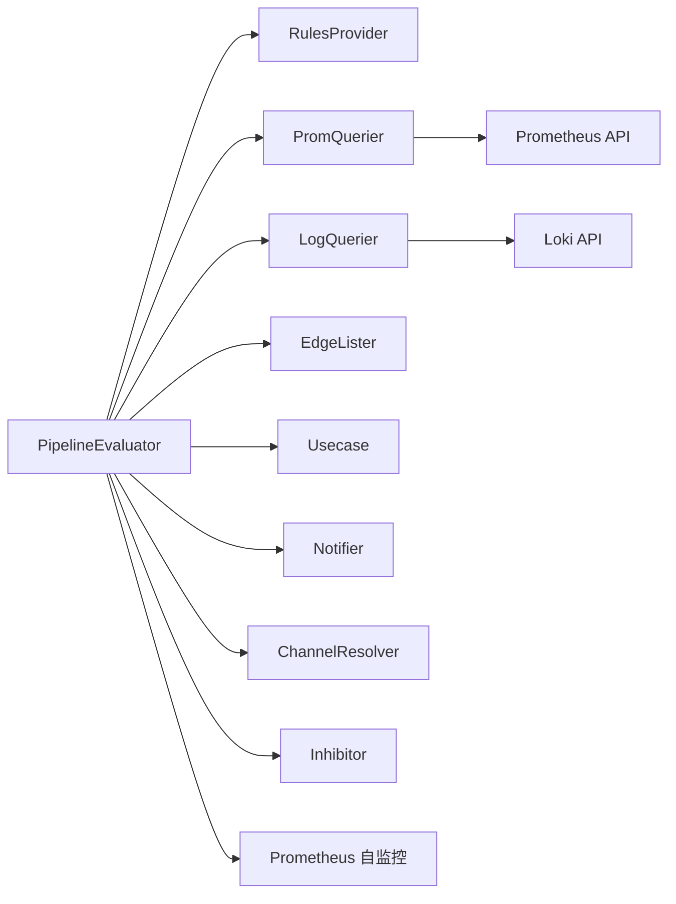

# 评估引擎

<cite>
**本文引用的文件**   
- [pipeline.go](file://internal/manager/biz/alert/pipeline.go)
- [evaluators_phaseA.go](file://internal/manager/biz/alert/evaluators_phaseA.go)
- [evaluators_phaseB.go](file://internal/manager/biz/alert/evaluators_phaseB.go)
- [client.go](file://internal/pkg/promquery/client.go)
- [client.go](file://internal/pkg/logquery/client.go)
- [main.go](file://cmd/ongrid/main.go)
- [manager_metrics.go](file://internal/pkg/prom/manager_metrics.go)
- [alert_evaluator_test.go](file://tests/e2e/alert_evaluator_test.go)
</cite>

## 目录
1. [简介](#简介)
2. [项目结构](#项目结构)
3. [核心组件](#核心组件)
4. [架构总览](#架构总览)
5. [详细组件分析](#详细组件分析)
6. [依赖关系分析](#依赖关系分析)
7. [性能考量与调优](#性能考量与调优)
8. [故障排查指南](#故障排查指南)
9. [结论](#结论)
10. [附录](#附录)

## 简介
本文件面向“告警评估引擎”的技术文档，聚焦三阶段评估架构（Phase-A 快速检测、Phase-B 精确验证、Phase-C 最终确认）的设计原理与执行流程；阐述 PromQL 查询执行引擎的集成方式（指标查询优化、结果缓存与错误处理）；说明日志匹配与体积监控的实现机制（LogQL 查询与时间序列分析）；解释异常检测与预测算法的工作原理（基线计算、偏差阈值与趋势分析）；并提供评估性能调优指南与故障排查方法。

## 项目结构
评估引擎位于 manager 业务层，围绕 PipelineEvaluator 组织：
- Phase-A（快速检测）：基于 Prometheus 的 metric_raw、metric_anomaly、metric_forecast、metric_burn_rate 等规则进行即时向量判断与统计推断。
- Phase-B（精确验证）：基于 Loki 的 log_match、log_volume 以及基于 spanmetrics 的 trace_latency、trace_error_rate 进行更细粒度的日志与链路验证。
- Phase-C（最终确认）：通过抑制器、冷却期、通知路由与系统级恢复策略完成最终确认与收敛。

图表来源
- [pipeline.go:147-196](file://internal/manager/biz/alert/pipeline.go#L147-L196)
- [evaluators_phaseA.go:148-338](file://internal/manager/biz/alert/evaluators_phaseA.go#L148-L338)
- [evaluators_phaseB.go:28-163](file://internal/manager/biz/alert/evaluators_phaseB.go#L28-L163)
- [client.go:94-117](file://internal/pkg/promquery/client.go#L94-L117)
- [client.go:124-171](file://internal/pkg/logquery/client.go#L124-L171)
- [manager_metrics.go:166-201](file://internal/pkg/prom/manager_metrics.go#L166-L201)

章节来源
- [pipeline.go:147-196](file://internal/manager/biz/alert/pipeline.go#L147-L196)
- [evaluators_phaseA.go:148-338](file://internal/manager/biz/alert/evaluators_phaseA.go#L148-L338)
- [evaluators_phaseB.go:28-163](file://internal/manager/biz/alert/evaluators_phaseB.go#L28-L163)
- [client.go:94-117](file://internal/pkg/promquery/client.go#L94-L117)
- [client.go:124-171](file://internal/pkg/logquery/client.go#L124-L171)
- [manager_metrics.go:166-201](file://internal/pkg/prom/manager_metrics.go#L166-L201)

## 核心组件
- PipelineEvaluator：统一调度入口，按 tick 周期依次执行各阶段评估，维护设备在线度规与上次触发快照以支持自动恢复。
- Phase-A 评估器：
  - metric_raw：直接执行用户表达式，返回向量即命中，缺失即恢复。
  - metric_anomaly：基于基线窗口与步长计算均值/标准差或中位数/MAD，比较偏离倍数。
  - metric_forecast：使用 predict_linear 对趋势外推并与阈值比较。
  - metric_burn_rate：多窗口 SLO burn rate 联合判定。
- Phase-B 评估器：
  - log_match / log_volume：构造 LogQL count_over_time 并在最近窗口内取最新样本作为瞬时值。
  - trace_latency / trace_error_rate：基于 spanmetrics 的 histogram_quantile 与错误率聚合。
- Phase-C 确认：
  - 抑制器与冷却期避免风暴与重复通知。
  - 系统级恢复：对比上一轮 fired 集合，缺失则系统解决。
  - 通知路由：根据规则与默认通道投递。

章节来源
- [pipeline.go:147-196](file://internal/manager/biz/alert/pipeline.go#L147-L196)
- [evaluators_phaseA.go:148-338](file://internal/manager/biz/alert/evaluators_phaseA.go#L148-L338)
- [evaluators_phaseB.go:28-163](file://internal/manager/biz/alert/evaluators_phaseB.go#L28-L163)

## 架构总览
评估引擎采用“分阶段+可插拔数据源”的架构：
- 控制面：PipelineEvaluator 驱动 tick 循环，按规则类型分发到对应评估器。
- 数据面：PromQuerier 与 LogQuerier 抽象外部数据源，便于替换与扩展。
- 状态面：firingSnapshot 记录每轮触发的去重键集合，用于自动恢复；gaugeSnapshot 管理设备在线度规。
- 观测面：通过 prometheus 指标暴露评估延迟、事件计数与设备最后可见时长。

图表来源
- [pipeline.go:170-196](file://internal/manager/biz/alert/pipeline.go#L170-L196)
- [evaluators_phaseA.go:254-338](file://internal/manager/biz/alert/evaluators_phaseA.go#L254-L338)
- [evaluators_phaseB.go:28-163](file://internal/manager/biz/alert/evaluators_phaseB.go#L28-L163)
- [client.go:94-117](file://internal/pkg/promquery/client.go#L94-L117)
- [client.go:124-171](file://internal/pkg/logquery/client.go#L124-L171)

## 详细组件分析

### Phase-A 快速检测（PromQL 规则）
- metric_raw：将用户表达式视为谓词，PromQL 返回向量即命中；缺失即恢复。
- metric_anomaly：在基线窗口与步长上计算均值/标准差或中位数/MAD，比较绝对偏离是否超过 n×σ 或 n×MAD。
- metric_forecast：predict_linear 外推未来值并与阈值比较。
- metric_burn_rate：多窗口 AND 语义，任一窗口未触发则不报警。

图表来源
- [evaluators_phaseA.go:148-338](file://internal/manager/biz/alert/evaluators_phaseA.go#L148-L338)
- [pipeline.go:254-380](file://internal/manager/biz/alert/pipeline.go#L254-L380)

章节来源
- [evaluators_phaseA.go:148-338](file://internal/manager/biz/alert/evaluators_phaseA.go#L148-L338)
- [pipeline.go:254-380](file://internal/manager/biz/alert/pipeline.go#L254-L380)

### Phase-B 精确验证（LogQL 与 Spanmetrics）
- log_match / log_volume：构造 count_over_time(stream[window]) 或带行过滤的 count_over_time(stream |~ regex [window])，通过 QueryRange 获取矩阵并取最新样本作为当前值。
- trace_latency / trace_error_rate：基于 spanmetrics 的 histogram_quantile 与错误率聚合表达式，走 PromQL 路径。

图表来源
- [evaluators_phaseB.go:28-163](file://internal/manager/biz/alert/evaluators_phaseB.go#L28-L163)
- [evaluators_phaseB.go:343-389](file://internal/manager/biz/alert/evaluators_phaseB.go#L343-L389)
- [client.go:124-171](file://internal/pkg/logquery/client.go#L124-L171)
- [client.go:94-117](file://internal/pkg/promquery/client.go#L94-L117)

章节来源
- [evaluators_phaseB.go:28-163](file://internal/manager/biz/alert/evaluators_phaseB.go#L28-L163)
- [evaluators_phaseB.go:343-389](file://internal/manager/biz/alert/evaluators_phaseB.go#L343-L389)
- [client.go:124-171](file://internal/pkg/logquery/client.go#L124-L171)
- [client.go:94-117](file://internal/pkg/promquery/client.go#L94-L117)

### Phase-C 最终确认（抑制、冷却、通知与恢复）
- 抑制器：降低噪声与级联告警。
- 冷却期：同一 dedupeKey 在冷却期内不重复通知。
- 通知路由：根据规则覆盖或默认通道投递。
- 系统恢复：对比上一轮 fired 集合，缺失则系统解决。

图表来源
- [pipeline.go:382-416](file://internal/manager/biz/alert/pipeline.go#L382-L416)
- [evaluators_phaseB.go:280-300](file://internal/manager/biz/alert/evaluators_phaseB.go#L280-L300)

章节来源
- [pipeline.go:382-416](file://internal/manager/biz/alert/pipeline.go#L382-L416)
- [evaluators_phaseB.go:280-300](file://internal/manager/biz/alert/evaluators_phaseB.go#L280-L300)

### PromQL 查询执行引擎集成
- Client 封装 /api/v1/query 与 /api/v1/query_range，支持静态与动态 BaseURL 解析。
- 超时与限流：默认 30s 超时，响应体限制 8MiB，避免 OOM。
- 错误处理：区分 400（语法错误）与非 2xx（传输/服务端失败），保留 errorType/error 以便上层诊断。
- 结果缓存：BaseURLResolver 由上层缓存（约 5s TTL），减少配置变更带来的抖动。

图表来源
- [client.go:35-82](file://internal/pkg/promquery/client.go#L35-L82)
- [client.go:94-117](file://internal/pkg/promquery/client.go#L94-L117)
- [client.go:119-167](file://internal/pkg/promquery/client.go#L119-L167)

章节来源
- [client.go:35-82](file://internal/pkg/promquery/client.go#L35-L82)
- [client.go:94-117](file://internal/pkg/promquery/client.go#L94-L117)
- [client.go:119-167](file://internal/pkg/promquery/client.go#L119-L167)

### LogQL 查询与时间序列分析
- LogQuerier 封装 /loki/api/v1/query_range，支持 limit、step、direction 等参数。
- Phase-B 使用“紧窗口 + 固定步长”近似瞬时查询：例如 60s 窗口、30s 步长，取矩阵最新样本作为当前值。
- 单租户场景下注入 X-Scope-OrgID=ongrid，简化部署。

图表来源
- [client.go:124-171](file://internal/pkg/logquery/client.go#L124-L171)
- [evaluators_phaseB.go:343-389](file://internal/manager/biz/alert/evaluators_phaseB.go#L343-L389)

章节来源
- [client.go:124-171](file://internal/pkg/logquery/client.go#L124-L171)
- [evaluators_phaseB.go:343-389](file://internal/manager/biz/alert/evaluators_phaseB.go#L343-L389)

### 异常检测与预测算法
- 基线计算：
  - z-score：avg_over_time 与 stddev_over_time 在基线窗口与步长上计算。
  - MAD：quantile_over_time(0.5) 近似中位数，再计算平均绝对偏差。
- 偏差阈值：abs(current - baseline) > deviation × dispersion。
- 趋势预测：predict_linear(base[fit:step], predict_seconds) 与阈值比较。
- 多窗口 burn rate：SLI 表达式支持 $window 占位符，按多窗口 AND 判定。

图表来源
- [evaluators_phaseA.go:148-202](file://internal/manager/biz/alert/evaluators_phaseA.go#L148-L202)
- [evaluators_phaseA.go:204-244](file://internal/manager/biz/alert/evaluators_phaseA.go#L204-L244)
- [evaluators_phaseA.go:246-338](file://internal/manager/biz/alert/evaluators_phaseA.go#L246-L338)

章节来源
- [evaluators_phaseA.go:148-202](file://internal/manager/biz/alert/evaluators_phaseA.go#L148-L202)
- [evaluators_phaseA.go:204-244](file://internal/manager/biz/alert/evaluators_phaseA.go#L204-L244)
- [evaluators_phaseA.go:246-338](file://internal/manager/biz/alert/evaluators_phaseA.go#L246-L338)

## 依赖关系分析
- PipelineEvaluator 依赖：
  - RulesProvider：提供各类规则集合。
  - PromQuerier / LogQuerier：分别对接 Prometheus 与 Loki。
  - EdgeLister：刷新 device_last_seen_seconds_ago 度规。
  - Notifier / ChannelResolver / Inhibitor：通知与抑制。
  - Usecase：记录触发与系统恢复。
- 外部依赖：
  - Prometheus HTTP API。
  - Loki HTTP API。
  - 数据库（规则/事件持久化）。
  - 自监控指标（延迟、事件计数、设备在线）。

图表来源
- [pipeline.go:49-114](file://internal/manager/biz/alert/pipeline.go#L49-L114)
- [client.go:35-82](file://internal/pkg/promquery/client.go#L35-L82)
- [client.go:55-100](file://internal/pkg/logquery/client.go#L55-L100)
- [manager_metrics.go:166-201](file://internal/pkg/prom/manager_metrics.go#L166-L201)

章节来源
- [pipeline.go:49-114](file://internal/manager/biz/alert/pipeline.go#L49-L114)
- [client.go:35-82](file://internal/pkg/promquery/client.go#L35-L82)
- [client.go:55-100](file://internal/pkg/logquery/client.go#L55-L100)
- [manager_metrics.go:166-201](file://internal/pkg/prom/manager_metrics.go#L166-L201)

## 性能考量与调优
- 评估间隔与冷却期：
  - 合理设置 Interval 与 Cooldown，避免频繁查询与通知风暴。
- PromQL 优化：
  - 尽量使用强选择器与预聚合，减少高基数标签组合。
  - 利用子查询步长与窗口平衡精度与开销。
- LogQL 优化：
  - 限定 stream_selector 范围，必要时加入 line_filter 缩小扫描面。
  - 控制 window 与 step，避免过大窗口导致响应缓慢。
- 资源保护：
  - 客户端已内置 30s 超时与 8MiB 响应体上限，防止内存溢出。
- 观测与容量规划：
  - 关注 alert_evaluator_latency_seconds、alert_events_total、device_last_seen_seconds_ago 等指标，定位瓶颈与异常。

章节来源
- [client.go:119-167](file://internal/pkg/promquery/client.go#L119-L167)
- [client.go:232-272](file://internal/pkg/logquery/client.go#L232-L272)
- [manager_metrics.go:166-201](file://internal/pkg/prom/manager_metrics.go#L166-L201)

## 故障排查指南
- 常见现象与定位：
  - 无告警产生：检查 PromQL/LibQL 表达式是否正确、数据源可达性、规则是否启用。
  - 告警不恢复：核对 firingSnapshot 与恢复逻辑，确认条件不再满足后是否被清理。
  - 大量误报：调整阈值、窗口与选择器，或使用 burn rate 多窗口 AND 降噪。
- 关键日志与指标：
  - 评估延迟直方图：alert_evaluator_latency_seconds（kind/result 维度）。
  - 事件计数：alert_events_total（event_type/severity/rule）。
  - 设备在线：device_last_seen_seconds_ago（device_id/device_name）。
- 端到端测试参考：
  - 使用 e2e 用例验证 edge_offline 与 up==0 的触发与恢复路径。

章节来源
- [manager_metrics.go:166-201](file://internal/pkg/prom/manager_metrics.go#L166-L201)
- [alert_evaluator_test.go](file://tests/e2e/alert_evaluator_test.go)

## 结论
评估引擎以 PipelineEvaluator 为核心，将 Phase-A 的快速检测、Phase-B 的精确验证与 Phase-C 的最终确认解耦为清晰的数据流与控制流。借助 PromQL 与 LogQL 的统一抽象，系统在可扩展性与稳定性之间取得良好平衡。通过合理的规则设计、查询优化与观测手段，可实现低延迟、高可靠的告警生产与自愈能力。

## 附录
- 启动与装配：
  - 主进程初始化时创建规则缓存、通道解析器、抑制器与评估器，并按配置启动定时循环。
- 相关入口与挂载：
  - HTTP 服务与独立 metrics 端口在启动阶段注册。

章节来源
- [main.go:1022-1047](file://cmd/ongrid/main.go#L1022-L1047)
- [main.go:2468-2500](file://cmd/ongrid/main.go#L2468-L2500)