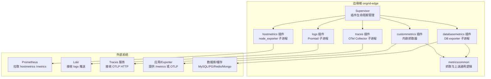
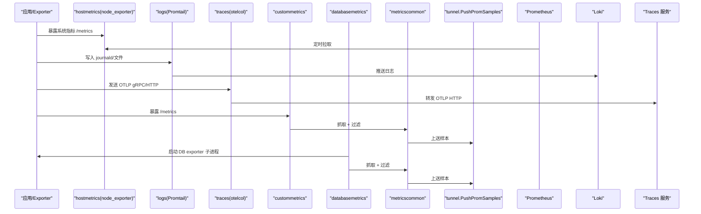
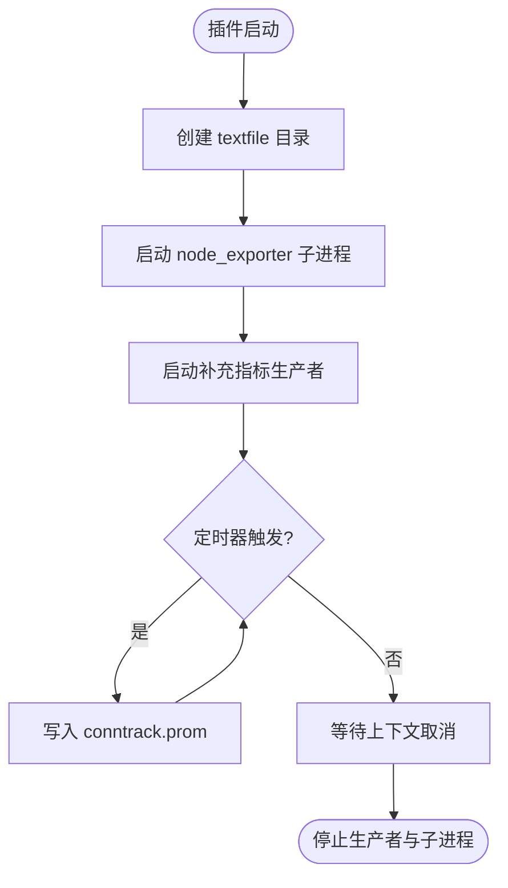
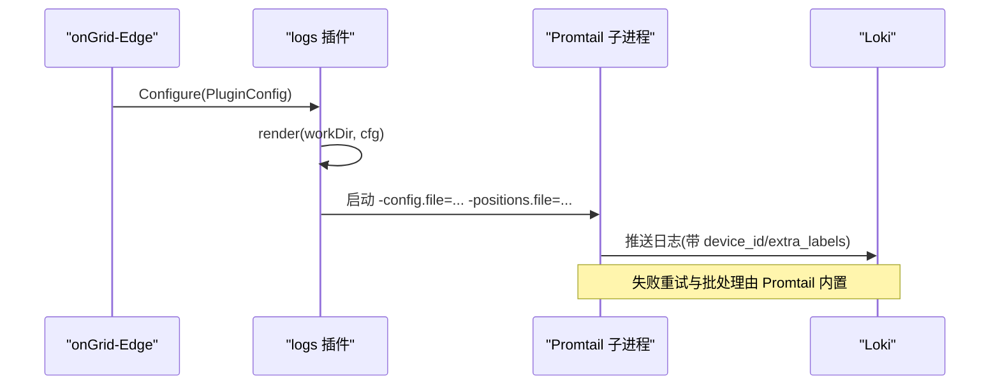
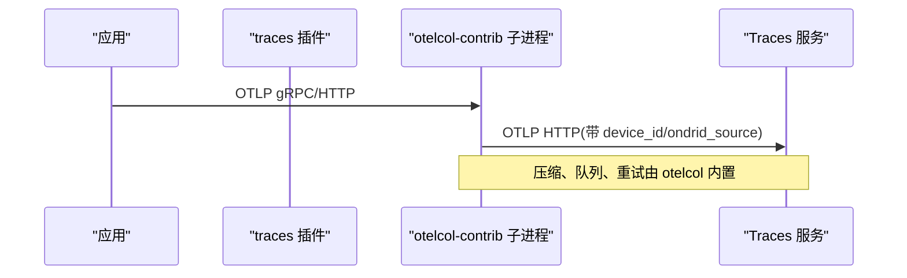
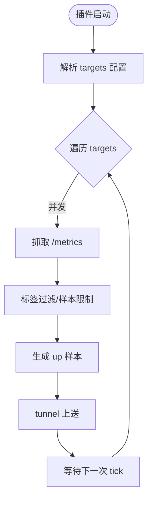
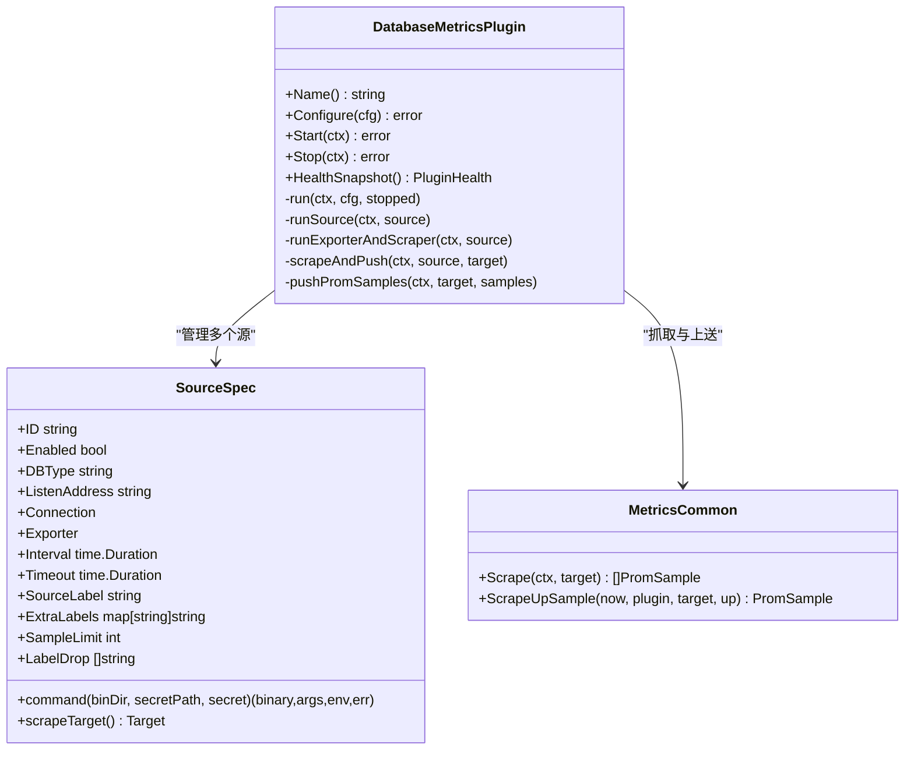
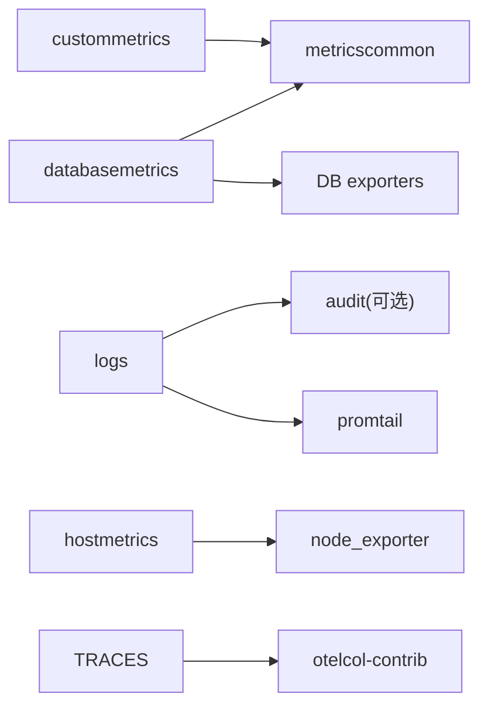

# 内置插件详解

<cite>
**本文引用的文件**
- [internal/edgeagent/plugins/plugin.go](file://internal/edgeagent/plugins/plugin.go)
- [internal/edgeagent/plugins/hostmetrics/plugin.go](file://internal/edgeagent/plugins/hostmetrics/plugin.go)
- [internal/edgeagent/plugins/logs/plugin.go](file://internal/edgeagent/plugins/logs/plugin.go)
- [internal/edgeagent/plugins/logs/render.go](file://internal/edgeagent/plugins/logs/render.go)
- [internal/edgeagent/plugins/traces/plugin.go](file://internal/edgeagent/plugins/traces/plugin.go)
- [internal/edgeagent/plugins/traces/render.go](file://internal/edgeagent/plugins/traces/render.go)
- [internal/edgeagent/plugins/custommetrics/plugin.go](file://internal/edgeagent/plugins/custommetrics/plugin.go)
- [internal/edgeagent/plugins/custommetrics/spec.go](file://internal/edgeagent/plugins/custommetrics/spec.go)
- [internal/edgeagent/plugins/databasemetrics/plugin.go](file://internal/edgeagent/plugins/databasemetrics/plugin.go)
- [internal/edgeagent/plugins/databasemetrics/spec.go](file://internal/edgeagent/plugins/databasemetrics/spec.go)
- [internal/edgeagent/plugins/metricscommon/scrape.go](file://internal/edgeagent/plugins/metricscommon/scrape.go)
</cite>

## 目录
1. [简介](#简介)
2. [项目结构](#项目结构)
3. [核心组件](#核心组件)
4. [架构总览](#架构总览)
5. [详细组件分析](#详细组件分析)
6. [依赖关系分析](#依赖关系分析)
7. [性能考量](#性能考量)
8. [故障排查指南](#故障排查指南)
9. [结论](#结论)
10. [附录：典型配置与最佳实践](#附录典型配置与最佳实践)

## 简介
本文件系统化介绍 OnGrid 边缘端内置数据采集插件，覆盖以下能力：
- 主机指标采集（hostmetrics）：通过 node_exporter 子进程暴露系统资源指标，供 Prometheus 拉取。
- 日志收集（logs）：通过 Promtail 子进程采集 journald 与文件日志，推送至 Loki。
- 分布式追踪（traces）：通过 OpenTelemetry Collector 子进程接收 OTLP，转发至后端。
- 自定义指标（custommetrics）：按用户定义的 Prometheus 目标进行本地抓取并推送。
- 数据库监控（databasemetrics）：为 MySQL、PostgreSQL、Redis、MongoDB 等启动专用 exporter 子进程，抓取并推送指标。

文档将逐一说明各插件的配置参数、采集目标、性能影响与故障排查方法，并提供插件间依赖关系与数据流向图，以及典型部署场景的配置示例与最佳实践建议。

## 项目结构
OnGrid 的插件运行时位于 edge-agent 内部，统一由 Supervisor 管理生命周期（Configure → Start → HealthSnapshot → Stop）。插件分为两类：
- 子进程插件：logs（Promtail）、traces（otelcol-contrib）、hostmetrics（node_exporter）、databasemetrics（各 DB exporter）。
- 内嵌插件：custommetrics（Go 协程实现抓取与推送）。

图表来源
- [internal/edgeagent/plugins/plugin.go:18-52](file://internal/edgeagent/plugins/plugin.go#L18-L52)
- [internal/edgeagent/plugins/hostmetrics/plugin.go:62-93](file://internal/edgeagent/plugins/hostmetrics/plugin.go#L62-L93)
- [internal/edgeagent/plugins/logs/plugin.go:27-53](file://internal/edgeagent/plugins/logs/plugin.go#L27-L53)
- [internal/edgeagent/plugins/traces/plugin.go:31-47](file://internal/edgeagent/plugins/traces/plugin.go#L31-L47)
- [internal/edgeagent/plugins/custommetrics/plugin.go:45-63](file://internal/edgeagent/plugins/custommetrics/plugin.go#L45-L63)
- [internal/edgeagent/plugins/databasemetrics/plugin.go:53-73](file://internal/edgeagent/plugins/databasemetrics/plugin.go#L53-L73)
- [internal/edgeagent/plugins/metricscommon/scrape.go:55-91](file://internal/edgeagent/plugins/metricscommon/scrape.go#L55-L91)

章节来源
- [internal/edgeagent/plugins/plugin.go:18-52](file://internal/edgeagent/plugins/plugin.go#L18-L52)

## 核心组件
- 插件接口与状态
  - Plugin 接口定义了 Name、Configure、Start、Stop、HealthSnapshot 五个生命周期方法。
  - PluginConfig 包含启用开关、EdgeID、Endpoint、认证信息以及插件特定 Spec。
  - PluginHealth 与 TargetHealth 用于向管理器上报插件与多目标健康状态。
- 子进程封装
  - SubprocessPlugin 负责渲染配置、启动/停止子进程、传递参数、持久化工作目录。
- 抓取与上送
  - metricscommon 提供统一的 /metrics 抓取、标签裁剪、样本限制与 up 指标生成。
  - custommetrics 与 databasemetrics 基于此实现多目标并发抓取与 push_prom_samples 上送。

章节来源
- [internal/edgeagent/plugins/plugin.go:18-119](file://internal/edgeagent/plugins/plugin.go#L18-L119)
- [internal/edgeagent/plugins/metricscommon/scrape.go:25-91](file://internal/edgeagent/plugins/metricscommon/scrape.go#L25-L91)

## 架构总览
下图展示从应用/系统到存储/查询的数据流，以及插件间的协作关系。

图表来源
- [internal/edgeagent/plugins/hostmetrics/plugin.go:62-93](file://internal/edgeagent/plugins/hostmetrics/plugin.go#L62-L93)
- [internal/edgeagent/plugins/logs/plugin.go:27-53](file://internal/edgeagent/plugins/logs/plugin.go#L27-L53)
- [internal/edgeagent/plugins/traces/plugin.go:31-47](file://internal/edgeagent/plugins/traces/plugin.go#L31-L47)
- [internal/edgeagent/plugins/custommetrics/plugin.go:135-162](file://internal/edgeagent/plugins/custommetrics/plugin.go#L135-L162)
- [internal/edgeagent/plugins/databasemetrics/plugin.go:145-176](file://internal/edgeagent/plugins/databasemetrics/plugin.go#L145-L176)
- [internal/edgeagent/plugins/metricscommon/scrape.go:55-91](file://internal/edgeagent/plugins/metricscommon/scrape.go#L55-L91)

## 详细组件分析

### 主机指标采集插件（hostmetrics）
- 功能概述
  - 以子进程方式运行 node_exporter，默认监听 :9102，暴露 node_* 指标。
  - 内嵌补充指标生产者，定期写入 textfile 目录，解决部分内核路径变更导致的指标缺失问题（如 conntrack）。
- 关键行为
  - 通过 CLI 参数控制 collectors 启停与额外参数。
  - 自动追加 --collector.textfile.directory 指向受管目录，确保补充指标可被拉取。
- 配置参数（Spec）
  - listen_address：字符串，默认 ":9102"。
  - collectors_enabled：[]string，逐个添加 --collector.<name>。
  - collectors_disabled：[]string，逐个添加 --no-collector.<name>。
  - extra_args：[]string，直接追加到命令行。
- 采集目标
  - 本机系统资源（CPU、内存、磁盘、网络、连接跟踪等）。
- 性能影响
  - 子进程独立运行，对主进程开销小；textfile 写入周期约 15s，避免频繁 I/O。
- 故障排查
  - 检查端口占用与防火墙策略。
  - 确认 textfile 目录存在且可写。
  - 若 conntrack 面板为空，查看是否命中旧内核路径导致重复指标冲突。

图表来源
- [internal/edgeagent/plugins/hostmetrics/plugin.go:114-148](file://internal/edgeagent/plugins/hostmetrics/plugin.go#L114-L148)
- [internal/edgeagent/plugins/hostmetrics/plugin.go:163-231](file://internal/edgeagent/plugins/hostmetrics/plugin.go#L163-L231)
- [internal/edgeagent/plugins/hostmetrics/plugin.go:233-246](file://internal/edgeagent/plugins/hostmetrics/plugin.go#L233-L246)

章节来源
- [internal/edgeagent/plugins/hostmetrics/plugin.go:1-277](file://internal/edgeagent/plugins/hostmetrics/plugin.go#L1-L277)

### 日志收集插件（logs）
- 功能概述
  - 以子进程方式运行 Promtail，根据模板渲染配置文件，支持 journald 与文件日志采集，直推 Loki。
- 关键行为
  - 自动生成 promtail.yaml，设置设备标识与可选 extra_labels。
  - 当关闭 journald 且未指定 file_paths 时，回退到常见 syslog 路径，保证至少一个 job。
  - 自动探测 audit 插件输出文件，开启审计日志采集（单向依赖）。
- 配置参数（Spec）
  - enable_journald：布尔，默认 true。
  - journald_units：[]string，单位白名单正则过滤。
  - file_paths：[]string，应用日志文件路径列表。
  - extra_labels：map[string]string，附加标签。
  - tls_insecure_skip_verify：布尔，默认 true（自签证书场景）。
- 采集目标
  - journald 条目（systemd unit、syslog identifier 等）。
  - 指定文件路径（如 nginx access.log）。
- 性能影响
  - Promtail 子进程独立运行，批处理与重试策略已内置；位置文件与配置同目录，重启不丢位点。
- 故障排查
  - 确认 Endpoint 与 EdgeID 非空。
  - 检查 TLS 配置与证书有效性。
  - 验证 journald 可用性与 units 过滤规则。
  - 观察 positions.yaml 是否存在与更新。

图表来源
- [internal/edgeagent/plugins/logs/plugin.go:27-53](file://internal/edgeagent/plugins/logs/plugin.go#L27-L53)
- [internal/edgeagent/plugins/logs/render.go:109-189](file://internal/edgeagent/plugins/logs/render.go#L109-L189)

章节来源
- [internal/edgeagent/plugins/logs/plugin.go:1-54](file://internal/edgeagent/plugins/logs/plugin.go#L1-L54)
- [internal/edgeagent/plugins/logs/render.go:1-273](file://internal/edgeagent/plugins/logs/render.go#L1-L273)

### 分布式追踪插件（traces）
- 功能概述
  - 以子进程方式运行 otelcol-contrib，接收本地 OTLP gRPC/HTTP，注入 device_id 等资源属性后批量导出至后端。
- 关键行为
  - 渲染 otelcol.yaml，绑定 docker bridge/localhost，不对外暴露 0.0.0.0。
  - 使用 batch 处理器与发送队列、重试策略，提升吞吐与稳定性。
- 配置参数（Spec）
  - grpc_endpoint：字符串，默认 "127.0.0.1:4317"。
  - http_endpoint：字符串，默认 "127.0.0.1:4318"。
  - extra_attrs：map[string]string，注入额外资源属性。
- 采集目标
  - 本地应用的 OTLP 链路数据。
- 性能影响
  - 子进程隔离，批大小与超时可调；队列与重试降低瞬时抖动影响。
- 故障排查
  - 确认 Endpoint 与 EdgeID 非空。
  - 校验 Basic/Bearer 认证头是否正确。
  - 检查本地端口占用与应用 OTLP 客户端配置。

图表来源
- [internal/edgeagent/plugins/traces/plugin.go:31-47](file://internal/edgeagent/plugins/traces/plugin.go#L31-L47)
- [internal/edgeagent/plugins/traces/render.go:110-151](file://internal/edgeagent/plugins/traces/render.go#L110-L151)

章节来源
- [internal/edgeagent/plugins/traces/plugin.go:1-48](file://internal/edgeagent/plugins/traces/plugin.go#L1-L48)
- [internal/edgeagent/plugins/traces/render.go:1-189](file://internal/edgeagent/plugins/traces/render.go#L1-L189)

### 自定义指标插件（custommetrics）
- 功能概述
  - 内嵌抓取器，按 targets 列表周期性抓取 Prometheus /metrics，经通用逻辑处理后通过 tunnel 上送。
- 关键行为
  - 并发运行每个 target 的抓取循环，支持鉴权（Bearer/Basic）、TLS 跳过校验、样本限制与标签丢弃。
  - 抓取失败时推送合成 up=0 样本，成功时附带 up=1。
- 配置参数（targets 数组）
  - id：唯一标识。
  - target_url：http(s) 地址。
  - scrape_interval：抓取间隔（默认 30s）。
  - scrape_timeout：请求超时（默认 5s，不超过 interval）。
  - enabled：是否启用（默认 true）。
  - source_label：源标签（默认 "custom:<id>"）。
  - auth.bearer_token / auth.username / auth.password：鉴权。
  - tls_insecure：是否跳过 TLS 校验。
  - extra_labels：附加标签。
  - sample_limit：样本上限（默认 5000）。
  - label_drop：需丢弃的标签名列表。
  - resource.category/type：可选，标记为 database 类型时自动附加 resource_category/db_type 标签。
- 采集目标
  - 任意提供 Prometheus /metrics 的应用或中间件。
- 性能影响
  - 并发抓取，单目标超时与全局样本限制保护后端；push 超时固定 15s。
- 故障排查
  - 校验 URL 合法性与可达性。
  - 检查鉴权与 TLS 配置。
  - 关注样本超限错误与 up 指标状态。

图表来源
- [internal/edgeagent/plugins/custommetrics/plugin.go:135-162](file://internal/edgeagent/plugins/custommetrics/plugin.go#L135-L162)
- [internal/edgeagent/plugins/custommetrics/plugin.go:187-211](file://internal/edgeagent/plugins/custommetrics/plugin.go#L187-L211)
- [internal/edgeagent/plugins/custommetrics/spec.go:13-46](file://internal/edgeagent/plugins/custommetrics/spec.go#L13-L46)
- [internal/edgeagent/plugins/metricscommon/scrape.go:55-91](file://internal/edgeagent/plugins/metricscommon/scrape.go#L55-L91)

章节来源
- [internal/edgeagent/plugins/custommetrics/plugin.go:1-291](file://internal/edgeagent/plugins/custommetrics/plugin.go#L1-L291)
- [internal/edgeagent/plugins/custommetrics/spec.go:1-295](file://internal/edgeagent/plugins/custommetrics/spec.go#L1-L295)
- [internal/edgeagent/plugins/metricscommon/scrape.go:1-196](file://internal/edgeagent/plugins/metricscommon/scrape.go#L1-L196)

### 数据库监控插件（databasemetrics）
- 功能概述
  - 为每个数据库源启动专用 exporter 子进程（mysqld_exporter、postgres_exporter、redis_exporter、mongodb_exporter），本地抓取并通过 tunnel 上送。
- 关键行为
  - 读取受管密钥文件（权限严格校验），构造 exporter 命令与环境变量。
  - 每个 source 独立工作目录与日志文件，支持指数退避重启。
  - 抓取失败推送 up=0，成功附带 up=1；支持默认标签丢弃以降低基数。
- 配置参数（sources 数组）
  - id：唯一标识。
  - db_type：mysql/postgresql/redis/mongodb。
  - listen_address：exporter 监听地址（默认按 db_type 分配端口，避免与 hostmetrics 冲突）。
  - connection.type：managed。
  - connection.path：受管密钥文件路径（仅读，权限 ≤ 0600）。
  - tls.*：skip_verify/ca_file/cert_file/key_file（部分 exporter 支持）。
  - exporter.*：按 db_type 允许的 collectors/flags（布尔、字符串、整数、列表）。
  - scrape_interval / scrape_timeout：抓取间隔与超时。
  - source_label：源标签（默认 "db:<id>"）。
  - extra_labels：附加标签。
  - sample_limit：样本上限（默认 5000）。
  - label_drop：默认按 db_type 预置（如 query/statement 等）。
- 采集目标
  - MySQL、PostgreSQL、Redis、MongoDB 的性能指标。
- 性能影响
  - 每源一进程，端口隔离；默认采样间隔 30s，超时 5s；指数退避防止雪崩。
- 故障排查
  - 检查 exporter 二进制是否存在于 binDir。
  - 校验 secret 文件路径与权限。
  - 观察 exporter 日志与 up 指标。
  - 注意端口冲突与保留端口（如 9102/9256）。

图表来源
- [internal/edgeagent/plugins/databasemetrics/plugin.go:53-73](file://internal/edgeagent/plugins/databasemetrics/plugin.go#L53-L73)
- [internal/edgeagent/plugins/databasemetrics/plugin.go:145-176](file://internal/edgeagent/plugins/databasemetrics/plugin.go#L145-L176)
- [internal/edgeagent/plugins/databasemetrics/plugin.go:220-274](file://internal/edgeagent/plugins/databasemetrics/plugin.go#L220-L274)
- [internal/edgeagent/plugins/databasemetrics/spec.go:374-388](file://internal/edgeagent/plugins/databasemetrics/spec.go#L374-L388)
- [internal/edgeagent/plugins/metricscommon/scrape.go:55-91](file://internal/edgeagent/plugins/metricscommon/scrape.go#L55-L91)

章节来源
- [internal/edgeagent/plugins/databasemetrics/plugin.go:1-403](file://internal/edgeagent/plugins/databasemetrics/plugin.go#L1-L403)
- [internal/edgeagent/plugins/databasemetrics/spec.go:1-800](file://internal/edgeagent/plugins/databasemetrics/spec.go#L1-L800)
- [internal/edgeagent/plugins/metricscommon/scrape.go:1-196](file://internal/edgeagent/plugins/metricscommon/scrape.go#L1-L196)

## 依赖关系分析
- 插件与子进程
  - hostmetrics → node_exporter
  - logs → Promtail
  - traces → otelcol-contrib
  - databasemetrics → mysqld_exporter/postgres_exporter/redis_exporter/mongodb_exporter
- 插件与通用库
  - custommetrics 与 databasemetrics 共用 metricscommon 抓取与上送逻辑。
- 插件间依赖
  - logs 插件在渲染阶段探测 audit 插件输出文件，形成单向依赖。
- 数据通道
  - 指标类：tunnel.PushPromSamples 上送。
  - 日志类：Promtail 直推 Loki。
  - 追踪类：otelcol 直推后端 OTLP HTTP。

图表来源
- [internal/edgeagent/plugins/custommetrics/plugin.go:135-162](file://internal/edgeagent/plugins/custommetrics/plugin.go#L135-L162)
- [internal/edgeagent/plugins/databasemetrics/plugin.go:145-176](file://internal/edgeagent/plugins/databasemetrics/plugin.go#L145-L176)
- [internal/edgeagent/plugins/logs/render.go:157-161](file://internal/edgeagent/plugins/logs/render.go#L157-L161)
- [internal/edgeagent/plugins/hostmetrics/plugin.go:62-93](file://internal/edgeagent/plugins/hostmetrics/plugin.go#L62-L93)
- [internal/edgeagent/plugins/logs/plugin.go:27-53](file://internal/edgeagent/plugins/logs/plugin.go#L27-L53)
- [internal/edgeagent/plugins/traces/plugin.go:31-47](file://internal/edgeagent/plugins/traces/plugin.go#L31-L47)
- [internal/edgeagent/plugins/databasemetrics/spec.go:168-203](file://internal/edgeagent/plugins/databasemetrics/spec.go#L168-L203)

章节来源
- [internal/edgeagent/plugins/plugin.go:18-119](file://internal/edgeagent/plugins/plugin.go#L18-L119)
- [internal/edgeagent/plugins/metricscommon/scrape.go:1-196](file://internal/edgeagent/plugins/metricscommon/scrape.go#L1-L196)

## 性能考量
- 抓取频率与超时
  - 默认抓取间隔 30s，超时 5s；可根据业务负载调整，但需避免超过样本限制。
- 样本限制与标签基数
  - 通过 sample_limit 与 label_drop 控制指标基数，防止高基数字段（如 query/statement）造成压力。
- 子进程隔离
  - 所有外部组件以子进程运行，崩溃不影响主进程；配合 Supervisor 自动重启。
- 文本文件与 I/O
  - hostmetrics 的 textfile 写入周期约 15s，避免频繁 I/O；原子写入防止半写损坏。
- 网络与认证
  - 指标上送使用 tunnel，具备超时与重试；日志与追踪分别由 Promtail 与 otelcol 内置队列与重试保障。

[本节为通用指导，无需具体文件引用]

## 故障排查指南
- 通用步骤
  - 检查插件健康状态（State、LastError、Targets）。
  - 核对 Endpoint、EdgeID 与认证信息。
  - 查看子进程日志与工作目录产物（如 promtail.yaml、otelcol.yaml、exporter 日志）。
- hostmetrics
  - 确认 :9102 未被占用；检查 textfile 目录权限；观察 conntrack 指标是否重复或缺失。
- logs
  - 验证 Endpoint 可达与证书；确认 journald 可用性与 units 过滤；检查 positions.yaml 更新。
- traces
  - 校验本地 OTLP 端口与应用配置；检查 Authorization 头；观察 otelcol 健康检查端口。
- custommetrics
  - 校验 target_url 可达与鉴权；关注样本超限与 up 指标；必要时增加 scrape_timeout。
- databasemetrics
  - 检查 exporter 二进制存在与版本；校验 secret 文件路径与权限；观察 exporter 日志与 up 指标；避免端口冲突。

章节来源
- [internal/edgeagent/plugins/plugin.go:81-106](file://internal/edgeagent/plugins/plugin.go#L81-L106)
- [internal/edgeagent/plugins/hostmetrics/plugin.go:191-231](file://internal/edgeagent/plugins/hostmetrics/plugin.go#L191-L231)
- [internal/edgeagent/plugins/logs/render.go:109-189](file://internal/edgeagent/plugins/logs/render.go#L109-L189)
- [internal/edgeagent/plugins/traces/render.go:110-151](file://internal/edgeagent/plugins/traces/render.go#L110-L151)
- [internal/edgeagent/plugins/custommetrics/plugin.go:187-211](file://internal/edgeagent/plugins/custommetrics/plugin.go#L187-L211)
- [internal/edgeagent/plugins/databasemetrics/plugin.go:220-274](file://internal/edgeagent/plugins/databasemetrics/plugin.go#L220-L274)

## 结论
OnGrid 内置插件以统一接口与 Supervisor 管理为核心，结合子进程隔离与通用抓取库，实现了稳定、可扩展的多模态数据采集能力。通过合理的配置与调优，可在不同部署规模下保持低开销与高可用性。

[本节为总结，无需具体文件引用]

## 附录：典型配置与最佳实践
- 主机指标（hostmetrics）
  - 建议保留默认 :9102，按需启用 collectors；如需自定义 collectors，优先使用 collectors_enabled/disabled 而非 extra_args。
  - 若发现 conntrack 指标缺失，确认内核路径与 textfile 写入正常。
- 日志收集（logs）
  - 默认启用 journald，并在需要时追加 file_paths；谨慎使用 extra_labels，避免高基数键。
  - 生产环境建议使用真实证书并关闭 tls_insecure_skip_verify。
- 分布式追踪（traces）
  - 应用侧配置 OTLP 客户端指向 127.0.0.1:4317/4318；根据流量调整 otelcol 批大小与队列。
  - 使用 Basic 或 Bearer 认证，确保后端网关正确透传 Authorization。
- 自定义指标（custommetrics）
  - 合理设置 scrape_interval 与 scrape_timeout；为高基数指标配置 label_drop 与 sample_limit。
  - 使用 resource.category/type 标注数据库类型，便于统一治理。
- 数据库监控（databasemetrics）
  - 为每个源分配独立 listen_address，避免端口冲突；secret 文件权限设置为 0600 或更严格。
  - 针对 MySQL/PG 默认丢弃 query/statement 等高基数标签；MongoDB 可按需选择 collectors。

[本节为实践建议，无需具体文件引用]