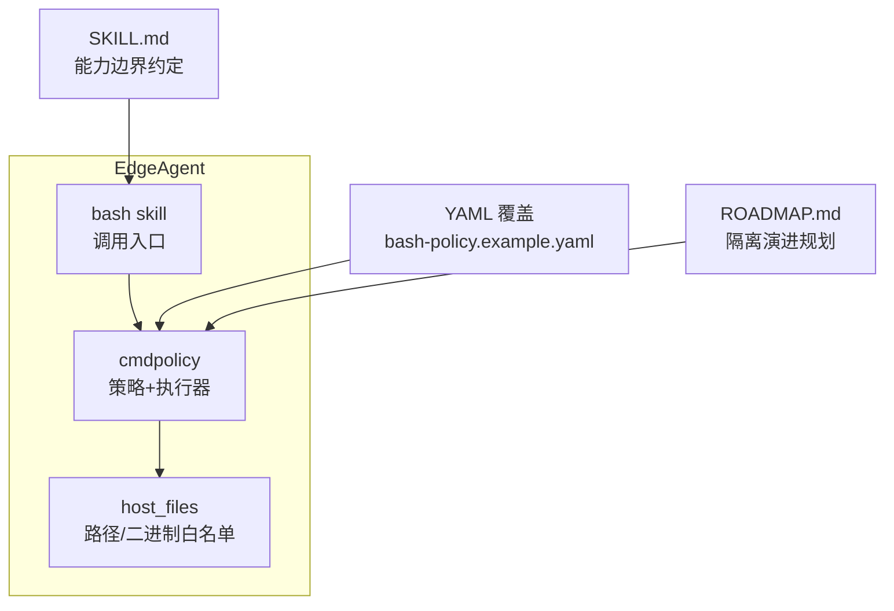
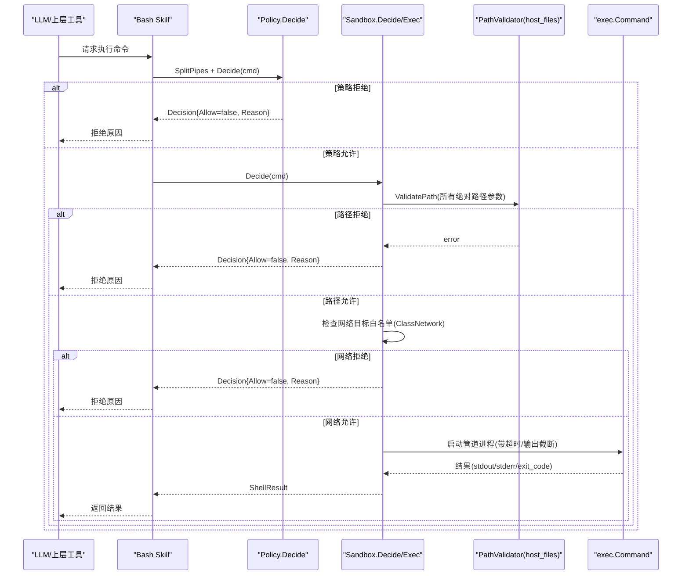
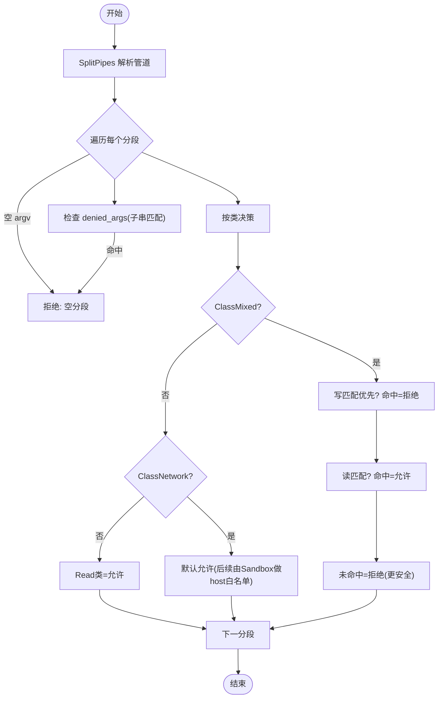
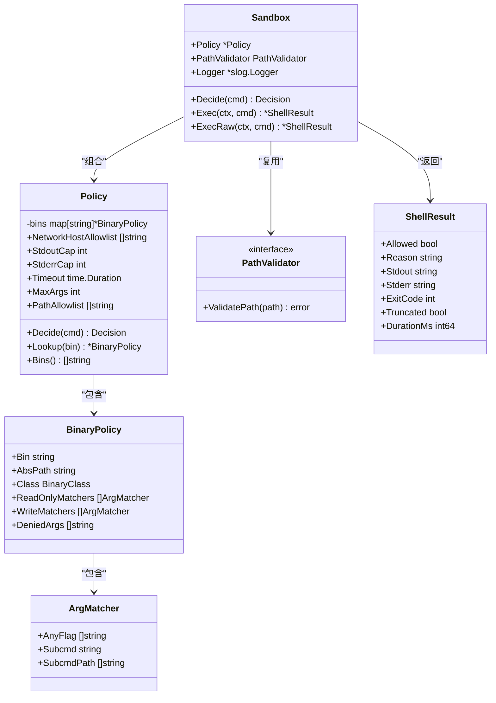
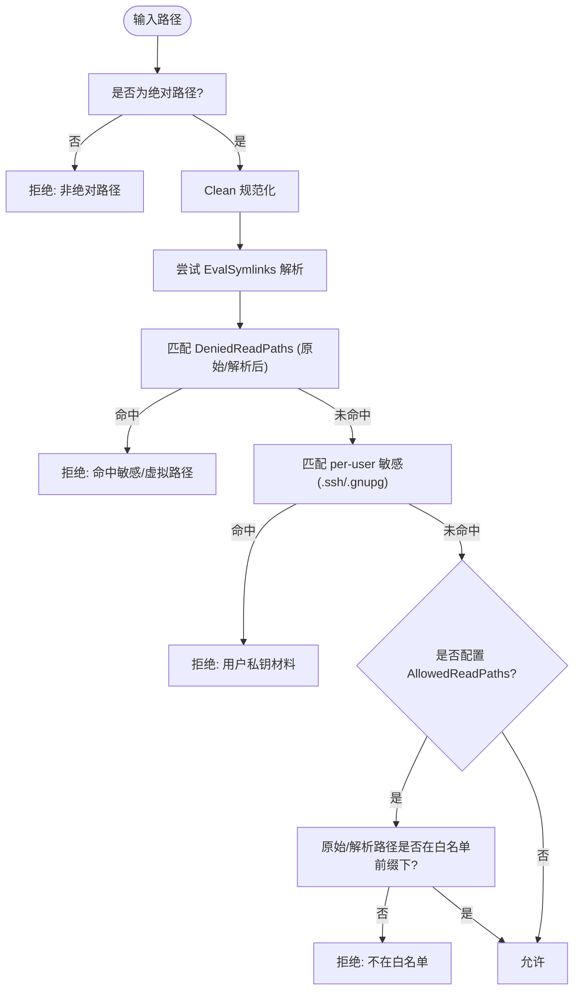
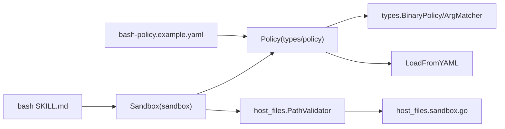

# 插件安全沙箱

<cite>
**本文引用的文件列表**
- [internal/edgeagent/cmdpolicy/sandbox.go](file://internal/edgeagent/cmdpolicy/sandbox.go)
- [internal/edgeagent/cmdpolicy/policy.go](file://internal/edgeagent/cmdpolicy/policy.go)
- [internal/edgeagent/cmdpolicy/types.go](file://internal/edgeagent/cmdpolicy/types.go)
- [internal/edgeagent/cmdpolicy/parse.go](file://internal/edgeagent/cmdpolicy/parse.go)
- [internal/edgeagent/host_files/sandbox.go](file://internal/edgeagent/host_files/sandbox.go)
- [internal/edgeagent/host_files/handlers.go](file://internal/edgeagent/host_files/handlers.go)
- [deploy/edge/bash-policy.example.yaml](file://deploy/edge/bash-policy.example.yaml)
- [skills/bash/SKILL.md](file://skills/bash/SKILL.md)
- [ROADMAP.md](file://ROADMAP.md)
</cite>

## 目录
1. [简介](#简介)
2. [项目结构](#项目结构)
3. [核心组件](#核心组件)
4. [架构总览](#架构总览)
5. [详细组件分析](#详细组件分析)
6. [依赖关系分析](#依赖关系分析)
7. [性能与资源限制](#性能与资源限制)
8. [故障排查指南](#故障排查指南)
9. [结论](#结论)
10. [附录：策略配置示例](#附录策略配置示例)

## 简介
本文件系统性阐述 OnGrid 边缘侧的“插件安全沙箱”模型，聚焦命令执行策略引擎 CmdPolicy 的设计原理与规则语法，文件系统访问控制（路径白名单、符号链接防护、权限继承），网络访问限制（出站连接白名单、DNS 解析控制、代理配置现状），以及资源使用配额管理（CPU 时间片、内存上限、进程数量）。同时说明安全上下文隔离技术（环境变量注入、用户身份模拟、命名空间隔离）的现状与演进路线，并提供可操作的安全策略配置示例与违规检测告警建议，帮助管理员构建安全的插件运行环境。

## 项目结构
围绕安全沙箱的核心代码集中在 edgeagent 子系统中：
- 命令执行策略与执行器：cmdpolicy 包
- 主机文件读取能力与路径校验：host_files 包
- 策略 YAML 覆盖示例：deploy/edge/bash-policy.example.yaml
- 技能文档对能力边界的约定：skills/bash/SKILL.md
- 未来沙箱与隔离路线图：ROADMAP.md

图表来源
- [internal/edgeagent/cmdpolicy/sandbox.go:1-120](file://internal/edgeagent/cmdpolicy/sandbox.go#L1-L120)
- [internal/edgeagent/cmdpolicy/policy.go:33-120](file://internal/edgeagent/cmdpolicy/policy.go#L33-L120)
- [internal/edgeagent/host_files/sandbox.go:1-120](file://internal/edgeagent/host_files/sandbox.go#L1-L120)
- [deploy/edge/bash-policy.example.yaml:1-60](file://deploy/edge/bash-policy.example.yaml#L1-L60)
- [skills/bash/SKILL.md:81-146](file://skills/bash/SKILL.md#L81-L146)
- [ROADMAP.md:427-509](file://ROADMAP.md#L427-L509)

章节来源
- [internal/edgeagent/cmdpolicy/sandbox.go:1-120](file://internal/edgeagent/cmdpolicy/sandbox.go#L1-L120)
- [internal/edgeagent/cmdpolicy/policy.go:33-120](file://internal/edgeagent/cmdpolicy/policy.go#L33-L120)
- [internal/edgeagent/host_files/sandbox.go:1-120](file://internal/edgeagent/host_files/sandbox.go#L1-L120)
- [deploy/edge/bash-policy.example.yaml:1-60](file://deploy/edge/bash-policy.example.yaml#L1-L60)
- [skills/bash/SKILL.md:81-146](file://skills/bash/SKILL.md#L81-L146)
- [ROADMAP.md:427-509](file://ROADMAP.md#L427-L509)

## 核心组件
- 策略定义与合并：Policy 提供默认只读基线，支持通过 YAML 覆盖扩展或收紧。
- 命令解析与分类：SplitPipes 仅允许管道分段；按类（read-fs/read-system/mixed/network/denied）判定是否允许。
- 执行器 Sandbox：在策略基础上叠加路径校验、网络目标白名单、输出截断、超时与进程组清理。
- 文件系统访问控制：host_files.SandboxConfig 提供 denylist + 可选 allowlist，并对符号链接进行严格校验。
- 策略覆盖示例：bash-policy.example.yaml 展示如何声明 binaries、matchers、allowlist、caps 等。

章节来源
- [internal/edgeagent/cmdpolicy/types.go:43-182](file://internal/edgeagent/cmdpolicy/types.go#L43-L182)
- [internal/edgeagent/cmdpolicy/policy.go:33-120](file://internal/edgeagent/cmdpolicy/policy.go#L33-L120)
- [internal/edgeagent/cmdpolicy/parse.go:1-95](file://internal/edgeagent/cmdpolicy/parse.go#L1-L95)
- [internal/edgeagent/cmdpolicy/sandbox.go:17-132](file://internal/edgeagent/cmdpolicy/sandbox.go#L17-L132)
- [internal/edgeagent/host_files/sandbox.go:34-193](file://internal/edgeagent/host_files/sandbox.go#L34-L193)
- [deploy/edge/bash-policy.example.yaml:19-178](file://deploy/edge/bash-policy.example.yaml#L19-L178)

## 架构总览
CmdPolicy 将“策略决策”和“执行约束”解耦：Policy.Decide 只做规则匹配，Sandbox 负责路径、网络、输出与生命周期管控。host_files 模块复用同一套路径校验逻辑，确保“读文件”与“跑命令”的路径一致性。

图表来源
- [internal/edgeagent/cmdpolicy/policy.go:707-800](file://internal/edgeagent/cmdpolicy/policy.go#L707-L800)
- [internal/edgeagent/cmdpolicy/sandbox.go:76-188](file://internal/edgeagent/cmdpolicy/sandbox.go#L76-L188)
- [internal/edgeagent/host_files/sandbox.go:152-193](file://internal/edgeagent/host_files/sandbox.go#L152-L193)

## 详细组件分析

### 命令执行策略引擎 CmdPolicy
- 设计原则
  - 基于类的二元分类：read-fs、read-system、mixed、network、denied。
  - 默认只读基线：内置大量诊断型只读命令，shell/脚本/破坏性命令默认拒绝。
  - 运算符可通过 YAML 覆盖扩展或收紧，采用“替换式合并”。
- 规则语法
  - 每行 binaries[*] 完全替换同名条目；新增名称直接追加。
  - read_only_matchers / write_matchers 支持 any_flag、subcmd、subcmd_path。
  - denied_args 为全局黑名单（子串匹配），用于拦截如 sed -i、awk system( 等。
  - network_host_allowlist 为空则拒绝全部出站；支持 CIDR、后缀匹配与精确匹配。
  - caps 与 timeout：stdout_cap_bytes、stderr_cap_bytes、timeout_seconds、max_argv_length。
  - path_allowlist：与 host_files 共享校验逻辑。
- 决策流程
  - SplitPipes 仅允许管道分段，禁止重定向、变量展开、命令替换等危险语法。
  - 逐段匹配：先 denied_args，再 write_matchers，再 read_only_matchers，最后按类默认。
  - mixed 默认拒绝（歧义即拒），network 默认允许但需通过 host 白名单。

图表来源
- [internal/edgeagent/cmdpolicy/policy.go:707-800](file://internal/edgeagent/cmdpolicy/policy.go#L707-L800)
- [internal/edgeagent/cmdpolicy/parse.go:32-94](file://internal/edgeagent/cmdpolicy/parse.go#L32-L94)

章节来源
- [internal/edgeagent/cmdpolicy/types.go:43-182](file://internal/edgeagent/cmdpolicy/types.go#L43-L182)
- [internal/edgeagent/cmdpolicy/policy.go:33-120](file://internal/edgeagent/cmdpolicy/policy.go#L33-L120)
- [internal/edgeagent/cmdpolicy/policy.go:550-641](file://internal/edgeagent/cmdpolicy/policy.go#L550-L641)
- [internal/edgeagent/cmdpolicy/parse.go:1-95](file://internal/edgeagent/cmdpolicy/parse.go#L1-L95)

### 执行器 Sandbox：路径、网络、输出与生命周期
- 路径校验
  - 对所有以“/”开头的参数调用 PathValidator.ValidatePath，复用 host_files 实现。
- 网络目标白名单
  - 对 ClassNetwork 的二进制，提取目标主机（curl/wget/dig/host/nslookup/ping/traceroute/nc），必须匹配 network_host_allowlist。
- 执行管线
  - 将分段用 stdout→stdin 管道串联；每个子进程设置最小化环境变量（PATH/LANG/LC_ALL）、进程组、超时。
  - 输出截断：stdout/stderr 分别受 StdoutCap/StderrCap 限制，超限标记 Truncated。
- 直通模式 ExecRaw
  - 绕过所有策略检查，仅保留超时与输出截断；作为管理员写操作的逃逸通道，需显式开启。

图表来源
- [internal/edgeagent/cmdpolicy/types.go:79-182](file://internal/edgeagent/cmdpolicy/types.go#L79-L182)
- [internal/edgeagent/cmdpolicy/sandbox.go:52-188](file://internal/edgeagent/cmdpolicy/sandbox.go#L52-L188)

章节来源
- [internal/edgeagent/cmdpolicy/sandbox.go:17-132](file://internal/edgeagent/cmdpolicy/sandbox.go#L17-L132)
- [internal/edgeagent/cmdpolicy/sandbox.go:190-253](file://internal/edgeagent/cmdpolicy/sandbox.go#L190-L253)
- [internal/edgeagent/cmdpolicy/sandbox.go:260-342](file://internal/edgeagent/cmdpolicy/sandbox.go#L260-L342)
- [internal/edgeagent/cmdpolicy/sandbox.go:428-549](file://internal/edgeagent/cmdpolicy/sandbox.go#L428-L549)

### 文件系统访问控制：路径白名单、符号链接防护与权限继承
- 默认策略
  - 读操作采用“denylist 为主，allowlist 可选”的策略：默认拒绝虚拟文件系统和高敏感路径，允许其余只读扫描。
- 符号链接防护
  - 先 EvalSymlinks 解析真实路径，再与 denylist/allowlist 比对；若存在指向外部的符号链接，拒绝。
- 权限继承
  - 不改变子进程用户/组；通过路径白名单与 denylist 限制可访问范围，避免越权读取。
- 二进制白名单
  - 仅允许 find/du/df/stat/ls 等预置命令，缺失时给出清晰错误。

图表来源
- [internal/edgeagent/host_files/sandbox.go:152-193](file://internal/edgeagent/host_files/sandbox.go#L152-L193)
- [internal/edgeagent/host_files/sandbox.go:195-228](file://internal/edgeagent/host_files/sandbox.go#L195-L228)
- [internal/edgeagent/host_files/sandbox.go:230-264](file://internal/edgeagent/host_files/sandbox.go#L230-L264)

章节来源
- [internal/edgeagent/host_files/sandbox.go:34-120](file://internal/edgeagent/host_files/sandbox.go#L34-L120)
- [internal/edgeagent/host_files/sandbox.go:152-193](file://internal/edgeagent/host_files/sandbox.go#L152-L193)
- [internal/edgeagent/host_files/handlers.go:149-224](file://internal/edgeagent/host_files/handlers.go#L149-L224)

### 网络访问限制：出站白名单、DNS 解析与代理
- 出站连接白名单
  - 针对 ClassNetwork 命令，从 argv 中启发式提取目标主机（URL 主机名、ping/dig 目标等），必须在 network_host_allowlist 中。
  - 支持 CIDR、主机名前缀（“.internal”）与精确匹配；空列表=拒绝全部出站。
- DNS 解析控制
  - 当前未实现独立 DNS 层拦截；通过主机名/CIDR 白名单间接控制。
- 代理配置
  - 未在策略层暴露代理开关；如需走代理，应在系统/容器运行时层面统一配置，而非在策略中透传。

章节来源
- [internal/edgeagent/cmdpolicy/sandbox.go:107-132](file://internal/edgeagent/cmdpolicy/sandbox.go#L107-L132)
- [internal/edgeagent/cmdpolicy/sandbox.go:428-549](file://internal/edgeagent/cmdpolicy/sandbox.go#L428-L549)
- [deploy/edge/bash-policy.example.yaml:153-161](file://deploy/edge/bash-policy.example.yaml#L153-L161)

### 资源使用配额管理：CPU、内存与进程数
- 当前实现
  - 单条命令级超时：Timeout（秒），防止长驻任务占用资源。
  - 输出大小限制：StdoutCap/StderrCap，避免大输出拖垮链路。
  - 参数长度限制：MaxArgs，防御 ARG_MAX 洪水。
- 计划中的配额
  - ROADMAP 提出租户级 CPU/内存上限与速率限制，并引入 seccomp/capabilities 与微沙箱运行时。
- 实践建议
  - 结合宿主机 cgroups v2 对 EdgeAgent 进程组施加 cpu.max/memory.max/pids.max，形成系统级兜底。

章节来源
- [internal/edgeagent/cmdpolicy/policy.go:26-31](file://internal/edgeagent/cmdpolicy/policy.go#L26-L31)
- [internal/edgeagent/cmdpolicy/sandbox.go:140-188](file://internal/edgeagent/cmdpolicy/sandbox.go#L140-L188)
- [ROADMAP.md:427-509](file://ROADMAP.md#L427-L509)

### 安全上下文隔离：环境变量、用户身份与命名空间
- 环境变量注入
  - 执行时仅注入 PATH/LANG/LC_ALL，屏蔽宿主环境变量，降低信息泄露面。
- 用户身份模拟
  - 当前未切换用户/组；通过路径白名单与 denylist 限制可访问范围。
- 命名空间隔离
  - ip netns exec 被明确拒绝，防止递归进入任意命名空间绕过策略；其他只读 inspect 仍可用。
- 演进方向
  - ROADMAP 规划 microsandbox、seccomp/profile、危险类命令的临时容器包装等。

章节来源
- [internal/edgeagent/cmdpolicy/sandbox.go:274-283](file://internal/edgeagent/cmdpolicy/sandbox.go#L274-L283)
- [internal/edgeagent/cmdpolicy/policy.go:168-200](file://internal/edgeagent/cmdpolicy/policy.go#L168-L200)
- [ROADMAP.md:427-509](file://ROADMAP.md#L427-L509)

## 依赖关系分析
- 低耦合高内聚
  - Policy 与 Sandbox 职责分离；host_files 提供 PathValidator 接口，cmdpolicy 复用其路径校验逻辑，保持单一事实源。
- 外部依赖
  - 策略加载依赖 YAML 解析；执行依赖标准库 exec/os/syscall。
- 潜在循环依赖
  - 无循环依赖；host_files 不被 cmdpolicy 反向引用，仅通过接口抽象。

图表来源
- [internal/edgeagent/cmdpolicy/types.go:79-182](file://internal/edgeagent/cmdpolicy/types.go#L79-L182)
- [internal/edgeagent/cmdpolicy/policy.go:550-641](file://internal/edgeagent/cmdpolicy/policy.go#L550-L641)
- [internal/edgeagent/cmdpolicy/sandbox.go:52-132](file://internal/edgeagent/cmdpolicy/sandbox.go#L52-L132)
- [internal/edgeagent/host_files/sandbox.go:34-120](file://internal/edgeagent/host_files/sandbox.go#L34-L120)
- [deploy/edge/bash-policy.example.yaml:19-178](file://deploy/edge/bash-policy.example.yaml#L19-L178)
- [skills/bash/SKILL.md:81-146](file://skills/bash/SKILL.md#L81-L146)

章节来源
- [internal/edgeagent/cmdpolicy/types.go:79-182](file://internal/edgeagent/cmdpolicy/types.go#L79-L182)
- [internal/edgeagent/cmdpolicy/policy.go:550-641](file://internal/edgeagent/cmdpolicy/policy.go#L550-L641)
- [internal/edgeagent/cmdpolicy/sandbox.go:52-132](file://internal/edgeagent/cmdpolicy/sandbox.go#L52-L132)
- [internal/edgeagent/host_files/sandbox.go:34-120](file://internal/edgeagent/host_files/sandbox.go#L34-L120)
- [deploy/edge/bash-policy.example.yaml:19-178](file://deploy/edge/bash-policy.example.yaml#L19-L178)
- [skills/bash/SKILL.md:81-146](file://skills/bash/SKILL.md#L81-L146)

## 性能与资源限制
- 命令级保护
  - 超时：默认 30 秒，可配置；管道整体受 context 控制，超时即终止。
  - 输出截断：stdout/stderr 各自上限，超限标记 Truncated，便于上层提示重试。
  - 参数上限：MaxArgs 限制每段参数个数，防洪水。
- 并发与批处理
  - host_files 批量处理限流：最大并发 4，批次总超时 60 秒，单路径 30 秒，避免磁盘/IO 饱和。
- 建议
  - 在高负载场景下调小 Timeout 与 MaxArgs，配合系统 cgroups 限制 CPU/内存/PIDs。

章节来源
- [internal/edgeagent/cmdpolicy/policy.go:26-31](file://internal/edgeagent/cmdpolicy/policy.go#L26-L31)
- [internal/edgeagent/cmdpolicy/sandbox.go:140-188](file://internal/edgeagent/cmdpolicy/sandbox.go#L140-L188)
- [internal/edgeagent/host_files/handlers.go:60-86](file://internal/edgeagent/host_files/handlers.go#L60-L86)

## 故障排查指南
- 常见拒绝原因
  - 二进制不在策略中或被归入 denied 类。
  - 参数命中 denied_args 或 write_matchers。
  - 路径不在白名单或命中敏感路径。
  - 网络目标不在 host allowlist。
  - 输出过大被截断（Truncated=true）。
- 定位步骤
  - 查看 ShellResult.Reason 与 Truncated 标志。
  - 核对 bash-policy.yaml 的 binaries 与 matchers。
  - 确认 network_host_allowlist 是否包含目标域名/CIDR。
  - 检查 host_files 的 AllowedReadPaths/DeniedReadPaths 配置。
- 直通模式风险
  - ExecRaw 会绕过策略检查，仅在管理员授权且必要时使用。

章节来源
- [internal/edgeagent/cmdpolicy/sandbox.go:140-188](file://internal/edgeagent/cmdpolicy/sandbox.go#L140-L188)
- [internal/edgeagent/cmdpolicy/sandbox.go:190-253](file://internal/edgeagent/cmdpolicy/sandbox.go#L190-L253)
- [internal/edgeagent/cmdpolicy/policy.go:707-800](file://internal/edgeagent/cmdpolicy/policy.go#L707-L800)
- [internal/edgeagent/host_files/sandbox.go:152-193](file://internal/edgeagent/host_files/sandbox.go#L152-L193)

## 结论
OnGrid 的边缘插件安全沙箱以“策略先行、执行后置”为核心思想：CmdPolicy 提供细粒度、可扩展的命令白名单与读写语义区分；Sandbox 叠加路径、网络、输出与生命周期控制；host_files 复用同一路径校验逻辑，保证一致性与可维护性。当前版本已具备完善的只读基线与严格的执行约束，未来将通过微沙箱、seccomp/profile 与租户级配额进一步增强内核级隔离与资源治理。

## 附录：策略配置示例
- 基本用法
  - 将 bash-policy.example.yaml 放置于 /etc/ongrid-edge/bash-policy.yaml，重启 EdgeAgent 生效。
- 关键项说明
  - binaries[*]: 扩展或替换默认二进制策略，支持 read-only/write/denied 三类匹配器。
  - network_host_allowlist: 出站白名单，留空=拒绝全部出站。
  - stdout_cap_bytes/stderr_cap_bytes/timeout_seconds/max_argv_length: 资源与输出限制。
  - path_allowlist: 与 host_files 一致的绝对路径前缀白名单。
- 典型场景
  - 允许 ping 内部服务：在 network_host_allowlist 添加 .internal-svc.example.com 或 10.0.0.0/8。
  - 收紧路径访问：在 path_allowlist 仅保留业务数据目录（如 /data）。
  - 禁用危险参数：在 denied_args 追加更多关键字（如 awk 的 system()、sed 的 -i）。

章节来源
- [deploy/edge/bash-policy.example.yaml:1-178](file://deploy/edge/bash-policy.example.yaml#L1-178)
- [internal/edgeagent/cmdpolicy/policy.go:550-641](file://internal/edgeagent/cmdpolicy/policy.go#L550-L641)
- [internal/edgeagent/host_files/sandbox.go:34-120](file://internal/edgeagent/host_files/sandbox.go#L34-L120)