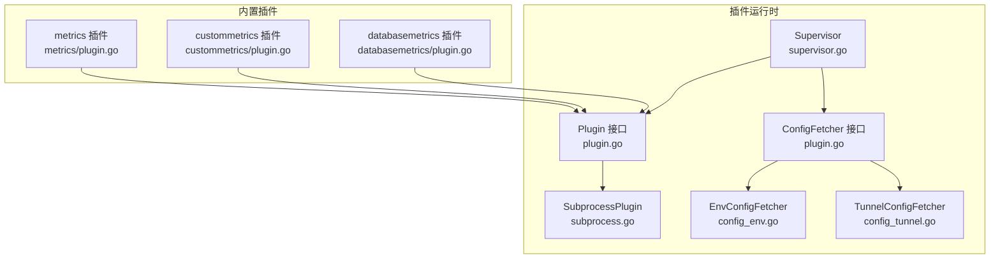
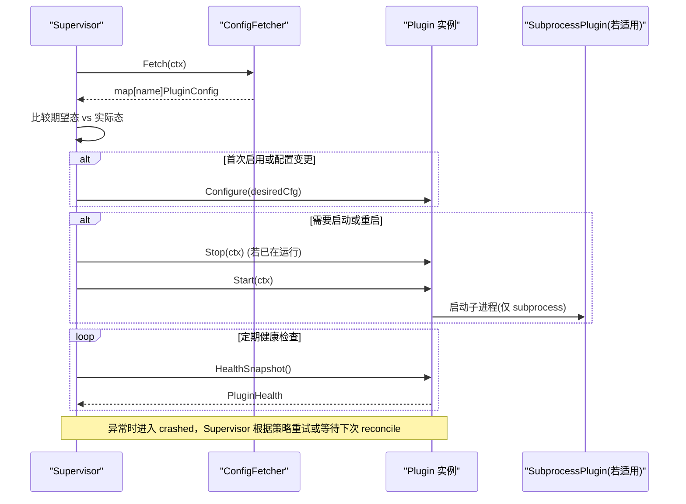
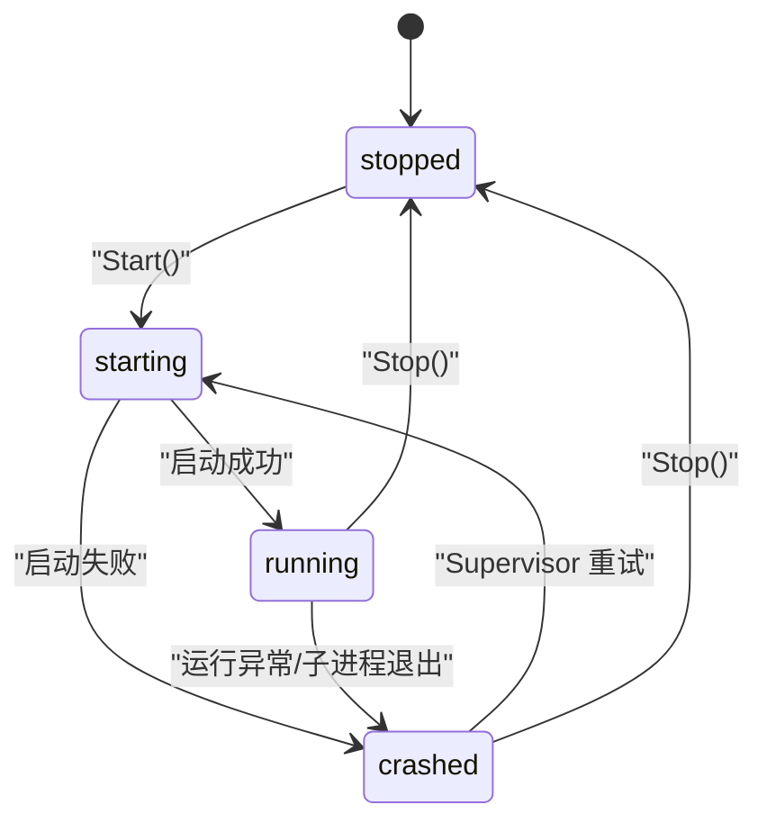
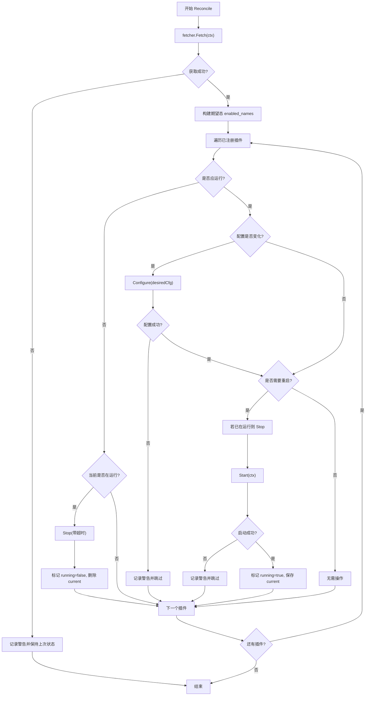
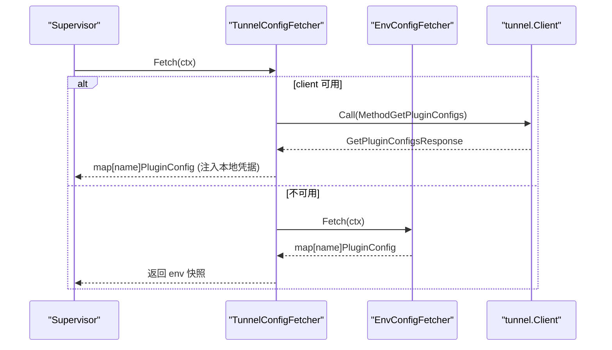
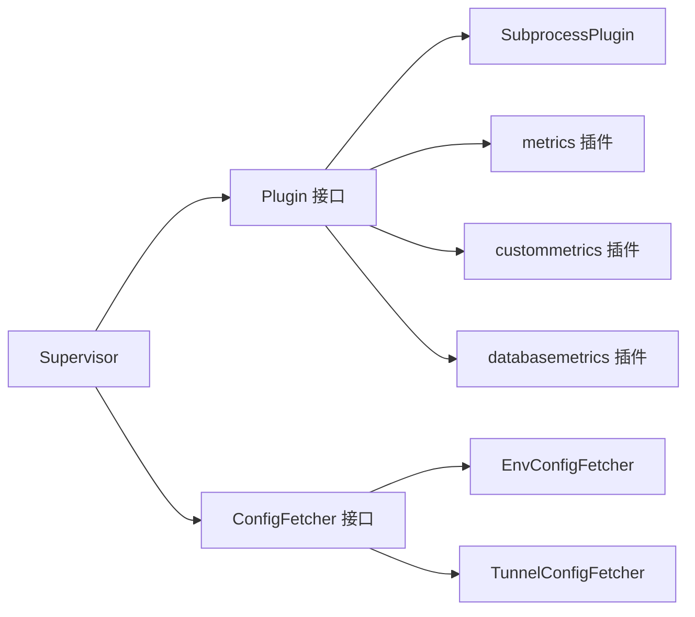

# 插件架构设计

<cite>
**本文引用的文件**   
- [internal/edgeagent/plugins/plugin.go](file://internal/edgeagent/plugins/plugin.go)
- [internal/edgeagent/plugins/supervisor.go](file://internal/edgeagent/plugins/supervisor.go)
- [internal/edgeagent/plugins/subprocess.go](file://internal/edgeagent/plugins/subprocess.go)
- [internal/edgeagent/plugins/config_env.go](file://internal/edgeagent/plugins/config_env.go)
- [internal/edgeagent/plugins/config_tunnel.go](file://internal/edgeagent/plugins/config_tunnel.go)
- [internal/edgeagent/plugins/metrics/plugin.go](file://internal/edgeagent/plugins/metrics/plugin.go)
- [internal/edgeagent/plugins/custommetrics/plugin.go](file://internal/edgeagent/plugins/custommetrics/plugin.go)
- [internal/edgeagent/plugins/databasemetrics/plugin.go](file://internal/edgeagent/plugins/databasemetrics/plugin.go)
</cite>

## 目录
1. [简介](#简介)
2. [项目结构](#项目结构)
3. [核心组件](#核心组件)
4. [架构总览](#架构总览)
5. [详细组件分析](#详细组件分析)
6. [依赖关系分析](#依赖关系分析)
7. [性能与可靠性考虑](#性能与可靠性考虑)
8. [故障排查指南](#故障排查指南)
9. [结论](#结论)
10. [附录：扩展新插件类型指南](#附录扩展新插件类型指南)

## 简介
本文件系统性阐述 OnGrid 边缘代理的插件系统核心架构，围绕以下目标展开：
- 统一抽象：定义 Plugin 接口、生命周期（Configure→Start→HealthSnapshot→Stop）、状态机（stopped/starting/running/crashed）与健康监控。
- 统一管理：Supervisor 负责插件注册表、配置拉取、差异对比、启停编排与崩溃恢复。
- 进程隔离：通过 SubprocessPlugin 将外部二进制（如 promtail、otelcol）包装为统一 Plugin，实现安全隔离与自动重启。
- 配置模型：说明 PluginConfig 字段语义，包括 Endpoint、AuthUser、AuthPass 等认证相关字段的作用。
- 配置获取器：EnvConfigFetcher 与 TunnelConfigFetcher 的实现原理与回退策略。
- 开发者扩展：如何新增 in-process 或 subprocess 插件类型，并接入 Supervisor 与配置源。

## 项目结构
插件子系统位于 internal/edgeagent/plugins 下，核心文件职责如下：
- plugin.go：定义 Plugin 接口、PluginConfig、PluginState、PluginHealth、TargetHealth 以及 ConfigFetcher 接口。
- supervisor.go：Supervisor 实现，负责插件注册、配置拉取、差异对比、启停编排与关闭清理。
- subprocess.go：SubprocessPlugin 通用封装，管理子进程生命周期、崩溃指数退避重启、日志输出与 PID 上报。
- config_env.go / config_tunnel.go：两种配置获取器实现，分别基于环境变量与隧道 RPC，支持离线回退。
- metrics/custommetrics/databasemetrics：具体插件实现示例，涵盖 in-process 与多目标场景。



图示来源
- [internal/edgeagent/plugins/plugin.go:18-118](file://internal/edgeagent/plugins/plugin.go#L18-L118)
- [internal/edgeagent/plugins/supervisor.go:36-133](file://internal/edgeagent/plugins/supervisor.go#L36-L133)
- [internal/edgeagent/plugins/subprocess.go:32-102](file://internal/edgeagent/plugins/subprocess.go#L32-L102)
- [internal/edgeagent/plugins/config_env.go:32-71](file://internal/edgeagent/plugins/config_env.go#L32-L71)
- [internal/edgeagent/plugins/config_tunnel.go:22-108](file://internal/edgeagent/plugins/config_tunnel.go#L22-L108)
- [internal/edgeagent/plugins/metrics/plugin.go:64-102](file://internal/edgeagent/plugins/metrics/plugin.go#L64-L102)
- [internal/edgeagent/plugins/custommetrics/plugin.go:31-63](file://internal/edgeagent/plugins/custommetrics/plugin.go#L31-L63)
- [internal/edgeagent/plugins/databasemetrics/plugin.go:37-73](file://internal/edgeagent/plugins/databasemetrics/plugin.go#L37-L73)

章节来源
- [internal/edgeagent/plugins/plugin.go:1-119](file://internal/edgeagent/plugins/plugin.go#L1-L119)
- [internal/edgeagent/plugins/supervisor.go:1-276](file://internal/edgeagent/plugins/supervisor.go#L1-L276)
- [internal/edgeagent/plugins/subprocess.go:1-318](file://internal/edgeagent/plugins/subprocess.go#L1-L318)
- [internal/edgeagent/plugins/config_env.go:1-101](file://internal/edgeagent/plugins/config_env.go#L1-L101)
- [internal/edgeagent/plugins/config_tunnel.go:1-138](file://internal/edgeagent/plugins/config_tunnel.go#L1-L138)
- [internal/edgeagent/plugins/metrics/plugin.go:1-306](file://internal/edgeagent/plugins/metrics/plugin.go#L1-L306)
- [internal/edgeagent/plugins/custommetrics/plugin.go:1-291](file://internal/edgeagent/plugins/custommetrics/plugin.go#L1-L291)
- [internal/edgeagent/plugins/databasemetrics/plugin.go:1-403](file://internal/edgeagent/plugins/databasemetrics/plugin.go#L1-L403)

## 核心组件
本节聚焦于插件系统的核心抽象与关键数据结构。

- Plugin 接口
  - Name()：返回 OTel 信号名（如 metrics/logs/traces），作为注册键与配置行标识。
  - Configure(cfg)：接收来自配置源的配置快照；可被多次调用以热更新；错误会令插件进入“crashed”以便观测。
  - Start(ctx)：启动工作负载；对 in-process 是协程，对 subprocess 是拉起子进程；需幂等。
  - Stop(ctx)：优雅停止；对 subprocess 发送 SIGTERM + 宽限期；对 in-process 取消上下文；未运行时无副作用。
  - HealthSnapshot()：非阻塞地返回当前健康快照，供心跳上报。

- 配置模型 PluginConfig
  - Enabled：是否启用该插件。
  - EdgeID：注入到标签集的设备 ID，用于数据面关联。
  - Endpoint：数据面推送地址（例如 loki/otlp/prometheus 写入端点）。
  - AuthUser/AuthPass：数据面认证凭据。当 AuthUser 为空时，AuthPass 可作为 bearer token；否则为 basic-auth 用户名/密码。
  - Spec：插件特定 JSON 设置，由具体插件解析。

- 状态与健壮性
  - PluginState：stopped/starting/running/crashed。
  - PluginHealth：包含名称、状态、最近错误、重启计数、PID、启动时间、更新时间，以及可选 Targets 列表（多目标插件）。
  - TargetHealth：多目标插件中每个目标的细粒度健康信息（ID、名称、种类、状态、样本数、最近成功时间等）。

- 配置获取器 ConfigFetcher
  - Fetch(ctx)：返回按插件名索引的配置快照；缺失的插件视为禁用。Supervisor 在启动和周期性轮询时调用。

章节来源
- [internal/edgeagent/plugins/plugin.go:18-118](file://internal/edgeagent/plugins/plugin.go#L18-L118)

## 架构总览
Supervisor 是插件系统的中枢，负责：
- 维护已注册的插件实例映射。
- 周期性地从 ConfigFetcher 拉取最新配置快照。
- 计算期望态与实际态的差异，执行 Configure/Start/Stop 编排。
- 收集各插件 HealthSnapshot，汇总后上报给管理器。
- 在退出时对所有运行中的插件进行优雅关停。



图示来源
- [internal/edgeagent/plugins/supervisor.go:114-230](file://internal/edgeagent/plugins/supervisor.go#L114-L230)
- [internal/edgeagent/plugins/subprocess.go:137-235](file://internal/edgeagent/plugins/subprocess.go#L137-L235)
- [internal/edgeagent/plugins/plugin.go:18-52](file://internal/edgeagent/plugins/plugin.go#L18-L52)

## 详细组件分析

### Plugin 接口与状态机
- 生命周期顺序：Configure → Start → (HealthSnapshot)* → Stop。
- 状态机转换：
  - stopped → starting：Start 开始执行。
  - starting → running：成功启动。
  - running → crashed：发生错误或子进程异常退出。
  - crashed → starting：Supervisor 触发重启。
  - running/stopped → stopped：Stop 被调用。
- 健康快照：
  - 每次 HealthSnapshot 都会刷新 UpdatedAt。
  - LastError 在 crash 时填充，成功启动后清空。
  - PID 仅在子进程插件有效，in-process 插件为 0。



图示来源
- [internal/edgeagent/plugins/plugin.go:71-93](file://internal/edgeagent/plugins/plugin.go#L71-L93)
- [internal/edgeagent/plugins/subprocess.go:194-235](file://internal/edgeagent/plugins/subprocess.go#L194-L235)

章节来源
- [internal/edgeagent/plugins/plugin.go:18-106](file://internal/edgeagent/plugins/plugin.go#L18-L106)
- [internal/edgeagent/plugins/subprocess.go:194-235](file://internal/edgeagent/plugins/subprocess.go#L194-L235)

### Supervisor 组件
- 注册表：Register(p) 添加插件，必须在 Run 之前完成。
- 配置拉取：reconcile 循环内调用 fetcher.Fetch，得到 desired 快照。
- 差异对比：
  - 未启用或缺失 → 停止运行中的插件。
  - 启用且配置变化 → Configure；必要时先 Stop 再 Start。
  - 首次启用 → Start。
- 健康聚合：遍历所有已注册插件，调用 HealthSnapshot 并排序返回。
- 优雅关闭：Run 退出时对全部插件 Stop，带超时保护。



图示来源
- [internal/edgeagent/plugins/supervisor.go:135-230](file://internal/edgeagent/plugins/supervisor.go#L135-L230)

章节来源
- [internal/edgeagent/plugins/supervisor.go:36-133](file://internal/edgeagent/plugins/supervisor.go#L36-L133)
- [internal/edgeagent/plugins/supervisor.go:135-230](file://internal/edgeagent/plugins/supervisor.go#L135-L230)
- [internal/edgeagent/plugins/supervisor.go:232-276](file://internal/edgeagent/plugins/supervisor.go#L232-L276)

### SubprocessPlugin 进程隔离与自愈
- 作用：将任意外部二进制包装为 Plugin，屏蔽进程管理细节。
- 配置渲染：可选择将 PluginConfig 渲染为配置文件写入磁盘，或由 Args 函数直接编码为命令行参数。
- 启动流程：
  - 校验二进制存在，创建 workDir。
  - 使用 exec.CommandContext 启动子进程，绑定 SIGTERM 优雅终止与 WaitDelay 强制终止。
  - 捕获 stdout/stderr 到本地日志文件。
  - 更新健康状态（PID、StartedAt、Running）。
- 崩溃恢复：
  - runLoop 维持“想要运行”的语义，子进程退出即进入 backoff 重试（指数退避，上限 5 分钟）。
  - RestartCount 单调递增，直到 manager 推送新配置重新启用才会重置。
- 停止流程：
  - 取消上下文，等待 stoppedCh 或超时，确保不阻塞 Supervisor 退出。

```mermaid
classDiagram
class SubprocessPlugin {
-string name
-string binary
-string workDir
-string configFile
-func(PluginConfig,string) []byte configRender
-func(PluginConfig,string) []string args
-Logger log
-sync.Mutex mu
-PluginConfig cfg
-exec.Cmd cmd
-context.CancelFunc cancelRun
-PluginHealth health
-bool wantRunning
-chan struct{} stoppedCh
+Name() string
+Configure(cfg) error
+Start(ctx) error
+Stop(ctx) error
+HealthSnapshot() PluginHealth
-runLoop(ctx, stopped)
-runOnce(ctx) error
-setState(st, err, pid)
-bumpRestart()
}
```

图示来源
- [internal/edgeagent/plugins/subprocess.go:32-102](file://internal/edgeagent/plugins/subprocess.go#L32-L102)
- [internal/edgeagent/plugins/subprocess.go:137-235](file://internal/edgeagent/plugins/subprocess.go#L137-L235)
- [internal/edgeagent/plugins/subprocess.go:239-311](file://internal/edgeagent/plugins/subprocess.go#L239-L311)

章节来源
- [internal/edgeagent/plugins/subprocess.go:1-318](file://internal/edgeagent/plugins/subprocess.go#L1-L318)

### 配置获取器：EnvConfigFetcher 与 TunnelConfigFetcher
- EnvConfigFetcher
  - 从环境变量读取 per-plugin 配置，命名约定：ONGRID_EDGE_PLUGIN_<NAME>_ENABLED/ENDPOINT/AUTH_USER/AUTH_PASS/SPEC_JSON。
  - 默认回退：AUTH_USER/AUTH_PASS 可从全局 ACCESS_KEY/SECRET_KEY 继承。
  - EdgeID 从 ONGRID_EDGE_ID 读取。
- TunnelConfigFetcher
  - 通过 tunnel.Client.Call(MethodGetPluginConfigs) 拉取远程配置。
  - 认证凭据不随管线上送，而是从本地环境注入（优先 DATAPLANE_USER/DATAPLANE_PASS，否则 ACCESS_KEY/SECRET_KEY）。
  - 离线回退：RPC 失败时退回 EnvConfigFetcher 快照，保证冷启动或网络分区时仍可运行。
  - 已知插件过滤：只接受注册过的插件名，防御越权配置。



图示来源
- [internal/edgeagent/plugins/config_tunnel.go:58-108](file://internal/edgeagent/plugins/config_tunnel.go#L58-L108)
- [internal/edgeagent/plugins/config_env.go:46-71](file://internal/edgeagent/plugins/config_env.go#L46-L71)

章节来源
- [internal/edgeagent/plugins/config_env.go:1-101](file://internal/edgeagent/plugins/config_env.go#L1-L101)
- [internal/edgeagent/plugins/config_tunnel.go:1-138](file://internal/edgeagent/plugins/config_tunnel.go#L1-L138)

### 典型插件实现

#### In-process 插件：metrics
- 特点：在 ongrid-edge 进程内运行，定时抓取本地 /metrics（默认 node_exporter），解析 Prometheus 文本格式，通过 push_prom_samples 隧道 RPC 推送。
- 优势：复用隧道认证与设备 ID 注入，避免暴露新的公网写入端口。
- 健康：统计 scrape/failure 次数，错误信息写入 LastError。

章节来源
- [internal/edgeagent/plugins/metrics/plugin.go:1-306](file://internal/edgeagent/plugins/metrics/plugin.go#L1-L306)

#### 多目标 in-process 插件：custommetrics
- 特点：支持多个自定义 Prometheus 端点，并行抓取与推送，每个目标独立健康状态。
- 健康：Targets 列表包含每个目标的状态、样本数、最近成功时间与错误信息。

章节来源
- [internal/edgeagent/plugins/custommetrics/plugin.go:1-291](file://internal/edgeagent/plugins/custommetrics/plugin.go#L1-L291)

#### 数据库指标插件：databasemetrics
- 特点：为每个数据库源启动一个 exporter 子进程，读取本地受管密钥文件，按间隔抓取并通过 push_prom_samples 推送。
- 安全：严格校验密钥文件权限与内容，避免泄露。
- 健康：Sources 列表对应每个数据库源的目标健康。

章节来源
- [internal/edgeagent/plugins/databasemetrics/plugin.go:1-403](file://internal/edgeagent/plugins/databasemetrics/plugin.go#L1-L403)

## 依赖关系分析
- 松耦合：
  - Plugin 接口与 Supervisor 解耦，任何实现均可注册。
  - ConfigFetcher 抽象使配置源可替换（env/tunnel/未来其他源）。
- 内聚性：
  - SubprocessPlugin 集中处理进程管理、崩溃恢复、日志与 PID 上报。
  - 具体插件专注于业务逻辑（抓取、渲染、推送）。
- 外部依赖：
  - tunnel.Client 提供 RPC 通道，用于拉取配置与推送指标。
  - 文件系统用于渲染配置与持久化日志/密钥。



图示来源
- [internal/edgeagent/plugins/supervisor.go:36-133](file://internal/edgeagent/plugins/supervisor.go#L36-L133)
- [internal/edgeagent/plugins/plugin.go:18-118](file://internal/edgeagent/plugins/plugin.go#L18-L118)
- [internal/edgeagent/plugins/config_env.go:32-71](file://internal/edgeagent/plugins/config_env.go#L32-L71)
- [internal/edgeagent/plugins/config_tunnel.go:22-108](file://internal/edgeagent/plugins/config_tunnel.go#L22-L108)
- [internal/edgeagent/plugins/subprocess.go:32-102](file://internal/edgeagent/plugins/subprocess.go#L32-L102)
- [internal/edgeagent/plugins/metrics/plugin.go:64-102](file://internal/edgeagent/plugins/metrics/plugin.go#L64-L102)
- [internal/edgeagent/plugins/custommetrics/plugin.go:31-63](file://internal/edgeagent/plugins/custommetrics/plugin.go#L31-L63)
- [internal/edgeagent/plugins/databasemetrics/plugin.go:37-73](file://internal/edgeagent/plugins/databasemetrics/plugin.go#L37-L73)

章节来源
- [internal/edgeagent/plugins/supervisor.go:1-276](file://internal/edgeagent/plugins/supervisor.go#L1-L276)
- [internal/edgeagent/plugins/plugin.go:1-119](file://internal/edgeagent/plugins/plugin.go#L1-L119)

## 性能与可靠性考虑
- 配置拉取频率：Supervisor 默认每 60 秒轮询一次，避免频繁 RPC 压力。
- 优雅停止：Stop 带超时，防止卡死影响整体退出。
- 崩溃恢复：指数退避限制重启风暴，最大间隔 5 分钟，降低资源抖动。
- 并发控制：多目标插件（custommetrics/databasemetrics）并发抓取，但错误隔离，单个目标失败不影响其他目标。
- 资源隔离：子进程插件通过独立进程隔离，避免内存泄漏或 panic 污染主进程。

[本节为通用指导，不直接分析具体文件]

## 故障排查指南
- 配置拉取失败
  - 现象：Supervisor 记录“config fetch failed; keeping previous state”。
  - 排查：确认 TunnelConfigFetcher 的 tunnel.Client 是否可用；检查 EnvConfigFetcher 的环境变量是否正确。
- 子进程启动失败
  - 现象：LastError 包含“subprocess binary missing/start subprocess exited ...”。
  - 排查：确认二进制路径与权限；检查 workDir 可写；查看子进程日志文件。
- 崩溃重启风暴
  - 现象：RestartCount 快速增加。
  - 排查：定位根因（配置错误、依赖服务不可用）；观察 backoff 是否生效。
- 健康上报无数据
  - 现象：Targets 为空或状态始终 disabled。
  - 排查：确认 Spec 解析正确；检查 Enabled 标志；核对 edge_id 是否已就绪。

章节来源
- [internal/edgeagent/plugins/supervisor.go:135-158](file://internal/edgeagent/plugins/supervisor.go#L135-L158)
- [internal/edgeagent/plugins/subprocess.go:239-287](file://internal/edgeagent/plugins/subprocess.go#L239-L287)
- [internal/edgeagent/plugins/custommetrics/plugin.go:135-185](file://internal/edgeagent/plugins/custommetrics/plugin.go#L135-L185)
- [internal/edgeagent/plugins/databasemetrics/plugin.go:178-218](file://internal/edgeagent/plugins/databasemetrics/plugin.go#L178-L218)

## 结论
OnGrid 边缘代理的插件系统通过统一的 Plugin 接口与 Supervisor 编排，实现了灵活的 in-process 与子进程插件共存、安全的进程隔离与健壮的自愈机制。配置获取器的抽象使得配置来源可插拔，结合健康监控与多目标状态，为运维提供了清晰的可见性与可控性。

[本节为总结，不直接分析具体文件]

## 附录：扩展新插件类型指南

### 新增 in-process 插件
- 步骤
  - 新建包并在其中实现 Plugin 接口的 Name/Configure/Start/Stop/HealthSnapshot。
  - 在 Start 中启动后台协程，Stop 中取消上下文并等待退出。
  - 在 HealthSnapshot 中返回当前健康状态，必要时维护 Targets 列表。
  - 在应用初始化阶段将插件实例 Register 到 Supervisor。
- 参考实现
  - metrics 插件展示了单目标抓取与推送的生命周期与健康统计。
  - custommetrics 插件展示了多目标并发与目标级健康。

章节来源
- [internal/edgeagent/plugins/metrics/plugin.go:64-102](file://internal/edgeagent/plugins/metrics/plugin.go#L64-L102)
- [internal/edgeagent/plugins/custommetrics/plugin.go:31-63](file://internal/edgeagent/plugins/custommetrics/plugin.go#L31-L63)

### 新增 subprocess 插件
- 步骤
  - 使用 NewSubprocess(SubprocessOpts) 构造 SubprocessPlugin，指定 Name/Binary/WorkDir/ConfigFile。
  - 实现 ConfigRender（可选）：将 PluginConfig 渲染为配置文件字节数组。
  - 实现 Args：根据 PluginConfig 与配置文件路径生成子进程命令行参数。
  - 将 SubprocessPlugin 注册到 Supervisor。
- 注意
  - 子进程需在 SIGTERM 下优雅退出；WaitDelay 提供强制终止兜底。
  - 如需写入工作目录下的文件（如 data/logs），请确保 systemd ProtectSystem=strict 下的 ReadWritePaths 配置。

章节来源
- [internal/edgeagent/plugins/subprocess.go:52-102](file://internal/edgeagent/plugins/subprocess.go#L52-L102)
- [internal/edgeagent/plugins/subprocess.go:107-133](file://internal/edgeagent/plugins/subprocess.go#L107-L133)
- [internal/edgeagent/plugins/subprocess.go:137-183](file://internal/edgeagent/plugins/subprocess.go#L137-L183)

### 配置模型与认证字段说明
- Endpoint：数据面推送地址，如 loki/otlp/prometheus 写入端点。
- AuthUser/AuthPass：
  - 当 AuthUser 为空时，AuthPass 作为 bearer token。
  - 否则作为 basic-auth 的用户名/密码。
- EdgeID：注入到标签集，用于数据面关联设备维度。
- Spec：插件特定配置，JSON 结构由具体插件解析。

章节来源
- [internal/edgeagent/plugins/plugin.go:54-69](file://internal/edgeagent/plugins/plugin.go#L54-L69)