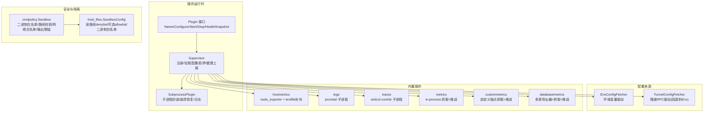
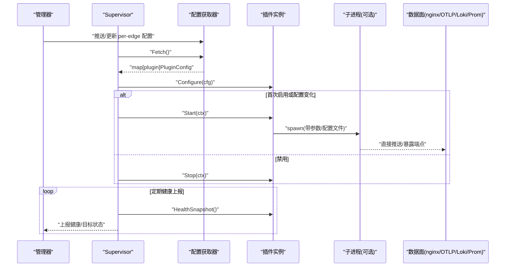
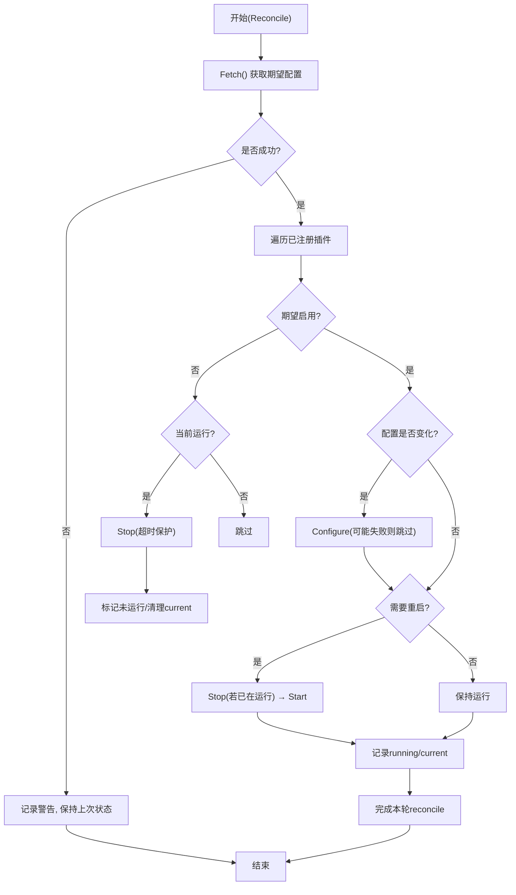
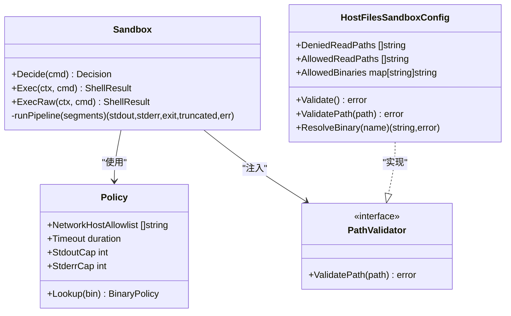
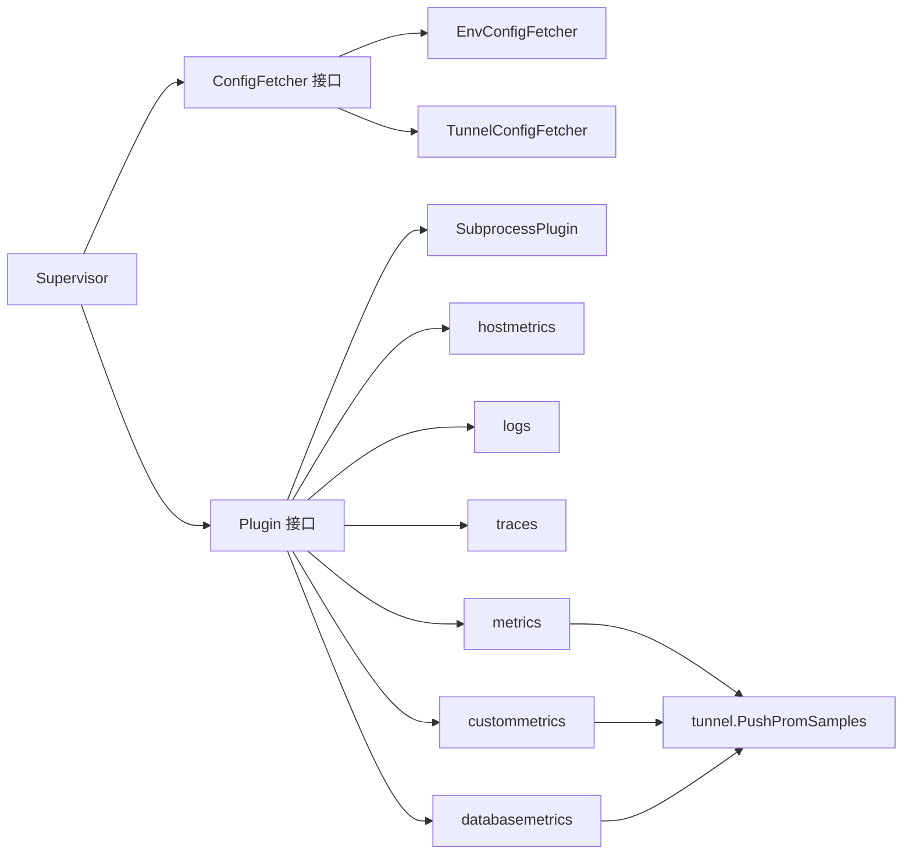

# 插件生态系统

<cite>
**本文引用的文件**   
- [internal/edgeagent/plugins/plugin.go](file://internal/edgeagent/plugins/plugin.go)
- [internal/edgeagent/plugins/supervisor.go](file://internal/edgeagent/plugins/supervisor.go)
- [internal/edgeagent/plugins/subprocess.go](file://internal/edgeagent/plugins/subprocess.go)
- [internal/edgeagent/plugins/config_env.go](file://internal/edgeagent/plugins/config_env.go)
- [internal/edgeagent/plugins/config_tunnel.go](file://internal/edgeagent/plugins/config_tunnel.go)
- [internal/edgeagent/plugins/hostmetrics/plugin.go](file://internal/edgeagent/plugins/hostmetrics/plugin.go)
- [internal/edgeagent/plugins/logs/plugin.go](file://internal/edgeagent/plugins/logs/plugin.go)
- [internal/edgeagent/plugins/traces/plugin.go](file://internal/edgeagent/plugins/traces/plugin.go)
- [internal/edgeagent/plugins/metrics/plugin.go](file://internal/edgeagent/plugins/metrics/plugin.go)
- [internal/edgeagent/plugins/custommetrics/plugin.go](file://internal/edgeagent/plugins/custommetrics/plugin.go)
- [internal/edgeagent/plugins/databasemetrics/plugin.go](file://internal/edgeagent/plugins/databasemetrics/plugin.go)
- [internal/edgeagent/cmdpolicy/sandbox.go](file://internal/edgeagent/cmdpolicy/sandbox.go)
- [internal/edgeagent/host_files/sandbox.go](file://internal/edgeagent/host_files/sandbox.go)
- [ROADMAP.md](file://ROADMAP.md)
</cite>

## 目录
1. [引言](#引言)
2. [项目结构](#项目结构)
3. [核心组件](#核心组件)
4. [架构总览](#架构总览)
5. [详细组件分析](#详细组件分析)
6. [依赖关系分析](#依赖关系分析)
7. [性能与可靠性](#性能与可靠性)
8. [故障排查指南](#故障排查指南)
9. [结论](#结论)
10. [附录：开发、测试与发布指南](#附录开发测试与发布指南)

## 引言
本文件系统化梳理 ongrid-edge 的插件生态，覆盖可扩展的插件架构、内置插件实现（主机指标采集、进程监控、日志收集、数据库监控等）、安全沙箱机制、通信协议、生命周期管理、隔离执行、以及面向开发者的 SDK 与最佳实践。目标是帮助读者快速理解并扩展该插件体系，同时为运维与开发者提供可操作的配置与排障指引。

## 项目结构
插件子系统位于 internal/edgeagent/plugins，围绕统一 Plugin 接口与 Supervisor 调度器组织；具体能力以子包形式实现（hostmetrics、logs、traces、metrics、custommetrics、databasemetrics）。命令策略与文件系统访问控制由 cmdpolicy 与 host_files 两个模块提供。

图示来源
- [internal/edgeagent/plugins/plugin.go:18-52](file://internal/edgeagent/plugins/plugin.go#L18-L52)
- [internal/edgeagent/plugins/supervisor.go:12-47](file://internal/edgeagent/plugins/supervisor.go#L12-L47)
- [internal/edgeagent/plugins/subprocess.go:17-50](file://internal/edgeagent/plugins/subprocess.go#L17-L50)
- [internal/edgeagent/plugins/config_env.go:10-34](file://internal/edgeagent/plugins/config_env.go#L10-L34)
- [internal/edgeagent/plugins/config_tunnel.go:12-34](file://internal/edgeagent/plugins/config_tunnel.go#L12-L34)
- [internal/edgeagent/plugins/hostmetrics/plugin.go:1-28](file://internal/edgeagent/plugins/hostmetrics/plugin.go#L1-L28)
- [internal/edgeagent/plugins/logs/plugin.go:1-27](file://internal/edgeagent/plugins/logs/plugin.go#L1-L27)
- [internal/edgeagent/plugins/traces/plugin.go:1-22](file://internal/edgeagent/plugins/traces/plugin.go#L1-L22)
- [internal/edgeagent/plugins/metrics/plugin.go:1-35](file://internal/edgeagent/plugins/metrics/plugin.go#L1-L35)
- [internal/edgeagent/plugins/custommetrics/plugin.go:1-23](file://internal/edgeagent/plugins/custommetrics/plugin.go#L1-L23)
- [internal/edgeagent/plugins/databasemetrics/plugin.go:1-29](file://internal/edgeagent/plugins/databasemetrics/plugin.go#L1-L29)
- [internal/edgeagent/cmdpolicy/sandbox.go:17-38](file://internal/edgeagent/cmdpolicy/sandbox.go#L17-L38)
- [internal/edgeagent/host_files/sandbox.go:1-24](file://internal/edgeagent/host_files/sandbox.go#L1-L24)

章节来源
- [internal/edgeagent/plugins/plugin.go:18-52](file://internal/edgeagent/plugins/plugin.go#L18-L52)
- [internal/edgeagent/plugins/supervisor.go:12-47](file://internal/edgeagent/plugins/supervisor.go#L12-L47)
- [internal/edgeagent/plugins/subprocess.go:17-50](file://internal/edgeagent/plugins/subprocess.go#L17-L50)
- [internal/edgeagent/plugins/config_env.go:10-34](file://internal/edgeagent/plugins/config_env.go#L10-L34)
- [internal/edgeagent/plugins/config_tunnel.go:12-34](file://internal/edgeagent/plugins/config_tunnel.go#L12-L34)
- [internal/edgeagent/plugins/hostmetrics/plugin.go:1-28](file://internal/edgeagent/plugins/hostmetrics/plugin.go#L1-L28)
- [internal/edgeagent/plugins/logs/plugin.go:1-27](file://internal/edgeagent/plugins/logs/plugin.go#L1-L27)
- [internal/edgeagent/plugins/traces/plugin.go:1-22](file://internal/edgeagent/plugins/traces/plugin.go#L1-L22)
- [internal/edgeagent/plugins/metrics/plugin.go:1-35](file://internal/edgeagent/plugins/metrics/plugin.go#L1-L35)
- [internal/edgeagent/plugins/custommetrics/plugin.go:1-23](file://internal/edgeagent/plugins/custommetrics/plugin.go#L1-L23)
- [internal/edgeagent/plugins/databasemetrics/plugin.go:1-29](file://internal/edgeagent/plugins/databasemetrics/plugin.go#L1-L29)
- [internal/edgeagent/cmdpolicy/sandbox.go:17-38](file://internal/edgeagent/cmdpolicy/sandbox.go#L17-L38)
- [internal/edgeagent/host_files/sandbox.go:1-24](file://internal/edgeagent/host_files/sandbox.go#L1-L24)

## 核心组件
- 插件接口与状态模型
  - 统一接口：Name/Configure/Start/Stop/HealthSnapshot，遵循 OpenTelemetry 信号命名（metrics/logs/traces/profiles）。
  - 健康模型：包含名称、状态、最近错误、重启计数、PID、时间戳与目标级健康（Targets）。
- 配置获取器
  - EnvConfigFetcher：从环境变量构建每插件配置快照，支持 ENABLED/ENDPOINT/AUTH_USER/AUTH_PASS/SPEC_JSON 等键。
  - TunnelConfigFetcher：通过隧道 RPC 拉取 per-edge 配置，失败时回退到 Env 快照。
- 生命周期调度器
  - Supervisor：维护注册表、周期性拉取配置、对比差异、按需 Configure/Start/Stop，并汇总 HealthSnapshot。
- 子进程封装
  - SubprocessPlugin：负责渲染配置、启动子进程、捕获输出、SIGTERM 优雅退出、指数退避重启与健康上报。

章节来源
- [internal/edgeagent/plugins/plugin.go:18-106](file://internal/edgeagent/plugins/plugin.go#L18-L106)
- [internal/edgeagent/plugins/config_env.go:10-71](file://internal/edgeagent/plugins/config_env.go#L10-L71)
- [internal/edgeagent/plugins/config_tunnel.go:12-34](file://internal/edgeagent/plugins/config_tunnel.go#L12-L34)
- [internal/edgeagent/plugins/supervisor.go:12-133](file://internal/edgeagent/plugins/supervisor.go#L12-L133)
- [internal/edgeagent/plugins/subprocess.go:17-133](file://internal/edgeagent/plugins/subprocess.go#L17-L133)

## 架构总览
下图展示插件运行时的关键交互：Supervisor 周期拉取配置，按启用状态与变更触发 Configure/Start/Stop；内置插件或子进程插件对外暴露数据面通道（如 node_exporter / promtail / otelcol），或通过隧道 RPC 将样本推送到管理器。

图示来源
- [internal/edgeagent/plugins/supervisor.go:112-133](file://internal/edgeagent/plugins/supervisor.go#L112-L133)
- [internal/edgeagent/plugins/subprocess.go:135-183](file://internal/edgeagent/plugins/subprocess.go#L135-L183)
- [internal/edgeagent/plugins/config_env.go:46-71](file://internal/edgeagent/plugins/config_env.go#L46-L71)
- [internal/edgeagent/plugins/config_tunnel.go:12-34](file://internal/edgeagent/plugins/config_tunnel.go#L12-L34)

## 详细组件分析

### 插件接口与调度器
- 设计要点
  - 统一生命周期：Configure → Start → (HealthSnapshot)* → Stop。
  - 并发安全：Supervisor 在 Run 中周期性 reconcile，对每个插件独立处理，避免单点故障影响其他插件。
  - 幂等性：Start/Stop 需幂等，便于重配与热加载。
- 关键流程
  - 初始拉取并应用配置；收到重载信号或定时轮询时再次 reconcile。
  - 比较当前与期望配置，决定是否停止、重新配置或启动。
  - 健康快照聚合后上报给管理器。

图示来源
- [internal/edgeagent/plugins/supervisor.go:135-230](file://internal/edgeagent/plugins/supervisor.go#L135-L230)

章节来源
- [internal/edgeagent/plugins/plugin.go:18-106](file://internal/edgeagent/plugins/plugin.go#L18-L106)
- [internal/edgeagent/plugins/supervisor.go:112-230](file://internal/edgeagent/plugins/supervisor.go#L112-L230)

### 子进程插件封装
- 职责
  - 渲染配置到工作目录；构造命令行参数；启动子进程；捕获 stdout/stderr 到本地日志；优雅终止（SIGTERM）；崩溃指数退避重启；健康状态与 PID 上报。
- 健壮性
  - 等待延迟与超时保护；上下文取消传播；重启计数单调递增，仅在“禁用→重新启用”时重置。

章节来源
- [internal/edgeagent/plugins/subprocess.go:17-318](file://internal/edgeagent/plugins/subprocess.go#L17-L318)

### 配置来源与环境变量
- EnvConfigFetcher
  - 键名约定：ONGRID_EDGE_PLUGIN_<NAME>_ENABLED/ENDPOINT/AUTH_USER/AUTH_PASS/SPEC_JSON，全局 ONGRID_EDGE_ID。
  - 当 AUTH_USER/AUTH_PASS 为空时，回退到边缘侧 ACCESS_KEY/SECRET_KEY。
- TunnelConfigFetcher
  - 通过隧道 RPC 获取 per-edge 配置；不可用时回退到 Env 快照，保证冷启动可用。

章节来源
- [internal/edgeagent/plugins/config_env.go:10-101](file://internal/edgeagent/plugins/config_env.go#L10-L101)
- [internal/edgeagent/plugins/config_tunnel.go:12-34](file://internal/edgeagent/plugins/config_tunnel.go#L12-L34)

### 内置插件：主机指标采集（hostmetrics）
- 功能
  - 启动 node_exporter 子进程，默认监听 :9102；支持 collectors_enabled/disabled 与 extra_args。
  - 内嵌补充指标生产者，写入 textfile 目录，解决部分内核路径不兼容导致的指标缺失问题。
- 配置项（Spec）
  - listen_address、collectors_enabled、collectors_disabled、extra_args。
- 数据流
  - Prometheus 通过 docker 桥接抓取 host:port；补充指标经 textfile collector 汇入同一 /metrics。

章节来源
- [internal/edgeagent/plugins/hostmetrics/plugin.go:1-277](file://internal/edgeagent/plugins/hostmetrics/plugin.go#L1-L277)

### 内置插件：日志收集（logs）
- 功能
  - 启动 promtail 子进程，自动发现审计插件 JSONL 输出路径，无需额外编排即可将审计日志推入 Loki。
- 配置项
  - 由 logs 插件根据 PluginConfig 渲染 promtail.yaml，并设置 positions 文件位置以保证重启不丢位点。

章节来源
- [internal/edgeagent/plugins/logs/plugin.go:1-54](file://internal/edgeagent/plugins/logs/plugin.go#L1-L54)

### 内置插件：链路追踪（traces）
- 功能
  - 启动 otelcol-contrib 子进程，接收 OTLP gRPC/HTTP，直接推送至管理器 nginx /v1/traces。
- 配置项
  - 由 traces 插件渲染 otelcol.yaml，并通过 --config 指定。

章节来源
- [internal/edgeagent/plugins/traces/plugin.go:1-48](file://internal/edgeagent/plugins/traces/plugin.go#L1-L48)

### 内置插件：指标抓取（metrics）
- 功能
  - in-process 抓取本地 HTTP /metrics（默认 node_exporter），解析 Prometheus 文本格式，通过隧道 RPC push_prom_samples 推送。
- 优势
  - 复用隧道认证；管理器 ingester 注入 device_id 标签，便于关联告警与查询。
- 配置项（Spec）
  - target_url、scrape_interval、scrape_timeout、tls_insecure、bearer_token、extra_labels。

章节来源
- [internal/edgeagent/plugins/metrics/plugin.go:1-306](file://internal/edgeagent/plugins/metrics/plugin.go#L1-L306)

### 内置插件：自定义指标（custommetrics）
- 功能
  - 针对任意 Prometheus /metrics 端点进行抓取，并在本地推送样本，支持 up 样本与健康状态。
- 配置项
  - 多个目标 URL，每项含 ID/URL/Interval/Timeout 等。

章节来源
- [internal/edgeagent/plugins/custommetrics/plugin.go:1-291](file://internal/edgeagent/plugins/custommetrics/plugin.go#L1-L291)

### 内置插件：数据库指标（databasemetrics）
- 功能
  - 为每个数据库源启动一个 exporter 子进程，读取本地受管密钥文件，抓取指标并通过隧道 RPC 推送。
- 安全
  - 严格校验密钥文件权限与存在性，拒绝不安全配置。
- 健康
  - 目标级健康（ID/Kind/State/Samples/LastSuccessAt）随健康快照上报。

章节来源
- [internal/edgeagent/plugins/databasemetrics/plugin.go:1-403](file://internal/edgeagent/plugins/databasemetrics/plugin.go#L1-L403)

### 安全沙箱与隔离执行
- 命令策略沙箱（cmdpolicy.Sandbox）
  - 二进制白名单、路径校验、网络目标白名单、管道组合执行、输出限幅、超时控制。
  - ExecRaw 作为管理员写操作逃逸门（绕过白名单/语法检查，但仍受超时与输出限幅约束）。
- 文件系统沙箱（host_files.SandboxConfig）
  - 读路径 denylist（虚拟文件系统、敏感文件）+ 可选 allowlist；符号链接规范化与后缀匹配；二进制白名单解析。
- 规划与演进
  - 路线图提出微沙箱运行时、seccomp/capabilities 库、危险类命令容器化执行、租户资源配额等。

图示来源
- [internal/edgeagent/cmdpolicy/sandbox.go:52-188](file://internal/edgeagent/cmdpolicy/sandbox.go#L52-L188)
- [internal/edgeagent/host_files/sandbox.go:57-133](file://internal/edgeagent/host_files/sandbox.go#L57-L133)

章节来源
- [internal/edgeagent/cmdpolicy/sandbox.go:17-550](file://internal/edgeagent/cmdpolicy/sandbox.go#L17-L550)
- [internal/edgeagent/host_files/sandbox.go:1-305](file://internal/edgeagent/host_files/sandbox.go#L1-L305)
- [ROADMAP.md:427-464](file://ROADMAP.md#L427-L464)

## 依赖关系分析
- 组件耦合
  - Supervisor 与 ConfigFetcher 松耦合（接口抽象），可替换 Env/Tunnel 实现。
  - 子进程插件与宿主进程解耦，通过文件系统与 CLI 参数交互，降低崩溃面。
  - metrics/custommetrics/databasemetrics 通过 Pusher 接口与隧道客户端对接，便于测试与替换。
- 外部依赖
  - 子进程：node_exporter、promtail、otelcol-contrib。
  - 隧道 RPC：push_prom_samples、get_plugin_configs 等。
- 潜在循环依赖
  - 插件层无循环导入；Supervisor 仅依赖接口，避免反向依赖。

图示来源
- [internal/edgeagent/plugins/supervisor.go:12-47](file://internal/edgeagent/plugins/supervisor.go#L12-L47)
- [internal/edgeagent/plugins/config_env.go:10-34](file://internal/edgeagent/plugins/config_env.go#L10-L34)
- [internal/edgeagent/plugins/config_tunnel.go:12-34](file://internal/edgeagent/plugins/config_tunnel.go#L12-L34)
- [internal/edgeagent/plugins/metrics/plugin.go:51-62](file://internal/edgeagent/plugins/metrics/plugin.go#L51-L62)
- [internal/edgeagent/plugins/custommetrics/plugin.go:25-33](file://internal/edgeagent/plugins/custommetrics/plugin.go#L25-L33)
- [internal/edgeagent/plugins/databasemetrics/plugin.go:31-35](file://internal/edgeagent/plugins/databasemetrics/plugin.go#L31-L35)

章节来源
- [internal/edgeagent/plugins/supervisor.go:12-47](file://internal/edgeagent/plugins/supervisor.go#L12-L47)
- [internal/edgeagent/plugins/config_env.go:10-34](file://internal/edgeagent/plugins/config_env.go#L10-L34)
- [internal/edgeagent/plugins/config_tunnel.go:12-34](file://internal/edgeagent/plugins/config_tunnel.go#L12-L34)
- [internal/edgeagent/plugins/metrics/plugin.go:51-62](file://internal/edgeagent/plugins/metrics/plugin.go#L51-L62)
- [internal/edgeagent/plugins/custommetrics/plugin.go:25-33](file://internal/edgeagent/plugins/custommetrics/plugin.go#L25-L33)
- [internal/edgeagent/plugins/databasemetrics/plugin.go:31-35](file://internal/edgeagent/plugins/databasemetrics/plugin.go#L31-L35)

## 性能与可靠性
- 子进程崩溃恢复：指数退避（1s→2s→…上限5分钟），避免雪崩。
- 健康上报：Supervisor 定期聚合各插件健康，减少主线程阻塞。
- 抓取与推送：
  - metrics/custommetrics 使用短超时与逐目标重试，单个目标失败不影响其余。
  - databasemetrics 为每个源并行运行导出器，按间隔抓取并推送 up 样本。
- 输出限幅：cmdpolicy 对 stdout/stderr 限幅，防止大输出占用内存与带宽。

章节来源
- [internal/edgeagent/plugins/subprocess.go:194-235](file://internal/edgeagent/plugins/subprocess.go#L194-L235)
- [internal/edgeagent/plugins/metrics/plugin.go:214-282](file://internal/edgeagent/plugins/metrics/plugin.go#L214-L282)
- [internal/edgeagent/plugins/custommetrics/plugin.go:187-229](file://internal/edgeagent/plugins/custommetrics/plugin.go#L187-L229)
- [internal/edgeagent/plugins/databasemetrics/plugin.go:276-324](file://internal/edgeagent/plugins/databasemetrics/plugin.go#L276-L324)
- [internal/edgeagent/cmdpolicy/sandbox.go:398-422](file://internal/edgeagent/cmdpolicy/sandbox.go#L398-L422)

## 故障排查指南
- 插件未启动/频繁重启
  - 检查 Supervisor 日志中的 “starting/stopping plugin”、“configure failed/start failed”。
  - 确认子进程二进制是否存在于 binDir；查看工作目录下的 <name>.log。
- 配置未生效
  - 核对 Env 键名与值类型；SPEC_JSON 是否为合法 JSON；Tunnel 是否可达。
- 指标缺失
  - hostmetrics：确认 textfile 目录存在且被 node_exporter 挂载；检查内核路径兼容性。
  - metrics/custommetrics：确认 target_url 可达、超时合理、TLS 选项正确。
- 数据库指标失败
  - 检查 secrets 文件权限（必须 0600 或更严格）、内容非空；导出器二进制是否存在。
- 命令执行被拒
  - cmdpolicy：确认二进制在白名单、路径不在 denylist、网络目标在白名单；必要时使用 ExecRaw（管理员授权）。

章节来源
- [internal/edgeagent/plugins/supervisor.go:135-230](file://internal/edgeagent/plugins/supervisor.go#L135-L230)
- [internal/edgeagent/plugins/subprocess.go:239-287](file://internal/edgeagent/plugins/subprocess.go#L239-L287)
- [internal/edgeagent/plugins/hostmetrics/plugin.go:150-231](file://internal/edgeagent/plugins/hostmetrics/plugin.go#L150-L231)
- [internal/edgeagent/plugins/metrics/plugin.go:223-282](file://internal/edgeagent/plugins/metrics/plugin.go#L223-L282)
- [internal/edgeagent/plugins/custommetrics/plugin.go:187-229](file://internal/edgeagent/plugins/custommetrics/plugin.go#L187-L229)
- [internal/edgeagent/plugins/databasemetrics/plugin.go:326-349](file://internal/edgeagent/plugins/databasemetrics/plugin.go#L326-L349)
- [internal/edgeagent/cmdpolicy/sandbox.go:78-188](file://internal/edgeagent/cmdpolicy/sandbox.go#L78-L188)

## 结论
本插件体系以统一接口与 Supervisor 为核心，结合子进程封装与安全沙箱，实现了高内聚、低耦合的可扩展观测与诊断能力。内置插件覆盖了主机指标、进程、日志、追踪与数据库等多维度场景，并通过隧道 RPC 与管理器协同，形成端到端的可观测闭环。未来可通过微沙箱、seccomp 与资源配额进一步增强隔离性与可控性。

## 附录：开发、测试与发布指南

### 插件开发框架与 SDK
- 最小实现
  - 实现 Plugin 接口；如需子进程，优先使用 SubprocessPlugin，仅需提供 binary/workDir/configRender/args。
  - 通过 Supervisor.Register 注册；Supervisor 负责生命周期与配置同步。
- 配置传递
  - 通过 PluginConfig.Spec 传递插件特定参数；AuthUser/AuthPass/Endpoint 用于数据面鉴权与地址。
- 健康与目标级状态
  - 对于多目标插件（custommetrics/databasemetrics），维护 TargetHealth 列表并纳入 HealthSnapshot。

章节来源
- [internal/edgeagent/plugins/plugin.go:18-106](file://internal/edgeagent/plugins/plugin.go#L18-L106)
- [internal/edgeagent/plugins/subprocess.go:52-133](file://internal/edgeagent/plugins/subprocess.go#L52-L133)
- [internal/edgeagent/plugins/supervisor.go:75-110](file://internal/edgeagent/plugins/supervisor.go#L75-L110)

### 测试方法
- 单元测试
  - 使用 fakePlugin 模拟 Configure/Start/Stop/HealthSnapshot 行为；staticFetcher 固定配置快照。
  - 验证 Supervisor 的重载、停止、启动与错误分支。
- 集成测试
  - 通过真实子进程（node_exporter/promtail/otelcol）进行端到端验证；关注工作目录产物与日志。

章节来源
- [internal/edgeagent/plugins/supervisor_test.go:1-79](file://internal/edgeagent/plugins/supervisor_test.go#L1-L79)

### 发布流程与版本管理
- 二进制打包
  - 将子进程二进制放入 binDir（如 /opt/ongrid-edge/bin），确保 Supervisor 能找到。
- 配置分发
  - 生产环境推荐 TunnelConfigFetcher；开发/冷启动可使用 EnvConfigFetcher。
- 签名与可信来源（市场集成）
  - 管理器 marketplace 支持安装/卸载/列出已安装包，并可配置要求签名的来源；前端显示签名状态徽章。
  - 建议为官方来源强制签名校验，第三方来源可选择性校验。

章节来源
- [internal/edgeagent/plugins/config_tunnel.go:12-34](file://internal/edgeagent/plugins/config_tunnel.go#L12-L34)
- [internal/edgeagent/plugins/config_env.go:10-71](file://internal/edgeagent/plugins/config_env.go#L10-L71)
- [cmd/ongrid/main.go:1896-1946](file://cmd/ongrid/main.go#L1896-L1946)
- [web/src/components/marketplace/SignatureBadge.tsx:1-52](file://web/src/components/marketplace/SignatureBadge.tsx#L1-L52)

### 最佳实践
- 插件设计
  - 尽量使用子进程封装，降低崩溃面；配置渲染与参数构造分离，便于测试。
  - 对多目标插件，采用并发抓取与逐目标错误隔离，避免级联失败。
- 安全与合规
  - 严格限制网络访问与文件系统路径；对敏感文件采用只读与最小权限。
  - 使用隧道 RPC 传输遥测数据，复用边缘认证，避免暴露公网端口。
- 运维与可观测性
  - 完善健康上报与目标级状态；保留子进程日志与工作目录产物，便于定位问题。
  - 合理设置超时与限幅，避免资源耗尽。