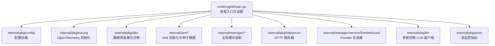
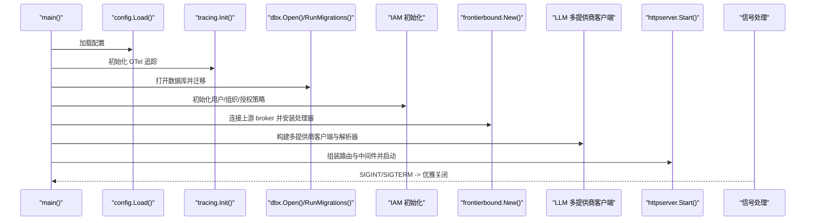
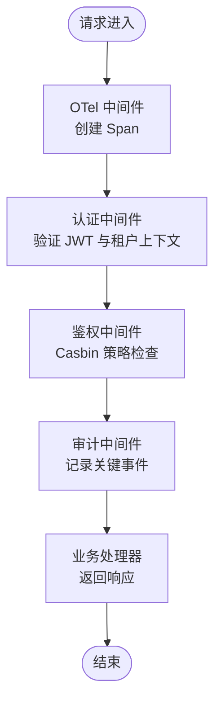
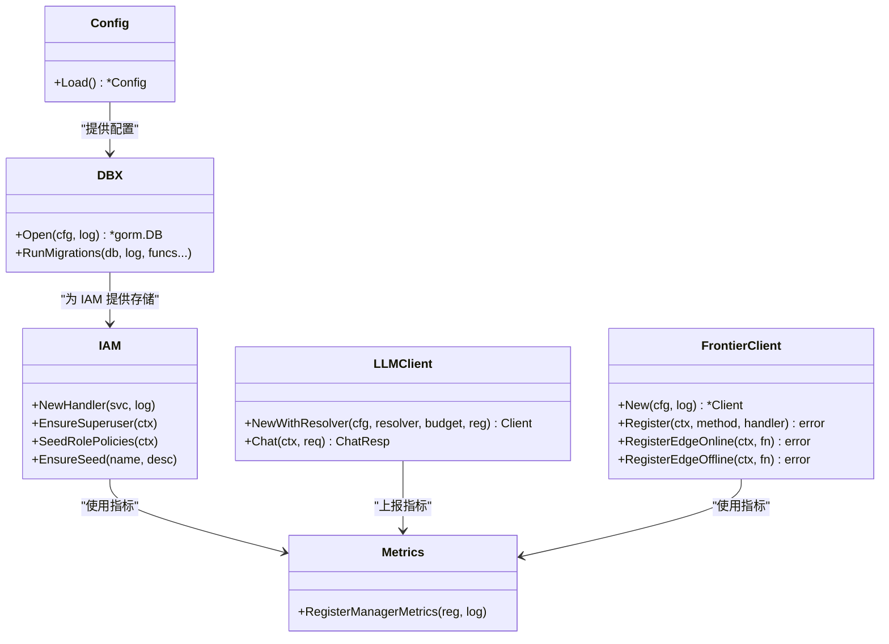
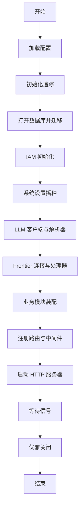
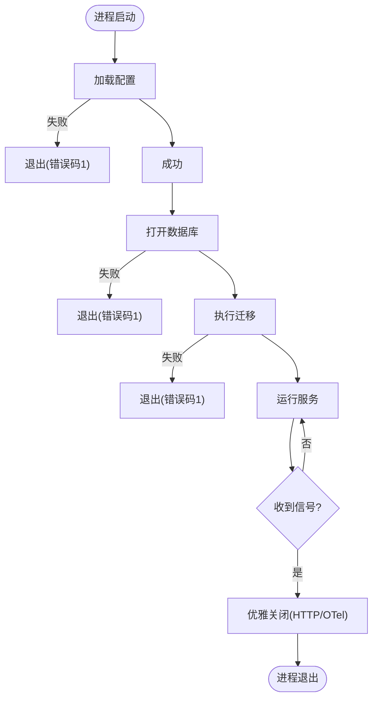
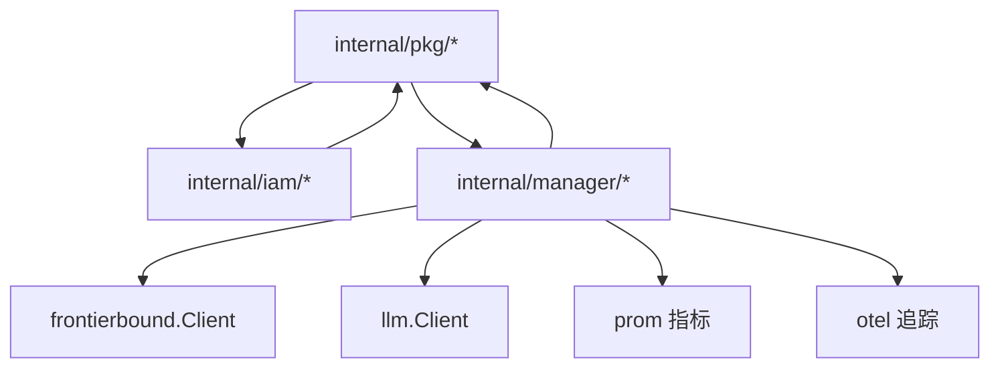

# 服务架构与启动流程

<cite>
**本文引用的文件**   
- [cmd/ongrid/main.go](file://cmd/ongrid/main.go)
- [internal/pkg/config/config.go](file://internal/pkg/config/config.go)
- [internal/pkg/dbx/dbx.go](file://internal/pkg/dbx/dbx.go)
- [internal/pkg/tracing/tracing.go](file://internal/pkg/tracing/tracing.go)
- [internal/pkg/httpserver/server.go](file://internal/pkg/httpserver/server.go)
- [internal/pkg/auth/middleware.go](file://internal/pkg/auth/middleware.go)
- [internal/pkg/authzmw/middleware.go](file://internal/pkg/authzmw/middleware.go)
- [internal/manager/service/frontierbound/client.go](file://internal/manager/service/frontierbound/client.go)
- [internal/pkg/llm/client.go](file://internal/pkg/llm/client.go)
- [internal/pkg/prom/manager_metrics.go](file://internal/pkg/prom/manager_metrics.go)
</cite>

## 目录
1. [简介](#简介)
2. [项目结构](#项目结构)
3. [核心组件](#核心组件)
4. [架构总览](#架构总览)
5. [详细组件分析](#详细组件分析)
6. [依赖关系分析](#依赖关系分析)
7. [性能考量](#性能考量)
8. [故障排查指南](#故障排查指南)
9. [结论](#结论)
10. [附录](#附录)

## 简介
本文件面向云端管理器（Manager）服务的架构设计与启动流程，覆盖 HTTP 服务器初始化、路由与中间件链、依赖注入与生命周期管理、配置加载、数据库迁移、IAM 系统初始化、业务模块注册、错误处理与优雅关闭、信号处理、可观测性（Prometheus/OpenTelemetry/日志）、以及扩展点说明。目标是帮助开发者快速理解并安全地扩展 Manager 服务。

## 项目结构
Manager 采用“按领域边界 + 分层”的组织方式：
- cmd/ongrid/main.go：进程入口，负责装配所有子系统、启动 HTTP 与后台任务、处理信号与优雅关闭。
- internal/pkg/*：通用基础库（配置、数据库、认证、鉴权、HTTP 封装、LLM 客户端、追踪等）。
- internal/manager/*：Manager 域（biz/data/model/server/service），按子域划分。
- internal/iam/*：身份与权限域（用户、组织、成员、授权策略）。
- internal/skill/*：内置技能注册与管理。

图表来源
- [cmd/ongrid/main.go:195-276](file://cmd/ongrid/main.go#L195-L276)
- [internal/pkg/config/config.go:369-486](file://internal/pkg/config/config.go#L369-L486)
- [internal/pkg/tracing/tracing.go:60-106](file://internal/pkg/tracing/tracing.go#L60-L106)
- [internal/pkg/dbx/dbx.go:40-77](file://internal/pkg/dbx/dbx.go#L40-L77)
- [internal/manager/service/frontierbound/client.go:61-89](file://internal/manager/service/frontierbound/client.go#L61-L89)
- [internal/pkg/llm/client.go:165-187](file://internal/pkg/llm/client.go#L165-L187)
- [internal/pkg/prom/manager_metrics.go:203-236](file://internal/pkg/prom/manager_metrics.go#L203-L236)

章节来源
- [cmd/ongrid/main.go:195-276](file://cmd/ongrid/main.go#L195-L276)
- [internal/pkg/config/config.go:369-486](file://internal/pkg/config/config.go#L369-L486)

## 核心组件
- 配置中心：从环境变量加载运行时配置，提供默认值与解析工具函数。
- 数据库层：统一 MySQL/SQLite 后端，自动迁移，连接池健康检查。
- IAM 子系统：用户、组织、成员、Casbin 授权策略初始化与种子数据。
- LLM 客户端：支持多提供商（OpenAI/Anthropic/Zhipu/Gemini/DeepSeek/Kimi），动态解析器与预算控制。
- Frontier 消息中间件：Manager 作为 service-end 与上游 broker 建立长连接，安装反向调用处理器与生命周期回调。
- HTTP 服务器：基于 chi 的路由，集成认证与鉴权中间件、OTel HTTP 中间件、审计与租户上下文。
- 可观测性：Prometheus 指标、OpenTelemetry 追踪、结构化日志。

章节来源
- [internal/pkg/config/config.go:18-48](file://internal/pkg/config/config.go#L18-L48)
- [internal/pkg/dbx/dbx.go:1-16](file://internal/pkg/dbx/dbx.go#L1-L16)
- [internal/pkg/llm/client.go:125-141](file://internal/pkg/llm/client.go#L125-L141)
- [internal/manager/service/frontierbound/client.go:49-58](file://internal/manager/service/frontierbound/client.go#L49-L58)
- [internal/pkg/httpserver/server.go:13-29](file://internal/pkg/httpserver/server.go#L13-L29)
- [internal/pkg/tracing/tracing.go:1-19](file://internal/pkg/tracing/tracing.go#L1-L19)

## 架构总览
Manager 的启动主流程在 main() 中编排，顺序如下：
- 加载配置与环境变量
- 初始化日志与 OpenTelemetry 追踪
- 打开数据库并执行迁移
- 初始化 IAM（含 Casbin 策略与默认组织）
- 初始化系统设置（system_settings）与各类集成（Grafana/Loki/Tempo/Prom）
- 构建 LLM 多提供商客户端与动态解析器
- 初始化 Frontier 连接与反向调用处理器
- 组装各业务模块（设备、边缘、告警、拓扑、报告、工作流等）
- 注册受保护路由与公开路由，挂载中间件链
- 启动 HTTP 服务器与后台任务，监听信号进行优雅关闭

图表来源
- [cmd/ongrid/main.go:195-276](file://cmd/ongrid/main.go#L195-L276)
- [internal/pkg/tracing/tracing.go:60-106](file://internal/pkg/tracing/tracing.go#L60-L106)
- [internal/pkg/dbx/dbx.go:40-77](file://internal/pkg/dbx/dbx.go#L40-L77)
- [internal/manager/service/frontierbound/client.go:61-89](file://internal/manager/service/frontierbound/client.go#L61-L89)
- [internal/pkg/llm/client.go:165-187](file://internal/pkg/llm/client.go#L165-L187)
- [internal/pkg/httpserver/server.go:34-59](file://internal/pkg/httpserver/server.go#L34-L59)

## 详细组件分析

### HTTP 服务器与路由、中间件链
- 服务器封装：httpserver.Server 包装 net/http.Server，提供带超时的优雅关闭。
- 中间件链顺序（典型）：
  - OTel HTTP 中间件（请求级追踪）
  - 认证中间件（JWT 校验，写入租户上下文）
  - 鉴权中间件（Casbin 策略，超级用户短路）
  - 审计中间件（记录登录尝试等）
  - 业务路由处理器
- 路由分组：受保护路由（需要认证与鉴权）与公开路由（如版本、分享链接等）分别注册。

图表来源
- [internal/pkg/httpserver/server.go:13-29](file://internal/pkg/httpserver/server.go#L13-L29)
- [internal/pkg/auth/middleware.go:21-53](file://internal/pkg/auth/middleware.go#L21-L53)
- [internal/pkg/authzmw/middleware.go:70-97](file://internal/pkg/authzmw/middleware.go#L70-L97)
- [cmd/ongrid/main.go:2414-2448](file://cmd/ongrid/main.go#L2414-L2448)

章节来源
- [internal/pkg/httpserver/server.go:13-29](file://internal/pkg/httpserver/server.go#L13-L29)
- [internal/pkg/auth/middleware.go:21-53](file://internal/pkg/auth/middleware.go#L21-L53)
- [internal/pkg/authzmw/middleware.go:70-97](file://internal/pkg/authzmw/middleware.go#L70-L97)
- [cmd/ongrid/main.go:2414-2448](file://cmd/ongrid/main.go#L2414-L2448)

### 依赖注入与生命周期管理
- 配置加载：config.Load() 从环境变量读取，提供默认值与解析工具。
- 数据库连接：dbx.Open() 根据方言选择 MySQL/SQLite，MySQL 会 Ping 连通性；SQLite 启用 WAL 与外键约束。
- 迁移：dbx.RunMigrations() 按顺序执行各 data store 的 Migrate(db)。
- IAM 初始化：用户仓库、签名器、用例、Casbin 策略、默认组织与成员回填。
- 系统设置：system_settings 表的首次引导（LLM、Prom、Grafana、Loki、Tempo、WebSearch 等）。
- LLM 客户端：NewWithResolver() 支持动态解析器与预算检查，内部缓存 SDK 客户端与解析结果。
- Frontier 连接：New() 建立到上游 broker 的长连接，Register* 安装反向调用处理器与生命周期回调。
- Prometheus 指标：注册 manager 自监控指标（HTTP、DB 池、LLM 调用等）。

图表来源
- [internal/pkg/config/config.go:369-486](file://internal/pkg/config/config.go#L369-L486)
- [internal/pkg/dbx/dbx.go:40-77](file://internal/pkg/dbx/dbx.go#L40-L77)
- [cmd/ongrid/main.go:282-386](file://cmd/ongrid/main.go#L282-L386)
- [internal/pkg/llm/client.go:165-187](file://internal/pkg/llm/client.go#L165-L187)
- [internal/manager/service/frontierbound/client.go:61-89](file://internal/manager/service/frontierbound/client.go#L61-L89)
- [internal/pkg/prom/manager_metrics.go:203-236](file://internal/pkg/prom/manager_metrics.go#L203-L236)

章节来源
- [internal/pkg/config/config.go:369-486](file://internal/pkg/config/config.go#L369-L486)
- [internal/pkg/dbx/dbx.go:40-77](file://internal/pkg/dbx/dbx.go#L40-L77)
- [cmd/ongrid/main.go:282-386](file://cmd/ongrid/main.go#L282-L386)
- [internal/pkg/llm/client.go:165-187](file://internal/pkg/llm/client.go#L165-L187)
- [internal/manager/service/frontierbound/client.go:61-89](file://internal/manager/service/frontierbound/client.go#L61-L89)
- [internal/pkg/prom/manager_metrics.go:203-236](file://internal/pkg/prom/manager_metrics.go#L203-L236)

### 服务启动阶段详解
- 配置加载：读取 HTTP/Metrics/Frontier/DB/JWT/LLM/Admin/Prom/Grafana/Notification/Alert/Logs/Traces/Skills 等配置项。
- 追踪初始化：OTel 导出器与采样率配置，失败时降级继续运行。
- 数据库与迁移：MySQL/SQLite 打开与连通性检查；按顺序执行各模块的 Migrate。
- IAM 初始化：确保超级用户、播种角色策略、创建默认组织与成员回填。
- 系统设置播种：LLM、Prom、Grafana、Loki、Tempo、WebSearch 等首次引导。
- LLM 多提供商：构建客户端与动态解析器，支持管理员 UI 热更新。
- Frontier 连接：建立长连接、安装反向调用处理器、可选 warmup 窗口。
- 业务模块装配：设备、边缘、告警、拓扑、报告、工作流、市场、知识、MCP、通知等。
- 路由与中间件：受保护路由组注册，挂载认证与鉴权中间件。
- 启动与优雅关闭：HTTP 服务器监听，信号处理触发 Shutdown。

图表来源
- [cmd/ongrid/main.go:195-276](file://cmd/ongrid/main.go#L195-L276)
- [cmd/ongrid/main.go:282-386](file://cmd/ongrid/main.go#L282-L386)
- [cmd/ongrid/main.go:865-889](file://cmd/ongrid/main.go#L865-L889)
- [internal/pkg/tracing/tracing.go:60-106](file://internal/pkg/tracing/tracing.go#L60-L106)
- [internal/pkg/dbx/dbx.go:40-77](file://internal/pkg/dbx/dbx.go#L40-L77)
- [internal/pkg/httpserver/server.go:34-59](file://internal/pkg/httpserver/server.go#L34-L59)

章节来源
- [cmd/ongrid/main.go:195-276](file://cmd/ongrid/main.go#L195-L276)
- [cmd/ongrid/main.go:282-386](file://cmd/ongrid/main.go#L282-L386)
- [cmd/ongrid/main.go:865-889](file://cmd/ongrid/main.go#L865-L889)

### 错误处理与优雅关闭
- 错误处理：
  - 配置加载失败直接退出。
  - 数据库打开失败或迁移失败直接退出。
  - IAM 授权初始化失败直接退出。
  - LLM 客户端无 API Key 返回特定错误，避免上层混淆。
  - Frontier 禁用模式返回 ErrDisabled，不影响 HTTP 与 DB 栈。
- 优雅关闭：
  - 通过 signal.NotifyContext 监听 SIGINT/SIGTERM。
  - httpserver.Server.Start 在 ctx 取消后触发 Shutdown，带超时。
  - OTel 导出器在 defer 中关闭，带超时。

图表来源
- [cmd/ongrid/main.go:195-276](file://cmd/ongrid/main.go#L195-L276)
- [internal/pkg/httpserver/server.go:34-59](file://internal/pkg/httpserver/server.go#L34-L59)
- [internal/pkg/tracing/tracing.go:60-106](file://internal/pkg/tracing/tracing.go#L60-L106)
- [internal/pkg/llm/client.go:165-187](file://internal/pkg/llm/client.go#L165-L187)
- [internal/manager/service/frontierbound/client.go:116-126](file://internal/manager/service/frontierbound/client.go#L116-L126)

章节来源
- [cmd/ongrid/main.go:195-276](file://cmd/ongrid/main.go#L195-L276)
- [internal/pkg/httpserver/server.go:34-59](file://internal/pkg/httpserver/server.go#L34-L59)
- [internal/pkg/tracing/tracing.go:60-106](file://internal/pkg/tracing/tracing.go#L60-L106)
- [internal/pkg/llm/client.go:165-187](file://internal/pkg/llm/client.go#L165-L187)
- [internal/manager/service/frontierbound/client.go:116-126](file://internal/manager/service/frontierbound/client.go#L116-L126)

### 可观测性与最佳实践
- Prometheus 指标：
  - HTTP 请求计数与时延直方图。
  - 数据库连接池状态（Open/InUse/Idle/WaitCount）。
  - LLM 调用计数与令牌用量。
- OpenTelemetry 追踪：
  - 全局 TracerProvider 与传播器设置。
  - HTTP 中间件自动埋点。
  - 采样率与批量导出优化。
- 日志记录：
  - slog 结构化日志，组件标签与敏感信息脱敏。
  - 关键路径（配置、DB、IAM、Frontier、LLM）均有日志输出。

章节来源
- [internal/pkg/prom/manager_metrics.go:203-236](file://internal/pkg/prom/manager_metrics.go#L203-L236)
- [internal/pkg/tracing/tracing.go:60-106](file://internal/pkg/tracing/tracing.go#L60-L106)
- [cmd/ongrid/main.go:204-212](file://cmd/ongrid/main.go#L204-L212)

### 扩展点说明
- 新增业务模块：
  - 在 internal/manager/biz/{yourmodule} 实现用例与模型。
  - 在 internal/manager/data/{yourmodule}/store 实现仓储与迁移。
  - 在 internal/manager/server/{yourmodule} 实现 HTTP/gRPC 处理器。
  - 在 main.go 中装配 UC/Store/Handler，并在受保护路由组注册。
- 新增外部集成：
  - 在 system_settings 中增加新类别与键，使用 settingSvc.SetIfAbsent 进行首次引导。
  - 在 LLM 多提供商中添加新的 ProviderConfig 与解析器映射。
- 新增中间件：
  - 在认证与鉴权之间插入自定义中间件（例如限流、审计增强）。
- 新增指标与追踪：
  - 在对应包中注册 Prometheus 指标与 OTel 埋点。

章节来源
- [cmd/ongrid/main.go:282-386](file://cmd/ongrid/main.go#L282-L386)
- [cmd/ongrid/main.go:865-889](file://cmd/ongrid/main.go#L865-L889)
- [internal/pkg/config/config.go:369-486](file://internal/pkg/config/config.go#L369-L486)

## 依赖关系分析
- 低耦合高内聚：
  - pkg 层提供通用能力，被 iam 与 manager 共同复用。
  - manager 域内按子域拆分，server 仅依赖 biz/service，biz 依赖 data/store。
- 外部依赖：
  - gorm（MySQL/SQLite）、chi（HTTP）、geminio/frontier（消息中间件）、go-openai（LLM）、otel（追踪）、prometheus（指标）。
- 潜在循环依赖：
  - 通过接口与窄契约避免循环（如 authzmw.Authorizer 与 iam/biz/authz.Enforcer 的解耦）。

图表来源
- [cmd/ongrid/main.go:195-276](file://cmd/ongrid/main.go#L195-L276)
- [internal/pkg/authzmw/middleware.go:35-41](file://internal/pkg/authzmw/middleware.go#L35-L41)
- [internal/manager/service/frontierbound/client.go:49-58](file://internal/manager/service/frontierbound/client.go#L49-L58)
- [internal/pkg/llm/client.go:125-141](file://internal/pkg/llm/client.go#L125-L141)
- [internal/pkg/prom/manager_metrics.go:203-236](file://internal/pkg/prom/manager_metrics.go#L203-L236)
- [internal/pkg/tracing/tracing.go:60-106](file://internal/pkg/tracing/tracing.go#L60-L106)

章节来源
- [cmd/ongrid/main.go:195-276](file://cmd/ongrid/main.go#L195-L276)
- [internal/pkg/authzmw/middleware.go:35-41](file://internal/pkg/authzmw/middleware.go#L35-L41)
- [internal/manager/service/frontierbound/client.go:49-58](file://internal/manager/service/frontierbound/client.go#L49-L58)
- [internal/pkg/llm/client.go:125-141](file://internal/pkg/llm/client.go#L125-L141)
- [internal/pkg/prom/manager_metrics.go:203-236](file://internal/pkg/prom/manager_metrics.go#L203-L236)
- [internal/pkg/tracing/tracing.go:60-106](file://internal/pkg/tracing/tracing.go#L60-L106)

## 性能考量
- 数据库连接池：
  - MySQL 开启连接池与 Ping 检查；SQLite 启用 WAL 与 busy_timeout。
  - 监控 DB 池指标（Open/InUse/Idle/WaitCount）以调优容量。
- LLM 客户端：
  - 解析器与 SDK 客户端缓存，减少冷路径开销。
  - 默认超时 120s，避免长时间阻塞。
- Frontier 连接：
  - 长连接与重试机制，warmup 窗口降低 race 风险。
- HTTP 服务器：
  - ReadHeaderTimeout 防止慢头攻击。
  - 优雅关闭限制 10s，避免拖慢停机。

[本节为通用指导，不直接分析具体文件]

## 故障排查指南
- 配置问题：
  - 检查环境变量是否缺失或格式错误（URL、密钥、端口）。
  - 确认 JWT Secret 非默认值，否则启动拒绝。
- 数据库问题：
  - MySQL Ping 失败或 SQLite 路径不可写，查看日志中的错误信息。
  - 迁移失败需回滚或修复 schema。
- IAM 问题：
  - 超级用户迁移与 Casbin 策略播种失败会导致鉴权异常。
- LLM 问题：
  - 无 API Key 或解析器失败将返回特定错误或降级到 env 默认值。
- Frontier 问题：
  - 禁用模式下 Call/OpenStream 返回 ErrDisabled。
  - warmup 窗口不足可能导致 broker 端 service 表未就绪。
- 可观测性问题：
  - OTel 导出失败不影响运行，但会影响追踪面板。
  - Prometheus 指标缺失需检查注册与采集配置。

章节来源
- [cmd/ongrid/main.go:282-386](file://cmd/ongrid/main.go#L282-L386)
- [internal/pkg/dbx/dbx.go:40-77](file://internal/pkg/dbx/dbx.go#L40-L77)
- [internal/pkg/llm/client.go:165-187](file://internal/pkg/llm/client.go#L165-L187)
- [internal/manager/service/frontierbound/client.go:116-126](file://internal/manager/service/frontierbound/client.go#L116-L126)
- [internal/pkg/tracing/tracing.go:60-106](file://internal/pkg/tracing/tracing.go#L60-L106)

## 结论
Manager 服务通过清晰的启动编排与模块化设计，实现了配置驱动、依赖注入、可观测性与可扩展性。HTTP 中间件链保证了安全与审计，Frontier 长连接支撑了边缘通信，LLM 多提供商与动态解析器提升了灵活性。遵循本文档的扩展点与最佳实践，开发者可以安全地添加新业务模块与服务组件。

[本节为总结，不直接分析具体文件]

## 附录
- 环境变量参考：详见 config.Load() 与各配置结构体字段注释。
- 路由清单：受保护路由与公开路由在 main.go 中注册。
- 指标清单：HTTP、DB 池、LLM 调用等在 prom 包中定义。

[本节为补充信息，不直接分析具体文件]