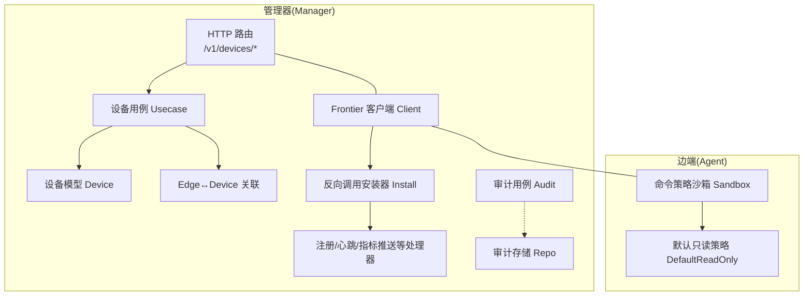
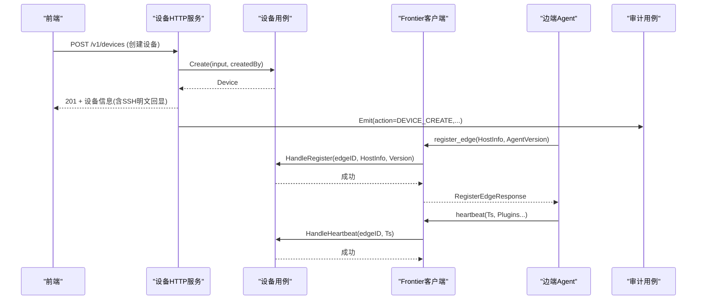
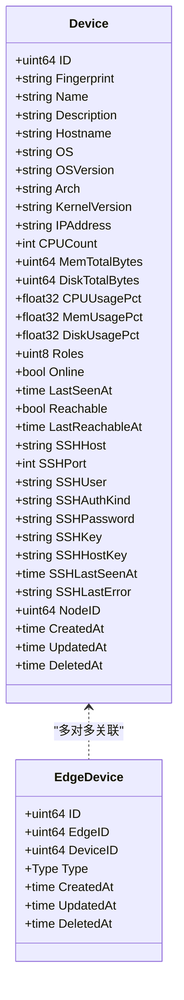
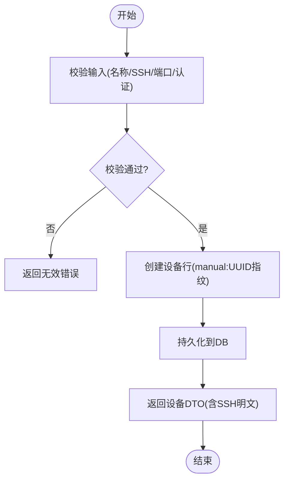
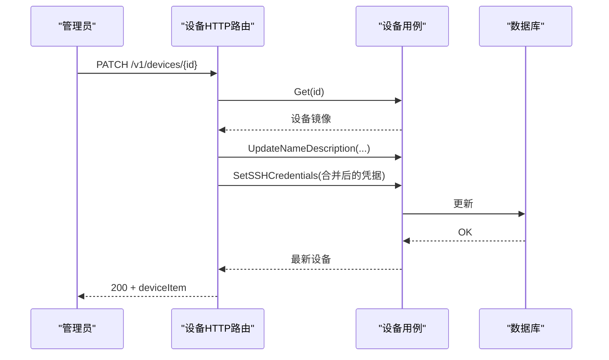
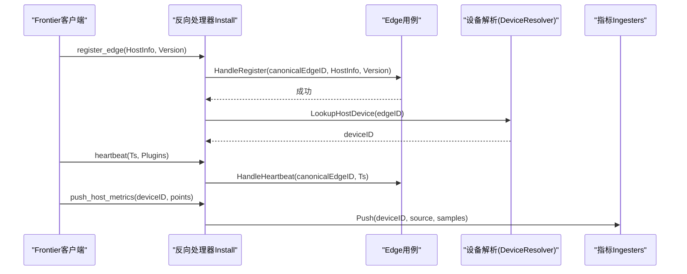
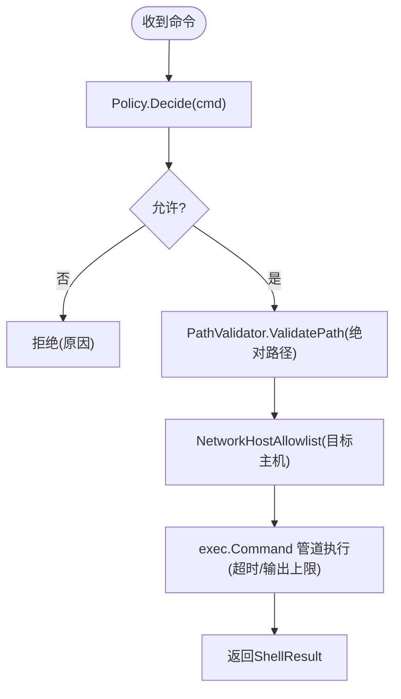
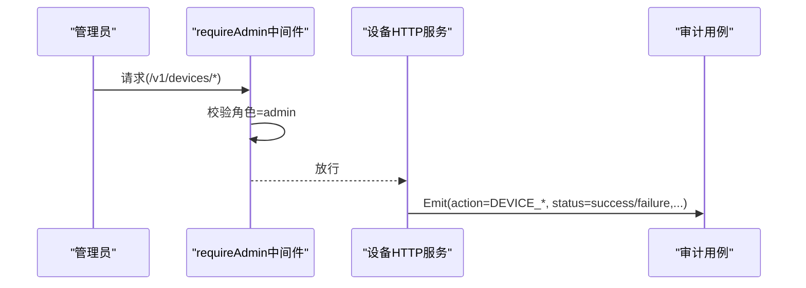
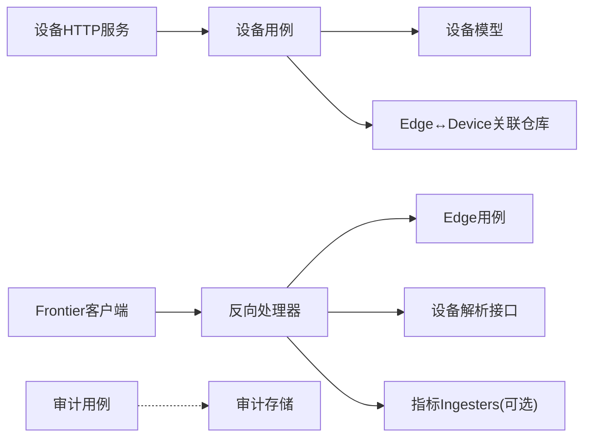

# 设备管理模块

<cite>
**本文引用的文件**   
- [internal/manager/model/device/model.go](file://internal/manager/model/device/model.go)
- [internal/manager/biz/device/usecase.go](file://internal/manager/biz/device/usecase.go)
- [internal/manager/server/device/http.go](file://internal/manager/server/device/http.go)
- [cmd/ongrid/main.go](file://cmd/ongrid/main.go)
- [internal/manager/service/frontierbound/client.go](file://internal/manager/service/frontierbound/client.go)
- [internal/manager/service/frontierbound/handlers.go](file://internal/manager/service/frontierbound/handlers.go)
- [internal/edgeagent/cmdpolicy/sandbox.go](file://internal/edgeagent/cmdpolicy/sandbox.go)
- [internal/edgeagent/cmdpolicy/policy.go](file://internal/edgeagent/cmdpolicy/policy.go)
- [internal/manager/biz/audit/usecase.go](file://internal/manager/biz/audit/usecase.go)
- [web/src/api/devices.ts](file://web/src/api/devices.ts)
</cite>

## 目录
1. [简介](#简介)
2. [项目结构](#项目结构)
3. [核心组件](#核心组件)
4. [架构总览](#架构总览)
5. [详细组件分析](#详细组件分析)
6. [依赖关系分析](#依赖关系分析)
7. [性能与容量规划](#性能与容量规划)
8. [故障排查指南](#故障排查指南)
9. [结论](#结论)
10. [附录：API 参考](#附录api-参考)

## 简介
本章节面向运维人员，系统性阐述设备管理模块的设计与实现，覆盖设备全生命周期（注册、在线状态、可达性、SSH 凭据、拓扑关联）、设备发现与心跳机制、Frontier 消息中间件的双向通信、权限控制与安全沙箱、审计日志，以及设备管理 API 的完整参考。文档同时提供架构图、时序图与流程图，帮助快速定位问题并进行性能调优。

## 项目结构
设备管理模块由“模型层 + 业务用例层 + HTTP 服务层”构成，并通过 Frontier 客户端与边端 agent 建立双向通信；安全能力由边端命令策略沙箱提供；审计日志通过独立用例落库。

图示来源
- [internal/manager/server/device/http.go:61-75](file://internal/manager/server/device/http.go#L61-L75)
- [internal/manager/biz/device/usecase.go:126-146](file://internal/manager/biz/device/usecase.go#L126-L146)
- [internal/manager/model/device/model.go:34-128](file://internal/manager/model/device/model.go#L34-L128)
- [internal/manager/service/frontierbound/client.go:61-89](file://internal/manager/service/frontierbound/client.go#L61-L89)
- [internal/manager/service/frontierbound/handlers.go:86-110](file://internal/manager/service/frontierbound/handlers.go#L86-L110)
- [internal/edgeagent/cmdpolicy/sandbox.go:52-59](file://internal/edgeagent/cmdpolicy/sandbox.go#L52-L59)
- [internal/edgeagent/cmdpolicy/policy.go:33-49](file://internal/edgeagent/cmdpolicy/policy.go#L33-L49)
- [internal/manager/biz/audit/usecase.go:58-70](file://internal/manager/biz/audit/usecase.go#L58-L70)

章节来源
- [internal/manager/server/device/http.go:61-75](file://internal/manager/server/device/http.go#L61-L75)
- [internal/manager/biz/device/usecase.go:126-146](file://internal/manager/biz/device/usecase.go#L126-L146)
- [internal/manager/model/device/model.go:34-128](file://internal/manager/model/device/model.go#L34-L128)
- [internal/manager/service/frontierbound/client.go:61-89](file://internal/manager/service/frontierbound/client.go#L61-L89)
- [internal/manager/service/frontierbound/handlers.go:86-110](file://internal/manager/service/frontierbound/handlers.go#L86-L110)
- [internal/edgeagent/cmdpolicy/sandbox.go:52-59](file://internal/edgeagent/cmdpolicy/sandbox.go#L52-L59)
- [internal/edgeagent/cmdpolicy/policy.go:33-49](file://internal/edgeagent/cmdpolicy/policy.go#L33-L49)
- [internal/manager/biz/audit/usecase.go:58-70](file://internal/manager/biz/audit/usecase.go#L58-L70)

## 核心组件
- 设备模型与拓扑关系
  - 设备实体承载主机元数据（名称、描述、主机名、OS、架构、内核、IP、CPU/内存/磁盘容量与实时使用率、角色位图、在线与最后在线时间、可达性与最后可达时间、SSH 凭据、拓扑节点 ID）。
  - Edge↔Device 多对多关联表记录“host”或“discovered”两类关系，支撑单边端运行在宿主机上并扫描局域网设备的扩展场景。
- 设备用例（Usecase）
  - 提供创建、查询、更新（名称/描述/主机名）、角色设置、软删除/恢复、SSH 凭据读写、可达性回填、存在性修复（ReconcilePresence）等能力。
  - SSH 凭据以明文回显（内部运维平台权衡），并提供按字段清理能力。
- HTTP 设备服务
  - 暴露 /v1/devices 系列 REST 接口，支持分页、过滤（角色、在线、包含已删除）、批量操作（如 restore）。
  - 管理员鉴权中间件限制写操作。
- Frontier 双向通信
  - Manager 侧通过 Frontier 客户端连接 broker，注册反向调用处理器（注册、心跳、指标推送、插件配置拉取、WebShell 输出/退出等），并维护 edge_id ↔ transport_id 映射。
  - 支持禁用模式（ErrDisabled），便于 e2e 与降级启动。
- 命令策略沙箱（边端）
  - 基于白名单二进制、参数匹配、路径校验与网络目标白名单，执行只读 shell 命令；提供 ExecRaw 作为受控写入逃逸口（需管理员授权）。
- 审计日志
  - 统一 Emit 接口，失败不阻塞业务；提供列表查询与保留清理任务。

章节来源
- [internal/manager/model/device/model.go:34-128](file://internal/manager/model/device/model.go#L34-L128)
- [internal/manager/model/device/model.go:260-278](file://internal/manager/model/device/model.go#L260-L278)
- [internal/manager/biz/device/usecase.go:54-124](file://internal/manager/biz/device/usecase.go#L54-L124)
- [internal/manager/biz/device/usecase.go:294-341](file://internal/manager/biz/device/usecase.go#L294-L341)
- [internal/manager/server/device/http.go:61-75](file://internal/manager/server/device/http.go#L61-L75)
- [internal/manager/service/frontierbound/client.go:128-145](file://internal/manager/service/frontierbound/client.go#L128-145)
- [internal/manager/service/frontierbound/handlers.go:189-224](file://internal/manager/service/frontierbound/handlers.go#L189-L224)
- [internal/edgeagent/cmdpolicy/sandbox.go:140-188](file://internal/edgeagent/cmdpolicy/sandbox.go#L140-188)
- [internal/manager/biz/audit/usecase.go:74-116](file://internal/manager/biz/audit/usecase.go#L74-L116)

## 架构总览
设备管理采用分层设计：HTTP 路由 → 业务用例 → 数据模型/仓库；通过 Frontier 与边端建立长连接，完成设备注册、心跳、指标上报与远程命令执行；边端命令执行受沙箱策略约束；审计日志贯穿关键操作。

图示来源
- [internal/manager/server/device/http.go:293-338](file://internal/manager/server/device/http.go#L293-L338)
- [internal/manager/biz/device/usecase.go:54-124](file://internal/manager/biz/device/usecase.go#L54-L124)
- [internal/manager/service/frontierbound/handlers.go:189-224](file://internal/manager/service/frontierbound/handlers.go#L189-L224)
- [internal/manager/service/frontierbound/handlers.go:226-284](file://internal/manager/service/frontierbound/handlers.go#L226-L284)
- [internal/manager/biz/audit/usecase.go:74-116](file://internal/manager/biz/audit/usecase.go#L74-L116)

## 详细组件分析

### 设备模型与拓扑关系
- 设备实体字段涵盖主机事实、在线/可达状态、SSH 凭据、拓扑节点 ID 及软删除标记。
- 角色位图支持 server/storage/network/database 四类组合，提供编码/解码与合法性校验。
- Edge↔Device 关联表区分 host/discovered 类型，为未来“边端扫描发现设备”预留扩展点。

图示来源
- [internal/manager/model/device/model.go:34-128](file://internal/manager/model/device/model.go#L34-L128)
- [internal/manager/model/device/model.go:260-278](file://internal/manager/model/device/model.go#L260-L278)

章节来源
- [internal/manager/model/device/model.go:34-128](file://internal/manager/model/device/model.go#L34-L128)
- [internal/manager/model/device/model.go:137-158](file://internal/manager/model/device/model.go#L137-L158)
- [internal/manager/model/device/model.go:260-278](file://internal/manager/model/device/model.go#L260-L278)

### 设备用例（Usecase）
- 创建设备：校验必填项（名称、SSH 主机/用户、认证方式与对应凭据），生成唯一指纹（manual:UUID），持久化后返回。
- 更新展示字段：仅更新传入的非空指针字段，避免误清空。
- 角色更新：校验角色名集合，编码为位图并落库。
- 可达性回填：定时任务拉取有 SSH 主机的设备，执行 ping，将结果写回 devices.reachable 与 last_reachable_at。
- SSH 凭据：支持 Set/Clear/Get，明文回显用于内部运维体验。
- 存在性修复：启动时与周期任务修正孤儿设备在线状态。

图示来源
- [internal/manager/biz/device/usecase.go:54-124](file://internal/manager/biz/device/usecase.go#L54-L124)

章节来源
- [internal/manager/biz/device/usecase.go:54-124](file://internal/manager/biz/device/usecase.go#L54-L124)
- [internal/manager/biz/device/usecase.go:187-211](file://internal/manager/biz/device/usecase.go#L187-L211)
- [internal/manager/biz/device/usecase.go:230-292](file://internal/manager/biz/device/usecase.go#L230-L292)
- [internal/manager/biz/device/usecase.go:294-341](file://internal/manager/biz/device/usecase.go#L294-L341)
- [internal/manager/biz/device/usecase.go:147-164](file://internal/manager/biz/device/usecase.go#L147-L164)

### HTTP 设备服务
- 路由注册：POST/GET/PATCH/DELETE /v1/devices 及其子资源（roles、ssh-credentials、restore、edges）。
- 管理员鉴权：requireAdmin 中间件基于租户上下文角色判断。
- 更新合并语义：PATCH 请求中未提供的字段保持原值，SSH 块采用“从当前行镜像再合并”的策略，避免 nil 覆盖。
- 响应 DTO：deviceItem 包含主机事实、在线/可达、SSH 明文回显、拓扑节点 ID 等。

图示来源
- [internal/manager/server/device/http.go:61-75](file://internal/manager/server/device/http.go#L61-L75)
- [internal/manager/server/device/http.go:370-456](file://internal/manager/server/device/http.go#L370-L456)
- [internal/manager/server/device/http.go:95-139](file://internal/manager/server/device/http.go#L95-L139)

章节来源
- [internal/manager/server/device/http.go:61-75](file://internal/manager/server/device/http.go#L61-L75)
- [internal/manager/server/device/http.go:370-456](file://internal/manager/server/device/http.go#L370-L456)
- [internal/manager/server/device/http.go:95-139](file://internal/manager/server/device/http.go#L95-L139)

### Frontier 双向通信与设备发现
- 连接与注册：Manager 启动时根据配置连接 Frontier broker，注册 GetEdgeID、EdgeOnline/Offline、register_edge、heartbeat、push_host_metrics、push_prom_samples、get_plugin_configs、shell_output/shell_exit 等处理器。
- 设备发现：register_edge 处理器接收边端上报的 HostInfo 与 AgentVersion，持久化并建立 edge→device 的 host 关联；随后心跳持续刷新 last_seen_at。
- 指标与样本：push_host_metrics 与 push_prom_samples 将指标推入 ingester，并在无法解析 device_id 时静默丢弃以避免污染标签。
- 流式通道：OpenStream 提供双向字节流，供 WebSSH 等场景复用。

图示来源
- [internal/manager/service/frontierbound/handlers.go:189-224](file://internal/manager/service/frontierbound/handlers.go#L189-L224)
- [internal/manager/service/frontierbound/handlers.go:226-284](file://internal/manager/service/frontierbound/handlers.go#L226-L284)
- [internal/manager/service/frontierbound/handlers.go:286-329](file://internal/manager/service/frontierbound/handlers.go#L286-L329)
- [internal/manager/service/frontierbound/handlers.go:331-388](file://internal/manager/service/frontierbound/handlers.go#L331-L388)
- [internal/manager/service/frontierbound/handlers.go:475-497](file://internal/manager/service/frontierbound/handlers.go#L475-L497)

章节来源
- [internal/manager/service/frontierbound/client.go:61-89](file://internal/manager/service/frontierbound/client.go#L61-L89)
- [internal/manager/service/frontierbound/handlers.go:86-110](file://internal/manager/service/frontierbound/handlers.go#L86-L110)
- [internal/manager/service/frontierbound/handlers.go:189-224](file://internal/manager/service/frontierbound/handlers.go#L189-L224)
- [internal/manager/service/frontierbound/handlers.go:226-284](file://internal/manager/service/frontierbound/handlers.go#L226-L284)
- [internal/manager/service/frontierbound/handlers.go:286-329](file://internal/manager/service/frontierbound/handlers.go#L286-L329)
- [internal/manager/service/frontierbound/handlers.go:331-388](file://internal/manager/service/frontierbound/handlers.go#L331-L388)
- [internal/manager/service/frontierbound/handlers.go:475-497](file://internal/manager/service/frontierbound/handlers.go#L475-L497)

### 命令策略沙箱与安全
- 默认只读策略：内置大量只读系统/网络工具，严格拒绝危险参数与写操作；支持 YAML 覆盖扩展。
- 执行流程：Decide 先进行二进制白名单与参数匹配，Sandbox 再叠加路径校验与网络目标白名单检查，最终通过 exec.Command 管道执行，带超时与输出上限。
- 受控写入：ExecRaw 绕过策略检查，仅在管理员授权下启用，仍受超时与输出上限保护。

图示来源
- [internal/edgeagent/cmdpolicy/policy.go:33-49](file://internal/edgeagent/cmdpolicy/policy.go#L33-L49)
- [internal/edgeagent/cmdpolicy/sandbox.go:78-132](file://internal/edgeagent/cmdpolicy/sandbox.go#L78-L132)
- [internal/edgeagent/cmdpolicy/sandbox.go:140-188](file://internal/edgeagent/cmdpolicy/sandbox.go#L140-188)
- [internal/edgeagent/cmdpolicy/sandbox.go:200-253](file://internal/edgeagent/cmdpolicy/sandbox.go#L200-L253)

章节来源
- [internal/edgeagent/cmdpolicy/policy.go:33-49](file://internal/edgeagent/cmdpolicy/policy.go#L33-L49)
- [internal/edgeagent/cmdpolicy/sandbox.go:78-132](file://internal/edgeagent/cmdpolicy/sandbox.go#L78-L132)
- [internal/edgeagent/cmdpolicy/sandbox.go:140-188](file://internal/edgeagent/cmdpolicy/sandbox.go#L140-188)
- [internal/edgeagent/cmdpolicy/sandbox.go:200-253](file://internal/edgeagent/cmdpolicy/sandbox.go#L200-L253)

### 权限控制与审计日志
- 权限控制：设备写操作（创建、更新、删除、恢复、SSH 凭据修改）均受 requireAdmin 中间件保护，基于租户上下文中的角色判定。
- 审计日志：关键操作通过审计用例 Emit 记录，失败不阻塞业务；提供列表查询与保留清理任务。

图示来源
- [internal/manager/server/device/http.go:77-91](file://internal/manager/server/device/http.go#L77-L91)
- [internal/manager/biz/audit/usecase.go:74-116](file://internal/manager/biz/audit/usecase.go#L74-L116)

章节来源
- [internal/manager/server/device/http.go:77-91](file://internal/manager/server/device/http.go#L77-L91)
- [internal/manager/biz/audit/usecase.go:74-116](file://internal/manager/biz/audit/usecase.go#L74-L116)

## 依赖关系分析
- 耦合与内聚
  - HTTP 层仅依赖用例接口，保持薄适配；用例聚合设备仓库与 Edge 关联仓库，内聚业务规则。
  - Frontier 客户端封装与 broker 的交互细节，向上暴露 Call/Register/OpenStream 等简洁接口。
- 外部依赖
  - Frontier broker（geminio/dataplane）用于双向通信。
  - Prometheus 写入器（可选）用于开放样本推送。
  - 审计存储用于事件持久化。
- 潜在循环依赖
  - frontierbound 通过接口解耦 biz 层，避免直接导入；设备用例与边缘用例通过接口协作，无循环。

图示来源
- [internal/manager/server/device/http.go:61-75](file://internal/manager/server/device/http.go#L61-L75)
- [internal/manager/biz/device/usecase.go:126-146](file://internal/manager/biz/device/usecase.go#L126-L146)
- [internal/manager/service/frontierbound/handlers.go:86-110](file://internal/manager/service/frontierbound/handlers.go#L86-L110)
- [internal/manager/biz/audit/usecase.go:58-70](file://internal/manager/biz/audit/usecase.go#L58-L70)

章节来源
- [internal/manager/server/device/http.go:61-75](file://internal/manager/server/device/http.go#L61-L75)
- [internal/manager/biz/device/usecase.go:126-146](file://internal/manager/biz/device/usecase.go#L126-L146)
- [internal/manager/service/frontierbound/handlers.go:86-110](file://internal/manager/service/frontierbound/handlers.go#L86-L110)
- [internal/manager/biz/audit/usecase.go:58-70](file://internal/manager/biz/audit/usecase.go#L58-L70)

## 性能与容量规划
- 可达性检测
  - 每 5 分钟对具备 ssh_host 的设备执行一次 ping，结果写回 devices.reachable 与 last_reachable_at；建议合理设置并发与超时，避免对网络造成压力。
- 指标推送
  - push_host_metrics 与 push_prom_samples 在无法解析 device_id 时静默丢弃，避免产生幽灵标签；Prom 写入器可水平扩展。
- 沙箱执行
  - 命令执行带超时与输出上限，防止长时间占用与内存膨胀；YAML 覆盖可调整 cap 与 timeout。
- 前端轮询
  - 前端设备列表与监控面板按需轮询，建议结合增量与缓存减少带宽消耗。

[本节为通用指导，无需代码引用]

## 故障排查指南
- 设备未上线
  - 检查 Frontier 连接是否启用（若禁用则所有 edge-tunnel 功能报错）；确认 register_edge 与 heartbeat 处理器是否安装成功。
  - 查看 Edge 在线/离线回调日志，确认 canonicalEdgeID 绑定是否正确。
- 指标缺失或标签异常
  - 当 device_id 无法解析时，push_* 会丢弃批次；确认 register_edge 是否成功建立 host 关联。
- SSH 访问失败
  - 检查设备 SSH 凭据是否配置正确；查看 TouchSSHSuccess/TouchSSHError 的记录。
- 命令被拒绝
  - 检查沙箱策略（默认只读）与 YAML 覆盖；确认网络目标是否在 allowlist 中。
- 审计日志缺失
  - 审计写入失败不会阻塞业务，但会告警；检查审计存储可用性与保留策略。

章节来源
- [cmd/ongrid/main.go:865-889](file://cmd/ongrid/main.go#L865-889)
- [internal/manager/service/frontierbound/handlers.go:189-224](file://internal/manager/service/frontierbound/handlers.go#L189-L224)
- [internal/manager/service/frontierbound/handlers.go:286-329](file://internal/manager/service/frontierbound/handlers.go#L286-L329)
- [internal/manager/biz/device/usecase.go:482-523](file://internal/manager/biz/device/usecase.go#L482-L523)
- [internal/edgeagent/cmdpolicy/sandbox.go:78-132](file://internal/edgeagent/cmdpolicy/sandbox.go#L78-L132)
- [internal/manager/biz/audit/usecase.go:74-116](file://internal/manager/biz/audit/usecase.go#L74-L116)

## 结论
设备管理模块通过清晰的分层设计与严格的策略控制，实现了设备全生命周期的可靠管理。Frontier 双向通信保障了边端与云端的稳定联动；沙箱策略确保命令执行的安全可控；审计日志提供合规与可追溯能力。结合本文档的 API 参考与运维实践，可有效提升部署效率与排障速度。

[本节为总结，无需代码引用]

## 附录：API 参考
以下列出设备管理相关 HTTP 接口要点（方法、路径、鉴权、主要请求/响应字段与错误码）。具体 JSON 结构与字段定义请参考后端 DTO 与前端类型对齐说明。

- 设备清单
  - GET /v1/devices
    - 鉴权：任意已认证用户
    - 查询参数：hostname、name、roles（逗号分隔，支持 unknown）、online（true/false）、limit、offset、include_deleted（true/1/yes）
    - 响应：{ items: deviceItem[], total: number }
- 设备详情
  - GET /v1/devices/{id}
    - 鉴权：任意已认证用户
    - 响应：deviceItem
- 创建设备
  - POST /v1/devices
    - 鉴权：admin
    - 请求体：createReq（name、description、hostname、ssh_host、ssh_port、ssh_user、ssh_auth_kind、ssh_password、ssh_key）
    - 响应：createResp（含 SSH 明文回显）
- 更新设备
  - PATCH /v1/devices/{id}
    - 鉴权：admin
    - 请求体：updateReq（name/description/hostname 指针字段；SSH 块各字段指针，nil 表示不改，“”表示清空密码/私钥/认证方式）
    - 响应：200 + deviceItem
- 更新角色
  - PATCH /v1/devices/{id}/roles
    - 鉴权：admin
    - 请求体：{ roles: string[] }（server/storage/network/database/unknown）
    - 响应：204
- 删除设备
  - DELETE /v1/devices/{id}?hard=true|false
    - 鉴权：admin
    - 响应：204
- 恢复设备
  - POST /v1/devices/{id}/restore
    - 鉴权：admin
    - 响应：200 + deviceItem
- 设备关联边端
  - GET /v1/devices/{id}/edges
    - 鉴权：任意已认证用户
    - 响应：{ items: [{ edge_id, device_id, type, created_at }] }
- SSH 凭据
  - PUT /v1/devices/{id}/ssh-credentials
    - 鉴权：admin
    - 请求体：SSHCredentials（host/port/user/auth_kind/password/key）
    - 响应：204
  - GET /v1/devices/{id}/ssh-info
    - 鉴权：任意已认证用户
    - 响应：SSHCredentialsWire（含 has_password/has_key 派生布尔）
  - DELETE /v1/devices/{id}/ssh-credentials
    - 鉴权：admin
    - 响应：204

错误码
- not-found：资源不存在
- unauthorized：未认证
- forbidden：无权限
- invalid：参数非法
- not-wired-yet：依赖未注入
- internal：内部错误

章节来源
- [internal/manager/server/device/http.go:61-75](file://internal/manager/server/device/http.go#L61-L75)
- [internal/manager/server/device/http.go:95-139](file://internal/manager/server/device/http.go#L95-L139)
- [internal/manager/server/device/http.go:146-183](file://internal/manager/server/device/http.go#L146-L183)
- [internal/manager/server/device/http.go:215-284](file://internal/manager/server/device/http.go#L215-L284)
- [internal/manager/server/device/http.go:293-338](file://internal/manager/server/device/http.go#L293-L338)
- [internal/manager/server/device/http.go:370-456](file://internal/manager/server/device/http.go#L370-L456)
- [internal/manager/server/device/http.go:458-474](file://internal/manager/server/device/http.go#L458-L474)
- [internal/manager/server/device/http.go:476-490](file://internal/manager/server/device/http.go#L476-L490)
- [internal/manager/server/device/http.go:496-513](file://internal/manager/server/device/http.go#L496-L513)
- [internal/manager/server/device/http.go:515-545](file://internal/manager/server/device/http.go#L515-L545)
- [internal/manager/server/device/http.go:624-654](file://internal/manager/server/device/http.go#L624-L654)
- [web/src/api/devices.ts:34-54](file://web/src/api/devices.ts#L34-L54)