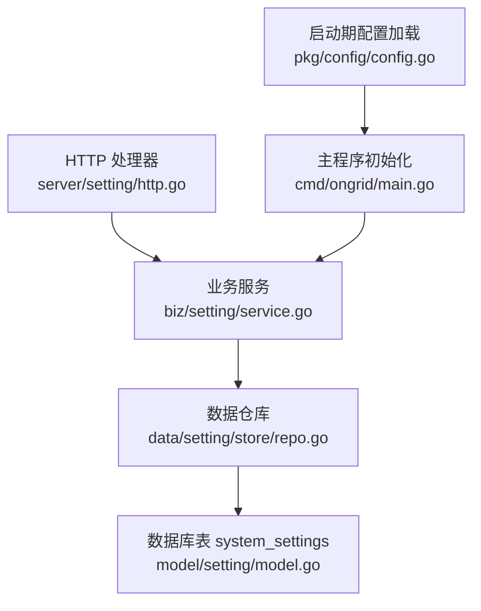
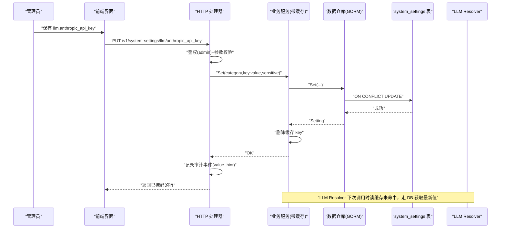
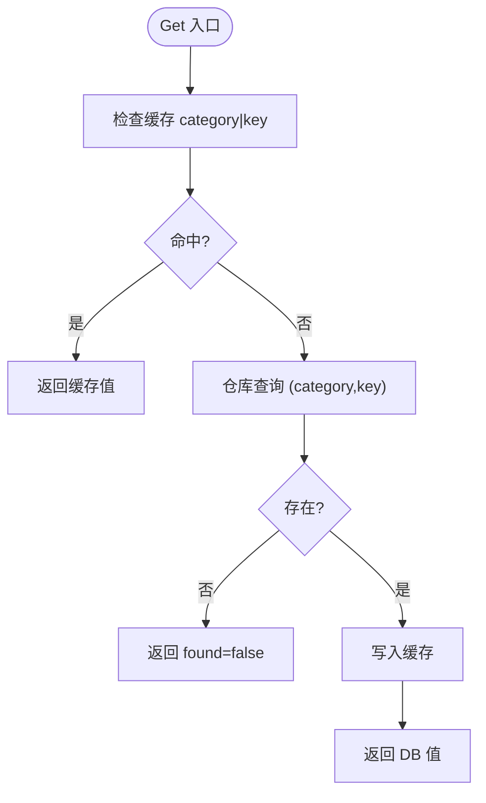
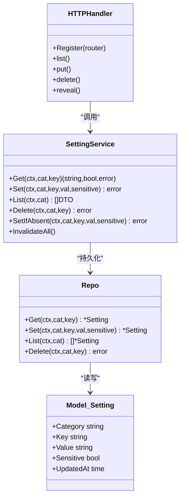

# 配置管理系统

<cite>
**本文引用的文件**   
- [internal/manager/biz/setting/service.go](file://internal/manager/biz/setting/service.go)
- [internal/manager/data/setting/store/repo.go](file://internal/manager/data/setting/store/repo.go)
- [internal/manager/model/setting/model.go](file://internal/manager/model/setting/model.go)
- [internal/manager/server/setting/http.go](file://internal/manager/server/setting/http.go)
- [internal/pkg/config/config.go](file://internal/pkg/config/config.go)
- [cmd/ongrid/main.go](file://cmd/ongrid/main.go)
</cite>

## 目录
1. [简介](#简介)
2. [项目结构](#项目结构)
3. [核心组件](#核心组件)
4. [架构总览](#架构总览)
5. [详细组件分析](#详细组件分析)
6. [依赖关系分析](#依赖关系分析)
7. [性能与缓存策略](#性能与缓存策略)
8. [安全与加密存储](#安全与加密存储)
9. [版本控制与回滚机制](#版本控制与回滚机制)
10. [配置验证与默认值管理](#配置验证与默认值管理)
11. [API 接口参考](#api-接口参考)
12. [最佳实践](#最佳实践)
13. [故障排查指南](#故障排查指南)
14. [结论](#结论)

## 简介
本文件面向管理员与开发者，系统化阐述运行时的“系统设置”配置管理能力。重点覆盖：
- 运行时热更新：通过数据库持久化 + 进程内缓存失效，实现无需重启的即时生效（如 LLM 凭据、模型、BaseURL）。
- 分类管理：按领域划分（LLM、Prometheus、Grafana、Loki、Tempo、WebSearch、Agent 等），提供统一的键空间与常量定义。
- 安全管理：敏感字段自动识别与列表脱敏；可选明文查看接口；审计事件记录。
- 版本与回滚：基于数据库行级变更时间戳与审计日志，支持差异对比与一键恢复。
- 验证与默认值：环境变量启动时注入默认值，结合业务层校验与降级策略。
- API 参考与最佳实践：列出 REST 端点、请求/响应约定、批量更新与审计追踪建议。

## 项目结构
配置管理由四层组成：HTTP 处理器 → 业务服务（含缓存）→ 数据仓库（GORM）→ 模型定义。同时，启动期从环境变量加载默认配置并写入系统设置表，供运行时读取。

图示来源
- [internal/manager/server/setting/http.go:1-281](file://internal/manager/server/setting/http.go#L1-L281)
- [internal/manager/biz/setting/service.go:1-197](file://internal/manager/biz/setting/service.go#L1-L197)
- [internal/manager/data/setting/store/repo.go:1-102](file://internal/manager/data/setting/store/repo.go#L1-L102)
- [internal/manager/model/setting/model.go:1-229](file://internal/manager/model/setting/model.go#L1-L229)
- [internal/pkg/config/config.go:1-592](file://internal/pkg/config/config.go#L1-L592)
- [cmd/ongrid/main.go:130-139](file://cmd/ongrid/main.go#L130-L139)

章节来源
- [internal/manager/server/setting/http.go:1-281](file://internal/manager/server/setting/http.go#L1-L281)
- [internal/manager/biz/setting/service.go:1-197](file://internal/manager/biz/setting/service.go#L1-L197)
- [internal/manager/data/setting/store/repo.go:1-102](file://internal/manager/data/setting/store/repo.go#L1-L102)
- [internal/manager/model/setting/model.go:1-229](file://internal/manager/model/setting/model.go#L1-L229)
- [internal/pkg/config/config.go:1-592](file://internal/pkg/config/config.go#L1-L592)
- [cmd/ongrid/main.go:130-139](file://cmd/ongrid/main.go#L130-L139)

## 核心组件
- HTTP 处理器：暴露 /v1/system-settings 系列端点，负责鉴权、参数校验、审计事件注入与响应封装。
- 业务服务：维护进程内缓存（category|key → value），提供 Get/Set/List/Delete/SetIfAbsent 等方法，并在写操作后失效对应缓存项。
- 数据仓库：基于 GORM 对 system_settings 表进行 CRUD，使用 ON CONFLICT 保证幂等 upsert。
- 模型定义：集中声明所有分类与键名常量（llm、prom、grafana、loki、tempo、websearch、agent 等），以及敏感字段的命名约定。
- 启动期配置：从环境变量加载默认值，首次启动时以 SetIfAbsent 方式填充系统设置表，避免覆盖管理员已有编辑。

章节来源
- [internal/manager/server/setting/http.go:1-281](file://internal/manager/server/setting/http.go#L1-L281)
- [internal/manager/biz/setting/service.go:1-197](file://internal/manager/biz/setting/service.go#L1-L197)
- [internal/manager/data/setting/store/repo.go:1-102](file://internal/manager/data/setting/store/repo.go#L1-L102)
- [internal/manager/model/setting/model.go:1-229](file://internal/manager/model/setting/model.go#L1-L229)
- [internal/pkg/config/config.go:1-592](file://internal/pkg/config/config.go#L1-L592)
- [cmd/ongrid/main.go:532-721](file://cmd/ongrid/main.go#L532-L721)

## 架构总览
下图展示一次“管理员在 UI 修改 LLM 配置”的端到端流程，包括鉴权、缓存失效、审计记录与下游消费者（LLM Resolver）在下次调用时读到新值。

图示来源
- [internal/manager/server/setting/http.go:81-137](file://internal/manager/server/setting/http.go#L81-L137)
- [internal/manager/biz/setting/service.go:106-124](file://internal/manager/biz/setting/service.go#L106-L124)
- [internal/manager/data/setting/store/repo.go:43-69](file://internal/manager/data/setting/store/repo.go#L43-L69)
- [cmd/ongrid/main.go:532-540](file://cmd/ongrid/main.go#L532-L540)

## 详细组件分析

### 组件一：HTTP 处理器（/v1/system-settings）
- 路由
  - GET /v1/system-settings?category=... 列出某分类下的配置项（敏感值脱敏）
  - PUT /v1/system-settings/{category}/{key} 新增或更新配置项
  - DELETE /v1/system-settings/{category}/{key} 删除配置项
  - GET /v1/system-settings/{category}/{key}/reveal 仅管理员可获取明文值
- 鉴权与权限
  - 列表：任意认证用户可读
  - 写/删/揭示：仅 admin 角色
- 敏感字段处理
  - 写入时若未显式传入 sensitive，则根据 key 后缀自动判定为敏感（*_api_key/_secret/_token/_password）
  - 列表返回时对敏感值进行掩码（保留首尾各4位，长度≤8则全掩码）
- 审计
  - 每次更新/删除均生成审计事件，value 仅记录前缀提示，不存完整密钥

章节来源
- [internal/manager/server/setting/http.go:45-50](file://internal/manager/server/setting/http.go#L45-L50)
- [internal/manager/server/setting/http.go:67-79](file://internal/manager/server/setting/http.go#L67-L79)
- [internal/manager/server/setting/http.go:81-137](file://internal/manager/server/setting/http.go#L81-L137)
- [internal/manager/server/setting/http.go:139-167](file://internal/manager/server/setting/http.go#L139-L167)
- [internal/manager/server/setting/http.go:169-190](file://internal/manager/server/setting/http.go#L169-L190)
- [internal/manager/server/setting/http.go:192-209](file://internal/manager/server/setting/http.go#L192-L209)

### 组件二：业务服务（进程内缓存 + 写失效）
- 缓存结构：map[category|key] = value，RWMutex 保护
- 读取路径：先查缓存，未命中再查仓库，并将结果回填缓存
- 写入路径：持久化成功后删除对应缓存项，确保后续读取刷新
- 辅助方法：SetIfAbsent 用于启动期种子数据，不会覆盖已有编辑；InvalidateAll 作为应急手段

图示来源
- [internal/manager/biz/setting/service.go:72-104](file://internal/manager/biz/setting/service.go#L72-L104)
- [internal/manager/biz/setting/service.go:106-124](file://internal/manager/biz/setting/service.go#L106-L124)
- [internal/manager/biz/setting/service.go:126-141](file://internal/manager/biz/setting/service.go#L126-L141)
- [internal/manager/biz/setting/service.go:173-180](file://internal/manager/biz/setting/service.go#L173-L180)

章节来源
- [internal/manager/biz/setting/service.go:47-68](file://internal/manager/biz/setting/service.go#L47-L68)
- [internal/manager/biz/setting/service.go:72-104](file://internal/manager/biz/setting/service.go#L72-L104)
- [internal/manager/biz/setting/service.go:106-124](file://internal/manager/biz/setting/service.go#L106-L124)
- [internal/manager/biz/setting/service.go:126-141](file://internal/manager/biz/setting/service.go#L126-L141)
- [internal/manager/biz/setting/service.go:143-160](file://internal/manager/biz/setting/service.go#L143-L160)
- [internal/manager/biz/setting/service.go:162-180](file://internal/manager/biz/setting/service.go#L162-L180)
- [internal/manager/biz/setting/service.go:182-196](file://internal/manager/biz/setting/service.go#L182-L196)

### 组件三：数据仓库（GORM 持久化）
- 唯一约束：(category, key) 唯一索引，保证幂等 upsert
- Upsert 语义：不存在则插入，存在则更新 value/sensitive/updated_at
- 错误映射：缺失行统一转为 ErrNotFound，便于上层区分“空值”和“不存在”

章节来源
- [internal/manager/data/setting/store/repo.go:24-41](file://internal/manager/data/setting/store/repo.go#L24-L41)
- [internal/manager/data/setting/store/repo.go:43-69](file://internal/manager/data/setting/store/repo.go#L43-L69)
- [internal/manager/data/setting/store/repo.go:71-83](file://internal/manager/data/setting/store/repo.go#L71-L83)
- [internal/manager/data/setting/store/repo.go:85-101](file://internal/manager/data/setting/store/repo.go#L85-L101)

### 组件四：模型与分类常量
- 表名：system_settings
- 分类常量：llm、prom、grafana、loki、tempo、websearch、agent
- LLM 键名：openai_*、anthropic_*、zhipu_*、gemini_*、deepseek_*、kimi_*、custom_* 及 default_provider
- 其他集成：Prom/Grafana/Loki/Tempo/WebSearch/Agent 相关键名与默认行为说明

章节来源
- [internal/manager/model/setting/model.go:14-33](file://internal/manager/model/setting/model.go#L14-L33)
- [internal/manager/model/setting/model.go:35-45](file://internal/manager/model/setting/model.go#L35-L45)
- [internal/manager/model/setting/model.go:47-54](file://internal/manager/model/setting/model.go#L47-L54)
- [internal/manager/model/setting/model.go:62-120](file://internal/manager/model/setting/model.go#L62-L120)
- [internal/manager/model/setting/model.go:134-145](file://internal/manager/model/setting/model.go#L134-L145)
- [internal/manager/model/setting/model.go:147-165](file://internal/manager/model/setting/model.go#L147-L165)
- [internal/manager/model/setting/model.go:167-178](file://internal/manager/model/setting/model.go#L167-L178)
- [internal/manager/model/setting/model.go:180-187](file://internal/manager/model/setting/model.go#L180-L187)
- [internal/manager/model/setting/model.go:189-219](file://internal/manager/model/setting/model.go#L189-L219)
- [internal/manager/model/setting/model.go:221-224](file://internal/manager/model/setting/model.go#L221-L224)
- [internal/manager/model/setting/model.go:226-229](file://internal/manager/model/setting/model.go#L226-L229)

### 组件五：启动期默认值注入（环境变量 → 系统设置）
- 启动期从环境变量加载默认配置（OpenAI、多 LLM 提供商、Prom、Grafana、通知渠道、Edge 等）
- 使用 SetIfAbsent 将 env 派生的值写入 system_settings，避免覆盖管理员已有编辑
- LLM 解析器通过 Resolver 读取系统设置，配合短 TTL 缓存，实现 Chat 调用链路的动态切换

章节来源
- [internal/pkg/config/config.go:366-486](file://internal/pkg/config/config.go#L366-L486)
- [cmd/ongrid/main.go:607-721](file://cmd/ongrid/main.go#L607-L721)
- [cmd/ongrid/main.go:532-540](file://cmd/ongrid/main.go#L532-L540)

## 依赖关系分析
- HTTP 处理器依赖业务服务接口，屏蔽了缓存与敏感处理的细节
- 业务服务依赖数据仓库接口，隔离了 GORM 与数据库方言差异
- 模型定义被仓库与服务共同引用，确保键名与分类一致性
- 启动期配置加载在主程序中完成，并通过业务服务的 SetIfAbsent 写入系统设置

图示来源
- [internal/manager/server/setting/http.go:45-50](file://internal/manager/server/setting/http.go#L45-L50)
- [internal/manager/biz/setting/service.go:28-68](file://internal/manager/biz/setting/service.go#L28-L68)
- [internal/manager/data/setting/store/repo.go:15-22](file://internal/manager/data/setting/store/repo.go#L15-L22)
- [internal/manager/model/setting/model.go:14-33](file://internal/manager/model/setting/model.go#L14-L33)

章节来源
- [internal/manager/server/setting/http.go:1-281](file://internal/manager/server/setting/http.go#L1-L281)
- [internal/manager/biz/setting/service.go:1-197](file://internal/manager/biz/setting/service.go#L1-L197)
- [internal/manager/data/setting/store/repo.go:1-102](file://internal/manager/data/setting/store/repo.go#L1-L102)
- [internal/manager/model/setting/model.go:1-229](file://internal/manager/model/setting/model.go#L1-L229)

## 性能与缓存策略
- 缓存粒度：按 category|key 精确失效，避免全量刷新
- 并发安全：单 RWMutex 保护 map，适合小表场景（预期 < 100 行）
- 读路径优化：缓存命中直接返回，减少 DB 往返
- 写路径影响：Set/Delete 后立即删除对应缓存项，保证强一致
- 应急能力：InvalidateAll 可用于人工干预后的快速清理

章节来源
- [internal/manager/biz/setting/service.go:47-68](file://internal/manager/biz/setting/service.go#L47-L68)
- [internal/manager/biz/setting/service.go:72-104](file://internal/manager/biz/setting/service.go#L72-L104)
- [internal/manager/biz/setting/service.go:106-124](file://internal/manager/biz/setting/service.go#L106-L124)
- [internal/manager/biz/setting/service.go:173-180](file://internal/manager/biz/setting/service.go#L173-L180)

## 安全与加密存储
- 敏感字段识别
  - 写入时若未显式指定 sensitive，则依据 key 后缀自动判定为敏感（*_api_key/_secret/_token/_password）
  - 列表返回时对敏感值进行掩码（首尾各4位，长度≤8则全掩码）
- 明文查看
  - 提供 /reveal 端点，仅管理员可访问，返回明文值（不返回整行，减小泄露面）
- 审计追踪
  - 更新/删除操作均记录审计事件，value 仅记录前缀提示，不存储完整密钥
- 加密存储现状与建议
  - 当前 system_settings 表 Value 字段为明文文本；建议在后续版本引入“密文存储 + KMS 密钥轮换”，并对敏感列启用透明加密或应用层加解密
  - 建议增加“最近使用时间/过期时间”字段，支撑密钥生命周期管理与告警

章节来源
- [internal/manager/server/setting/http.go:96-103](file://internal/manager/server/setting/http.go#L96-L103)
- [internal/manager/server/setting/http.go:108-122](file://internal/manager/server/setting/http.go#L108-L122)
- [internal/manager/server/setting/http.go:139-167](file://internal/manager/server/setting/http.go#L139-L167)
- [internal/manager/biz/setting/service.go:182-196](file://internal/manager/biz/setting/service.go#L182-L196)
- [internal/manager/model/setting/model.go:226-229](file://internal/manager/model/setting/model.go#L226-L229)

## 版本控制与回滚机制
- 现有能力
  - 每行包含 updated_at 时间戳，可作为变更时序依据
  - 审计事件记录关键动作与资源标识，便于事后追溯
- 推荐增强
  - 引入“配置快照”：在每次提交前生成 JSON 快照，记录 diff 与提交人/原因
  - 提供“一键恢复”：基于快照或历史行恢复到指定版本
  - 差异比较：对同一 key 的历史值进行 diff 输出，辅助变更评审

章节来源
- [internal/manager/model/setting/model.go:14-33](file://internal/manager/model/setting/model.go#L14-L33)
- [internal/manager/server/setting/http.go:116-122](file://internal/manager/server/setting/http.go#L116-L122)

## 配置验证与默认值管理
- 启动期默认值
  - 从环境变量加载默认配置（OpenAI、多 LLM 提供商、Prom、Grafana、通知渠道、Edge 等）
  - 使用 SetIfAbsent 写入系统设置，避免覆盖管理员已有编辑
- 运行时校验
  - 必填校验：category/key 为空时返回无效参数错误
  - 类型与范围：可在业务层扩展（例如布尔开关、数值区间、枚举白名单）
- 降级策略
  - 当系统设置缺失时，上游组件（如 LLM Resolver）可按环境默认值降级，保障可用性

章节来源
- [internal/pkg/config/config.go:366-486](file://internal/pkg/config/config.go#L366-L486)
- [internal/manager/biz/setting/service.go:79-82](file://internal/manager/biz/setting/service.go#L79-L82)
- [cmd/ongrid/main.go:532-540](file://cmd/ongrid/main.go#L532-L540)

## API 接口参考
- 列出配置项
  - 方法：GET
  - 路径：/v1/system-settings
  - 查询参数：category（可选）
  - 鉴权：任意认证用户
  - 响应：items[]（敏感值已掩码）、total
- 更新/新增配置项
  - 方法：PUT
  - 路径：/v1/system-settings/{category}/{key}
  - 请求体：{ value: string, sensitive?: boolean }
  - 鉴权：admin
  - 行为：sensitive 未传时按 key 后缀自动判定；返回该行的掩码 DTO
- 删除配置项
  - 方法：DELETE
  - 路径：/v1/system-settings/{category}/{key}
  - 鉴权：admin
  - 响应：204 No Content
- 明文查看
  - 方法：GET
  - 路径：/v1/system-settings/{category}/{key}/reveal
  - 鉴权：admin
  - 响应：{ value: string }

章节来源
- [internal/manager/server/setting/http.go:45-50](file://internal/manager/server/setting/http.go#L45-L50)
- [internal/manager/server/setting/http.go:67-79](file://internal/manager/server/setting/http.go#L67-L79)
- [internal/manager/server/setting/http.go:81-137](file://internal/manager/server/setting/http.go#L81-L137)
- [internal/manager/server/setting/http.go:139-167](file://internal/manager/server/setting/http.go#L139-L167)
- [internal/manager/server/setting/http.go:169-190](file://internal/manager/server/setting/http.go#L169-L190)

## 最佳实践
- 分类与命名
  - 遵循 model 中定义的分类与键名常量，保持跨模块一致性
- 敏感信息
  - 优先通过 UI 更新，避免在日志/监控中打印完整密钥
  - 定期轮换密钥，结合审计事件定位变更轨迹
- 批量更新
  - 通过循环调用 PUT 端点进行批量更新；注意幂等性与失败重试
- 变更审批
  - 结合审计事件与外部工单系统，形成“申请-审批-执行-复核”闭环
- 回滚预案
  - 变更前导出快照；变更后观察一段时间，必要时一键恢复

## 故障排查指南
- 现象：列表看不到明文值
  - 原因：敏感字段在列表接口会被掩码
  - 处理：使用 /reveal 端点（需 admin）查看明文
- 现象：修改后未立即生效
  - 原因：上游组件可能持有本地缓存
  - 处理：等待其缓存刷新周期（如 LLM Resolver 的短 TTL）；必要时重启对应组件
- 现象：写入报错 invalid-argument
  - 原因：category 或 key 为空
  - 处理：检查请求参数完整性
- 现象：权限不足 forbidden/unauthorized
  - 原因：非 admin 尝试写/删/揭示
  - 处理：提升角色或使用具备权限的账号
- 现象：首次启动缺少默认配置
  - 原因：环境变量未正确设置或未触发 SetIfAbsent
  - 处理：核对环境变量与启动日志，确认种子数据是否写入

章节来源
- [internal/manager/server/setting/http.go:67-79](file://internal/manager/server/setting/http.go#L67-L79)
- [internal/manager/server/setting/http.go:81-137](file://internal/manager/server/setting/http.go#L81-L137)
- [internal/manager/server/setting/http.go:139-167](file://internal/manager/server/setting/http.go#L139-L167)
- [internal/manager/biz/setting/service.go:79-82](file://internal/manager/biz/setting/service.go#L79-L82)
- [cmd/ongrid/main.go:607-721](file://cmd/ongrid/main.go#L607-L721)

## 结论
本配置管理系统以“数据库持久化 + 进程内缓存 + 严格的安全与审计”为核心，实现了无需重启的热更新能力。通过清晰的分类与键名规范、完善的敏感字段处理与审计追踪，既满足日常运维的便捷性，也为后续引入更高级的加密存储、版本快照与合规审计打下基础。建议在生产环境中逐步落地密钥轮换、快照与回滚能力，并结合外部审计平台完善变更治理闭环。