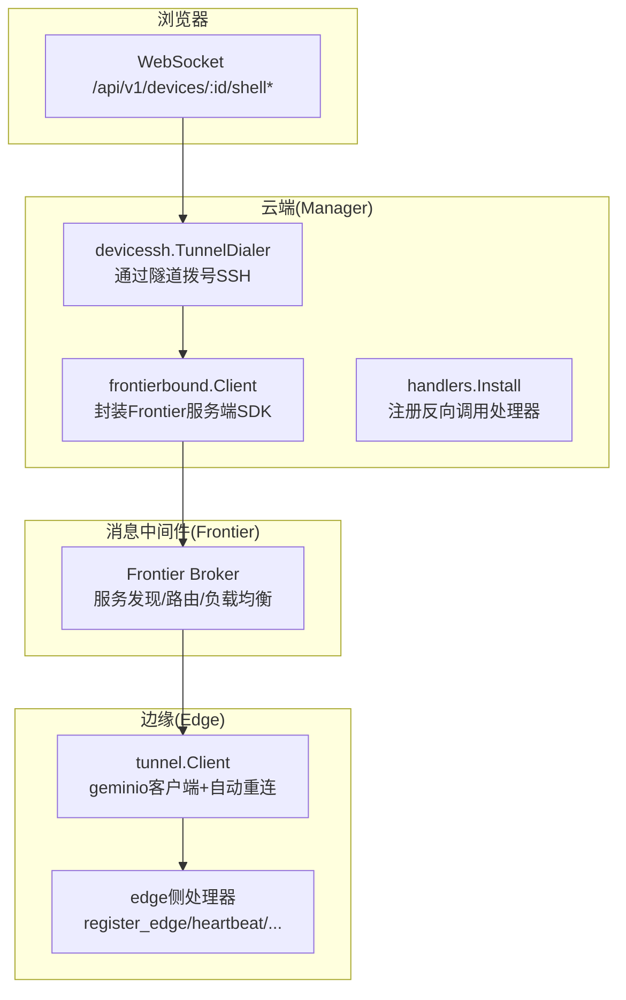
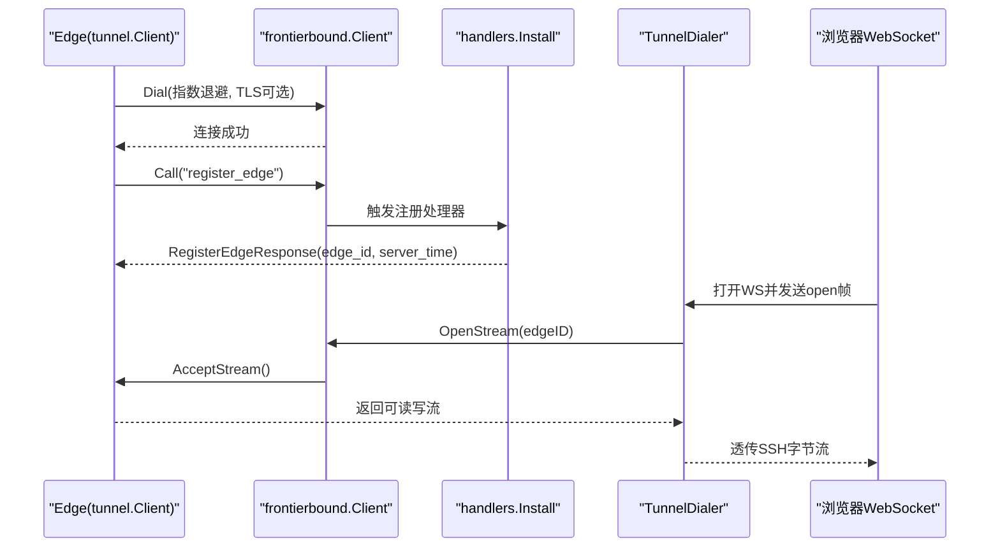
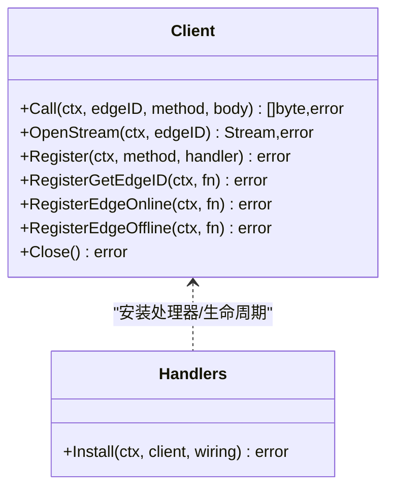
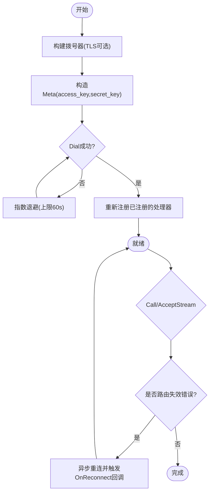
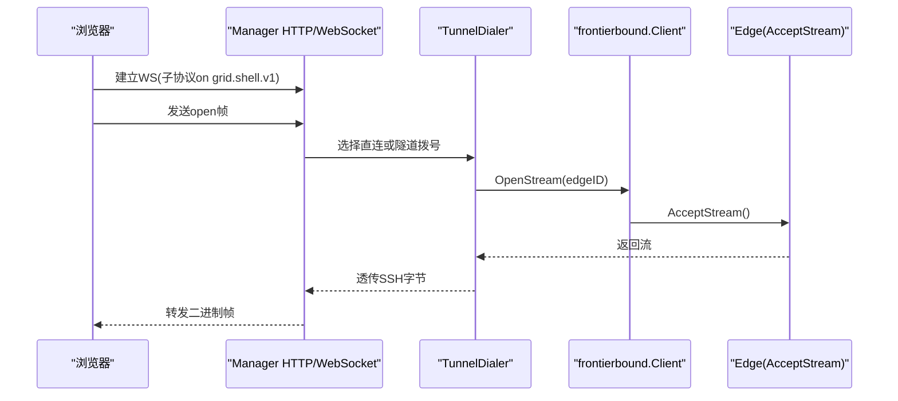
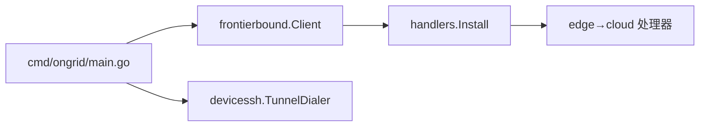

# 服务间通信

<cite>
**本文引用的文件**   
- [internal/manager/service/frontierbound/client.go](file://internal/manager/service/frontierbound/client.go)
- [internal/manager/service/frontierbound/handlers.go](file://internal/manager/service/frontierbound/handlers.go)
- [internal/manager/service/frontierbound/doc.go](file://internal/manager/service/frontierbound/doc.go)
- [api/tunnel/v1/tunnel.proto](file://api/tunnel/v1/tunnel.proto)
- [internal/pkg/tunnel/client.go](file://internal/pkg/tunnel/client.go)
- [internal/pkg/tunnel/messages.go](file://internal/pkg/tunnel/messages.go)
- [internal/pkg/tunnel/types.go](file://internal/pkg/tunnel/types.go)
- [cmd/ongrid/main.go](file://cmd/ongrid/main.go)
- [internal/manager/biz/devicessh/tunnel.go](file://internal/manager/biz/devicessh/tunnel.go)
- [web/src/api/webshell.ts](file://web/src/api/webshell.ts)
</cite>

## 目录
1. [简介](#简介)
2. [项目结构](#项目结构)
3. [核心组件](#核心组件)
4. [架构总览](#架构总览)
5. [详细组件分析](#详细组件分析)
6. [依赖关系分析](#依赖关系分析)
7. [性能与可靠性](#性能与可靠性)
8. [故障排查指南](#故障排查指南)
9. [结论](#结论)
10. [附录](#附录)

## 简介
本文件系统性梳理基于 Frontier 消息中间件的微服务通信机制，覆盖以下关键主题：
- 服务发现、消息路由与负载均衡（Frontier 侧）
- gRPC 服务定义与使用（Protobuf 接口规范、序列化格式、版本兼容策略）
- WebSocket 连接建立与管理（实时数据传输、连接池、断线重连）
- Tunnel 隧道安全通信协议（加密传输、身份认证、数据完整性校验）
- 消息队列使用模式（异步处理、重试、死信队列）
- 调试工具与性能优化建议

## 项目结构
围绕“服务间通信”的关键代码分布在如下位置：
- 云端（Manager）到边缘（Edge）的隧道客户端实现与握手流程
- Manager 侧对 Frontier 的封装与反向调用注册
- 协议定义（tunnel.proto）与 Go 侧 JSON 镜像类型
- WebShell 的 WebSocket 前端接入
- Manager 启动时对 Frontier 的连接与路由装配



图表来源
- [internal/manager/service/frontierbound/client.go:1-120](file://internal/manager/service/frontierbound/client.go#L1-L120)
- [internal/manager/service/frontierbound/handlers.go:80-120](file://internal/manager/service/frontierbound/handlers.go#L80-L120)
- [internal/pkg/tunnel/client.go:60-140](file://internal/pkg/tunnel/client.go#L60-L140)
- [internal/manager/biz/devicessh/tunnel.go:170-202](file://internal/manager/biz/devicessh/tunnel.go#L170-L202)
- [web/src/api/webshell.ts:29-58](file://web/src/api/webshell.ts#L29-L58)

章节来源
- [internal/manager/service/frontierbound/doc.go:1-16](file://internal/manager/service/frontierbound/doc.go#L1-L16)
- [cmd/ongrid/main.go:865-939](file://cmd/ongrid/main.go#L865-L939)

## 核心组件
- frontierbound.Client：Manager 侧对 Frontier 服务端的轻量封装，负责长连接、Call/OpenStream/生命周期回调注册。
- handlers.Install：在 Manager 侧注册所有 edge→cloud 的反向调用处理器（注册、心跳、指标上报、插件配置拉取、WebShell 输出等）。
- tunnel.Client：Edge 侧隧道客户端，提供 Dial/RegisterHandler/Call/AcceptStream/OnReconnect 等能力，内置指数退避与自动重连。
- devicessh.TunnelDialer：将 OpenStream 抽象为 SSH 会话通道，用于 WebShell 场景。
- webshell.ts：浏览器侧 WebSocket 客户端，负责 Shell 子协议协商与控制帧收发。

章节来源
- [internal/manager/service/frontierbound/client.go:49-145](file://internal/manager/service/frontierbound/client.go#L49-L145)
- [internal/manager/service/frontierbound/handlers.go:80-120](file://internal/manager/service/frontierbound/handlers.go#L80-L120)
- [internal/pkg/tunnel/client.go:23-141](file://internal/pkg/tunnel/client.go#L23-L141)
- [internal/manager/biz/devicessh/tunnel.go:46-81](file://internal/manager/biz/devicessh/tunnel.go#L46-L81)
- [web/src/api/webshell.ts:29-58](file://web/src/api/webshell.ts#L29-L58)

## 架构总览
整体通信路径分为两类：
- 控制面（JSON-RPC over geminio）：注册、心跳、指标、插件配置、升级包下发等
- 数据面（双向字节流）：WebShell 的 SSH 流量经隧道透传



图表来源
- [internal/pkg/tunnel/client.go:60-141](file://internal/pkg/tunnel/client.go#L60-L141)
- [internal/manager/service/frontierbound/handlers.go:189-224](file://internal/manager/service/frontierbound/handlers.go#L189-L224)
- [internal/manager/biz/devicessh/tunnel.go:170-202](file://internal/manager/biz/devicessh/tunnel.go#L170-L202)
- [web/src/api/webshell.ts:29-58](file://web/src/api/webshell.ts#L29-L58)

## 详细组件分析

### Frontier 服务绑定与反向调用（Manager 侧）
- 职责
  - 维护与 Frontier Broker 的长连接
  - 注册 GetEdgeID/EdgeOnline/EdgeOffline 生命周期回调
  - 暴露 Call/OpenStream/注册业务处理器等能力
- 关键点
  - NewDisabled 支持无 Broker 启动（e2e/降级场景）
  - 内部维护 transportID ↔ edgeID 映射，避免标签污染
  - OpenStream 返回 geminio.Stream，供上层以 net.Conn 方式使用



图表来源
- [internal/manager/service/frontierbound/client.go:49-145](file://internal/manager/service/frontierbound/client.go#L49-L145)
- [internal/manager/service/frontierbound/handlers.go:80-120](file://internal/manager/service/frontierbound/handlers.go#L80-L120)

章节来源
- [internal/manager/service/frontierbound/client.go:1-120](file://internal/manager/service/frontierbound/client.go#L1-L120)
- [internal/manager/service/frontierbound/handlers.go:1-120](file://internal/manager/service/frontierbound/handlers.go#L1-L120)
- [internal/manager/service/frontierbound/doc.go:1-16](file://internal/manager/service/frontierbound/doc.go#L1-L16)

### 隧道客户端（Edge 侧）
- 职责
  - 指数退避 Dial，TLS CA 校验（可选）
  - 自动重连（geminio RetryEnd），错误分类触发重连
  - 注册云→边 RPC 处理器，Call 云→边方法
  - AcceptStream 接收云发起的双向流
- 关键点
  - OnReconnect 回调用于重注册 register_edge 等业务
  - shouldReconnect 识别“路由失效”类错误



图表来源
- [internal/pkg/tunnel/client.go:60-141](file://internal/pkg/tunnel/client.go#L60-L141)
- [internal/pkg/tunnel/client.go:218-331](file://internal/pkg/tunnel/client.go#L218-L331)

章节来源
- [internal/pkg/tunnel/client.go:1-141](file://internal/pkg/tunnel/client.go#L1-L141)
- [internal/pkg/tunnel/types.go:68-106](file://internal/pkg/tunnel/types.go#L68-L106)

### 协议与消息模型（tunnel.proto 与 Go 镜像）
- 设计原则
  - MVP 采用 JSON 编码；未来可切换二进制
  - proto 仅描述消息形状，不声明 gRPC Service
  - Go 侧以手写 JSON 结构体镜像保持零依赖
- 主要方法
  - register_edge、heartbeat、push_host_metrics、push_prom_samples
  - get_host_load、get_process_list、get_netstat
  - shell_open/input/resize/close/output/exit
  - plugin_configs_changed、get_plugin_configs、write_database_metrics_secret
  - agent_upgrade、fetch_package、apply_package

```mermaid
erDiagram
HOST_INFO {
string hostname
string os
string arch
string kernel_version
uint32 cpu_count
uint64 mem_total_bytes
}
HOST_METRIC_POINT {
timestamp ts
float cpu_pct
float mem_pct
float load1
float load5
float load15
uint64 net_rx_bps
uint64 net_tx_bps
float disk_used_pct
}
REGISTER_EDGE_REQUEST {
string access_key
string secret_key
HostInfo host_info
string agent_version
}
HEARTBEAT_REQUEST {
timestamp ts
map<string,string> status_flags
}
PUSH_HOST_METRICS_REQUEST {
repeated HostMetricPoint points
}
PUSH_PROM_SAMPLES_REQUEST {
string source
repeated PromSample samples
}
PROM_SAMPLE {
string name
map<string,string> labels
float value
int64 ts_ms
}
```

图表来源
- [api/tunnel/v1/tunnel.proto:1-166](file://api/tunnel/v1/tunnel.proto#L1-L166)
- [internal/pkg/tunnel/messages.go:258-377](file://internal/pkg/tunnel/messages.go#L258-L377)

章节来源
- [api/tunnel/v1/tunnel.proto:1-166](file://api/tunnel/v1/tunnel.proto#L1-L166)
- [internal/pkg/tunnel/messages.go:1-80](file://internal/pkg/tunnel/messages.go#L1-L80)
- [internal/pkg/tunnel/messages.go:258-514](file://internal/pkg/tunnel/messages.go#L258-L514)

### gRPC 服务定义与使用（Protobuf 接口规范、序列化、版本兼容）
- 现状
  - 本仓库中 tunnel.proto 未声明 gRPC Service，仅定义消息形状
  - 实际采用 geminio 自定义 RPC（method 字符串 + JSON 负载）
- 若引入 gRPC 的建议
  - 使用 proto 的 json_name 保持与现有 JSON 字段一致
  - 新增字段时遵循向后兼容：只增不删，默认值明确
  - 版本号管理：通过 package 或 message 前缀演进（如 v1/v2）
  - 兼容性测试：生成多语言 stub 进行互测

章节来源
- [api/tunnel/v1/tunnel.proto:1-10](file://api/tunnel/v1/tunnel.proto#L1-L10)

### WebSocket 连接建立与管理（WebShell）
- 建立流程
  - 浏览器通过 /api/v1/devices/:id/shell 或 /shell-direct 建立 WebSocket
  - 子协议 ongrid.shell.v1 用于协商
  - 首帧 open 携带终端参数与 SSH 凭据
- 数据传输
  - 文本帧承载控制帧（open/resize/close/ready/auth_error/exit）
  - 二进制帧承载 SSH 数据流
- 断线重连
  - 前端需自行实现重连逻辑（指数退避、最大重试次数）
  - 服务端侧由 TunnelDialer 与 frontierbound.OpenStream 保障端到端连通性



图表来源
- [web/src/api/webshell.ts:29-58](file://web/src/api/webshell.ts#L29-L58)
- [internal/manager/biz/devicessh/tunnel.go:170-202](file://internal/manager/biz/devicessh/tunnel.go#L170-L202)
- [internal/manager/service/frontierbound/client.go:218-242](file://internal/manager/service/frontierbound/client.go#L218-L242)

章节来源
- [web/src/api/webshell.ts:29-103](file://web/src/api/webshell.ts#L29-L103)
- [internal/manager/biz/devicessh/tunnel.go:170-202](file://internal/manager/biz/devicessh/tunnel.go#L170-L202)

### Tunnel 隧道的安全通信协议
- 加密传输
  - Edge 侧支持可选 TLS CA 校验，最小 TLS 版本 1.2
- 身份认证
  - 连接 Meta 携带 access_key/secret_key
  - Manager 侧 GetEdgeID 回调执行 AccessKey 鉴权并解析 edgeID
- 数据完整性
  - 升级包下载与解压后按 MANIFEST.txt 逐项校验 SHA256
  - 二进制替换原子化，失败回滚

章节来源
- [internal/pkg/tunnel/client.go:143-176](file://internal/pkg/tunnel/client.go#L143-L176)
- [internal/manager/service/frontierbound/handlers.go:111-136](file://internal/manager/service/frontierbound/handlers.go#L111-L136)
- [internal/pkg/tunnel/messages.go:466-502](file://internal/pkg/tunnel/messages.go#L466-L502)

### 消息队列使用模式（异步、重试、死信）
- 异步处理
  - 指标上报 push_host_metrics/push_prom_samples 采用批量推送
  - 插件配置变更通知 plugin_configs_changed 为云→边即时推送
- 重试机制
  - Edge 侧 Dial 指数退避；Call 检测到路由失效自动重连
  - 首次 register_edge 未完成时的早期指标会被静默丢弃，等待绑定完成
- 死信队列
  - 当前未见显式死信队列实现；对于不可恢复的错误，建议在业务层落库并告警，后续人工介入

章节来源
- [internal/pkg/tunnel/client.go:60-141](file://internal/pkg/tunnel/client.go#L60-L141)
- [internal/manager/service/frontierbound/handlers.go:286-329](file://internal/manager/service/frontierbound/handlers.go#L286-L329)

## 依赖关系分析
- Manager 启动阶段
  - 根据环境变量决定是否启用 Frontier 客户端（NewDisabled 降级）
  - 初始化 TunnelDialer、SFTP/Shell 服务，并将 frontierbound.Client 适配为隧道拨号器
- 运行时
  - handlers.Install 注册所有 edge→cloud 处理器
  - Edge 侧 tunnel.Client 负责自动重连与回调



图表来源
- [cmd/ongrid/main.go:865-939](file://cmd/ongrid/main.go#L865-L939)
- [internal/manager/service/frontierbound/handlers.go:80-120](file://internal/manager/service/frontierbound/handlers.go#L80-L120)

章节来源
- [cmd/ongrid/main.go:865-939](file://cmd/ongrid/main.go#L865-L939)

## 性能与可靠性
- 连接与重连
  - Edge 侧 Dial 指数退避上限 60s；路由失效错误触发独立重连 goroutine
- 批处理与去重
  - 指标与样本批量上报，服务端接受计数反馈
- 资源隔离
  - 禁用模式（NewDisabled）保证非关键链路不影响主进程启动
- 建议
  - 合理设置超时与并发度（SSH 握手/连接超时）
  - 监控指标：连接延迟、重连次数、批接受率、错误分布

章节来源
- [internal/pkg/tunnel/client.go:60-141](file://internal/pkg/tunnel/client.go#L60-L141)
- [internal/manager/service/frontierbound/client.go:104-126](file://internal/manager/service/frontierbound/client.go#L104-L126)
- [internal/manager/biz/devicessh/tunnel.go:66-81](file://internal/manager/biz/devicessh/tunnel.go#L66-L81)

## 故障排查指南
- 常见问题定位
  - 无法注册：检查 GetEdgeID 鉴权失败日志与 Meta 内容
  - 指标丢失：确认 register_edge 已完成且 edge_devices(host) 关联存在
  - WebShell 不通：检查 OpenStream 与 AcceptStream 两端状态
- 诊断手段
  - 查看 frontierbound 安装日志与错误码
  - 观察 Edge 侧 Dial 与重连日志
  - 使用 Prometheus/Grafana 观测延迟与写入总量

章节来源
- [internal/manager/service/frontierbound/handlers.go:111-136](file://internal/manager/service/frontierbound/handlers.go#L111-L136)
- [internal/manager/service/frontierbound/handlers.go:286-329](file://internal/manager/service/frontierbound/handlers.go#L286-L329)
- [internal/pkg/tunnel/client.go:218-331](file://internal/pkg/tunnel/client.go#L218-L331)

## 结论
本项目以 Frontier 作为服务发现与路由中枢，结合 geminio 提供的可靠长连接与双向流能力，构建了稳定高效的云端-边缘通信体系。通过分层抽象（frontierbound、tunnel、TunnelDialer）与清晰的协议边界（tunnel.proto + Go 镜像），实现了高内聚低耦合的可扩展架构。配合 TLS、AccessKey 鉴权与升级包完整性校验，保障了安全性与可运维性。

## 附录
- 调试建议
  - 开启 slog 详细日志，关注“connected/dial failed/reconnect”等关键字
  - 针对 WebShell，可在浏览器控制台捕获 WS 事件与帧内容
- 最佳实践
  - 统一错误码与语义，便于上层重试与降级
  - 对关键路径增加埋点与告警（连接、重连、批接受率）