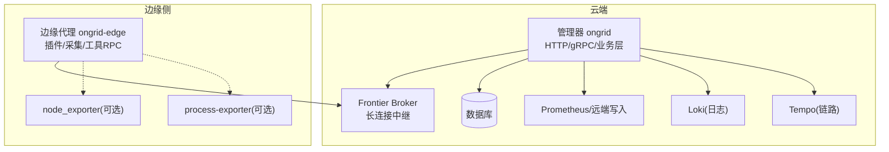
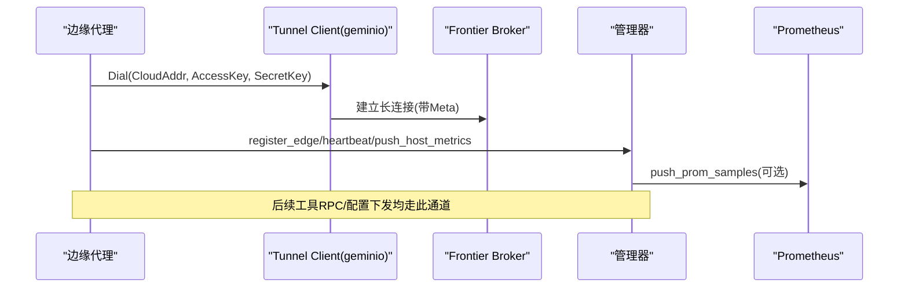
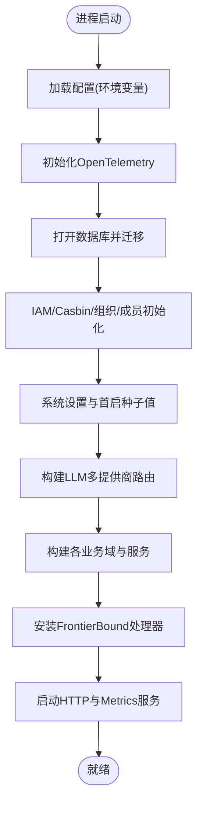
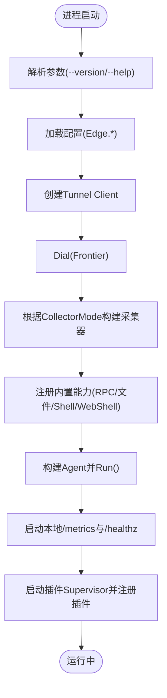
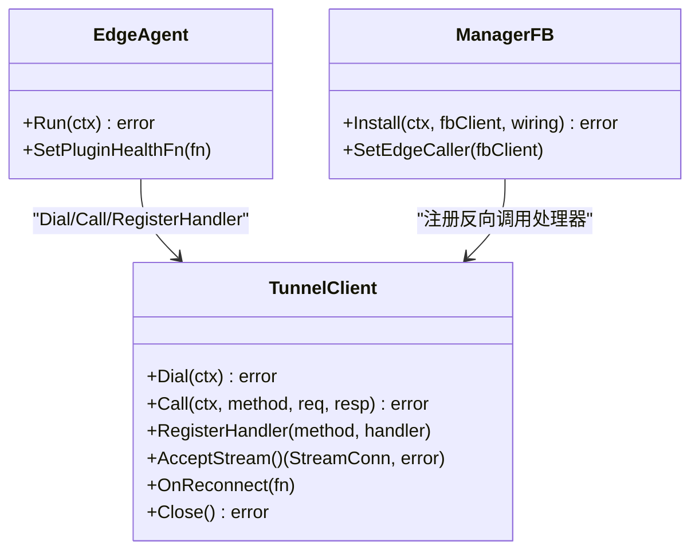
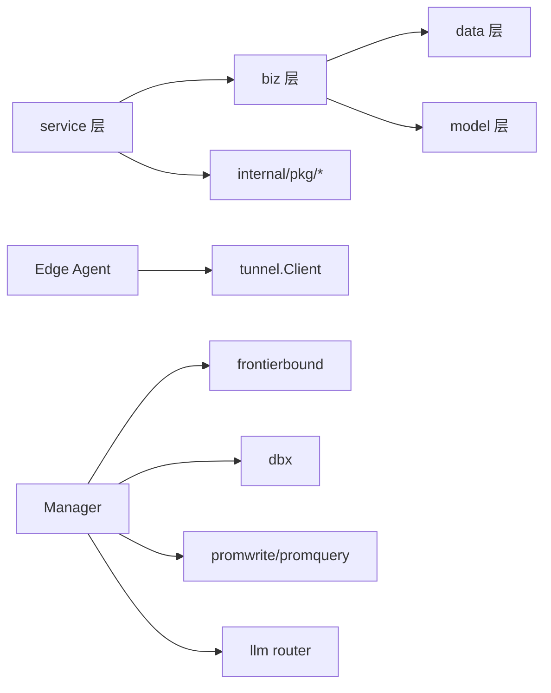

# 核心服务

<cite>
**本文引用的文件列表**
- [cmd/ongrid/main.go](file://cmd/ongrid/main.go)
- [cmd/ongrid-edge/main.go](file://cmd/ongrid-edge/main.go)
- [internal/pkg/config/config.go](file://internal/pkg/config/config.go)
- [internal/pkg/tunnel/client.go](file://internal/pkg/tunnel/client.go)
- [internal/manager/service/systemhealth/service.go](file://internal/manager/service/systemhealth/service.go)
- [internal/manager/service/edge/service.go](file://internal/manager/service/edge/service.go)
</cite>

## 目录
1. [简介](#简介)
2. [项目结构](#项目结构)
3. [核心组件](#核心组件)
4. [架构总览](#架构总览)
5. [详细组件分析](#详细组件分析)
6. [依赖关系分析](#依赖关系分析)
7. [性能与可观测性](#性能与可观测性)
8. [故障排查指南](#故障排查指南)
9. [结论](#结论)
10. [附录：扩展与自定义指南](#附录扩展与自定义指南)

## 简介
本文件面向开发者，系统化梳理 OnGrid 核心服务的云端管理器（Manager）与边缘代理（Edge Agent）的架构设计与实现细节。内容覆盖：
- 服务启动流程、依赖注入机制与生命周期管理
- 服务间通信协议（基于 gRPC 的隧道通道与 WebSocket 流式能力）及数据同步机制
- 配置管理、错误处理与日志记录最佳实践
- 健康检查、性能监控与故障恢复策略
- 面向开发者的服务扩展与自定义实现指南

## 项目结构
OnGrid 采用“云-边”双进程形态：
- 云端管理器 ongrid：提供 HTTP API、gRPC 服务、指标采集、告警、AIops 编排等；通过前端网关暴露 Web UI。
- 边缘代理 ongrid-edge：在目标主机运行，负责采集指标、执行工具 RPC、插件化数据采集与上报。

图表来源
- [cmd/ongrid/main.go:195-240](file://cmd/ongrid/main.go#L195-L240)
- [cmd/ongrid-edge/main.go:56-110](file://cmd/ongrid-edge/main.go#L56-L110)
- [internal/pkg/config/config.go:369-486](file://internal/pkg/config/config.go#L369-L486)

章节来源
- [cmd/ongrid/main.go:195-240](file://cmd/ongrid/main.go#L195-L240)
- [cmd/ongrid-edge/main.go:56-110](file://cmd/ongrid-edge/main.go#L56-L110)
- [internal/pkg/config/config.go:369-486](file://internal/pkg/config/config.go#L369-L486)

## 核心组件
- 云端管理器（Manager）
  - 入口：cmd/ongrid/main.go
  - 职责：HTTP/gRPC 服务装配、IAM/RBAC、系统设置、告警、AIops、设备/边缘管理、WebShell、安装任务、拓扑、报告、市场、MCP、监控面板镜像到 Grafana、OpenTelemetry 追踪、Prometheus 远端写入、通知渠道等。
- 边缘代理（Edge Agent）
  - 入口：cmd/ongrid-edge/main.go
  - 职责：建立与云端的隧道连接、周期性采集并推送指标、注册工具 RPC（如主机负载、进程列表）、插件化采集（日志、审计、主机/进程指标、数据库指标、自定义指标、链路追踪）、本地 /metrics 与 /healthz、升级阶段目录管理等。

章节来源
- [cmd/ongrid/main.go:195-240](file://cmd/ongrid/main.go#L195-L240)
- [cmd/ongrid-edge/main.go:56-110](file://cmd/ongrid-edge/main.go#L56-L110)

## 架构总览
- 控制面（Manager）通过 Frontier Broker 与 Edge Agent 建立长连接，形成双向 RPC 通道。
- 数据面（Edge）以插件形式组织，支持多种采集器模式（off/auto/embedded/scrape），并通过隧道将样本推送到 Manager 的 Prometheus 远端写入或本地 scrape。
- 安全与鉴权：JWT + Casbin RBAC；Edge 使用 AccessKey/SecretKey 认证。
- 可观测性：OpenTelemetry 追踪、Prometheus 指标、Loki 日志、Tempo 链路。

图表来源
- [internal/pkg/tunnel/client.go:66-141](file://internal/pkg/tunnel/client.go#L66-L141)
- [cmd/ongrid-edge/main.go:89-110](file://cmd/ongrid-edge/main.go#L89-L110)
- [cmd/ongrid/main.go:887-903](file://cmd/ongrid/main.go#L887-L903)

## 详细组件分析

### 云端管理器（Manager）启动与依赖注入
- 配置加载与环境变量解析
  - 统一从环境变量读取，包含 HTTP/Metrics 地址、DB、JWT、LLM、Grafana、Prom、Logs、Traces、Alert、Skills、Frontier 客户端等。
- 初始化顺序（关键步骤）
  - 初始化 OpenTelemetry 追踪
  - 打开数据库并执行迁移
  - IAM 用户/组织/成员/Casbin 策略初始化与默认组织回填
  - 构建系统设置（system_settings）与首启种子值（LLM、Prom、Grafana、Loki、Tempo、WebSearch）
  - 构建 LLM 多提供商路由与动态解析器
  - 构建各业务域（biz/data/server/service）与中间件（RBAC）
  - 安装 FrontierBound 处理器，注册 edge 生命周期回调与反向调用处理器
  - 启动 HTTP 服务与 /metrics 端点
- 依赖注入方式
  - 显式构造 Service/Usecase/Repo 对象，按层组装；通过接口（如 EdgeCaller）解耦跨域调用。

图表来源
- [cmd/ongrid/main.go:195-240](file://cmd/ongrid/main.go#L195-L240)
- [cmd/ongrid/main.go:246-276](file://cmd/ongrid/main.go#L246-L276)
- [cmd/ongrid/main.go:282-386](file://cmd/ongrid/main.go#L282-L386)
- [cmd/ongrid/main.go:401-476](file://cmd/ongrid/main.go#L401-L476)
- [cmd/ongrid/main.go:532-721](file://cmd/ongrid/main.go#L532-L721)
- [cmd/ongrid/main.go:887-903](file://cmd/ongrid/main.go#L887-L903)

章节来源
- [cmd/ongrid/main.go:195-240](file://cmd/ongrid/main.go#L195-L240)
- [cmd/ongrid/main.go:246-276](file://cmd/ongrid/main.go#L246-L276)
- [cmd/ongrid/main.go:282-386](file://cmd/ongrid/main.go#L282-L386)
- [cmd/ongrid/main.go:401-476](file://cmd/ongrid/main.go#L401-L476)
- [cmd/ongrid/main.go:532-721](file://cmd/ongrid/main.go#L532-L721)
- [cmd/ongrid/main.go:887-903](file://cmd/ongrid/main.go#L887-L903)

### 边缘代理（Edge Agent）启动与插件体系
- 启动流程
  - 解析命令行参数（--version/--help）
  - 加载配置（CloudAddr、AccessKey、SecretKey、CollectorMode 等）
  - 创建 Tunnel Client 并 Dial
  - 根据 CollectorMode 选择采集器（off/auto/embedded/scrape）
  - 注册内置能力（host_files、restart_service、bash、webshell）
  - 构建 Agent 实例并启动主循环（心跳、指标推送、升级阶段目录）
  - 启动本地 /metrics 与 /healthz
  - 启动插件 Supervisor，按配置拉取并管理子进程/内嵌采集器
- 插件体系
  - 日志、审计、主机指标、进程指标、数据库指标、自定义指标、链路追踪等
  - 通过 Supervisor 统一管理生命周期，支持热重载与失败自愈

图表来源
- [cmd/ongrid-edge/main.go:56-110](file://cmd/ongrid-edge/main.go#L56-L110)
- [cmd/ongrid-edge/main.go:169-187](file://cmd/ongrid-edge/main.go#L169-L187)
- [cmd/ongrid-edge/main.go:194-305](file://cmd/ongrid-edge/main.go#L194-L305)
- [cmd/ongrid-edge/main.go:332-376](file://cmd/ongrid-edge/main.go#L332-L376)

章节来源
- [cmd/ongrid-edge/main.go:56-110](file://cmd/ongrid-edge/main.go#L56-L110)
- [cmd/ongrid-edge/main.go:169-187](file://cmd/ongrid-edge/main.go#L169-L187)
- [cmd/ongrid-edge/main.go:194-305](file://cmd/ongrid-edge/main.go#L194-L305)
- [cmd/ongrid-edge/main.go:332-376](file://cmd/ongrid-edge/main.go#L332-L376)

### 通信协议与数据同步
- 隧道通道（gRPC 风格 RPC）
  - 基于 geminio 的 RetryEnd 实现自动重连与指数退避；支持 TLS CA 校验。
  - 方法命名式注册与调用（register_edge、heartbeat、push_host_metrics、get_plugin_configs、MethodPluginConfigsChanged 等）。
  - 当检测到路由失效时触发异步重连，并在回调中重新注册必要状态。
- WebSocket 流式能力
  - 通过 AcceptStream 暴露 StreamConn，用于 WebShell 等双向流场景。
- 数据同步机制
  - 指标：Edge 通过 push_prom_samples 推送至 Manager，再由 Manager 写入 Prometheus（或兼容 TSDB）。
  - 配置：Manager 推送 PluginConfig 变更，Edge 收到后触发 Supervisor 热重载。

图表来源
- [internal/pkg/tunnel/client.go:66-141](file://internal/pkg/tunnel/client.go#L66-L141)
- [internal/pkg/tunnel/client.go:178-209](file://internal/pkg/tunnel/client.go#L178-L209)
- [internal/pkg/tunnel/client.go:218-243](file://internal/pkg/tunnel/client.go#L218-L243)
- [internal/pkg/tunnel/client.go:249-322](file://internal/pkg/tunnel/client.go#L249-L322)
- [cmd/ongrid/main.go:887-903](file://cmd/ongrid/main.go#L887-L903)

章节来源
- [internal/pkg/tunnel/client.go:66-141](file://internal/pkg/tunnel/client.go#L66-L141)
- [internal/pkg/tunnel/client.go:178-209](file://internal/pkg/tunnel/client.go#L178-L209)
- [internal/pkg/tunnel/client.go:218-243](file://internal/pkg/tunnel/client.go#L218-L243)
- [internal/pkg/tunnel/client.go:249-322](file://internal/pkg/tunnel/client.go#L249-L322)
- [cmd/ongrid/main.go:887-903](file://cmd/ongrid/main.go#L887-L903)

### 配置管理
- 统一配置模型 internal/pkg/config/config.go
  - 环境变量驱动，提供合理默认值；涵盖 HTTP/Metrics、DB、JWT、LLM、Grafana、Prom、Logs、Traces、Alert、Skills、Frontier、Edge 等。
  - 对敏感字段（如 JWT Secret）有启动期安全检查。
- 运行时配置
  - system_settings 支持管理员在线编辑，LLM 等组件通过 Resolver 动态获取，避免重启生效。

章节来源
- [internal/pkg/config/config.go:369-486](file://internal/pkg/config/config.go#L369-L486)
- [cmd/ongrid/main.go:282-386](file://cmd/ongrid/main.go#L282-L386)
- [cmd/ongrid/main.go:401-476](file://cmd/ongrid/main.go#L401-L476)

### 错误处理与日志记录
- 错误处理
  - 启动期关键路径失败直接退出（如配置加载、DB 打开、迁移失败、JWT 默认密钥未修改）。
  - 非致命错误（如 Grafana 引导、插件注册失败）采用警告日志并降级运行。
  - 隧道层对路由失效进行自动重连，避免上层感知异常。
- 日志记录
  - 统一使用 slog，按组件打标签，便于定位问题。
  - 关键事件（连接、重连、迁移、回补、插件状态）均有结构化日志。

章节来源
- [cmd/ongrid/main.go:195-240](file://cmd/ongrid/main.go#L195-L240)
- [cmd/ongrid/main.go:246-276](file://cmd/ongrid/main.go#L246-L276)
- [cmd/ongrid/main.go:282-386](file://cmd/ongrid/main.go#L282-L386)
- [internal/pkg/tunnel/client.go:121-141](file://internal/pkg/tunnel/client.go#L121-L141)
- [internal/pkg/tunnel/client.go:272-287](file://internal/pkg/tunnel/client.go#L272-L287)

### 生命周期管理
- 信号处理
  - 使用 signal.NotifyContext 监听 SIGINT/SIGTERM，优雅关闭所有 goroutine。
- 资源清理
  - 数据库连接、OpenTelemetry、Frontier 客户端、HTTP 服务器等在 defer 中有序关闭。
- 插件与采集器
  - 插件 Supervisor 在 errgroup 中运行，随主进程退出而停止；采集器按模式加入 errgroup 共享生命周期。

章节来源
- [cmd/ongrid/main.go:214-241](file://cmd/ongrid/main.go#L214-L241)
- [cmd/ongrid/main.go:895-903](file://cmd/ongrid/main.go#L895-L903)
- [cmd/ongrid-edge/main.go:97-110](file://cmd/ongrid-edge/main.go#L97-L110)
- [cmd/ongrid-edge/main.go:169-187](file://cmd/ongrid-edge/main.go#L169-L187)

### 健康检查与系统自检
- 系统健康服务
  - 聚合多项探针：Manager API、数据库、Prometheus、Grafana、Loki、Tempo、Qdrant、Frontier、告警引擎、Edge 在线情况、LLM/Embedding 等。
  - 返回整体状态与明细，供 UI 展示与外部探测。
- 边缘健康
  - 本地 /healthz 返回 ok；/metrics 暴露内部指标。

章节来源
- [internal/manager/service/systemhealth/service.go:114-164](file://internal/manager/service/systemhealth/service.go#L114-L164)
- [internal/manager/service/systemhealth/service.go:303-354](file://internal/manager/service/systemhealth/service.go#L303-L354)
- [cmd/ongrid-edge/main.go:169-177](file://cmd/ongrid-edge/main.go#L169-L177)

### 性能与可观测性
- 指标
  - Manager 与 Edge 均暴露 /metrics；Manager 注册自身可观测指标（评估延迟、remote_write 结果等）。
- 追踪
  - 通过 OpenTelemetry 向 Tempo 发送 span，支撑 trace_latency/trace_error_rate 等评估器。
- 日志
  - Loki 作为日志后端，Manager 提供查询代理；Edge 插件可将日志输出到指定路径由 logs 插件收集。

章节来源
- [cmd/ongrid/main.go:218-241](file://cmd/ongrid/main.go#L218-L241)
- [cmd/ongrid/main.go:393-399](file://cmd/ongrid/main.go#L393-L399)
- [internal/pkg/config/config.go:70-88](file://internal/pkg/config/config.go#L70-L88)
- [cmd/ongrid-edge/main.go:169-177](file://cmd/ongrid-edge/main.go#L169-L177)

## 依赖关系分析
- 分层与边界
  - service → biz → data/model；禁止跨层直引，通过接口与 pkg 解耦。
- 关键依赖
  - Manager 依赖 DB、Frontier、Prom/Loki/Tempo、LLM 提供商、Casbin、Grafana。
  - Edge 依赖 Tunnel Client、插件二进制与工作目录、本地采集器。

图表来源
- [repowiki/site/architecture/dependency-map/index.html:1545-1569](file://repowiki/site/architecture/dependency-map/index.html#L1545-L1569)
- [cmd/ongrid/main.go:887-903](file://cmd/ongrid/main.go#L887-L903)
- [cmd/ongrid-edge/main.go:89-110](file://cmd/ongrid-edge/main.go#L89-L110)

章节来源
- [repowiki/site/architecture/dependency-map/index.html:1545-1569](file://repowiki/site/architecture/dependency-map/index.html#L1545-L1569)
- [cmd/ongrid/main.go:887-903](file://cmd/ongrid/main.go#L887-L903)
- [cmd/ongrid-edge/main.go:89-110](file://cmd/ongrid-edge/main.go#L89-L110)

## 性能与可观测性
- 建议
  - 合理设置 Alert.EvaluatorInterval 与 Cooldown，避免高频评估导致存储与 CPU 压力。
  - 调整 Frontiers.Warmup 以缓解 broker 路由表可见性 race。
  - 在大规模部署下，优先使用 scrape 模式减少重复样本。
- 监控要点
  - 关注 tunnel 重连次数、插件重启计数、Prom remote_write 成功率、LLM 调用延迟与配额。

[本节为通用指导，不直接分析具体文件]

## 故障排查指南
- 常见症状与定位
  - 无法连接云端：检查 CloudAddr、AccessKey/SecretKey、TLS CA 配置；查看 tunnel dial 重试日志。
  - 插件崩溃：查看 Supervisor 健康快照与 lastError；确认二进制路径与工作目录权限。
  - 指标缺失：确认 CollectorMode 与 scrape 配置；检查 manager 端 promwrite 是否启用与可达。
  - 告警无规则：系统健康检查会提示“已启用但无规则”。
- 快速命令
  - 边缘：curl http://localhost:9101/healthz；查看 /metrics。
  - 云端：访问系统健康页面，逐项检查依赖状态。

章节来源
- [internal/pkg/tunnel/client.go:121-141](file://internal/pkg/tunnel/client.go#L121-L141)
- [internal/manager/service/systemhealth/service.go:303-354](file://internal/manager/service/systemhealth/service.go#L303-L354)
- [cmd/ongrid-edge/main.go:169-177](file://cmd/ongrid-edge/main.go#L169-L177)

## 结论
OnGrid 通过清晰的云-边分层、插件化采集与统一的隧道通道，实现了可扩展、可观测、高可用的运维平台。其启动流程严谨、依赖注入明确、错误处理稳健，配合完善的健康检查与监控能力，为生产环境提供了坚实基础。

[本节为总结，不直接分析具体文件]

## 附录：扩展与自定义指南
- 新增云端 HTTP/gRPC 服务
  - 在 manager/server 下新增 Handler，在 main 中组装 Service/Usecase/Repo，注册路由与中间件。
  - 如需跨域调用 Edge，实现 EdgeCaller 接口并通过 managersvcedge.Service 注入。
- 新增边缘插件
  - 在 internal/edgeagent/plugins 下实现插件（名称、启动/停止、配置、健康快照），在 main 中注册到 Supervisor。
  - 若需远程配置，实现 ConfigFetcher 或通过现有 TunnelConfigFetcher 拉取。
- 自定义采集器模式
  - 在 buildCollector 中添加新模式分支，遵循 collectorAdapter 桥接接口，确保与 biz 层一致。
- 配置项扩展
  - 在 config.Config 中新增字段，Load() 中增加环境变量解析与默认值；在对应服务中消费。

章节来源
- [internal/manager/service/edge/service.go:17-32](file://internal/manager/service/edge/service.go#L17-L32)
- [cmd/ongrid-edge/main.go:194-305](file://cmd/ongrid-edge/main.go#L194-L305)
- [cmd/ongrid-edge/main.go:332-376](file://cmd/ongrid-edge/main.go#L332-L376)
- [internal/pkg/config/config.go:369-486](file://internal/pkg/config/config.go#L369-L486)