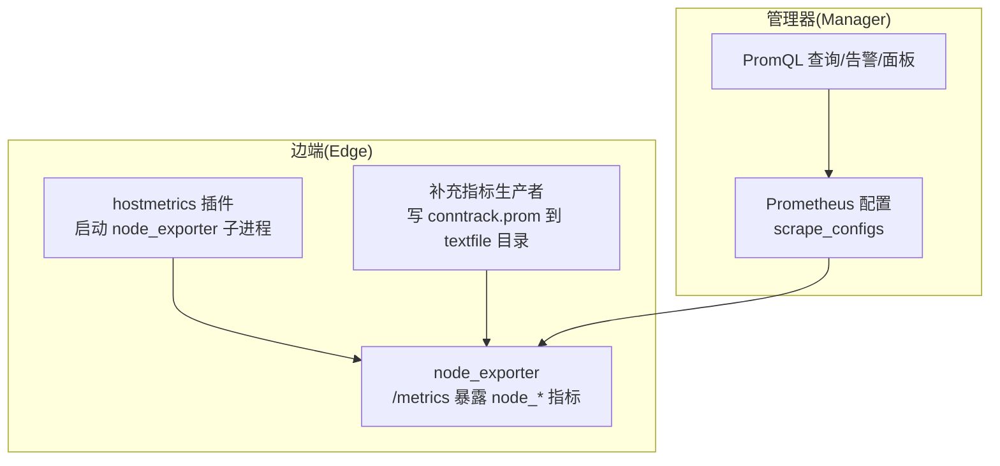
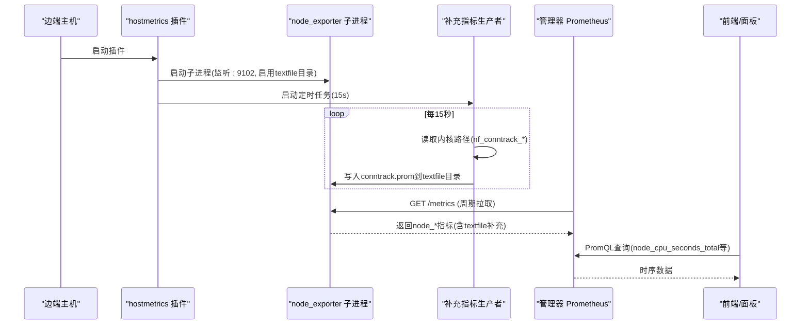
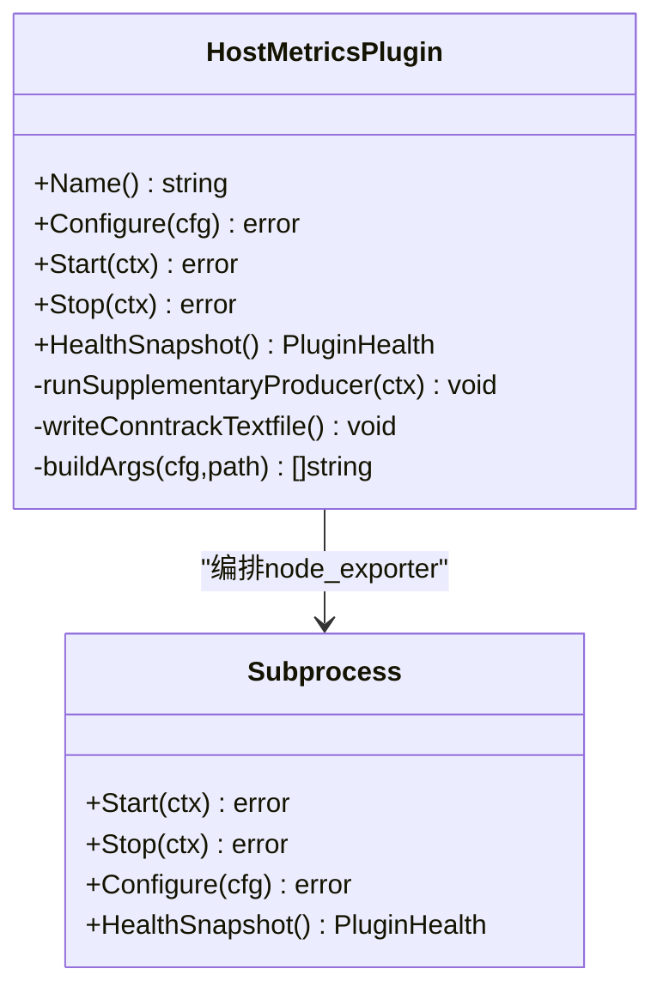
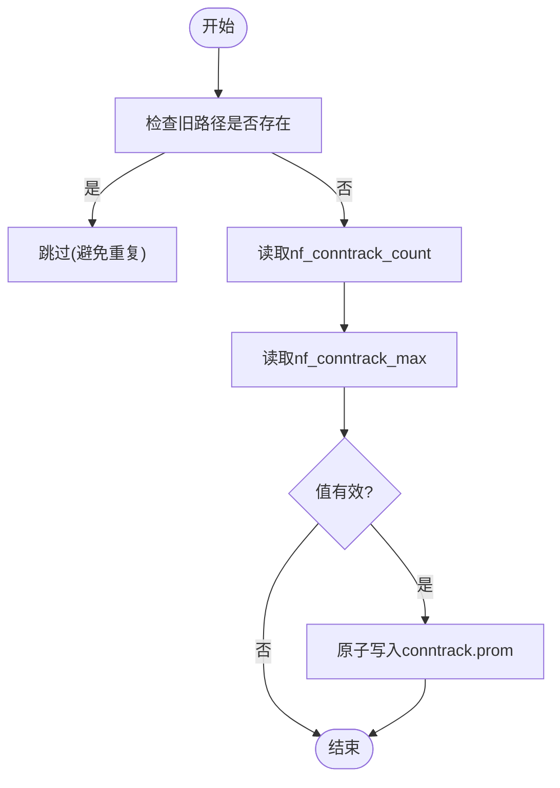
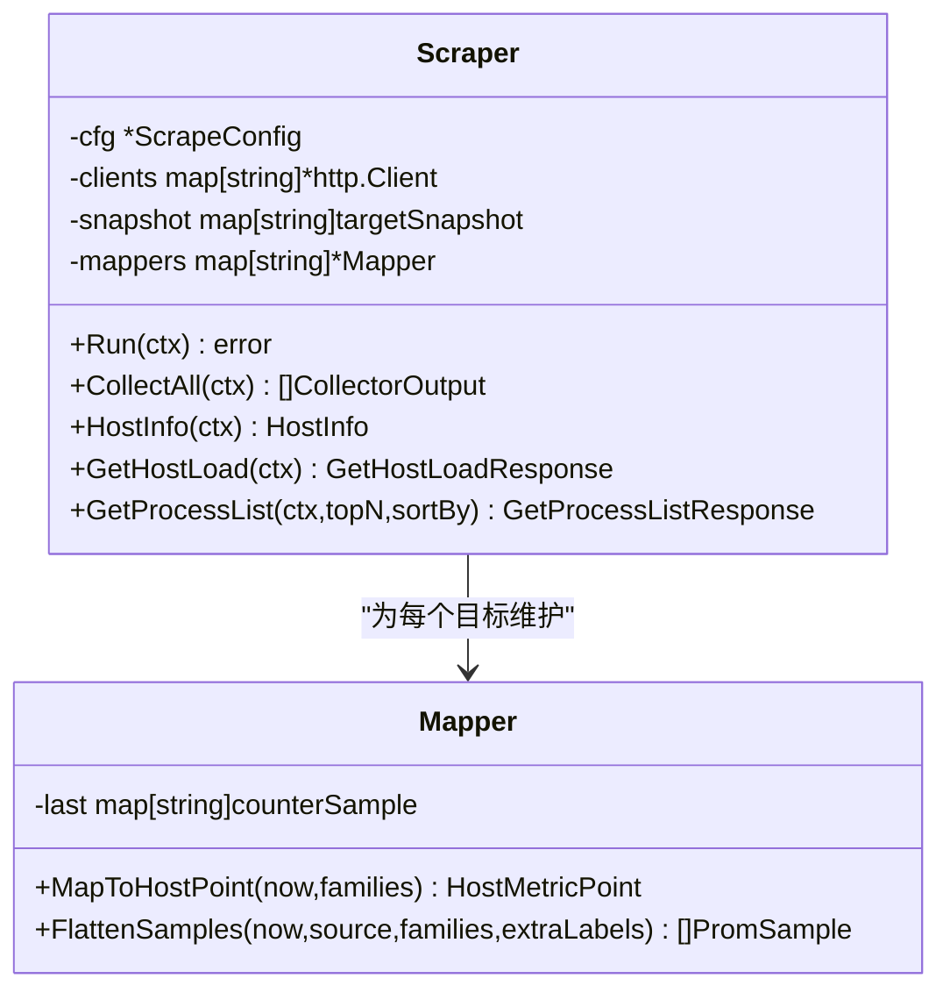
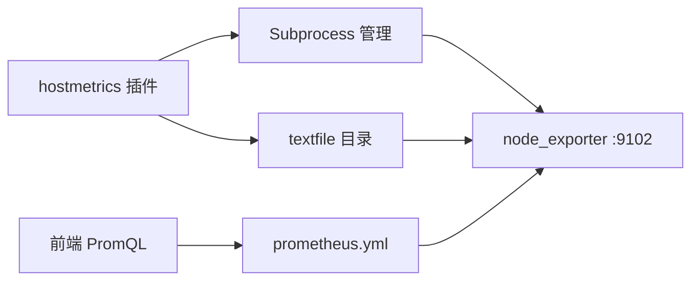

# 主机指标插件

<cite>
**本文引用的文件**   
- [internal/edgeagent/plugins/hostmetrics/plugin.go](file://internal/edgeagent/plugins/hostmetrics/plugin.go)
- [internal/edgeagent/collector/scrape.go](file://internal/edgeagent/collector/scrape.go)
- [internal/edgeagent/collector/mapper.go](file://internal/edgeagent/collector/mapper.go)
- [internal/edgeagent/collector/types.go](file://internal/edgeagent/collector/types.go)
- [internal/edgeagent/collector/scrapecfg.go](file://internal/edgeagent/collector/scrapecfg.go)
- [web/src/pages/Edges.tsx](file://web/src/pages/Edges.tsx)
- [deploy/install/prometheus/prometheus.yml](file://deploy/install/prometheus/prometheus.yml)
</cite>

## 目录
1. [简介](#简介)
2. [项目结构](#项目结构)
3. [核心组件](#核心组件)
4. [架构总览](#架构总览)
5. [详细组件分析](#详细组件分析)
6. [依赖关系分析](#依赖关系分析)
7. [性能与资源影响](#性能与资源影响)
8. [故障排查指南](#故障排查指南)
9. [结论](#结论)
10. [附录：查询、告警与可视化建议](#附录查询告警与可视化建议)

## 简介
本文件面向“主机指标插件”的完整实现与使用，聚焦系统级监控指标的采集、标准化、推送与可视化。内容覆盖：
- 指标范围：CPU 使用率、内存占用、磁盘 IO/使用率、网络流量等
- 采集频率与采样策略：基于定时拉取与增量速率计算
- 聚合算法：从原始计数器到百分比/速率的转换
- 与边缘代理数据采集器的集成：子进程编排、文本文件补充指标、Prom 拉取链路
- 数据格式与标签体系：Prom 原生格式、设备标识与环境维度
- 性能影响评估与扩展性考虑
- 指标查询示例、告警规则配置与可视化面板建议

## 项目结构
主机指标插件位于边端（edge-agent）侧，通过启动 node_exporter 子进程暴露标准 /metrics，并在进程内维护一个轻量“补充指标生产者”，将内核态缺失的指标以 textfile 形式写入，最终由管理器侧 Prometheus 统一拉取。

图表来源
- [internal/edgeagent/plugins/hostmetrics/plugin.go:1-120](file://internal/edgeagent/plugins/hostmetrics/plugin.go#L1-L120)
- [internal/edgeagent/plugins/hostmetrics/plugin.go:150-231](file://internal/edgeagent/plugins/hostmetrics/plugin.go#L150-L231)
- [deploy/install/prometheus/prometheus.yml](file://deploy/install/prometheus/prometheus.yml)

章节来源
- [internal/edgeagent/plugins/hostmetrics/plugin.go:1-120](file://internal/edgeagent/plugins/hostmetrics/plugin.go#L1-L120)
- [internal/edgeagent/plugins/hostmetrics/plugin.go:150-231](file://internal/edgeagent/plugins/hostmetrics/plugin.go#L150-L231)
- [deploy/install/prometheus/prometheus.yml](file://deploy/install/prometheus/prometheus.yml)

## 核心组件
- hostmetrics 插件：负责编排 node_exporter 子进程、注入 textfile collector 目录、提供健康快照与生命周期管理
- 补充指标生产者：周期性读取内核路径并写入 conntrack 相关指标，补齐 node_exporter 在部分内核上的缺失
- 拉取器与映射器（Scrape/Mapper）：用于通用 /metrics 拉取与快速路径 HostMetricPoint 提取（适用于更广泛的组件指标场景）
- 拉取配置（ScrapeConfig）：定义目标、角色、间隔、超时、静态标签等

章节来源
- [internal/edgeagent/plugins/hostmetrics/plugin.go:1-120](file://internal/edgeagent/plugins/hostmetrics/plugin.go#L1-L120)
- [internal/edgeagent/plugins/hostmetrics/plugin.go:150-231](file://internal/edgeagent/plugins/hostmetrics/plugin.go#L150-L231)
- [internal/edgeagent/collector/scrape.go:1-120](file://internal/edgeagent/collector/scrape.go#L1-L120)
- [internal/edgeagent/collector/mapper.go:1-120](file://internal/edgeagent/collector/mapper.go#L1-L120)
- [internal/edgeagent/collector/scrapecfg.go:1-91](file://internal/edgeagent/collector/scrapecfg.go#L1-L91)

## 架构总览
主机指标插件采用“子进程 + 本地 textfile 补充 + 标准 Prom 拉取”的架构。管理器侧 Prometheus 按配置周期拉取各 edge 的 :9102 端口，得到 node_* 系列指标；前端通过 PromQL 直接查询展示。

图表来源
- [internal/edgeagent/plugins/hostmetrics/plugin.go:62-93](file://internal/edgeagent/plugins/hostmetrics/plugin.go#L62-L93)
- [internal/edgeagent/plugins/hostmetrics/plugin.go:114-148](file://internal/edgeagent/plugins/hostmetrics/plugin.go#L114-L148)
- [internal/edgeagent/plugins/hostmetrics/plugin.go:163-176](file://internal/edgeagent/plugins/hostmetrics/plugin.go#L163-L176)
- [internal/edgeagent/plugins/hostmetrics/plugin.go:191-231](file://internal/edgeagent/plugins/hostmetrics/plugin.go#L191-L231)
- [deploy/install/prometheus/prometheus.yml](file://deploy/install/prometheus/prometheus.yml)
- [web/src/pages/Edges.tsx:583-595](file://web/src/pages/Edges.tsx#L583-L595)

## 详细组件分析

### 组件A：hostmetrics 插件（子进程与补充指标）
- 职责
  - 启动 node_exporter 子进程，绑定默认监听地址 :9102
  - 强制挂载 textfile collector 目录，使补充指标可被 /metrics 暴露
  - 运行补充指标生产者，周期性写入 conntrack 指标
- 关键行为
  - 首次启动创建 textfile 目录
  - Start/Stop 保证生产者与子进程的生命周期顺序正确
  - 构建命令行参数支持 collectors_enabled/disabled 与 extra_args
- 补充指标细节
  - 仅当旧路径不存在时写入，避免重复指标冲突
  - 原子写入（tmp+rename），防止解析半截文件导致整个 collector 失败

图表来源
- [internal/edgeagent/plugins/hostmetrics/plugin.go:62-93](file://internal/edgeagent/plugins/hostmetrics/plugin.go#L62-L93)
- [internal/edgeagent/plugins/hostmetrics/plugin.go:114-148](file://internal/edgeagent/plugins/hostmetrics/plugin.go#L114-L148)
- [internal/edgeagent/plugins/hostmetrics/plugin.go:233-246](file://internal/edgeagent/plugins/hostmetrics/plugin.go#L233-L246)

章节来源
- [internal/edgeagent/plugins/hostmetrics/plugin.go:1-120](file://internal/edgeagent/plugins/hostmetrics/plugin.go#L1-L120)
- [internal/edgeagent/plugins/hostmetrics/plugin.go:150-231](file://internal/edgeagent/plugins/hostmetrics/plugin.go#L150-L231)
- [internal/edgeagent/plugins/hostmetrics/plugin.go:233-246](file://internal/edgeagent/plugins/hostmetrics/plugin.go#L233-L246)

### 组件B：补充指标生产者（conntrack 补齐）
- 触发频率：固定 15 秒（与典型 Prom 拉取周期匹配）
- 数据来源：/proc/sys/net/netfilter/nf_conntrack_count 与 nf_conntrack_max
- 输出指标：node_nf_conntrack_entries、node_nf_conntrack_entries_limit
- 兼容性：若旧路径存在则跳过，避免与内置 collector 重复

图表来源
- [internal/edgeagent/plugins/hostmetrics/plugin.go:163-176](file://internal/edgeagent/plugins/hostmetrics/plugin.go#L163-L176)
- [internal/edgeagent/plugins/hostmetrics/plugin.go:191-231](file://internal/edgeagent/plugins/hostmetrics/plugin.go#L191-L231)

章节来源
- [internal/edgeagent/plugins/hostmetrics/plugin.go:163-176](file://internal/edgeagent/plugins/hostmetrics/plugin.go#L163-L176)
- [internal/edgeagent/plugins/hostmetrics/plugin.go:191-231](file://internal/edgeagent/plugins/hostmetrics/plugin.go#L191-L231)

### 组件C：拉取器与映射器（通用 /metrics 拉取与快速路径）
- Scraper
  - 为每个目标独立 HTTP 客户端与 goroutine
  - 支持 Bearer Token、TLS 选项、超时控制
  - 维护最近一次成功拉取的 MetricFamily 快照
  - 提供 HostInfo/GetHostLoad/GetProcessList 能力（gopsutil）
- Mapper
  - 快速路径 MapToHostPoint：从 node_* 指标导出 CPU%、内存%、负载、磁盘使用率、网络收发速率
  - 计数器转速率：CPU 与网络接口基于上次缓存样本计算差值/时间间隔
  - 扁平化 FlattenSamples：将 MetricFamily 转为 flat PromSample 列表，便于 push_prom_samples 通道传输

图表来源
- [internal/edgeagent/collector/scrape.go:39-77](file://internal/edgeagent/collector/scrape.go#L39-L77)
- [internal/edgeagent/collector/scrape.go:117-183](file://internal/edgeagent/collector/scrape.go#L117-L183)
- [internal/edgeagent/collector/mapper.go:22-62](file://internal/edgeagent/collector/mapper.go#L22-L62)
- [internal/edgeagent/collector/mapper.go:64-137](file://internal/edgeagent/collector/mapper.go#L64-L137)

章节来源
- [internal/edgeagent/collector/scrape.go:1-120](file://internal/edgeagent/collector/scrape.go#L1-L120)
- [internal/edgeagent/collector/scrape.go:185-303](file://internal/edgeagent/collector/scrape.go#L185-L303)
- [internal/edgeagent/collector/mapper.go:1-120](file://internal/edgeagent/collector/mapper.go#L1-L120)
- [internal/edgeagent/collector/mapper.go:227-307](file://internal/edgeagent/collector/mapper.go#L227-L307)
- [internal/edgeagent/collector/types.go:21-58](file://internal/edgeagent/collector/types.go#L21-L58)

### 组件D：拉取配置（ScrapeConfig）
- 目标字段：name、url、role（host/component）、interval、timeout、bearer_token_file、tls_insecure、static_labels
- 默认值：interval=30s、timeout=10s、role=component
- 校验：必填 name/url，role 合法，否则报错

章节来源
- [internal/edgeagent/collector/scrapecfg.go:1-91](file://internal/edgeagent/collector/scrapecfg.go#L1-L91)

## 依赖关系分析
- hostmetrics 插件依赖 plugins.Subprocess 来管理 node_exporter 子进程
- 补充指标生产者依赖内核路径 /proc/sys/net/netfilter/*
- 管理器侧 Prometheus 通过 scrape_configs 拉取 edge 的 :9102
- 前端通过 PromQL 查询 node_* 指标进行可视化

图表来源
- [internal/edgeagent/plugins/hostmetrics/plugin.go:62-93](file://internal/edgeagent/plugins/hostmetrics/plugin.go#L62-L93)
- [deploy/install/prometheus/prometheus.yml](file://deploy/install/prometheus/prometheus.yml)
- [web/src/pages/Edges.tsx:583-595](file://web/src/pages/Edges.tsx#L583-L595)

章节来源
- [internal/edgeagent/plugins/hostmetrics/plugin.go:62-93](file://internal/edgeagent/plugins/hostmetrics/plugin.go#L62-L93)
- [deploy/install/prometheus/prometheus.yml](file://deploy/install/prometheus/prometheus.yml)
- [web/src/pages/Edges.tsx:583-595](file://web/src/pages/Edges.tsx#L583-L595)

## 性能与资源影响
- 拉取频率
  - 补充指标生产者：固定 15 秒，与典型 Prom 拉取周期一致，避免多余 I/O
  - 节点指标拉取：由管理器侧 Prometheus 配置决定（常见 15–30 秒）
- 采样与聚合
  - CPU 使用率：基于 node_cpu_seconds_total 的 per-cpu/per-mode 计数器差值，计算 busy/idle 比例
  - 网络速率：基于 node_network_receive_bytes_total/transmit_bytes_total 的 per-device 差值，排除 lo
  - 内存使用率：优先 MemAvailable，回退 MemFree+Buffers+Cached
  - 磁盘使用率：根分区 mountpoint="/" 的 avail/size 比率
- 资源消耗
  - 子进程：node_exporter 常驻，内存/CPU 开销较低
  - 文本文件写入：每次 15 秒一次原子写入，I/O 极小
  - 并发拉取：每个目标独立 goroutine 与 HTTP 连接池，避免阻塞
- 扩展性
  - 通过 collectors_enabled/disabled 与 extra_args 灵活裁剪 exporter 功能
  - static_labels 为每个目标注入环境维度标签，便于多租户/多环境区分

章节来源
- [internal/edgeagent/plugins/hostmetrics/plugin.go:53-58](file://internal/edgeagent/plugins/hostmetrics/plugin.go#L53-L58)
- [internal/edgeagent/collector/mapper.go:227-307](file://internal/edgeagent/collector/mapper.go#L227-L307)
- [internal/edgeagent/collector/mapper.go:175-206](file://internal/edgeagent/collector/mapper.go#L175-L206)
- [internal/edgeagent/collector/scrapecfg.go:22-49](file://internal/edgeagent/collector/scrapecfg.go#L22-L49)

## 故障排查指南
- 现象：conntrack 利用率面板为空
  - 原因：某些内核路径变更导致 node_exporter 内置 collector 不产出指标
  - 处理：确认补充指标生产者是否写入 conntrack.prom；检查 /proc/sys/net/netfilter/* 是否存在
- 现象：指标未更新或延迟
  - 原因：Prom 拉取间隔过长或目标不可达
  - 处理：检查 prometheus.yml 中 scrape_interval 与 target 可达性；查看插件日志中的非 2xx 错误
- 现象：重复指标冲突
  - 原因：旧路径存在导致内置 collector 与补充指标同时写入
  - 处理：插件已自动检测旧路径并跳过；如仍冲突，检查内核版本与路径可用性
- 现象：高基数导致存储压力
  - 原因：标签过多或变化频繁
  - 处理：减少高基数标签，必要时在拉取阶段 relabel/drop

章节来源
- [internal/edgeagent/plugins/hostmetrics/plugin.go:191-231](file://internal/edgeagent/plugins/hostmetrics/plugin.go#L191-L231)
- [internal/edgeagent/collector/scrape.go:145-162](file://internal/edgeagent/collector/scrape.go#L145-L162)

## 结论
主机指标插件通过子进程编排与 textfile 补充机制，稳定地暴露 node_* 指标，满足系统级监控需求。配合管理器侧 Prometheus 与前端 PromQL，可实现高效的指标查询、告警与可视化。其设计兼顾性能与扩展性，适合大规模部署。

## 附录：查询、告警与可视化建议

### 指标标签体系
- 设备标识
  - device_id：Prom 序列标签，用于区分不同主机
- 环境维度
  - static_labels：通过 ScrapeTarget.StaticLabels 注入，如 region、env、cluster 等
- 其他常用标签
  - mode：CPU 模式（idle、user、system 等）
  - device：网卡名称（eth0、ens3 等）
  - mountpoint：文件系统挂载点（/ 等）

章节来源
- [web/src/pages/Edges.tsx:583-595](file://web/src/pages/Edges.tsx#L583-L595)
- [internal/edgeagent/collector/scrapecfg.go:46-49](file://internal/edgeagent/collector/scrapecfg.go#L46-L49)
- [internal/edgeagent/collector/mapper.go:227-307](file://internal/edgeagent/collector/mapper.go#L227-L307)

### 指标查询示例（PromQL）
- CPU 使用率（5 分钟窗口）
  - 表达式参考：100 * (1 - avg by (device_id) (rate(node_cpu_seconds_total{device_id="..."}[5m])))
- 内存使用率
  - 表达式参考：(1 - node_memory_MemAvailable_bytes / node_memory_MemTotal_bytes) * 100
- 磁盘使用率（根分区）
  - 表达式参考：(1 - node_filesystem_avail_bytes{mountpoint="/"} / node_filesystem_size_bytes{mountpoint="/"}) * 100
- 网络收发速率
  - 表达式参考：rate(node_network_receive_bytes_total{device!="lo"}[5m])、rate(node_network_transmit_bytes_total{device!="lo"}[5m])
- conntrack 利用率
  - 表达式参考：node_nf_conntrack_entries / node_nf_conntrack_entries_limit

章节来源
- [web/src/pages/Edges.tsx:583-595](file://web/src/pages/Edges.tsx#L583-L595)
- [internal/edgeagent/collector/mapper.go:175-206](file://internal/edgeagent/collector/mapper.go#L175-L206)
- [internal/edgeagent/collector/mapper.go:227-307](file://internal/edgeagent/collector/mapper.go#L227-L307)
- [internal/edgeagent/plugins/hostmetrics/plugin.go:212-218](file://internal/edgeagent/plugins/hostmetrics/plugin.go#L212-L218)

### 告警规则配置建议
- CPU 使用率持续高于阈值（例如 >80% 持续 5 分钟）
- 内存使用率持续高于阈值（例如 >90% 持续 5 分钟）
- 磁盘使用率接近饱和（例如 >85%）
- 网络丢包或错误计数异常增长
- conntrack 表使用率超过阈值（例如 >80%）

说明：具体规则表达式与阈值需结合业务基线与容量规划调整。

### 可视化面板建议
- 主机概览：CPU、内存、磁盘、网络、负载（1/5/15 分钟）
- 网卡明细：收/发速率、错误/丢弃计数
- conntrack 利用率：当前条目与上限对比
- 历史趋势：按设备维度聚合，支持钻取到单实例

章节来源
- [deploy/install/prometheus/prometheus.yml](file://deploy/install/prometheus/prometheus.yml)
- [web/src/pages/Edges.tsx:583-595](file://web/src/pages/Edges.tsx#L583-L595)