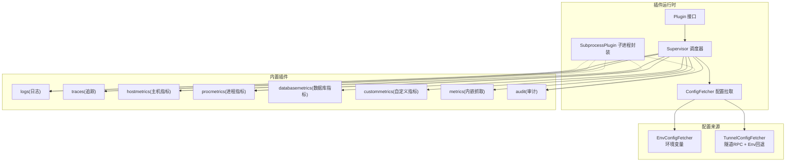
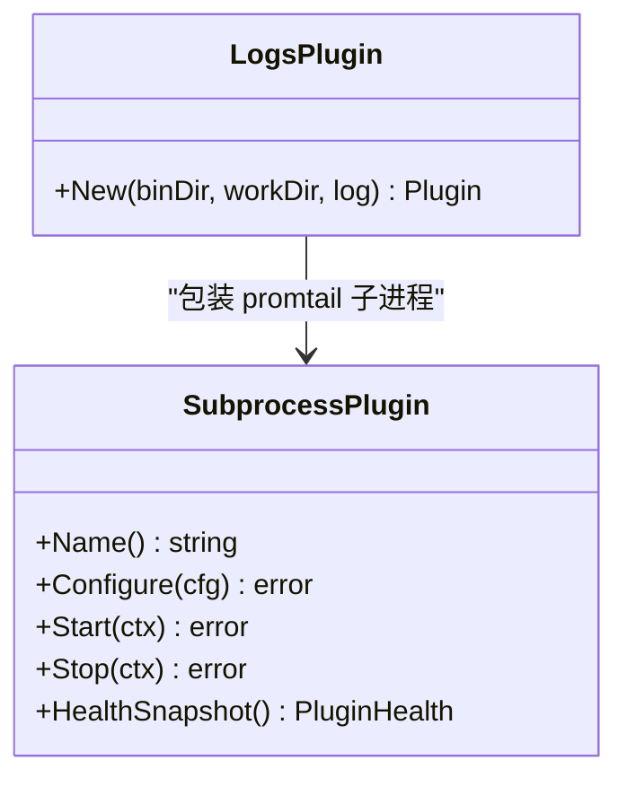
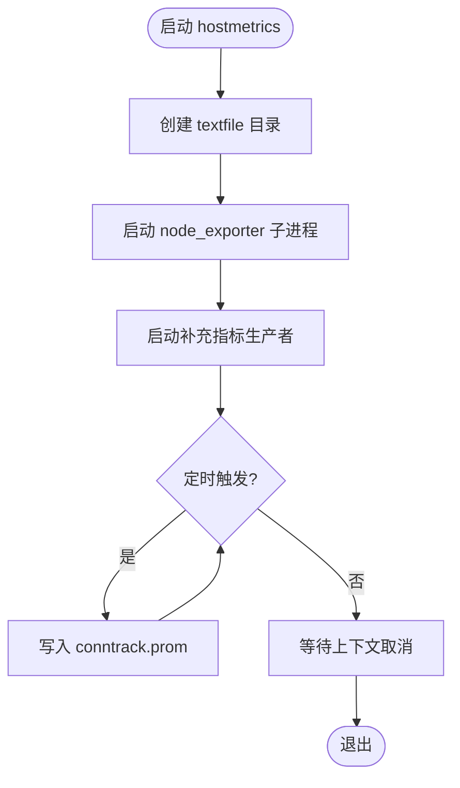
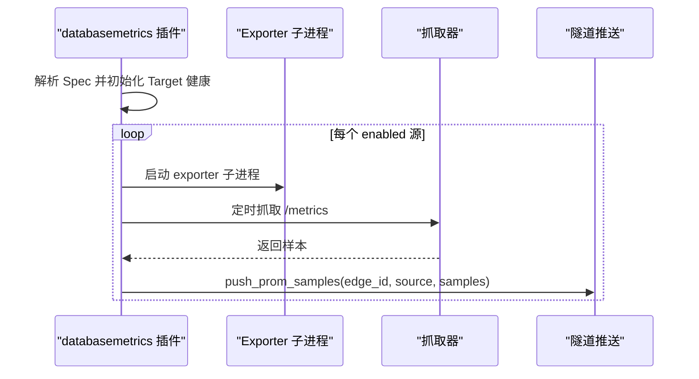
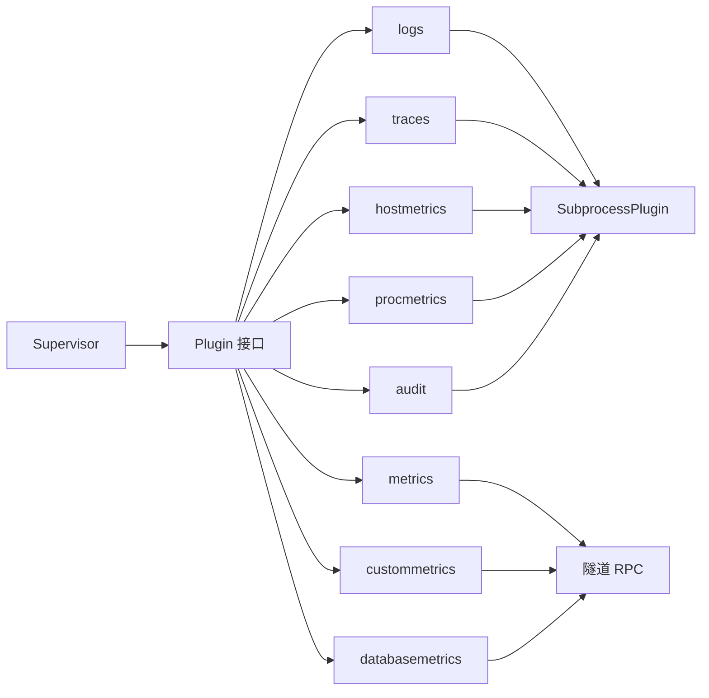
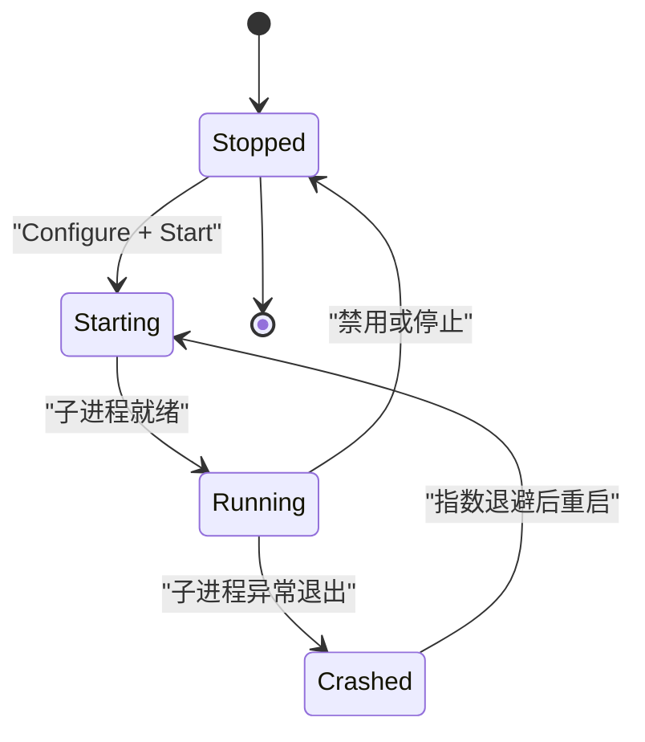

# 内置插件详解

<cite>
**本文引用的文件**   
- [internal/edgeagent/plugins/plugin.go](file://internal/edgeagent/plugins/plugin.go)
- [internal/edgeagent/plugins/supervisor.go](file://internal/edgeagent/plugins/supervisor.go)
- [internal/edgeagent/plugins/subprocess.go](file://internal/edgeagent/plugins/subprocess.go)
- [internal/edgeagent/plugins/config_env.go](file://internal/edgeagent/plugins/config_env.go)
- [internal/edgeagent/plugins/config_tunnel.go](file://internal/edgeagent/plugins/config_tunnel.go)
- [internal/edgeagent/plugins/logs/plugin.go](file://internal/edgeagent/plugins/logs/plugin.go)
- [internal/edgeagent/plugins/hostmetrics/plugin.go](file://internal/edgeagent/plugins/hostmetrics/plugin.go)
- [internal/edgeagent/plugins/procmetrics/plugin.go](file://internal/edgeagent/plugins/procmetrics/plugin.go)
- [internal/edgeagent/plugins/databasemetrics/plugin.go](file://internal/edgeagent/plugins/databasemetrics/plugin.go)
- [internal/edgeagent/plugins/custommetrics/plugin.go](file://internal/edgeagent/plugins/custommetrics/plugin.go)
- [internal/edgeagent/plugins/traces/plugin.go](file://internal/edgeagent/plugins/traces/plugin.go)
- [internal/edgeagent/plugins/metrics/plugin.go](file://internal/edgeagent/plugins/metrics/plugin.go)
- [internal/edgeagent/plugins/audit/plugin.go](file://internal/edgeagent/plugins/audit/plugin.go)
</cite>

## 目录
1. [简介](#简介)
2. [项目结构](#项目结构)
3. [核心组件](#核心组件)
4. [架构总览](#架构总览)
5. [详细组件分析](#详细组件分析)
6. [依赖关系分析](#依赖关系分析)
7. [性能与资源特征](#性能与资源特征)
8. [配置语法、参数校验与默认值](#配置语法参数校验与默认值)
9. [启动顺序与生命周期](#启动顺序与生命周期)
10. [使用示例与最佳实践](#使用示例与最佳实践)
11. [故障排查指南](#故障排查指南)
12. [结论](#结论)

## 简介
本文件面向运维与平台工程师，系统化梳理 ongrid-edge 的内置插件体系，覆盖日志采集、主机指标、进程监控、数据库监控、自定义指标、追踪与审计等能力。文档从架构到实现细节逐层展开，解释插件的工作原理、数据格式与输出规范、配置语法与参数校验、默认值策略、插件间依赖与启动顺序、性能与扩展性考量，并提供使用示例、最佳实践与故障排查建议。

## 项目结构
插件子系统位于 internal/edgeagent/plugins 下，采用“统一接口 + 子进程封装 + 多实现”的分层设计：
- 统一接口与运行时：Plugin 接口、Supervisor 调度器、SubprocessPlugin 通用子进程封装、ConfigFetcher 配置拉取抽象
- 具体插件实现：logs、traces、hostmetrics、procmetrics、custommetrics、databasemetrics、metrics、audit
- 配置来源：环境变量回退与环境变量+隧道双源组合



图表来源
- [internal/edgeagent/plugins/plugin.go:18-52](file://internal/edgeagent/plugins/plugin.go#L18-L52)
- [internal/edgeagent/plugins/supervisor.go:12-47](file://internal/edgeagent/plugins/supervisor.go#L12-L47)
- [internal/edgeagent/plugins/subprocess.go:17-50](file://internal/edgeagent/plugins/subprocess.go#L17-L50)
- [internal/edgeagent/plugins/config_env.go:10-34](file://internal/edgeagent/plugins/config_env.go#L10-L34)
- [internal/edgeagent/plugins/config_tunnel.go:12-34](file://internal/edgeagent/plugins/config_tunnel.go#L12-L34)

章节来源
- [internal/edgeagent/plugins/plugin.go:1-119](file://internal/edgeagent/plugins/plugin.go#L1-L119)
- [internal/edgeagent/plugins/supervisor.go:1-276](file://internal/edgeagent/plugins/supervisor.go#L1-L276)
- [internal/edgeagent/plugins/subprocess.go:1-318](file://internal/edgeagent/plugins/subprocess.go#L1-L318)
- [internal/edgeagent/plugins/config_env.go:1-101](file://internal/edgeagent/plugins/config_env.go#L1-L101)
- [internal/edgeagent/plugins/config_tunnel.go:1-138](file://internal/edgeagent/plugins/config_tunnel.go#L1-L138)

## 核心组件
- Plugin 接口：定义 Name/Configure/Start/Stop/HealthSnapshot 五步生命周期，支持在进程内运行或子进程运行两种形态。
- Supervisor：注册插件、周期拉取配置、对比差异并执行 Configure/Start/Stop，收集健康状态上报。
- SubprocessPlugin：通用子进程封装，负责渲染配置、写磁盘、启动/停止子进程、崩溃指数退避重启、PID/时间戳/错误信息维护。
- ConfigFetcher：抽象配置来源，提供 Env/Tunnel 两种实现；Tunnel 失败时自动回退到 Env，保证冷启动与网络分区时的可用性。

章节来源
- [internal/edgeagent/plugins/plugin.go:18-119](file://internal/edgeagent/plugins/plugin.go#L18-L119)
- [internal/edgeagent/plugins/supervisor.go:12-133](file://internal/edgeagent/plugins/supervisor.go#L12-L133)
- [internal/edgeagent/plugins/subprocess.go:17-133](file://internal/edgeagent/plugins/subprocess.go#L17-L133)
- [internal/edgeagent/plugins/config_env.go:10-71](file://internal/edgeagent/plugins/config_env.go#L10-L71)
- [internal/edgeagent/plugins/config_tunnel.go:12-108](file://internal/edgeagent/plugins/config_tunnel.go#L12-L108)

## 架构总览
下图展示 Supervisor 如何协调多个插件，以及两类数据面路径：
- 直接推送型（logs/traces）：子进程直连管理端数据平面
- 内嵌抓取/导出型（metrics/hostmetrics/procmetrics/custommetrics/databasemetrics/audit）：通过本地抓取或子进程导出后，经隧道 RPC 推送到管理端

```mermaid
sequenceDiagram
participant M as "管理器"
participant S as "Supervisor"
participant F as "ConfigFetcher"
participant L as "logs 插件"
participant T as "traces 插件"
participant H as "hostmetrics 插件"
participant C as "custommetrics 插件"
participant D as "databasemetrics 插件"
participant A as "audit 插件"
M-->>F : 推送插件配置
S->>F : Fetch()
F-->>S : map[plugin]PluginConfig
loop 每个已启用插件
S->>L : Configure/Start (子进程 promtail)
S->>T : Configure/Start (子进程 otelcol)
S->>H : Configure/Start (子进程 node_exporter)
S->>C : Configure/Start (内嵌抓取循环)
S->>D : Configure/Start (每源一个 exporter 子进程)
S->>A : Configure/Start (子进程 auditbeat)
end
Note over L,T : 子进程直连数据平面推送
Note over H,C,D,A : 经隧道 RPC 推送样本
```

图表来源
- [internal/edgeagent/plugins/supervisor.go:135-230](file://internal/edgeagent/plugins/supervisor.go#L135-L230)
- [internal/edgeagent/plugins/logs/plugin.go:27-53](file://internal/edgeagent/plugins/logs/plugin.go#L27-L53)
- [internal/edgeagent/plugins/traces/plugin.go:31-47](file://internal/edgeagent/plugins/traces/plugin.go#L31-L47)
- [internal/edgeagent/plugins/hostmetrics/plugin.go:62-93](file://internal/edgeagent/plugins/hostmetrics/plugin.go#L62-L93)
- [internal/edgeagent/plugins/custommetrics/plugin.go:45-96](file://internal/edgeagent/plugins/custommetrics/plugin.go#L45-L96)
- [internal/edgeagent/plugins/databasemetrics/plugin.go:53-106](file://internal/edgeagent/plugins/databasemetrics/plugin.go#L53-L106)
- [internal/edgeagent/plugins/audit/plugin.go:46-74](file://internal/edgeagent/plugins/audit/plugin.go#L46-L74)

## 详细组件分析

### 日志采集插件（logs）
- 工作原理：基于 SubprocessPlugin 包装 Promtail 子进程。Supervisor 调用 Configure 渲染 promtail.yaml 并写入工作目录，Start 启动子进程，子进程直接推送日志至管理端数据平面。
- 数据格式与输出：Promtail 标准 JSON/文本日志流，按 Loki 协议推送；位置文件 positions.yaml 持久化于同目录，避免重启丢失游标。
- 配置项（Spec）：由 logs/render 解析，典型包括 journald units、文件路径列表等（以 manager 下发的 spec 为准）。
- 关键行为：
  - 自动发现审计插件输出的 JSONL 文件路径，无需额外配置即可将审计事件纳入 Loki。
  - 子进程崩溃指数退避重启，健康状态包含 PID、StartedAt、LastError。
- 依赖关系：与 audit 插件存在隐式协作（共享 workDir 下的 JSONL 输出路径）。



图表来源
- [internal/edgeagent/plugins/subprocess.go:17-133](file://internal/edgeagent/plugins/subprocess.go#L17-L133)
- [internal/edgeagent/plugins/logs/plugin.go:27-53](file://internal/edgeagent/plugins/logs/plugin.go#L27-L53)

章节来源
- [internal/edgeagent/plugins/logs/plugin.go:1-54](file://internal/edgeagent/plugins/logs/plugin.go#L1-L54)
- [internal/edgeagent/plugins/subprocess.go:104-133](file://internal/edgeagent/plugins/subprocess.go#L104-L133)

### 主机指标插件（hostmetrics）
- 工作原理：包装 node_exporter 子进程，暴露 /metrics 供 Prometheus 抓取；同时内嵌一个补充指标生产者，定期向 textfile 目录写入 conntrack 相关指标，解决新版内核路径变更导致的缺失问题。
- 数据格式与输出：Prometheus 文本格式；textfile 目录由 node_exporter 的 textfile collector 自动消费。
- 配置项（Spec）：
  - listen_address：监听地址，默认 :9102
  - collectors_enabled/disabled：启用/禁用特定收集器
  - extra_args：透传额外参数
- 关键行为：
  - 若旧内核路径存在则跳过自产 conntrack 指标，避免重复采样冲突。
  - 子进程崩溃指数退避重启。



图表来源
- [internal/edgeagent/plugins/hostmetrics/plugin.go:62-148](file://internal/edgeagent/plugins/hostmetrics/plugin.go#L62-L148)
- [internal/edgeagent/plugins/hostmetrics/plugin.go:150-231](file://internal/edgeagent/plugins/hostmetrics/plugin.go#L150-L231)

章节来源
- [internal/edgeagent/plugins/hostmetrics/plugin.go:1-277](file://internal/edgeagent/plugins/hostmetrics/plugin.go#L1-L277)

### 进程监控插件（procmetrics）
- 工作原理：包装 process-exporter 子进程，根据 YAML 配置对进程进行分组与匹配，暴露 per-process 指标。
- 数据格式与输出：Prometheus 文本格式。
- 配置项（Spec）：
  - listen_address：监听地址，默认 :9256
  - process_names：匹配规则列表，透传给 process-exporter YAML
- 关键行为：
  - 未提供 process_names 时使用默认“按 comm 分组”的兜底规则，确保上线即有数据。
  - 子进程崩溃指数退避重启。

章节来源
- [internal/edgeagent/plugins/procmetrics/plugin.go:1-128](file://internal/edgeagent/plugins/procmetrics/plugin.go#L1-L128)

### 数据库监控插件（databasemetrics）
- 工作原理：为每个数据库源启动一个 exporter 子进程，读取本地受管密钥文件，周期性抓取 /metrics，并通过隧道 RPC push_prom_samples 推送样本。
- 数据格式与输出：Prometheus 文本格式；附带 up 样本标记目标可达性。
- 配置项（Spec）：
  - sources[]：每项包含 id/name/db_type/connection.path/interval/timeout/enabled 等字段
  - connection.path：指向边缘侧受管密钥文件（权限需严格）
- 关键行为：
  - 每源独立 goroutine 管理，崩溃指数退避重启。
  - 健康状态包含 Targets 列表，显示各源的 samples、last_success_at、last_error 等。
  - 安全校验：拒绝目录、空文件、权限过宽等不合规密钥文件。



图表来源
- [internal/edgeagent/plugins/databasemetrics/plugin.go:145-218](file://internal/edgeagent/plugins/databasemetrics/plugin.go#L145-L218)
- [internal/edgeagent/plugins/databasemetrics/plugin.go:220-324](file://internal/edgeagent/plugins/databasemetrics/plugin.go#L220-L324)

章节来源
- [internal/edgeagent/plugins/databasemetrics/plugin.go:1-403](file://internal/edgeagent/plugins/databasemetrics/plugin.go#L1-L403)

### 自定义指标插件（custommetrics）
- 工作原理：内嵌抓取器，按 Spec 中配置的多个 /metrics URL 周期性抓取，并通过隧道 RPC push_prom_samples 推送样本。
- 数据格式与输出：Prometheus 文本格式；附带 up 样本。
- 配置项（Spec）：targets[]，每项包含 id/name/url/interval/timeout/enabled 等字段。
- 关键行为：
  - 每目标独立 goroutine，崩溃指数退避重启。
  - 健康状态包含 Targets 列表，记录 samples、last_success_at、last_error 等。

章节来源
- [internal/edgeagent/plugins/custommetrics/plugin.go:1-291](file://internal/edgeagent/plugins/custommetrics/plugin.go#L1-L291)

### 追踪插件（traces）
- 工作原理：包装 otelcol-contrib 子进程，接收本地应用 OTLP gRPC/HTTP，直接推送至管理端数据平面。
- 数据格式与输出：OTLP traces 协议。
- 配置项（Spec）：由 traces/render 解析，典型包括 receivers/exporters/processors 等 OTel 配置片段。
- 关键行为：子进程崩溃指数退避重启，健康状态包含 PID、StartedAt、LastError。

章节来源
- [internal/edgeagent/plugins/traces/plugin.go:1-48](file://internal/edgeagent/plugins/traces/plugin.go#L1-L48)

### 审计插件（audit）
- 工作原理：包装 auditbeat 子进程，输出审计事件 JSONL 到工作目录下的固定路径；logs 插件可自动发现并采集该文件。
- 数据格式与输出：JSONL 事件文件，随后被 logs 插件采集并推送至 Loki。
- 关键行为：
  - 仅 Linux 可用；在非 Linux 环境下保持 disabled/crashed 直至替换为自定义构建。
  - 输出路径稳定，作为 logs 与 audit 之间的契约。

章节来源
- [internal/edgeagent/plugins/audit/plugin.go:1-92](file://internal/edgeagent/plugins/audit/plugin.go#L1-L92)

### 内嵌指标插件（metrics）
- 工作原理：在 ongrid-edge 进程内周期性抓取本地 /metrics（默认 node_exporter），解析 Prometheus 文本格式，通过隧道 RPC push_prom_samples 推送样本。
- 数据格式与输出：Prometheus 文本格式；source 标签形如 "metrics:<host>:<port>"。
- 配置项（Spec）：
  - target_url：抓取地址，默认 http://127.0.0.1:9100/metrics
  - scrape_interval/scrape_timeout：抓取间隔与超时
  - tls_insecure/bearer_token：HTTPS 与认证头
  - extra_labels：合并到每条样本的标签集
- 关键行为：
  - 首次立即抓取一次，再按间隔循环。
  - edge_id=0 时延迟推送，直到 register_edge 完成。

章节来源
- [internal/edgeagent/plugins/metrics/plugin.go:1-306](file://internal/edgeagent/plugins/metrics/plugin.go#L1-L306)

## 依赖关系分析
- 插件与 Supervisor：所有插件均实现 Plugin 接口，由 Supervisor 统一注册、调度与生命周期管理。
- 子进程插件：logs/traces/hostmetrics/procmetrics/audit 通过 SubprocessPlugin 管理二进制、配置渲染与崩溃恢复。
- 内嵌插件：metrics/custommetrics/databasemetrics 在进程内运行，依赖隧道客户端进行样本推送。
- 配置来源：TunnelConfigFetcher 优先从管理器获取配置，失败时回退到 EnvConfigFetcher；两者都遵循相同的 PluginConfig 结构。
- 插件间耦合：
  - audit 与 logs 通过约定路径（workDir/audit/audit.jsonl）协作，无需显式配置。
  - hostmetrics 的 textfile 目录由 node_exporter 自动消费，形成“内嵌生产者 + 子进程消费者”的组合。



图表来源
- [internal/edgeagent/plugins/plugin.go:18-52](file://internal/edgeagent/plugins/plugin.go#L18-L52)
- [internal/edgeagent/plugins/subprocess.go:17-50](file://internal/edgeagent/plugins/subprocess.go#L17-L50)
- [internal/edgeagent/plugins/metrics/plugin.go:51-62](file://internal/edgeagent/plugins/metrics/plugin.go#L51-L62)
- [internal/edgeagent/plugins/custommetrics/plugin.go:25-43](file://internal/edgeagent/plugins/custommetrics/plugin.go#L25-L43)
- [internal/edgeagent/plugins/databasemetrics/plugin.go:31-51](file://internal/edgeagent/plugins/databasemetrics/plugin.go#L31-L51)

章节来源
- [internal/edgeagent/plugins/plugin.go:18-119](file://internal/edgeagent/plugins/plugin.go#L18-L119)
- [internal/edgeagent/plugins/subprocess.go:17-133](file://internal/edgeagent/plugins/subprocess.go#L17-L133)
- [internal/edgeagent/plugins/metrics/plugin.go:51-102](file://internal/edgeagent/plugins/metrics/plugin.go#L51-L102)
- [internal/edgeagent/plugins/custommetrics/plugin.go:25-63](file://internal/edgeagent/plugins/custommetrics/plugin.go#L25-L63)
- [internal/edgeagent/plugins/databasemetrics/plugin.go:31-73](file://internal/edgeagent/plugins/databasemetrics/plugin.go#L31-L73)

## 性能与资源特征
- 子进程隔离：logs/traces/hostmetrics/procmetrics/audit 以独立进程运行，崩溃不影响主进程，便于隔离与重启。
- 崩溃恢复：子进程非预期退出采用指数退避（1s→2s→…上限 5min），降低风暴风险。
- 内存与 CPU：
  - metrics/custommetrics/databasemetrics 为轻量抓取器，主要开销在网络 I/O 与解析。
  - hostmetrics 的 textfile 生产者每 15s 写入一次，I/O 开销可控。
- 磁盘空间：
  - 子进程日志与位置文件位于各自 workDir，注意磁盘配额与轮转策略。
- 可扩展性：
  - 新增插件只需实现 Plugin 接口并注册；子进程类插件复用 SubprocessPlugin，减少样板代码。
  - 配置来源可插拔（Env/Tunnel），便于不同部署模式切换。

章节来源
- [internal/edgeagent/plugins/subprocess.go:194-235](file://internal/edgeagent/plugins/subprocess.go#L194-L235)
- [internal/edgeagent/plugins/hostmetrics/plugin.go:53-57](file://internal/edgeagent/plugins/hostmetrics/plugin.go#L53-L57)

## 配置语法、参数校验与默认值
- 全局配置结构（PluginConfig）：
  - enabled：是否启用
  - edge_id：设备标识，用于标签注入
  - endpoint/auth_user/auth_pass：数据平面推送地址与鉴权（由 fetcher 填充）
  - spec：插件特定 JSON 设置
- 配置来源：
  - EnvConfigFetcher：从环境变量读取 ENABLED/ENDPOINT/AUTH_USER/AUTH_PASS/SPEC_JSON 等键，未知插件忽略，非法 JSON 静默忽略。
  - TunnelConfigFetcher：优先从管理器拉取，失败回退到 Env；edge_id 以环境优先。
- 插件级 Spec 与默认值：
  - hostmetrics：listen_address 默认 :9102；collectors_enabled/disabled/extra_args 可选
  - procmetrics：listen_address 默认 :9256；process_names 默认按 comm 分组
  - custommetrics：targets[] 必填，每项含 id/url/interval/timeout/enabled 等
  - databasemetrics：sources[] 必填，connection.path 必须存在且权限严格
  - metrics：target_url 默认 127.0.0.1:9100/metrics；scrape_interval 默认 15s；scrape_timeout 默认 5s；tls_insecure/bearer_token/extra_labels 可选
- 参数校验：
  - 各插件 Configure 阶段解析并校验 Spec，非法配置导致插件进入 crashed 状态，但不影响其他插件。
  - databasemetrics 对密钥文件进行路径/权限/非空校验。

章节来源
- [internal/edgeagent/plugins/plugin.go:54-69](file://internal/edgeagent/plugins/plugin.go#L54-L69)
- [internal/edgeagent/plugins/config_env.go:10-71](file://internal/edgeagent/plugins/config_env.go#L10-L71)
- [internal/edgeagent/plugins/config_tunnel.go:12-108](file://internal/edgeagent/plugins/config_tunnel.go#L12-L108)
- [internal/edgeagent/plugins/hostmetrics/plugin.go:22-28](file://internal/edgeagent/plugins/hostmetrics/plugin.go#L22-L28)
- [internal/edgeagent/plugins/procmetrics/plugin.go:5-12](file://internal/edgeagent/plugins/procmetrics/plugin.go#L5-L12)
- [internal/edgeagent/plugins/custommetrics/plugin.go:1-7](file://internal/edgeagent/plugins/custommetrics/plugin.go#L1-L7)
- [internal/edgeagent/plugins/databasemetrics/plugin.go:326-349](file://internal/edgeagent/plugins/databasemetrics/plugin.go#L326-L349)
- [internal/edgeagent/plugins/metrics/plugin.go:23-35](file://internal/edgeagent/plugins/metrics/plugin.go#L23-L35)

## 启动顺序与生命周期
- 生命周期顺序：Configure → Start → HealthSnapshot（周期）→ Stop
- Supervisor 调度：
  - 初始拉取配置并 Apply
  - 周期 tick（默认 60s）或收到 reload 信号时重新拉取并 Apply
  - 新增启用：Configure + Start
  - 配置变化：先 Configure，再按需 Stop + Start
  - 禁用：Stop
- 子进程启动：
  - 检查二进制存在，创建工作目录，渲染配置（如有），启动子进程
  - 捕获 stdout/stderr 到插件日志文件
  - 非零退出或意外干净退出视为崩溃，指数退避重启
- 健康上报：
  - 包含 name/state/last_error/restart_count/pid/started_at/updated_at/targets
  - 多目标插件（custommetrics/databasemetrics）在 targets 中列出各目标状态



图表来源
- [internal/edgeagent/plugins/plugin.go:71-93](file://internal/edgeagent/plugins/plugin.go#L71-L93)
- [internal/edgeagent/plugins/supervisor.go:135-230](file://internal/edgeagent/plugins/supervisor.go#L135-L230)
- [internal/edgeagent/plugins/subprocess.go:194-235](file://internal/edgeagent/plugins/subprocess.go#L194-L235)

章节来源
- [internal/edgeagent/plugins/plugin.go:18-93](file://internal/edgeagent/plugins/plugin.go#L18-L93)
- [internal/edgeagent/plugins/supervisor.go:112-230](file://internal/edgeagent/plugins/supervisor.go#L112-L230)
- [internal/edgeagent/plugins/subprocess.go:135-235](file://internal/edgeagent/plugins/subprocess.go#L135-L235)

## 使用示例与最佳实践
- 启用方式
  - 通过管理器下发插件配置（TunnelConfigFetcher），或在开发/离线模式下通过环境变量（EnvConfigFetcher）启用。
- 日志采集
  - 启用 logs 插件并确保 endpoint 指向管理端 Loki 入口；如需审计事件，启用 audit 插件并与 logs 共享 workDir。
- 主机与进程指标
  - hostmetrics 默认监听 :9102，可通过 spec 调整监听地址与收集器；procmetrics 默认 :9256，可按需配置 process_names。
- 数据库与自定义指标
  - 为每个目标配置独立的 id/name/url/interval/timeout/enabled；确保网络可达与鉴权正确。
- 追踪
  - 启用 traces 插件并在应用中配置 OTLP 出口指向本地 otelcol 端口。
- 最佳实践
  - 合理设置 scrape_interval 与 timeout，避免过度抓取造成抖动。
  - 对敏感凭据使用 databasemetrics 的受管密钥文件，严格限制文件权限。
  - 利用 health snapshot 与 restart_count 监控插件稳定性。

章节来源
- [internal/edgeagent/plugins/config_env.go:10-71](file://internal/edgeagent/plugins/config_env.go#L10-L71)
- [internal/edgeagent/plugins/config_tunnel.go:12-108](file://internal/edgeagent/plugins/config_tunnel.go#L12-L108)
- [internal/edgeagent/plugins/hostmetrics/plugin.go:22-28](file://internal/edgeagent/plugins/hostmetrics/plugin.go#L22-L28)
- [internal/edgeagent/plugins/procmetrics/plugin.go:5-12](file://internal/edgeagent/plugins/procmetrics/plugin.go#L5-L12)
- [internal/edgeagent/plugins/custommetrics/plugin.go:1-7](file://internal/edgeagent/plugins/custommetrics/plugin.go#L1-L7)
- [internal/edgeagent/plugins/databasemetrics/plugin.go:326-349](file://internal/edgeagent/plugins/databasemetrics/plugin.go#L326-L349)
- [internal/edgeagent/plugins/traces/plugin.go:1-11](file://internal/edgeagent/plugins/traces/plugin.go#L1-L11)

## 故障排查指南
- 插件始终处于 stopped/crashed
  - 检查 Supervisor 日志中的 “starting/stopping plugin”、“configure failed/start failed” 等条目
  - 确认二进制是否存在、工作目录可写、配置渲染成功
- 子进程频繁重启
  - 查看插件日志文件（workDir/<name>.log），定位子进程内部错误
  - 关注崩溃退避策略与 restart_count 增长
- 指标无数据
  - 确认 target_url 可达、鉴权正确、抓取超时合理
  - 检查 edge_id 是否为 0（尚未完成注册），此时会延迟推送
- 数据库指标失败
  - 检查 connection.path 是否存在、非空、权限严格（0600 或更严）
  - 观察 targets 的 last_error 与 last_success_at
- 审计事件未入库
  - 确认 audit 插件输出路径与 logs 插件自动发现路径一致（workDir/audit/audit.jsonl）
  - 验证文件系统权限与 SELinux/AppArmor 策略

章节来源
- [internal/edgeagent/plugins/supervisor.go:135-230](file://internal/edgeagent/plugins/supervisor.go#L135-L230)
- [internal/edgeagent/plugins/subprocess.go:237-287](file://internal/edgeagent/plugins/subprocess.go#L237-L287)
- [internal/edgeagent/plugins/metrics/plugin.go:246-282](file://internal/edgeagent/plugins/metrics/plugin.go#L246-L282)
- [internal/edgeagent/plugins/databasemetrics/plugin.go:326-349](file://internal/edgeagent/plugins/databasemetrics/plugin.go#L326-L349)
- [internal/edgeagent/plugins/audit/plugin.go:76-92](file://internal/edgeagent/plugins/audit/plugin.go#L76-L92)

## 结论
本插件体系以统一的 Plugin 接口与 Supervisor 调度为核心，结合 SubprocessPlugin 与多配置来源，实现了高内聚、低耦合的可观测能力扩展。通过合理的配置与参数调优，可在保障稳定性的前提下高效采集日志、指标与追踪数据，并以最小侵入的方式集成现有生态工具链。建议在大规模部署中结合健康快照与崩溃退避策略，持续监控插件运行质量，并根据业务需求灵活扩展新的采集目标与处理逻辑。