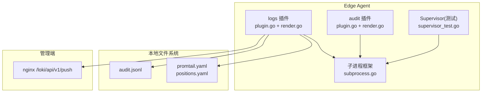
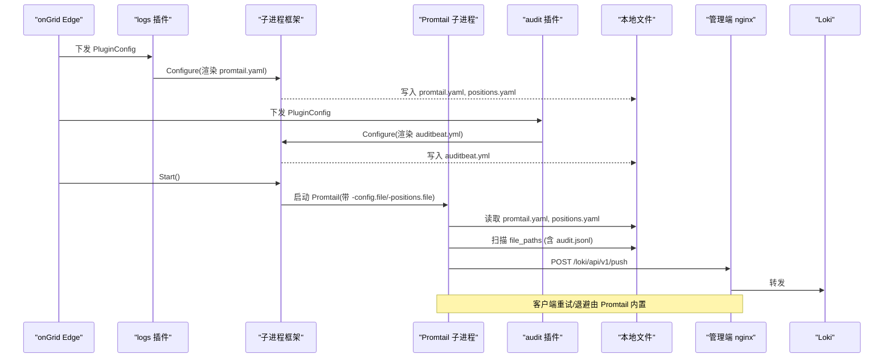
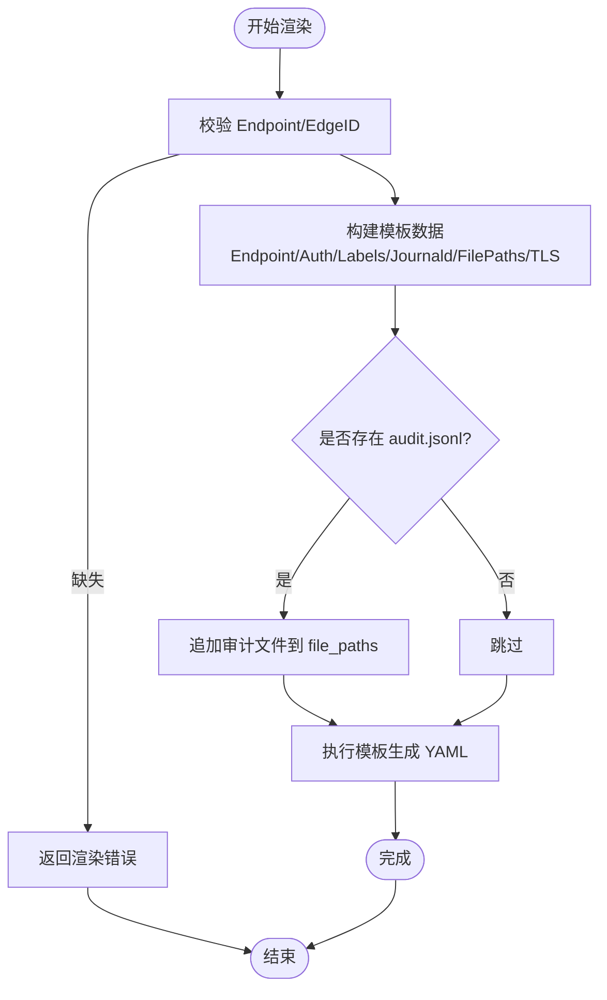
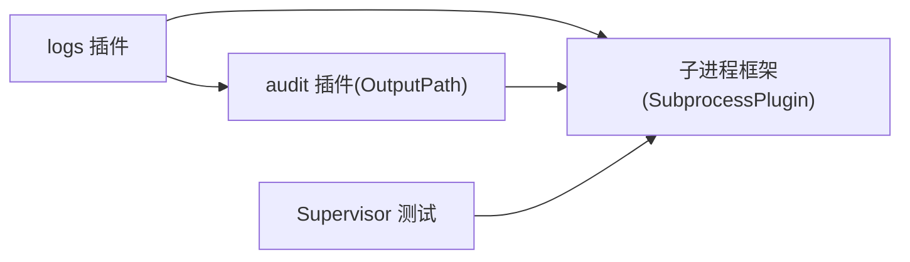

# 日志采集插件

<cite>
**本文引用的文件**   
- [internal/edgeagent/plugins/logs/plugin.go](file://internal/edgeagent/plugins/logs/plugin.go)
- [internal/edgeagent/plugins/logs/render.go](file://internal/edgeagent/plugins/logs/render.go)
- [internal/edgeagent/plugins/audit/plugin.go](file://internal/edgeagent/plugins/audit/plugin.go)
- [internal/edgeagent/plugins/audit/render.go](file://internal/edgeagent/plugins/audit/render.go)
- [internal/edgeagent/plugins/subprocess.go](file://internal/edgeagent/plugins/subprocess.go)
- [internal/edgeagent/plugins/supervisor_test.go](file://internal/edgeagent/plugins/supervisor_test.go)
- [internal/edgeagent/plugins/logs/render_test.go](file://internal/edgeagent/plugins/logs/render_test.go)
</cite>

## 目录
1. [简介](#简介)
2. [项目结构](#项目结构)
3. [核心组件](#核心组件)
4. [架构总览](#架构总览)
5. [详细组件分析](#详细组件分析)
6. [依赖关系分析](#依赖关系分析)
7. [性能与资源优化](#性能与资源优化)
8. [故障恢复与一致性](#故障恢复与一致性)
9. [配置语法与示例](#配置语法与示例)
10. [常见问题排查](#常见问题排查)
11. [结论](#结论)

## 简介
本插件基于 Promtail 实现边缘侧日志采集，由 ongrid-edge 以子进程方式管理，负责：
- 根据管理器下发的 PluginConfig 渲染 Promtail 配置文件
- 启动并守护 Promtail 子进程，直接推送至管理端 nginx /loki/api/v1/push
- 自动发现审计插件输出（audit.jsonl），无需额外编排即可纳入 Loki
- 通过位置文件保证 journald 游标与文件偏移的断点续传和数据一致性

## 项目结构
日志采集相关代码位于 edge agent 的 plugins 目录下，关键文件如下：
- logs 插件：封装 Promtail 子进程、渲染 promtail.yaml、注入设备标识与外部标签
- audit 插件：封装 auditbeat 子进程，输出 JSONL 到固定路径，供 logs 插件自动发现
- 子进程框架：提供统一的配置写入、进程生命周期、崩溃重启与日志捕获能力
- 测试用例：覆盖渲染逻辑与 Supervisor 行为



图表来源
- [internal/edgeagent/plugins/logs/plugin.go:27-53](file://internal/edgeagent/plugins/logs/plugin.go#L27-L53)
- [internal/edgeagent/plugins/logs/render.go:109-189](file://internal/edgeagent/plugins/logs/render.go#L109-L189)
- [internal/edgeagent/plugins/audit/plugin.go:46-92](file://internal/edgeagent/plugins/audit/plugin.go#L46-L92)
- [internal/edgeagent/plugins/subprocess.go:110-133](file://internal/edgeagent/plugins/subprocess.go#L110-L133)
- [internal/edgeagent/plugins/supervisor_test.go:128-184](file://internal/edgeagent/plugins/supervisor_test.go#L128-L184)

章节来源
- [internal/edgeagent/plugins/logs/plugin.go:1-54](file://internal/edgeagent/plugins/logs/plugin.go#L1-L54)
- [internal/edgeagent/plugins/logs/render.go:1-273](file://internal/edgeagent/plugins/logs/render.go#L1-L273)
- [internal/edgeagent/plugins/audit/plugin.go:1-92](file://internal/edgeagent/plugins/audit/plugin.go#L1-L92)
- [internal/edgeagent/plugins/audit/render.go:1-461](file://internal/edgeagent/plugins/audit/render.go#L1-L461)
- [internal/edgeagent/plugins/subprocess.go:1-318](file://internal/edgeagent/plugins/subprocess.go#L1-L318)
- [internal/edgeagent/plugins/supervisor_test.go:128-184](file://internal/edgeagent/plugins/supervisor_test.go#L128-L184)

## 核心组件
- logs 插件
  - 职责：构造 SubprocessPlugin，指定 Promtail 二进制与工作目录；定义配置渲染函数与命令行参数；将 positions.yaml 与 promtail.yaml 放在同一目录，确保重启不丢失游标。
  - 关键点：默认启用 journald；当关闭 journald 且未显式设置 file_paths 时回退到系统日志文件；自动追加审计输出路径。
- audit 插件
  - 职责：构造 SubprocessPlugin，指定 auditbeat 二进制与工作目录；渲染 auditbeat.yml，将 JSONL 输出到 <workDir>/audit/audit.jsonl；暴露 OutputPath 供 logs 插件探测。
  - 关键点：内部路径 path.home/data/logs 被钉在 pluginDir，避免 ProtectSystem=strict 导致 EROFS 启动失败。
- 子进程框架
  - 职责：统一渲染配置、写盘、启动子进程、捕获 stdout/stderr 到插件日志文件、优雅退出（SIGTERM）、指数退避重启、健康状态上报。
  - 关键点：runOnce 使用 exec.CommandContext，Cancel 回调发送 SIGTERM，WaitDelay 作为 SIGKILL 兜底；runLoop 维护 backoff 上限与重启计数。

章节来源
- [internal/edgeagent/plugins/logs/plugin.go:27-53](file://internal/edgeagent/plugins/logs/plugin.go#L27-L53)
- [internal/edgeagent/plugins/audit/plugin.go:46-92](file://internal/edgeagent/plugins/audit/plugin.go#L46-L92)
- [internal/edgeagent/plugins/subprocess.go:110-133](file://internal/edgeagent/plugins/subprocess.go#L110-L133)
- [internal/edgeagent/plugins/subprocess.go:194-287](file://internal/edgeagent/plugins/subprocess.go#L194-L287)

## 架构总览
Promtail 作为独立子进程运行，不经过 ongrid-edge 数据面，直接推送日志到管理端 nginx 代理的 Loki 接收端点。审计插件输出的 JSONL 被 logs 插件自动发现并纳入采集。



图表来源
- [internal/edgeagent/plugins/logs/plugin.go:27-53](file://internal/edgeagent/plugins/logs/plugin.go#L27-L53)
- [internal/edgeagent/plugins/logs/render.go:109-189](file://internal/edgeagent/plugins/logs/render.go#L109-L189)
- [internal/edgeagent/plugins/audit/plugin.go:46-92](file://internal/edgeagent/plugins/audit/plugin.go#L46-L92)
- [internal/edgeagent/plugins/subprocess.go:110-133](file://internal/edgeagent/plugins/subprocess.go#L110-L133)

## 详细组件分析

### logs 插件（Promtail）
- 子进程管理
  - 通过 NewSubprocess 注册名称、二进制路径、工作目录、配置文件路径、渲染函数与命令行参数。
  - 命令行参数包含 -config.file 与 -positions.file，后者与配置文件同目录，确保重启后游标不丢失。
- 配置渲染
  - 模板生成 server.disable=true（仅推送）、clients 指向管理端 push 端点，支持 basic_auth 或 bearer_token，可选 TLS 跳过校验。
  - scrape_configs 默认开启 journald job，可按 unit 白名单过滤；同时按 file_paths 列表生成静态目标，__path__ 指向具体文件。
  - 自动附加 device_id 与 extra_labels；journald 源增加 ongrid_source、unit、identifier、level 等 relabel 标签。
- 审计集成
  - 若 workDir 下存在 audit.OutputPath(workDir)，则自动将其加入 file_paths，无需人工配置。
- 错误处理
  - 缺少 Endpoint 或 EdgeID 会直接返回渲染错误；模板解析/执行错误会被包装返回。



图表来源
- [internal/edgeagent/plugins/logs/render.go:109-189](file://internal/edgeagent/plugins/logs/render.go#L109-L189)
- [internal/edgeagent/plugins/audit/plugin.go:76-92](file://internal/edgeagent/plugins/audit/plugin.go#L76-L92)

章节来源
- [internal/edgeagent/plugins/logs/plugin.go:27-53](file://internal/edgeagent/plugins/logs/plugin.go#L27-L53)
- [internal/edgeagent/plugins/logs/render.go:109-189](file://internal/edgeagent/plugins/logs/render.go#L109-L189)
- [internal/edgeagent/plugins/logs/render_test.go:74-162](file://internal/edgeagent/plugins/logs/render_test.go#L74-L162)

### audit 插件（auditbeat）
- 子进程管理
  - 通过 NewSubprocess 注册名称、二进制路径、工作目录、配置文件路径、渲染函数与命令行参数。
  - 命令行参数包含 -c、-e、--strict.perms=false，便于调试与规避严格权限检查。
- 配置渲染
  - 两种模式：raw_config 透传完整 YAML；structured 模式按模块开关渲染 auditd/file_integrity/system 模块，并输出 JSONL 到 output.file。
  - 内部路径 path.home/data/logs 被钉在 pluginDir，避免 EROFS 启动失败。
  - 处理器注入 ongrid.device_id 与 ongrid.source，并丢弃 host.* 等高基数字段，控制标签基数。
- 输出约定
  - 默认输出文件名 audit.jsonl，路径为 <workDir>/audit/audit.jsonl，供 logs 插件自动发现。

章节来源
- [internal/edgeagent/plugins/audit/plugin.go:46-92](file://internal/edgeagent/plugins/audit/plugin.go#L46-L92)
- [internal/edgeagent/plugins/audit/render.go:130-234](file://internal/edgeagent/plugins/audit/render.go#L130-234)
- [internal/edgeagent/plugins/audit/render.go:298-386](file://internal/edgeagent/plugins/audit/render.go#L298-386)

### 子进程框架（SubprocessPlugin）
- 配置阶段
  - 创建 workDir，调用 ConfigRender 渲染字节并写入 ConfigFile（权限 0600）。
- 启动与停止
  - Start 启动 runLoop；Stop 取消上下文并等待子进程退出，最长等待 15s。
- 运行循环
  - runOnce 使用 exec.CommandContext 启动子进程，绑定工作目录，stdout/stderr 重定向到插件日志文件。
  - 优雅退出：Cancel 回调发送 SIGTERM，WaitDelay 超时后 SIGKILL。
  - 崩溃恢复：非期望退出触发指数退避重启，最大间隔 5 分钟；RestartCount 单调递增，仅在从禁用重新启用时重置。
- 健康快照
  - 记录 State、PID、StartedAt、LastError、UpdatedAt、RestartCount。

```mermaid
classDiagram
class SubprocessPlugin {
-name string
-binary string
-workDir string
-configFile string
-configRender func(...)
-args func(...)
-log Logger
-cfg PluginConfig
-cmd *exec.Cmd
-cancelRun context.CancelFunc
-health PluginHealth
-wantRunning bool
-stoppedCh chan struct{}
+Name() string
+Configure(cfg) error
+Start(ctx) error
+Stop(ctx) error
+HealthSnapshot() PluginHealth
-runLoop(ctx, stopped)
-runOnce(ctx) error
-setState(st, err, pid)
-bumpRestart()
}
```

图表来源
- [internal/edgeagent/plugins/subprocess.go:32-102](file://internal/edgeagent/plugins/subprocess.go#L32-L102)
- [internal/edgeagent/plugins/subprocess.go:110-133](file://internal/edgeagent/plugins/subprocess.go#L110-L133)
- [internal/edgeagent/plugins/subprocess.go:194-287](file://internal/edgeagent/plugins/subprocess.go#L194-L287)

章节来源
- [internal/edgeagent/plugins/subprocess.go:110-133](file://internal/edgeagent/plugins/subprocess.go#L110-L133)
- [internal/edgeagent/plugins/subprocess.go:194-287](file://internal/edgeagent/plugins/subprocess.go#L194-L287)

## 依赖关系分析
- logs 对 audit 的单边依赖
  - logs 渲染器通过 audit.OutputPath(workDir) 探测审计输出文件，存在则追加到 file_paths；audit 不反向依赖 logs。
- 子进程框架通用性
  - logs 与 audit 均复用 SubprocessPlugin，统一了配置渲染、进程生命周期与崩溃恢复策略。
- 测试验证
  - supervisor_test.go 验证了配置变更触发 reconfigure+restart，以及 fetcher 报错时不中断现有运行。



图表来源
- [internal/edgeagent/plugins/logs/render.go:157-161](file://internal/edgeagent/plugins/logs/render.go#L157-L161)
- [internal/edgeagent/plugins/audit/plugin.go:76-92](file://internal/edgeagent/plugins/audit/plugin.go#L76-L92)
- [internal/edgeagent/plugins/subprocess.go:110-133](file://internal/edgeagent/plugins/subprocess.go#L110-L133)
- [internal/edgeagent/plugins/supervisor_test.go:128-184](file://internal/edgeagent/plugins/supervisor_test.go#L128-L184)

章节来源
- [internal/edgeagent/plugins/logs/render.go:157-161](file://internal/edgeagent/plugins/logs/render.go#L157-L161)
- [internal/edgeagent/plugins/audit/plugin.go:76-92](file://internal/edgeagent/plugins/audit/plugin.go#L76-L92)
- [internal/edgeagent/plugins/subprocess.go:110-133](file://internal/edgeagent/plugins/subprocess.go#L110-L133)
- [internal/edgeagent/plugins/supervisor_test.go:128-184](file://internal/edgeagent/plugins/supervisor_test.go#L128-L184)

## 性能与资源优化
- 网络与批处理
  - clients 中配置了 backoff_config（最小周期、最大周期、最大重试次数）、batchsize 与 batchwait，用于控制批量大小与提交频率，降低网络抖动影响。
- 标签基数控制
  - 审计输出通过 drop_fields 移除 host.* 等高基数字段，避免 Loki 标签爆炸；device_id 与 ongrid_source 作为稳定维度。
- journald 默认开启
  - 在 systemd 主机上 journald 自转且自带 unit 标签，减少额外文件 tail 开销；如需自定义应用日志，再添加 file_paths。
- 子进程资源隔离
  - 子进程由 systemd 单元管理，配合 ReadWritePaths 限制可写范围，避免越权写入；子进程日志落盘，便于定位问题。

章节来源
- [internal/edgeagent/plugins/logs/render.go:30-95](file://internal/edgeagent/plugins/logs/render.go#L30-L95)
- [internal/edgeagent/plugins/audit/render.go:107-128](file://internal/edgeagent/plugins/audit/render.go#L107-128)

## 故障恢复与一致性
- 位置文件与断点续传
  - Promtail 的 positions.yaml 与 promtail.yaml 同目录存放，重启后继续从上次偏移读取，保障 journald 游标与文件偏移一致。
- 子进程崩溃恢复
  - 子进程异常退出触发指数退避重启，最大间隔 5 分钟；RestartCount 单调递增，便于观测稳定性。
- 优雅退出
  - Stop 时先发送 SIGTERM，等待最多 15s；若未退出则继续推进，避免阻塞上层关闭流程。
- 配置变更热重载
  - 测试覆盖了配置变更后 Stop→Configure→Start 的流程，确保新配置生效且不丢失运行态。

章节来源
- [internal/edgeagent/plugins/logs/plugin.go:43-50](file://internal/edgeagent/plugins/logs/plugin.go#L43-L50)
- [internal/edgeagent/plugins/subprocess.go:158-183](file://internal/edgeagent/plugins/subprocess.go#L158-L183)
- [internal/edgeagent/plugins/subprocess.go:194-235](file://internal/edgeagent/plugins/subprocess.go#L194-L235)
- [internal/edgeagent/plugins/supervisor_test.go:128-184](file://internal/edgeagent/plugins/supervisor_test.go#L128-L184)

## 配置语法与示例
- 插件配置键（spec）
  - enable_journald: 布尔值，默认 true；设为 false 时关闭 journald 采集。
  - journald_units: 字符串数组，限定采集的 systemd unit 白名单。
  - file_paths: 字符串数组，指定要 tail 的文件路径；当关闭 journald 且为空时回退到系统日志文件。
  - extra_labels: 键值映射，作为外部标签附加到每条日志。
  - tls_insecure_skip_verify: 布尔值，默认 true（自签名证书场景）；使用真实证书时可设为 false。
- 认证与端点
  - Endpoint: 必填，指向管理端 nginx 的 /loki/api/v1/push。
  - AuthUser/AuthPass: 支持 basic_auth 或 bearer_token（二选一）。
- 审计集成
  - 无需额外配置，只要 audit 插件启用并在 workDir 下产出 audit.jsonl，logs 插件会自动发现并采集。
- 参考示例（路径引用）
  - 渲染逻辑与默认行为见：[render.go:109-189](file://internal/edgeagent/plugins/logs/render.go#L109-L189)
  - 单元测试覆盖 enable_journald=false 与单客户端端点校验：[render_test.go:74-162](file://internal/edgeagent/plugins/logs/render_test.go#L74-L162)

章节来源
- [internal/edgeagent/plugins/logs/render.go:109-189](file://internal/edgeagent/plugins/logs/render.go#L109-L189)
- [internal/edgeagent/plugins/logs/render_test.go:74-162](file://internal/edgeagent/plugins/logs/render_test.go#L74-L162)

## 常见问题排查
- 无日志进入 Loki
  - 检查 Endpoint 是否可达，AuthUser/AuthPass 是否正确；确认 Prometheus/Loki 端点未被防火墙拦截。
  - 若启用了 journald 但未见日志，检查 journald_units 白名单是否匹配实际 unit 名。
- 审计日志未出现
  - 确认 audit 插件已启用且成功产出 audit.jsonl；logs 插件会在渲染阶段自动追加该路径。
- 重启后重复采集
  - 确认 positions.yaml 与 promtail.yaml 同目录且未被清理；子进程重启应能续传。
- 子进程频繁重启
  - 查看插件日志文件（<workDir>/<name>.log），关注崩溃原因与退避间隔；必要时调整资源或修复配置。
- 标签基数过高
  - 审计输出已丢弃 host.* 高基数字段；如仍出现基数问题，检查 extra_labels 是否引入不稳定键值。

章节来源
- [internal/edgeagent/plugins/logs/render.go:109-189](file://internal/edgeagent/plugins/logs/render.go#L109-L189)
- [internal/edgeagent/plugins/audit/render.go:107-128](file://internal/edgeagent/plugins/audit/render.go#L107-128)
- [internal/edgeagent/plugins/subprocess.go:194-287](file://internal/edgeagent/plugins/subprocess.go#L194-L287)

## 结论
日志采集插件通过“配置渲染 + 子进程守护”的统一模式，将 Promtail 与 auditbeat 的生命周期与可靠性交给子进程框架管理，实现了开箱即用的 journald 与文件日志采集，以及与审计插件的无缝集成。位置文件与指数退避重启机制保障了断点续传与高可用，标签基数控制与批处理参数提升了整体性能与稳定性。