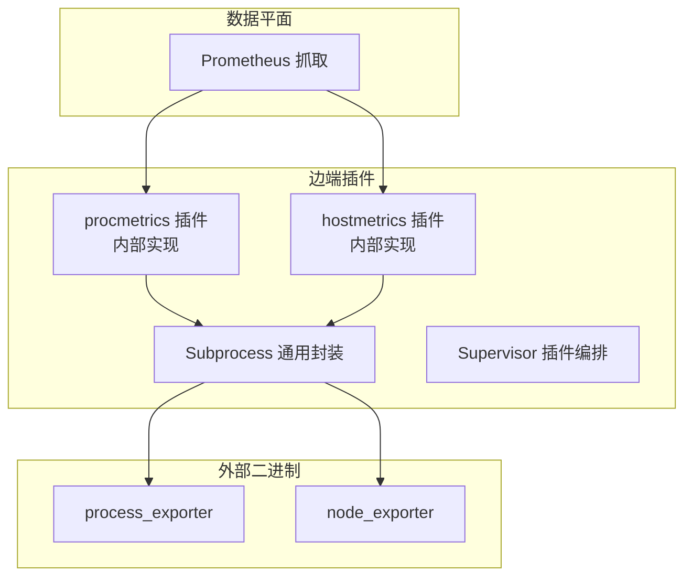
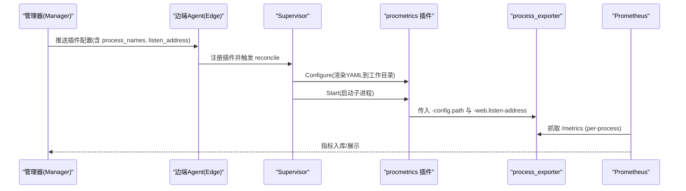
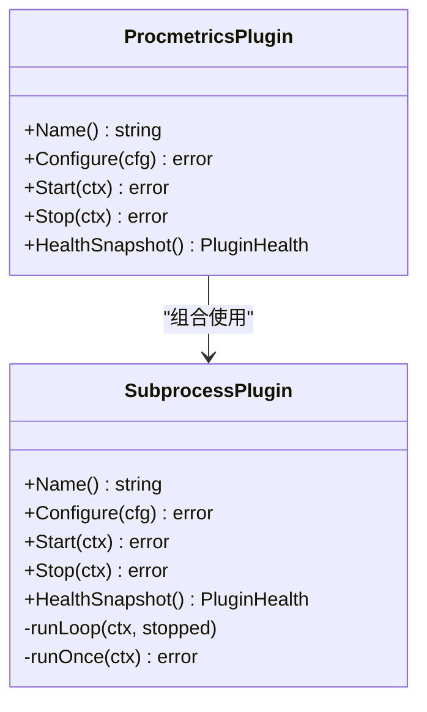
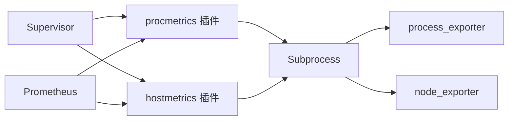

# 进程监控插件

<cite>
**本文引用的文件**   
- [internal/edgeagent/plugins/procmetrics/plugin.go](file://internal/edgeagent/plugins/procmetrics/plugin.go)
- [internal/edgeagent/plugins/hostmetrics/plugin.go](file://internal/edgeagent/plugins/hostmetrics/plugin.go)
- [internal/edgeagent/plugins/subprocess.go](file://internal/edgeagent/plugins/subprocess.go)
- [internal/edgeagent/plugins/supervisor.go](file://internal/edgeagent/plugins/supervisor.go)
- [cmd/ongrid-edge/main.go](file://cmd/ongrid-edge/main.go)
- [deploy/install/prometheus.yml](file://deploy/install/prometheus.yml)
- [web/src/components/monitor/ProcessTopPanel.tsx](file://web/src/components/monitor/ProcessTopPanel.tsx)
</cite>

## 目录
1. [简介](#简介)
2. [项目结构](#项目结构)
3. [核心组件](#核心组件)
4. [架构总览](#架构总览)
5. [详细组件分析](#详细组件分析)
6. [依赖关系分析](#依赖关系分析)
7. [性能与采集策略](#性能与采集策略)
8. [故障诊断与排错](#故障诊断与排错)
9. [结论](#结论)
10. [附录：配置示例与调优建议](#附录配置示例与调优建议)

## 简介
本文件聚焦于“进程监控插件”的实现与使用，围绕进程级指标采集、生命周期管理、过滤与选择机制、快照采集策略以及异常检测与告警联动进行系统化说明。该插件通过边端（Edge Agent）以子进程方式运行 process-exporter，按名称或命令行正则分组暴露 per-process 指标；配合主机指标插件 hostmetrics 与 Prometheus 拉取链路，形成端到端的进程观测能力。

## 项目结构
与进程监控直接相关的代码位于 edge agent 的 plugins 目录下，其中 procmetrics 插件负责进程指标，hostmetrics 插件负责主机指标，subprocess 与 supervisor 提供通用的子进程管理与插件编排能力。

图表来源
- [internal/edgeagent/plugins/procmetrics/plugin.go:1-128](file://internal/edgeagent/plugins/procmetrics/plugin.go#L1-L128)
- [internal/edgeagent/plugins/hostmetrics/plugin.go:1-277](file://internal/edgeagent/plugins/hostmetrics/plugin.go#L1-L277)
- [internal/edgeagent/plugins/subprocess.go:1-318](file://internal/edgeagent/plugins/subprocess.go#L1-L318)
- [internal/edgeagent/plugins/supervisor.go:1-276](file://internal/edgeagent/plugins/supervisor.go#L1-L276)

章节来源
- [cmd/ongrid-edge/main.go](file://cmd/ongrid-edge/main.go)
- [internal/edgeagent/plugins/procmetrics/plugin.go:1-128](file://internal/edgeagent/plugins/procmetrics/plugin.go#L1-L128)
- [internal/edgeagent/plugins/hostmetrics/plugin.go:1-277](file://internal/edgeagent/plugins/hostmetrics/plugin.go#L1-L277)
- [internal/edgeagent/plugins/subprocess.go:1-318](file://internal/edgeagent/plugins/subprocess.go#L1-L318)
- [internal/edgeagent/plugins/supervisor.go:1-276](file://internal/edgeagent/plugins/supervisor.go#L1-L276)

## 核心组件
- 进程指标插件（procmetrics）
  - 通过渲染 YAML 配置文件并启动 process_exporter 子进程，暴露 per-process 指标。
  - 支持 listen_address 与 process_names 两组 Spec 键，前者控制监听端口，后者定义进程分组匹配规则。
- 主机指标插件（hostmetrics）
  - 通过 node_exporter 子进程暴露 node_* 指标，并在进程内补充 textfile 指标（如 conntrack）。
- 子进程通用封装（Subprocess）
  - 统一处理配置渲染、工作目录、参数拼装、日志输出、崩溃重启（指数退避）、健康状态上报等。
- 插件编排器（Supervisor）
  - 周期性从管理器拉取插件配置，比较差异后按需 Configure/Start/Stop，保证期望态与实际态一致。

章节来源
- [internal/edgeagent/plugins/procmetrics/plugin.go:1-128](file://internal/edgeagent/plugins/procmetrics/plugin.go#L1-L128)
- [internal/edgeagent/plugins/hostmetrics/plugin.go:1-277](file://internal/edgeagent/plugins/hostmetrics/plugin.go#L1-L277)
- [internal/edgeagent/plugins/subprocess.go:1-318](file://internal/edgeagent/plugins/subprocess.go#L1-L318)
- [internal/edgeagent/plugins/supervisor.go:1-276](file://internal/edgeagent/plugins/supervisor.go#L1-L276)

## 架构总览
进程监控在 Edge Agent 中以插件形式运行，procmetrics 插件负责进程维度指标，hostmetrics 负责主机维度指标。Prometheus 通过隧道或直连方式抓取这些 /metrics 端点，最终汇聚到远端存储与可视化系统。

图表来源
- [internal/edgeagent/plugins/procmetrics/plugin.go:1-128](file://internal/edgeagent/plugins/procmetrics/plugin.go#L1-L128)
- [internal/edgeagent/plugins/subprocess.go:1-318](file://internal/edgeagent/plugins/subprocess.go#L1-L318)
- [internal/edgeagent/plugins/supervisor.go:1-276](file://internal/edgeagent/plugins/supervisor.go#L1-L276)
- [deploy/install/prometheus.yml:1-200](file://deploy/install/prometheus.yml#L1-L200)

## 详细组件分析

### 进程指标插件（procmetrics）
- 职责
  - 渲染 process-exporter 的 YAML 配置，包含 process_names 列表。
  - 组装 CLI 参数：监听地址与配置文件路径。
  - 通过 Subprocess 启动 process_exporter 子进程。
- 关键行为
  - 默认 process_names 为“按 comm 全量分组”，确保在未收到 manager 推送时也能产出可用序列。
  - 若 Spec 中提供 process_names，则覆盖默认值，允许按名称、PID 或正则表达式进行分组与过滤。
  - 监听地址默认 :9256，避免与主机指标端口冲突。
- 数据结构与复杂度
  - process_names 为数组，元素为 map[string]interface{}，由 manager UI 下发，插件不做强校验，仅透传给 process-exporter。
  - 渲染过程对 process_names 做轻量转换与缩进，时间复杂度 O(N)，N 为 process_names 条目数。
- 错误处理
  - 渲染失败返回错误，阻止配置写入。
  - 子进程启动失败由 Subprocess 记录并指数退避重启。
- 性能考量
  - 不主动扫描进程树，所有遍历与匹配由 process-exporter 完成；插件侧开销极低。
  - 合理设置 process_names 可显著降低指标基数与抓取成本。

图表来源
- [internal/edgeagent/plugins/procmetrics/plugin.go:1-128](file://internal/edgeagent/plugins/procmetrics/plugin.go#L1-L128)
- [internal/edgeagent/plugins/subprocess.go:1-318](file://internal/edgeagent/plugins/subprocess.go#L1-L318)

章节来源
- [internal/edgeagent/plugins/procmetrics/plugin.go:1-128](file://internal/edgeagent/plugins/procmetrics/plugin.go#L1-L128)

### 主机指标插件（hostmetrics）
- 职责
  - 启动 node_exporter 子进程，暴露 node_* 指标。
  - 在进程内定时写入 textfile 指标（例如 nf_conntrack），补齐内核路径变更导致的缺失指标。
- 关键行为
  - 通过 Args 注入 --collector.textfile.directory，使 textfile 指标自动纳入 /metrics。
  - 支持 collectors_enabled / collectors_disabled / extra_args 等 Spec 键，灵活裁剪采集项。
- 错误处理
  - 文本文件写入采用 tmp+rename 原子操作，避免半写导致解析失败。
  - 当旧内核路径存在时，跳过自产以避免重复指标冲突。
- 性能考量
  - 定时器周期与典型抓取间隔对齐，减少无用 I/O。
  - 仅读取必要的 /proc/sys/net/netfilter/* 节点，开销极小。

章节来源
- [internal/edgeagent/plugins/hostmetrics/plugin.go:1-277](file://internal/edgeagent/plugins/hostmetrics/plugin.go#L1-L277)

### 子进程通用封装（Subprocess）
- 职责
  - 统一处理子进程的启动、停止、日志重定向、崩溃重启（指数退避）、健康状态维护。
- 关键行为
  - 启动前检查二进制是否存在，不存在则立即报错。
  - 优雅退出：SIGTERM → WaitDelay 超时后 SIGKILL。
  - 重启策略：1s→2s→4s…上限 5min，重启计数单调递增，仅在禁用→启用重置。
- 错误处理
  - 区分上下文取消与真实退出码，避免误判。
  - 健康状态包含 State、PID、StartedAt、LastError、RestartCount 等字段。
- 性能考量
  - 最小化锁粒度，避免阻塞主循环。
  - 日志落盘而非管道回传，降低内存占用。

章节来源
- [internal/edgeagent/plugins/subprocess.go:1-318](file://internal/edgeagent/plugins/subprocess.go#L1-L318)

### 插件编排器（Supervisor）
- 职责
  - 周期性拉取插件配置，计算差异并 Apply：新增启用、停止禁用、配置变更触发重新 Configure/Start。
- 关键行为
  - 安全网轮询（默认 60s）与信号驱动重载（manager 推送变更）。
  - 每个插件独立错误隔离，单个插件失败不影响其他插件。
- 错误处理
  - 配置拉取失败保持上一份状态，避免震荡。
  - Stop 带超时保护，防止卡死关闭流程。
- 性能考量
  - 配置比较为浅层语义相等，避免深度拷贝带来的额外开销。

章节来源
- [internal/edgeagent/plugins/supervisor.go:1-276](file://internal/edgeagent/plugins/supervisor.go#L1-L276)

## 依赖关系分析
- 进程指标插件依赖 Subprocess 来管理 process_exporter 的生命周期。
- 主机指标插件同样依赖 Subprocess，并额外在进程内产生 textfile 指标。
- Supervisor 统一管理多个插件实例，协调其启停与配置更新。
- Prometheus 作为消费者，通过部署配置抓取各插件暴露的 /metrics。

图表来源
- [internal/edgeagent/plugins/supervisor.go:1-276](file://internal/edgeagent/plugins/supervisor.go#L1-L276)
- [internal/edgeagent/plugins/procmetrics/plugin.go:1-128](file://internal/edgeagent/plugins/procmetrics/plugin.go#L1-L128)
- [internal/edgeagent/plugins/hostmetrics/plugin.go:1-277](file://internal/edgeagent/plugins/hostmetrics/plugin.go#L1-L277)
- [internal/edgeagent/plugins/subprocess.go:1-318](file://internal/edgeagent/plugins/subprocess.go#L1-L318)
- [deploy/install/prometheus.yml:1-200](file://deploy/install/prometheus.yml#L1-L200)

章节来源
- [deploy/install/prometheus.yml:1-200](file://deploy/install/prometheus.yml#L1-L200)

## 性能与采集策略
- 进程过滤与选择机制
  - 通过 process_names 指定匹配规则，支持按名称、PID 或正则表达式进行分组与过滤。
  - 未下发 Spec 时使用默认“按 comm 全量分组”，保证可用性。
  - 建议将高频关注的进程单独分组，避免过多低价值标签导致基数膨胀。
- 快照采集策略
  - 插件侧不主动采样，全部由 process-exporter 与 node_exporter 完成；插件仅负责配置与生命周期。
  - 通过合理配置 process_names 与 node_exporter collectors，控制抓取频率与指标基数。
- 资源影响评估
  - 子进程崩溃重启采用指数退避，避免雪崩。
  - hostmetrics 的 textfile 写入周期与抓取间隔对齐，减少无效 I/O。
- 前端提示
  - 当设备无进程数据时，前端会提示可能因 process_exporter 二进制缺失，引导用户重装或检查插件状态。

章节来源
- [internal/edgeagent/plugins/procmetrics/plugin.go:1-128](file://internal/edgeagent/plugins/procmetrics/plugin.go#L1-L128)
- [internal/edgeagent/plugins/hostmetrics/plugin.go:1-277](file://internal/edgeagent/plugins/hostmetrics/plugin.go#L1-L277)
- [web/src/components/monitor/ProcessTopPanel.tsx:163-187](file://web/src/components/monitor/ProcessTopPanel.tsx#L163-L187)

## 故障诊断与排错
- 常见问题定位
  - 进程数据为空：检查 process_exporter 二进制是否随包安装，确认 procmetrics 插件状态。
  - 指标缺失：核对 process_names 是否正确，必要时调整正则或分组策略。
  - 端口冲突：确认 listen_address 未被占用，避免与 hostmetrics 端口冲突。
- 子进程异常
  - 查看插件工作目录下的 .log 文件，定位崩溃原因。
  - 关注 HealthSnapshot 中的 RestartCount 与 LastError，判断是否频繁重启。
- 配置生效
  - 通过 Supervisor 的 reconcile 日志观察“starting plugin/cfg_changed”等信息，确认配置已应用。
- 抓取链路
  - 验证 Prometheus 抓取目标可达，确认 /metrics 响应正常。

章节来源
- [internal/edgeagent/plugins/subprocess.go:1-318](file://internal/edgeagent/plugins/subprocess.go#L1-L318)
- [internal/edgeagent/plugins/supervisor.go:1-276](file://internal/edgeagent/plugins/supervisor.go#L1-L276)
- [web/src/components/monitor/ProcessTopPanel.tsx:163-187](file://web/src/components/monitor/ProcessTopPanel.tsx#L163-L187)

## 结论
进程监控插件通过轻量化的配置渲染与稳定的子进程管理，实现了高可用、可扩展的 per-process 指标采集。结合 hostmetrics 与 Prometheus 生态，可满足生产环境的进程级观测需求。通过合理的 process_names 设计与采集策略，可在保障可观测性的同时控制系统开销。

## 附录：配置示例与调优建议
- 配置键说明
  - listen_address：字符串，默认 ":9256"，用于 process_exporter 监听地址。
  - process_names：数组，每项为 map，包含 name 与 cmdline 等字段，用于进程分组与过滤。
- 示例思路
  - 基础模式：使用默认 process_names，按 comm 全量分组。
  - 精细模式：针对关键服务（如 nginx、java、python）分别定义 name 与 cmdline 正则，聚合指标并降低基数。
- 调优建议
  - 限制 process_names 数量，避免过多低价值分组。
  - 合理设置抓取间隔与保留策略，控制存储与查询成本。
  - 定期审查 process_names 规则，清理不再使用的分组。
- 故障排查清单
  - 确认 process_exporter 二进制存在且可执行。
  - 检查插件工作目录权限与磁盘空间。
  - 核对 Prometheus 抓取目标与网络连通性。
  - 关注插件健康状态与重启次数，及时处置异常。

章节来源
- [internal/edgeagent/plugins/procmetrics/plugin.go:1-128](file://internal/edgeagent/plugins/procmetrics/plugin.go#L1-L128)
- [internal/edgeagent/plugins/hostmetrics/plugin.go:1-277](file://internal/edgeagent/plugins/hostmetrics/plugin.go#L1-L277)
- [internal/edgeagent/plugins/subprocess.go:1-318](file://internal/edgeagent/plugins/subprocess.go#L1-L318)
- [internal/edgeagent/plugins/supervisor.go:1-276](file://internal/edgeagent/plugins/supervisor.go#L1-L276)
- [deploy/install/prometheus.yml:1-200](file://deploy/install/prometheus.yml#L1-L200)
- [web/src/components/monitor/ProcessTopPanel.tsx:163-187](file://web/src/components/monitor/ProcessTopPanel.tsx#L163-L187)