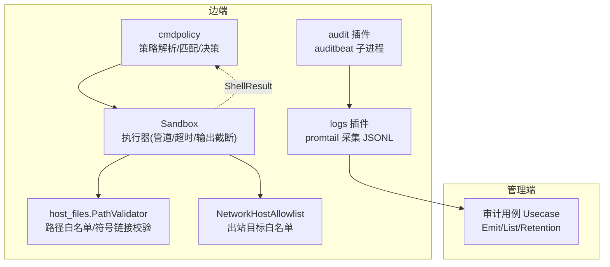
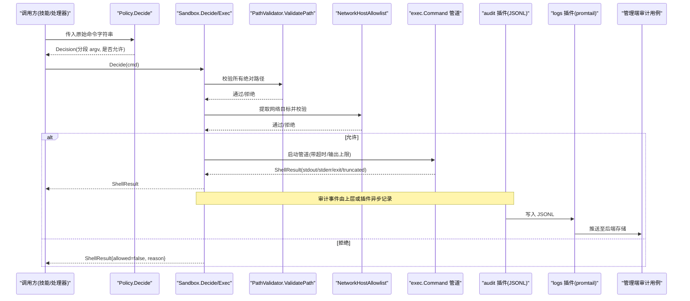
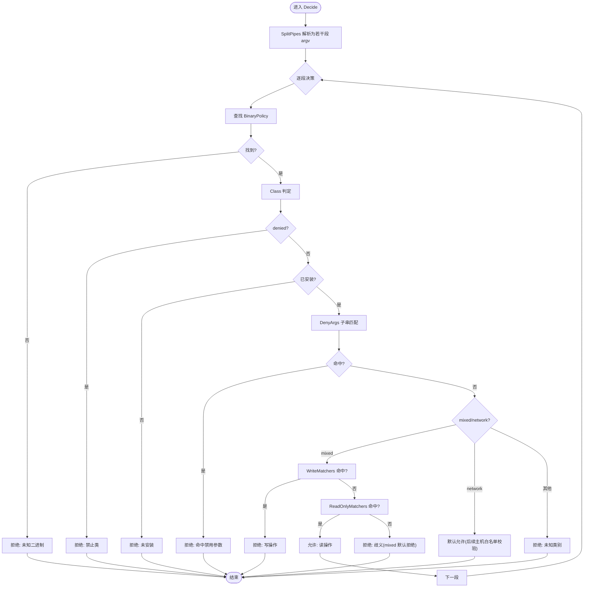
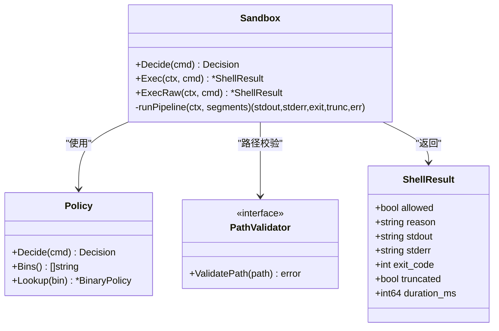
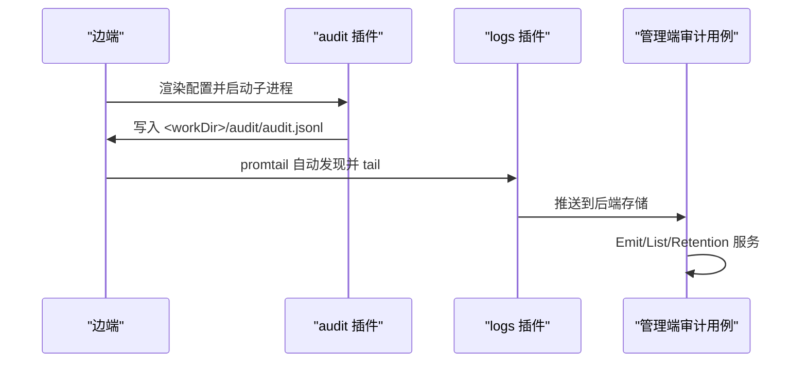
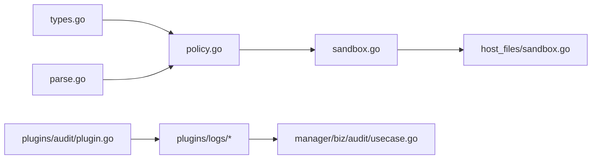

# 安全沙箱机制

<cite>
**本文引用的文件列表**
- [internal/edgeagent/cmdpolicy/policy.go](file://internal/edgeagent/cmdpolicy/policy.go)
- [internal/edgeagent/cmdpolicy/sandbox.go](file://internal/edgeagent/cmdpolicy/sandbox.go)
- [internal/edgeagent/cmdpolicy/types.go](file://internal/edgeagent/cmdpolicy/types.go)
- [internal/edgeagent/cmdpolicy/parse.go](file://internal/edgeagent/cmdpolicy/parse.go)
- [internal/edgeagent/host_files/sandbox.go](file://internal/edgeagent/host_files/sandbox.go)
- [skills/bash/SKILL.md](file://skills/bash/SKILL.md)
- [deploy/edge/bash-policy.example.yaml](file://deploy/edge/bash-policy.example.yaml)
- [internal/edgeagent/plugins/audit/plugin.go](file://internal/edgeagent/plugins/audit/plugin.go)
- [internal/manager/biz/audit/usecase.go](file://internal/manager/biz/audit/usecase.go)
- [cmd/ongrid/main.go](file://cmd/ongrid/main.go)
</cite>

## 目录
1. [简介](#简介)
2. [项目结构](#项目结构)
3. [核心组件](#核心组件)
4. [架构总览](#架构总览)
5. [详细组件分析](#详细组件分析)
6. [依赖关系分析](#依赖关系分析)
7. [性能与资源限制](#性能与资源限制)
8. [故障排查指南](#故障排查指南)
9. [结论](#结论)
10. [附录](#附录)

## 简介
本文件系统性阐述边端“安全沙箱”机制，围绕命令策略引擎、执行环境隔离、白名单机制、资源限制与审计日志等维度展开。该机制用于在边缘节点上以最小权限执行 LLM 驱动的工具调用（如 bash 诊断），通过“只读优先 + 严格白名单 + 输出限流 + 超时控制 + 路径/网络白名单 + 审计追踪”的组合实现纵深防御。

## 项目结构
与安全沙箱直接相关的代码集中在 edgeagent 的 cmdpolicy 包，以及 host_files 的路径校验模块；审计侧由 manager 的审计用例与 edge 端的 audit 插件共同构成。

图表来源
- [internal/edgeagent/cmdpolicy/policy.go:1-120](file://internal/edgeagent/cmdpolicy/policy.go#L1-L120)
- [internal/edgeagent/cmdpolicy/sandbox.go:1-120](file://internal/edgeagent/cmdpolicy/sandbox.go#L1-L120)
- [internal/edgeagent/host_files/sandbox.go:1-120](file://internal/edgeagent/host_files/sandbox.go#L1-L120)
- [internal/edgeagent/plugins/audit/plugin.go:1-92](file://internal/edgeagent/plugins/audit/plugin.go#L1-L92)
- [internal/manager/biz/audit/usecase.go:1-120](file://internal/manager/biz/audit/usecase.go#L1-L120)

章节来源
- [internal/edgeagent/cmdpolicy/policy.go:1-120](file://internal/edgeagent/cmdpolicy/policy.go#L1-L120)
- [internal/edgeagent/cmdpolicy/sandbox.go:1-120](file://internal/edgeagent/cmdpolicy/sandbox.go#L1-L120)
- [internal/edgeagent/host_files/sandbox.go:1-120](file://internal/edgeagent/host_files/sandbox.go#L1-L120)
- [internal/edgeagent/plugins/audit/plugin.go:1-92](file://internal/edgeagent/plugins/audit/plugin.go#L1-L92)
- [internal/manager/biz/audit/usecase.go:1-120](file://internal/manager/biz/audit/usecase.go#L1-L120)

## 核心组件
- 策略定义与默认基线：提供只读基线策略，按二进制分类（read-fs、read-system、mixed、network、denied）并内置大量常用诊断工具规则。
- 策略解析与 YAML 覆盖：支持从配置文件合并覆盖，允许扩展/收紧规则、调整全局参数。
- 命令语法解析器：仅支持单条命令或单层 pipe，拒绝重定向、变量替换、子 shell 等危险语法。
- 执行沙箱：将决策转化为实际执行，包含管道组装、环境变量清洗、超时控制、输出上限截断、进程组管理。
- 路径校验：复用 host_files 的 PathValidator，对绝对路径进行符号链接解析与白名单前缀匹配。
- 网络白名单：对 ClassNetwork 的二进制提取目标主机，基于 CIDR/后缀/精确匹配进行放行。
- 审计记录：边端通过 audit 插件产出 JSONL，经 logs 插件采集到 Loki；管理端提供审计写入、查询与保留清理。

章节来源
- [internal/edgeagent/cmdpolicy/types.go:1-182](file://internal/edgeagent/cmdpolicy/types.go#L1-L182)
- [internal/edgeagent/cmdpolicy/policy.go:1-200](file://internal/edgeagent/cmdpolicy/policy.go#L1-L200)
- [internal/edgeagent/cmdpolicy/parse.go:1-120](file://internal/edgeagent/cmdpolicy/parse.go#L1-L120)
- [internal/edgeagent/cmdpolicy/sandbox.go:1-200](file://internal/edgeagent/cmdpolicy/sandbox.go#L1-L200)
- [internal/edgeagent/host_files/sandbox.go:1-120](file://internal/edgeagent/host_files/sandbox.go#L1-L120)
- [internal/edgeagent/plugins/audit/plugin.go:1-92](file://internal/edgeagent/plugins/audit/plugin.go#L1-L92)
- [internal/manager/biz/audit/usecase.go:1-120](file://internal/manager/biz/audit/usecase.go#L1-L120)

## 架构总览
下图展示一次典型的“bash 诊断”请求在边端的处理流程：从策略解析、路径/网络校验到最终执行与结果返回，同时体现审计事件的生产与消费链路。

图表来源
- [internal/edgeagent/cmdpolicy/policy.go:700-800](file://internal/edgeagent/cmdpolicy/policy.go#L700-L800)
- [internal/edgeagent/cmdpolicy/sandbox.go:76-188](file://internal/edgeagent/cmdpolicy/sandbox.go#L76-L188)
- [internal/edgeagent/host_files/sandbox.go:135-193](file://internal/edgeagent/host_files/sandbox.go#L135-L193)
- [internal/edgeagent/plugins/audit/plugin.go:46-92](file://internal/edgeagent/plugins/audit/plugin.go#L46-L92)
- [internal/manager/biz/audit/usecase.go:74-116](file://internal/manager/biz/audit/usecase.go#L74-L116)

## 详细组件分析

### 策略引擎设计与决策流程
- 二进制分类与默认基线
  - read-fs/read-system：无条件放行（例如 cat、ls、ps、df、ss 等）。
  - mixed：根据参数区分读写（如 iptables -L 读、-A 写；systemctl status 读、restart 写）。
  - network：出站探测类（curl --head、dig、ping 等），需配合网络白名单。
  - denied：一律拒绝（shell、脚本语言、破坏性命令等）。
- 参数匹配器
  - AnyFlag：任意位置出现指定标志即命中。
  - Subcmd/SubcmdPath：按子命令或多段子命令路径匹配。
  - DeniedArgs：全局黑名单（如 sed -i、find -delete、awk system()）。
- 决策顺序
  1) 空 argv 或不在策略中 → 拒绝
  2) denied class → 拒绝
  3) 未安装 → 拒绝
  4) 命中 DeniedArgs → 拒绝
  5) mixed/network 先检查 WriteMatchers → 命中则拒绝
  6) 再检查 ReadOnlyMatchers → 命中则允许
  7) 否则按类别默认：mixed 拒绝（保守）、network 允许（但需通过主机白名单）
- YAML 覆盖语义
  - binaries[*] 完全替换同名条目；新增名称追加。
  - NetworkHostAllowlist/PathAllowlist：非空时替换，为空则沿用基线。
  - 全局参数（stdout/stderr cap、timeout、max args）：大于 0 时替换。

图表来源
- [internal/edgeagent/cmdpolicy/policy.go:700-800](file://internal/edgeagent/cmdpolicy/policy.go#L700-L800)
- [internal/edgeagent/cmdpolicy/types.go:79-130](file://internal/edgeagent/cmdpolicy/types.go#L79-L130)

章节来源
- [internal/edgeagent/cmdpolicy/policy.go:33-120](file://internal/edgeagent/cmdpolicy/policy.go#L33-L120)
- [internal/edgeagent/cmdpolicy/policy.go:546-641](file://internal/edgeagent/cmdpolicy/policy.go#L546-L641)
- [internal/edgeagent/cmdpolicy/types.go:49-130](file://internal/edgeagent/cmdpolicy/types.go#L49-L130)

### 命令语法解析器（防注入）
- 仅支持简单命令与可选 pipe，支持双引号/单引号与反斜杠转义。
- 明确拒绝：重定向、heredoc、&&/||/;、$( )、` `、<( >(、子 shell、${} 等。
- 输出为若干段 argv，每段作为 exec.Command 的参数数组，不经过真实 shell。

章节来源
- [internal/edgeagent/cmdpolicy/parse.go:1-120](file://internal/edgeagent/cmdpolicy/parse.go#L1-L120)
- [internal/edgeagent/cmdpolicy/parse.go:121-235](file://internal/edgeagent/cmdpolicy/parse.go#L121-L235)

### 执行沙箱（管道/超时/输出上限）
- Decide 组合策略+路径+网络校验；Exec 负责实际执行。
- 管道组装：多段通过 stdout→stdin 连接，最后一段的 exit code 作为整体退出码。
- 环境变量清洗：仅保留 PATH/LANG/LC_ALL，避免继承宿主敏感环境。
- 超时控制：context.WithTimeout 包裹整个管道，超时返回特定错误信息。
- 输出上限：stdout/stderr 分别设置字节上限，超过后标记 truncated。
- 进程组：Setpgid 便于统一终止。
- ExecRaw：管理员写门控逃逸通道，绕过所有策略检查，但仍受超时与输出上限约束。

图表来源
- [internal/edgeagent/cmdpolicy/sandbox.go:52-188](file://internal/edgeagent/cmdpolicy/sandbox.go#L52-L188)
- [internal/edgeagent/cmdpolicy/types.go:132-182](file://internal/edgeagent/cmdpolicy/types.go#L132-L182)

章节来源
- [internal/edgeagent/cmdpolicy/sandbox.go:134-253](file://internal/edgeagent/cmdpolicy/sandbox.go#L134-L253)
- [internal/edgeagent/cmdpolicy/sandbox.go:260-342](file://internal/edgeagent/cmdpolicy/sandbox.go#L260-L342)

### 文件系统访问控制（路径白名单）
- 复用 host_files.SandboxConfig.ValidatePath：
  - 必须为绝对路径。
  - 存在时进行符号链接解析，拒绝指向外部白名单外的路径。
  - 先走 denylist（虚拟文件系统、敏感文件），再可选 allowlist（前缀匹配）。
- 默认 denylist 包含 /proc、/sys、/dev、/run 及常见敏感路径；可配置额外 allowlist 进一步收敛。

章节来源
- [internal/edgeagent/host_files/sandbox.go:135-193](file://internal/edgeagent/host_files/sandbox.go#L135-L193)
- [internal/edgeagent/host_files/sandbox.go:71-109](file://internal/edgeagent/host_files/sandbox.go#L71-L109)

### 网络权限限制（出站目标白名单）
- 针对 ClassNetwork 的二进制，从 argv 中提取目标主机（支持 curl/wget/dig/host/nslookup/ping/traceroute/nc 等启发式）。
- 白名单支持三种形式：CIDR、主机名后缀（以 . 开头）、精确 IP/主机名。
- 空白名单 = 拒绝所有出站。

章节来源
- [internal/edgeagent/cmdpolicy/sandbox.go:428-549](file://internal/edgeagent/cmdpolicy/sandbox.go#L428-L549)

### 白名单机制（二进制验证/参数匹配/路径安全检查）
- 二进制白名单：仅在策略中声明的二进制可被执行；未声明视为未知并拒绝。
- 参数匹配：通过 AnyFlag/Subcmd/SubcmdPath 精细区分读写；DeniedArgs 做全局黑名单。
- 路径安全检查：结合 host_files 的 ValidatePath 完成符号链接与白名单前缀校验。

章节来源
- [internal/edgeagent/cmdpolicy/policy.go:33-120](file://internal/edgeagent/cmdpolicy/policy.go#L33-L120)
- [internal/edgeagent/cmdpolicy/types.go:79-130](file://internal/edgeagent/cmdpolicy/types.go#L79-L130)
- [internal/edgeagent/host_files/sandbox.go:135-193](file://internal/edgeagent/host_files/sandbox.go#L135-L193)

### 资源限制策略（CPU/内存/磁盘 I/O）
- 当前沙箱层未直接集成 cgroups/seccomp/chroot 等内核级隔离；文档层面建议参考系统知识中的 CPU/内存/I/O 控制器说明进行部署侧限制。
- 沙箱内提供的软限制包括：
  - 超时控制：per-call 硬上限，防止长驻。
  - 输出上限：stdout/stderr 字节上限，防止大输出占用内存。
  - 参数数量上限：MaxArgs 限制每段 argv 长度，降低 ARG_MAX 洪水风险。

章节来源
- [internal/edgeagent/cmdpolicy/policy.go:26-49](file://internal/edgeagent/cmdpolicy/policy.go#L26-L49)
- [internal/edgeagent/cmdpolicy/sandbox.go:140-188](file://internal/edgeagent/cmdpolicy/sandbox.go#L140-L188)
- [internal/manager/biz/knowledge/builtin_vault/systems/scheduling/cfs-and-cgroups.md:1-89](file://internal/manager/biz/knowledge/builtin_vault/systems/scheduling/cfs-and-cgroups.md#L1-L89)

### 审计日志记录机制（操作追踪/违规检测/合规报告）
- 边端：audit 插件封装 auditbeat 子进程，生成 JSONL 到固定路径；logs 插件自动发现并采集到 Loki。
- 管理端：审计用例提供 Emit/List/Retention 能力，支持按时间范围/资源类型/动作筛选，并提供每日清理任务。
- 合规：审计写入失败不阻塞业务，仅告警；可通过 UI 或 API 导出审计数据用于合规报告。

图表来源
- [internal/edgeagent/plugins/audit/plugin.go:46-92](file://internal/edgeagent/plugins/audit/plugin.go#L46-L92)
- [internal/manager/biz/audit/usecase.go:74-116](file://internal/manager/biz/audit/usecase.go#L74-L116)

章节来源
- [internal/edgeagent/plugins/audit/plugin.go:1-92](file://internal/edgeagent/plugins/audit/plugin.go#L1-L92)
- [internal/manager/biz/audit/usecase.go:1-191](file://internal/manager/biz/audit/usecase.go#L1-L191)
- [cmd/ongrid/main.go:409-436](file://cmd/ongrid/main.go#L409-L436)

## 依赖关系分析
- cmdpolicy 包内部耦合度低：types 定义数据结构，policy 提供默认策略与 YAML 覆盖，parse 负责语法解析，sandbox 负责执行。
- sandbox 依赖 host_files.PathValidator 接口，解耦路径校验实现。
- 审计插件与 logs 插件通过约定路径契约协作，管理端审计用例独立于边端实现。

图表来源
- [internal/edgeagent/cmdpolicy/types.go:1-182](file://internal/edgeagent/cmdpolicy/types.go#L1-L182)
- [internal/edgeagent/cmdpolicy/policy.go:1-120](file://internal/edgeagent/cmdpolicy/policy.go#L1-L120)
- [internal/edgeagent/cmdpolicy/parse.go:1-120](file://internal/edgeagent/cmdpolicy/parse.go#L1-L120)
- [internal/edgeagent/cmdpolicy/sandbox.go:1-120](file://internal/edgeagent/cmdpolicy/sandbox.go#L1-L120)
- [internal/edgeagent/host_files/sandbox.go:1-120](file://internal/edgeagent/host_files/sandbox.go#L1-L120)
- [internal/edgeagent/plugins/audit/plugin.go:1-92](file://internal/edgeagent/plugins/audit/plugin.go#L1-L92)
- [internal/manager/biz/audit/usecase.go:1-120](file://internal/manager/biz/audit/usecase.go#L1-L120)

章节来源
- [internal/edgeagent/cmdpolicy/policy.go:1-120](file://internal/edgeagent/cmdpolicy/policy.go#L1-L120)
- [internal/edgeagent/cmdpolicy/sandbox.go:1-120](file://internal/edgeagent/cmdpolicy/sandbox.go#L1-L120)
- [internal/edgeagent/host_files/sandbox.go:1-120](file://internal/edgeagent/host_files/sandbox.go#L1-L120)
- [internal/edgeagent/plugins/audit/plugin.go:1-92](file://internal/edgeagent/plugins/audit/plugin.go#L1-L92)
- [internal/manager/biz/audit/usecase.go:1-120](file://internal/manager/biz/audit/usecase.go#L1-L120)

## 性能与资源限制
- 超时控制：每个调用有硬上限，避免长时间占用资源。
- 输出上限：stdout/stderr 分别限制字节数，超限后返回 truncated 标志，提示上层调整命令。
- 参数上限：MaxArgs 限制每段 argv 长度，降低恶意参数注入与 ARG_MAX 攻击面。
- 管道执行：多段并行启动，减少上下文切换开销；SIGPIPE 被视作中间段正常退出。

章节来源
- [internal/edgeagent/cmdpolicy/policy.go:26-49](file://internal/edgeagent/cmdpolicy/policy.go#L26-L49)
- [internal/edgeagent/cmdpolicy/sandbox.go:140-188](file://internal/edgeagent/cmdpolicy/sandbox.go#L140-L188)
- [internal/edgeagent/cmdpolicy/sandbox.go:378-396](file://internal/edgeagent/cmdpolicy/sandbox.go#L378-L396)

## 故障排查指南
- 策略拒绝
  - 现象：ShellResult.allowed=false，reason 指出具体原因（未知二进制、denied 类、未安装、命中禁用参数、写操作、网络目标不在白名单等）。
  - 处理：根据 reason 调整命令或扩展策略 YAML。
- 路径校验失败
  - 现象：reason 包含路径不在白名单或符号链接越界。
  - 处理：确认路径是否在 AllowedReadPaths 下，或调整 denylist/allowlist。
- 网络目标拒绝
  - 现象：reason 指出目标不在 network_host_allowlist。
  - 处理：在策略 YAML 中添加 CIDR/后缀/精确主机。
- 超时或输出截断
  - 现象：duration_ms 较大且 truncated=true，或 stderr 包含超时提示。
  - 处理：优化命令逻辑、增加 timeout 或拆分命令。
- 审计缺失
  - 现象：管理端无审计记录。
  - 处理：检查 audit 插件工作目录、JSONL 路径、logs 插件采集配置与管理端审计服务状态。

章节来源
- [internal/edgeagent/cmdpolicy/sandbox.go:76-188](file://internal/edgeagent/cmdpolicy/sandbox.go#L76-L188)
- [internal/edgeagent/host_files/sandbox.go:135-193](file://internal/edgeagent/host_files/sandbox.go#L135-L193)
- [internal/edgeagent/plugins/audit/plugin.go:46-92](file://internal/edgeagent/plugins/audit/plugin.go#L46-L92)
- [internal/manager/biz/audit/usecase.go:74-116](file://internal/manager/biz/audit/usecase.go#L74-L116)

## 结论
该安全沙箱以“策略先行、执行受限、审计闭环”为核心设计，通过严格的命令语法解析、细粒度的二进制与参数白名单、路径与网络访问控制、输出与超时限制，以及端到端的审计追踪，构建了面向 LLM 驱动运维场景的可信执行环境。建议在部署侧结合 cgroups/seccomp 等内核能力进一步增强隔离强度，并通过持续的策略评审与审计分析提升合规性与安全性。

## 附录

### 安全策略配置语法（YAML）
- 顶层字段
  - binaries[]：name/class/read_only_matchers/write_matchers/denied_args
  - network_host_allowlist[]：CIDR/后缀/精确匹配
  - stdout_cap_bytes/stderr_cap_bytes/timeout_seconds/max_argv_length/path_allowlist[]
- 匹配器字段
  - any_flag[]：任意位置出现的标志
  - subcmd：位置参数等于某值
  - subcmd_path[]：连续子命令序列匹配
- 覆盖语义
  - binaries 同名项完全替换；新增项追加。
  - 列表型字段非空时替换，为空时沿用基线。
  - 数值型字段 >0 时替换，<=0 时沿用基线。

章节来源
- [internal/edgeagent/cmdpolicy/policy.go:546-641](file://internal/edgeagent/cmdpolicy/policy.go#L546-L641)
- [deploy/edge/bash-policy.example.yaml](file://deploy/edge/bash-policy.example.yaml)

### 测试方法
- 单元测试
  - 策略解析与匹配：覆盖 read/mixed/network/denied 各类别与边界条件。
  - 语法解析：验证禁止字符与合法引号/转义行为。
  - 执行沙箱：管道组装、超时、输出上限、进程组与 SIGPIPE 处理。
  - 路径校验：符号链接解析与白名单前缀匹配。
  - 网络白名单：CIDR/后缀/精确匹配。
- 示例参考
  - bash 技能文档定义了 v1 只读策略与典型用法，可作为测试用例集的基础。

章节来源
- [skills/bash/SKILL.md:1-188](file://skills/bash/SKILL.md#L1-L188)
- [internal/edgeagent/cmdpolicy/parse.go:1-120](file://internal/edgeagent/cmdpolicy/parse.go#L1-L120)
- [internal/edgeagent/cmdpolicy/sandbox.go:134-253](file://internal/edgeagent/cmdpolicy/sandbox.go#L134-L253)
- [internal/edgeagent/host_files/sandbox.go:135-193](file://internal/edgeagent/host_files/sandbox.go#L135-L193)

### 漏洞防护最佳实践
- 坚持最小权限：默认只读策略，按需扩展；避免引入脚本语言与破坏性命令。
- 严格路径白名单：启用 AllowedReadPaths，关闭不必要的读取范围。
- 网络白名单最小化：仅开放必要 CIDR/后缀，避免通配。
- 参数与输出限制：合理设置 MaxArgs、stdout/stderr cap 与 timeout。
- 审计闭环：确保 audit 插件与 logs 插件正常工作，定期审查审计记录。
- 部署加固：结合 cgroups/seccomp/chroot 等内核能力增强隔离。

章节来源
- [internal/edgeagent/cmdpolicy/policy.go:33-120](file://internal/edgeagent/cmdpolicy/policy.go#L33-L120)
- [internal/edgeagent/host_files/sandbox.go:71-109](file://internal/edgeagent/host_files/sandbox.go#L71-L109)
- [internal/edgeagent/plugins/audit/plugin.go:46-92](file://internal/edgeagent/plugins/audit/plugin.go#L46-L92)
- [internal/manager/biz/knowledge/builtin_vault/systems/scheduling/cfs-and-cgroups.md:1-89](file://internal/manager/biz/knowledge/builtin_vault/systems/scheduling/cfs-and-cgroups.md#L1-L89)