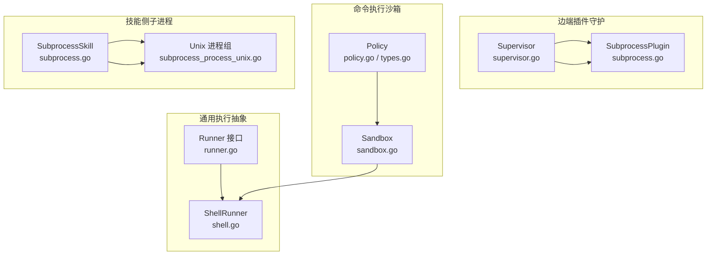
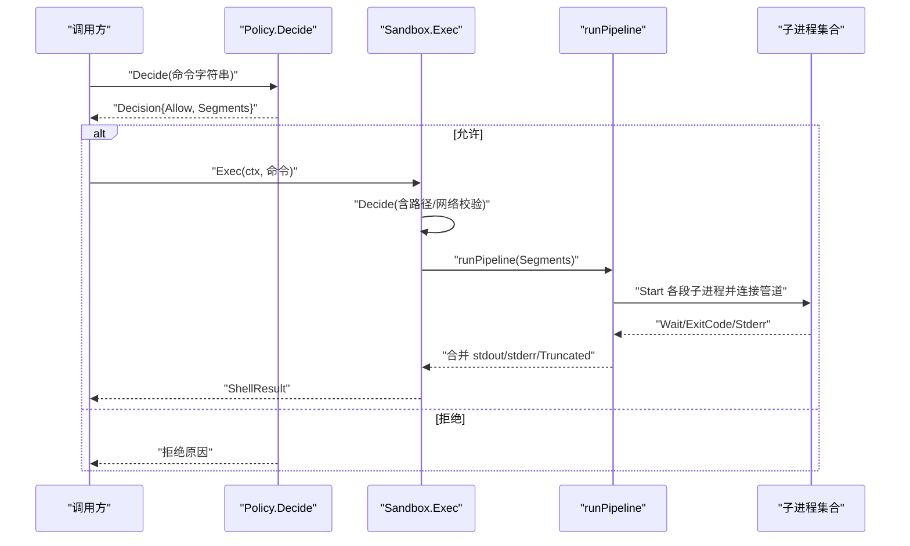
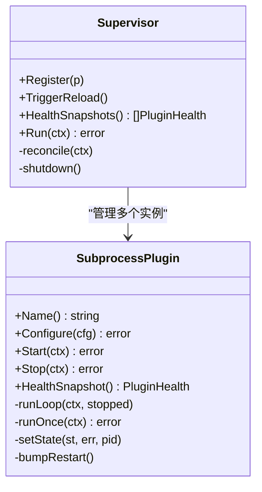
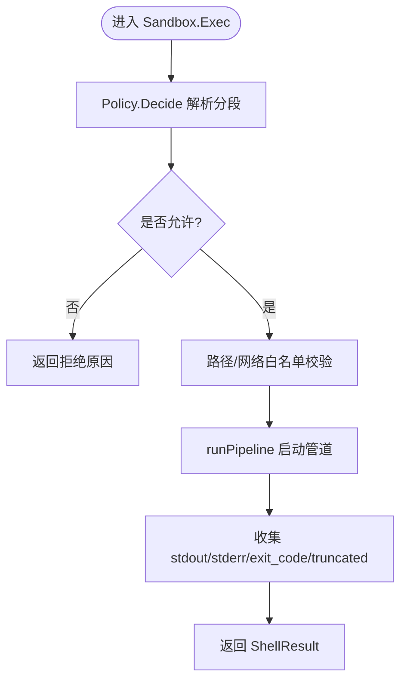
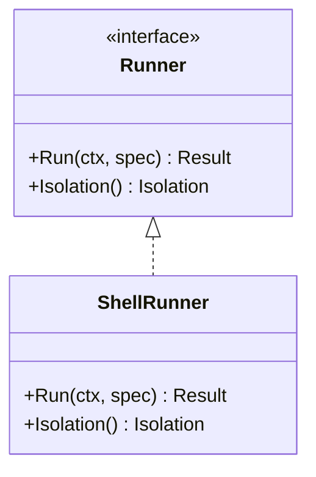
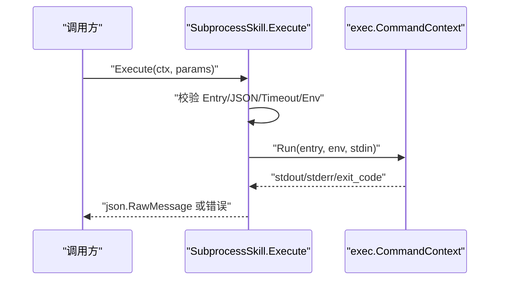
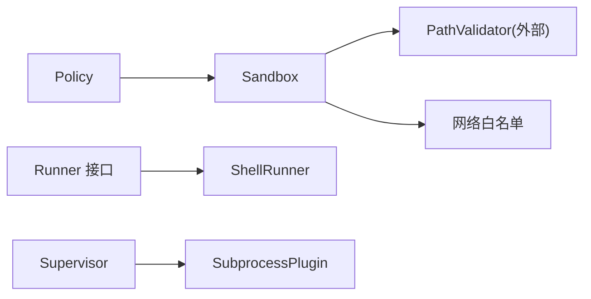

# 子进程管理

<cite>
**本文引用的文件**   
- [internal/edgeagent/plugins/subprocess.go](file://internal/edgeagent/plugins/subprocess.go)
- [internal/edgeagent/plugins/supervisor.go](file://internal/edgeagent/plugins/supervisor.go)
- [internal/skill/subprocess.go](file://internal/skill/subprocess.go)
- [internal/skill/subprocess_process_unix.go](file://internal/skill/subprocess_process_unix.go)
- [internal/pkg/runner/runner.go](file://internal/pkg/runner/runner.go)
- [internal/pkg/runner/shell.go](file://internal/pkg/runner/shell.go)
- [internal/edgeagent/cmdpolicy/policy.go](file://internal/edgeagent/cmdpolicy/policy.go)
- [internal/edgeagent/cmdpolicy/sandbox.go](file://internal/edgeagent/cmdpolicy/sandbox.go)
- [internal/edgeagent/cmdpolicy/types.go](file://internal/edgeagent/cmdpolicy/types.go)
- [skills/bash/SKILL.md](file://skills/bash/SKILL.md)
</cite>

## 目录
1. [简介](#简介)
2. [项目结构](#项目结构)
3. [核心组件](#核心组件)
4. [架构总览](#架构总览)
5. [详细组件分析](#详细组件分析)
6. [依赖关系分析](#依赖关系分析)
7. [性能考量](#性能考量)
8. [故障排查指南](#故障排查指南)
9. [结论](#结论)
10. [附录](#附录)

## 简介
本文件系统性梳理“子进程管理系统”的设计与实现，覆盖以下关键主题：
- 外部插件进程的隔离执行机制（进程创建、资源限制、权限控制）
- 进程间通信协议（标准输入输出流处理、错误处理、信号传递）
- 进程监控机制（存活检测、崩溃恢复、资源使用统计）
- 安全沙箱实现（文件系统访问控制、网络权限限制、系统调用过滤）
- 调试技巧、性能优化建议与故障排查方法

该子系统在两个层面工作：
- 边端插件守护层：以独立二进制形式运行采集器/导出器等插件，由 Supervisor 统一编排生命周期与崩溃恢复。
- 命令执行沙箱层：对 LLM 驱动的命令进行白名单/参数级策略判定、路径与网络出站校验、管道化执行与输出限流。

## 项目结构
围绕子进程管理的代码主要分布在如下模块：
- 边端插件守护：plugins 包负责插件配置渲染、子进程启动、健康状态上报与重启退避。
- 命令执行沙箱：cmdpolicy 包提供策略定义、决策与执行；Sandbox 组合 PathValidator 与网络白名单完成最终放行。
- 通用执行抽象：pkg/runner 提供统一的 Runner 接口与 ShellRunner 实现，屏蔽具体隔离后端差异。
- 技能侧子进程：skill 包支持以子进程方式运行外部可执行程序，作为 Manager 侧的轻量执行通道。

图表来源
- [internal/edgeagent/plugins/supervisor.go:1-276](file://internal/edgeagent/plugins/supervisor.go#L1-L276)
- [internal/edgeagent/plugins/subprocess.go:1-318](file://internal/edgeagent/plugins/subprocess.go#L1-L318)
- [internal/edgeagent/cmdpolicy/policy.go:1-800](file://internal/edgeagent/cmdpolicy/policy.go#L1-L800)
- [internal/edgeagent/cmdpolicy/sandbox.go:1-550](file://internal/edgeagent/cmdpolicy/sandbox.go#L1-L550)
- [internal/edgeagent/cmdpolicy/types.go:1-182](file://internal/edgeagent/cmdpolicy/types.go#L1-L182)
- [internal/pkg/runner/runner.go:1-97](file://internal/pkg/runner/runner.go#L1-L97)
- [internal/pkg/runner/shell.go:1-150](file://internal/pkg/runner/shell.go#L1-L150)
- [internal/skill/subprocess.go:1-268](file://internal/skill/subprocess.go#L1-L268)
- [internal/skill/subprocess_process_unix.go:1-27](file://internal/skill/subprocess_process_unix.go#L1-L27)

章节来源
- [internal/edgeagent/plugins/supervisor.go:1-276](file://internal/edgeagent/plugins/supervisor.go#L1-L276)
- [internal/edgeagent/plugins/subprocess.go:1-318](file://internal/edgeagent/plugins/subprocess.go#L1-L318)
- [internal/edgeagent/cmdpolicy/policy.go:1-800](file://internal/edgeagent/cmdpolicy/policy.go#L1-L800)
- [internal/edgeagent/cmdpolicy/sandbox.go:1-550](file://internal/edgeagent/cmdpolicy/sandbox.go#L1-L550)
- [internal/edgeagent/cmdpolicy/types.go:1-182](file://internal/edgeagent/cmdpolicy/types.go#L1-L182)
- [internal/pkg/runner/runner.go:1-97](file://internal/pkg/runner/runner.go#L1-L97)
- [internal/pkg/runner/shell.go:1-150](file://internal/pkg/runner/shell.go#L1-L150)
- [internal/skill/subprocess.go:1-268](file://internal/skill/subprocess.go#L1-L268)
- [internal/skill/subprocess_process_unix.go:1-27](file://internal/skill/subprocess_process_unix.go#L1-L27)

## 核心组件
- 插件守护（Supervisor + SubprocessPlugin）
  - 职责：注册插件、拉取配置、按需启停、崩溃指数退避重启、健康快照聚合。
  - 关键点：优雅停止（SIGTERM）、等待延迟（SIGKILL 兜底）、日志落盘、重启计数单调递增。
- 命令执行沙箱（Policy + Sandbox）
  - 职责：基于白名单与参数匹配的策略判定；路径白名单校验；网络目标白名单校验；管道化执行与输出限流。
  - 关键点：只读基线策略、Mixed/Network 类精细判别、ExecRaw 管理员逃逸门（受控）。
- 通用执行抽象（Runner 接口 + ShellRunner）
  - 职责：统一入口，当前为 IsolationNone（进程内 shell），未来可扩展容器/微 VM。
  - 关键点：环境隔离（不继承父进程环境变量）、输出与超时上限。
- 技能侧子进程（SubprocessSkill）
  - 职责：以子进程方式运行外部可执行程序，stdin 传入 JSON 参数，stdout 返回 JSON 结果。
  - 关键点：严格的环境白名单注入、输出大小限制、进程组与取消传播。

章节来源
- [internal/edgeagent/plugins/supervisor.go:1-276](file://internal/edgeagent/plugins/supervisor.go#L1-L276)
- [internal/edgeagent/plugins/subprocess.go:1-318](file://internal/edgeagent/plugins/subprocess.go#L1-L318)
- [internal/edgeagent/cmdpolicy/policy.go:1-800](file://internal/edgeagent/cmdpolicy/policy.go#L1-L800)
- [internal/edgeagent/cmdpolicy/sandbox.go:1-550](file://internal/edgeagent/cmdpolicy/sandbox.go#L1-L550)
- [internal/edgeagent/cmdpolicy/types.go:1-182](file://internal/edgeagent/cmdpolicy/types.go#L1-L182)
- [internal/pkg/runner/runner.go:1-97](file://internal/pkg/runner/runner.go#L1-L97)
- [internal/pkg/runner/shell.go:1-150](file://internal/pkg/runner/shell.go#L1-L150)
- [internal/skill/subprocess.go:1-268](file://internal/skill/subprocess.go#L1-L268)
- [internal/skill/subprocess_process_unix.go:1-27](file://internal/skill/subprocess_process_unix.go#L1-L27)

## 架构总览
下图展示从“策略判定”到“管道执行”的端到端流程，以及插件守护的生命周期闭环。

图表来源
- [internal/edgeagent/cmdpolicy/policy.go:700-800](file://internal/edgeagent/cmdpolicy/policy.go#L700-L800)
- [internal/edgeagent/cmdpolicy/sandbox.go:134-188](file://internal/edgeagent/cmdpolicy/sandbox.go#L134-L188)
- [internal/edgeagent/cmdpolicy/sandbox.go:260-342](file://internal/edgeagent/cmdpolicy/sandbox.go#L260-L342)

## 详细组件分析

### 插件守护：Supervisor 与 SubprocessPlugin
- 生命周期
  - Register 注册插件实例；Run 周期性 reconcile，根据 Fetcher 返回的配置决定 Start/Stop/Configure。
  - Stop 通过 context 取消与 SIGTERM 优雅退出，设置 WaitDelay 做 SIGKILL 兜底。
- 崩溃恢复
  - runLoop 维护指数退避（1s→2s→…≤5min），每次重启 RestartCount+1，用于健康上报。
- 配置与日志
  - Configure 将渲染后的配置写入 workDir 下的配置文件；子进程 stdout/stderr 重定向至同名 .log 文件。
- 健康快照
  - HealthSnapshot 暴露 State/PID/StartedAt/RestartCount/LastError 等字段，供心跳上报。

图表来源
- [internal/edgeagent/plugins/supervisor.go:1-276](file://internal/edgeagent/plugins/supervisor.go#L1-L276)
- [internal/edgeagent/plugins/subprocess.go:1-318](file://internal/edgeagent/plugins/subprocess.go#L1-L318)

章节来源
- [internal/edgeagent/plugins/supervisor.go:112-230](file://internal/edgeagent/plugins/supervisor.go#L112-L230)
- [internal/edgeagent/plugins/subprocess.go:135-235](file://internal/edgeagent/plugins/subprocess.go#L135-L235)
- [internal/edgeagent/plugins/subprocess.go:237-311](file://internal/edgeagent/plugins/subprocess.go#L237-L311)

### 命令执行沙箱：Policy 与 Sandbox
- 策略分类
  - 只读 FS/系统：无条件放行。
  - Mixed：按参数区分读写（如 iptables -L/-A、systemctl status/restart）。
  - Network：出站网络工具，需配合主机白名单。
  - Denied：直接拒绝（shell/脚本语言/破坏性命令）。
- 决策与执行
  - Policy.Decide 解析管道分段并逐段判定；Sandbox.Decide 叠加路径与网络校验；Sandbox.Exec 执行管道。
- 管道执行
  - runPipeline 将多段 argv 通过 stdout→stdin 串联，捕获每段 stderr，汇总最后一段 exit code 与 Truncated 标志。
- 管理员逃逸门
  - ExecRaw 绕过策略检查，仅保留超时与输出上限保护，适用于受控写操作场景。

图表来源
- [internal/edgeagent/cmdpolicy/policy.go:700-800](file://internal/edgeagent/cmdpolicy/policy.go#L700-L800)
- [internal/edgeagent/cmdpolicy/sandbox.go:76-132](file://internal/edgeagent/cmdpolicy/sandbox.go#L76-L132)
- [internal/edgeagent/cmdpolicy/sandbox.go:134-188](file://internal/edgeagent/cmdpolicy/sandbox.go#L134-L188)
- [internal/edgeagent/cmdpolicy/sandbox.go:260-342](file://internal/edgeagent/cmdpolicy/sandbox.go#L260-L342)

章节来源
- [internal/edgeagent/cmdpolicy/types.go:43-182](file://internal/edgeagent/cmdpolicy/types.go#L43-L182)
- [internal/edgeagent/cmdpolicy/policy.go:33-492](file://internal/edgeagent/cmdpolicy/policy.go#L33-L492)
- [internal/edgeagent/cmdpolicy/sandbox.go:134-188](file://internal/edgeagent/cmdpolicy/sandbox.go#L134-L188)
- [internal/edgeagent/cmdpolicy/sandbox.go:260-342](file://internal/edgeagent/cmdpolicy/sandbox.go#L260-L342)

### 通用执行抽象：Runner 与 ShellRunner
- 设计目标
  - 统一执行入口，屏蔽隔离后端差异；当前实现为 IsolationNone（进程内 shell）。
- 关键特性
  - 完全替换环境变量（不继承父进程 env），避免敏感信息泄露。
  - 默认超时与输出上限，防止 OOM 或长时间挂起。
  - 支持 Script 模式（通过 /bin/sh -c）与 Argv 模式。

图表来源
- [internal/pkg/runner/runner.go:1-97](file://internal/pkg/runner/runner.go#L1-L97)
- [internal/pkg/runner/shell.go:1-150](file://internal/pkg/runner/shell.go#L1-L150)

章节来源
- [internal/pkg/runner/runner.go:20-97](file://internal/pkg/runner/runner.go#L20-L97)
- [internal/pkg/runner/shell.go:25-102](file://internal/pkg/runner/shell.go#L25-L102)

### 技能侧子进程：SubprocessSkill
- 执行模型
  - stdin 接收 JSON 参数，stdout 返回 JSON 结果；非零退出码视为错误并附带 stderr 尾部。
- 安全边界
  - 强制 ScopeManager；Entry 必须为绝对路径且存在可执行位；EnvAllow 白名单注入环境变量。
  - 输出上限与超时保护；Unix 下使用进程组便于整体取消。
- 典型用途
  - 以最小侵入方式集成外部可执行程序，无需引入 Python/Node 运行时。

图表来源
- [internal/skill/subprocess.go:99-172](file://internal/skill/subprocess.go#L99-L172)
- [internal/skill/subprocess.go:207-238](file://internal/skill/subprocess.go#L207-L238)
- [internal/skill/subprocess_process_unix.go:12-26](file://internal/skill/subprocess_process_unix.go#L12-L26)

章节来源
- [internal/skill/subprocess.go:17-28](file://internal/skill/subprocess.go#L17-L28)
- [internal/skill/subprocess.go:99-172](file://internal/skill/subprocess.go#L99-L172)
- [internal/skill/subprocess.go:174-193](file://internal/skill/subprocess.go#L174-L193)
- [internal/skill/subprocess.go:207-238](file://internal/skill/subprocess.go#L207-L238)
- [internal/skill/subprocess_process_unix.go:12-26](file://internal/skill/subprocess_process_unix.go#L12-L26)

### 进程间通信协议与错误处理
- 标准输入输出
  - 技能侧：stdin=JSON 参数，stdout=JSON 结果；stderr 用于诊断，错误消息包含尾部片段。
  - 沙箱侧：管道分段之间以 stdout→stdin 连接；每段 stderr 单独捕获并顺序拼接。
- 错误语义
  - 策略拒绝：Reason 明确说明原因（二进制不在策略/参数命中写规则/路径/网络未放行）。
  - 执行错误：非零退出码作为结果的一部分；上下文超时返回特定标记；内部错误（无法启动）返回 ExitCode=-1。
- 信号与取消
  - 插件守护：Cancel 回调发送 SIGTERM，WaitDelay 后 SIGKILL。
  - 技能侧：Unix 下 Setpgid=true，取消时向整个进程组发送 SIGKILL。

章节来源
- [internal/edgeagent/plugins/subprocess.go:237-287](file://internal/edgeagent/plugins/subprocess.go#L237-L287)
- [internal/skill/subprocess.go:207-238](file://internal/skill/subprocess.go#L207-L238)
- [internal/skill/subprocess_process_unix.go:12-26](file://internal/skill/subprocess_process_unix.go#L12-L26)
- [internal/edgeagent/cmdpolicy/sandbox.go:134-188](file://internal/edgeagent/cmdpolicy/sandbox.go#L134-L188)
- [internal/edgeagent/cmdpolicy/sandbox.go:260-342](file://internal/edgeagent/cmdpolicy/sandbox.go#L260-L342)

### 进程监控机制：存活检测、崩溃恢复与资源统计
- 存活检测
  - 插件守护：健康快照包含 PID/State/UpdatedAt；Supervisor 定期触发 reconcile 刷新状态。
- 崩溃恢复
  - 指数退避重启，最大间隔 5 分钟；RestartCount 单调递增，仅在重新启用时重置。
- 资源使用统计
  - 当前实现聚焦于输出限流与超时；CPU/内存等指标可由上层采集器插件自行上报。

章节来源
- [internal/edgeagent/plugins/subprocess.go:194-235](file://internal/edgeagent/plugins/subprocess.go#L194-L235)
- [internal/edgeagent/plugins/supervisor.go:94-110](file://internal/edgeagent/plugins/supervisor.go#L94-L110)

### 安全沙箱实现：文件系统、网络与系统调用
- 文件系统访问控制
  - 路径白名单：所有以“/”开头的参数交由 PathValidator 校验（复用 host_files 的实现）。
  - 默认只读基线：read-fs/read-system 类默认放行；mixed/network 类按参数精确判别。
- 网络权限限制
  - 网络类工具的目标主机需命中 NetworkHostAllowlist（CIDR/后缀/精确匹配），空列表即全拒。
- 系统调用过滤
  - 通过白名单与参数匹配间接限制危险能力（如禁止 shell/脚本语言、禁止 rm/mv/chmod 等）。
  - ExecRaw 绕过策略检查，但保留超时与输出上限保护，仅限受控写操作。

章节来源
- [internal/edgeagent/cmdpolicy/sandbox.go:76-132](file://internal/edgeagent/cmdpolicy/sandbox.go#L76-L132)
- [internal/edgeagent/cmdpolicy/sandbox.go:424-549](file://internal/edgeagent/cmdpolicy/sandbox.go#L424-L549)
- [internal/edgeagent/cmdpolicy/policy.go:462-492](file://internal/edgeagent/cmdpolicy/policy.go#L462-L492)
- [skills/bash/SKILL.md:126-188](file://skills/bash/SKILL.md#L126-L188)

## 依赖关系分析
- 松耦合
  - Policy 与 Sandbox 解耦：前者只做策略判定，后者组合 PathValidator 与网络白名单完成执行。
  - Runner 接口屏蔽隔离后端差异，ShellRunner 作为默认实现。
- 关键依赖
  - Sandbox 依赖 PathValidator（来自 host_files 模块）与网络白名单配置。
  - 插件守护依赖 exec 与 slog，并通过 health 记录对外暴露状态。
- 潜在循环
  - 当前无循环依赖；Supervisor 与 SubprocessPlugin 单向组合。

图表来源
- [internal/edgeagent/cmdpolicy/policy.go:1-800](file://internal/edgeagent/cmdpolicy/policy.go#L1-L800)
- [internal/edgeagent/cmdpolicy/sandbox.go:1-550](file://internal/edgeagent/cmdpolicy/sandbox.go#L1-L550)
- [internal/pkg/runner/runner.go:1-97](file://internal/pkg/runner/runner.go#L1-L97)
- [internal/pkg/runner/shell.go:1-150](file://internal/pkg/runner/shell.go#L1-L150)
- [internal/edgeagent/plugins/supervisor.go:1-276](file://internal/edgeagent/plugins/supervisor.go#L1-L276)
- [internal/edgeagent/plugins/subprocess.go:1-318](file://internal/edgeagent/plugins/subprocess.go#L1-L318)

章节来源
- [internal/edgeagent/cmdpolicy/types.go:1-182](file://internal/edgeagent/cmdpolicy/types.go#L1-L182)
- [internal/edgeagent/cmdpolicy/sandbox.go:39-59](file://internal/edgeagent/cmdpolicy/sandbox.go#L39-L59)

## 性能考量
- 输出限流
  - 技能侧：stdout 上限 16 MiB，stderr 保留尾部 4 KiB；沙箱侧：stdout/stderr 可按策略配置上限。
- 超时控制
  - 技能侧默认 30s；ShellRunner 默认 2 分钟；沙箱默认 30s。
- 进程组与取消
  - Unix 下 Setpgid=true，取消时向整个进程组发送 SIGKILL，避免僵尸进程。
- 管道执行
  - 多段并行启动、顺序等待，中间段 EPIPE 视为正常，减少阻塞风险。
- 内存占用
  - 使用 cappedWriter/capBuffer 截断输出，避免 OOM。

章节来源
- [internal/skill/subprocess.go:17-28](file://internal/skill/subprocess.go#L17-L28)
- [internal/skill/subprocess.go:207-238](file://internal/skill/subprocess.go#L207-L238)
- [internal/pkg/runner/shell.go:25-102](file://internal/pkg/runner/shell.go#L25-L102)
- [internal/edgeagent/cmdpolicy/sandbox.go:260-342](file://internal/edgeagent/cmdpolicy/sandbox.go#L260-L342)

## 故障排查指南
- 常见拒绝原因
  - 二进制不在策略中或被归入 Denied 类。
  - 参数命中 WriteMatchers 或 DeniedArgs。
  - 路径不在 PathAllowlist 中。
  - 网络目标不在 NetworkHostAllowlist。
- 定位步骤
  - 查看策略日志中的 Reason 与 Segments。
  - 确认二进制是否存在且可执行（AbsPath 为空表示未安装）。
  - 检查路径参数是否为绝对路径且在白名单前缀内。
  - 对于 curl/dig/ping 等，确认目标主机是否在白名单。
- 插件崩溃
  - 查看插件日志文件（workDir/<name>.log）。
  - 关注 RestartCount 增长频率与 LastError。
  - 调整崩溃退避上限或缩短超时时间以更快失败。
- 超时与输出过大
  - 适当提高 Timeout 或 MaxOutputBytes。
  - 优化命令以减少输出量（加 head/sort 等）。

章节来源
- [internal/edgeagent/cmdpolicy/policy.go:700-800](file://internal/edgeagent/cmdpolicy/policy.go#L700-L800)
- [internal/edgeagent/cmdpolicy/sandbox.go:76-132](file://internal/edgeagent/cmdpolicy/sandbox.go#L76-L132)
- [internal/edgeagent/plugins/subprocess.go:194-235](file://internal/edgeagent/plugins/subprocess.go#L194-L235)

## 结论
本子系统通过“策略先行、执行后置”的分层设计，实现了：
- 安全的命令执行：白名单+参数级判别+路径/网络白名单。
- 可靠的插件守护：优雅启停+指数退避+健康快照。
- 可控的资源消耗：输出限流+超时+进程组取消。
- 可扩展的执行抽象：Runner 接口为后续容器/微 VM 隔离预留空间。

## 附录
- 相关文档参考
  - bash 技能策略与示例见 skills/bash/SKILL.md，涵盖允许的分类、推荐套路与注意事项。

章节来源
- [skills/bash/SKILL.md:1-188](file://skills/bash/SKILL.md#L1-L188)