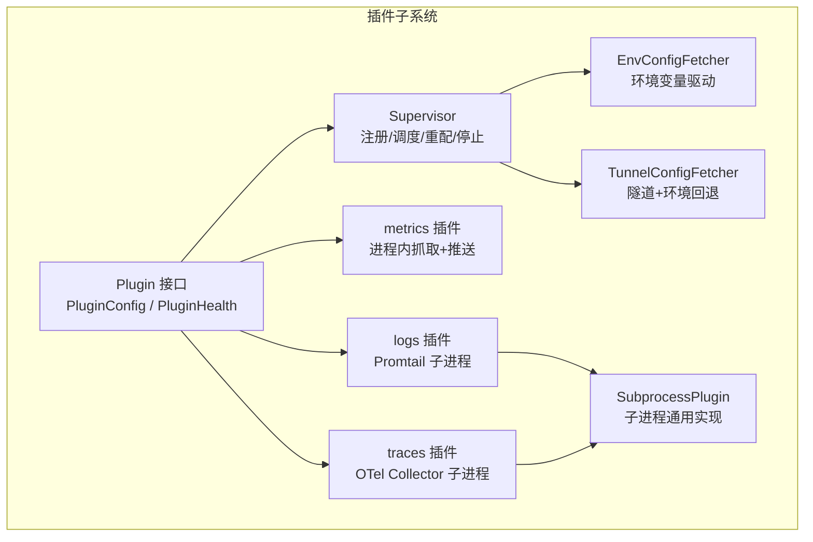
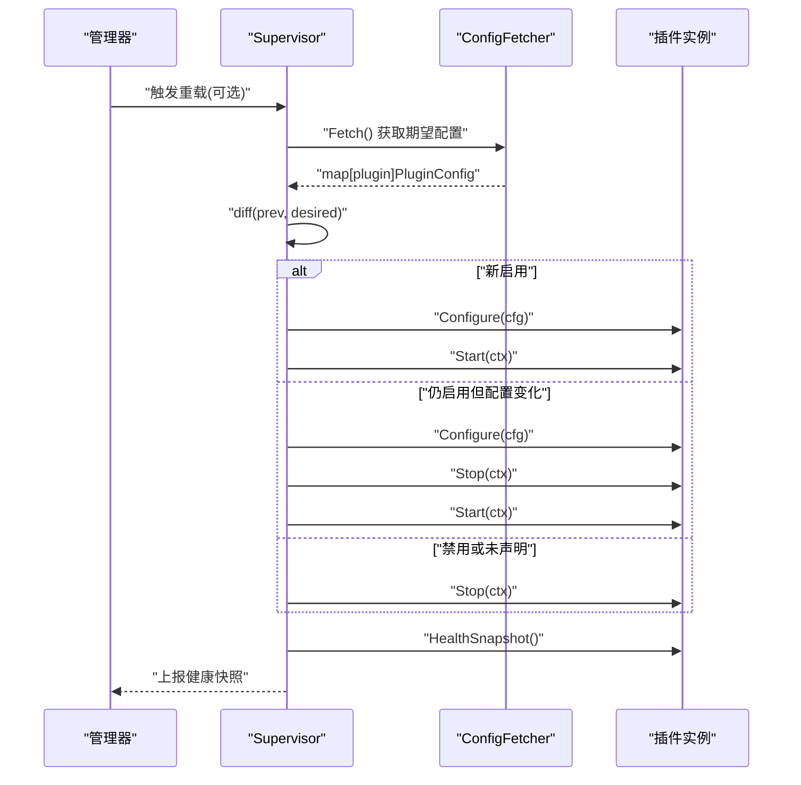
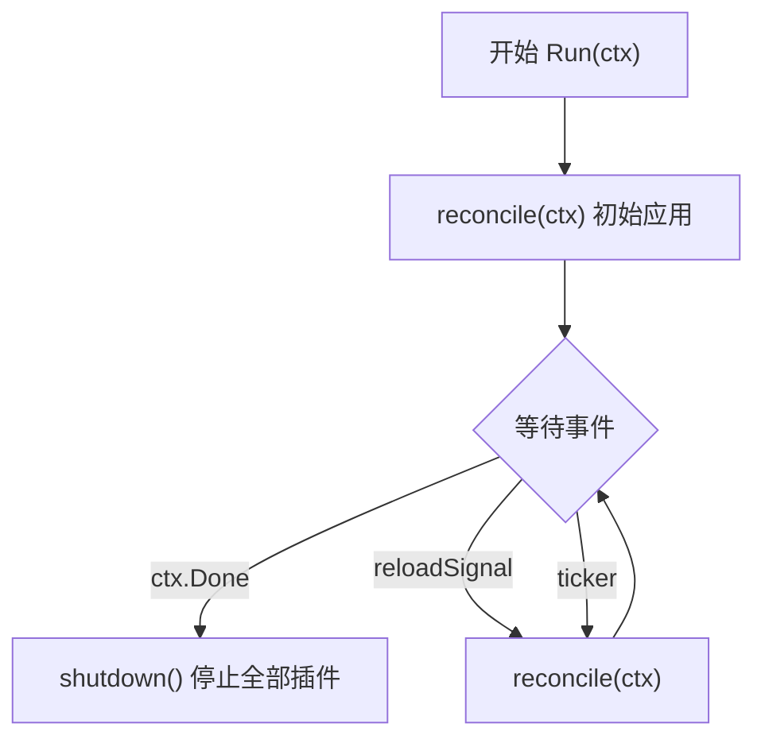
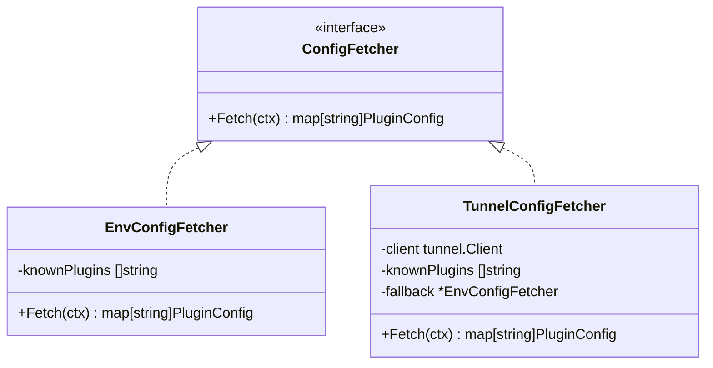
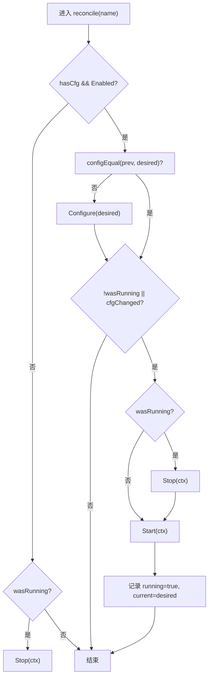
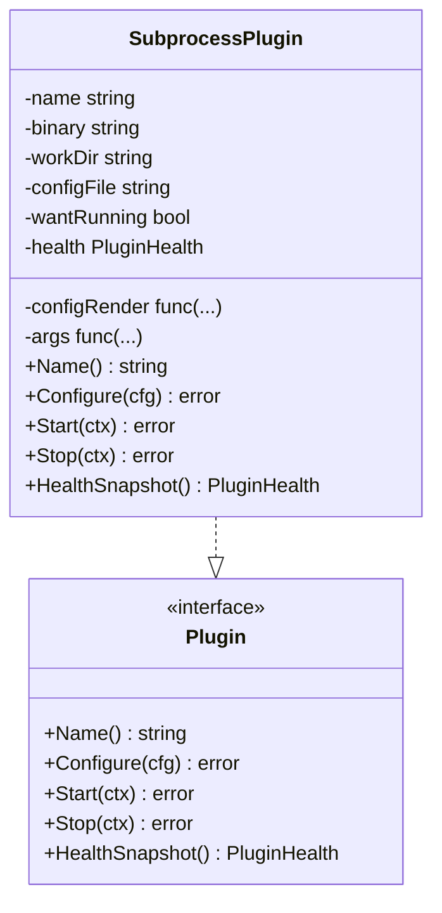
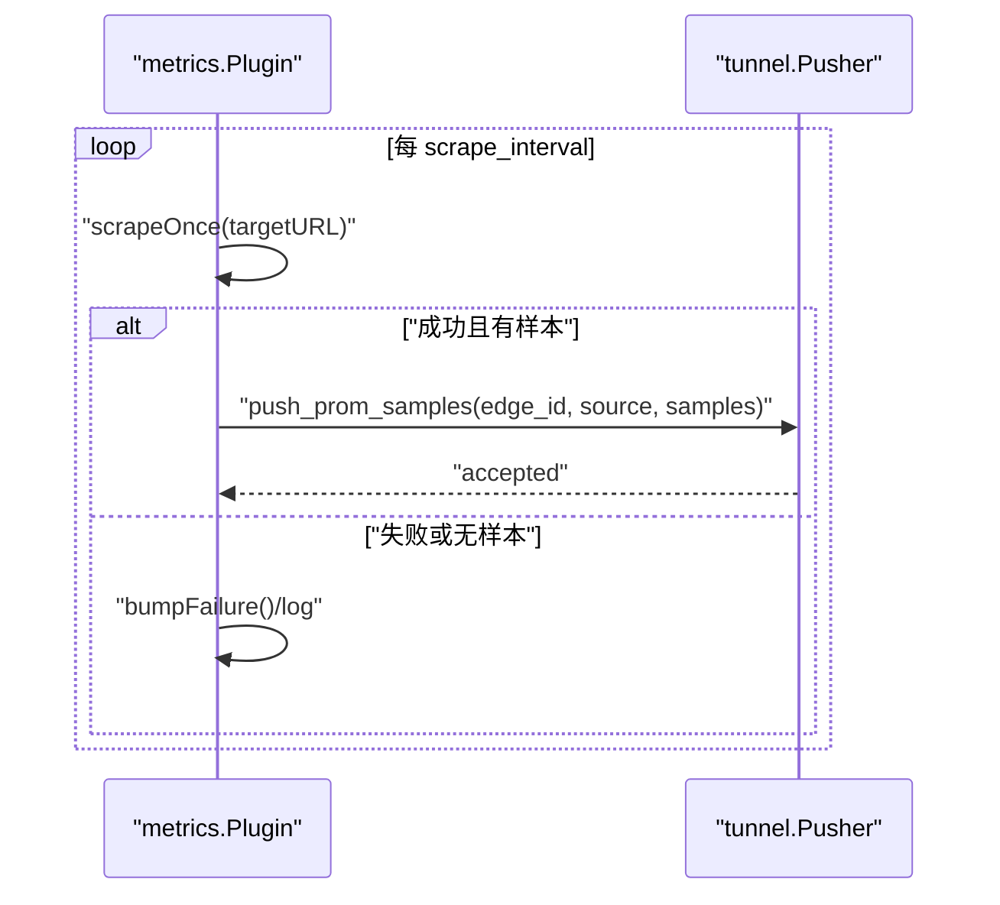
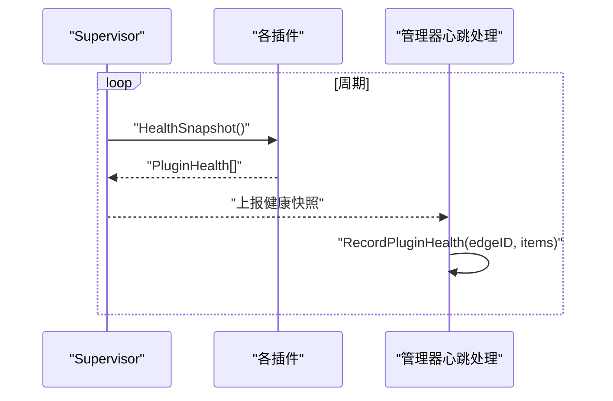
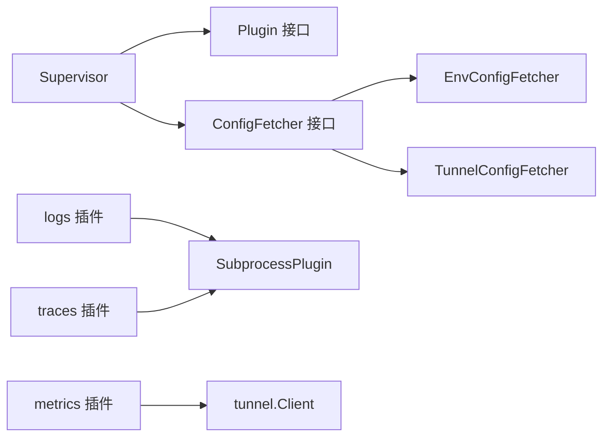

# 插件生命周期管理

<cite>
**本文引用的文件**   
- [supervisor.go](file://internal/edgeagent/plugins/supervisor.go)
- [plugin.go](file://internal/edgeagent/plugins/plugin.go)
- [subprocess.go](file://internal/edgeagent/plugins/subprocess.go)
- [config_env.go](file://internal/edgeagent/plugins/config_env.go)
- [config_tunnel.go](file://internal/edgeagent/plugins/config_tunnel.go)
- [metrics/plugin.go](file://internal/edgeagent/plugins/metrics/plugin.go)
- [logs/plugin.go](file://internal/edgeagent/plugins/logs/plugin.go)
- [traces/plugin.go](file://internal/edgeagent/plugins/traces/plugin.go)
- [plugin_health.go](file://internal/manager/biz/edge/plugin_health.go)
</cite>

## 目录
1. [简介](#简介)
2. [项目结构](#项目结构)
3. [核心组件](#核心组件)
4. [架构总览](#架构总览)
5. [详细组件分析](#详细组件分析)
6. [依赖关系分析](#依赖关系分析)
7. [性能与可扩展性](#性能与可扩展性)
8. [故障排查指南](#故障排查指南)
9. [结论](#结论)
10. [附录：开发接口规范与最佳实践](#附录开发接口规范与最佳实践)

## 简介
本文件聚焦于边缘侧插件的生命周期管理，覆盖注册、初始化、启动、运行、配置更新与停止等阶段；阐述 Supervisor 如何协调插件状态转换、插件发现机制、状态同步与冲突解决；解释配置的语义比较算法以及何时触发重新配置或重启；说明健康检查机制（存活探针、指标采集、异常恢复策略）；并提供插件开发接口规范、最佳实践与常见问题解决方案。

## 项目结构
插件子系统位于 internal/edgeagent/plugins 下，采用“接口 + 通用实现 + 具体插件”的分层组织方式：
- 接口与公共类型：定义 Plugin 接口、PluginConfig、PluginHealth、ConfigFetcher 等
- 通用运行时：Supervisor 负责调度与状态机；SubprocessPlugin 提供子进程插件的通用能力
- 配置来源：EnvConfigFetcher（环境变量）、TunnelConfigFetcher（通过隧道从管理器拉取）
- 具体插件：metrics（进程内）、logs（promtail 子进程）、traces（otelcol-contrib 子进程）等

图表来源
- [plugin.go:1-119](file://internal/edgeagent/plugins/plugin.go#L1-L119)
- [supervisor.go:1-276](file://internal/edgeagent/plugins/supervisor.go#L1-L276)
- [subprocess.go:1-318](file://internal/edgeagent/plugins/subprocess.go#L1-L318)
- [config_env.go:1-101](file://internal/edgeagent/plugins/config_env.go#L1-L101)
- [config_tunnel.go:1-138](file://internal/edgeagent/plugins/config_tunnel.go#L1-L138)
- [metrics/plugin.go:1-306](file://internal/edgeagent/plugins/metrics/plugin.go#L1-L306)
- [logs/plugin.go:1-54](file://internal/edgeagent/plugins/logs/plugin.go#L1-L54)
- [traces/plugin.go:1-48](file://internal/edgeagent/plugins/traces/plugin.go#L1-L48)

章节来源
- [plugin.go:1-119](file://internal/edgeagent/plugins/plugin.go#L1-L119)
- [supervisor.go:1-276](file://internal/edgeagent/plugins/supervisor.go#L1-L276)

## 核心组件
- Plugin 接口：统一描述插件生命周期方法 Name/Configure/Start/Stop/HealthSnapshot，并定义状态与告警字段
- Supervisor：维护插件注册表、当前配置快照与运行态，周期性 reconcile 以对齐期望与实际
- SubprocessPlugin：为外部二进制（如 promtail、otelcol）提供统一的配置渲染、进程管理、崩溃指数退避重启与健康上报
- ConfigFetcher：抽象配置来源，支持环境变量与隧道拉取两种实现，后者具备离线回退
- 具体插件：
  - metrics：进程内抓取本地 /metrics 并通过隧道 RPC 推送
  - logs：渲染 Promtail 配置并启动其子进程
  - traces：渲染 OTel Collector 配置并启动其子进程

章节来源
- [plugin.go:18-119](file://internal/edgeagent/plugins/plugin.go#L18-L119)
- [supervisor.go:36-133](file://internal/edgeagent/plugins/supervisor.go#L36-L133)
- [subprocess.go:32-102](file://internal/edgeagent/plugins/subprocess.go#L32-L102)
- [config_env.go:32-71](file://internal/edgeagent/plugins/config_env.go#L32-L71)
- [config_tunnel.go:22-108](file://internal/edgeagent/plugins/config_tunnel.go#L22-L108)
- [metrics/plugin.go:64-142](file://internal/edgeagent/plugins/metrics/plugin.go#L64-L142)
- [logs/plugin.go:27-53](file://internal/edgeagent/plugins/logs/plugin.go#L27-L53)
- [traces/plugin.go:31-47](file://internal/edgeagent/plugins/traces/plugin.go#L31-L47)

## 架构总览
Supervisor 在独立 goroutine 中运行，按固定间隔或收到重载信号时执行一次 reconcile：
- 从 ConfigFetcher 获取期望配置快照
- 对比每个已注册插件的“上次应用配置”和“上次运行状态”
- 根据差异决定 Configure/Start/Stop 的顺序与条件
- 对运行中的插件定期收集 HealthSnapshot 上报给管理器

图表来源
- [supervisor.go:114-230](file://internal/edgeagent/plugins/supervisor.go#L114-L230)
- [plugin.go:108-119](file://internal/edgeagent/plugins/plugin.go#L108-L119)

章节来源
- [supervisor.go:114-230](file://internal/edgeagent/plugins/supervisor.go#L114-L230)

## 详细组件分析

### Supervisor：状态机与协调器
- 职责
  - 维护插件注册表、当前配置与运行态
  - 周期性 reconcile，保证实际与期望一致
  - 安全关闭：在退出时对所有运行中插件执行 Stop
- 关键流程
  - Run：初始 apply → 循环监听 ctx.Done/reloadSignal/ticker
  - reconcile：Fetch → diff → Configure/Start/Stop
  - shutdown：遍历所有插件 Stop
- 并发与幂等
  - Register 应在 Run 之前调用
  - Start/Stop 需幂等，避免重复启停
  - 单例通道合并多次 TriggerReload 信号

图表来源
- [supervisor.go:114-133](file://internal/edgeagent/plugins/supervisor.go#L114-L133)
- [supervisor.go:232-251](file://internal/edgeagent/plugins/supervisor.go#L232-L251)

章节来源
- [supervisor.go:36-133](file://internal/edgeagent/plugins/supervisor.go#L36-L133)
- [supervisor.go:135-230](file://internal/edgeagent/plugins/supervisor.go#L135-L230)
- [supervisor.go:232-251](file://internal/edgeagent/plugins/supervisor.go#L232-L251)

### 配置来源与发现机制
- EnvConfigFetcher
  - 从环境变量读取每插件配置，未知插件名忽略
  - EdgeID 来自全局变量，AUTH_USER/AUTH_PASS 可回退到隧道凭据
- TunnelConfigFetcher
  - 通过隧道 RPC 拉取 per-edge 配置
  - 失败时回退到 EnvConfigFetcher，确保冷启动/网络分区时仍可维持合理默认
  - 仅接受已知插件名的配置项，防止越权注入
- 插件发现
  - 由上层 main 将各插件实例 Register 到 Supervisor
  - Fetcher 返回的 map 键即为插件名，缺失视为禁用

图表来源
- [plugin.go:108-119](file://internal/edgeagent/plugins/plugin.go#L108-L119)
- [config_env.go:32-71](file://internal/edgeagent/plugins/config_env.go#L32-L71)
- [config_tunnel.go:22-108](file://internal/edgeagent/plugins/config_tunnel.go#L22-L108)

章节来源
- [config_env.go:46-71](file://internal/edgeagent/plugins/config_env.go#L46-L71)
- [config_tunnel.go:58-108](file://internal/edgeagent/plugins/config_tunnel.go#L58-L108)

### 配置语义比较与重配/重启策略
- 语义相等判断 configEqual
  - 比较 Enabled、EdgeID、Endpoint、AuthUser、AuthPass
  - 比较 Spec 的键值集合与内容（浅比较，适用于小规格）
- 决策规则
  - 未启用或未声明：若正在运行则 Stop
  - 启用且配置变化：先 Configure，再 Stop+Start
  - 首次启用：Configure + Start
  - 仅运行态变化：Start/Stop 即可
- 注意
  - Configure 失败不会中断其他插件的重平衡
  - Stop/Start 均带超时保护，避免阻塞

图表来源
- [supervisor.go:175-229](file://internal/edgeagent/plugins/supervisor.go#L175-L229)
- [supervisor.go:253-275](file://internal/edgeagent/plugins/supervisor.go#L253-L275)

章节来源
- [supervisor.go:175-229](file://internal/edgeagent/plugins/supervisor.go#L175-L229)
- [supervisor.go:253-275](file://internal/edgeagent/plugins/supervisor.go#L253-L275)

### 子进程插件通用实现（SubprocessPlugin）
- 功能
  - 渲染配置到工作目录文件
  - 启动子进程并将 stdout/stderr 写入日志文件
  - 崩溃后指数退避重启（上限 5 分钟），RestartCount 单调递增
  - 优雅停止：SIGTERM + WaitDelay 回退 SIGKILL
- 健康信息
  - State/LastError/PID/StartedAt/UpdatedAt 随运行状态更新
- 适用场景
  - logs（promtail）、traces（otelcol-contrib）等外部二进制

图表来源
- [subprocess.go:32-102](file://internal/edgeagent/plugins/subprocess.go#L32-L102)
- [plugin.go:25-52](file://internal/edgeagent/plugins/plugin.go#L25-L52)

章节来源
- [subprocess.go:107-183](file://internal/edgeagent/plugins/subprocess.go#L107-L183)
- [subprocess.go:194-235](file://internal/edgeagent/plugins/subprocess.go#L194-L235)
- [subprocess.go:237-287](file://internal/edgeagent/plugins/subprocess.go#L237-L287)

### 进程内插件：metrics
- 行为
  - 解析 spec（目标 URL、抓取间隔/超时、TLS、Bearer Token、额外标签）
  - 立即执行一次抓取，随后按间隔循环
  - 通过隧道 RPC 推送样本，边 ID 延迟可用时会跳过并重试
- 健康
  - 统计抓取次数与失败次数，失败时 LastError 非空
  - 无 PID（进程内）

图表来源
- [metrics/plugin.go:184-282](file://internal/edgeagent/plugins/metrics/plugin.go#L184-L282)

章节来源
- [metrics/plugin.go:109-142](file://internal/edgeagent/plugins/metrics/plugin.go#L109-L142)
- [metrics/plugin.go:184-282](file://internal/edgeagent/plugins/metrics/plugin.go#L184-L282)

### 子进程插件：logs 与 traces
- logs
  - 渲染 Promtail 配置文件，指定 positions 文件路径以保持位置持久化
  - 启动 promtail 子进程，数据直推 manager nginx Loki 端点
- traces
  - 渲染 otelcol-contrib 配置，启动子进程接收 OTLP 并直推 manager nginx Traces 端点

章节来源
- [logs/plugin.go:27-53](file://internal/edgeagent/plugins/logs/plugin.go#L27-L53)
- [traces/plugin.go:31-47](file://internal/edgeagent/plugins/traces/plugin.go#L31-L47)

### 健康检查与上报
- 边缘侧
  - 每个插件实现 HealthSnapshot，返回名称、状态、错误、重启计数、PID、时间戳等
  - Supervisor 聚合所有插件的健康快照并排序
- 管理器侧
  - 心跳路径接收并存储最近一次健康快照，包含 ReportedAt 用于展示新鲜度
  - 多目标指标插件（如 custommetrics/databasemetrics）可附带 Targets 列表

图表来源
- [supervisor.go:94-110](file://internal/edgeagent/plugins/supervisor.go#L94-L110)
- [plugin_health.go:41-70](file://internal/manager/biz/edge/plugin_health.go#L41-L70)

章节来源
- [supervisor.go:94-110](file://internal/edgeagent/plugins/supervisor.go#L94-L110)
- [plugin_health.go:5-34](file://internal/manager/biz/edge/plugin_health.go#L5-L34)
- [plugin_health.go:41-70](file://internal/manager/biz/edge/plugin_health.go#L41-L70)

## 依赖关系分析
- 松耦合
  - Supervisor 仅依赖 Plugin 接口与 ConfigFetcher 接口，不关心具体实现
  - 具体插件通过 NewSubprocess 或自实现接入
- 外部依赖
  - TunnelClient 用于远程配置拉取与指标推送
  - 文件系统用于渲染配置与日志落盘
- 潜在风险
  - 配置比较使用浅比较，未来若 Spec 结构复杂需引入深度比较
  - 子进程崩溃指数退避上限较大，需结合业务容忍度评估

图表来源
- [supervisor.go:36-82](file://internal/edgeagent/plugins/supervisor.go#L36-L82)
- [plugin.go:108-119](file://internal/edgeagent/plugins/plugin.go#L108-L119)
- [config_env.go:32-71](file://internal/edgeagent/plugins/config_env.go#L32-L71)
- [config_tunnel.go:22-108](file://internal/edgeagent/plugins/config_tunnel.go#L22-L108)
- [subprocess.go:32-102](file://internal/edgeagent/plugins/subprocess.go#L32-L102)
- [metrics/plugin.go:64-102](file://internal/edgeagent/plugins/metrics/plugin.go#L64-L102)

章节来源
- [supervisor.go:36-82](file://internal/edgeagent/plugins/supervisor.go#L36-L82)
- [plugin.go:108-119](file://internal/edgeagent/plugins/plugin.go#L108-L119)

## 性能与可扩展性
- 调度开销
  - 默认 60s 轮询，可通过 SupervisorOpts.ReloadInterval 调整
  - 单次 reconcile 复杂度 O(N)，N 为已注册插件数
- I/O 与资源
  - 子进程插件会写配置与日志文件，建议将 workDir 置于高性能磁盘
  - metrics 插件抓取与推送受网络与目标端点影响，应合理设置超时与间隔
- 扩展建议
  - 新增插件只需实现 Plugin 接口或通过 NewSubprocess 包装
  - 配置比较若涉及嵌套结构，建议替换为深度比较以避免误判

[本节为通用指导，无需源码引用]

## 故障排查指南
- 常见症状与定位
  - 插件未启动：检查是否被禁用或未出现在期望配置中；查看 reconcile 日志
  - 频繁重启：关注子进程崩溃日志与 RestartCount；确认二进制是否存在、权限是否正确
  - 配置未生效：确认 configEqual 判定逻辑，必要时增加日志输出
  - 指标未上报：检查 edge_id 是否为 0（尚未完成注册），或 push 失败原因
- 快速验证步骤
  - 手动触发重载：调用 TriggerReload 观察是否执行 reconcile
  - 查看健康快照：汇总 HealthSnapshots 确认状态与错误信息
  - 检查工作目录：确认配置与日志文件生成路径与内容是否符合预期

章节来源
- [supervisor.go:135-159](file://internal/edgeagent/plugins/supervisor.go#L135-L159)
- [subprocess.go:194-235](file://internal/edgeagent/plugins/subprocess.go#L194-L235)
- [metrics/plugin.go:246-282](file://internal/edgeagent/plugins/metrics/plugin.go#L246-L282)

## 结论
该插件子系统通过清晰的接口与通用实现，实现了跨进程与进程内插件的统一生命周期管理。Supervisor 基于语义化的配置比较与稳健的状态机，保证了在动态配置下发与网络波动下的自愈能力。配合健康上报与指数退避重启策略，系统具备良好的可观测性与稳定性。

[本节为总结，无需源码引用]

## 附录：开发接口规范与最佳实践

### 插件开发接口规范
- 必须实现的接口
  - Name：返回插件名（如 metrics/logs/traces）
  - Configure：校验并保存配置，幂等
  - Start：启动工作（goroutine 或子进程），幂等
  - Stop：优雅停止，幂等
  - HealthSnapshot：返回轻量级健康快照，不可阻塞
- 配置结构
  - PluginConfig：包含 Enabled、EdgeID、Endpoint、AuthUser、AuthPass、Spec
- 健康快照
  - PluginHealth：包含 Name、State、LastError、RestartCount、PID、StartedAt、UpdatedAt、Targets

章节来源
- [plugin.go:18-119](file://internal/edgeagent/plugins/plugin.go#L18-L119)

### 最佳实践
- 幂等设计
  - Start/Stop 必须幂等，避免重复启停导致竞态
- 优雅停止
  - 子进程优先 SIGTERM，并设置 WaitDelay 回退
  - 进程内使用 context 取消，并在 Stop 中等待 goroutine 退出
- 配置变更
  - Configure 只做最小必要变更，避免副作用
  - 若需要热重载，尽量在不重启的情况下完成
- 健康上报
  - HealthSnapshot 只读且不阻塞
  - 对于多目标插件，细化 Targets 级别健康信息
- 错误处理
  - 单个插件错误不应影响其他插件
  - 记录足够上下文（名称、错误、时间戳）以便排障

章节来源
- [supervisor.go:175-229](file://internal/edgeagent/plugins/supervisor.go#L175-L229)
- [subprocess.go:158-183](file://internal/edgeagent/plugins/subprocess.go#L158-L183)
- [metrics/plugin.go:146-168](file://internal/edgeagent/plugins/metrics/plugin.go#L146-L168)